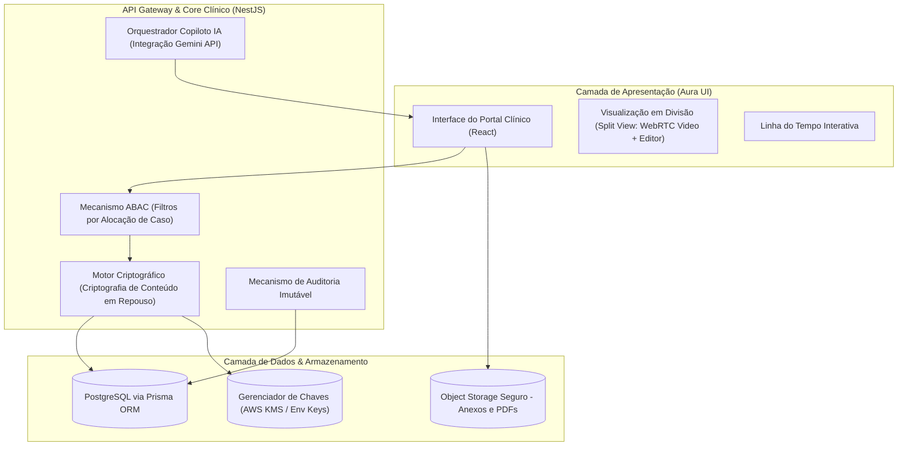
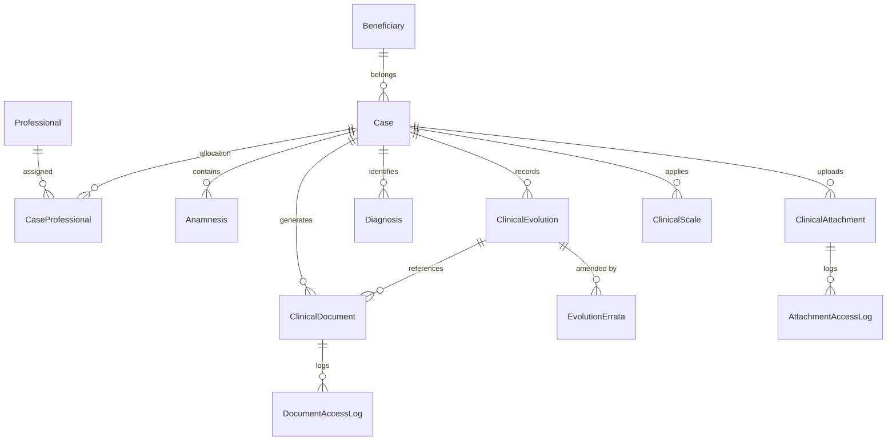
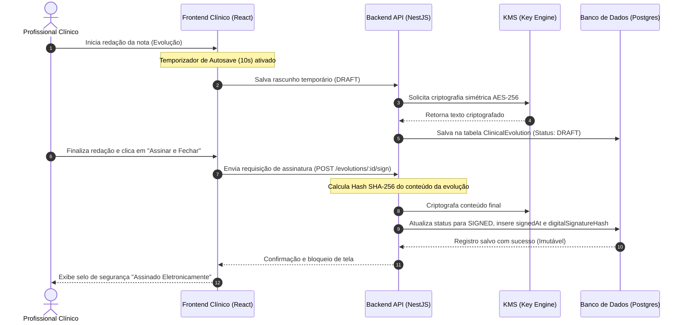

# ESPECIFICAÇÃO COMPLETA — MÓDULO 05: PRONTUÁRIO ELETRÔNICO INTELIGENTE (PEI) E GESTÃO DO HISTÓRICO CLÍNICO
## PROJETO AURA - INSTITUTO SER MELHOR

Este documento oficial descreve a arquitetura funcional, modelo de dados, fluxos de negócio, regras de segurança, matriz de permissões, wireframes, backlog e plano de rollout do núcleo clínico do sistema (PEI), projetado sob regras estritas de sigilo e em conformidade com as normas brasileiras (LGPD, conselhos CFM, CRP, CFESS).

---

## 1. Arquitetura Funcional do Módulo

O Prontuário Eletrônico Inteligente (PEI) é organizado em camadas e subsistemas integrados por APIs seguras REST/GraphQL, preservando o desacoplamento e garantindo o princípio do privilégio mínimo (*need-to-know basis*):



### Detalhes das Camadas
- **Camada de Apresentação**: React SPA contendo uma linha do tempo única, navegação por abas com foco em redução de carga cognitiva (Focus Mode) e visualização de teleconsulta dividida (Split-Screen).
- **Mecanismo ABAC (Attribute-Based Access Control)**: Middleware NestJS que valida em tempo real se o profissional possui caso ativo (`CaseProfessional`) para o beneficiário. Caso contrário, restringe o acesso.
- **Motor Criptográfico**: Criptografa dados clínicos sensíveis (`chief_complaint`, `clinical_evolution.content`, `erratas`) antes da gravação no PostgreSQL usando AES-256-GCM.
- **Copiloto IA**: Integrado por meio da API do Gemini para auxiliar na estruturação de registros (SOAP), síntese histórica e busca semântica, sem jamais salvar dados sem ação explícita do terapeuta.

---

## 2. Regras de Negócio Completas (RN)

### RN01: Sigilo e Compartilhamento Multidisciplinar (*Need-to-Know*)
- O material clínico de psicologia ou psiquiatria é **estritamente sigiloso** e restrito ao autor do registro e profissionais ativos no caso.
- Para atuação integrada, o profissional pode redigir um "Sumário de Evolução Compartilhada" (visibilidade: `SHARED_WITH_CASE_TEAM`), que é legível para assistentes sociais e advogados vinculados ao mesmo caso.

### RN02: Protocolo de Acesso Excepcional (*Break-Glass*)
- Usuários autorizados (ex: Coordenadores Clínicos) podem solicitar acesso a prontuários de casos que não coordenam diretamente diante de emergências graves (ex: risco iminente de autoextermínio ou ordem judicial).
- O sistema exige uma justificativa textual detalhada, gera um alerta imediato de segurança por e-mail/notificação à diretoria e cria um registro imutável e inalterável no banco de auditoria (`SecurityAuditLog`).

### RN03: Imutabilidade de Registros Clínicos
- Após a assinatura eletrônica de uma Evolução Clínica ou Anamnese, o registro é **bloqueado para edição ou exclusão permanente**.
- Erros de digitação ou mudanças na conduta clínica devem ser corrigidos exclusivamente por meio de **Erratas Apendiculares** vinculadas ao registro original, preservando o histórico de versões.

### RN04: Autosave e Proteção contra Perda de Dados
- Enquanto o profissional digita no editor de texto, o sistema cria rascunhos automáticos locais (a cada 10 segundos) classificados como `DRAFT`.
- Se o usuário tentar fechar a aba ou janela com rascunhos ativos, o navegador dispara um alerta interceptador (*BeforeUnloadEvent*).

### RN05: Retenção e Descarte de Documentos (LGPD)
- Prontuários físicos/eletrônicos devem ser conservados pelo prazo mínimo de **20 anos** a partir do último registro (conforme Art. 12 da Lei nº 13.787/2018).
- Arquivos de anexos de exames externos podem possuir um tempo de retenção customizado definido no momento do upload.

---

## 3. Modelo do Banco de Dados (Prisma Schema)

O esquema do banco de dados estende a estrutura existente do Prisma. Abaixo estão as tabelas clínicas adicionais e seus relacionamentos:

```prisma
// =========================================================================
// MÓDULO 05: PRONTUÁRIO ELETRÔNICO INTELIGENTE (PEI) E GESTÃO CLÍNICA
// =========================================================================

model Anamnesis {
  id                String       @id @default(uuid())
  caseId            String
  beneficiaryId     String
  professionalId    String       // Profissional que realizou o preenchimento
  chiefComplaint    String       // Queixa principal (Criptografada)
  historyPersonal   String?      // Histórico Pessoal (Criptografada)
  historyFamily     String?      // Histórico Familiar (Criptografada)
  historySocial     String?      // Histórico Social/Econômico (Criptografada)
  historySchool     String?      // Histórico Escolar (Criptografada)
  historyOcupational String?     // Histórico Ocupacional (Criptografada)
  medicinesAlergies String?      // Uso de Medicamentos / Alergias (Criptografada)
  structuredData    Json?        // Armazena campos customizáveis ou escores aplicados
  status            String       @default("DRAFT") // DRAFT, FINALIZED
  version           Int          @default(1)
  createdAt         DateTime     @default(now())
  finalizedAt       DateTime?
  
  case              Case         @relation(fields: [caseId], references: [id], onDelete: Cascade)
  beneficiary       Beneficiary  @relation(fields: [beneficiaryId], references: [id], onDelete: Cascade)
  professional      Professional @relation(fields: [professionalId], references: [id])
}

model ClinicalEvolution {
  id                  String             @id @default(uuid())
  caseId              String
  beneficiaryId       String
  professionalId      String             // Autor da nota clínica
  appointmentId       String?            // Vínculo opcional com agendamento
  clinicalDate        DateTime           // Data e hora real da sessão
  durationMinutes     Int
  modality            String             // ONLINE, IN_PERSON, HYBRID
  contentEncrypted    String             // Conteúdo rico da sessão criptografado
  summary             String?            // Resumo de visibilidade pública/compartilhada
  formatType          String             @default("FREE_TEXT") // FREE_TEXT, SOAP
  visibility          String             @default("PRIVATE_TO_AUTHOR") // PRIVATE_TO_AUTHOR, SHARED_WITH_CASE_TEAM, GLOBAL_CLINICAL
  status              String             @default("DRAFT") // DRAFT, SIGNED, AMENDED
  digitalSignatureHash String?
  signatureMetadata   Json?              // IP, timestamp e certificado utilizado
  signedAt            DateTime?
  createdAt           DateTime           @default(now())
  updatedAt           DateTime           @updatedAt

  case                Case               @relation(fields: [caseId], references: [id], onDelete: Cascade)
  beneficiary         Beneficiary        @relation(fields: [beneficiaryId], references: [id], onDelete: Cascade)
  professional        Professional       @relation(fields: [professionalId], references: [id])
  appointment         Appointment?       @relation(fields: [appointmentId], references: [id])
  erratas             EvolutionErrata[]
  documents           ClinicalDocument[]
}

model EvolutionErrata {
  id                      String            @id @default(uuid())
  evolutionId             String
  professionalId          String
  correctionTextEncrypted String
  justification           String
  digitalSignatureHash    String?
  createdAt               DateTime          @default(now())

  evolution               ClinicalEvolution @relation(fields: [evolutionId], references: [id], onDelete: Cascade)
  professional            Professional      @relation(fields: [professionalId], references: [id])
}

model Diagnosis {
  id                   String       @id @default(uuid())
  caseId               String
  beneficiaryId        String
  professionalId       String
  classificationSystem String       // CID_10, CID_11, DSM_5
  code                 String       // Ex: F41.1
  description          String       // Transtorno de ansiedade generalizada
  diagnosticStatus     String       @default("ACTIVE") // ACTIVE, RESOLVED, RULED_OUT
  clinicalNotes        String?
  createdAt            DateTime     @default(now())
  resolvedAt           DateTime?

  case                 Case         @relation(fields: [caseId], references: [id], onDelete: Cascade)
  beneficiary          Beneficiary  @relation(fields: [beneficiaryId], references: [id], onDelete: Cascade)
  professional         Professional @relation(fields: [professionalId], references: [id])
}

model ClinicalDocument {
  id                   String              @id @default(uuid())
  caseId               String
  beneficiaryId        String
  professionalId       String
  evolutionId          String?
  type                 String              // PRESCRIPTION, ATTESTATION, REPORT, DECLARATION, FORWARDING, THERAPEUTIC_PLAN
  title                String
  contentEncrypted     String
  digitalSignatureHash String?
  signedAt             DateTime?
  pdfUrl               String?             // Link para bucket S3 privado
  status               String              @default("DRAFT") // DRAFT, SIGNED, REVOKED
  version              Int                 @default(1)
  createdAt            DateTime            @default(now())
  updatedAt            DateTime            @updatedAt

  case                 Case                @relation(fields: [caseId], references: [id], onDelete: Cascade)
  beneficiary          Beneficiary         @relation(fields: [beneficiaryId], references: [id], onDelete: Cascade)
  professional         Professional        @relation(fields: [professionalId], references: [id])
  evolution            ClinicalEvolution?  @relation(fields: [evolutionId], references: [id])
  accessLogs           DocumentAccessLog[]
}

model ClinicalAttachment {
  id             String                 @id @default(uuid())
  caseId         String
  beneficiaryId  String
  professionalId String
  title          String
  documentType   String                 // EXAM_RESULT, EXTERNAL_REPORT, PATIENT_ART, CONSENT_FORM, OTHER
  fileS3Key      String                 // Caminho privado no S3
  mimeType       String
  fileSize       Int
  visibility     String                 @default("PRIVATE_TO_AUTHOR") // PRIVATE_TO_AUTHOR, SHARED_WITH_CASE_TEAM
  uploadedAt     DateTime               @default(now())
  retentionUntil DateTime?

  case           Case                   @relation(fields: [caseId], references: [id], onDelete: Cascade)
  beneficiary    Beneficiary            @relation(fields: [beneficiaryId], references: [id], onDelete: Cascade)
  professional   Professional           @relation(fields: [professionalId], references: [id])
  accessLogs     AttachmentAccessLog[]
}

model DocumentAccessLog {
  id             String           @id @default(uuid())
  documentId     String
  professionalId String
  action         String           // VIEW, DOWNLOAD, EXPORT, PRINT
  justification  String?          // Justificativa se for acesso via break-glass
  ipAddress      String
  userAgent      String
  timestamp      DateTime         @default(now())

  document       ClinicalDocument @relation(fields: [documentId], references: [id], onDelete: Cascade)
  professional   Professional     @relation(fields: [professionalId], references: [id])
}

model AttachmentAccessLog {
  id             String             @id @default(uuid())
  attachmentId   String
  professionalId String
  action         String             // VIEW, DOWNLOAD
  justification  String?
  ipAddress      String
  userAgent      String
  timestamp      DateTime           @default(now())

  attachment     ClinicalAttachment @relation(fields: [attachmentId], references: [id], onDelete: Cascade)
  professional   Professional       @relation(fields: [professionalId], references: [id])
}

model ClinicalScale {
  id             String       @id @default(uuid())
  caseId         String
  beneficiaryId  String
  professionalId String
  scaleName      String       // GAD-7, PHQ-9, BECK, SOCIAL_SCREENING
  version        String
  score          Int
  answers        Json         // Contém as respostas em formato estruturado
  interpretation String
  appliedAt      DateTime     @default(now())

  case           Case         @relation(fields: [caseId], references: [id], onDelete: Cascade)
  beneficiary    Beneficiary  @relation(fields: [beneficiaryId], references: [id], onDelete: Cascade)
  professional   Professional @relation(fields: [professionalId], references: [id])
}

model SecurityAuditLog {
  id             String   @id @default(uuid())
  actorId        String
  actorName      String
  role           String
  action         String   // BREAK_GLASS_OVERRIDE, UNAUTHORIZED_ACCESS_ATTEMPT, READ_RECORD, SIGN_RECORD, EXPORT_RECORD
  targetEntity   String   // BENEFICIARY, EVOLUTION, DOCUMENT, ATTACHMENT
  targetEntityId String
  justification  String?
  ipAddress      String
  userAgent      String
  timestamp      DateTime @default(now())
}
```

---

## 4. Diagramas de Fluxo e Arquitetura

### 4.1. Diagrama ER (Modelo Conceitual Relacional)



### 4.2. Fluxo de Criação e Evolução Clínica (Notas de Sessão)



---

## 5. Fluxos Detalhados dos Subsistemas

### 5.1. Fluxo de Emissão de Documentos Clínicos
1. **Escolha de Template**: O profissional escolhe o tipo de documento (Receita, Atestado, Laudo, Encaminhamento).
2. **Preenchimento e IA**: O profissional pode redigir livremente ou solicitar auxílio da IA para estruturação formal.
3. **Assinatura Eletrônica**:
   - **Simples/Avançada**: Autenticação com credenciais do portal, gerando o hash do documento.
   - **Qualificada (ICP-Brasil)**: Integração com token/certificado (ex: A1, A3 ou em nuvem via assinadores parceiros). O PDF é assinado de forma compatível com a Infraestrutura de Chaves Públicas Brasileira.
4. **Armazenamento**: O PDF assinado é salvo em um bucket S3 privado e suas chaves de metadados inseridas na tabela `ClinicalDocument`.
5. **Auditoria**: O log grava a ação de criação. Qualquer visualização ou download gera um registro na tabela `DocumentAccessLog`.

### 5.2. Fluxo de Anexação de Arquivos Seguros
1. **Upload Request**: O profissional solicita o upload de um anexo enviando metadados (Título, Tamanho, MimeType).
2. **Pre-signed URL**: O backend gera uma URL pré-assinada do AWS S3 com tempo de expiração de 2 minutos e a envia ao frontend.
3. **Upload Direto**: O frontend realiza o upload do arquivo diretamente ao S3 privado.
4. **Validação de Conteúdo**: O bucket altera uma trigger para verificação de vírus (AWS GuardDuty / Antivírus) e valida o mime-type do anexo.
5. **Registro de Metadados**: O backend insere na tabela `ClinicalAttachment` a chave de armazenamento, tamanho e as permissões de acesso.

---

## 6. Matriz de Permissões (RBAC / ABAC)

| Perfil de Acesso | Acesso à Ficha de Rosto (Sociodemográfica) | Criar/Visualizar Anamnese | Criar Nota Terapêutica (Evolução) | Visualizar Histórico Clínico do Caso | Emitir Atestados / Laudos | Acesso via Break-Glass | Visualizar Logs de Auditoria |
| :--- | :---: | :---: | :---: | :---: | :---: | :---: | :---: |
| **Super Admin** | Sim | Não | Não | Não | Não | Sim (Com justificativa) | Sim |
| **Coordenador Clínico** | Sim | Sim | Sim (Se no caso) | Sim (De toda a sua equipe) | Sim | Sim (Com justificativa) | Sim |
| **Psicólogo Voluntário** | Sim | Sim (Se no caso) | Sim (Se no caso) | Sim (Se alocado no caso) | Sim (Apenas laudos/declarações) | Não | Não |
| **Psiquiatra Voluntário** | Sim | Sim (Se no caso) | Sim (Se no caso) | Sim (Se alocado no caso) | Sim (Receitas controladas/laudos) | Não | Não |
| **Assistente Social** | Sim | Sim (Se no caso) | Sim (Se no caso - Social) | Sim (Apenas resumos compartilhados) | Sim (Apenas relatórios sociais) | Não | Não |
| **Profissional Externo** | Sim (Se autoriz.) | Não | Não | Não | Não | Não | Não |

---

## 7. Interfaces e Wireframes (ASCII / Mermaid Structural UI)

### 7.1. Estrutura Geral do Prontuário Multidisciplinar (Desktop View)

```
+---------------------------------------------------------------------------------------------------+
|  [Logo Aura]  Dashboard | Beneficiários | Agenda | Profissionais | Mensagens | Configurações      |
+---------------------------------------------------------------------------------------------------+
|  <- Voltar para Beneficiários  |  ANA SILVA SANTOS - 32 anos - Projeto: Acolher Saúde Mental      |
|  Status: Em Acompanhamento     |  Classificação: [Risco Alto - Vermelho]                          |
+---------------------------------------------------------------------------------------------------+
|  [ Ficha Sociodemográfica ] [ Contato/Emergência: Maria (Mãe) - 11 91234-5678 ]                 |
+---------------------------------------------------------------------------------------------------+
| [ Abas de Navegação ]                                                                             |
|  [x] Linha do Tempo | [ ] Anamnese | [ ] Evoluções | [ ] Documentos | [ ] Escalas | [ ] Auditoria |
+---------------------------------------------------------------------------------------------------+
|  Pesquisa Instantânea: [ Buscar palavras-chave, CID ou condutas...              ] [Filtro Avançado]|
+---------------------------------------------------------------------------------------------------+
|  LINHA DO TEMPO CRONOLÓGICA (TIMELINE)                                                            |
|                                                                                                   |
|  [28/06/2026 14:00] - Teleconsulta Realizada (Dra. Roberta - Psicologia)                          |
|                       | -> Evolução Clínica: [Assinada - Ver Detalhes]                            |
|                       | -> Escala Aplicada: GAD-7 (Score: 14 - Ansiedade Moderada-Grave)          |
|                                                                                                   |
|  [21/06/2026 15:30] - Documento Emitido (Dr. Carlos - Psiquiatria)                                |
|                       | -> Receituário Especial: Fluoxetina 20mg [Ver PDF]                        |
|                                                                                                   |
|  [14/06/2026 10:00] - Triagem e Acolhimento Social (Aline Santos - Serviço Social)                 |
|                       | -> Anamnese Inicial v1 Registrada. Vulnerabilidade: Violência Doméstica   |
|                                                                                                   |
+---------------------------------------------------------------------------------------------------+
```

### 7.2. Tela de Teleconsulta + Registro Clínico (Split-Screen View)

Ao iniciar uma teleconsulta pelo Portal Clínico, a tela é dividida horizontal ou verticalmente para evitar que o profissional alterne janelas durante o atendimento:

```
+------------------------------------------+------------------------------------------+
|            VIDEO TELECONSULTA            |           PRONTUÁRIO CLÍNICO             |
|                                          |                                          |
|                                          |  Paciente: Ana Silva Santos              |
|                                          |  Aba Ativa: [ Registro de Evolução SOAP ]|
|  +------------------------------------+  |                                          |
|  |                                    |  |  S: (Subjetivo) - Paciente relata...     |
|  |                                    |  |  [                                    ]  |
|  |                                    |  |  O: (Objetivo) - Orientada, ansiosa...   |
|  |             PACIENTE               |  |  [                                    ]  |
|  |                                    |  |  A: (Avaliação) - Crises reduzidas...    |
|  |                                    |  |  [                                    ]  |
|  |                                    |  |  P: (Plano) - Manter sessões...          |
|  +------------------------------------+  |  [                                    ]  |
|                                          |                                          |
|  [ Mutar Mic ] [ Mutar Video ] [ Sair ]  |  [ Copiloto Gemini: Gerar Resumo SOAP ]  |
|                                          |  [ Rascunho salvo às 14:32 ]             |
|                                          |  [ ASSINAR E TRANCAR REGISTRO ]          |
+------------------------------------------+------------------------------------------+
```

---

## 8. Backlog Completo do Módulo (Histórias de Usuário)

### ÉPICO: NÚCLEO CLÍNICO & PEI (Prontuário Eletrônico Inteligente)

#### Feature: Controle de Acesso e Sigilo de Prontuário
- **US 05.01 — Filtro ABAC para Acesso Assistencial**:
  - *Como* Profissional Clínico, *quero* que o sistema valide minha alocação ao Caso do beneficiário antes de liberar o prontuário, *para* proteger a privacidade do paciente contra visualizações indevidas.
  - *Critérios de Aceitação*:
    1. Se o profissional pertencer ao portal `CLINIC` e estiver ativamente alocado ao caso (`CaseProfessional`), retorna `200 OK` com dados clínicos.
    2. Se não estiver alocado ao caso, retorna `403 Forbidden` com mensagem informativa de sigilo.
    3. Tentativas de acessos negados disparam log de segurança do tipo `UNAUTHORIZED_CLINICAL_ACCESS_ATTEMPT`.
- **US 05.02 — Break-Glass para Coordenadores**:
  - *Como* Coordenador Clínico, *quero* ativar o acesso de emergência a um prontuário informando uma justificativa, *para* atender ocorrências graves ou ordens judiciais.
  - *Critérios de Aceitação*:
    1. Apresenta modal exigindo preenchimento de justificativa de no mínimo 20 caracteres.
    2. Registra o evento de acesso emergencial na tabela `SecurityAuditLog`.
    3. Envia e-mail automático ao encarregado de dados (DPO) e diretoria clínica com o nome do ator e a justificativa inserida.

#### Feature: Evolução Clínica e Gestão de Rascunhos
- **US 05.03 — Registro de Evolução e Autosave**:
  - *Como* Profissional de Saúde, *quero* que o sistema salve minhas anotações periodicamente como rascunho enquanto digito, *para* evitar perda de registros em quedas de sinal.
  - *Critérios de Aceitação*:
    1. Dispara autosave a cada 10 segundos, persistindo no banco de dados com status `DRAFT`.
    2. Exibe indicador visual discreto contendo o último horário de salvamento (ex: "Rascunho salvo às 14:15").
    3. Intercepta recarregamento ou fechamento de tela se houver rascunho ativo não assinado.
- **US 05.04 — Assinatura Digital e Imutabilidade**:
  - *Como* Profissional de Saúde, *quero* assinar digitalmente a nota da sessão finalizada, *para* atender às exigências legais e registrar a imutabilidade das notas.
  - *Critérios de Aceitação*:
    1. Ao clicar em "Assinar", bloqueia definitivamente o conteúdo do rascunho original.
    2. Armazena o hash SHA-256 do conteúdo, o carimbo de data/hora do servidor e o certificado/assinatura na base de dados.
    3. Altera o status da evolução para `SIGNED`.

#### Feature: Erratas e Versionamento
- **US 05.05 — Registro de Erratas Clínicas**:
  - *Como* Terapeuta responsável, *quero* adicionar uma errata justificada a uma evolução já fechada, *para* corrigir inconsistências sem violar o histórico de auditoria legal.
  - *Critérios de Aceitação*:
    1. Exibe botão "Adicionar Errata / Adendo" apenas em evoluções com status `SIGNED` ou `AMENDED` de autoria do próprio profissional.
    2. Exige a inserção do texto de correção e a justificativa da mudança.
    3. Exibe o adendo de forma cronológica anexado abaixo do corpo do registro original na Timeline, com indicação clara da data do adendo.

#### Feature: Biblioteca de Escalas e IA
- **US 05.06 — Aplicação e Scoring de Escalas (GAD-7/PHQ-9)**:
  - *Como* Psicólogo ou Psiquiatra, *quero* aplicar escalas de triagem estruturadas aos beneficiários e acompanhar gráficos de evolução temporal dos escores, *para* medir o progresso do tratamento.
  - *Critérios de Aceitação*:
    1. Permite abrir e preencher as escalas clássicas GAD-7 (Ansiedade) e PHQ-9 (Depressão).
    2. Calcula automaticamente a pontuação total e exibe a interpretação clínica correspondente (ex: Ansiedade Grave).
    3. Plota na aba "Escalas" um gráfico linear mostrando a evolução dos escores do beneficiário ao longo do tempo.

---

## 9. Plano de Implementação Incremental

A implementação será dividida em três fases cumulativas de desenvolvimento para assegurar testes profundos de segurança e auditoria em cada etapa:

- **Fase 1: Infraestrutura de Segurança e Banco de Dados (Mapeamento Backend)**
  - Criação das tabelas do EMR no Prisma e geração das migrações do PostgreSQL.
  - Configuração do serviço de chaves criptográficas (AES-256) na API.
  - Ativação do middleware de controle de acessos (ABAC) e logging das trilhas de auditoria.

- **Fase 2: Motor Clínico Core (Fluxo de Notas e Documentos)**
  - Implementação das rotas de rascunho automático (autosave), assinatura digital e erratas.
  - Integração do serviço S3 seguro com URLs pré-assinadas e logs de visualização.

- **Fase 3: Refinamento de Interface, Acessibilidade e Assistência IA (Aura UI)**
  - Implementação do design responsivo com suporte a modo claro e escuro.
  - Integração do Copiloto IA (Gemini API) para geração de resumos e preenchimento de evolução clínica (SOAP).
  - Implementação da tela dividida (Teleconsulta + Prontuário).

---

## 10. Plano de Testes e Validação

### 10.1. Testes Automatizados (Backend)
- **Unitários**:
  - Testar o motor criptográfico: garantir que dados descriptografados coincidem com a entrada e que nenhuma chave fica exposta em logs de exceções.
  - Validar cálculo automático de escalas (GAD-7 e PHQ-9).
- **Integração (NestJS / E2E)**:
  - Tentar acessar a rota `GET /clinic/patients/:id/medical-record` com uma credencial de profissional clínico alocado no caso (Retorna `200 OK`).
  - Tentar acessar a mesma rota com um profissional clínico de outro caso (Retorna `403 Forbidden`).
  - Validar que a rota de assinatura altera o status para `SIGNED` e bloqueia novos `PUT` na evolução correspondente.

### 10.2. Testes de Segurança (Vulnerabilidades e Trilha de Auditoria)
- **Pen Testing de Acesso**: Simular injeção de parâmetros na URL do prontuário para validar se o middleware ABAC impede o vazamento de dados.
- **Teste de Criptografia do DB**: Inspecionar diretamente tabelas do banco de dados para garantir que campos sensíveis (`chiefComplaint`, `contentEncrypted`) estejam ilegíveis sem as chaves da aplicação.
- **Validação de Logs**: Garantir que toda operação sensível (criação, visualização emergencial via break-glass, exportação) grave um log na base de auditoria que seja imutável e inalterável pelo console de administração comum.

### 10.3. Testes de Usabilidade e Acessibilidade (Frontend)
- **WCAG AA Compliance**: Verificar navegabilidade via teclado (uso de tabulação lógica), compatibilidade com leitores de tela e contraste de cores dos botões de ação e alertas de risco.
- **Estresse de Conectividade**: Testar comportamento do Autosave em conexões lentas (3G móvel) ou com oscilações/quedas completas de rede, garantindo que o rascunho persista localmente no IndexedDB como segurança adicional.
