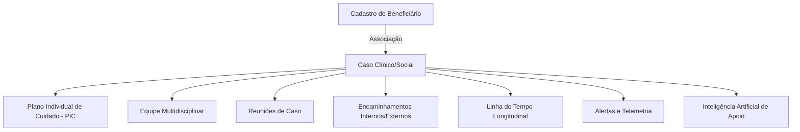
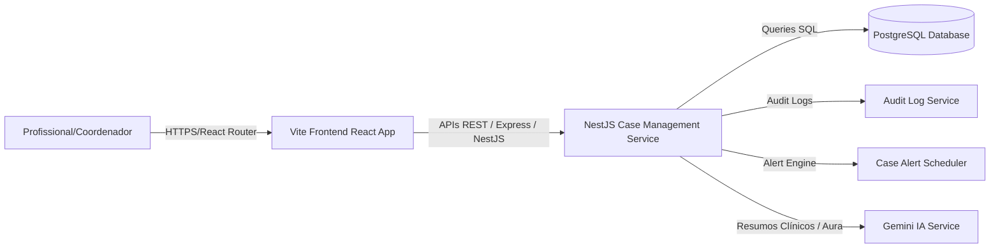
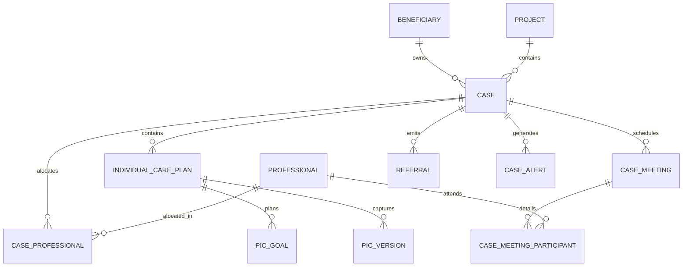
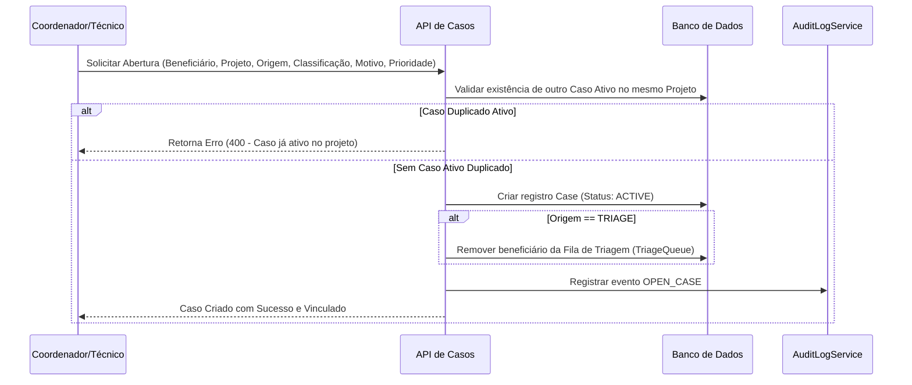
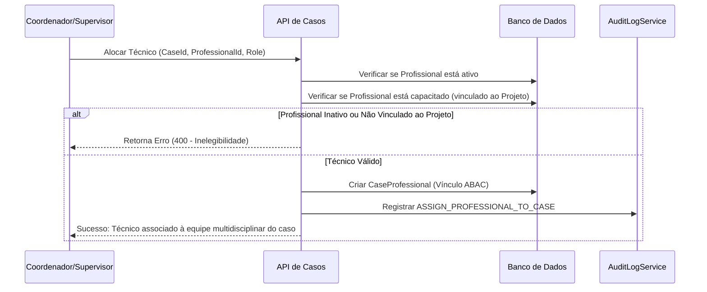
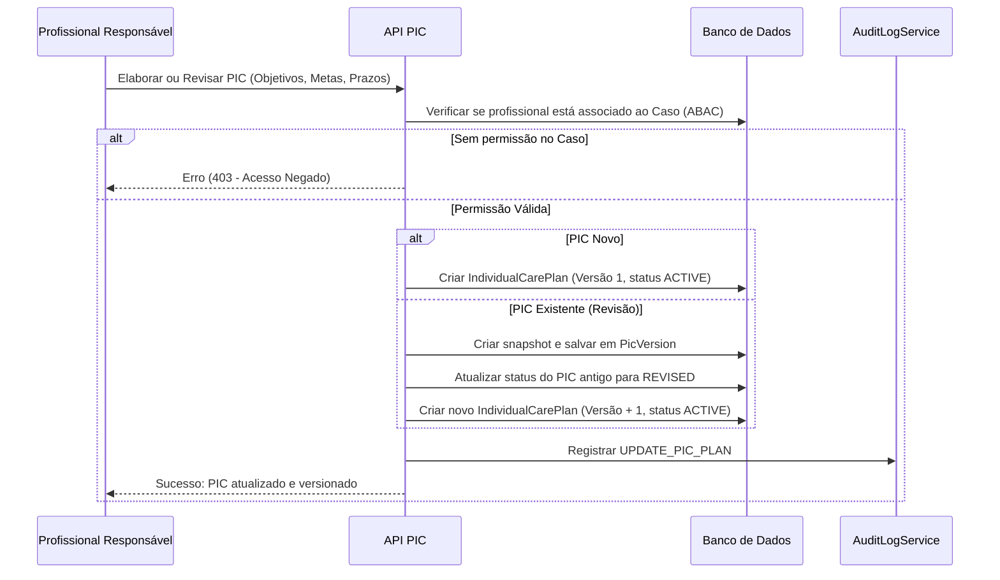
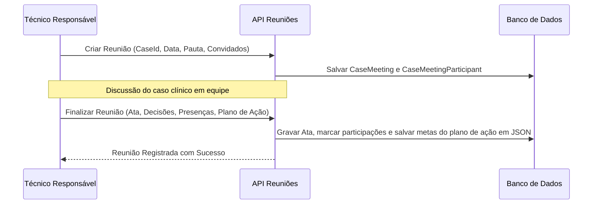
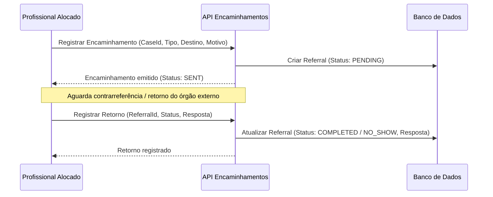
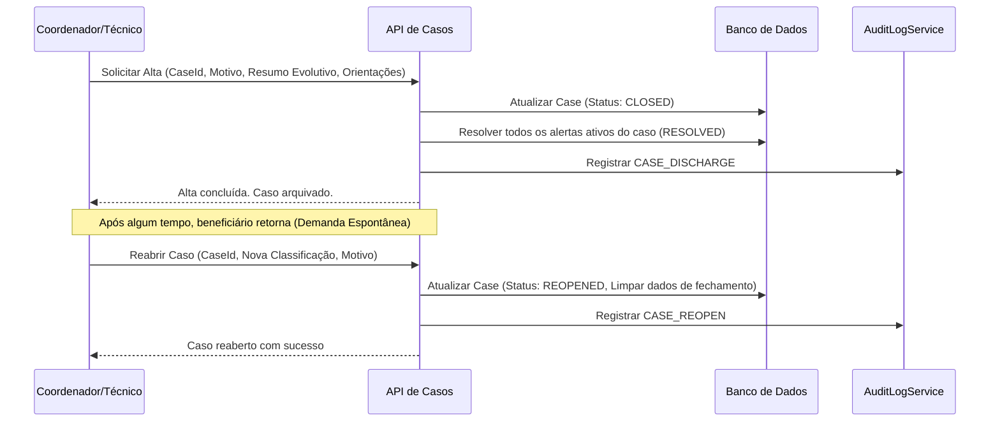

# ESPECIFICAÇÃO TÉCNICA — MÓDULO 06 — GESTÃO INTEGRADA DE CASOS, ACOMPANHAMENTO MULTIDISCIPLINAR E PLANO INDIVIDUAL DE CUIDADO (PIC)
## PROJETO AURA - INSTITUTO SER MELHOR

**Data:** Junho 2026  
**Foco:** Coordenação multidisciplinar, Linha do Tempo Longitudinal, Versionamento do PIC, Sigilo Técnico e Alta/Reabertura de Casos.

---

## 1. ARQUITETURA FUNCIONAL COMPLETA

O módulo de **Gestão Integrada de Casos (GIC)** é o coração da orquestração longitudinal no Instituto Ser Melhor. Ele conecta e coordena os módulos anteriores (Cadastro Mestre, Agenda, Teleconsulta, Prontuário Clínico, Profissionais) sob a perspectiva da jornada integrada do beneficiário.



- **Caso**: Entidade centralizadora que agrupa todas as ações de cuidado de um beneficiário num projeto específico.
- **PIC (Plano Individual de Cuidado)**: Plano de ação evolutivo, contendo objetivos, metas mensuráveis, prazos, responsáveis e histórico de versionamento completo.
- **Equipe Multidisciplinar**: Alocação de profissionais (Psicólogos, Psiquiatras, Assistentes Sociais, Advogados, Pedagogos) com diferentes níveis de permissão e sigilo garantidos por ABAC.
- **Reuniões de Caso**: Registro de pauta, ata e atribuição de tarefas após debates multidisciplinares.
- **Encaminhamentos**: Fluxo de referência e contrarreferência com a rede municipal (CRAS, CREAS, CAPS, hospitais, escolas, etc.).
- **Linha do Tempo**: Consolidado visual de consultas, evoluções, documentos, reuniões e alterações de PIC.

---

## 2. REGRAS DE NEGÓCIO (RNs)

### RN01 — Abertura e Origem do Caso
- Um beneficiário pode possuir mais de um caso simultaneamente, desde que estejam vinculados a projetos sociais distintos (ex: "Acolher Saúde Mental" e "Projeto Mulheres").
- A abertura deve registrar obrigatoriamente: data/hora, profissional que efetuou a abertura, origem (Triagem, Demanda Espontânea, Encaminhamento Interno/Externo, Determinação Judicial, Parceria, Projeto Social), motivo da queixa, projeto vinculado e classificação inicial.

### RN02 — Classificação Parametrizável do Caso
- Casos devem ser classificados com base em categorias configuráveis (ex: Violência Doméstica, Violência Infantil, Sofrimento Psíquico, Luto, Dependência Química, Vulnerabilidade Social).
- Cada classificação pode disparar protocolos e fluxos padrão recomendados na linha do tempo.

### RN03 — Prioridade Dinâmica do Caso
- Níveis de prioridade permitidos: `LOW`, `NORMAL`, `HIGH`, `VERY_HIGH`, `EMERGENTIAL`.
- A prioridade é calculada considerando:
  1. Presença de risco físico ou psicossocial iminente (com base nas escalas aplicadas).
  2. Determinação judicial ou Conselho Tutelar (força maior, prioridade acrescida).
  3. Tempo de espera na fila de triagem.
  4. Idade (prioridade para crianças, adolescentes e idosos).
- Coordenadores podem alterar a prioridade manualmente, desde que forneçam uma justificativa detalhada e obrigatória que constará no histórico do caso.

### RN04 — Plano Individual de Cuidado (PIC) e Versionamento
- Um caso ativo deve possuir apenas **um** PIC ativo (`status: ACTIVE`) por vez.
- O PIC deve conter: objetivos gerais e específicos, responsabilidades/compromissos da família, metas (com prazos, indicadores e profissional responsável).
- Qualquer alteração nos objetivos ou metas gera um snapshot do estado anterior salvo na tabela `PicVersion` e incrementa a versão (`version + 1`).
- O PIC deve ser assinado digitalmente ou autenticado via hash interno pelo profissional que o elaborou/revisou.

### RN05 — Sigilo Profissional e Controle de Acesso (ABAC)
- **Sigilo Clínico**: Psicólogos, Psiquiatras e Médicos têm acesso restrito aos prontuários e evoluções clínicas criptografadas.
- **Autonomia Técnica**: O assistente social e o advogado do caso não visualizam o prontuário clínico detalhado de terapia/psiquiatria, a menos que o profissional clínico defina a visibilidade da evolução como `COMPARTILHADA` (`visibility` em `ClinicalEvolution`) ou haja consentimento expresso.
- **Break-Glass**: Em situações de emergência (risco de morte/violência grave), um coordenador pode acionar o protocolo "Break-Glass" (Override Excepcional de Sigilo). A ação exige justificativa imediata, gera log imutável no `SecurityAuditLog` e notifica os profissionais envolvidos.

### RN06 — Reuniões Multidisciplinares de Caso
- Toda reunião deve registrar a data/hora, pauta discutida, ata e decisões tomadas.
- Deve gerar tarefas pendentes estruturadas em JSON com responsável e prazo definido. Os profissionais participantes devem confirmar presença na ata.

### RN07 — Alta e Reabertura do Caso
- O fechamento do caso (alta) pode ocorrer por: Conclusão do PIC, Solicitação do Beneficiário, Encaminhamento Definitivo para a Rede Pública ou Perda de Vínculo (evasão sem atendimento há mais de 60 dias).
- A alta exige: resumo de evolução (criptografado), resultados alcançados e orientações pós-alta.
- Um caso encerrado (`CLOSED`) pode ser reaberto a qualquer momento mediante nova avaliação social/triagem, herdando o histórico da linha do tempo longitudinal, mas gerando um novo registro de reabertura (`reopenedAt`).

### RN08 — Alertas Inteligentes e Inatividade
- O sistema deve disparar alertas automáticos para:
  1. Caso de alta prioridade sem evolução clínica/social há mais de 15 dias.
  2. Metas do PIC com prazo vencido e status `PENDING` ou `IN_PROGRESS`.
  3. Encaminhamento emitido sem retorno de resultado há mais de 30 dias.
  4. PIC sem revisão clínica há mais de 60 dias.
- Os alertas ativos aparecem nos dashboards dos técnicos alocados e no painel do coordenador.

---

## 3. MODELO DE BANCO DE DADOS (PRISMA ORM)

Os modelos abaixo já estão definidos no arquivo `backend/prisma/schema.prisma` e estruturam o GIC:

```prisma
model Case {
  id                  String               @id @default(uuid())
  beneficiaryId       String
  projectId           String
  status              String               @default("ACTIVE") // ACTIVE, CLOSED, REOPENED, TRANSFERRED
  priority            String               @default("NORMAL") // EMERGENTIAL, VERY_HIGH, HIGH, NORMAL, LOW
  
  // Detalhes de Abertura e Controle
  openedById          String
  origin              String               // TRIAGE, INTERNAL_REFERRAL, EXTERNAL_REFERRAL, SPONTANEOUS_DEMAND, SOCIAL_PROJECT, JUDICIAL_DETERMINATION, INSTITUTIONAL_PARTNERSHIP
  reason              String
  classification      String               // DOMESTIC_VIOLENCE, PSYCHIC_DISTRESS, DEPRESSION, DRUG_DEPENDENCY, SOCIAL_VULNERABILITY, etc.
  
  // Alta e Reabertura
  closedAt            DateTime?
  closedById          String?
  closureReason       String?              // PLAN_COMPLETED, PATIENT_REQUEST, DEF_REFERRAL, LOST_CONTACT, OTHER
  evolutionSummary    String?              // Resumo final do caso para a alta (Criptografado)
  resultsAchieved     String?              // Resultados alcançados
  finalInstructions   String?              // Orientações para pós-alta
  reopenedAt          DateTime?
  reopenedById        String?
  
  createdAt           DateTime             @default(now())
  updatedAt           DateTime             @updatedAt

  // Relações
  beneficiary         Beneficiary          @relation(fields: [beneficiaryId], references: [id])
  project             Project              @relation(fields: [projectId], references: [id])
  assignedProfessionals CaseProfessional[]
  openedBy            Professional         @relation("CasesOpened", fields: [openedById], references: [id])
  closedBy            Professional?        @relation("CasesClosed", fields: [closedById], references: [id])
  reopenedBy          Professional?        @relation("CasesReopened", fields: [reopenedById], references: [id])

  // Relações Clínicas/Sociais
  anamnesis           Anamnesis[]
  evolutions          ClinicalEvolution[]
  diagnoses           Diagnosis[]
  documents           ClinicalDocument[]
  attachments         ClinicalAttachment[]
  scales              ClinicalScale[]

  // Relações do Módulo 06
  individualCarePlans IndividualCarePlan[]
  caseMeetings        CaseMeeting[]
  referrals           Referral[]
  caseAlerts          CaseAlert[]
}

model CaseProfessional {
  caseId              String
  professionalId      String
  role                String               @default("PRIMARY_CLINICIAN") // PRIMARY_CLINICIAN, SUPPORT_CLINICIAN, SOCIAL_WORKER, ADVOCATE, PEDAGOGUE
  assignedAt          DateTime             @default(now())
  
  case                Case                 @relation(fields: [caseId], references: [id], onDelete: Cascade)
  professional        Professional         @relation(fields: [professionalId], references: [id], onDelete: Cascade)
  
  @@id([caseId, professionalId])
}

model IndividualCarePlan {
  id                  String               @id @default(uuid())
  caseId              String
  generalObjectives   String               // Objetivos gerais do cuidado
  specificObjectives  String               // Objetivos específicos do cuidado
  familyCommitments   String?              // Responsabilidades da família/beneficiário
  status              String               @default("ACTIVE") // ACTIVE, COMPLETED, REVISED, SUSPENDED
  version             Int                  @default(1)
  
  createdAt           DateTime             @default(now())
  updatedAt           DateTime             @updatedAt
  signedById          String
  signedAt            DateTime?

  case                Case                 @relation(fields: [caseId], references: [id], onDelete: Cascade)
  signedBy            Professional         @relation(fields: [signedById], references: [id])
  goals               PicGoal[]
  history             PicVersion[]
}

model PicGoal {
  id                  String               @id @default(uuid())
  picId               String
  description         String               // Detalhes da meta
  intervention        String               // Intervenção associada
  indicator           String               // Indicador de sucesso
  targetDate          DateTime
  status              String               @default("PENDING") // PENDING, IN_PROGRESS, ACHIEVED, NOT_ACHIEVED
  responsibleId       String               // Profissional ou beneficiário responsável
  
  createdAt           DateTime             @default(now())
  updatedAt           DateTime             @updatedAt

  pic                 IndividualCarePlan   @relation(fields: [picId], references: [id], onDelete: Cascade)
  responsible         Professional         @relation(fields: [responsibleId], references: [id])
}

model PicVersion {
  id                  String               @id @default(uuid())
  picId               String
  version             Int
  changedById         String
  changeSummary       String
  contentSnapshot     Json                 // Estado completo do PIC em formato JSON
  createdAt           DateTime             @default(now())

  pic                 IndividualCarePlan   @relation(fields: [picId], references: [id], onDelete: Cascade)
  changedBy           Professional         @relation(fields: [changedById], references: [id])
}

model CaseMeeting {
  id                  String               @id @default(uuid())
  caseId              String
  meetingDate         DateTime
  agenda              String               // Pauta da reunião
  minutes             String               // Ata e discussões clínicas/sociais
  decisions           String               // Decisões tomadas
  pendingTasks        Json?                // Lista de tarefas estruturadas: { task, responsibleId, deadline }
  
  createdAt           DateTime             @default(now())

  case                Case                 @relation(fields: [caseId], references: [id], onDelete: Cascade)
  participants        CaseMeetingParticipant[]
}

model CaseMeetingParticipant {
  meetingId           String
  professionalId      String
  role                String?              // Papel na reunião (TECHNICAL_ADVISOR, FACILITATOR, etc.)
  attended            Boolean              @default(true)

  meeting             CaseMeeting          @relation(fields: [meetingId], references: [id], onDelete: Cascade)
  professional        Professional         @relation(fields: [professionalId], references: [id], onDelete: Cascade)

  @@id([meetingId, professionalId])
}

model Referral {
  id                  String               @id @default(uuid())
  caseId              String
  professionalId      String               // Autor do encaminhamento
  type                String               // INTERNAL, EXTERNAL
  destination         String               // CAPS, CRAS, CREAS, Hospital, Defensoria Pública, Conselho Tutelar, Escola, etc.
  reason              String               // Motivo e histórico clínico
  status              String               @default("PENDING") // PENDING, SENT, COMPLETED, NO_SHOW, CANCELLED
  result              String?              // Retorno do encaminhamento
  
  createdAt           DateTime             @default(now())
  updatedAt           DateTime             @updatedAt

  case                Case                 @relation(fields: [caseId], references: [id], onDelete: Cascade)
  professional        Professional         @relation(fields: [professionalId], references: [id])
}

model CaseAlert {
  id                  String               @id @default(uuid())
  caseId              String
  type                String               // NO_VISIT_PROLONGED, META_OVERDUE, PIC_REVISION_OVERDUE, PENDING_DOCUMENT, REFERRAL_NO_RETURN
  message             String
  status              String               @default("ACTIVE") // ACTIVE, RESOLVED
  severity            String               @default("MEDIUM") // HIGH, MEDIUM, LOW
  
  createdAt           DateTime             @default(now())
  resolvedAt          DateTime?

  case                Case                 @relation(fields: [caseId], references: [id], onDelete: Cascade)
}
```

---

## 4. DIAGRAMAS UML, C4 E ER

### 4.1. Diagrama de Contêineres (C4 - Level 2)



### 4.2. Modelo Entidade-Relacionamento (ER)



---

## 5. FLUXOS DETALHADOS DO SISTEMA

### 5.1. Fluxo de Abertura de Caso (Acolhimento)



### 5.2. Fluxo de Designação de Profissionais (Equipe)



### 5.3. Fluxo do Plano Individual de Cuidado (PIC)



### 5.4. Fluxo de Reuniões Multidisciplinares



### 5.5. Fluxo de Encaminhamentos



### 5.6. Fluxo de Alta e Reabertura



---

## 6. MATRIZ COMPLETA DE PERMISSÕES (ABAC / ROLE)

| Funcionalidade / Tela | Super Admin | Coordenador | Psicólogo / Psiquiatra | Assistente Social | Advogado | Pedagogo |
| :--- | :---: | :---: | :---: | :---: | :---: | :---: |
| **Criar/Reabrir Caso** | Sim | Sim | Não | Não | Não | Não |
| **Designar Equipe** | Sim | Sim | Não | Não | Não | Não |
| **Elaborar/Assinar PIC** | Sim | Sim (Social) | Sim (Clínico) | Sim (Social) | Sim (Jurídico) | Sim (Pedagógico) |
| **Acessar Evolução Clínica** | Break-Glass | Break-Glass | Se Alocado | Se Alocado | Não | Não |
| **Acessar Relatório Social** | Sim | Sim | Se Alocado | Se Alocado | Se Alocado | Se Alocado |
| **Registrar Reunião de Caso**| Sim | Sim | Se Alocado | Se Alocado | Se Alocado | Se Alocado |
| **Emitir Encaminhamentos** | Sim | Sim | Sim | Sim | Sim | Sim |
| **Encerrar/Dar Alta** | Sim | Sim | Não | Não | Não | Não |
| **Visualizar Logs Auditoria** | Sim | Sim | Não | Não | Não | Não |

---

## 7. WIREFRAMES E PROTÓTIPO DE INTERFACE (UX/UI)

### 7.1. Painel Kanban de Gestão de Casos (`src/pages/Records.tsx`)
- **Visual**: Painel fluido com 5 colunas representando as etapas do caso:
  1. **Triagem (Fila)**
  2. **Acolhimento (Aberto)**
  3. **Em Acompanhamento**
  4. **Revisão de PIC**
  5. **Alta Concluída**
- **Cartões**: Exibem nome, idade, projeto, tag de prioridade (com cores baseadas no Aura UI Design System: Emergencial = Vermelho Intenso, Muito Alta = Laranja, Alta = Âmbar, Normal = Teal, Baixa = Slate), avatars da equipe, contagem de alertas ativos e data de abertura.
- **Interações**: Filtros por Projeto, Prioridade, Profissional e busca por texto. Botão "Novo Caso" (abre modal de abertura), "Designar Equipe", "Dar Alta", "Reabrir Caso", e "Resumo IA" (Aura IA).

### 7.2. Ficha do Caso e PIC Integrado (`src/pages/PatientRecord.tsx`)
- **Barra Lateral de Status**: Apresenta dados do caso, prioridade, e mini-avatars da equipe multidisciplinar (com botão de gerenciamento rápida se coordenador).
- **Aba "Plano de Cuidado (PIC)"**:
  - Seção de Objetivos (Gerais, específicos, compromissos familiares).
  - Tabela de Metas com checkboxes para mudar o progresso das metas (`PENDING`, `IN_PROGRESS`, `ACHIEVED`).
  - Campo de nova meta rápido.
  - Dropdown de versionamento do PIC (Versão 1, Versão 2...) que permite consultar versões antigas no modo somente leitura.
- **Aba "Equipe Técnica"**: Exibe a lista dos profissionais alocados no caso e seu respectivo papel.
- **Aba "Reuniões"**: Lista de atas anteriores e botão para criar uma nova ata de reunião (especificando data, pauta, ata, decisões e tarefas).
- **Aba "Encaminhamentos"**: Lista de referências emitidas com status visual (Pendente, Enviado, Concluído) e botão de emissão de novos documentos de encaminhamento para órgãos externos (CRAS/CREAS/CAPS).
- **Aba "Alertas"**: Alertas automáticos do caso (ex: inatividade clínica).

---

## 8. BACKLOG DO PRODUTO (HISTÓRIAS DE USUÁRIO)

### ÉPICO 1: Abertura, Alocação e Coordenação de Casos
- **Feature 1.1: Abertura de Caso**
  - *História*: Como Coordenador, quero poder abrir um caso para um beneficiário preenchendo os dados de origem, motivo, projeto e classificação inicial, para iniciar formalmente seu acompanhamento.
  - *Critérios de Aceitação*:
    - Validar se já existe um caso ativo para o beneficiário no mesmo projeto social.
    - Se a origem for Triagem, remover automaticamente o beneficiário da fila de triagem.
    - Gravar a operação na auditoria rígida.
- **Feature 1.2: Designação Multidisciplinar**
  - *História*: Como Coordenador, quero alocar profissionais de diferentes especialidades à equipe técnica de um caso, para integrá-los no cuidado multidisciplinar.
  - *Critérios de Aceitação*:
    - Apenas profissionais ativos e alocados no projeto correspondente ao caso podem ser designados.
    - O profissional alocado ganha acesso de leitura ao caso clínico e visualização dos dados compatíveis de prontuário.

### ÉPICO 2: Plano Individual de Cuidado (PIC) e Versionamento
- **Feature 2.1: Planejamento e Metas**
  - *História*: Como Profissional Alocado, quero cadastrar metas e objetivos gerais no PIC do beneficiário, para definir as diretrizes do plano terapêutico e social.
  - *Critérios de Aceitação*:
    - Exigir o preenchimento de objetivos e pelo menos uma meta com prazo e indicador de sucesso.
- **Feature 2.2: Versionamento e Comparabilidade**
  - *História*: Como Profissional Alocado, quero versionar o PIC a cada revisão de metas ou objetivos, para manter a rastreabilidade histórica do plano terapêutico.
  - *Critérios de Aceitação*:
    - Armazenar o estado antigo como um snapshot JSON na tabela `PicVersion`.
    - Disponibilizar visualização de versões antigas.

### ÉPICO 3: Operação Multidisciplinar, Reuniões e Encaminhamentos
- **Feature 3.1: Reuniões Técnicas e Atas**
  - *História*: Como Profissional Alocado, quero registrar as decisões e atas de reuniões multidisciplinares do caso, gerando pendências e tarefas em equipe.
  - *Critérios de Aceitação*:
    - Registrar participantes, ata, decisões e tarefas com datas limites em formato estruturado.
- **Feature 3.2: Fluxo de Encaminhamentos**
  - *História*: Como Assistente Social ou Profissional do Caso, quero registrar encaminhamentos para órgãos externos da rede pública e monitorar seu andamento, para garantir assistência social integrada.
  - *Critérios de Aceitação*:
    - Exigir destino, motivo e tipo (interno/externo).
    - Permitir atualizar o status e anexar a devolutiva (contrarreferência).

### ÉPICO 4: Encerramento, Alertas e IA
- **Feature 4.1: Alta Institucional**
  - *História*: Como Coordenador, quero registrar a alta de um caso de forma justificada, fornecendo um resumo de evolução e orientações de pós-alta, para formalizar o encerramento do vínculo.
  - *Critérios de Aceitação*:
    - Atualizar o status do caso para `CLOSED`.
    - Resolver automaticamente todos os alertas ativos do caso.
- **Feature 4.2: Inteligência Artificial (Aura IA)**
  - *História*: Como Profissional ou Coordenador, quero que o assistente Aura IA sumarize a linha do tempo longitudinal do caso e identifique pendências críticas, para agilizar a supervisão clínica.
  - *Critérios de Aceitação*:
    - Chamar a API do Gemini com o histórico de eventos consolidado.
    - O assistente virtual atua em modo apenas de leitura, nunca modificando dados clínicos sem validação humana.

---

## 9. PLANO DE IMPLEMENTAÇÃO INCREMENTAL

- **Sprint 1: Estrutura de Casos e Alocação de Equipes (Backend e Banco)**
  - Migrações do Prisma Schema no banco de dados.
  - Implementação das rotas de abertura, encerramento, reabertura e alocação de equipe técnica.
  - Validação da camada de permissões ABAC baseada em alocação ao caso.
- **Sprint 2: Kanban de Casos (Interface Records.tsx)**
  - Interface visual Kanban com colunas de etapas de casos.
  - Implementação de filtros avançados e pesquisa.
  - Modais de abertura de caso, designação de profissional, alta e reabertura integrados com as rotas.
- **Sprint 3: Plano Individual de Cuidado (PIC) e Versionamento**
  - Implementação de endpoints do PIC e PicVersion no backend.
  - Interface do PIC integrada na ficha do prontuário (`PatientRecord.tsx`), permitindo criar, revisar metas e navegar pelo histórico.
- **Sprint 4: Atas de Reuniões, Encaminhamentos e Alertas**
  - Endpoints e interface para Reuniões de Caso e Encaminhamentos.
  - Criação da rotina de alertas periódicos e tela de alertas ativos do prontuário.
  - Consolidação e exibição de todos os novos eventos na linha do tempo do prontuário.
- **Sprint 5: Integração com Aura IA e Testes E2E**
  - Integração do Gemini SDK no backend/frontend para resumos da linha do tempo.
  - Execução da suite de testes de usabilidade, acessibilidade WCAG, segurança e regressão.

---

## 10. PLANO DE TESTES E VALIDAÇÃO

- **Testes de Permissão (ABAC)**: Tentar ler prontuário clínico ou PIC logado como profissional não designado para a equipe do caso (Garantir retorno 403).
- **Testes do Versionamento do PIC**: Criar um PIC, editá-lo duas vezes e validar se a tabela `PicVersion` salvou dois snapshots íntegros e se o frontend lista as versões corretamente.
- **Testes de Integração de Fluxo**: Abrir caso a partir de triagem, designar médico, fazer evolução, chamar reunião, prescrever encaminhamento e dar alta. Validar se a Linha do Tempo apresenta todos os eventos ordenados cronologicamente.
- **Testes da Aura IA**: Submeter linha do tempo simulada com eventos variados e verificar se a Aura IA sumariza o caso de forma concisa e sem alucinar diagnósticos ou intervenções.
- **Testes de Acessibilidade (WCAG 2.1 AA)**: Verificar navegabilidade do Kanban via teclado (tabulação e foco) e se os marcadores visuais de prioridade do caso atendem às taxas de contraste recomendadas para daltônicos.
