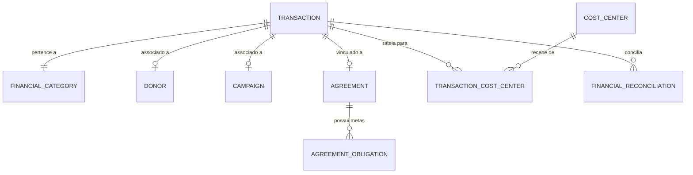

# ESPECIFICAÇÃO TÉCNICA E FUNCIONAL — MÓDULO 08 — GESTÃO FINANCEIRA, CAPTAÇÃO DE RECURSOS, CONVÊNIOS E PRESTAÇÃO DE CONTAS
## PROJETO AURA - INSTITUTO SER MELHOR

**Data:** Junho 2026  
**Foco:** Transparência financeira do terceiro setor, Rastreabilidade de Origem de Recursos, Centros de Custo por Projeto, Contas a Pagar/Receber, Doações e Campanhas, Gestão de Convênios, BI e Auditoria Imutável.

---

## 1. ARQUITETURA FUNCIONAL COMPLETA

O módulo **Gestão Financeira e Captação de Recursos (GFCR)** atua como o sistema nervoso de sustentabilidade do Instituto Ser Melhor. Ele garante que cada entrada (Receitas/Doações) e cada saída (Despesas) possua uma classificação clara e rastreabilidade total de centro de custo, conectando-se diretamente aos Projetos Sociais, Usuários e Gestão Documental.

```mermaid
graph TD
    classDef default fill:#f8fafc,stroke:#cbd5e1,stroke-width:1px;
    classDef highlight fill:#f0fdfa,stroke:#0d9488,stroke-width:2px;
    
    A[Movimentação Financeira] :::highlight -->|Centro de Custo| B[Projeto Social / Campanha]
    A -->|Rastreabilidade| C[Doador / Financiador]
    A -->|Documento Comprobatório| D[Gestão Documental]
    A -->|Auditoria Imutável| E[Trilha de Auditoria - CGI]
    A -->|Consolidação BI| F[BI & Relatórios]
    
    B -->|Campanha| G[Doações Recorrentes / Únicas]
    C -->|Convênio / Edital| H[Cronograma de Desembolso]
```

### Componentes Principais:
1. **Plano de Contas & Centros de Custo**: Estrutura parametrizável para categorizar receitas e despesas com vinculação obrigatória a um Projeto, Campanha, Evento ou Unidade.
2. **Controle de Receitas & Doações**: Gerenciamento de doações (únicas/recorrentes), agradecimentos automáticos, cadastros de doadores e controle de captação.
3. **Controle de Despesas & Contas a Pagar**: Fluxo de aprovação e pagamento de folha, prestadores, fornecedores e infraestrutura.
4. **Gestão de Convênios e Editais**: Controle de repasses do setor público ou privado, metas de execução e prazos regulatórios.
5. **Prestação de Contas**: Consolidação de relatórios financeiros detalhados por projeto para órgãos reguladores e doadores.
6. **Fluxo de Caixa & Projeções (BI)**: Gráficos de entradas vs. saídas realizadas e projetadas.
7. **Integração IA**: Auxílio na classificação de lançamentos, previsão de fluxo de caixa e alertas de baixa arrecadação.

---

## 2. REGRAS DE NEGÓCIO (RNs)

### RN01 — Rastreabilidade Obrigatória de Centro de Custo
- Todo lançamento financeiro (receita ou despesa) **deve** obrigatoriamente estar associado a pelo menos um Centro de Custo ativo.
- O sistema não permitirá a criação ou efetivação de transações com o campo `costCenter` nulo ou em branco.

### RN02 — Classificação de Plano de Contas Parametrizável
- O plano de contas é dividido em categorias primárias fixas (`RECEITA`, `DESPESA`, `INVESTIMENTO`) e subcategorias dinâmicas (ex: `Doação Física`, `Edital Público`, `Folha de Pagamento`, `Material de Apoio`).
- Adaptações de negócio nas subcategorias não devem exigir alterações no código-fonte, sendo gerenciadas via tela de Parâmetros Gerais.

### RN03 — Vinculação Documental
- Para qualquer despesa com valor superior a R$ 100,00 ou qualquer receita proveniente de convênio/edital, é **obrigatória** a anexação de documento fiscal ou comprovante correspondente (PDF ou imagem).
- Transações marcadas como `COMPLETED` (Efetivadas) sem documento comprobatório devem gerar um alerta automático para a equipe de Auditoria.

### RN04 — Alçada de Aprovação de Despesas
- Despesas cadastradas no sistema seguem a alçada de aprovação:
  - **Abaixo de R$ 1.000,00**: Aprovação automática ou liberação direta pelo perfil `Financeiro`.
  - **De R$ 1.000,00 a R$ 10.000,00**: Exige aprovação de um perfil `Coordenação Geral` ou `Controladoria`.
  - **Acima de R$ 10.000,00**: Exige aprovação de dois membros, sendo um da `Diretoria` ou `Presidência`.

### RN05 — Recorrência de Doações e Alerta de Churn
- O sistema processará cobranças de doadores recorrentes utilizando integrações de gateways de pagamento.
- Se uma doação recorrente falhar por 2 meses consecutivos, o sistema deve alterar o status do doador para `INACTIVE`, disparar uma notificação para a equipe de Captação e suspender o envio automático de recibos.

### RN06 — Cronogramas de Desembolso de Convênios
- Cada convênio deve possuir datas de desembolso previstas.
- O atraso em um repasse público ou privado por mais de 5 dias úteis em relação ao previsto no cronograma deve gerar um alerta crítico no dashboard financeiro institucional.

### RN07 — A IA e a Aprovação Humana
- A Inteligência Artificial pode sugerir a subcategoria e o centro de custo de um lançamento com base em seu título e histórico.
- **A IA nunca poderá aprovar ou efetivar movimentações financeiras automaticamente.** Toda sugestão deve ser revisada e confirmada por um operador humano.

---

## 3. MODELO DE BANCO DE DADOS (PRISMA ORM)

Os novos modelos serão integrados ao arquivo `backend/prisma/schema.prisma` para dar suporte ao GFCR:

```prisma
// ─── PLANO DE CONTAS & CENTROS DE CUSTO ──────────────────────
model CostCenter {
  id            String         @id @default(uuid())
  name          String         // Ex: Projeto Escuta Ativa, Administração Sede
  code          String         @unique // Ex: CC-101
  type          String         // PROJECT, PROGRAM, DEPARTMENT, CAMPAIGN, CONVENIO, UNIT
  status        String         @default("ACTIVE") // ACTIVE, INACTIVE
  createdAt     DateTime       @default(now())
  updatedAt     DateTime       @updatedAt
  
  transactions  TransactionCostCenter[]
}

model FinancialCategory {
  id            String         @id @default(uuid())
  name          String         // Ex: Folha de Pagamento, Doação PF
  type          String         // INCOME, EXPENSE, INVESTMENT
  parentId      String?
  parent        FinancialCategory?  @relation("CategoryHierarchy", fields: [parentId], references: [id])
  subcategories FinancialCategory[] @relation("CategoryHierarchy")
  
  transactions  Transaction[]
}

// ─── TRANSAÇÕES (RECEITAS E DESPESAS) ────────────────────────
model Transaction {
  id            String         @id @default(uuid())
  type          String         // INCOME, EXPENSE, INVESTMENT
  title         String
  description   String?
  amount        Float
  status        String         @default("PENDING") // PENDING, COMPLETED, CANCELLED
  dueDate       DateTime
  paymentDate   DateTime?
  
  // Relações
  categoryId    String
  category      FinancialCategory @relation(fields: [categoryId], references: [id])
  
  projectId     String?
  project       Project?       @relation(fields: [projectId], references: [id])
  
  donorId       String?
  donor         Donor?         @relation(fields: [donorId], references: [id])
  
  campaignId    String?
  campaign      Campaign?      @relation(fields: [campaignId], references: [id])
  
  agreementId   String?
  agreement     Agreement?     @relation(fields: [agreementId], references: [id])
  
  createdById   String
  updatedById   String?
  
  documentUrl   String?        // Comprovante ou Nota Fiscal
  
  createdAt     DateTime       @default(now())
  updatedAt     DateTime       @updatedAt

  costCenters   TransactionCostCenter[]
  reconciliations FinancialReconciliation[]
}

model TransactionCostCenter {
  transactionId String
  costCenterId  String
  percentage    Float          @default(100.0) // Permite rateio proporcional
  
  transaction   Transaction    @relation(fields: [transactionId], references: [id], onDelete: Cascade)
  costCenter    CostCenter     @relation(fields: [costCenterId], references: [id], onDelete: Cascade)

  @@id([transactionId, costCenterId])
}

// ─── GESTÃO DE DOADORES & CAMPANHAS ─────────────────────────
model Donor {
  id            String         @id @default(uuid())
  name          String
  document      String?        @unique // CPF or CNPJ
  email         String
  phone         String?
  type          String         @default("INDIVIDUAL") // INDIVIDUAL, CORPORATE
  status        String         @default("ACTIVE") // ACTIVE, INACTIVE
  isRecurring   Boolean        @default(false)
  createdAt     DateTime       @default(now())
  
  transactions  Transaction[]
}

model Campaign {
  id            String         @id @default(uuid())
  name          String
  description   String?
  targetAmount  Float
  raisedAmount  Float          @default(0.0)
  startDate     DateTime
  endDate       DateTime
  status        String         @default("PLANNING") // PLANNING, ACTIVE, SUSPENDED, COMPLETED
  createdAt     DateTime       @default(now())
  
  transactions  Transaction[]
}

// ─── CONVÊNIOS E EDITAIS ────────────────────────────────────
model Agreement {
  id            String         @id @default(uuid())
  name          String         // Nome do Convênio / Objeto
  code          String         @unique // Número do convênio/edital
  grantor       String         // Órgão Financiador
  approvedAmount Float
  startDate     DateTime
  endDate       DateTime
  status        String         @default("ACTIVE") // ACTIVE, COMPLETED, AUDITING, SUSPENDED
  createdAt     DateTime       @default(now())
  
  transactions  Transaction[]
  obligations   AgreementObligation[]
}

model AgreementObligation {
  id            String         @id @default(uuid())
  agreementId   String
  title         String         // Ex: Entrega de Relatório Parcial, Prestação Final
  dueDate       DateTime
  status        String         @default("PENDING") // PENDING, SUBMITTED, APPROVED, OVERDUE
  description   String?
  
  agreement     Agreement      @relation(fields: [agreementId], references: [id], onDelete: Cascade)
}

// ─── CONCILIAÇÃO BANCÁRIA ───────────────────────────────────
model FinancialReconciliation {
  id            String         @id @default(uuid())
  transactionId String
  bankStatementId String       // ID do lançamento no extrato bancário
  reconciledAt  DateTime       @default(now())
  reconciledById String
  notes         String?
  
  transaction   Transaction    @relation(fields: [transactionId], references: [id])
}
```

---

## 4. DIAGRAMAS UML E C4

### Diagrama de Contêineres (C4 L2)
Representa como o módulo GFCR interage com o ecossistema da plataforma.

```mermaid
graph LR
    classDef container fill:#f1f5f9,stroke:#64748b,stroke-width:1px;
    classDef client fill:#f0fdfa,stroke:#0d9488,stroke-width:2px;
    
    A[Web App - React] :::client -->|Ações Financeiras| B[Vite Backend API]
    B -->|Autenticação & Roles| C[Serviço de Controle de Acesso]
    B -->|Leitura e Escrita| D[(Banco de Dados PostgreSQL)] :::container
    B -->|Classificação de Docs e Previsão| E[AI Service - Gemini API]
    B -->|Integração de Contas| F[Gateway de Pagamentos / Open Finance API]
```

### Diagrama de Relacionamento de Entidades (ER)
Estruturação das tabelas e chaves estrangeiras.



---

## 5. FLUXOS DE PROCESSOS

### Fluxo de Receitas (Doações e Editais)
1. **Origem do Recurso**: Doador efetua contribuição (Via PIX, cartão de crédito, boleto ou repasse de convênio).
2. **Entrada de Lançamento**: Registro no sistema (`Transaction` do tipo `INCOME` com status `PENDING`).
3. **Classificação e Rateio**: Vinculação de categoria financeira (ex: Doação PF), Projeto/Campanha correspondente e seleção de Centros de Custo (rateio percentual).
4. **Conciliação Bancária**: Upload do arquivo OFX ou integração Open Finance busca extrato bancário. Sistema realiza o batimento e altera o status para `COMPLETED`.
5. **Agradecimento & Recibo**: Gateway confirma o recebimento; sistema gera recibo em PDF com assinatura digital e o envia automaticamente ao doador por e-mail/WhatsApp.

### Fluxo de Despesas (Contas a Pagar)
1. **Cadastro da Solicitação**: Colaborador entra com nota fiscal/boleto, define valor, categoria da despesa (ex: Infraestrutura), data de vencimento e vincula ao Centro de Custo.
2. **Validação da IA**: IA avalia o arquivo anexo e sugere correções no valor extraído e na categorização.
3. **Aprovação por Alçada**: O sistema envia a notificação para aprovação do coordenador de acordo com o limite do valor (RN04).
4. **Efetivação de Pagamento**: Profissional do Financeiro processa o pagamento do lote bancário e altera o status para `COMPLETED`, anexando o comprovante de pagamento.
5. **Auditoria de Transição**: Log imutável gerado registrando operador, data e hash de segurança.

---

## 6. MATRIZ COMPLETA DE PERMISSÕES

| Função / Perfil | Visualizar Transações | Criar/Editar Transações | Aprovar Despesas | Gerenciar Doadores | Configurar Plano de Contas | Excluir Lançamentos | Exportar BI / Relatórios |
|---|---|---|---|---|---|---|---|
| **Diretoria** | Sim | Sim (Apenas leitura no detalhado) | Sim (Acima de R$ 10k) | Sim | Não | Não | Sim |
| **Financeiro** | Sim | Sim (Modo completo) | Sim (Até R$ 1k) | Sim | Sim | Não | Sim |
| **Controladoria** | Sim | Sim | Sim (Até R$ 10k) | Sim | Sim | Não | Sim |
| **Captação de Recursos** | Apenas Receitas | Apenas Receitas | Não | Sim | Não | Não | Apenas Receitas |
| **Contabilidade** | Sim | Sim (Lançamentos de ajuste) | Não | Não | Não | Não | Sim |
| **Auditoria** | Sim | Não | Não | Não | Não | Não | Sim |

*Nota: Nenhuma função possui permissão padrão de exclusão física de lançamentos efetivados. Exclusões geram uma transação de estorno correspondente.*

---

## 7. DETALHAMENTO DE PROTÓTIPOS E WIREFRAMES

### Wireframe 1: Cockpit Financeiro Principal (Dashboard)
- **Topo**: KPIs de Saldo Consolidado, Doações do Mês (contagem e valor) e Despesas Operacionais acumuladas.
- **Gráfico Principal**: Linha temporal de entradas previstas vs. saídas realizadas.
- **Painel Lateral Esquerdo**: Seletor de visualização (Filtro por Projetos Sociais ou Filtro por Centros de Custo).
- **Painel Lateral Direito**: Resumo Financeiro da IA (Alertas de despesas atípicas, projeções de sustentabilidade para os próximos 60 dias).

### Wireframe 2: Modal de Conciliação Financeira
- **Painel Esquerdo**: Transações cadastradas no sistema com status `PENDING`.
- **Painel Direito**: Extrato bancário importado via arquivo (.ofx) ou API.
- **Ação**: Sistema busca correspondências por valor e data aproximada e sugere com botão de "Conciliação Rápida". Botão manual permite selecionar transação e extrato individualmente para conciliação.

---

## 8. BACKLOG COM HISTÓRIAS DE USUÁRIO (USER STORIES)

### Épico 01: Sustentabilidade e Captação
#### História de Usuário 1.1: Cadastro de Doadores
- **Como** Gestor de Captação,
- **Quero** cadastrar doadores únicos e recorrentes com seus dados e consentimentos de LGPD,
- **Para** manter um histórico de contribuições e manter o relacionamento próximo com apoiadores.
- **Critérios de Aceitação**:
  1. Campo para upload de consentimento assinado ou aceite digital.
  2. Filtro de doadores por categoria de doação (PF, PJ, Recorrente, Único).
  3. Bloqueio automático de exclusão de doador com transações vinculadas.

### Épico 02: Governança e Controle de Custos
#### História de Usuário 2.1: Rateio de Centro de Custo
- **Como** Analista Financeiro,
- **Quero** ratear o valor de uma despesa administrativa em múltiplos centros de custo por porcentagem,
- **Para** alocar os custos do Instituto com precisão entre os projetos apoiadores.
- **Critérios de Aceitação**:
  1. Soma das porcentagens de rateio deve somar exatamente 100%.
  2. Exibição clara no extrato da divisão proporcional da despesa.

### Épico 03: Inteligência Artificial Financeira
#### História de Usuário 3.1: Previsão de Fluxo de Caixa
- **Como** Diretor Financeiro,
- **Quero** ver uma previsão de fluxo de caixa gerada por IA baseada nas recorrências e histórico de despesas,
- **Para** prever e mitigar meses com caixa potencialmente deficitário.
- **Critérios de Aceitação**:
  1. Exibição de gráficos de previsão para 30, 60 e 90 dias com margem de confiança.
  2. Recomendações de economia baseadas em despesas atípicas detectadas no mês anterior.

---

## 9. PLANOS DE IMPLEMENTAÇÃO, TESTES E INTEGRAÇÃO

### Plano de Implementação Incremental (Fases)
1. **Fase 1: Estrutura e Banco de Dados (ORM & Migrations)**: Criação das tabelas de transações, doadores, campanhas, convênios e centros de custo.
2. **Fase 2: Gestão de Lançamentos (Receitas, Despesas e Centros de Custo)**: UI e endpoints CRUD com vinculação de centros de custo obrigatória.
3. **Fase 3: Doações e Campanhas**: Interface de captação de recursos, cadastro de doadores e painel de acompanhamento de metas.
4. **Fase 4: Convênios, Editais e Prestação de Contas**: Registro de convênios governamentais/privados, alertas de obrigações e relatórios automáticos.
5. **Fase 5: Conciliação Bancária & Exportações**: Importador de extrato (.ofx), tela de conciliação automática/manual e downloads parametrizados.
6. **Fase 6: AI Financeira & BI**: Dashboards de projeção, integração com Gemini API para resumos e categorização inteligente.

### Plano de Testes
- **Testes Unitários (Backend)**: Garantir que nenhuma transação seja gravada sem centro de custo (RN01) e validar limites de alçadas de aprovação (RN04).
- **Testes de Integração**: Validar a geração e envio do recibo PDF no envio automático após batimento de doação.
- **Testes de Usabilidade e Acessibilidade (WCAG)**: Contraste de cores nas tabelas financeiras, leitor de tela para extratos e navegação por teclado nos formulários de lançamento.

### Plano de Integração
- **CGI**: Lançamentos e logs de auditoria financeira devem fluir automaticamente para a tela de Auditoria do CGI.
- **Projetos**: O orçamento previsto e captado exibido na aba de Projetos do CGI deve consumir diretamente a soma de transações do banco de dados financeiro.
- **Documental**: Notas fiscais anexadas devem ser armazenadas de forma organizada no repositório geral de documentos do Instituto.
