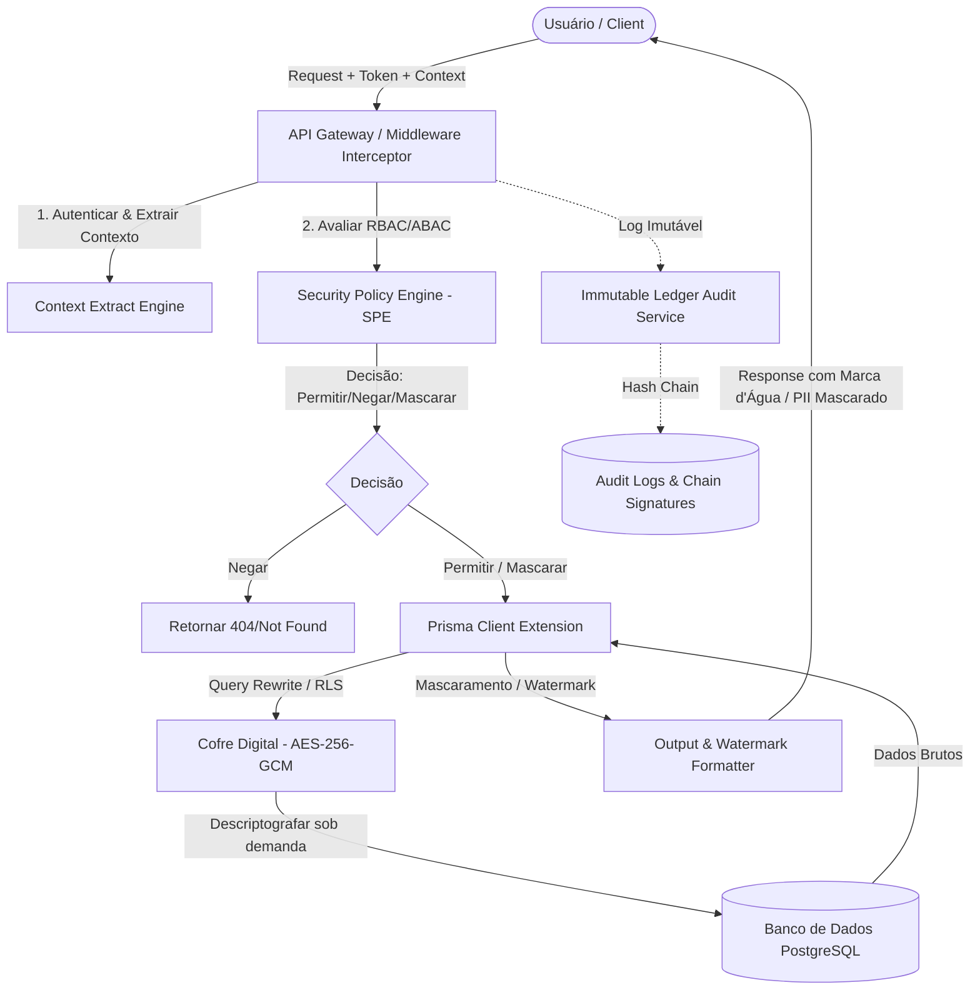
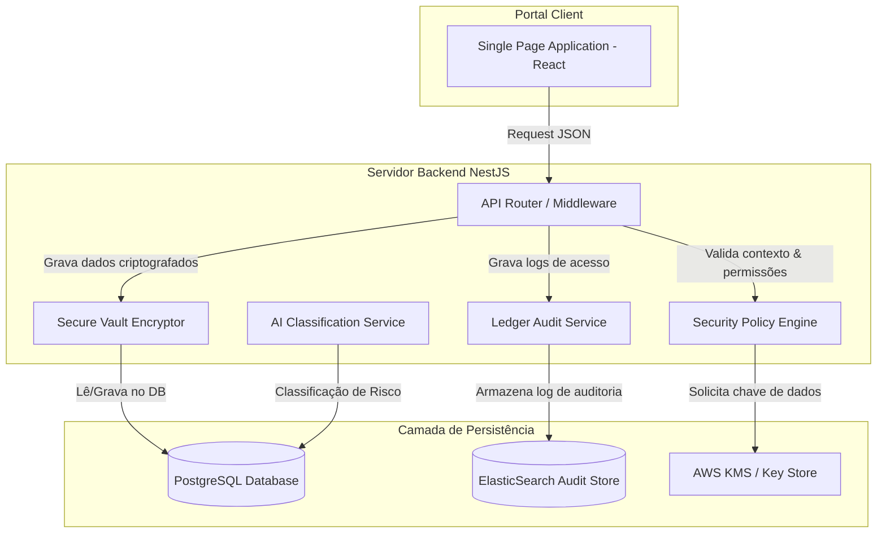
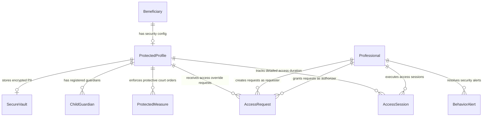
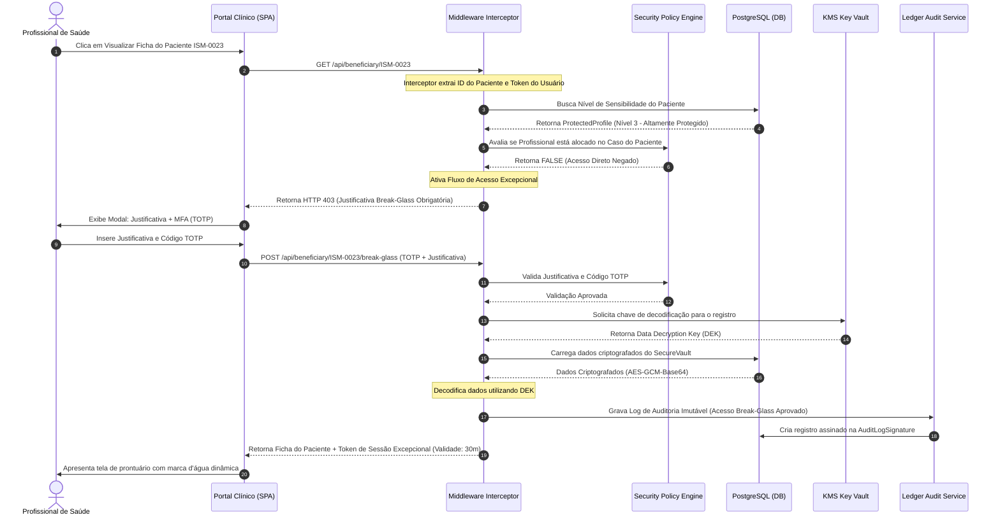
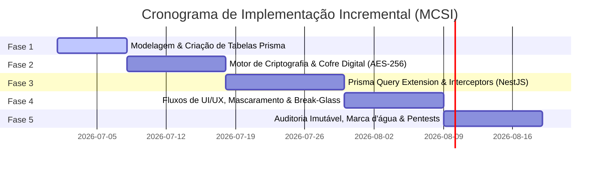

# MÓDULO COMPLEMENTAR DE SEGURANÇA INSTITUCIONAL (MCSI)
## DOCUMENTO DE ARQUITETURA, ESPECIFICAÇÃO TÉCNICA E PLANO DE IMPLEMENTAÇÃO
**Projeto Aura - Instituto Ser Melhor**  
**Autor:** Antigravity (AI Coding Assistant)  
**Status:** PROPOSTA PARA APROVAÇÃO  

---

## 1. ARQUITETURA DE SEGURANÇA COMPLETA (ZERO TRUST & DEFENSE IN DEPTH)

O **Módulo Complementar de Segurança Institucional (MCSI)** é projetado como uma camada de segurança transversal de interceptação ativa. A arquitetura segue os princípios de **Zero Trust** (nunca confiar, sempre verificar) e **Defense in Depth** (múltiplas camadas de proteção).



### 1.1. Camada de Interceptação (Middleware API Gateway)
Toda requisição HTTP recebida pela API do backend passa pelo **Middleware Interceptor**. Este componente:
1. **Validação de Token:** Valida o JWT do usuário e o status da autenticação multifator (MFA).
2. **Extração de Contexto (ABAC):** Extrai o IP de origem, dispositivo (fingerprint), geolocalização aproximada e horário da requisição.
3. **Identificação de Alvo:** Identifica se a requisição está direcionando dados de beneficiários protegidos.

### 1.2. Security Policy Engine (SPE)
Motor que processa as políticas RBAC (Baseada em Papéis) e ABAC (Baseada em Atributos). Ele decide se uma ação (Visualizar, Editar, Exportar, Imprimir) é:
* **PERMITIDA:** Sem restrições adicionais.
* **MASCARADA:** O dado é retornado, mas campos sensíveis sofrem obfusticação.
* **BLOQUEADA:** O acesso é negado. Se for uma busca ou consulta de registro único, o SPE ativa a **Pesquisa Segura**, retornando `404 Not Found` (Cadastro Oculto/Inexistente) para que o atacante não saiba da existência do registro.
* **BREAK-GLASS:** Acesso sob justificativa excepcional por período limitado.

### 1.3. Query Rewriting e Row-Level Security (RLS) via Prisma Extension
Para garantir que nenhum desenvolvedor ou query contorne a camada de segurança no backend, utilizamos uma **Prisma Client Extension**. Ela intercepta as operações do ORM (`findMany`, `findFirst`, `findUnique`, `update`, etc.) e aplica automaticamente cláusulas de filtro (`where`) baseadas no nível de permissão do usuário. 
* Exemplo: Se o usuário logado tem acesso apenas ao Nível 1, qualquer busca de `Beneficiary` será reescrita no banco para injetar automaticamente `AND level <= 1`.

### 1.4. Arquitetura do Cofre Digital (Secure Vault)
Os dados mais críticos (CPF, Endereço, Telefones, Documentos, Fotos, Medidas Protetivas) são fisicamente isolados em uma tabela dedicada (`SecureVault`) e criptografados em repouso.
* **Algoritmo:** `AES-256-GCM` (Autenticado), garantindo confidencialidade e integridade dos dados criptografados.
* **Gerenciamento de Chaves:** Envelope Encryption. Uma Master Key (KEK) gerenciada em HSM ou AWS KMS descriptografa uma chave de dados (DEK) gerada dinamicamente para cada registro.
* **Initialisation Vector (IV):** Cada campo criptografado tem seu próprio IV gerado de forma aleatória (`crypto.randomBytes(12)`), armazenado junto ao registro para evitar ataques de texto cifrado conhecido.

---

## 2. MODELO DE AMEAÇAS (THREAT MODELING - STRIDE)

| Ameaça (STRIDE) | Descrição do Cenário | Severidade | Mitigação no MCSI |
| :--- | :--- | :--- | :--- |
| **S**poofing (Usurpação) | Usuário malicioso se passa por um coordenador ou assistente social para ler prontuário de vítima. | **Crítica** | MFA (TOTP) obrigatório para visualização do cofre digital, verificação de impressão digital de dispositivo confiável e IP. |
| **T**ampering (Adulteração) | Modificação direta no banco de dados para rebaixar o nível de proteção de um beneficiário. | **Alta** | Assinatura digital (HMAC-SHA256) dos metadados de sensibilidade e logs de auditoria imutáveis integrados. |
| **R**epudiation (Repúdio) | Profissional visualiza e exporta dados de menor sob medida protetiva e nega ter realizado a ação. | **Alta** | Logs de auditoria assinados digitalmente contendo IP, hash do usuário, timestamp e justificativa, armazenados em ledger com encadeamento de hashes. |
| **I**nformation Disclosure (Vazamento) | Exposição de dados de endereço de vítima de violência doméstica via API de pesquisa global. | **Crítica** | Pesquisa segura com resposta 404 (cadastro oculto), mascaramento dinâmico on-the-fly e marca d'água dinâmica nos PDFs exportados. |
| **D**enial of Service (DoS) | Tentativas massivas de requisição de dados sensíveis para indisponibilizar a API de segurança. | **Média** | Limitador de taxa (Rate Limiting) adaptativo por IP e por conta de usuário; bloqueio automático de IPs suspeitos. |
| **E**levation of Privilege (Elevação) | Voluntário de nível básico edita seus próprios atributos ou contorna interceptadores do backend. | **Alta** | Validação centralizada de permissões no backend (SPE) independente dos estados enviados pelo frontend. Prisma extensions blindadas. |

---

## 3. REGRAS DE NEGÓCIO DO MCSI

### 3.1. Regras de Classificação de Sensibilidade
1. **Nível 0 (Padrão):** Sem restrições extraordinárias de segurança. Segue RBAC básico.
2. **Nível 1 (Parcialmente Restrito):** Dados como telefone e e-mail são mascarados. Acesso concedido a profissionais alocados no projeto correspondente.
3. **Nível 2 (Protegido):** CPF e endereço são movidos para o Cofre Digital. Requer justificativa simples para visualização por profissionais autorizados.
4. **Nível 3 (Altamente Protegido):** Beneficiários sob risco iminente ou medidas protetivas ativas. Acesso visual permitido somente à equipe direta do caso. Qualquer outro profissional precisa iniciar o fluxo de **Acesso Excepcional (Break-Glass)**.
5. **Nível 4 (Institucional Sigiloso):** Casos estratégicos ou de extrema sensibilidade (ex: sob proteção testemunhal). Visíveis apenas para a Diretoria Executiva e DPO (Data Protection Officer). A pesquisa geral retorna `404` para todos os outros usuários.

### 3.2. Regras para Categorias Especiais
Ao cadastrar um beneficiário em uma **Categoria Especial** (ex: *Magistrado, Policial Militar, Servidor de Inteligência*), o sistema sugere automaticamente a elevação de proteção:
* Profissionais de Segurança/Justiça $\rightarrow$ Sugestão padrão: Nível 3.
* Familiares sob ameaça $\rightarrow$ Sugestão padrão: Nível 3.
* Programa de Proteção Oficial $\rightarrow$ Força automática: Nível 4 (não modificável para níveis inferiores sem aval do DPO).

### 3.3. Regras de Mascaramento Dinâmico (Conforme Nível do Usuário)
* **Usuário Comum (Recepção/Voluntário Geral):**
  * CPF: `***.***.123-**`
  * Telefone: `(**) *****-4321`
  * Endereço: `[OCULTO - DADOS PROTEGIDOS]`
  * Nome Completo: Apenas as iniciais ou Nome Social (ex: `A. B. Silva`).
* **Usuário Autorizado (Assistente Social/Coordenador do Caso):**
  * Visualiza dados completos no detalhe mediante registro de log automático de visualização.

### 3.4. Regras de Acesso Excepcional (Break-Glass)
1. Permite acesso temporário a dados protegidos em situações de emergência (ex: atendimento de plantão de crise).
2. O usuário deve declarar: Justificativa livre (+100 caracteres), Finalidade do atendimento, e Número de Processo Interno/Judicial (se aplicável).
3. A validade do acesso é parametrizável de **15 a 120 minutos**. Após o tempo limite, a chave de sessão expira e o acesso é revogado.
4. Um alerta de alta prioridade (E-mail/Notificação Push) é enviado imediatamente ao DPO e ao Coordenador do Projeto.

### 3.5. Regras de Detecção de Comportamento Suspeito (Heurísticas)
O motor de segurança analisa os padrões de tráfego em tempo real:
* **Consultas em Massa:** Se um usuário visualiza mais de 10 cadastros Nível 2+ em menos de 5 minutos $\rightarrow$ Conta bloqueada temporariamente + Disparo de Alerta Crítico.
* **Acessos fora de Horário:** Acesso a prontuário Nível 3 entre 22:00 e 06:00 $\rightarrow$ Exige MFA adicional + Notificação ao DPO.
* **Exportação Incomum:** Download de múltiplos prontuários ou relatórios anonimizados em curto intervalo.

---

## 4. MODELO DE BANCO DE DADOS (PRISMA SCHEMA)

As seguintes extensões e tabelas de dados serão adicionadas ao arquivo [schema.prisma](file:///Users/rikardoribeiro/Documents/GitHub/ISMCL/backend/prisma/schema.prisma) para suportar o MCSI:

```prisma
// =========================================================================
// MÓDULO COMPLEMENTAR DE SEGURANÇA INSTITUCIONAL (MCSI)
// =========================================================================

model ProtectedProfile {
  id                 String               @id @default(uuid())
  beneficiaryId      String               @unique
  internalCode       String               @unique // ISM-0000000000
  sensitivityLevel   Int                  @default(0) // 0 to 4
  specialCategory    String?              // POLICIA_MILITAR, MAGISTRADO, TESTEMUNHA_PROTEGIDA, etc.
  riskScore          Float                @default(0.0)
  riskHeuristics     Json?                // Metadados que justificam o score de risco
  createdAt          DateTime             @default(now())
  updatedAt          DateTime             @updatedAt

  beneficiary        Beneficiary          @relation(fields: [beneficiaryId], references: [id], onDelete: Cascade)
  secureVault        SecureVault?
  guardians          ChildGuardian[]
  protectiveMeasures ProtectedMeasure[]
  accessRequests     AccessRequest[]
  accessSessions     AccessSession[]
}

model SecureVault {
  id                      String           @id @default(uuid())
  protectedProfileId      String           @unique
  
  // Dados Criptografados (Armazenados como strings em base64/hex criptografadas)
  encryptedCpf            String?
  encryptedAddress        String?          // JSON estruturado de endereço criptografado
  encryptedPhone          String?
  encryptedFamilyDetails  String?          // JSON familiar criptografado
  encryptedWorkplace      String?
  encryptedAlternateAddrs String?          // Endereços alternativos criptografados
  encryptedCourtDocs      String?          // Documentação judicial sensível criptografada
  
  // Metadados de Criptografia
  ivMap                   Json             // Mapeamento de Vetores de Inicialização (IV) para cada campo
  keyId                   String           // Identificador da versão da chave KMS utilizada
  createdAt               DateTime         @default(now())
  updatedAt               DateTime         @updatedAt

  profile                 ProtectedProfile @relation(fields: [protectedProfileId], references: [id], onDelete: Cascade)
}

model ChildGuardian {
  id                 String               @id @default(uuid())
  protectedProfileId String
  fullName           String
  relationshipType   String               // PAI, MAE, TUTOR, ACOLHEDOR, ABRIGO, CONSELHO_TUTELAR, OUTRO
  custodyType        String               // COMPARTILHADA, UNILATERAL, NENHUMA
  phone              String?
  isAuthorized       Boolean              @default(false) // Autorizado a retirar/acompanhar o menor
  isProhibited       Boolean              @default(false) // Expressamente proibido por ordem judicial
  courtOrderDetails  String?              // Detalhes da ordem de restrição (se houver)
  createdAt          DateTime             @default(now())
  updatedAt          DateTime             @updatedAt

  profile            ProtectedProfile     @relation(fields: [protectedProfileId], references: [id], onDelete: Cascade)
}

model ProtectedMeasure {
  id                 String               @id @default(uuid())
  protectedProfileId String
  processNumber      String
  measureType        String               // LEI_MARIA_DA_PENHA, DISTANCIAMENTO_MINIMO, etc.
  issuingAuthority   String               // Vara Judicial / Tribunal
  startDate          DateTime
  expirationDate     DateTime?
  restrictionsText   String               // Descrição textual das proibições impostas
  involvedPersons    Json                 // Lista de pessoas agressoras e suas descrições
  documentUrl        String?              // Link seguro no S3 criptografado para o PDF da medida
  status             String               @default("ACTIVE") // ACTIVE, EXPIRED, SUSPENDED
  createdAt          DateTime             @default(now())
  updatedAt          DateTime             @updatedAt

  profile            ProtectedProfile     @relation(fields: [protectedProfileId], references: [id], onDelete: Cascade)
}

model AccessRequest {
  id                 String               @id @default(uuid())
  protectedProfileId String
  requesterId        String
  justification      String
  purpose            String
  durationMinutes    Int
  processNumber      String?
  status             String               @default("PENDING") // PENDING, APPROVED, DENIED, EXPIRED
  authorizedById     String?
  createdAt          DateTime             @default(now())
  expiresAt          DateTime?

  profile            ProtectedProfile     @relation(fields: [protectedProfileId], references: [id], onDelete: Cascade)
  requester          Professional         @relation("RequesterProf", fields: [requesterId], references: [id])
  authorizedBy       Professional?        @relation("AuthorizerProf", fields: [authorizedById], references: [id])
}

model AccessSession {
  id                 String               @id @default(uuid())
  protectedProfileId String
  professionalId     String
  accessRequestId    String?
  ipAddress          String
  userAgent          String
  startTime          DateTime             @default(now())
  endTime            DateTime?
  durationSeconds    Int?
  actionsPerformed   Json                 // Lista estruturada de ações tomadas durante o acesso

  profile            ProtectedProfile     @relation(fields: [protectedProfileId], references: [id], onDelete: Cascade)
  professional       Professional         @relation(fields: [professionalId], references: [id])
}

model AuditLogSignature {
  id                 String               @id @default(uuid())
  logId              String               @unique // ID do log na tabela SecurityAuditLog ou Elasticsearch
  logHash            String               // Hash SHA-256 do conteúdo do log
  previousLogHash    String               // Hash SHA-256 do log anterior (Encadeamento de Ledger)
  signature          String               // Assinatura digital assimétrica usando chave privada do servidor
  createdAt          DateTime             @default(now())
}

model BehaviorAlert {
  id                 String               @id @default(uuid())
  userId             String
  alertType          String               // MASS_QUERIES, UNUSUAL_EXPORT, OUT_OF_HOURS, CONCURRENT_SESSIONS, EXCESSIVE_DOWNLOAD
  description        String
  severity           String               @default("MEDIUM") // LOW, MEDIUM, HIGH, CRITICAL
  status             String               @default("NEW") // NEW, INVESTIGATING, RESOLVED, FALSE_POSITIVE
  detectedAt         DateTime             @default(now())
  resolvedAt         DateTime?
  resolvedById       String?
  
  resolvedBy         Professional?        @relation("AlertResolver", fields: [resolvedById], references: [id])
}
```

---

## 5. DIAGRAMAS ARQUITETURAIS (MERMAID)

### 5.1. Diagrama C4 - Nível 2 (Containers do MCSI)
Exibe a divisão de containers do backend e como o MCSI interage logicamente com a API existente.



### 5.2. Diagrama de Entidade-Relacionamento (ERD) do MCSI
Este diagrama mostra o relacionamento das novas entidades do MCSI com as entidades existentes (`Beneficiary`, `Professional`).



### 5.3. Diagrama de Sequência: Fluxo de Acesso Excepcional (Break-Glass)
Ilustra a interceptação de acesso a um beneficiário de Nível 3 por um profissional não alocado diretamente.



---

## 6. FLUXOS OPERACIONAIS DETALHADOS

### 6.1. Fluxo de Classificação de Beneficiários
1. **Gatilho de Entrada:** O cadastro ou triagem de um beneficiário é finalizado.
2. **Avaliação Pela IA / Heurística:**
   * O sistema analisa se o beneficiário declarou ser menor de idade (ECA), pertencer a forças de segurança, ou possuir diagnósticos ou descrições associadas a violência física, doméstica ou psicológica.
   * Se positivo, calcula um `riskScore` de 0.0 a 10.0.
   * Classifica automaticamente o perfil:
     * Menor de idade ou histórico básico de vulnerabilidade $\rightarrow$ Nível 2 (Protegido).
     * Histórico de violência ativa, ameaças de morte, ou forças de segurança $\rightarrow$ Nível 3 (Altamente Protegido).
3. **Revisão Humana:**
   * O Coordenador do Projeto recebe uma notificação sobre a classificação automática e deve validar ou alterar o nível (apenas permitida a elevação de nível, rebaixamento de nível requer dupla aprovação: Coordenador + DPO).
4. **Registro em Auditoria:** Cada mudança de nível gera um log com assinatura digital do autorizador.

### 6.2. Fluxo de Solicitação e Concessão de Acesso (RBAC/ABAC Permanente)
1. Profissional solicita inclusão de acesso permanente para determinado beneficiário por necessidade de interconsulta prolongada.
2. Solicitação enviada eletronicamente para o Coordenador do Caso.
3. Se aprovado, o sistema vincula o profissional na tabela `CaseProfessional` com a permissão devida.
4. O `Prisma Extension` passa a permitir as queries diretas automaticamente.

### 6.3. Fluxo de Exportação Segura
1. **Solicitação:** Usuário com permissão de exportação ativa o comando `Exportar Prontuário para PDF`.
2. **Validação:** O sistema verifica se o usuário possui autenticação MFA ativa na sessão. Caso contrário, solicita o token.
3. **Geração de Marca d'Água Dinâmica:**
   * O backend processa o arquivo PDF utilizando a biblioteca `pdf-lib` ou `pdfkit`.
   * Insere em todas as páginas, diagonalmente e em baixa opacidade (marca d'água invisível a olho nu ou visível cinza-claro), os seguintes dados:
     * *Nome do Usuário:* Camila de Souza
     * *CPF do Usuário:* ***.345.***-89
     * *Endereço IP:* 177.34.12.8
     * *Data/Hora:* 2026-06-29 13:44:10
     * *Hash da Sessão:* a7b2e9...
4. **Proteção por Senha:** O arquivo é exportado criptografado. A senha padrão de abertura é enviada por canal seguro ou definida como o CPF do profissional solicitante.
5. **Registro de Log:** O log do download é imediatamente escrito no Ledger Audit.

---

## 7. MATRIZ DE PERMISSÕES (RBAC + ABAC)

Abaixo está descrita a matriz de permissões cruzando os papéis institucionais com os níveis de sensibilidade dos beneficiários e as restrições baseadas em contexto (ABAC).

| Papel (Role) | Nível 0 (Padrão) | Nível 1 (Restrito) | Nível 2 (Protegido) | Nível 3 (Altamente Protegido) | Nível 4 (Sigiloso) | Restrições Contextuais (ABAC) |
| :--- | :---: | :---: | :---: | :---: | :---: | :--- |
| **Voluntário Básico** | Ler / Editar | Mascarado (Sem tel/email) | Bloqueado | Bloqueado | Bloqueado | Apenas em horário de atendimento agendado. |
| **Profissional do Caso** | Ler / Editar | Ler / Editar | Ler / Editar | Ler / Editar | Bloqueado | Acesso limitado ao escopo do caso sob consentimento ativo. |
| **Coordenador do Projeto** | Total | Total | Ler (Log automático) | Break-Glass (Justificativa) | Bloqueado | Apenas a partir de redes conhecidas / VPN. |
| **Administrativo / Secretaria**| Ler / Editar | Mascarado (Sem tel/email) | Bloqueado | Bloqueado | Bloqueado | Sem acesso a campos de prontuários clínicos. |
| **Diretoria Executiva** | Total | Total | Total | Ler (Log automático) | Break-Glass (Justificativa) | Exige MFA em todas as sessões. |
| **DPO / Auditor de Segurança**| Apenas Logs | Apenas Logs | Apenas Logs | Apenas Logs | Apenas Logs | Acesso de auditoria puro. Não visualiza prontuários clínicos. |

---

## 8. ESPECIFICAÇÃO DE UI (WIREFRAMES E FLUXOS VISUAIS)

### 8.1. Tela de Pesquisa Global Segura (Portal Clínico e Administrativo)
```
+--------------------------------------------------------------------------------+
|  [Pesquisar por Nome, CPF ou ID ISM...] [ Filtrar Nível de Proteção ] [Buscar]  |
+--------------------------------------------------------------------------------+
| Resultados da Busca:                                                          |
|                                                                                |
| 1. ISM-0000001092 | M. C. S. (Nome Social: Mari Silva)   | [ Ver Detalhes ]    |
|    Nível de Proteção: Nível 2 (Protegido)                                      |
|                                                                                |
| 2. ISM-0000004521 | J. A. R.                             | [ Ver Detalhes ]    |
|    Nível de Proteção: Nível 1 (Parcialmente Restrito)                          |
|                                                                                |
| 3. Registro Ocultado por Segurança de Nível 3+                                 |
|    (Não é exibido na lista caso o usuário logado não tenha permissão ativa)    |
+--------------------------------------------------------------------------------+
```

### 8.2. Modal de Acesso Excepcional (Break-Glass)
```
+--------------------------------------------------------------------------------+
|                    ATENÇÃO: ACESSO A DADO ALTAMENTE PROTEGIDO                  |
+--------------------------------------------------------------------------------+
| Este beneficiário (ISM-0000002458) está sob proteção de segurança Nível 3.    |
| O acesso a este registro é restrito e ficará registrado em auditoria permanente.|
|                                                                                |
| Insira sua justificativa clínica ou institucional para quebra de protocolo:    |
| [                                                                            ] |
| [ Mínimo 100 caracteres. Descreva o motivo do atendimento emergencial.       ] |
|                                                                                |
| Insira o código MFA gerado no seu celular (Google Authenticator):             |
| [ ___ ___ ]                                                                   |
|                                                                                |
| [ Cancelar ]                                            [ Confirmar e Acessar ]|
+--------------------------------------------------------------------------------+
```

---

## 9. PLANO DE IMPLEMENTAÇÃO INCREMENTAL

O desenvolvimento e a implantação do MCSI ocorrerão em 5 fases sequenciais para evitar qualquer regressão nos módulos ativos da plataforma.



---

## 10. ESTRATÉGIA DE MIGRAÇÃO DE DADOS EXISTENTES

Para migrar a base atual de beneficiários para o novo modelo de proteção:
1. **Varredura Heurística Inicial:**
   * Script de varredura automatizado (Migration Script) lê a tabela `Beneficiary` e identifica menores de 18 anos, gerando o `ProtectedProfile` correspondente no **Nível 2**.
   * Identifica beneficiários vinculados a projetos específicos (ex: "Projeto Mulheres" ou "Apoio a Vítimas de Violência") e os classifica como **Nível 3**.
2. **Criação do Identificador ISM:**
   * Gera códigos sequenciais de identificação pública (ex: `ISM-0000000001` em diante) vinculados de forma unívoca a cada beneficiário.
3. **Criptografia e Migração para o Cofre:**
   * Migra os dados em texto limpo dos campos `documentCpf`, `address`, `phone` para a tabela `SecureVault`, gerando chaves `IV` exclusivas para cada campo.
   * Os campos originais na tabela `Beneficiary` são zerados ou preenchidos com o identificador interno.
4. **Verificação de Integridade:**
   * O script valida que o total de registros migrados é exatamente igual ao total existente e realiza testes de descriptografia em lote para atestar a consistência da migração sem perda de dados.
