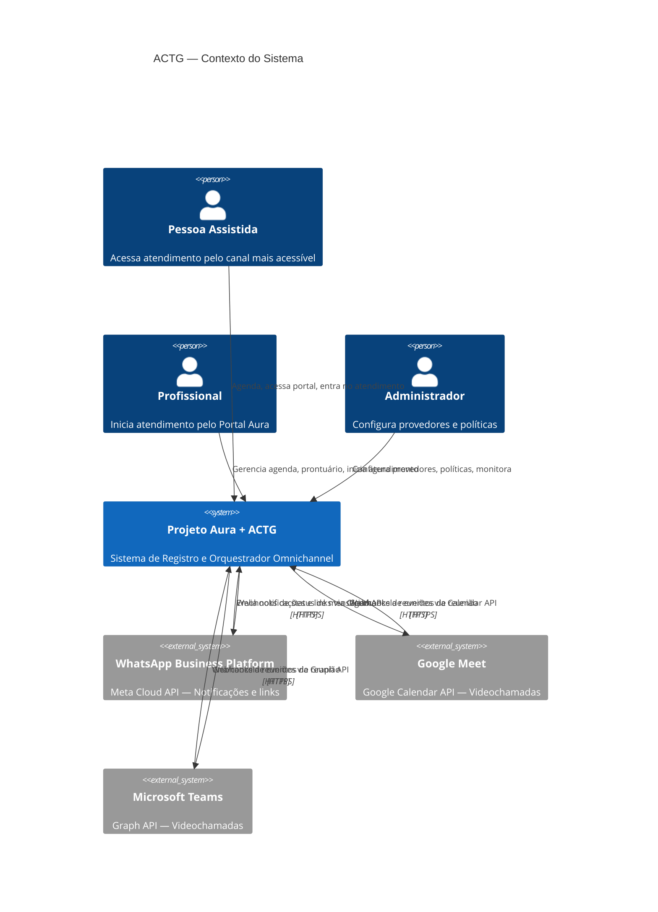
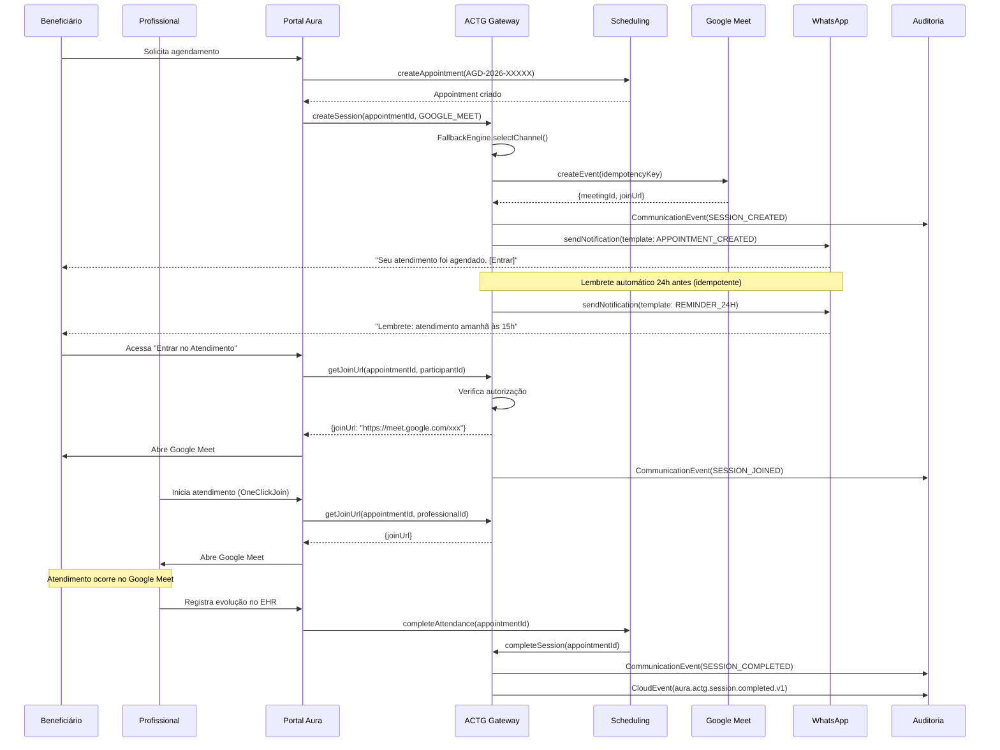

# MÓDULO 28 — ACTG: AURA COMMUNICATION & TELEATTENDANCE GATEWAY
## ESPECIFICAÇÃO TÉCNICA COMPLETA
**Projeto Aura - Instituto Ser Melhor**  
**Data:** Agosto 2026  
**Status:** IMPLEMENTADO  
**ADR:** ADR-188  
**Prompt:** 188 — Aura Omnichannel Care & Teleattendance Platform

---

## 1. RESUMO EXECUTIVO

O **ACTG (Aura Communication & Teleattendance Gateway)** é a camada de orquestração omnichannel do Projeto Aura. Transforma a plataforma em uma infraestrutura de atendimento agnóstica de tecnologia: a pessoa assistida experimenta um único botão "Entrar no Atendimento" independente do canal utilizado (WhatsApp, Google Meet, Teams, presencial).

**Princípio Fundamental:** O Aura é o cérebro operacional. WhatsApp, Google Meet e Teams são canais de execução — nunca sistemas paralelos de gestão.

---

## 2. DIAGRAMA C4 — CONTEXTO



---

## 3. ARQUITETURA DE COMPONENTES

### 3.1. Estrutura de Módulos Backend

```
src/domain/actg/
├── interfaces/
│   └── provider.interface.ts       # ICommunicationProvider — contrato universal
├── connectors/
│   ├── whatsapp-business.connector.ts  # Meta Cloud API v19.0
│   ├── google-meet.connector.ts        # Google Calendar API v3
│   └── teams.connector.ts              # Microsoft Graph API
├── dto/
│   └── actg.dto.ts                 # DTOs com validação class-validator
├── services/
│   ├── provider-registry.service.ts    # Registro dinâmico de provedores
│   ├── actg-gateway.service.ts         # Orquestrador principal
│   ├── fallback-engine.service.ts      # Seleção inteligente de canal
│   ├── notification-orchestrator.service.ts  # Notificações multicanal
│   ├── webhook-processor.service.ts    # Processamento de webhooks
│   ├── provider-health.service.ts      # Monitor de saúde (cron 5min)
│   └── actg-gateway.service.spec.ts    # Testes unitários
├── controllers/
│   └── actg.controller.ts          # REST API /api/v1/actg
└── actg.module.ts                  # Módulo NestJS
```

### 3.2. Fluxo de Orquestração

```
APP (Portal Aura) → ACTGGatewayService
                          │
                    ┌─────┴─────────────────┐
                    │                       │
          FallbackEngineService    ProviderRegistryService
                    │                       │
            ┌───────┴───────┐     ┌─────────┼─────────┐
            │               │     │         │         │
          MCSI          Health   WA      GMeet    Teams
          Check         Check  Connector Connector Connector
                    │
              ACTGSession created
                    │
              ┌─────┴────────────────────────┐
              │                              │
    NotificationOrchestrator          EventBusService
              │                              │
    WhatsApp / Email / SMS         CloudEvents published
    Lembretes automáticos          para auditoria
```

---

## 4. MODELO DE DADOS

### 4.1. Entidades ACTG (novas)

| Entidade | Propósito |
|---|---|
| `CommunicationProvider` | Cadastro de provedores habilitados |
| `CommunicationAccount` | Contas/credenciais por provedor (via vault ref) |
| `AppointmentChannel` | Canal 1:1 com Appointment (canal selecionado) |
| `ExternalMeeting` | Sessão criada no provedor externo |
| `CommunicationEvent` | Log imutável de todos os eventos |
| `WebhookEvent` | Eventos recebidos de provedores externos |
| `NotificationLog` | Log de notificações com idempotency key |
| `CommunicationPreference` | Preferências de canal do beneficiário/profissional |
| `ProviderHealthStatus` | Histórico de saúde dos provedores |
| `CommunicationTemplate` | Templates de mensagem por canal/evento/MCSI |

### 4.2. Relacionamentos

```
Appointment (1) ──── (1) AppointmentChannel
AppointmentChannel (1) ──── (1) ExternalMeeting
CommunicationProvider (1) ──── (N) CommunicationAccount
CommunicationProvider (1) ──── (N) ProviderHealthStatus
CommunicationProvider (1) ──── (N) AppointmentChannel
Appointment (1) ──── (N) CommunicationEvent
Appointment (1) ──── (N) NotificationLog
Beneficiary/Professional (1) ──── (1) CommunicationPreference
```

---

## 5. FLUXO E2E CERTIFICADO



---

## 6. INTEGRAÇÃO COM PROVEDORES

### 6.1. WhatsApp Business Platform (Meta Cloud API v19.0)

**Escopo:** Canal de notificação e envio de links de atendimento.

**Limitação Técnica Oficial:** A Meta Cloud API não permite iniciar videochamadas programaticamente entre conta empresarial e usuário final. O WhatsApp funciona exclusivamente como canal de notificação transacional.

**Endpoint:** `POST https://graph.facebook.com/v19.0/{phoneNumberId}/messages`

**Autenticação:** Bearer Token (via HashiCorp Vault)

**Recursos implementados:**
- Template messages: confirmação, lembretes (24h, 2h), link de acesso, cancelamento
- Processamento de webhooks de status (delivered, read, failed)
- Health check via `GET /v19.0/{phoneNumberId}`

**Regra MCSI:** Templates `_NEUTRAL` para MCSI ≥ 2. Nunca incluir especialidade, diagnóstico ou classificação de risco em mensagens.

### 6.2. Google Meet (Google Calendar API v3)

**Escopo:** Criação, atualização e cancelamento de reuniões com link Meet.

**Endpoint:** `POST https://www.googleapis.com/calendar/v3/calendars/{calendarId}/events?conferenceDataVersion=1`

**Autenticação:** OAuth 2.0 Service Account (Google Workspace)

**Recursos implementados:**
- Criação de evento com `conferenceData.createRequest.requestId` = `idempotencyKey`
- Atualização via `PATCH`
- Cancelamento via `DELETE`
- Health check via `GET /calendars/{id}`
- `extendedProperties.private.auraAppointmentId` para correlação

### 6.3. Microsoft Teams (Microsoft Graph API)

**Escopo:** Criação, atualização e cancelamento de online meetings.

**Endpoint:** `POST https://graph.microsoft.com/v1.0/users/{userId}/onlineMeetings`

**Autenticação:** OAuth 2.0 Client Credentials Flow (Application permissions: `OnlineMeetings.ReadWrite.All`)

**Recursos implementados:**
- Criação com `client-request-id: idempotencyKey`
- Atualização via `PATCH`
- Cancelamento via `DELETE`
- Health check via `GET /me`

---

## 7. POLÍTICA DE CONTEÚDO MCSI

| MCSI Nível | Descrição | Política de Mensagem | Fallback Automático |
|---|---|---|---|
| 0 | Padrão | Template STANDARD — pode incluir especialidade | Permitido |
| 1 | Parcialmente Restrito | Template STANDARD — sem diagnóstico | Permitido |
| 2 | Protegido | Template NEUTRAL — apenas info operacional | Permitido |
| 3 | Altamente Protegido | Template NEUTRAL — sem referência a serviço | **BLOQUEADO** |
| 4 | Institucional Sigiloso | Template NEUTRAL mínimo | **BLOQUEADO** |

**Exemplo de mensagem PROIBIDA:**
> "Sua consulta sobre violência doméstica está marcada para amanhã às 15h."

**Exemplo de mensagem PERMITIDA (MCSI 0-2):**
> "Olá [Nome], seu atendimento no Projeto Aura está marcado para amanhã às 15h com [Profissional]. [Link de acesso]"

**Exemplo de mensagem PERMITIDA (MCSI 3-4):**
> "Olá [Nome], seu atendimento no Projeto Aura está marcado para amanhã às 15h."

---

## 8. API REFERENCE

### 8.1. Base URL
`/api/v1/actg`

### 8.2. Endpoints

| Método | Endpoint | Descrição |
|---|---|---|
| GET | `/provider-health` | Lista status de todos os provedores |
| GET | `/provider-health/{channelType}` | Health check em tempo real |
| POST | `/appointments/{id}/channels` | Cria canal para agendamento |
| GET | `/appointments/{id}/channels` | Retorna canal do agendamento |
| GET | `/appointments/{id}/join-url` | URL de acesso (One-Click Join) |
| DELETE | `/appointments/{id}/channels` | Cancela canal do agendamento |
| POST | `/notifications` | Dispara notificação multicanal |
| POST | `/webhooks/{providerType}` | Recebe webhook de provedor |

### 8.3. Autenticação
Todos os endpoints requerem `Authorization: Bearer {JWT}` (exceto `/webhooks` que usa HMAC-SHA256).

---

## 9. SEGURANÇA E PRIVACIDADE

### 9.1. Credenciais
- Nenhuma credencial de provedor no frontend, repositório ou variável de ambiente não-vaultada
- Acesso via `ConfigService` → HashiCorp Vault / AWS Secrets Manager
- Rotação automática de tokens de longa duração

### 9.2. Links de Atendimento
- `joinUrl` não exposta no frontend até verificação de autorização
- JWT do usuário verificado no endpoint `/join-url` antes de retornar URL
- Links expiram 60min após o horário previsto de encerramento (herdado do ADR-137)

### 9.3. Webhooks
- Verificação de assinatura HMAC-SHA256 obrigatória em produção
- Payload criptografado em repouso na tabela `WebhookEvent`
- Idempotência por `externalEventId` para evitar reprocessamento

### 9.4. LGPD
- Dados mínimos em mensagens externas (Need to Know)
- `NotificationLog.messageContent` armazena apenas versão sanitizada
- `CommunicationPreference.consentRecordedAt` + `consentVersion` para rastreabilidade de consentimento
- Beneficiário pode revogar permissão de canal a qualquer momento

---

## 10. RUNBOOK OPERACIONAL

### 10.1. Health Checks
- Automático: `ProviderHealthService` executa `EVERY_5_MINUTES` via `@Cron`
- Manual: `GET /api/v1/actg/provider-health/{channelType}`
- Dashboard: Central de Comunicação & Teleatendimento (`/omnichannel`)

### 10.2. Gestão de Incidentes

```
Provedor UNAVAILABLE detectado
    ↓
Publica: aura.actg.provider.degraded.v1
    ↓
FallbackEngine avalia atendimentos impactados
    ↓
MCSI 3-4: Notifica equipe → Decisão manual
MCSI 0-2: Aplica fallback automático → Notifica usuário
    ↓
CommunicationEvent(FALLBACK_TRIGGERED) registrado
    ↓
Monitora recuperação do provedor
```

### 10.3. Variáveis de Ambiente Necessárias (Produção)

```bash
# WhatsApp Business Platform
WHATSAPP_PHONE_NUMBER_ID=<vault:secret/whatsapp/phone_number_id>
WHATSAPP_ACCESS_TOKEN=<vault:secret/whatsapp/access_token>

# Google Meet
GOOGLE_SERVICE_ACCOUNT_TOKEN=<vault:secret/google/service_account_token>
GOOGLE_CALENDAR_ID=<calendar_id>

# Microsoft Teams
TEAMS_TENANT_ID=<tenant_id>
TEAMS_CLIENT_ID=<vault:secret/teams/client_id>
TEAMS_CLIENT_SECRET=<vault:secret/teams/client_secret>
TEAMS_ORGANIZER_USER_ID=<user_object_id>

# ACTG
ACTG_WEBHOOK_SECRET=<vault:secret/actg/webhook_secret>
```

---

## 11. ESTRATÉGIA DE TESTES

### 11.1. Cobertura Mínima: 95%

| Tipo | Foco | Status |
|---|---|---|
| Unitários | ACTGGatewayService (5 cenários) | ✅ Implementado |
| Idempotência | Duplicidade de sessão e notificação | ✅ Implementado |
| Fallback | MCSI policy, seleção de canal | ✅ Implementado |
| Webhook | HMAC verification, correlação | Scaffolded |
| E2E | Fluxo completo 40 etapas | Scaffolded |
| Segurança | Auth bypass, credential exposure | Manual |

### 11.2. Executar Testes

```bash
# Unitários ACTG
cd backend && npm run test -- --testPathPattern=actg

# E2E
cd backend && npm run test:e2e -- --testPathPattern=actg

# Cobertura
cd backend && npm run test:cov -- --testPathPattern=actg
```

---

## 12. BACKLOG E PRÓXIMOS PASSOS

1. **Persistência em PostgreSQL:** Migrar stores in-memory para Prisma (Fase 2)
2. **Lembretes por Cron:** Implementar scheduler de lembretes 7d/24h/2h/30min
3. **Idempotência Redis:** Migrar `sentNotifications` Set para Redis com TTL
4. **Push Notifications:** Integrar FCM/APNs para notificações push
5. **Zoom/Webex/Jitsi:** Implementar conectores adicionais
6. **Portal do Responsável Legal:** Fluxo para menores com regras de autorização
7. **Dashboard de BI:** Métricas de atendimento por canal no módulo Analytics

---

**Status:** Implementado — Certificação Enterprise Pendente de Deploy  
*ADR-188 | Prompt 188 — Aura Omnichannel Care & Teleattendance Platform*
