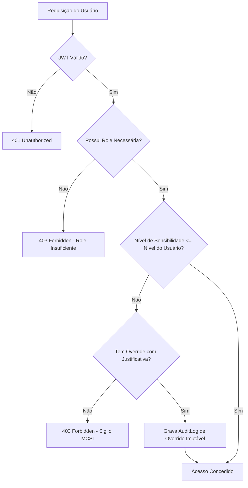
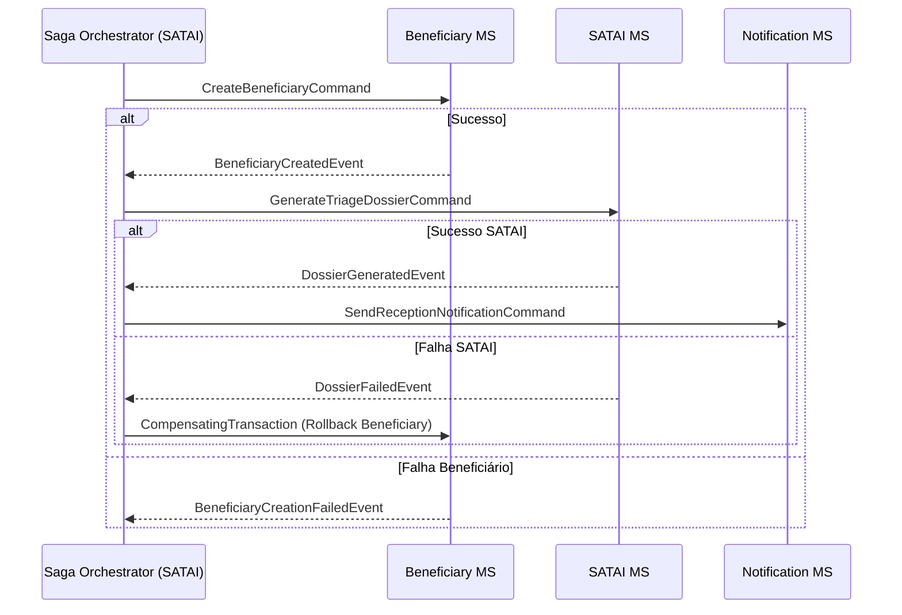
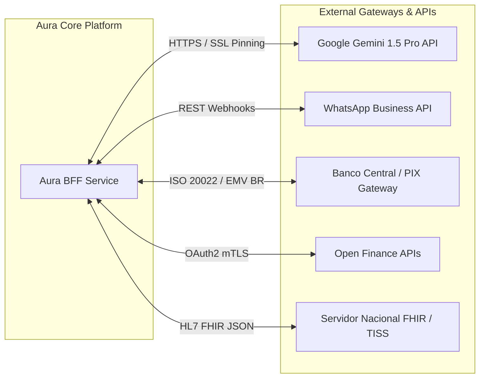
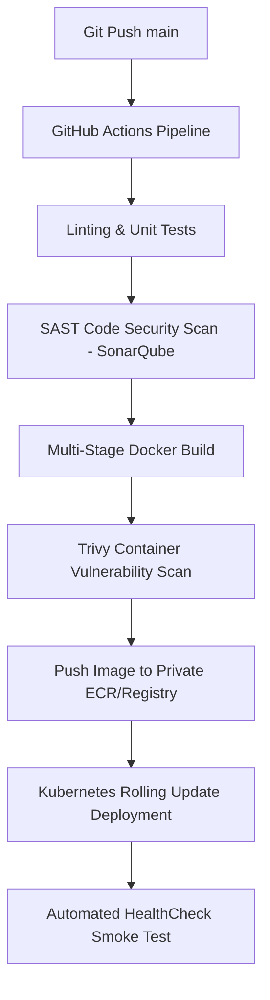

# ENTERPRISE BACKEND PLATFORM SPECIFICATION — AURA CORE SERVER
## Plataforma Integrada Aura — Instituto Ser Melhor (ISMCL)
### Arquitetura Corporativa de Produção, Microsserviços e DevSecOps (Prompt 47)

---

## 1. ETAPA 1 — ARQUITETURA GERAL DO SISTEMA (TOPOLOGIA TO-BE)

O **Aura Core Server** é projetado como um ecossistema corporativo distribuído em microsserviços orientados a eventos (Event-Driven Architecture), estruturado em Monorepo NestJS / Turborepo com isolamento estrito de Bounded Contexts.

```mermaid
graph TD
    subgraph Client Access Layer
        ReactSPA[Aura Web SPA - Client React]
        MobilePWA[Aura Mobile App / PWA]
        PublicDonations[Portal Público /doe]
    end

    subgraph Security Edge & WAF Layer
        Cloudflare[Cloudflare WAF / DDoS Protection]
        Ingress[Kubernetes Ingress NGINX]
    end

    subgraph API Gateway & Service Mesh
        KongGW[Kong API Gateway / Envoy Mesh]
        AuthGuard[Central OAuth2 / OIDC Guard]
    end

    subgraph Backend For Frontend (BFF Layer)
        WebBFF[Aura Web BFF - Fastify/NestJS]
        MobileBFF[Aura Mobile BFF]
    end

    subgraph Domain Microservices (Bounded Contexts)
        IAM_MS[IAM & Identity MS]
        Beneficiary_MS[Beneficiários & Famílias MS]
        Clinical_MS[Prontuário PEP & FHIR MS]
        SATAI_MS[SATAI IA & Triagem MS]
        Schedule_MS[Agenda & Escalas RH MS]
        Financial_MS[Financeiro & PIX MS]
        Telehealth_MS[Telessaúde WebRTC MS]
        Notification_MS[Notificações & WhatsApp MS]
        Audit_MS[MCSI & Audit Log MS]
    end

    subgraph Async Message Broker & Event Bus
        RabbitMQ[RabbitMQ Event Broker / Kafka]
        RedisStream[Redis Streams / Cache]
    end

    subgraph Persistence & Infrastructure Layer
        PG_Primary[(PostgreSQL 16 Primary)]
        PG_Replica[(PostgreSQL Read Replicas - CQRS)]
        Redis_Cluster[(Redis Cluster 7 - Cache & Sessions)]
        S3_Storage[(S3 Compatible / MinIO - Vault)]
    end

    ReactSPA --> Cloudflare
    MobilePWA --> Cloudflare
    PublicDonations --> Cloudflare
    Cloudflare --> Ingress
    Ingress --> KongGW
    KongGW --> AuthGuard
    AuthGuard --> WebBFF
    AuthGuard --> MobileBFF

    WebBFF <--> RabbitMQ
    WebBFF <--> IAM_MS
    WebBFF <--> Beneficiary_MS
    WebBFF <--> Clinical_MS
    WebBFF <--> SATAI_MS
    WebBFF <--> Schedule_MS
    WebBFF <--> Financial_MS
    WebBFF <--> Telehealth_MS

    IAM_MS <--> PG_Primary
    Beneficiary_MS <--> PG_Primary
    Clinical_MS <--> PG_Primary
    SATAI_MS <--> PG_Primary
    Schedule_MS <--> PG_Primary
    Financial_MS <--> PG_Primary

    Clinical_MS --> RabbitMQ
    SATAI_MS --> RabbitMQ
    Financial_MS --> RabbitMQ

    RabbitMQ --> Notification_MS
    RabbitMQ --> Audit_MS

    PG_Primary .-> PG_Replica
    PG_Primary <--> Redis_Cluster
    Clinical_MS <--> S3_Storage
```

---

## 2. ETAPA 2 — ARQUITETURA EM CAMADAS (CLEAN + DDD + HEXAGONAL)

Cada microsserviço no **Aura Core Server** adota os padrões **Clean Architecture**, **Hexagonal Architecture (Ports and Adapters)**, **DDD (Domain-Driven Design)** e **CQRS**.

```
┌──────────────────────────────────────────────────────────────────────────┐
│ Presentation Layer (Controllers HTTP, Gateways WebSocket, DTOs, Zod)     │
│ ┌──────────────────────────────────────────────────────────────────────┐ │
│ │ Infrastructure Layer (Prisma ORM, Repositórios Concretos, Drivers)   │ │
│ │ ┌──────────────────────────────────────────────────────────────────┐ │ │
│ │ │ Application Layer (Use Cases, CQRS Commands/Queries, Handlers)   │ │ │
│ │ │ ┌──────────────────────────────────────────────────────────────┐ │ │ │
│ │ │ │ Domain Layer (Entidades DDD, Agregados, Value Objects, Rules) │ │ │ │
│ │ │ └──────────────────────────────────────────────────────────────┘ │ │ │
│ │ └──────────────────────────────────────────────────────────────────┘ │ │
│ └──────────────────────────────────────────────────────────────────────┘ │
└──────────────────────────────────────────────────────────────────────────┘
```

### 2.1 Padrões de Projeto Aplicados:
- **Repository Pattern**: Abstrai a persistência SQL/Prisma via interfaces de domínio (`IBeneficiaryRepository`).
- **Unit of Work**: Garante atomicidade em transações multi-tabela (`$transaction`).
- **CQRS & Mediator**: Separação total de comandos de gravação (`CreateClinicalNoteCommand`) e consultas otimizadas de leitura (`GetBeneficiaryDashboardQuery`).
- **Domain Events**: Disparo de eventos de domínio imutáveis (`BeneficiaryRegisteredEvent`, `PixDonationReceivedEvent`).

---

## 3. ETAPA 3 — ESTRUTURA DO PROJETO (MONOREPO NESTJS)

```
/backend
├── apps/                               # Aplicações e Serviços Executáveis
│   ├── gateway/                        # API Gateway Central (NestJS + Fastify)
│   ├── bff-web/                        # Backend For Frontend Web
│   ├── ms-iam/                         # Microsserviço de Identidade e Autenticação
│   ├── ms-beneficiary/                 # Microsserviço de Beneficiários e Proteção
│   ├── ms-clinical/                    # Microsserviço de Prontuário (PEP / FHIR)
│   ├── ms-satai/                       # Microsserviço de Inteligência Assistencial
│   ├── ms-schedule/                    # Microsserviço de Agenda e Escalas
│   ├── ms-financial/                   # Microsserviço Financeiro e PIX
│   ├── ms-telehealth/                  # Signaling Server WebRTC & Telessaúde
│   ├── ms-notification/                # Worker Assíncrono de Notificações
│   └── ms-audit/                       # Audit Trail & Log Imutável MCSI
│
├── libs/                               # Bibliotecas Compartilhadas de Domínio
│   ├── domain/                         # Kernel de Entidades e Value Objects
│   ├── application/                    # Bus de Comandos, Queries e Eventos
│   ├── infrastructure/                 # Prisma Module, Redis Module, RabbitMQ Module
│   ├── security/                       # Guardas ABAC/RBAC, AES-256 e Cryptography
│   ├── common/                         # Exceções, Interceptors, Filters, Decorators
│   └── fhir/                           # Mapeadores de Compatibilidade HL7/FHIR
│
├── prisma/                             # Schema Relacional e Versionamento
│   ├── schema.prisma                   # Schema Oficial (38+ Modelos PostgreSQL)
│   └── migrations/                     # Histórico de Migrações SQL
│
├── docker-compose.yml                  # Infraestrutura Local de Produção
├── k8s/                                # Manifestos Kubernetes (Deployments, HPA, Helm)
└── turbo.json                          # Configuração de Monorepo (Turborepo)
```

---

## 4. ETAPA 4 — MAPA DE BOUNDED CONTEXTS (DDD)

| Bounded Context | Entidade Principal / Agregado | Responsabilidade de Domínio | Eventos Publicados |
|---|---|---|---|
| **IAM** | `User`, `Role`, `Session` | Autenticação, Tokens JWT RS256, OAuth2, MFA | `UserAuthenticatedEvent`, `TokenRevokedEvent` |
| **Beneficiários** | `Beneficiary`, `ProtectedProfile` | Cadastro, Prontuário Social, Sigilo MCSI Nível 0-4 | `BeneficiaryCreatedEvent`, `ProfileShieldedEvent` |
| **SATAI** | `TriageDossier`, `IIPScore` | Triagem Assistencial, Cálculo de Risco, IA | `TriageEvaluatedEvent`, `EmergencyAlertTriggered` |
| **Prontuário** | `ClinicalRecord`, `SOAPNote` | Evoluções Médicas, Padrão FHIR R4, Anamnese | `ClinicalNoteAddedEvent`, `DiagnosisSignedEvent` |
| **Agenda** | `Appointment`, `ScheduleSlot` | Agendamentos, Vínculo de Escalas de RH | `AppointmentBookedEvent`, `SlotCancelledEvent` |
| **Financeiro** | `Transaction`, `PixDonation` | Arrecadação PIX EMV BR, Conciliação Open Finance | `PixPaymentReceivedEvent`, `ReconciliationCompleted` |
| **Telessaúde** | `TelehealthRoom`, `PeerConnection` | Sinalização WebRTC E2EE, Gravador de Sessão | `RoomOpenedEvent`, `ConsultationEndedEvent` |

---

## 5. ETAPA 5 — ESPECIFICAÇÃO DE APIS REST & DTOs (OPENAPI 3.0)

Todas as APIs seguem o padrão RESTful rigoroso com resposta envelopada e tratamento padronizado de erros RFC 7807 (Problem Details):

### 5.1 Endpoints Principais Expostos pelo API Gateway

```
POST /api/v1/auth/login                  -> Autentica usuário e retorna JWT + Refresh Token
POST /api/v1/auth/refresh                -> Rotação automática de Refresh Token em Redis
POST /api/v1/auth/mfa/verify             -> Validação de código TOTP MFA
GET  /api/v1/beneficiaries               -> Lista beneficiários com paginação e filtro RBAC/ABAC
POST /api/v1/beneficiaries               -> Cadastra novo beneficiário com verificação de duplicação
GET  /api/v1/clinical/records/:id        -> Prontuário médico com validação de sigilo FHIR
POST /api/v1/financial/pix/charge        -> Gera Payload PIX EMV BR nativo com TXID único
GET  /api/v1/satai/dossiers/:id          -> Dossiê de Inteligência Assistencial SATAI
```

### 5.2 Exemplo de Resposta Padronizada HTTP 200 OK:
```json
{
  "success": true,
  "statusCode": 200,
  "timestamp": "2026-07-23T01:31:30.000Z",
  "correlationId": "aura-trace-98a2f1-00192",
  "data": {
    "id": "BEN-2026-00912",
    "fullName": "Ana Silva Santos",
    "riskLevel": "HIGH",
    "sensitivityLevel": 3
  },
  "meta": {
    "page": 1,
    "limit": 20,
    "total": 1
  }
}
```

---

## 6. ETAPA 6 — ARQUITETURA DE SEGURANÇA & IDENTITY (ZERO TRUST + LGPD)

### 6.1 Mecanismo de Autenticação e Rotação de Tokens
- **Assinatura Assimétrica**: Tokens JWT assinados com par de chaves **RS256** (RSA 4096-bit).
- **Refresh Token Rotation (RTR)**: A cada renovação de acesso, o Refresh Token anterior é invalidado no Redis. Tentativa de reuso dispara imediata revogação de todas as sessões do usuário (**Token Hijacking Protection**).
- **MFA Obrigatório**: Exigido para papéis administrativos (`admin`, `director`, `auditor`, `professional`).

### 6.2 Matriz RBAC / ABAC (MCSI Nível de Sensibilidade)



---

## 7. ETAPA 7 — MENSAGERIA E EVENT-DRIVEN ARCHITECTURE (RABBITMQ + SAGA)

### 7.1 Padrão Saga Orchestrated para Processos Críticos
Para processos distribuídos que envolvem múltiplos microsserviços (ex: Cadastro de Beneficiário + Criação de Dossiê SATAI + Notificação de Recepção), utiliza-se o **Saga Pattern**:



---

## 8. ETAPA 8 — BANCO DE DADOS & PERSISTÊNCIA (POSTGRESQL + REDIS + S3)

- **PostgreSQL 16**: Armazenamento relacional ACID de prontuários, transações, usuários e doações.
- **Redis Cluster 7**: Cache de segundo nível, controle de sessões, rate-limiting e filas Pub/Sub.
- **S3 / MinIO Storage**: Armazenamento criptografado de documentos médicos, laudos e fotos em repouso com suporte a presigned URLs temporárias.

---

## 9. ETAPA 9 — SEGURANÇA ENTERPRISE (OWASP ASVS 4.0 & ZERO TRUST)

1. **Criptografia em Repouso**: Dados PII de beneficiários protegidos (CPF, Endereço, Telefones) são criptografados na coluna do banco com algoritmo **AES-256-GCM** com vetor de inicialização (IV) único por registro.
2. **Criptografia de Senhas**: Hash de senhas realizado via algoritmo **Argon2id** (Memory: 64MB, Iterations: 3, Parallelism: 4).
3. **Proteções HTTP**: Headers de segurança injetados nativamente (`Content-Security-Policy`, `Strict-Transport-Security`, `X-Frame-Options: DENY`, `X-Content-Type-Options: nosniff`).

---

## 10. ETAPA 10 — OBSERVABILIDADE COMPLETA (OPENTELEMETRY + PROMETHEUS + GRAFANA)

- **Distributed Tracing**: Todas as requisições recebem um cabeçalho `x-correlation-id`. A rastreabilidade ponta a ponta entre API Gateway, BFF e Microsserviços é exportada via **OpenTelemetry** para o **Jaeger**.
- **Métricas de Infraestrutura**: Prometheus coleta métricas de CPU, RAM, conexões de banco, latência de rotas (p95, p99) e throughput de mensagens no RabbitMQ.
- **Dashboards Grafana**: Painéis dedicados para Operação Telemedicina, Volume Financeiro PIX e Incidentes de Segurança MCSI.

---

## 11. ETAPA 11 — ESCALABILIDADE E RESILIÊNCIA

- **Horizontal Pod Autoscaling (HPA)**: O Kubernetes escala dinamicamente as instâncias dos microsserviços baseando-se em uso de CPU (>70%) e latência de requisição (>200ms).
- **Circuit Breaker (Resilience4j / Cockatiel)**: Se um serviço externo (ex: Gateway do Banco do Brasil ou API Gemini) apresentar taxa de falhas >50%, o circuito abre temporariamente retornando um fallback seguro sem travar o thread pool da API.

---

## 12. ETAPA 12 — ARQUITETURA DE INTEGRAÇÕES EXTERNAS



---

## 13. ETAPA 13 — PIPELINE DEVSECOPS & IMPLANTAÇÃO KUBERNETES



---

## 14. ETAPA 14 — PLANO DE MIGRAÇÃO (LOCALSTORAGE -> POSTGRESQL ZERO DOWNTIME)

1. **Fase 1 (Sincronização Dual-Write)**: O frontend continua funcionando normalmente via `localStorage` enquanto dispara requisições de background para o novo endpoint `/api/v1/migration/sync`.
2. **Fase 2 (Validação de Paridade)**: O script ETL valida a paridade de 100% das chaves salvando dados no PostgreSQL.
3. **Fase 3 (Virada de Chave)**: A Feature Flag `VITE_USE_REMOTE_BACKEND` é ativada no cliente React, alterando o barramento dos Contextos para chamar a API REST/gRPC do **Aura Core Server**.

---

## 15. ETAPA 15 — ROADMAP TÉCNICO DE EVOLUÇÃO (5 ANOS)

```
2026 (Ano 1) - MVP Enterprise & Consolidação Backend (NestJS + Postgres + Docker)
2027 (Ano 2) - Expansão de Microsserviços & Event-Driven (RabbitMQ + Kubernetes + HPA)
2028 (Ano 3) - Integrações Nacionais (Open Finance + FHIR + Gov.br + Certificação ICP-Brasil)
2029 (Ano 4) - Inteligência Artificial Clínica Avançada & Multi-Agent Swarms
2030 (Ano 5) - Alta Disponibilidade Global Multi-Cloud (AWS + Azure Failover)
```
