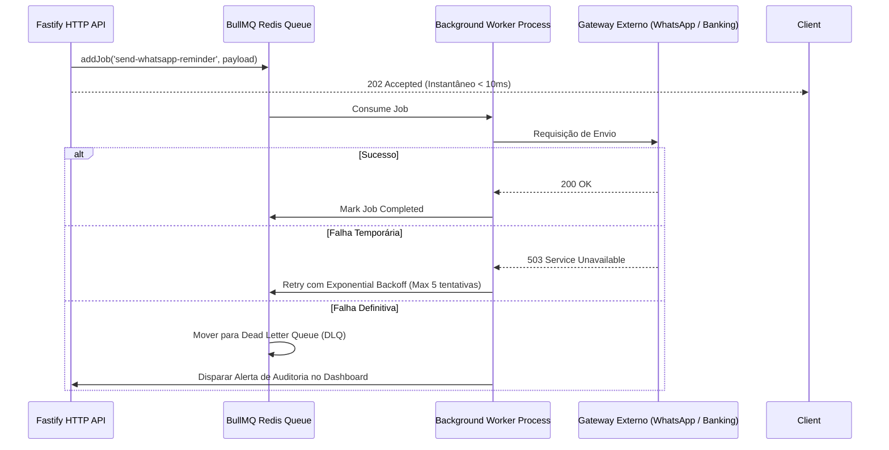

# SPECIFICAÇÃO DE ARQUITETURA DE BACKEND — PROMPT 23
## Plataforma Integrada Aura — Instituto Ser Melhor (ISMCL)
### Fase 1: Arquitetura Base de Produção — Sprint Técnica 23

---

## 1. TECH STACK DO BACKEND ENTERPRISE

| Componente | Tecnologia Selecionada | Motivação & Benefício Arquitetural |
|---|---|---|
| **Framework Core** | **NestJS + Fastify Adapter** | Desempenho HTTP 2x a 3x superior ao Express, suporte nativo a TypeScript, injeção de dependências e Clean Architecture. |
| **ORM & Database Client**| **Prisma ORM / Kysely** | Type-safe queries, migrações declarativas, integração nativa com PostgreSQL e auto-geração de DTOs. |
| **Banco de Dados Relacional**| **PostgreSQL 16** | Suporte a ACID completo, tipos nativos JSONB para auditoria, e extensoes `pgvector` e `uuid-ossp`. |
| **Cache & In-Memory Store**| **Redis Cluster 7** | Cache de sessões, invalidação rápida, rate limiting por IP/token e suporte a Pub/Sub e Streams. |
| **Fila & Mensageria** | **BullMQ + Redis / RabbitMQ** | Processamento assíncrono de notificações (WhatsApp, Email), geração de PDFs e Webhooks financeiros com Dead Letter Queue (DLQ). |
| **Autenticação & Autorização**| **JWT / OAuth2 / OpenID Connect** | Tokens assinados via RS256, Refresh Tokens com rotação automática em Redis e Guards de RBAC/ABAC. |
| **Comunicação Real-time** | **Socket.io (NestJS WebSockets)** | Sinalização de salas de telemedicina WebRTC e notificações push de auditoria/segurança em tempo real. |

---

## 2. ESTRUTURA E ÁRVORE DE DIRETÓRIOS (`/backend`)

```
/backend
├── prisma/
│   ├── schema.prisma             # Schema oficial do banco PostgreSQL
│   ├── migrations/               # Migrações versionadas da base de dados
│   └── seeds/                    # Seeds iniciais de ambiente (Super Admin, Roles, Tabelas)
├── src/
│   ├── main.ts                   # Entrypoint com FastifyAdapter e Swagger OpenAPI
│   ├── app.module.ts             # Módulo raiz importando submódulos de domínio
│   │
│   ├── common/                   # Kernel compartilhado e utilitários
│   │   ├── decorators/           # @CurrentUser(), @Roles(), @Sensitivity()
│   │   ├── filters/              # GlobalExceptionFilter, PrismaExceptionFilter
│   │   ├── guards/               # JwtAuthGuard, RbacGuard, AbacGuard, RateLimitGuard
│   │   ├── interceptors/         # LoggingInterceptor, AuditTrailInterceptor, TransformInterceptor
│   │   ├── middleware/            # RawBodyMiddleware, CorrelationIdMiddleware
│   │   └── utils/                # Criptografia AES-256, Hash Argon2, Validadores
│   │
│   ├── config/                   # Validação de Variáveis de Ambiente (Zod)
│   │   ├── env.config.ts
│   │   ├── database.config.ts
│   │   └── redis.config.ts
│   │
│   ├── modules/                  # Microsserviços & Domínios Delimitados (DDD)
│   │   ├── auth/                 # Módulo de Autenticação (JWT, OAuth2, MFA)
│   │   │   ├── auth.controller.ts
│   │   │   ├── auth.service.ts
│   │   │   ├── strategies/       # JwtStrategy, LocalStrategy, GoogleStrategy
│   │   │   └── dto/              # LoginDto, RegisterDto, RefreshTokenDto
│   │   │
│   │   ├── iam/                  # Módulo de Governança de Acessos & RBAC
│   │   │   ├── iam.controller.ts
│   │   │   ├── iam.service.ts
│   │   │   └── guards/           # RoleGuard, PermissionGuard
│   │   │
│   │   ├── mcsi/                 # Módulo de Segurança Institucional & ABAC (Sigilo)
│   │   │   ├── mcsi.controller.ts
│   │   │   ├── mcsi.service.ts
│   │   │   └── guards/           # SensitivityGuard, ProtectiveMeasureGuard
│   │   │
│   │   ├── beneficiary/          # Gestão de Beneficiários e Famílias Protegidas
│   │   │   ├── beneficiary.controller.ts
│   │   │   ├── beneficiary.service.ts
│   │   │   └── dto/
│   │   │
│   │   ├── satai/                # Inteligência Assistencial & Triagem
│   │   │   ├── satai.controller.ts
│   │   │   ├── satai.service.ts
│   │   │   └── engine/           # Algoritmo de cálculo de IIPScore e prioridade
│   │   │
│   │   ├── clinic/               # Prontuário Eletrônico (PEP) & Evolução SOAP
│   │   │   ├── clinic.controller.ts
│   │   │   ├── clinic.service.ts
│   │   │   └── dto/
│   │   │
│   │   ├── schedule/             # Agenda Central & Integração de Escalas RH
│   │   │   ├── schedule.controller.ts
│   │   │   └── schedule.service.ts
│   │   │
│   │   ├── financial/            # Módulo Financeiro, PIX EMV BR & Extrato
│   │   │   ├── financial.controller.ts
│   │   │   ├── financial.service.ts
│   │   │   └── providers/        # PixProvider, BankSyncProvider
│   │   │
│   │   ├── telehealth/           # Signaling Server WebRTC & Telemedicina
│   │   │   ├── telehealth.gateway.ts # Gateway WebSocket
│   │   │   └── telehealth.service.ts
│   │   │
│   │   ├── notification/         # Filas de Disparo (WhatsApp, Email, Push)
│   │   │   ├── notification.processor.ts # Worker BullMQ
│   │   │   └── notification.service.ts
│   │   │
│   │   └── audit/                # Log de Auditoria Imutável (SIEM / MCSI)
│   │       ├── audit.controller.ts
│   │       └── audit.service.ts
│   │
│   └── providers/                # Provedores Globais de Infraestrutura
│       ├── database/             # PrismaModule & PrismaService
│       ├── redis/                # RedisModule & CacheService
│       └── queue/                # QueueModule (BullMQ)
│
├── test/                         # Suíte de Testes do Backend
│   ├── unit/                     # Testes Unitários dos UseCases
│   ├── integration/              # Testes de Integração com Banco em Contêiner
│   └── e2e/                      # Testes Ponta a Ponta com Supertest
├── docker-compose.yml            # Infraestrutura local (PostgreSQL + Redis + RabbitMQ)
├── Dockerfile                    # Multi-stage build otimizado para produção
├── package.json
└── tsconfig.json
```

---

## 3. MECANISMO DE AUTENTICAÇÃO E AUTORIZAÇÃO (JWT + RBAC + ABAC)

### 3.1 Fluxo de Tokens JWT com Rotação (Security Pattern)
1. **Login**: O usuário envia credenciais (`email`, `password`) ou autentica via OAuth2/MFA.
2. **Access Token (Short-lived)**: Emitido com validade de 15 minutos, assinado via chave privada `RS256`. Contém `iamId`, `roles` e `tenantId`.
3. **Refresh Token (Long-lived)**: Emitido com validade de 7 dias e armazenado no Redis sob a chave `refresh_token:<userId>:<deviceId>`. A cada renovação, o token antigo é revogado e um novo par é gerado (**Token Rotation Pattern**).

### 3.2 Guard de Autorização ABAC (Attribute-Based Access Control)
O `AbacGuard` verifica dinamicamente se o usuário logado possui nível de permissão suficiente para acessar registros de alta sensibilidade do MCSI (vítimas de violência, policiais com medida protetiva):

```typescript
// Exemplo conceitual do Guard ABAC
@Injectable()
export class AbacGuard implements CanActivate {
  canActivate(context: ExecutionContext): boolean {
    const request = context.switchToHttp().getRequest();
    const user = request.user;
    const targetSensitivity = request.params.sensitivityLevel || 0;

    // Regra 1: Administrador Geral possui override com log de auditoria obrigatório
    if (user.roles.includes('super_admin')) return true;

    // Regra 2: Verifica se o nível do usuário satisfaz o nível do registro
    if (user.clearanceLevel >= targetSensitivity) return true;

    throw new ForbiddenException('Acesso negado: Nível de sigilo insuficiente para o registro.');
  }
}
```

---

## 4. PROCESSAMENTO ASSÍNCRONO E FILAS (BULLMQ + REDIS)

A arquitetura utiliza o **BullMQ** sobre o **Redis** para descentralizar tarefas pesadas do ciclo de resposta HTTP da API:



---

## 5. DOCUMENTAÇÃO E PADRÃO DE RESPOSTA HTTP (OPENAPI 3.0)

Todas as APIs expostas pelo backend NestJS/Fastify são documentadas automaticamente via **Swagger / OpenAPI 3.0** no endpoint `/docs`. O formato de resposta da API segue a especificação padronizada:

```json
{
  "success": true,
  "statusCode": 200,
  "timestamp": "2026-07-23T01:30:00.000Z",
  "correlationId": "req-98f2a1-1721",
  "data": {
    "id": "BEN-2026-00412",
    "name": "Ana Silva Santos",
    "status": "ACTIVE"
  },
  "meta": {
    "page": 1,
    "limit": 20,
    "total": 1
  }
}
```

---

## 6. PRÓXIMOS PASSO DO ROADMAP DE PROMPT

- **Prompt 24**: Especificação da Modelagem Física do Banco de Dados PostgreSQL (`schema.prisma` com DDL, Relacionamentos, Constraints e Índices).
- **Prompt 25**: Estratégia de Migração de Dados de `localStorage` para o PostgreSQL em Produção.
