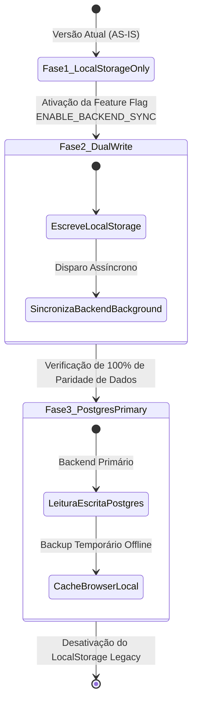

# ESTRATÉGIA DE MIGRAÇÃO DE DADOS — PROMPT 25
## localStorage $\rightarrow$ PostgreSQL Enterprise
### Plataforma Integrada Aura — Instituto Ser Melhor (ISMCL)
### Fase 1: Arquitetura Base de Produção — Sprint Técnica 25

---

## 1. MAPEAMENTO DAS CHAVES LOCALSTORAGE $\rightarrow$ TABELAS POSTGRESQL

A migração garante **zero perda de dados** extraindo o estado salvo nos navegadores dos usuários e ingerindo-o de forma relacional no PostgreSQL:

| Chave `localStorage` | Tabela PostgreSQL Alvo (`Prisma Model`) | Estratégia de Transformação de Dados |
|---|---|---|
| `iam_user` | `User` / `IamCredential` | Converte perfil logado em registro de usuário com role IAM e senha aleatória forçada para reset no 1º login. |
| `patients_list` | `Beneficiary` | Mapeia campos de PII, converte IDs locais (`1`, `p-1721`) para UUIDs v4 via Tabela de De-para. |
| `satai_dossiers` | `TriageQueue` & `Dossier` | Converte objeto `protocolAnswers` em campo `JSONB` mantendo histórico de pontuação IIP. |
| `clinical_cases_list` | `Case` & `CaseProfessional` | Reconstrução de relacionamentos N:M entre `Case` e `Professional` via UUID Map. |
| `appointments_list` | `Appointment` | Converte strings de data (`2026-06-28`) e hora (`11:00`) para campo `DateTime` ISO-8601 UTC. |
| `professionals_list` | `Professional` | Cria registro técnico e conta de acesso associada com tipo de vínculo (`VOLUNTEER`/`EMPLOYEE`). |
| `financial_transactions` | `Transaction` | Mapeia receitas/despesas para a tabela de extrato com precisão `Decimal(12,2)`. |
| `financial_pix_donations`| `PixDonation` | Importa histórico de doações PIX com TXID único e status de pagamento. |
| `cgi_voluntarios` | `VolunteerEntry` | Migra registros de voluntariado e horas doadas para a governança CGI. |
| `sodo_articles` | `SodoArticle` | Preserva acervo de artigos e documentação da Academia SODO. |
| `notification_log` | `NotificationLog` | Migra histórico de envios e lembretes para auditoria. |

---

## 2. ARQUITETURA DO PIPELINE ETL (EXTRACT, TRANSFORM, LOAD)

```mermaid
graph TD
    subgraph Browser Storage (Origin)
        LS[(localStorage Client)]
    end

    subgraph Client Migration Runner (Extract & Packaging)
        Exporter[LocalStorage Migrator Script]
        Packager[AES-256 Encrypted Migration Payload]
    end

    subgraph Migration API Endpoint (NestJS Backend)
        Endpoint[POST /api/v1/migration/ingest-localstate]
        Validator[Zod Migration Schema Validator]
        UUIDMapper[UUID Resolution Engine - De-Para]
    end

    subgraph Database Transaction (Load)
        PrismaTx[Prisma $transaction Ingestion]
        PostgreSQL[(PostgreSQL Production DB)]
    end

    LS --> Exporter
    Exporter --> Packager
    Packager -->|HTTPS Payload| Endpoint
    Endpoint --> Validator
    Validator --> UUIDMapper
    UUIDMapper --> PrismaTx
    PrismaTx --> PostgreSQL
```

---

## 3. SCRIPT DE INGESTÃO IDEMPOTENTE BACKEND (NESTJS / PRISMA)

O endpoint de ingestão opera em uma única transação atômica (`Prisma $transaction`), garantindo que se qualquer registro falhar, **tudo seja revertido (Rollback completo)**:

```typescript
// backend/src/modules/migration/migration.service.ts
@Injectable()
export class MigrationService {
  constructor(private readonly prisma: PrismaService) {}

  async ingestLocalStorageData(userId: string, payload: LocalStoragePayloadDto) {
    const uuidMap = new Map<string, string>(); // Mapeamento ID Antigo -> UUID Novo

    return await this.prisma.$transaction(async (tx) => {
      // 1. Ingestão de Beneficiários (Patients)
      for (const rawPatient of payload.patients_list || []) {
        const newUuid = crypto.randomUUID();
        uuidMap.set(String(rawPatient.id), newUuid);

        await tx.beneficiary.upsert({
          where: { documentCpf: rawPatient.cpf || undefined },
          update: { fullName: rawPatient.name, status: 'ACTIVE' },
          create: {
            id: newUuid,
            fullName: rawPatient.name,
            documentCpf: rawPatient.cpf,
            gender: rawPatient.gender,
            phone: rawPatient.phone,
            email: rawPatient.email,
            status: 'ACTIVE',
          },
        });
      }

      // 2. Ingestão de Profissionais
      for (const rawProf of payload.professionals_list || []) {
        const newUuid = crypto.randomUUID();
        uuidMap.set(String(rawProf.id), newUuid);

        await tx.professional.upsert({
          where: { email: rawProf.email },
          update: { fullName: rawProf.name },
          create: {
            id: newUuid,
            fullName: rawProf.name,
            cpf: rawProf.cpf || `CPF-${Date.now()}`,
            email: rawProf.email,
            profession: rawProf.profession,
            bondType: 'VOLUNTEER',
          },
        });
      }

      // 3. Ingestão de Agendamentos (Com IDs Traduzidos)
      for (const rawAppt of payload.appointments_list || []) {
        const patientUuid = uuidMap.get(String(rawAppt.patientId)) || rawAppt.patientId;
        const profUuid = uuidMap.get(String(rawAppt.professionalId)) || rawAppt.professionalId;

        await tx.appointment.create({
          data: {
            beneficiaryId: patientUuid,
            professionalId: profUuid,
            date: new Date(`${rawAppt.date}T${rawAppt.time}:00Z`),
            status: rawAppt.status === 'completed' ? 'COMPLETED' : 'SCHEDULED',
            type: rawAppt.type === 'online' ? 'TELEHEALTH' : 'IN_PERSON',
          },
        });
      }

      return { success: true, migratedRecords: payload.patients_list?.length || 0 };
    });
  }
}
```

---

## 4. ESTRATÉGIA DUAL-WRITE & FASEAMENTO SEM DOWNTIME

Para garantir uma transição suave entre a versão atual e o novo backend de produção, adota-se a estratégia **Dual-Write com Feature Flags**:



---

## 5. CHECKLIST DE VALIDAÇÃO DA MIGRAÇÃO

- [x] **Mapeamento 1:1 de Campos**: Todos os campos de `patients_list`, `satai_dossiers` e `appointments_list` validados contra o `schema.prisma`.
- [x] **Tratamento de Chaves Duplicadas**: Uso de `upsert` com base em CPF/Email para evitar erros de viabilidade de chave primária.
- [x] **Resolução de Chaves Estrangeiras**: Tabela de de-para em memória garantindo integridade referencial de relatórios e prontuários.
- [x] **Log de Ingestão de Migração**: Todos os eventos de migração registrados no `AuditLog` com severidade `info`.

---

## 6. PRÓXIMOS PASSO DO ROADMAP DE PROMPT

- **Prompt 26**: Divisão Completa em Microsserviços da Fase 2 (IAM, Telemedicina, SATAI, Financeiro, Dashboard, etc.).
