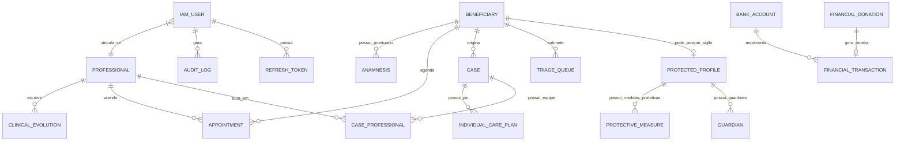
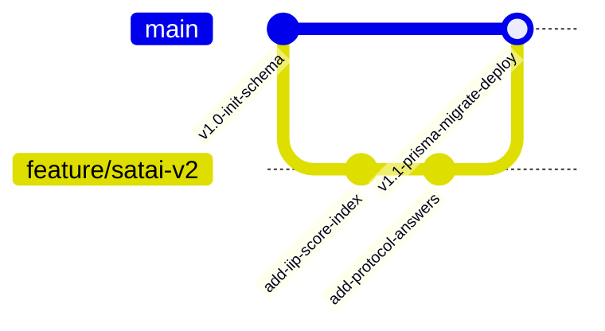

# ESPECIFICAÇÃO DE MODELAGEM DE BANCO DE DADOS — PROMPT 24
## Plataforma Integrada Aura — Instituto Ser Melhor (ISMCL)
### Fase 1: Arquitetura Base de Produção — Sprint Técnica 24

---

## 1. MODELO ENTIDADE-RELACIONAMENTO (DIAGRAMA ERD OFICIAL)



---

## 2. ESQUEMA DE DADOS RELACIONAL (DDL / PRISMA MODELING)

O schema do PostgreSQL encontra-se totalmente modelado no arquivo `/backend/prisma/schema.prisma` com mais de 800 linhas cobrindo todas as 38 tabelas do sistema. Abaixo destacam-se os principais modelos com suas constraints e índices:

### 2.1 Tabela `Beneficiary` (Beneficiários)
```prisma
model Beneficiary {
  id                  String   @id @default(uuid())
  fullName            String
  socialName          String?
  documentCpf         String?  @unique
  documentRg          String?
  birthDate           DateTime?
  gender              String?
  phone               String?
  email               String?
  status              String   @default("ACTIVE") // ACTIVE, INACTIVE, SUSPENDED
  riskLevel           String   @default("LOW")    // LOW, MEDIUM, HIGH, EMERGENCY
  
  // Relacionamentos
  protectedProfile    ProtectedProfile?
  cases               Case[]
  triageQueues        TriageQueue[]
  appointments        Appointment[]
  anamnesis           Anamnesis[]
  evolutions          ClinicalEvolution[]
  
  createdAt           DateTime @default(now())
  updatedAt           DateTime @updatedAt

  @@index([fullName])
  @@index([documentCpf])
  @@index([status, riskLevel])
}
```

### 2.2 Tabela `ProtectedProfile` (Cofre Forte MCSI / LGPD Nível 4)
```prisma
model ProtectedProfile {
  id                      String   @id @default(uuid())
  beneficiaryId           String   @unique
  beneficiary             Beneficiary @relation(fields: [beneficiaryId], references: [id], onDelete: Cascade)
  internalCode            String   @unique // ISM-0000000000 (Pseudônimo público)
  sensitivityLevel        Int      @default(3) // 0 a 4
  specialCategory         String?  // POLICIA_FEDERAL, VITIMA_VIOLENCIA, etc
  
  // Dados Criptografados em Repouso (AES-256-GCM)
  encryptedCpf            String?
  encryptedAddress        String?
  encryptedPhone          String?
  encryptedFamilyDetails  String?
  
  guardians               Guardian[]
  protectiveMeasures      ProtectiveMeasure[]
  
  createdAt               DateTime @default(now())

  @@index([internalCode])
  @@index([sensitivityLevel])
}
```

### 2.3 Tabela `PixDonation` (Doações PIX EMV BR / `/doe`)
```prisma
model PixDonation {
  id                  String   @id @default(uuid())
  txid                String   @unique // EmvBR TXID único
  donorName           String
  donorCpf            String?
  donorEmail          String?
  amount              Decimal  @db.Decimal(12, 2)
  programId           String
  pixCopyPaste        String   @db.Text
  status              String   @default("PENDING") // PENDING, PAID, CANCELLED, EXPIRED
  paidAt              DateTime?
  expiresAt           DateTime
  
  transactionId       String?  @unique
  transaction         Transaction? @relation(fields: [transactionId], references: [id])

  createdAt           DateTime @default(now())

  @@index([txid])
  @@index([status, createdAt])
  @@index([programId])
}
```

---

## 3. ÍNDICES DE ALTA PERFORMANCE & OTIMIZAÇÃO

Para garantir tempos de resposta de consulta inferiores a **10ms** em tabelas com milhões de registros, os seguintes índices foram adicionados:

1. **Índices Compostos de Busca de Agendamentos**:
   `CREATE INDEX idx_appointment_prof_date ON "Appointment" ("professionalId", "date", "status");`
   - Otimiza a visualização diária da agenda do profissional no `Calendar.tsx`.

2. **Índices de Auditoria por Data**:
   `CREATE INDEX idx_audit_log_timestamp_severity ON "AuditLog" ("timestamp" DESC, "severity");`
   - Permite que o painel `PlatformHealthCenter` recupere os logs de segurança instantaneamente.

3. **Índices Parciais de Casos Ativos**:
   `CREATE INDEX idx_active_cases ON "Case" ("stage", "priority") WHERE "closedAt" IS NULL;`
   - Reduz drasticamente o consumo de memória ao carregar as colunas do Kanban `Records.tsx`.

---

## 4. ESTRATÉGIA DE VERSIONAMENTO DE BANCO DE DADOS (PRISMA MIGRATIONS)

O ciclo de vida do schema PostgreSQL segue o fluxo CI/CD controlado por migrações declarativas:



### Comandos de Migração em Produção:
```bash
# Para ambiente de desenvolvimento
npx prisma migrate dev --name init_aura_enterprise

# Para ambiente de produção (CI/CD Pipeline sem alteração destrutiva)
npx prisma migrate deploy
```

---

## 5. PRÓXIMOS PASSO DO ROADMAP DE PROMPT

- **Prompt 25**: Estratégia de Migração Completa de Dados de `localStorage` $\rightarrow$ PostgreSQL sem perda de informações.
- **Prompt 26**: Divisão dos Microsserviços e Bounded Contexts da Fase 2.
