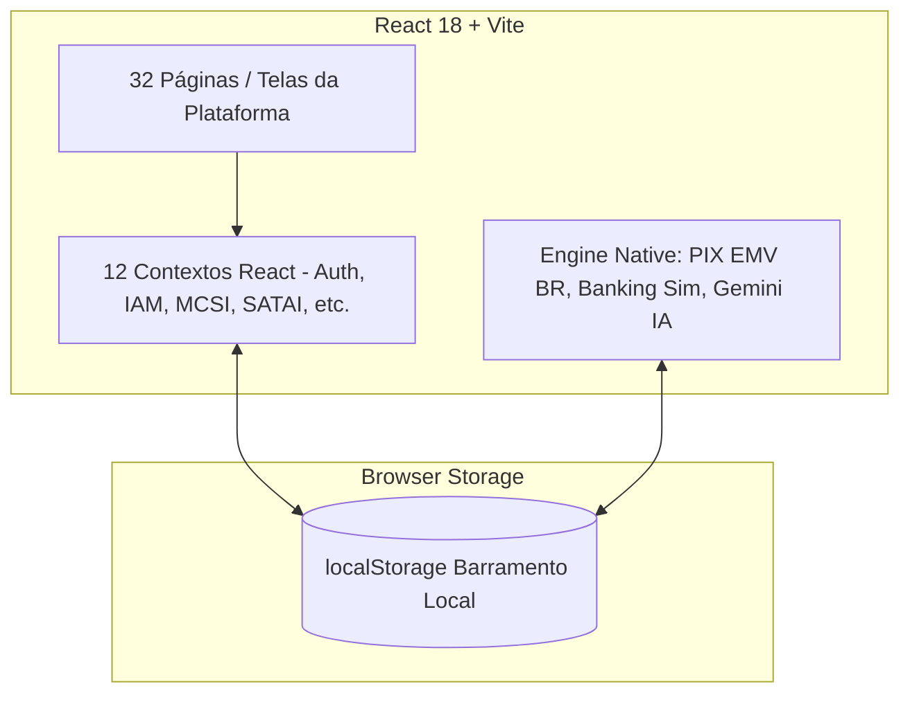
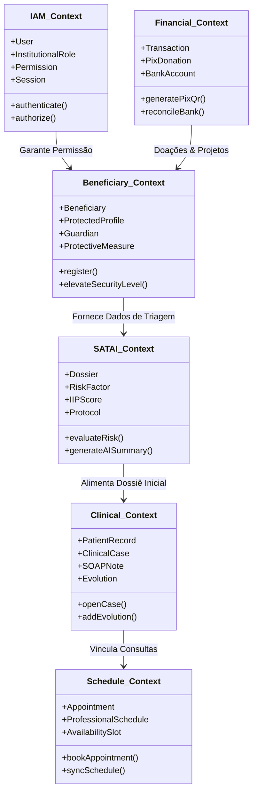

# ENTERPRISE ARCHITECTURE BLUEPRINT — PROMPT 22
## Plataforma Integrada Aura — Instituto Ser Melhor (ISMCL)
### Fase 1: Arquitetura Base de Produção — Sprint Técnica 22

---

## 1. MAPEAMENTO E DIAGNÓSTICO DA ARQUITETURA ATUAL (AS-IS)

### 1.1 Visão Geral do Estado Atual
A Plataforma Aura encontra-se construída como uma SPA (Single Page Application) em React 18, TypeScript 5 e Vite. O ecossistema é composto por **32 páginas**, **12 contextos de estado**, **10 conjuntos de mocks/dados estáticos** e **3 serviços nativos** (`pixService`, `bankingService`, `gemini`).



### 1.2 Limitações do Modelo AS-IS para Escala Corporativa
1. **Persistência Monolítica Local**: A utilização do `localStorage` limita o volume de dados a ~5MB por domínio, sem concorrência real entre usuários.
2. **Exposição de Chaves de API (VULN-001)**: Chamadas de IA e integração financeira realizadas diretamente no client-side expõem segredos no bundle JavaScript.
3. **Monolito de Execução no Browser**: Lógica de negócios complexa (regras de sensibilidade do MCSI, cálculo de IIP do SATAI, validações financeiras) é processada no dispositivo do cliente.

---

## 2. ARQUITETURA ALVO ENTERPRISE (TO-BE)

A arquitetura TO-BE evolui o ecossistema para uma **Arquitetura Orientada a Microsserviços e Eventos (Event-Driven Microservices Architecture)** baseada nos princípios de **Clean Architecture**, **Domain-Driven Design (DDD)** e **CQRS (Command Query Responsibility Segregation)**.

```mermaid
graph TD
    subgraph Client Layer
        WebSPA[Aura Web App - React SPA]
        MobileApp[Aura Mobile App - PWA / Native]
        PublicPortal[Portal Público /doe]
    end

    subgraph Edge & Security Layer
        WAF[Cloudflare WAF / DDoS Protection]
        Gateway[API Gateway - NGINX / Kong Gateway]
    end

    subgraph BFF & Core Service Layer
        BFF[BFF - Backend For Frontend - Fastify / NestJS]
    end

    subgraph Microservices Layer (Domain Services)
        IAM_MS[IAM & Auth Service]
        Clinical_MS[Prontuário & Atendimento Service]
        SATAI_MS[SATAI IA & Triagem Service]
        Financial_MS[Financeiro & PIX Service]
        Telehealth_MS[Telessaúde & WebRTC Signaling]
        Notification_MS[Mensageria & Notificações Service]
        Audit_MS[MCSI & Audit Log Service]
    end

    subgraph Message Broker & Event Streaming
        Broker[RabbitMQ / Apache Kafka]
    end

    subgraph Persistence Layer
        DB_Primary[(PostgreSQL Primary DB)]
        DB_Replica[(PostgreSQL Read Replicas - CQRS Read)]
        Cache_Cluster[(Redis Cluster - Session & Data Cache)]
        Object_Storage[(MinIO / S3 - Documentos & Anexos)]
    end

    WebSPA --> WAF
    MobileApp --> WAF
    PublicPortal --> WAF
    WAF --> Gateway
    Gateway --> BFF
    BFF <--> Broker
    BFF <--> IAM_MS
    BFF <--> Clinical_MS
    BFF <--> SATAI_MS
    BFF <--> Financial_MS
    BFF <--> Telehealth_MS
    
    IAM_MS <--> DB_Primary
    Clinical_MS <--> DB_Primary
    SATAI_MS <--> DB_Primary
    Financial_MS <--> DB_Primary
    
    Clinical_MS --> Broker
    SATAI_MS --> Broker
    Financial_MS --> Broker

    Broker --> Notification_MS
    Broker --> Audit_MS

    DB_Primary .-> DB_Replica
    DB_Primary <--> Cache_Cluster
    Clinical_MS <--> Object_Storage
```

---

## 3. ARQUITETURA EM CAMADAS (CAMADAS ENTERPRISE & CLEAN ARCHITECTURE)

Cada microsserviço no backend (NestJS/Fastify) segue estritamente a **Clean Architecture (Robert C. Martin)** organizada em 4 camadas concêntricas com regra de dependência voltada para o interior:

```
┌─────────────────────────────────────────────────────────┐
│ 1. Infrastructure Layer (Frameworks, ORM, Drivers, DB)  │
│  ┌───────────────────────────────────────────────────┐  │
│  │ 2. Interface Adapters (Controllers, DTOs, Presenters) │  │
│  │  ┌─────────────────────────────────────────────┐  │  │
│  │  │ 3. Application Business Rules (Use Cases)   │  │  │
│  │  │  ┌───────────────────────────────────────┐  │  │  │
│  │  │  │ 4. Enterprise Domain (Entities, VO)  │  │  │  │
│  │  │  └───────────────────────────────────────┘  │  │  │
│  │  └─────────────────────────────────────────────┘  │  │
│  └───────────────────────────────────────────────────┘  │
└─────────────────────────────────────────────────────────┘
```

### 3.1 Camada 1: Enterprise Domain (Domínio Central)
- Contém as entidades de negócio puras (`Beneficiary`, `Dossier`, `ClinicalCase`, `Transaction`, `UserCredential`).
- Livre de qualquer biblioteca externa ou dependência de framework.
- Value Objects (VOs): `CPF`, `Email`, `PIXPayload`, `SecuritySensitivityLevel`.

### 3.2 Camada 2: Application Business Rules (Casos de Uso)
- Orquestra os fluxos de aplicação (`CreateBeneficiaryUseCase`, `ProcessDonationPixUseCase`, `EvaluateSataiDossierUseCase`).
- Define interfaces de repositório (`IBeneficiaryRepository`, `IPixGateway`, `IAuditLogger`).

### 3.3 Camada 3: Interface Adapters (Adaptadores)
- Converte os dados entre o formato exigido pelos casos de uso e o formato do mundo externo.
- Controllers HTTP/gRPC, DTOs (Data Transfer Objects) com validação de esquema `Zod`/`class-validator`.

### 3.4 Camada 4: Infrastructure (Infraestrutura)
- Implementações concretas de repositórios usando **Prisma ORM** / **Kysely**.
- Drivers Redis (`ioredis`), RabbitMQ Client (`amqplib`), clientes de banco PostgreSQL.

---

## 4. ARQUITETURA DE DOMÍNIO (BOUNDED CONTEXTS — DDD)

O ecossistema Aura é dividido nos seguintes **Bounded Contexts (Contextos Delimitados)**:



---

## 5. SEPARAÇÃO DA ARQUITETURA FÍSICA E DE IMPLANTAÇÃO

### 5.1 Arquitetura Física de Produção

```
[ Usuários / Navegadores ]
         │ (HTTPS / TLS 1.3 - WSS)
         ▼
[ Cloudflare Edge WAF / CDN ]
         │
         ▼
[ Ingress Controller NGINX ]
         │
 ┌───────┴──────────────────────────────┐
 │ (Rede Interna Kubernetes / Private)  │
 ▼                                      ▼
[ BFF Instance 1..N ]         [ API Gateway / Rate Limiter ]
 │                                      │
 ├──────────────┬───────────────────────┤
 ▼              ▼                       ▼
[IAM-MS]  [Clinical-MS]  [Financial-MS]  [SATAI-MS]
 │              │               │            │
 └──────────────┴───────┬───────┴────────────┘
                        ▼
               [ RabbitMQ Cluster ]
                        │
        ┌───────────────┴───────────────┐
        ▼                               ▼
[ PostgreSQL Primary ]        [ Redis Cluster Cache ]
  (Primary Read/Write)          (Session & RateLimit)
        │
        ▼ (Streaming Replication)
[ PostgreSQL Replica ]
  (Read Replicas - CQRS)
```

---

## 6. PADRÃO CQRS (COMMAND QUERY RESPONSIBILITY SEPARATION)

Para otimizar leituras de alta performance no Dashboard Gerencial sem bloquear operações de gravação nos prontuários clínicos, a plataforma utiliza **CQRS**:

```mermaid
graph LR
    subgraph Command Path (Gravacao - ACID)
        UserCmd[Client Command] --> API_Cmd[Command API Controller]
        API_Cmd --> UseCase_Cmd[Write UseCase]
        UseCase_Cmd --> DB_Write[(PostgreSQL Primary DB)]
    end

    subgraph Sync Engine
        DB_Write --> CDC[Change Data Capture / Triggers]
        CDC --> MessageBroker[RabbitMQ Event: PatientUpdatedEvent]
        MessageBroker --> ReadProjector[Read Model Projector]
        ReadProjector --> RedisReadCache[(Redis Read Views / Replicas)]
    end

    subgraph Query Path (Leitura Rapida - Alta Concorrencia)
        UserQuery[Client Query] --> API_Query[Query API Controller]
        API_Query --> RedisReadCache
        RedisReadCache --> Response[JSON DTO Instantâneo]
    end
```

---

## 7. MATRIZ DE COMUNICAÇÃO INTER-SERVIÇOS

| Protocolo | Origem | Destino | Caso de Uso | Garantia |
|---|---|---|---|---|
| **HTTP/2 (gRPC)** | BFF | IAM Microservice | Autenticação e Verificação de Permissões | Resposta < 5ms |
| **HTTP/2 (gRPC)** | BFF | Clinical Microservice | Leitura e Gravação de Prontuários | Resposta < 20ms |
| **AMQP (RabbitMQ)** | Clinical-MS | Notification-MS | Disparo de Lembrete por WhatsApp/Email | At-least-once |
| **AMQP (RabbitMQ)** | Financial-MS | Audit-MS | Registro de Log de Auditoria Imutável | Persistent |
| **WebSocket (WSS)** | Telehealth-MS | Client React SPA | Sinalização WebRTC e Status de Salas | Real-time |

---

## 8. REGRAS SOLID APLICADAS À ARQUITETURA

1. **Single Responsibility Principle (SRP)**: Cada microsserviço e cada classe UseCase possui uma única razão para mudar. `PixService` cuida exclusivamente da geração EMV BR; a persistência da transação é tratada por `SaveTransactionUseCase`.
2. **Open/Closed Principle (OCP)**: Portas de gateways bancários (`IBankingGateway`) permitem adicionar novos bancos (ex: Banco do Brasil, Itaú, Stripe) criando novas implementações sem alterar o código existente do serviço financeiro.
3. **Liskov Substitution Principle (LSP)**: Qualquer implementação de `IAuditLogger` (seja `DatabaseAuditLogger` ou `CloudWatchAuditLogger`) pode substituir a abstração sem afetar os UseCases.
4. **Interface Segregation Principle (ISP)**: Interfaces pequenas e específicas. Em vez de uma interface monolítica `IPatientRepository`, dividimos em `IPatientReadRepository` e `IPatientWriteRepository` (CQRS).
5. **Dependency Inversion Principle (DIP)**: As camadas internas de Domínio dependem de abstrações (interfaces), nunca de implementações concretas de ORM ou infraestrutura.

---

## 9. PRÓXIMOS PASSO DO ROADMAP DE PROMPT

- **Prompt 23**: Estruturação completa do Backend NestJS/Fastify (Árvore de Pastas, Módulos, DTOs, Guards, Pipelines).
- **Prompt 24**: Modelagem de Banco de Dados PostgreSQL (Relacionamentos, Schemas Prisma, Constraints, Índices).
- **Prompt 25**: Estratégia de Migração de Dados `localStorage` $\rightarrow$ PostgreSQL sem perda de informações.
