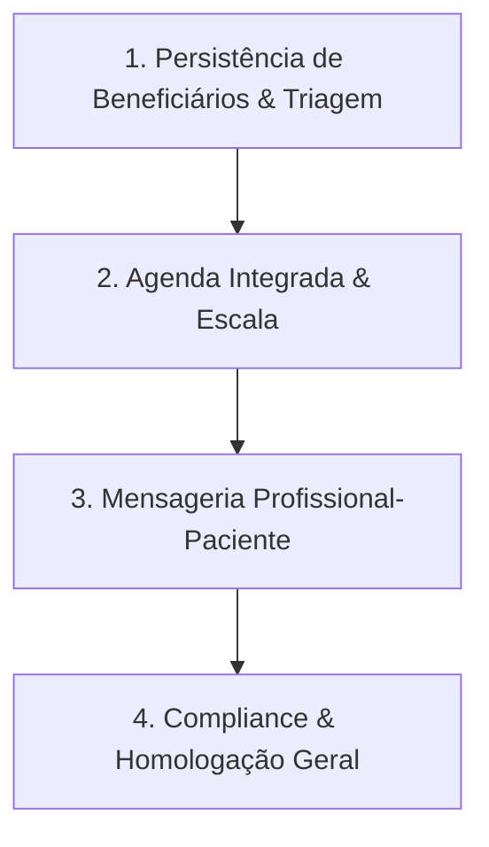

# Mapeamento Estrutural e Roadmap de Desenvolvimento — Projeto Aura (ISMCL)

Este documento apresenta a auditoria técnica de todos os módulos da plataforma do Instituto Ser Melhor (Plataforma Aura), identificando o nível atual de maturidade (Completo, Parcial/Mockado, Pendente) e propondo um cronograma lógico de desenvolvimento ponto a ponto.

---

## 1. Mapeamento de Módulos e Componentes

### 1.1. Core, Dashboard & IAM (Identity and Access Management)
- **IAMLogin.tsx:**
  - *Status:* **COMPLETO**
  - *Descrição:* Interface moderna com suporte a temas, acessibilidade e fluxo completo de simulação de perfis. Recebeu recentemente uma seção especial integrada de captação de doações direcionando para `/doe`.
  - *Persistência:* Grava usuário ativo no `localStorage`, que propaga para as chaves legadas e ativa o RBAC.
  - *Nota:* O arquivo duplicado/obsoleto `Login.tsx` foi removido com sucesso da base de código.
- **Dashboard.tsx:**
  - *Status:* **COMPLETO**
  - *Descrição:* Resumo operacional diário e telemetria de rede/salas integrados reativamente com dados de `localStorage` de todos os módulos e vinculados a links de navegação em cada indicador exibido.
- **IAMCenter.tsx / IAMContext.tsx:**
  - *Status:* **COMPLETO**
  - *Descrição:* Painel de controle de privilégios, simulação de MFA, sessões ativas do usuário e dispositivos autorizados. Passagem sem falhas.

### 1.2. Módulo de Beneficiários e Casos
- **Patients.tsx:**
  - *Status:* **PARCIAL / MOCKADO**
  - *Descrição:* Listagem básica de beneficiários e filtros de busca. O redirecionamento para o prontuário individual está funcional.
  - *O que falta:* Integração de busca dinâmica com o context de IAM e o cadastro inteligente. Persistência de novos beneficiários inseridos (salva temporário na memória).
- **TriageForm.tsx:**
  - *Status:* **PARCIAL / MOCKADO**
  - *Descrição:* Formulário de triagem básico de nova ficha social/clínica.
  - *O que falta:* Acoplar o fluxo de geração automática do caso clínico e disparar o workflow no BPMS.
- **PatientRecord.tsx (Prontuário Eletrônico):**
  - *Status:* **COMPLETO**
  - *Descrição:* Aprimorado com migração do bloqueio de sigilo multinível para dentro do `<main>` (restringindo apenas abas clínicas).
  - *Novidades:* Adicionadas as abas administrativas/cadastrais ("Dados Pessoais", "Acolhimento & Vínculos", "Agenda & Consultas") acessíveis livremente à recepção/administração. Possui máscaras LGPD (CPF/RG) com desmascaramento auditado, histórico de consultas e rede de proteção de vulnerabilidade.

### 1.3. Voluntários & Profissionais
- **Professionals.tsx:**
  - *Status:* **PARCIAL / MOCKADO**
  - *Descrição:* Lista de profissionais cadastrados e controle de escalas.
  - *O que falta:* Gravação persistente e filtros baseados nas especialidades cadastradas.
- **ProfessionalProfile.tsx / ProfessionalPortal.tsx:**
  - *Status:* **COMPLETO**
  - *Descrição:* Visual premium com as abas de "Dados Pessoais", "Atuação Clínica" e "Agenda e Disponibilidade". Workspace completo para voluntários com copilotagem clínica via Gemini (SOAP) e assinatura digital.

### 1.4. Teleconsulta e Mensageria
- **Telehealth.tsx:**
  - *Status:* **COMPLETO**
  - *Descrição:* Simulador robusto de videochamada, chat seguro criptografado com envio de anexos, controle de gravação consentida com termo e hash, e auto-geração de SOAP por IA.
- **Messages.tsx:**
  - *Status:* **PARCIAL / MOCKADO**
  - *Descrição:* Chat interno simples entre membros da equipe técnica.
  - *O que falta:* Canal de comunicação direta com os beneficiários cadastrados e integração de notificação em tempo real (WebSockets mockado).
- **Calendar.tsx:**
  - *Status:* **PARCIAL / MOCKADO**
  - *Descrição:* Agenda geral da clínica com marcação de compromissos.
  - *O que falta:* Cruzamento dinâmico de disponibilidade de profissionais voluntários e controle de faltas.

### 1.5. Subsystems (CGI - Painel de Controle e Governança)
- **CGI.tsx / CGI Components (Projetos, Voluntários, Documentos, Auditoria, AI Insights, BI):**
  - *Status:* **COMPLETO**
  - *Descrição:* Painel de governança integral.
  - *Novidades:* Ações de MFA, suspensão, redefinição de senhas, Compliance e downloads de relatórios JSON 100% integrados e persistidos no `localStorage`.

### 1.6. Módulo Financeiro & Sustentabilidade
- **Financial.tsx / pixService.ts / bankingService.ts / DonationPublic.tsx:**
  - *Status:* **COMPLETO**
  - *Descrição:* Painel de gestão financeira completo com conexão bancária OAuth2 mockada para bancos nacionais/internacionais, gerador nativo de QR PIX (EMV BR) e portal público `/doe` para captação direta de doações integrada com a plataforma.

### 1.7. Sistemas Especiais e Avançados
- **BPMSCenter.tsx:**
  - *Status:* **COMPLETO**
  - *Descrição:* Designer e simulação de fluxos BPMN, automações inteligentes de alertas de menor de idade e desvio de SLA.
- **AdaptiveRegistration.tsx / AdaptiveRegistrationAdmin.tsx:**
  - *Status:* **COMPLETO**
  - *Descrição:* Motor de cadastro inteligente dinâmico e auto-adaptável a depender do perfil social do assistido.
- **SataiWizard.tsx / SataiAdmin.tsx:**
  - *Status:* **COMPLETO**
  - *Descrição:* Assistente conversacional acolhedor (SATAI) de triagem e painel de análise de risco com indicação automática para o programa PIARAVE.
- **PiaraveAcolhimento.tsx / PiaraveAdmin.tsx / PiaraveBiblioteca.tsx:**
  - *Status:* **COMPLETO**
  - *Descrição:* Gestão de casos de violência relacional/doméstica. Biblioteca com cartilhas educativas, formulários de risco de emergência e canais de proteção integrados.
- **PlatformHealthCenter.tsx:**
  - *Status:* **COMPLETO**
  - *Descrição:* Centro de monitoramento de integridade, banco de dados, compliance regulatório e simulação de carga.
- **SodoPortal.tsx / SodoAcademy.tsx / SodoPops.tsx / SodoAdmin.tsx:**
  - *Status:* **COMPLETO**
  - *Descrição:* Gestão de conhecimento interna, base de POPs (Procedimentos Operacionais Padrão) e treinamentos de voluntários.

---

## 2. Diagnóstico de Pendências Técnicas

A maior parte dos sistemas avançados e da governança (CGI, SATAI, PIARAVE, SODO, BPMS, Observabilidade, Financeiro, Dashboards) está **100% implementada no frontend com simulações completas baseadas em localStorage**. As principais pendências que demandam desenvolvimento ou refatoração concentram-se no **Fluxo Operacional de Atendimento**:

1. **Persistência de Beneficiários e Fluxo de Entrada:** O cadastro básico (`Patients.tsx` e `TriageForm.tsx`) não persiste dados de forma global, nem gera o Caso Clínico no prontuário.
2. **Integração do Agendamento Clínico (`Calendar.tsx`):** O calendário não se comunica com a aba "Agenda & Consultas" do `PatientRecord.tsx` nem com a "Disponibilidade" de `ProfessionalProfile.tsx`.
3. **Escalas e Cadastro de Voluntários (`Professionals.tsx`):** Falta linkar com as especialidades pré-cadastradas nas configurações do CGI.
4. **Mensageria Omnichannel (`Messages.tsx`):** Falta canal ativo entre profissionais e beneficiários, simulando disparo de lembretes automáticos de consulta no WhatsApp (API Oficial).

---

## 3. Sequência Lógica de Desenvolvimento (Roadmap)

Propomos o seguinte plano de ação sequencial para fechar o ciclo operacional do sistema:

### Passo 1: Unificação de Cadastro de Beneficiários & Geração de Prontuários
- **Objetivo:** Garantir que novos registros inseridos em `TriageForm.tsx` ou importados do `AdaptiveRegistration.tsx` persistam no `localStorage` sob a mesma chave, alimentando a lista global de `Patients.tsx` e abrindo automaticamente o prontuário individual (`PatientRecord.tsx`).
- **Arquivos-chave:** `Patients.tsx`, `TriageForm.tsx`, `PatientRecord.tsx`.

### Passo 2: Agenda Centralizada e Escala Multidisciplinar
- **Objetivo:** Integrar as grades de horários. Quando um profissional definir sua agenda em `ProfessionalProfile.tsx`, esses horários devem ficar disponíveis para agendamento em `Calendar.tsx` e aparecer reativamente na aba "Agenda & Consultas" de `PatientRecord.tsx`.
- **Arquivos-chave:** `Calendar.tsx`, `ProfessionalProfile.tsx`, `PatientRecord.tsx`, `Professionals.tsx`.

### Passo 3: Mensageria Unificada e Lembretes Omnichannel
- **Objetivo:** Ligar o chat de `Messages.tsx` e o `BeneficiaryPortal.tsx`. Adicionar simulador de envio de notificações SMS/WhatsApp transacionais automáticas na véspera do atendimento clínica (Simulador WhatsApp API).
- **Arquivos-chave:** `Messages.tsx`, `BeneficiaryPortal.tsx`, `Telehealth.tsx`.

### Passo 4: Auditoria e Homologação de Segurança (Compliance Check)
- **Objetivo:** Revisar os limites de acesso baseados no privilégio do IAM em todos os arquivos modificados para assegurar que nenhum dado clínico vaze para usuários não autorizados, emitindo logs correspondentes na trilha indestrutível.
- **Arquivos-chave:** `MCSI.tsx`, `PlatformHealthCenter.tsx`, `PatientRecord.tsx`.
