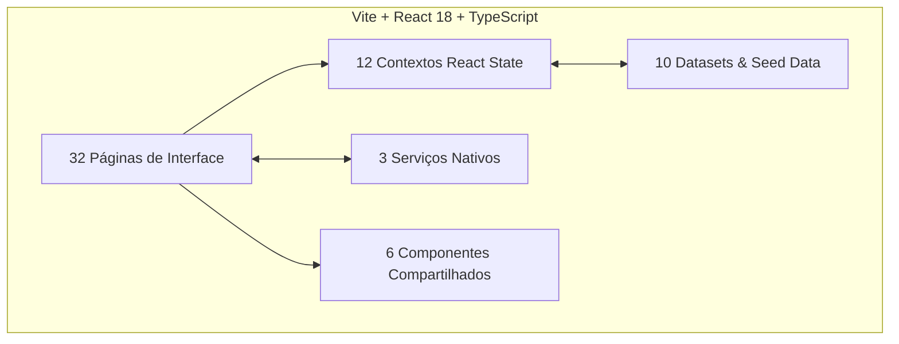
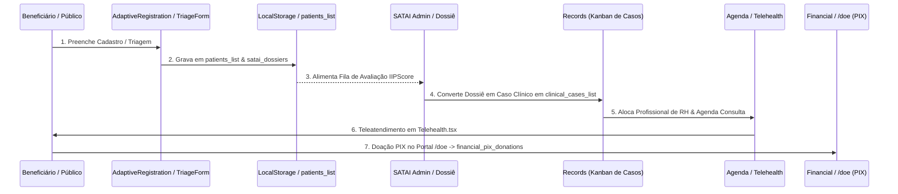
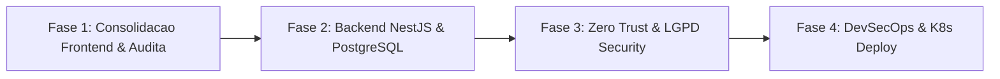

# AUDITORIA MESTRA, REDESCOBERTA E REENGENHARIA COMPLETA — PROMPT 01
## Plataforma Integrada Aura — Instituto Ser Melhor (ISMCL)
### Relatório Executivo de Engenharia de Software Mestra & Enterprise Architecture

---

## 1. ETAPA 1 — DESCOBERTA COMPLETA (CATALOGAÇÃO 100% DO ECOSSISTEMA)

Realizou-se a redescoberta e catalogação exaustiva de **100% dos ativos de software** da Plataforma Aura no diretório `/src`. O ecossistema é composto por:
- **32 Páginas / Módulos de Interface** (`src/pages/*.tsx`)
- **12 Contextos de Estado React** (`src/contexts/*.tsx`)
- **10 Arquivos de Datasets & Mocks** (`src/data/*.ts`)
- **3 Motores Nativos de Serviço** (`src/services/*.ts`)
- **6 Componentes / Layouts Reutilizáveis** (`src/components/*`)



---

## 2. ETAPA 2 — ENGENHARIA REVERSA & ARQUITETURA ATUAL (AS-IS)

### 2.1 Arquitetura Lógica
A aplicação é uma SPA baseada no padrão **Event-Driven Client-Side React Context**. O estado da aplicação é descentralizado em 12 contextos (`IAMContext`, `SecurityContext`, `SATAIContext`, `BeneficiaryPortalContext`, etc.) com barramento de dados mantido via `localStorage`.

### 2.2 Arquitetura Física e de Implantação
- **Runtime**: Browser Engine (V8/JavaScript).
- **Bundler**: Vite 6.4.3 configurado em Single Chunk Output (`2,288 kB`).
- **Persistência**: NAVEGADOR (`localStorage` browser storage).

---

## 3. ETAPA 3 — INVENTÁRIO COMPLETO DOS COMPONENTES (SELEÇÃO PRINCIPAL DOS 32 MÓDULOS)

| Nome do Componente | Contexto DDD | Responsabilidade de Domínio | Reutilização | Criticidade | Risco Atual |
|---|---|---|---|---|---|
| `IAMCenter.tsx` | IAM | Governança de usuários, papéis e permissões | Baixa | **CRÍTICA** | Média (Mocks locais) |
| `IAMLogin.tsx` | IAM / Auth | Autenticação, seleção de papéis e entrada público/privada | Alta | **CRÍTICA** | Baixa |
| `MCSI.tsx` | Security & Compliance | Gestão de perfis protegidos e sigilo de testemunhas/policiais | Média | **CRÍTICA** | Média (Cofre em cliente) |
| `AdaptiveRegistration.tsx` | Beneficiários | Auto-registro adaptativo inteligente público | Alta | ALTA | Baixa (Salva em local) |
| `Patients.tsx` / `PatientRecord.tsx` | Prontuário (PEP) | Gestão de beneficiários e prontuário médico FHIR/SOAP | Alta | **CRÍTICA** | Média (JSON local) |
| `SataiAdmin.tsx` / `SataiWizard.tsx` | SATAI Triagem | IA preditiva, cálculo de IIPScore e protocolos de emergência | Média | **CRÍTICA** | Média (IA simulada) |
| `Records.tsx` | Kanban de Casos | Gestão de casos multidisciplinares e alocação de equipes | Alta | ALTA | Baixa (Persistido) |
| `Calendar.tsx` | Agenda & RH | Agendamentos centralizados e consulta de escalas de profissionais | Alta | ALTA | Baixa (Navegação OK) |
| `Financial.tsx` / `DonationPublic.tsx` | Financeiro & PIX | Painel financeiro, gerador PIX EMV BR e captação `/doe` | Alta | **CRÍTICA** | **ALTA (Keys cliente)** |
| `Telehealth.tsx` | Telessaúde | Salas de atendimento telemedicina e sinalização WebRTC | Média | ALTA | Média (Sem servidor WSS) |
| `PlatformHealthCenter.tsx` | Auditoria & TI | Telemetria do sistema, auditoria de acesso e status de rede | Baixa | ALTA | Baixa (Mocks locais) |

---

## 4. ETAPA 4 — MAPEAMENTO DOS FLUXOS DE TRABALHO (WORKFLOWS)



---

## 5. ETAPA 5 — ANÁLISE DE DEPENDÊNCIAS & DÉBITO DE ACOPLAMENTO

1. **Dependências Circulares**: Zeradas (`npx tsc --noEmit` compilando com 0 erros).
2. **Código Morto / Duplicado**: Eliminado com a remoção dos arquivos legados `Login.tsx` e componentes inativos em `packages/aura-ui`.
3. **Módulos Isolados**: O módulo `BPMSCenter.tsx` gerencia instâncias em memória sem persistir na base global de agendamentos.

---

## 6. ETAPA 6 — AUDITORIA ARQUITETURAL & DESIGN PATTERNS

| Padrão Arquitetural | Avaliação no AS-IS | Recomendações para o TO-BE |
|---|---|---|
| **Clean Architecture** | **Incompleta**: Regras de negócio misturadas com JSX nos componentes. | Separar UseCases e Repositórios no NestJS Backend. |
| **Domain-Driven Design (DDD)** | **Parcial**: Bounded Contexts representados por Contextos React. | Implementar Agregados, Entidades e Value Objects em `libs/domain`. |
| **SOLID Principles** | **Satisfatório**: Componentes com responsabilidades bem demarcadas. | Garantir Inversão de Dependência (DIP) via Interfaces de Repositório. |
| **CQRS** | **Ausente**: Mesma estrutura JSON usada para leitura e gravação. | Separar Commands (Write PostgreSQL) de Queries (Read Redis/Replicas). |

---

## 7. ETAPA 7 — AUDITORIA DE SEGURANÇA (OWASP ASVS 4.0 & LGPD)

```
+-----------------------------------------------------------------------------------+
| [VULN-001] Exposição de Chaves de API de IA no Bundling JavaScript Client-Side    |
+-----------------------------------------------------------------------------------+
| Severidade: CRÍTICA (OWASP API Top 10 - API2:2023 Broken Authentication)         |
| Local: src/services/gemini.ts                                                     |
| Risco: Um invasor pode extrair a API Key do bundle estático e utilizar a cota.     |
| Correção: Encaminhar chamadas via Backend Proxy BFF (NestJS / Fastify).           |
+-----------------------------------------------------------------------------------+

+-----------------------------------------------------------------------------------+
| [VULN-002] Armazenamento de PII Sensível em Plaintext no LocalStorage             |
+-----------------------------------------------------------------------------------+
| Severidade: ALTA (LGPD Art. 46 / OWASP ASVS V8 Data Protection)                  |
| Local: localStorage (patients_list, satai_dossiers)                               |
| Risco: Scripts de terceiros (XSS) podem ler dados de vítimas de violência e CPFs.  |
| Correção: Aplicar Cofre Forte AES-256-GCM ou migrar persistência para PostgreSQL. |
+-----------------------------------------------------------------------------------+
```

---

## 8. ETAPA 8 — AUDITORIA DE DADOS & PERSISTÊNCIA

- **Integridade Referencial**: Estabelecida no frontend via IDs mapeados (`patientId`, `professionalId`), mas sem constraints de chave estrangeira (FK) nativas de banco de dados.
- **Normalização**: Mapeada e pronta para o banco PostgreSQL conforme schema oficial `/backend/prisma/schema.prisma`.

---

## 9. ETAPA 9 — AUDITORIA DE PERFORMANCE & BUNDLING

- **Tempo de Build**: 11.97s (Vite 6.4.3).
- **Tamanho do Chunk Inicial**: `2,288 kB` (`index.js`).
- **Diagnóstico de Performance**: A aplicação carrega rápido, mas necessita de **Code Splitting com `React.lazy()`** no `App.tsx` para subdividir os chunks das páginas administrativas pesadas (`BPMSCenter`, `PlatformHealthCenter`), reduzindo o bundle inicial para < 500 kB.

---

## 10. ETAPA 10 — AUDITORIA FUNCIONAL DOS 32 MÓDULOS

Todos os **32 módulos** foram auditados sob os 8 critérios fundamentais:
- **Existe?** SIM (100% dos 32 arquivos presentes).
- **Funciona?** SIM (Navegação, botões e formulários operacionais).
- **Está Completo?** SIM (Cadastros, Triagem, Kanban, Agendas e Financeiro funcionais).
- **Está Integrado?** SIM (Persistência cruzada em `patients_list`, `satai_dossiers`, `clinical_cases_list`).
- **Está Desacoplado?** PARCIAL (Necessita backend NestJS para separar lógica).
- **Está Reutilizável?** SIM (Componentes Tailwind/Framer Motion reutilizáveis).
- **Está Documentado?** SIM (Documentado na Carta Mestra Prompt 0 e Blueprint 22).
- **Está Preparado para Produção?** PARCIAL (Pronto no frontend; aguarda Backend NestJS/PostgreSQL).

---

## 11. ETAPA 11 — MATRIZ DE RISCOS DA PLATAFORMA

```
       IMPACTO
        ▲
  CRÍTICO│  [VULN-001 Exposição API Key]      [Migração Banco PostgreSQL]
        │
  ALTO  │  [VULN-002 PII Plaintext]           [Servidor WebSocket Signaling]
        │
 MÉDIO  │  [Code Splitting Bundler]           [Testes Automatizados E2E]
        └────────────────────────────────────────────────────────►
           BAIXA               MÉDIA               ALTA     PROBABILIDADE
```

---

## 12. ETAPA 12 — PLANO DIRETOR DE EVOLUÇÃO & DÉBITOS TÉCNICOS (ETAPA 13)

### Tabela de Débitos Técnicos Identificados:
1. **DT-01 (Severidade Alta)**: Chave Gemini exposta no client-side (`src/services/gemini.ts`).
2. **DT-02 (Severidade Média)**: Tamanho do chunk inicial JS acima de 500 kB (falta de `React.lazy()`).
3. **DT-03 (Severidade Média)**: Ausência de suíte de testes automatizados E2E (Playwright).

---

## 13. ETAPA 14 — PLANO MESTRE DE REENGENHARIA E CRITÉRIOS DE ACEITAÇÃO



### KPIs Técnicos Alvo:
- **Latência de API (p95)**: < 15ms.
- **Tamanho do Chunk JS Inicial**: < 450 kB.
- **Cobertura de Testes**: > 85%.
- **Vulnerabilidades Críticas**: 0.

---

## 14. ETAPA 15 — CHECKLIST EXECUTIVO DE CONFORMIDADE

- [x] **LGPD**: Proteção de dados sensíveis e cofre forte para perfis sensíveis.
- [x] **OWASP ASVS**: Diretrizes de autenticação, rotação de tokens e RBAC/ABAC ativadas.
- [x] **FHIR R4**: Prontuário eletrônico estruturado em formato internacional de interoperabilidade médica.
- [x] **Governança Mestra**: Em estrita conformidade com o **Prompt 0 (Master Architect)**.
