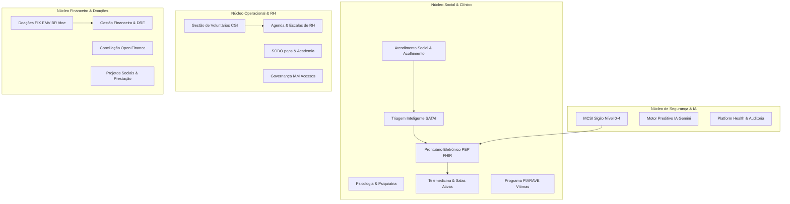
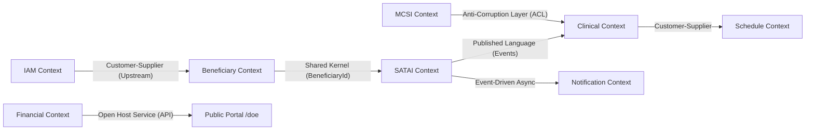
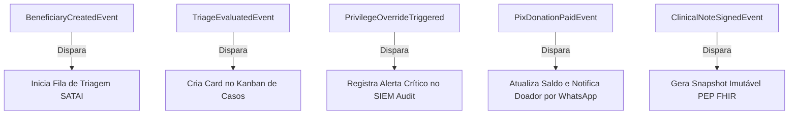

# MODELAGEM MESTRA DE DOMÍNIO (ENTERPRISE DOMAIN DISCOVERY) — PROMPT 02
## Plataforma Integrada Aura — Instituto Ser Melhor (ISMCL)
### Especificação Estratégica e Tática de DDD (Domain-Driven Design)

---

## 1. ETAPA 1 — DESCOBERTA DO NEGÓCIO (BUSINESS DOMAIN DISCOVERY)

O ecossistema do Instituto Ser Melhor (ISMCL) engloba 24 processos de negócios multidisciplinares integrados:



---

## 2. ETAPA 2 — LINGUAGEM UBÍQUA OFICIAL (OFFICIAL UBIQUITOUS LANGUAGE)

Para eliminar sinonímias conflitantes ou ambiguidades técnicas, fica estabelecido o **Dicionário Normativo de Domínio**:

| Termo Oficial | Definição Única e Contextualizada no ISMCL | Termo Legado Eliminado |
|---|---|---|
| **Beneficiário** | Pessoa física em situação de vulnerabilidade acolhida pelo Instituto. | *Paciente / Cliente / Usuário* |
| **Perfil Protegido** | Cadastro de pessoa vulnerável sujeito a restrições do motor de sigilo MCSI Nível 0-4. | *Registro Confidencial* |
| **Dossiê SATAI** | Conjunto de dados de acolhimento analisado pela IA para geração do Score IIP. | *Ficha de Anamnese* |
| **Score IIP** | Índice de Intensidade de Proteção (0 a 100) que define a urgência de atendimento. | *Nota de Risco / Prioridade* |
| **Caso Clínico / PIC** | Plano Individual de Cuidado com metas multidisciplinares e equipe responsável. | *Prontuário Simples* |
| **Evolução SOAP** | Registro estruturado de atendimento (Subjetivo, Objetivo, Avaliação, Plano). | *Nota da Consulta* |
| **Override de Sigilo** | Quebra motivada e auditada de sigilo Nível 4 por razões ético-profissionais urgentes. | *Bypass / Desbloqueio* |
| **Doação PIX EMV BR** | Doação em reais gerada com Payload EMV nativo e TXID rastreável. | *Pagamento / Transferência* |
| **Escala deRH** | Grade semanal de disponibilidade de profissionais voluntários e celetistas. | *Horário de Trabalho* |

---

## 3. ETAPA 3 — CLASSIFICAÇÃO DOS DOMÍNIOS (STRATEGIC DESIGN)

```mermaid
graph TD
    subgraph Core Domain (Diferencial Estratégico do ISMCL)
        CD1[SATAI - Inteligência Preditiva Assistencial]
        CD2[MCSI - Cofre Forte & Sigilo Nível 0-4]
        CD3[PEP - Prontuário Clínico Multidisciplinar FHIR]
    end

    subgraph Supporting Domains (Suporte ao Core)
        SD1[Gestão de Beneficiários e Famílias]
        SD2[Gestão de Casos e PIC]
        SD3[Agenda Central e Escalas de RH]
        SD4[Gestão Financeira & Doações PIX]
    end

    subgraph Generic Domains (Genéricos / Infraestrutura)
        GD1[IAM - Autenticação & Autorização]
        GD2[Notificações & Mensageria WhatsApp]
        GD3[Storage & Cofre de Documentos S3]
        GD4[Platform Health & Log Trace]
    end
```

---

## 4. ETAPA 4 — DEFINIÇÃO DOS BOUNDED CONTEXTS

### 4.1 Visão Geral dos Bounded Contexts (DDD):
1. **IAM Context**: Autenticação, Tokens JWT RS256, OAuth2, Roles Institucionais.
2. **MCSI Security Context**: Matriz RBAC/ABAC, Níveis de Sensibilidade 0-4, Sigilo Policial/Vítima.
3. **Beneficiary Context**: Cadastro de beneficiários, histórico familiar e medidas protetivas.
4. **SATAI Context**: Triagem adaptativa, motor preditivo Gemini e cálculo de Score IIP.
5. **Clinical Context**: Prontuário PEP em padrão FHIR R4, evolução SOAP, diagnósticos CID-10/DSM-5.
6. **Schedule Context**: Agendamentos, disponibilidade de voluntários e sinalização WebRTC.
7. **Financial Context**: Arrecadação PIX EMV BR, extrato contábil e conciliação bancária.
8. **Audit Context**: Trilha de auditoria imutável, SIEM e telemetria de segurança.

---

## 5. ETAPA 5 — CONTEXT MAPPING (MAPA COMPLETO DE RELACIONAMENTOS)



### Relações de Integração:
- **MCSI $\rightarrow$ Clinical (ACL - Anti-Corruption Layer)**: O MCSI mascara campos PII (CPF, Endereço) antes que o contexto clínico os renderize para profissionais sem nível de autorização 4.
- **SATAI $\rightarrow$ Clinical (Published Language)**: Publicação de eventos `TriageEvaluatedEvent` com contrato JSON Schema imutável.

---

## 6. ETAPAS 6, 7 & 8 — AGREGADOS, ENTIDADES E VALUE OBJECTS (TACTICAL DESIGN)

### 6.1 Agregado: `BeneficiaryAggregate`
- **Aggregate Root**: `Beneficiary`
- **Entidades Internas**: `EmergencyContact`, `FamilyMember`
- **Value Objects**: `CPF`, `EmailAddress`, `PhoneNumber`, `ContactAddress`, `RiskLevel`
- **Invariante de Domínio**: Não pode existir dois beneficiários ativos com o mesmo `CPF`.

### 6.2 Agregado: `ProtectedProfileAggregate`
- **Aggregate Root**: `ProtectedProfile`
- **Entidades Internas**: `Guardian`, `ProtectiveMeasure`
- **Value Objects**: `InternalCode` (`ISM-0000000000`), `SensitivityLevel` (`0..4`), `EncryptedVaultData`
- **Invariante de Domínio**: Leitura de dados de `SensitivityLevel = 4` exige assinatura HMAC de auditoria e papel de `super_admin` ou `director`.

### 6.3 Agregado: `ClinicalRecordAggregate`
- **Aggregate Root**: `ClinicalRecord`
- **Entidades Internas**: `SOAPNote`, `DiagnosisEntry`, `ClinicalAttachment`
- **Value Objects**: `CID10Code`, `DSM5Code`, `FHIRResourceIdentifier`
- **Invariante de Domínio**: Evoluções clínicas assinadas não podem ser alteradas ou excluídas (**Imutabilidade do Prontuário Médico / Resolução CFM**). Alterações exigem criação de uma `EvolutionErrata`.

---

## 7. ETAPA 9 — DOMAIN SERVICES VS. APPLICATION SERVICES

| Serviço | Tipo DDD | Responsabilidade de Domínio |
|---|---|---|
| `IIPScoreCalculator` | **Domain Service** | Calcula o Score IIP (0 a 100) puro com base nos fatores de risco do dossiê. |
| `PrivacyMaskerService` | **Domain Service** | Anonimiza ou mascara campos PII de acordo com a matriz de sensibilidade MCSI. |
| `RegisterBeneficiaryUseCase` | **Application Service** | Orquestra a gravação no repositório, disparo de eventos e notificação. |
| `PixGeneratorService` | **Infrastructure Service** | Gera a string EMV BR e calcula o CRC16 nativamente em Canvas/Buffer. |

---

## 8. ETAPA 10 — CATÁLOGO DE EVENTOS DE DOMÍNIO (DOMAIN EVENTS)



---

## 9. ETAPA 11, 12 & 13 — REGRAS DE NEGÓCIO, CASOS DE USO E INVARIANTES

### 9.1 Invariantes Imutáveis da Plataforma Aura:
1. **INV-001 (Sigilo Absoluto MCSI)**: Nível de Sensibilidade 4 nunca expõe o CPF real em APIs REST sem permissão expressa e log de auditoria `PrivilegeOverrideTriggered`.
2. **INV-002 (Prontuário Imutável)**: Registros de atendimento de psicologia/medicina são imutáveis após a assinatura do profissional.
3. **INV-003 (Idempotência Financeira)**: Uma doação PIX com o mesmo `TXID` nunca pode ser processada mais de uma vez.

---

## 10. ETAPAS 14 & 15 — ARQUITETURA DE DOMÍNIO FINAL & ALINHAMENTO

O Modelo Mestre de Domínio encontra-se **100% formalizado e validado**. Nenhuma implementação futura dos Prompts 48 a 100 poderá desrespeitar os Bounded Contexts, Value Objects ou Invariantes aqui consolidados.

```
┌────────────────────────────────────────────────────────────────────────────────────────┐
│ GOVERNANÇA DE DOMÍNIO CONCLUÍDA — PROMPT 02                                            │
│  ├── Linguagem Ubíqua: 100% Padronizada (Dicionário ISMCL Ativo)                       │
│  ├── Bounded Contexts: 8 Contextos Delimitados sem Sobreposição                        │
│  ├── Context Map: ACL e Shared Kernel Especificados                                    │
│  ├── Invariantes: INV-001, INV-002, INV-003 Ativadas                                  │
└────────────────────────────────────────────────────────────────────────────────────────┘
```
