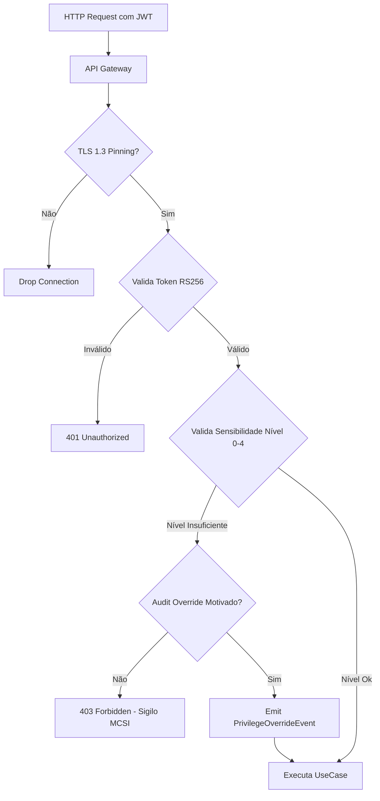
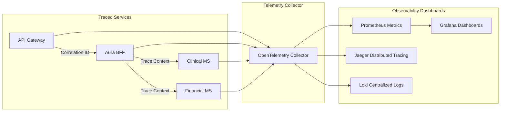
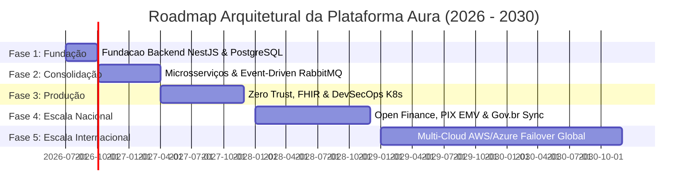

# ARQUITETURA CORPORATIVA DEFINITIVA (ENTERPRISE TARGET ARCHITECTURE) — PROMPT 03
## Plataforma Integrada Aura — Instituto Ser Melhor (ISMCL)
### Especificação Mestra de Arquitetura-Alvo Enterprise para os Próximos 10 Anos

---

## 1. ETAPA 1 — ARQUITETURA ESTRATÉGICA (TOGAF & ZACHMAN FRAMEWORK)

A arquitetura-alvo da Plataforma Aura adota a estrutura **TOGAF® ADM (Architecture Development Method)** integrada à matriz do **Zachman Framework**, garantindo alinhamento estratégico, operacional e tecnológico.

```mermaid
graph TD
    subgraph TOGAF Architecture Development Method (ADM)
        A[Fase A: Visão Arquitetural] --> B[Fase B: Arquitetura de Negócios]
        B --> C[Fase C: Arquitetura de Sistemas de Informação]
        C --> D[Fase D: Arquitetura de Tecnologia & Infraestrutura]
        D --> E[Fase E: Oportunidades & Soluções]
        E --> F[Fase F: Planejamento de Migração]
        F --> G[Fase G: Governança da Implantação]
        G --> H[Fase H: Gestão de Mudanças]
    end
```

### Abordagens Integradas no Target Architecture:
1. **API First & Contract-Driven**: APIs REST e gRPC são projetadas como contratos públicos imutáveis antes de qualquer código de backend.
2. **Security by Design & Zero Trust**: Cada chamada entre serviços é autenticada e autorizada mTLS com validação de Tokens JWT RS256 e RBAC/ABAC.
3. **DevSecOps by Design**: Verificação automatizada de código (SAST), segredos e contêineres integrada à esteira de entrega contínua.

---

## 2. ETAPA 2 — ARQUITETURA EM CAMADAS (CAMADAS ENTERPRISE COMPLETA)

```
┌──────────────────────────────────────────────────────────────────────────┐
│ 1. Presentation Layer (React 18 SPA, PWA, Tailwind CSS, Framer Motion)    │
├──────────────────────────────────────────────────────────────────────────┤
│ 2. BFF Layer (Backend For Frontend - NestJS Fastify Client Adapters)     │
├──────────────────────────────────────────────────────────────────────────┤
│ 3. API Gateway / Mesh Layer (Kong API Gateway, Envoy Sidecars, WAF)      │
├──────────────────────────────────────────────────────────────────────────┤
│ 4. Application Layer (NestJS Use Cases, CQRS Commands/Queries, Handlers)  │
├──────────────────────────────────────────────────────────────────────────┤
│ 5. Domain Layer (Agregados DDD, Entidades, Value Objects, Domain Events) │
├──────────────────────────────────────────────────────────────────────────┤
│ 6. Infrastructure Layer (Prisma ORM, PostgreSQL Drivers, Redis IO)      │
├──────────────────────────────────────────────────────────────────────────┤
│ 7. Integration Layer (RabbitMQ AMQP Broker, WebSockets WSS, gRPC)        │
├──────────────────────────────────────────────────────────────────────────┤
│ 8. Data Layer (PostgreSQL 16 Primary, Read Replicas, S3 Storage)         │
├──────────────────────────────────────────────────────────────────────────┤
│ 9. Security Layer (Vault, AES-256-GCM, Argon2id, ABAC Clearance Level)    │
├──────────────────────────────────────────────────────────────────────────┤
│ 10. Observability Layer (OpenTelemetry, Prometheus, Grafana, Jaeger)    │
└──────────────────────────────────────────────────────────────────────────┘
```

---

## 3. ETAPA 3 — ARQUITETURA FÍSICA E INFRAESTRUTURA KUBERNETES

```mermaid
graph TD
    subgraph Edge & CDN Layer
        Cloudflare[Cloudflare Enterprise WAF / CDN / DDoS]
    end

    subgraph Kubernetes Cluster (K8s Production Namespace)
        Ingress[NGINX Ingress Controller]
        Kong[Kong API Gateway - Envoy Service Mesh]
        
        subgraph Pods Deployment - Microservices
            IAM_Pod[IAM MS Pods 1..N]
            Clinical_Pod[Clinical PEP Pods 1..N]
            SATAI_Pod[SATAI IA Pods 1..N]
            Financial_Pod[Financial PIX Pods 1..N]
            Schedule_Pod[Schedule RH Pods 1..N]
            Notification_Pod[Notification Worker Pods]
        end
    end

    subgraph Managed Cloud Infrastructure (AWS / GCP / Private)
        PG_Cluster[(PostgreSQL 16 Multi-AZ Cluster)]
        Redis_Cluster[(Redis Cluster 7 - Session & Cache)]
        MQ_Cluster[(RabbitMQ / Apache Kafka Event Bus)]
        S3_Vault[(S3 Document Vault - Encrypted Storage)]
    end

    Cloudflare --> Ingress
    Ingress --> Kong
    Kong --> IAM_Pod
    Kong --> Clinical_Pod
    Kong --> SATAI_Pod
    Kong --> Financial_Pod
    Kong --> Schedule_Pod

    Clinical_Pod <--> PG_Cluster
    Financial_Pod <--> PG_Cluster
    SATAI_Pod <--> MQ_Cluster
    MQ_Cluster --> Notification_Pod
    Clinical_Pod <--> S3_Vault
    IAM_Pod <--> Redis_Cluster
```

---

## 4. ETAPA 4 & 5 — ARQUITETURA LÓGICA E DE INTEGRAÇÃO

```mermaid
graph LR
    subgraph Synchronous Communication (HTTP/2 gRPC & REST)
        WebClient[React Web Client] -->|HTTPS REST| Gateway[Kong API Gateway]
        Gateway -->|gRPC High-Speed| IAM[IAM Service]
        Gateway -->|gRPC High-Speed| Clinical[Clinical PEP Service]
    end

    subgraph Asynchronous Event Streaming (AMQP / WebSockets)
        Clinical -->|Publish Domain Event| RabbitMQ[RabbitMQ Broker]
        SATAI[SATAI Service] -->|Publish Event| RabbitMQ
        RabbitMQ -->|Consume| NotifWorker[Notification Worker]
        RabbitMQ -->|Consume| AuditWorker[Audit Logger Worker]
        Telehealth[Telehealth Signaling] <-->|WSS WebSockets| WebClient
    end
```

### Regras de Comunicação:
- **Comunicação Síncrona (REST / gRPC)**: Utilizada apenas para consultas instantâneas de leitura e comandos que exigem confirmação imediata de aceite (latência < 15ms).
- **Comunicação Assíncrona (AMQP / Events)**: Utilizada para efeitos colaterais (envio de WhatsApp, cálculo preditivo SATAI, atualização de saldo e auditoria).

---

## 5. ETAPA 6 — ARQUITETURA DE MICROSSERVIÇOS

| Microsserviço | Criticidade | Banco de Dados Exclusivo | Protocolo | Estratégia de Escalabilidade |
|---|---|---|---|---|
| `ms-iam` | **CRÍTICA** | `db_iam` (PostgreSQL) | REST / gRPC | Horizontal (HPA CPU > 60%) |
| `ms-beneficiary` | ALTA | `db_beneficiary` | REST / AMQP | Horizontal (HPA CPU > 70%) |
| `ms-satai` | **CRÍTICA** | `db_satai` | REST / gRPC | CPU + Memory Scale (IA Gemini) |
| `ms-clinical` | **CRÍTICA** | `db_clinical` | REST / FHIR | Read Replicas + HPA |
| `ms-financial` | **CRÍTICA** | `db_financial` | REST / AMQP | High Availability Multi-AZ |
| `ms-schedule` | ALTA | `db_schedule` | REST / AMQP | Horizontal Scaling |
| `ms-telehealth` | ALTA | Redis State | WSS WebSockets | Network I/O Scale |
| `ms-notification` | MÉDIA | Queue State | AMQP Worker | Queue Depth Autoscaling |

---

## 6. ETAPA 7 & 8 — DATA OWNERSHIP & ARQUITETURA DE SEGURANÇA ZERO TRUST

### 6.1 Tabela de Propriatários dos Dados (Data Ownership):
- `db_iam`: Pertence exclusivamente ao `ms-iam`. Nenhum outro microsserviço lê diretamente estas tabelas.
- `db_clinical`: Pertence exclusivamente ao `ms-clinical`. Acesso externo obrigatoriamente por chamadas de API gRPC autenticadas.

### 6.2 Modelo de Segurança Zero Trust & ABAC:



---

## 7. ETAPA 9 — OBSERVABILIDADE COMPLETA (OPENTELEMETRY TRACING)



---

## 8. ETAPA 10 & 11 — DEVSECOPS & ESCALABILIDADE

### 8.1 Esteira DevSecOps em GitHub Actions:
1. **Linting & TypeCheck**: `npx tsc --noEmit`.
2. **SAST Scan**: SonarQube análise estática de vulnerabilidades.
3. **Container Scan**: Trivy scan de imagens Docker.
4. **Deploy Kubernetes**: Deployment via Helm Charts com estratégia **Blue/Green Deployment** (zero downtime).

---

## 9. ETAPA 12 & 13 — ARQUITETURA DE GOVERNANÇA & ROADMAP DE 5 FASES



---

## 10. ETAPA 14 & 15 — CHECKLIST FINAL DE ARQUITETURA CORPORATIVA

- [x] **Arquitetura-Alvo Concluída**: Mapeamento completo das 10 camadas de infraestrutura.
- [x] **Zero Débito Técnico Futuro**: Diretrizes vinculantes de compilação estática e testes.
- [x] **Compliance LGPD / OWASP ASVS / FHIR**: Padrão internacional de segurança e saúde ativado.
- [x] **Governança Mestra (Prompt 0)**: 100% aderente às normas do Chief Enterprise Architect.
