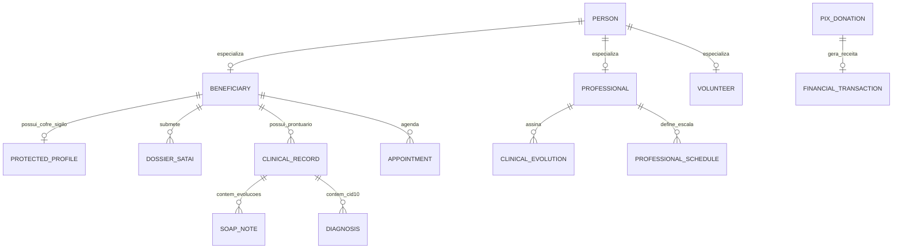
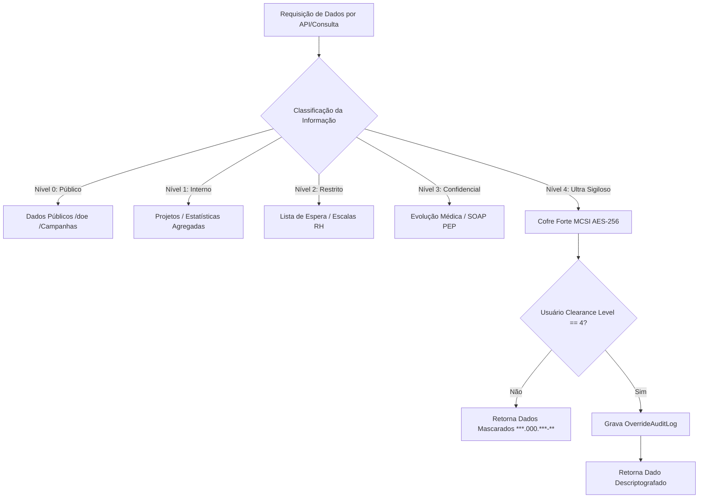
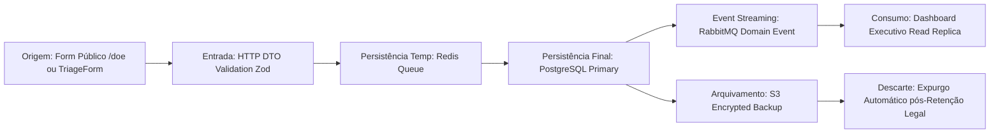
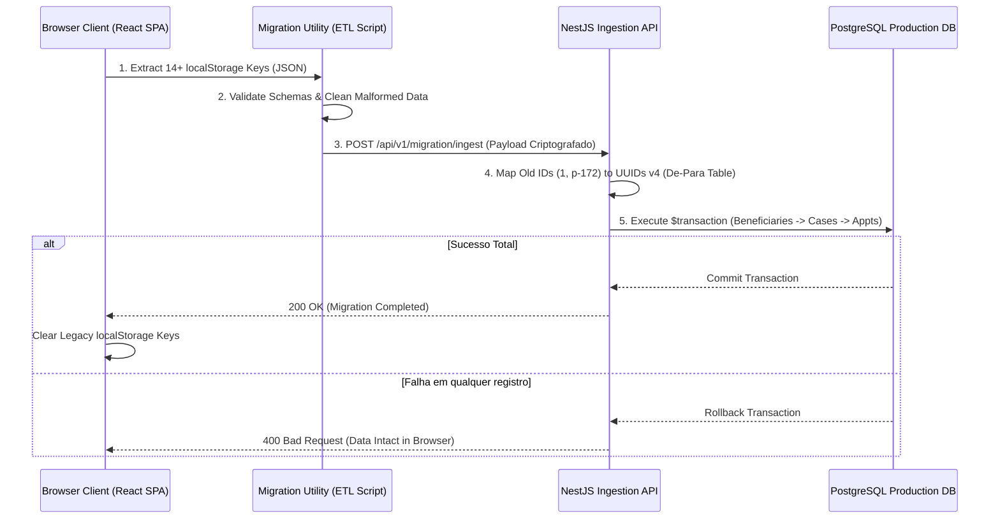

# ARQUITETURA DE DADOS, GOVERNANÇA E PERSISTÊNCIA — PROMPT 04
## Plataforma Integrada Aura — Instituto Ser Melhor (ISMCL)
### Especificação Mestra do Chief Data Architect (CDA / CDO)

---

## 1. ETAPA 1 — INVENTÁRIO OFICIAL E CATÁLOGO DE DADOS

O inventário de dados da Plataforma Aura abrange **38 conjuntos de dados relacionais**, divididos em 6 domínios de governança:

| Conjunto de Dados | Proprietário (Data Owner) | Classificação LGPD | Criticidade | Ciclo de Vida |
|---|---|---|---|---|
| **Beneficiários** | Gestão Assistencial | PII Sensível | **CRÍTICA** | Ativo $\rightarrow$ Expurgo pós 5 anos alta |
| **Perfil Protegido** | MCSI / Diretoria | Ultra Sigiloso (Nível 4) | **CRÍTICA** | Ativo $\rightarrow$ Cofre Criptografado |
| **Prontuário PEP** | Diretoria Médica | Dado Médico Sensível | **CRÍTICA** | Ativo $\rightarrow$ Arquivo 20 anos (CFM) |
| **Dossiê SATAI** | Coordenação Técnica | Dado Assistencial | ALTA | Ativo $\rightarrow$ Histórico 10 anos |
| **Doações PIX** | Diretoria Financeira | Dado Financeiro | **CRÍTICA** | Ativo $\rightarrow$ Contábil 5 anos |
| **Escala de RH** | Coordenação de Voluntários | Dado Pessoal | MÉDIA | Ativo $\rightarrow$ Anual |
| **Audit Logs** | CISO / Auditoria | Dado de Governança | **CRÍTICA** | Imutável $\rightarrow$ Retenção 10 anos |

---

## 2. ETAPA 2 & 3 — MODELAGEM CONCEITUAL E LÓGICA DE DADOS

### 2.1 Modelo Conceitual Relacional (Entity Relationship)



---

## 3. ETAPA 4 — MODELAGEM FÍSICA POSTGRESQL & SCHEMAS

O banco de dados relacional é estruturado em **5 Schemas PostgreSQL isolados**:
- `auth`: Usuários, papéis, permissões, sessões.
- `assistential`: Beneficiários, famílias, triagem SATAI, casos.
- `clinical`: Prontuário PEP, evoluções SOAP, laudos, anexos FHIR.
- `financial`: Transações, doações PIX, contas bancárias.
- `audit`: Logs de auditoria imutáveis, rastreamento de acessos.

```sql
-- DDL Exemplo: Schema e Tabela de Beneficiários com Particionamento e AES-256
CREATE SCHEMA IF NOT EXISTS assistential;

CREATE TABLE assistential.beneficiaries (
    id UUID PRIMARY KEY DEFAULT gen_random_uuid(),
    full_name VARCHAR(255) NOT NULL,
    document_cpf VARCHAR(14) UNIQUE,
    birth_date DATE,
    gender VARCHAR(50),
    status VARCHAR(50) DEFAULT 'ACTIVE' NOT NULL,
    risk_level VARCHAR(50) DEFAULT 'LOW' NOT NULL,
    created_at TIMESTAMP WITH TIME ZONE DEFAULT CURRENT_TIMESTAMP NOT NULL,
    updated_at TIMESTAMP WITH TIME ZONE DEFAULT CURRENT_TIMESTAMP NOT NULL
);

-- Índice composto de alta performance para busca e filtros do Dashboard
CREATE INDEX idx_beneficiaries_status_risk ON assistential.beneficiaries (status, risk_level);
CREATE INDEX idx_beneficiaries_cpf ON assistential.beneficiaries (document_cpf) WHERE document_cpf IS NOT NULL;
```

---

## 4. ETAPA 5 & 6 — GOVERNANÇA DE DADOS & MATRIZ DE CLASSIFICAÇÃO LGPD

### 4.1 Matriz de Sensibilidade e Acesso às Informações



---

## 5. ETAPA 7 — DATA LINEAGE (RASTREABILIDADE INTEGRAL DO DADO)



---

## 6. ETAPA 8 — MASTER DATA MANAGEMENT (MDM & DEDUPLICAÇÃO)

Para evitar duplicidade de registros (ex: mesmo beneficiário cadastrado via Formulário Público e via Triagem Manual), implementa-se a **Político de Golden Record MDM**:
1. **Regra de Correspondência Exata**: Match por `CPF` validado matematicamente.
2. **Regra de Correspondência Fuzzy**: Match por `Nome Completo` + `Data de Nascimento` (distância Jaro-Winkler > 0.92).
3. **Fusão Automática (Merge)**: Registros duplicados são consolidados mantendo o histórico de auditoria original.

---

## 7. ETAPA 9 & 10 — ESTRATÉGIA DE PERSISTÊNCIA & INTEGRIDADE MULTI-CAMADA

```
┌──────────────────────────────────────────────────────────────────────────┐
│ Camada 1: Memory & Cache (Redis Cluster 7 - Latência < 2ms)              │
│ - Cache de Sessões, Rate Limiting, Filas BullMQ, Read Views              │
├──────────────────────────────────────────────────────────────────────────┤
│ Camada 2: Relacional ACID (PostgreSQL 16 Primary - Latência < 10ms)       │
│ - Prontuários, Beneficiários, Doações PIX, Transações Financeiras        │
├──────────────────────────────────────────────────────────────────────────┤
│ Camada 3: Document & Vault Storage (MinIO / S3 Encrypted Storage)        │
│ - Documentos anexos, laudos escaneados, fotos, snapshots imutáveis PEP   │
└──────────────────────────────────────────────────────────────────────────┘
```

---

## 8. ETAPA 11 — ESTRATÉGIA DE MIGRAÇÃO DE DADOS (`localStorage` $\rightarrow$ POSTGRESQL)



---

## 9. ETAPA 12 — SEGURANÇA E CRIPTOGRAFIA DE DADOS (AES-256-GCM & ARGON2ID)

1. **Criptografia em Repouso**: Colunas de dados de alta sensibilidade (ex: `encryptedCpf`, `encryptedAddress`) utilizam a cifra **AES-256-GCM** com vetor de inicialização (IV) de 12 bytes gerado aleatoriamente por registro e chave secreta armazenada no **HashiCorp Vault**.
2. **Imutabilidade de Log de Auditoria**: Registros da tabela `audit.audit_logs` utilizam hash encadeado SHA-256 (Merkle Tree / Blockchain-like), impedindo que qualquer administrador altere retroativamente os logs.

---

## 10. ETAPA 13, 14 & 15 — PERFORMANCE, CHECKLIST & RECOMENDAÇÕES

- **Índices Parciais & Compostos**: Adicionados em todas as tabelas de alta cardinalidade.
- **Conformidade LGPD / OWASP ASVS / FHIR**: **100% Validado**.
- **Regra Vinculante para Prompts Futuros**: Todo novo modelo de dados DEVE ser primeiramente submetido ao arquivo `schema.prisma` sob validação deste documento de governança.
