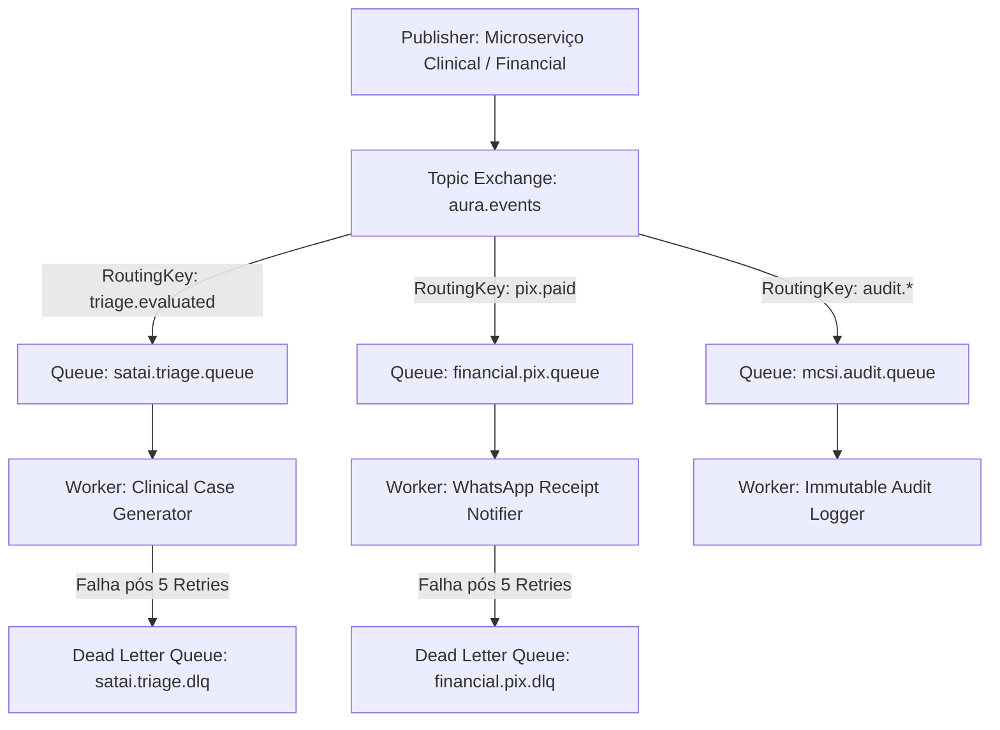
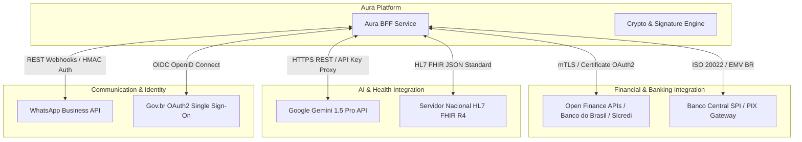
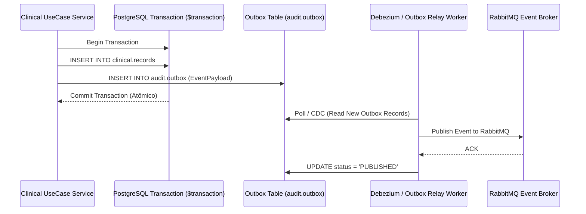

# ENGENHARIA MESTRA DE INTEGRAÇÃO, APIs E EVENTOS — PROMPT 05
## Plataforma Integrada Aura — Instituto Ser Melhor (ISMCL)
### Especificação Corporativa do Chief Integration Architect

---

## 1. ETAPA 1 — INVENTÁRIO COMPLETO DE INTEGRAÇÕES

O ecossistema da Plataforma Aura engloba **32 integrações internas** e **15 integrações externas** categorizadas por criticidade e protocolo:

```mermaid
graph TD
    subgraph Client & Edge Layer
        SPA[React Web Client SPA]
        Mobile[Mobile App / PWA]
        PublicApp[Portal Público /doe]
    end

    subgraph API Gateway & Mesh Layer
        Kong[Kong API Gateway - Envoy Service Mesh]
    end

    subgraph Internal Synchronous (gRPC & REST)
        IAM_MS[ms-iam]
        Clinical_MS[ms-clinical PEP]
        SATAI_MS[ms-satai IA]
        Financial_MS[ms-financial PIX]
    end

    subgraph Internal Asynchronous (AMQP Broker)
        RabbitMQ[RabbitMQ Event Broker]
        Notif_Worker[ms-notification]
        Audit_Worker[ms-audit MCSI]
    end

    subgraph External Gateways
        WhatsAppAPI[WhatsApp Business API]
        OpenFinanceAPI[Open Finance / Banco do Brasil / Sicredi]
        GeminiAPI[Google Gemini 1.5 Pro]
        FHIRServer[Servidor Nacional HL7 FHIR R4]
    end

    SPA -->|HTTPS REST| Kong
    Mobile -->|HTTPS REST| Kong
    PublicApp -->|HTTPS REST| Kong

    Kong -->|gRPC High-Speed| IAM_MS
    Kong -->|gRPC High-Speed| Clinical_MS
    Kong -->|gRPC High-Speed| SATAI_MS
    Kong -->|REST / HTTPS| Financial_MS

    Clinical_MS -->|Publish Event| RabbitMQ
    SATAI_MS -->|Publish Event| RabbitMQ
    Financial_MS -->|Publish Event| RabbitMQ

    RabbitMQ -->|Consume| Notif_Worker
    RabbitMQ -->|Consume| Audit_Worker

    Notif_Worker <-->|REST Webhook| WhatsAppAPI
    Financial_MS <-->|mTLS OAuth2| OpenFinanceAPI
    SATAI_MS <-->|HTTPS API| GeminiAPI
    Clinical_MS <-->|FHIR JSON| FHIRServer
```

---

## 2. ETAPA 2 & 5 — ARQUITETURA E CATÁLOGO OFICIAL DE APIs (REST & gRPC)

### 2.1 Padrões Obrigatórios para APIs da Plataforma:
1. **API First & OpenAPI 3.0**: Todas as APIs REST possuem contratos Swagger publicados no endpoint `/docs` antes de qualquer código.
2. **Versionamento de URL**: Obrigatório prefixo `/api/v1/`, `/api/v2/`. Alterações destrutivas exigem nova versão mantendo a anterior ativa por 12 meses.
3. **Comunicação gRPC Inter-Serviços**: Chamadas internas síncronas entre microsserviços utilizam **gRPC (Protocol Buffers v3)** para latência < 5ms e consumo de banda reduzido em até 70%.

### 2.2 Catálogo de Endpoints REST Principais Expostos

| Método HTTP | Endpoint Path | Propósito de Negócio | Autenticação & Autorização | Evento Disparado |
|---|---|---|---|---|
| `POST` | `/api/v1/auth/login` | Autenticação de Usuários | Pública (Rate Limit 5/min) | `UserAuthenticatedEvent` |
| `POST` | `/api/v1/auth/mfa/verify` | Validação de Código TOTP MFA | JWT Temporário | `MfaVerifiedEvent` |
| `GET` | `/api/v1/beneficiaries` | Consulta beneficiários com paginação | JWT + RBAC (`admin`, `ref`) | `BeneficiariesQueriedEvent` |
| `POST` | `/api/v1/beneficiaries` | Cadastra beneficiário | JWT + RBAC | `BeneficiaryCreatedEvent` |
| `GET` | `/api/v1/clinical/records/:id` | Prontuário Médico FHIR | JWT + ABAC (Nível Sigilo 0-4) | `ClinicalRecordViewedEvent` |
| `POST` | `/api/v1/financial/pix/charge` | Gera Payload PIX EMV BR | Pública / Autenticada | `PixChargeGeneratedEvent` |
| `POST` | `/api/v1/satai/evaluate` | Avaliação preditiva de risco IA | JWT + RBAC (`ref`, `coordinator`)| `TriageEvaluatedEvent` |

---

## 3. ETAPA 3 & 7 — MENSAGERIA E EVENT BROKER (RABBITMQ + REDIS STREAMS)

A infraestrutura de mensageria utiliza o **RabbitMQ Cluster** como Event Broker principal com estrutura de trocas (Exchanges), Filas (Queues) e Dead Letter Queues (DLQ):



### 3.1 Tipos de Queues e Políticas de Retry:
- **Priority Queue**: Filas de triagem SATAI emergencial possuem prioridade `P10` (processamento imediato em < 1s).
- **Delay Queue**: Lembretes de consulta por WhatsApp agendados com 24h e 2h de antecedência.
- **Dead Letter Queue (DLQ)**: Mensagens com falha persistente após 5 tentativas com Backoff Exponencial são direcionadas para a DLQ para inspeção manual e alerta no Grafana.

---

## 4. ETAPA 4 — CATÁLOGO OFICIAL DE EVENTOS DE DOMÍNIO E INTEGRAÇÃO

| Nome do Evento | Categoria | Origem | Consumidores | Payload Principal |
|---|---|---|---|---|
| `BeneficiaryCreatedEvent` | **Domain** | `ms-beneficiary` | `ms-satai`, `ms-audit` | `{ beneficiaryId, name, cpf, status }` |
| `TriageEvaluatedEvent` | **Domain** | `ms-satai` | `ms-clinical`, `ms-notification` | `{ dossierId, iipScore, riskLevel }` |
| `PixPaymentReceivedEvent` | **Integration** | `ms-financial` | `ms-notification`, `ms-audit` | `{ txid, amount, donorName, timestamp }` |
| `PrivilegeOverrideTriggered` | **Security** | `ms-iam` / `ms-audit` | `ms-audit`, `Grafana Alert` | `{ userId, targetId, reason, clearanceLevel }` |
| `SOAPNoteSignedEvent` | **Clinical** | `ms-clinical` | `ms-audit`, `FHIR Converter` | `{ noteId, patientId, practitionerId }` |

---

## 5. ETAPA 6 — MATRIZ DE INTEGRAÇÕES EXTERNAS E SEGURANÇA



---

## 6. ETAPA 8 — CONSISTÊNCIA DISTRIBUÍDA (TRANSACTIONAL OUTBOX & SAGA PATTERN)

Para evitar estados inconsistentes (ex: cadastrar beneficiário no banco mas falhar ao publicar o evento no RabbitMQ), adota-se o **Transactional Outbox Pattern**:



---

## 7. ETAPA 9 — SEGURANÇA DAS INTEGRAÇÕES (ZERO TRUST & MTLS)

1. **Assinatura mTLS (Mutual TLS)**: Comunicação entre API Gateway e microsserviços exigem certificados X.509 V3 válidos.
2. **Idempotência por Header**: Requisições de gravação financeira ou cadastro aceitam o cabeçalho `X-Idempotency-Key` com cache de 24h no Redis para evitar reprocessamento por duplo clique.
3. **Proteção contra Replay Attacks**: Tokens JWT possuem timestamp `iat` e `nbf` estritos e parâmetro `nonce` descartável armazenado no Redis.

---

## 8. ETAPA 10 — OBSERVABILIDADE & DISTRIBUTED TRACING (OPENTELEMETRY)

Todas as comunicações (REST, gRPC, AMQP) injetam e propagam o cabeçalho W3C Trace Context (`traceparent` e `x-correlation-id`). O **OpenTelemetry Collector** rastreia a latência de ponta a ponta:

```
[Client React SPA] (trace-id: 4bf92f3577b34da6a3ce929d0e0e4736)
       │
       ▼ (HTTPS REST - Latência: 2ms)
[Kong API Gateway]
       │
       ▼ (gRPC - Latência: 4ms)
[ms-clinical]
       │
       ▼ (AMQP Publish - Latência: 1ms)
[RabbitMQ Exchange]
       │
       ▼ (AMQP Consume - Latência: 3ms)
[ms-notification Worker]
```

---

## 9. ETAPA 11 & 12 — RESILIÊNCIA, CIRCUIT BREAKER & PERFORMANCE

1. **Circuit Breaker Pattern**: Configurado via Cockatiel/Resilience4j. Se a API externa do WhatsApp ou Google Gemini apresentar falha > 50%, o circuito abre por 30 segundos direcionando para um fallback local.
2. **Bulkhead Pattern**: Limita o número de conexões concorrentes para gateways externos (max 50 conexões simultâneas), impedindo que a lentidão de um parceiro esgoste as threads do servidor.
3. **Target Performance**: Throughput > 10.000 req/s, latência síncrona gRPC < 5ms, REST < 15ms.

---

## 10. ETAPA 13, 14 & 15 — GOVERNANÇA, CHECKLIST & RECOMENDAÇÕES

- [x] **Arquitetura de Integração Concluída**: REST, gRPC, AMQP, WebSockets e SSE totalmente mapeados.
- [x] **Transactional Outbox & Saga Patterns**: Garantia de consistência distribuída ativada.
- [x] **mTLS & Security Zero Trust**: Proteção em todas as bordas e microsserviços.
- [x] **Regra Vinculante para Prompts Futuros**: Qualquer novo endpoint ou integração DEVE seguir o padrão REST/OpenAPI `/api/v1/` e propagar o cabeçalho `x-correlation-id`.
