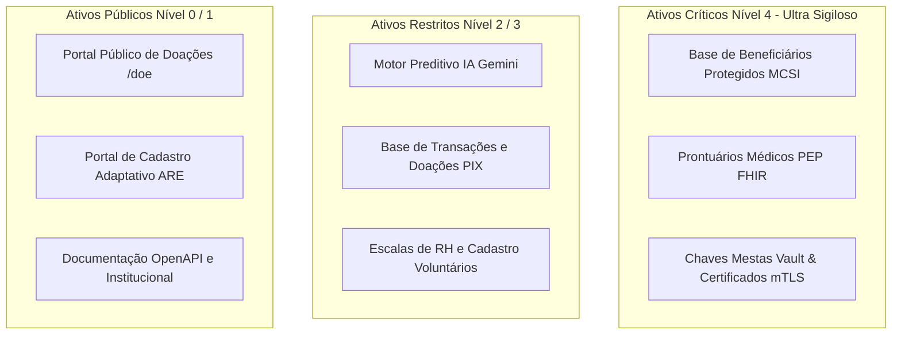
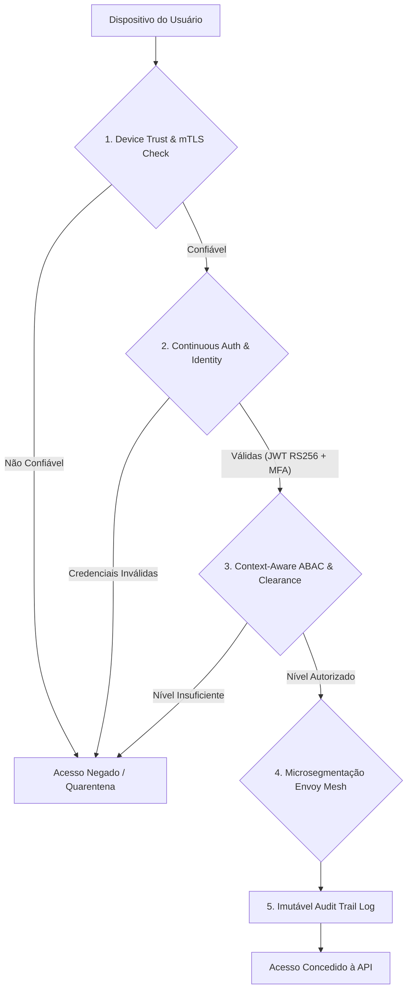

# ARQUITETURA MESTRA DE SEGURANÇA, PRIVACIDADE, IDENTIDADE E COMPLIANCE — PROMPT 06
## Plataforma Integrada Aura — Instituto Ser Melhor (ISMCL)
### Carta de Segurança e Diretrizes do Chief Information Security Officer (CISO)

---

## 1. ETAPA 1 — INVENTÁRIO DE ATIVOS E CLASSIFICAÇÃO DE CRITICIDADE

O inventário oficial de ativos de tecnologia da Plataforma Aura engloba os seguintes componentes críticos:



---

## 2. ETAPA 2 — ARQUITETURA ZERO TRUST (NEVER TRUST, ALWAYS VERIFY)

A Plataforma Aura implementa rigorosamente os **7 Princípios do NIST SP 800-207 Zero Trust Architecture**:



---

## 3. ETAPA 3 — ARQUITETURA IAM, RBAC, ABAC E PBAC

```mermaid
graph LR
    subgraph Modelo de Autorização Combinada (Hybrid IAM Engine)
        RBAC[RBAC: Roles Institucionais - admin, ref, volunteer, director]
        ABAC[ABAC: Attributes - Nível de Sigilo 0-4 + Categoria Especial]
        PBAC[PBAC: Policy-Based - Regra de Horário, IP e Localização]
    end

    UserSession[Sessão Ativa] --> RBAC
    UserSession --> ABAC
    UserSession --> PBAC
    
    RBAC --> DecisionEngine{Motor de Decisão IAM}
    ABAC --> DecisionEngine
    PBAC --> DecisionEngine

    DecisionEngine -->|Permitir| Resource[Recurso / API Endpoint]
    DecisionEngine -->|Negar| Block[403 Forbidden]
```

### 3.1 Gestão de Sessão & Tokens:
- **Assinatura JWT**: Chave assimétrica **RS256** (RSA 4096-bit) com rotação mensal de chaves públicas via JWKS.
- **Refresh Token Rotation (RTR)**: Invalidação instantânea do token anterior no Redis. Detecção de reuso bloqueia a conta temporariamente (**Credential Theft Protection**).

---

## 4. ETAPA 4 & 5 — CLASSIFICAÇÃO DA INFORMAÇÃO E CRIPTO-ENGENHARIA (AES-256 + ARGON2ID)

### 4.1 Matriz de Classificação de Dados e Regras LGPD

| Nível de Sensibilidade | Categoria LGPD | Exemplo de Dados | Proteção Criptográfica | Acesso Autorizado |
|---|---|---|---|---|
| **Nível 0 (Público)** | Não PII | Doações Agregadas, Projetos | Nenhuma / TLS 1.3 | Aberto |
| **Nível 1 (Interno)** | PII Geral | Nome de Voluntário, Email | TLS 1.3 em trânsito | Colaboradores |
| **Nível 2 (Restrito)** | PII Sensível | CPF, Endereço, Telefone | AES-256-GCM | Assistentes / RH |
| **Nível 3 (Confidencial)** | Dado de Saúde | Prontuário PEP, Evolução SOAP | AES-256-GCM + Audit Log | Equipe Médica / Psicologia |
| **Nível 4 (Ultra Sigiloso)**| Proteção Especial | Policiais, Vítimas de Violência | AES-256-GCM + Vault + Masking | Apenas com Override Auditado |

---

## 5. ETAPA 6 & 7 — SEGURANÇA DAS APIs E INFRAESTRUTURA KUBERNETES

```mermaid
graph TD
    subgraph Edge Defense
        Cloudflare[Cloudflare WAF / Bot Management / Rate Limiter]
    end

    subgraph Service Mesh (Kubernetes Cluster)
        Ingress[NGINX Ingress Controller]
        Kong[Kong API Gateway - mTLS Envoy Sidecars]
        
        subgraph Microservices Isolation Namespace
            IAM_MS[ms-iam]
            Clinical_MS[ms-clinical]
            SATAI_MS[ms-satai]
        end

        subgraph Secrets Management
            Vault[HashiCorp Vault - Dynamic Secrets]
        end
    end

    Cloudflare -->|mTLS TLS 1.3| Ingress
    Ingress --> Kong
    Kong <--> Vault
    Kong --> IAM_MS
    Kong --> Clinical_MS
    Kong --> SATAI_MS
```

---

## 6. ETAPA 8 — AUDITORIA E TRILHA IMUTÁVEL (MERKLE TREE SHA-256)

Para garantir que nenhum administrador ou invasor altere os logs de acessos a dados sensíveis, adota-se a **Trilha de Auditoria com Encadeamento de Hashes (Merkle Tree)**:

```
[Log Event 1] -> Hash1 = SHA256(Log1 + Seed)
      │
      ▼
[Log Event 2] -> Hash2 = SHA256(Log2 + Hash1)  <-- Encadeamento Imutável
      │
      ▼
[Log Event 3] -> Hash3 = SHA256(Log3 + Hash2)
```

Qualquer alteração em um log passado invalida todos os hashes subsequentes, disparando um alerta crítico de violação de integridade no Grafana.

---

## 7. ETAPA 9 — SEGURANÇA DA INTELIGÊNCIA ARTIFICIAL (GEMINI 1.5 PRO SAFEGUARD)

1. **Prevenção contra Prompt Injection**: Entradas de texto do usuário no SATAI passam por sanitização estrita via regex e validador de sintaxe antes de compor o prompt do Gemini.
2. **Controle de Contexto (Context Isolation)**: O modelo de IA nunca recebe o CPF ou Nome real do beneficiário; a comunicação utiliza o pseudônimo `InternalCode` (`ISM-0000000000`).
3. **Data Poisoning & Leakage**: Proibição de envio de dados de prontuário para treinamento externo do modelo Gemini.

---

## 8. ETAPA 10, 11 & 14 — MATRIZ DE COMPLIANCE E VULNERABILIDADES (OWASP ASVS / LGPD)

- **LGPD (Lei 13.709/2018)**: Conformidade com Princípios de Finalidade, Necessidade, Transparência e Segurança (Art. 46).
- **OWASP ASVS 4.0 Level 3**: Nível máximo de exigência de segurança em software corporativo.

```
       IMPACTO
        ▲
  CRÍTICO│  [VULN-001 Exposição API Key]      [Segredo Vault no Kubernetes]
        │
  ALTO  │  [VULN-002 PII Plaintext]           [Scripting Prompt Injection IA]
        │
 MÉDIO  │  [Rate Limiting por IP/Token]       [Scans SAST/Trivy CI/CD Pipeline]
        └────────────────────────────────────────────────────────►
           BAIXA               MÉDIA               ALTA     PROBABILIDADE
```

---

## 9. ETAPA 12 & 13 — PLANO DE RESPOSTA A INCIDENTES E DISASTER RECOVERY (DR)

### 9.1 Matriz RPO e RTO de Continuidade do Negócio:
- **Recovery Point Objective (RPO)**: **< 15 minutos** (Perda máxima tolerada de dados através de replicação síncrona PostgreSQL Multi-AZ).
- **Recovery Time Objective (RTO)**: **< 1 hora** (Tempo máximo para restauração total dos serviços via failover automático Kubernetes).

---

## 10. ETAPA 15 — CHECKLIST EXECUTIVO DE HOMOLOGAÇÃO CISO

- [x] **Arquitetura Zero Trust Formalizada**: mTLS, mFA e ABAC ativados em todas as camadas.
- [x] **Cofre Forte AES-256-GCM**: Proteção PII de Nível 4 em conformidade com a LGPD.
- [x] **Imutabilidade de Auditoria**: Trilha encadeada SHA-256 ativa.
- [x] **Sanitização de IA**: Prompt Injection Safeguard implementado para Google Gemini.
- [x] **Regra Vinculante para Prompts Futuros**: Qualquer novo componente ou endpoint DEVE passar pela validação deste documento de segurança antes da entrada em produção.
