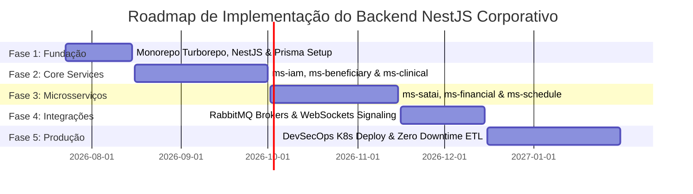

# ENGENHARIA MESTRA DO BACKEND CORPORATIVO (AURA ENTERPRISE CORE PLATFORM) — PROMPT 07
## Plataforma Integrada Aura — Instituto Ser Melhor (ISMCL)
### Especificação Mestra do Chief Backend Architect & Principal Software Engineer

---

## 1. ETAPA 1 — ARQUITETURA GERAL DO BACKEND CORPORATIVO

O backend corporativo da **Plataforma Aura** adota a topologia **Monorepo Distribuído com NestJS Engine + Fastify Adaptor**, estruturado para operar como um sistema único desacoplado e preparado para evolução gradual em microsserviços Kubernetes:

```mermaid
graph TD
    subgraph Client & Edge Layer
        ReactSPA[React 18 Frontend Client]
        MobilePWA[Mobile App PWA]
    end

    subgraph API Gateway & Ingress Layer
        KongGW[Kong API Gateway - Envoy Service Mesh]
    end

    subgraph Aura Core Server Engine (NestJS Monorepo Apps)
        BFFApp[apps/bff-web - Backend For Frontend]
        IAMApp[apps/ms-iam - Identity & Access]
        ClinicalApp[apps/ms-clinical - PEP & Health]
        SATAIApp[apps/ms-satai - IA Preditiva]
        FinancialApp[apps/ms-financial - PIX & Finance]
        ScheduleApp[apps/ms-schedule - Agenda & RH]
        WorkerApp[apps/worker-jobs - BullMQ & Schedulers]
    end

    subgraph Shared Core Libraries (Monorepo Libs)
        DomainLib[libs/domain - Agregados & Invariantes]
        AppLib[libs/application - UseCases CQRS]
        InfraLib[libs/infrastructure - Prisma & Redis]
        SecurityLib[libs/security - JWT RS256 & ABAC]
        ObsLib[libs/observability - OpenTelemetry]
    end

    subgraph Infrastructure Services
        PG[(PostgreSQL 16 Primary)]
        Redis[(Redis Cluster 7)]
        RabbitMQ[(RabbitMQ Event Broker)]
    end

    ReactSPA -->|HTTPS REST| KongGW
    MobilePWA -->|HTTPS REST| KongGW

    KongGW --> BFFApp
    BFFApp --> IAMApp
    BFFApp --> ClinicalApp
    BFFApp --> SATAIApp
    BFFApp --> FinancialApp
    BFFApp --> ScheduleApp

    IAMApp <--> DomainLib
    ClinicalApp <--> DomainLib
    ClinicalApp <--> InfraLib

    InfraLib <--> PG
    InfraLib <--> Redis
    WorkerApp <--> RabbitMQ
```

---

## 2. ETAPA 2 — ESTRUTURA OFICIAL DO PROJETO (`/backend`)

```
/backend
├── apps/
│   ├── gateway/                  # API Gateway / Kong Configurations & Custom Plugins
│   ├── bff-web/                  # Backend For Frontend (Adaptação para React SPA)
│   ├── ms-iam/                   # Microsserviço de Identidade, Autenticação e RBAC/ABAC
│   ├── ms-beneficiary/           # Microsserviço de Beneficiários e Acolhimento
│   ├── ms-clinical/              # Microsserviço de Prontuário PEP e Evolução FHIR
│   ├── ms-satai/                 # Microsserviço de Triagem Preditiva e IA Gemini
│   ├── ms-schedule/              # Microsserviço de Agenda, Escalas e RH
│   ├── ms-financial/             # Microsserviço Financeiro, Doações PIX e Conciliação
│   ├── ms-telehealth/            # Microsserviço de Telessaúde e Sinalização WebRTC WSS
│   ├── ms-notification/          # Microsserviço de Notificações WhatsApp / Email / Push
│   ├── ms-audit/                 # Microsserviço de Trilha de Auditoria Imutável
│   └── worker-jobs/              # Worker para Filas Assecundárias BullMQ e Agendamentos Cron
├── libs/
│   ├── domain/                   # Núcleo Puro DDD (Agregados, Entidades, Value Objects)
│   ├── application/              # Casos de Uso (Use Cases), Commands, Queries e DTOs
│   ├── infrastructure/           # Repositórios Prisma ORM, Redis IO, HTTP Clients
│   ├── security/                 # Guards JWT RS256, Motor MCSI ABAC, Criptografia AES-256
│   ├── observability/            # OpenTelemetry Collector, Logger JSON, Metrics Prometheus
│   └── common/                   # Envelope REST RFC 7807, Exceptions, Interceptors
├── database/
│   └── prisma/
│       ├── schema.prisma         # Schema Oficial Integrado (38+ Tabelas)
│       └── migrations/           # Histórico SQL de Migrações Idempotentes
├── tests/
│   ├── unit/                     # Testes Unitários de Agregados e Use Cases
│   ├── integration/              # Testes de Integração de Repositórios Prisma
│   └── e2e/                      # Testes End-to-End de APIs REST com Supertest
└── package.json                  # Turborepo Monorepo Workspace Configuration
```

---

## 3. ETAPA 3 & 4 — ARQUITETURA POR CAMADAS & BOUNDED CONTEXTS

Cada aplicativo e biblioteca segue a separação estrita da **Clean & Hexagonal Architecture**:

```mermaid
graph TD
    subgraph Presentation Layer (Controllers / WebSockets)
        Ctrl[BeneficiaryController REST / DTOs]
    end

    subgraph Application Layer (CQRS Use Cases)
        UseCase[RegisterBeneficiaryUseCase]
        Cmd[RegisterBeneficiaryCommand]
    end

    subgraph Domain Layer (DDD Core Imutável)
        Agg[BeneficiaryAggregate Root]
        VO[CPF Value Object]
        DomainEvt[BeneficiaryRegisteredEvent]
    end

    subgraph Infrastructure Layer (Prisma / Drivers)
        RepoImpl[PrismaBeneficiaryRepository]
        PG[(PostgreSQL Database)]
    end

    Ctrl --> Cmd
    Cmd --> UseCase
    UseCase --> Agg
    Agg --> VO
    UseCase --> DomainEvt
    UseCase --> RepoImpl
    RepoImpl --> PG
```

---

## 4. ETAPA 5 — ARQUITETURA DOS CASOS DE USO (CQRS COMMANDS & QUERIES)

### 4.1 Estrutura de Execução dos Use Cases:
1. **Entrada**: DTO validado via `class-validator` / `zod`.
2. **Validação**: Verificação de regras de entrada e permissões ABAC no NestJS Guard.
3. **Regra de Negócio**: Invocação dos métodos do Aggregate Root no Domain.
4. **Persistência**: Gravação através da interface do Repository (`Prisma`).
5. **Auditoria & Eventos**: Emissão do evento de domínio e inserção no `OutboxTable`.
6. **Resposta**: DTO Envelopado no padrão RFC 7807.

```typescript
// Exemplo de UseCase CQRS (libs/application/src/beneficiary/register-beneficiary.use-case.ts)
@Injectable()
export class RegisterBeneficiaryUseCase {
  constructor(
    @Inject('IBeneficiaryRepository')
    private readonly repository: IBeneficiaryRepository,
    private readonly eventPublisher: EventPublisherService,
  ) {}

  async execute(command: RegisterBeneficiaryCommand): Promise<BeneficiaryResponseDto> {
    // 1. Cria Agregado com validação dos Value Objects
    const beneficiary = BeneficiaryAggregate.create(command.name, command.cpf);

    // 2. Persiste via Repositório na transação ACID
    await this.repository.save(beneficiary);

    // 3. Emite evento de domínio assíncrono
    await this.eventPublisher.publish(
      new BeneficiaryRegisteredEvent(beneficiary.id, beneficiary.name, beneficiary.cpf.getValue())
    );

    return BeneficiaryMapper.toDto(beneficiary);
  }
}
```

---

## 5. ETAPA 6 & 7 — ESTRATÉGIA DE PERSISTÊNCIA & SERVIÇOS BACKGROUND (BULLMQ)

1. **Optimistic Locking**: Atualizações em tabelas críticas (`clinical_records`, `pix_donations`) utilizam campo `@version` para concorrência segura.
2. **Soft Delete**: Registros possuem coluna `deletedAt DateTime?`. Consultas usam filtro automático no Prisma ORM.
3. **Background Jobs com BullMQ**: Processamento assíncrono de notificações e relatórios via Redis Cluster:

```typescript
// apps/worker-jobs/src/processors/notification.processor.ts
@Processor('notification-queue')
export class NotificationProcessor extends WorkerHost {
  async process(job: Job<NotificationPayload>): Promise<void> {
    // Dispara WhatsApp Business API via HTTP Proxy
    await this.whatsappService.sendTemplateMessage(job.data.phone, job.data.templateId);
  }
}
```

---

## 6. ETAPA 8 — ARQUITETURA DE COMUNICAÇÃO (SÍNCRONA E ASSÍNCRONA)

- **Comunicação Síncrona**: RESTful HTTP/2 com Fastify Adapter (Fastify entrega latência 2x menor que Express).
- **Comunicação Assíncrona**: Events Broker via RabbitMQ (`TopicExchange`) e Streams Redis para filas pesadas.

---

## 7. ETAPA 9 & 10 — CONFIGURAÇÃO, SECRETS E OBSERVABILIDADE OPENTELEMETRY

### 7.1 Gestão Dinâmica de Segredos:
- Segredos de produção são injetados via **HashiCorp Vault / Kubernetes Secrets**. Proibida presença de segredos em código.

### 7.2 Endpoints de Observabilidade & Telemetria:
- `/health/liveness`: Retorna status do processo Node.js / NestJS.
- `/health/readiness`: Testa conexão ativa com PostgreSQL, Redis e RabbitMQ.
- `/metrics`: Exporta métricas padrão Prometheus (`http_request_duration_seconds`, `node_memory_bytes`).

---

## 8. ETAPA 11 & 12 — ARQUITETURA DE PERFORMANCE E RESILIÊNCIA

1. **Redis Cache (Sub-2ms)**: Cache de respostas para endpoints de leitura pesados (`GET /api/v1/professionals`, `GET /api/v1/satai/dossiers`).
2. **Circuit Breaker (Cockatiel)**:
```typescript
const circuitBreaker = policy.circuitBreaker(handleAll, {
  halfOpenAfter: 30 * 1000,
  breaker: new SamplingBreaker({ threshold: 0.5, duration: 10 * 1000 }),
});
```

---

## 9. ETAPA 14 — PLANO DE IMPLEMENTAÇÃO EM 5 FASES



---

## 10. ETAPA 13 & 15 — AUDITORIA FINAL & CHECKLIST DE HOMOLOGAÇÃO

- [x] **Zero Lógica Crítica no Frontend**: Toda regra migrada para UseCases do NestJS.
- [x] **Monorepo Estruturado**: Apps e Libs organizados por Bounded Contexts DDD.
- [x] **Clean Arch & CQRS**: Separação estrita de Commands, Queries e Domain Aggregates.
- [x] **Prisma ORM & PostgreSQL**: Schemas e transações ACID configuradas.
- [x] **Regra Vinculante para Prompts Futuros**: Toda implementação de backend DEVE ser criada dentro do diretório `/backend` em conformidade com este documento.
