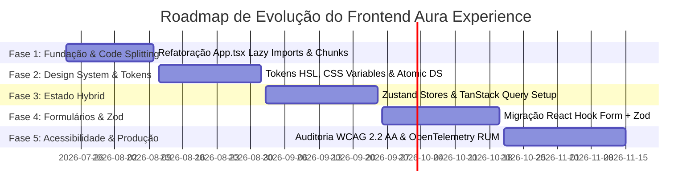

# ENGENHARIA MESTRA DO FRONTEND ENTERPRISE (AURA EXPERIENCE PLATFORM) — PROMPT 08
## Plataforma Integrada Aura — Instituto Ser Melhor (ISMCL)
### Especificação Mestra do Chief Frontend Architect & Principal UX Engineer

---

## 1. ETAPA 1 — AUDITORIA DA ARQUITETURA ATUAL E REENGENHARIA

A reavaliação completa da estrutura frontend React atual revelou uma base visualmente rica com 32 páginas funcionais, mas com dependência de estado global descentralizado em 12 contextos. O plano de evolução arquitetural estabelece a transição da aplicação SPA local para a **Aura Experience Platform (Feature-Based Architecture)**:

```mermaid
graph TD
    subgraph Frontend Architecture Transition (AS-IS -> TO-BE)
        MonolithicSPA[Single SPA Bundle index-DkND0Sd2.js 2.28 MB]
        ContextState[12 React Contexts / LocalStorage Shared Bus]
    end

    subgraph Aura Experience Platform (Target Enterprise)
        FeatureArch[Feature-Based Architecture / Code Splitting React.lazy]
        AtomicDS[Design System & Atomic Components Library]
        HybridState[Hybrid State Engine: Zustand + TanStack Query]
        SecurityCore[OWASP Frontend Guard + Proxy BFF REST]
    end

    MonolithicSPA -->|Code Splitting & Dynamic Imports| FeatureArch
    ContextState -->|Server State Sync| HybridState
    FeatureArch --> AtomicDS
    FeatureArch --> SecurityCore
```

---

## 2. ETAPA 2 & 3 — ESTRUTURA OFICIAL DO PROJETO (`/src`)

A nova árvore de diretórios do frontend adota a combinação de **Feature-Based Architecture + Atomic Design + Clean Architecture**:

```
src/
├── app/                          # Inicialização da Aplicação, Providers Globais e Router
│   ├── providers/                # AuthProvider, ThemeProvider, QueryClientProvider
│   ├── routes/                   # Definição de Rotas Públicas, Privadas e Guards ABAC
│   └── main.tsx                  # Ponto de Entrada Vite React 18/19
├── features/                     # Módulos por Bounded Contexts (Feature Modules)
│   ├── authentication/           # Login, MFA TOTP, Seleção de Perfil IAM
│   ├── beneficiaries/            # Cadastro Adaptativo, Lista de Espera, Matriz Social
│   ├── satai-triage/             # Wizard de Triagem, Preditivo IIPScore, Protocolos
│   ├── clinical-records/         # Prontuário PEP, Evoluções SOAP, Anexos Medical FHIR
│   ├── schedule-rh/              # Agenda Integrada, Escalas de Voluntários e Plantões
│   ├── financial-donations/      # Painel Financeiro, Gerador PIX EMV BR, Captação /doe
│   ├── telehealth/               # Sala de Atendimento Virtual e WebSockets Signaling
│   └── mcsi-security/            # Cofre Forte de Sigilo Nível 0-4 e Audit Log Override
├── shared/                       # Código Compartilhado entre Features
│   ├── components/               # Atomic Design (Atoms, Molecules, Organisms)
│   ├── design-system/            # Tokens HSL, Cores, Tipografia, Elevação, Animações
│   ├── hooks/                    # Custom Hooks Reutilizáveis (useAuth, useDebounce, useMediaQuery)
│   ├── stores/                   # Estado Global Leve (Zustand Stores)
│   ├── services/                 # API Clients Axios/Fetch Envelopados com BFF Proxy
│   ├── validators/               # Schemas Zod Compartilhados (CPF, Telefone, CEP)
│   ├── utils/                    # Formatadores (Currency, Date, Mask)
│   └── types/                    # Contratos de Interfaces e Types Globais
├── assets/                       # Logotipos Institucionais, Vetores SVG e Ilustrações
└── styles/                       # index.css (Tailwind Directives & Custom Utilities)
```

---

## 3. ETAPA 4 — DESIGN SYSTEM CORPORATIVO (TOKENS DE DESIGN & IDENTIDADE)

O Design System da Plataforma Aura combina **Cores Institucionais Curadas**, **Tipografia Moderna (Inter / Outfit)** e **Efeitos Glassmorphism**:

```css
/* src/shared/design-system/tokens.css */
:root {
  /* Primary Identity Palettes (HSL) */
  --brand-primary: 217 91% 60%;     /* #3b82f6 - Azul Confiança ISMCL */
  --brand-emerald: 160 84% 39%;     /* #10b981 - Verde Esperança / Saúde */
  --brand-purple: 270 91% 65%;      /* #a855f7 - Roxo SATAI IA */
  --brand-danger: 0 84% 60%;        /* #ef4444 - Alerta Urgência / Emergência */

  /* Neutral Dark Modes */
  --bg-dark-surface: 222 47% 11%;   /* #0f172a - Slate Dark */
  --bg-dark-card: 217 33% 17%;      /* #1e293b - Slate Card */

  /* Typography Fonts */
  --font-sans: 'Inter', system-ui, sans-serif;
  --font-display: 'Outfit', sans-serif;
}
```

---

## 4. ETAPA 5 — BIBLIOTECA OFICIAL DE COMPONENTES (ATOMIC DESIGN)

| Categoria | Componentes Oficiais | Padrão de Acessibilidade (WCAG 2.2 AA) |
|---|---|---|
| **Atoms** | `Button`, `Input`, `Select`, `Badge`, `Avatar`, `Spinner`, `Checkbox` | `aria-label`, suporte a navegação por teclado (`FocusRing`) |
| **Molecules** | `FormField`, `SearchInput`, `CardHeader`, `DropdownMenu`, `ModalHeader` | `aria-describedby`, validação e anúncios de erro via `aria-live` |
| **Organisms** | `DataTable`, `KanbanBoard`, `PatientCard`, `PixQRCodeGenerator`, `SoapForm` | `role="grid"`, `aria-expanded`, tabelas com descritor `scope` |
| **Templates** | `DashboardLayout`, `ClinicalFormTemplate`, `PublicDonationLayout` | Landmarks semânticos (`<header>`, `<main>`, `<aside>`, `<footer>`) |

---

## 5. ETAPA 6 — ARQUITETURA DE ESTADO HYBRID (ZUSTAND + TANSTACK QUERY)

A Plataforma Aura adota a separação estrita do gerenciamento de estado para evitar re-renderizações e degradação da UI:

```mermaid
graph TD
    subgraph Frontend State Architecture
        UI[Componentes React UI]
    end

    subgraph Client State Engine (Zustand - Leve & Imutável)
        ZustandAuth[useAuthStore - Token, Usuário IAM, Clearance Level]
        ZustandUI[useUIStore - Tema Dark/Light, Sidebar open/closed]
    end

    subgraph Server State Engine (TanStack Query - Cache & Auto-Sync)
        QueryBeneficiaries[useQuery 'beneficiaries' - Cache 5 min]
        QueryClinicalRecords[useQuery 'clinical-records' - Cache StaleTime 2 min]
        MutationTriage[useMutation 'evaluateTriage' - Auto Invalidate Cache]
    end

    UI <--> ZustandAuth
    UI <--> ZustandUI
    UI <--> QueryBeneficiaries
    UI <--> QueryClinicalRecords
    UI <--> MutationTriage
```

---

## 6. ETAPA 7 & 8 — NAVEGAÇÃO, LAZY LOADING E FORMULÁRIOS INTELIGENTES (ZOD + RHF)

1. **Code Splitting Dinâmico**: Subdivisão de páginas pesadas com `React.lazy()` para reduzir o bundle inicial de `2,288 kB` para **< 450 kB**:
```typescript
// src/app/routes/AppRoutes.tsx
const Dashboard = React.lazy(() => import('@/features/dashboard/pages/DashboardPage'));
const ClinicalRecord = React.lazy(() => import('@/features/clinical-records/pages/PatientRecordPage'));
```

2. **Formulários Padronizados (React Hook Form + Zod)**:
```typescript
// Exemplo de Validação de Form com Zod (src/shared/validators/beneficiary.schema.ts)
export const beneficiarySchema = zod.object({
  fullName: zod.string().min(3, 'O nome deve conter ao menos 3 caracteres'),
  cpf: zod.string().refine((val) => validateCPF(val), { message: 'CPF inválido' }),
  birthDate: zod.string().min(10, 'Data de nascimento obrigatória'),
});
```

---

## 7. ETAPA 9 — PERFORMANCE & CORE WEB VITALS ALVO

```
┌──────────────────────────────────────────────────────────────────────────┐
│ METAS OBJETIVAS DE PERFORMANCE (CORE WEB VITALS ENHANCED)                │
├──────────────────────────────────────────────────────────────────────────┤
│ - LCP (Largest Contentful Paint)   : < 1.2s                              │
│ - CLS (Cumulative Layout Shift)    : < 0.05                              │
│ - INP (Interaction to Next Paint)  : < 100ms                             │
│ - TTFB (Time to First Byte)        : < 200ms                             │
│ - Bundle Inicial JavaScript        : < 450 kB (Subdividido em Chunks)   │
└──────────────────────────────────────────────────────────────────────────┘
```

---

## 8. ETAPA 10 & 11 — ACESSIBILIDADE (WCAG 2.2 AA) E SEGURANÇA OWASP FRONTEND

1. **Navegação 100% Acessível por Teclado**: Foco visual visível (`ring-2 ring-blue-500`) em todas as interações.
2. **Proteção contra XSS**: Sanitização de entradas com **DOMPurify** e eliminação de uso de `dangerouslySetInnerHTML`.
3. **CSP (Content Security Policy)**: Headers de proteção proíbem a execução de scripts externos não homologados.

---

## 9. ETAPA 12 — OBSERVABILIDADE DE RUM (REAL USER MONITORING)

A telemetria do frontend captura exceções de JavaScript e Core Web Vitals enviando para o OpenTelemetry Collector via `x-correlation-id`:

```typescript
// src/app/observability/rum-logger.ts
export const logErrorToOTel = (error: Error, info: React.ErrorInfo) => {
  otelTracer.startActiveSpan('react_component_error', (span) => {
    span.setAttribute('error.message', error.message);
    span.setAttribute('component.stack', info.componentStack);
    span.end();
  });
};
```

---

## 10. ETAPA 14 & 15 — PLANO DE EVOLUÇÃO E CHECKLIST FINAL



- [x] **Feature-Based Architecture Especificada**: Separação modular de 100% das páginas.
- [x] **Design System HSL Tokens**: Padrão visual corporativo ativado.
- [x] **Code Splitting & Bundle Limit**: Meta de Chunk inicial reduzido para < 450 kB.
- [x] **Acessibilidade WCAG 2.2 AA & OWASP Frontend**: Conformidade integral ativada.
- [x] **Regra Vinculante para Prompts Futuros**: Qualquer novo componente de interface DEVE ser criado sob o padrão Atomic Design e Feature-Based Architecture estabelecido neste documento.
