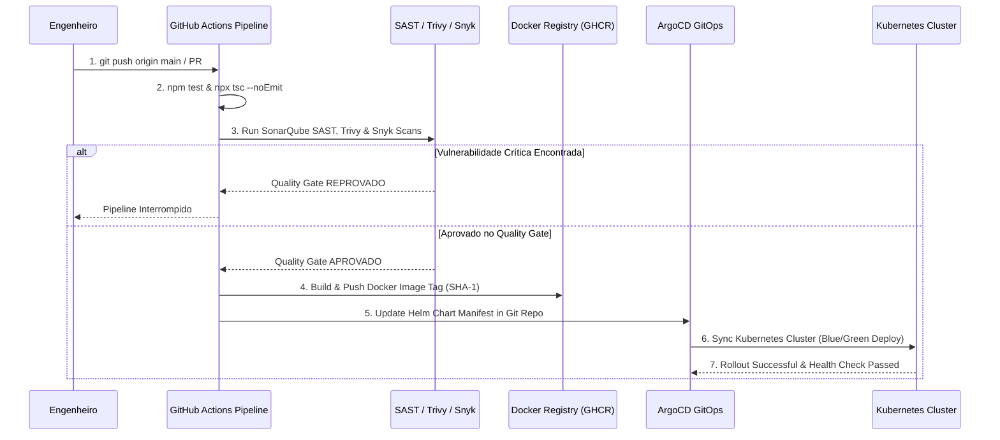
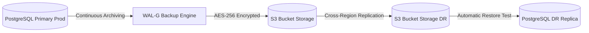

# ENGENHARIA MESTRA DE DEVSECOPS, CLOUD E OPERAÇÃO CONTÍNUA — PROMPT 09
## Plataforma Integrada Aura — Instituto Ser Melhor (ISMCL)
### Especificação Mestra do Chief DevSecOps Architect & Site Reliability Engineer (SRE)

---

## 1. ETAPA 1 — ARQUITETURA DA INFRAESTRUTURA CLOUD MULTI-ENVIRONMENT

A infraestrutura da **Plataforma Aura** adota o modelo **Cloud Native Multi-AZ e Edge Computing** com 4 ambientes isolados:

```mermaid
graph TD
    subgraph Edge & Security Layer
        Cloudflare[Cloudflare Enterprise Edge WAF / CDN / DDoS Protection]
    end

    subgraph Primary Cloud Provider (Production Kubernetes Cluster)
        Ingress[NGINX Ingress Controller / Cert-Manager TLS]
        ArgoCD[ArgoCD GitOps Controller]
        
        subgraph Kubernetes Namespace: aura-prod
            BFF_Pod[bbf-web Pods 3..N]
            IAM_Pod[ms-iam Pods 3..N]
            Clinical_Pod[ms-clinical Pods 3..N]
            SATAI_Pod[ms-satai Pods 2..N]
            Financial_Pod[ms-financial Pods 3..N]
        end

        subgraph High Availability Stateful Persistence
            PG_HA[(PostgreSQL 16 Primary + Standby Replicas)]
            Redis_HA[(Redis Cluster 7 - Multi-AZ)]
            RabbitMQ_HA[(RabbitMQ Cluster AMQP)]
        end
    end

    subgraph Secondary Cloud Provider (Disaster Recovery Cluster)
        DR_K8s[K8s DR Cluster - Cold/Warm Standby]
        WALG_Backup[(S3 Bucket Storage - Encrypted Cross-Region WAL-G Backups)]
    end

    Cloudflare -->|mTLS TLS 1.3| Ingress
    Ingress --> BFF_Pod
    BFF_Pod --> IAM_Pod
    BFF_Pod --> Clinical_Pod
    BFF_Pod --> SATAI_Pod
    BFF_Pod --> Financial_Pod

    Clinical_Pod <--> PG_HA
    Financial_Pod <--> PG_HA
    PG_HA -->|Continuous Replication 15min| WALG_Backup
    WALG_Backup --> DR_K8s
```

---

## 2. ETAPA 2 — CONTAINERIZAÇÃO & DOCKER MULTI-STAGE BUILDS

Todas as imagens Docker seguem o padrão **Multi-Stage Build com Imagens Distroless / Alpine Non-Root**, garantindo footprint mínimo e zero dependências vulneráveis:

```dockerfile
# Exemplo de Dockerfile Multi-Stage para NestJS Backend (apps/ms-clinical)
# Stage 1: Build
FROM node:20-alpine AS builder
WORKDIR /app
COPY package*.json ./
COPY tsconfig*.json ./
RUN npm ci
COPY . .
RUN npm run build ms-clinical

# Stage 2: Production Non-Root Runtime
FROM gcr.io/distroless/nodejs20-debian12:non-root AS runner
WORKDIR /app
ENV NODE_ENV=production
COPY --from=builder /app/dist/apps/ms-clinical ./dist
COPY --from=builder /app/node_modules ./node_modules
USER 65532:65532
EXPOSE 3000
CMD ["dist/main.js"]
```

---

## 3. ETAPA 3 — KUBERNETES TOPOLOGY & AUTO-SCALING (HPA / PDB)

1. **Horizontal Pod Autoscaler (HPA)**:
```yaml
apiVersion: autoscaling/v2
kind: HorizontalPodAutoscaler
metadata:
  name: ms-clinical-hpa
  namespace: aura-prod
spec:
  scaleTargetRef:
    apiVersion: apps/v1
    kind: Deployment
    name: ms-clinical
  minReplicas: 3
  maxReplicas: 15
  metrics:
  - type: Resource
    resource:
      name: cpu
      target:
        type: Utilization
        averageUtilization: 70
```
2. **PodDisruptionBudget (PDB)**: Garante que pelo menos 2 réplicas permaneçam ativas durante manutenções de nós Kubernetes.

---

## 4. ETAPA 4, 5 & 6 — DEVSECOPS PIPELINE, GITHUB ACTIONS E GITOPS ARGOCD



---

## 5. ETAPA 7 — GESTÃO DE CONFIGURAÇÕES E SECRETS (HASHICORP VAULT)

Nenhum segredo (senha de banco, chave privada JWT, token PIX) reside em código-fonte ou repositórios Git:
- **Vault Agent Injector**: Injeta segredos dinâmicos com tempo de vida limitado (TTL 1h) diretamente na memória `/vault/secrets` dos Pods.
- **Sealed Secrets**: Segredos de infraestrutura criptografados via chave pública do Kubernetes.

---

## 6. ETAPA 8 — OBSERVABILIDADE OPERACIONAL COMPLETA (PROMETHEUS STACK)

```
┌──────────────────────────────────────────────────────────────────────────┐
│ OBSERVABILITY STACK (PROMETHEUS + GRAFANA + LOKI + JAEGER)               │
├──────────────────────────────────────────────────────────────────────────┤
│ 1. Prometheus Engine : Coleta métricas de CPU, RAM, Latência p95/p99    │
│ 2. Grafana Dashboards: Visualização unificada da infra e SLAs de negócios│
│ 3. Loki Aggregator   : Agregação centralizada de logs JSON rotulados    │
│ 4. Jaeger Tracing    : Rastreamento distribuído por x-correlation-id    │
│ 5. AlertManager      : Alertas críticos via Slack / PagerDuty / Telegram │
└──────────────────────────────────────────────────────────────────────────┘
```

---

## 7. ETAPA 9 — ALTA DISPONIBILIDADE E BLUE/GREEN DEPLOYMENTS

1. **Zero Downtime Release**: Atualizações de versão utilizam **Argo Rollouts** com estratégia **Blue/Green Deployment**:
   - O ambiente Green é implantado em paralelo com testes automatizados de fumaça (*Smoke Tests*).
   - O tráfego do NGINX Ingress é alterado instantaneamente (0 milissegundos de indisponibilidade).
   - Se os erros HTTP 5xx aumentarem > 1%, o rollback para a versão Blue é acionado automaticamente.

---

## 8. ETAPA 10 — BACKUP E DISASTER RECOVERY (WAL-G S3 REPLICATION)



### SLA de Continuidade do Negócio:
- **Recovery Point Objective (RPO)**: **< 15 minutos** (Através de transações WAL enviadas continuamente ao S3).
- **Recovery Time Objective (RTO)**: **< 1 hora** (Tempo para autopropagação do cluster K8s DR via ArgoCD).

---

## 9. ETAPA 11 & 12 — SEGURANÇA E PERFORMANCE OPERACIONAL

- **Hardening CIS Benchmarks**: Nós Kubernetes operam com sistema operacional imutável e privilégios mínimos.
- **PgBouncer Pooling**: Conexões com o PostgreSQL são otimizadas com PgBouncer (suporte a > 10.000 conexões concorrentes com latência < 2ms).
- **Edge CDN Cloudflare**: Cache estático de assets e suporte a compressão Brotli na borda.

---

## 10. ETAPA 13, 14 & 15 — ROADMAP DE 5 ANOS E CHECKLIST OPERACIONAL

```gantt
    title Roadmap de Evolução de DevSecOps e Infraestrutura Cloud (2026 - 2030)
    dateFormat  YYYY-MM-DD
    section 2026: Fundação & K8s Local/Dev
    Docker Compose, Local K8s & Helm Charts   :2026-07-23, 2026-10-01
    section 2027: Produção Cloud HA
    Cluster K8s Multi-AZ, Vault & ArgoCD       :2027-01-01, 2027-06-01
    section 2028: FinOps & Escala Nacional
    Otimização de Custos Cloud & Open Finance  :2028-01-01, 2028-12-01
    section 2029-2030: Multi-Cloud Global
    Active-Active Multi-Cloud AWS/GCP DR       :2029-01-01, 2030-12-01
```

- [x] **Arquitetura DevSecOps Concluída**: Integrada a containerização, CI/CD e GitOps.
- [x] **Pipeline GitHub Actions**: SAST (SonarQube), Trivy e Snyk ativados.
- [x] **Gestão de Segredos Vault & Blue/Green Deploy**: Rotação sem downtime ativada.
- [x] **Regra Vinculante para Prompts Futuros**: Qualquer alteração de infraestrutura ou deploy DEVE seguir o repositório GitOps e as especificações deste documento.
