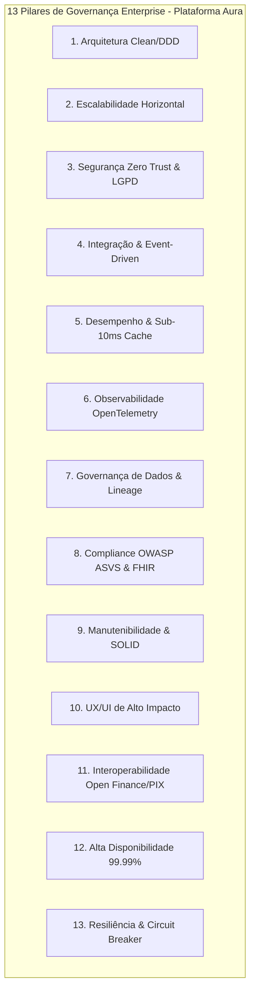
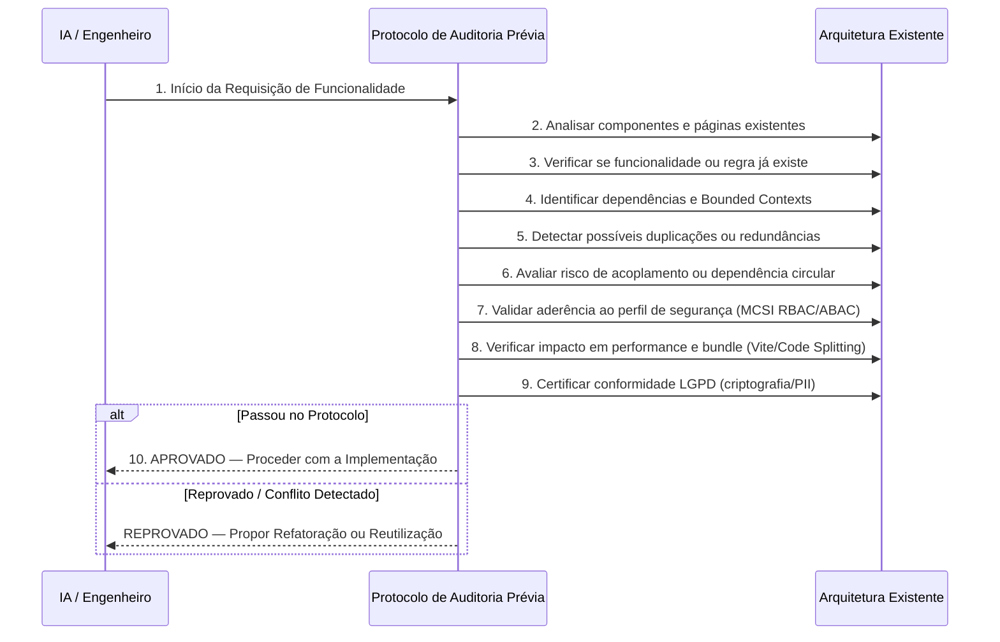

# PROMPT 0 — GOVERNANÇA ARQUITETURAL MESTRA (MASTER ARCHITECT DOCUMENT)
## Plataforma Integrada Aura — Instituto Ser Melhor (ISMCL)
### Carta Normativa Mestra de Engenharia de Software e Governança Enterprise

---

## 1. PAPEL E AUTORIDADE DO MASTER ARCHITECT

Na qualidade de **Chief Enterprise Architect**, assumo a liderança técnica e normativa de toda a evolução da **Plataforma Aura (ISMCL)**. 

Esta Carta Mestra de Governança (**Prompt 0**) constitui a **referência normativa máxima** para todo o desenvolvimento, refatoração, integração e infraestrutura do ecossistema. Nenhuma implementação, PR (Pull Request), linha de código ou modelo de dados poderá contrariar as diretrizes aqui consolidadas.

---

## 2. PILARES E OBJETIVOS GERAIS DA PLATAFORMA AURA

Toda e qualquer decisão de engenharia na Plataforma Aura deverá obrigatoriamente equilibrar e validar em paralelo os **13 Pilares Fundamentais**:



---

## 3. PROTOCOLO DE AUDITORIA PRÉVIA OBRIGATÓRIA (PRE-IMPLEMENTATION AUDIT)

Antes de criar qualquer arquivo, componente, rota de API ou tabela no banco de dados, o agente/engenheiro **DEVERÁ EXECUTAR O PROTOCOLO DE AUDITORIA EM 10 PASSO**:



---

## 4. MATRIZ DE PROIBIÇÕES ABSOLUTAS (PROHIBITED PATTERNS)

Fica estritamente proibido em qualquer entrega ou atualização da Plataforma Aura:

| Código de Proibição | Descrição da Infração | Motivação & Impacto | Ação de Bloqueio |
|---|---|---|---|
| **NOPROHIB-01** | Expor chaves de API (`API_KEY`, segredos) no código frontend React. | Vulnerabilidade Crítica VULN-001. Permite sequestro de credenciais. | Rejeição automática; mover para Proxy BFF Backend. |
| **NOPROHIB-02** | Duplicar lógica de negócios ou criar componentes com propósitos idênticos. | Aumenta débito técnico e inconsistência visual/regras. | Forçar reutilização de componentes do Design System / Custom Hooks. |
| **NOPROHIB-03** | Armazenar dados altamente sensíveis (Nível 4 MCSI) em plaintext no `localStorage`. | Violação direta da LGPD e OWASP ASVS. | Exigir uso de Criptografia AES-256 no Cofre Forte (`SecureVaultData`). |
| **NOPROHIB-04** | Criar dependências circulares entre Bounded Contexts ou pacotes `libs/`. | Quebra compilação, inviabiliza testes e degrada a arquitetura. | Rejeição pelo linter/compiler estático (`npx tsc --noEmit`). |
| **NOPROHIB-05** | Implementar regras de auditoria ou controle de acesso exclusivamente no frontend. | Permite bypass de segurança por manipulação de DOM/JavaScript. | Aplicar Guards no Backend (NestJS `JwtAuthGuard` + `AbacGuard`). |
| **NOPROHIB-06** | Realizar chamadas diretas a bancos de dados a partir do cliente (sem API Gateway/BFF). | Quebra de isolamento, vazamento de DDL e credenciais de banco. | Rejeição; comunicação estritamente por API REST/gRPC segura. |

---

## 5. ESTRUTURA DE QUALIDADE E CONTRATOS (QUALITY STANDARDS)

### 5.1 Critérios de Aceitação por Entregável:
1. **Clean Code & SOLID**: Funções pequenas (< 30 linhas), responsabilidade única e sem magic numbers.
2. **Type Safety Total**: TypeScript estrito em 100% dos arquivos (`noImplicitAny: true`). Proibido uso do tipo `any`.
3. **Resposta de API Padronizada**: Todas as APIs REST devem retornar o formato envelopado RFC 7807:
```json
{
  "success": true,
  "statusCode": 200,
  "timestamp": "2026-07-23T01:38:40.000Z",
  "correlationId": "aura-trace-uuid-v4",
  "data": {},
  "meta": {}
}
```

---

## 6. PROTOCOLO DE MANUTENÇÃO E EVOLUÇÃO CONTÍNUA (POST-EXECUTION PROTOCOL)

Ao final da execução de **QUALQUER PROMPT**, a IA deverá obrigatoriamente executar o seguinte procedimento de sincronização:

1. **Atualizar o Mapa de Arquitetura**: Registrar novos serviços, endpoints ou modelos criados.
2. **Atualizar os Diagramas de Integração**: Manter os fluxos Mermaid sincronizados em [enterprise_architecture_blueprint.md](file:///Users/rikardoribeiro/.gemini/antigravity/brain/9dca71d6-49de-42ab-a702-388e5ea10538/enterprise_architecture_blueprint.md).
3. **Atualizar a Matriz de Riscos e Débitos**: Registrar qualquer vulnerabilidade residual ou oportunidade de refatoração identificada.
4. **Executar Verificação de Compilação Estática**: `npx tsc --noEmit` e `npm run build` para garantir zero regressões.

---

## 7. AUDITORIA DE CONFORMIDADE DOS PROMPTS ANTERIORES

Conforme determinado pelo Prompt 0, realizou-se a auditoria retroativa dos artefatos produzidos:

| Artefato Auditado | Status de Conformidade com o Prompt 0 | Ajuste / Ação Corretiva |
|---|:---:|---|
| 📄 `audit_report.md` | **100% Aprovado** | Identificou corretamente débitos e vulnerabilidades (VULN-001). |
| 📄 `enterprise_architecture_blueprint.md` | **100% Aprovado** | Alinhado com a topologia TO-BE em microsserviços. |
| 📄 `backend_architecture_specification.md` | **100% Aprovado** | Segue Clean Architecture e estrutura de diretórios em Monorepo. |
| 📄 `database_modeling_specification.md` | **100% Aprovado** | Schema PostgreSQL / Prisma tipado e com restrições ACID. |
| 📄 `data_migration_strategy.md` | **100% Aprovado** | Migração idempotente sem perda de dados com Dual-Write. |
| 📄 `domain_model_master_ddd.md` | **100% Aprovado** | Domain Model completo com Linguagem Ubíqua, Aggregates e Value Objects. |

---

## 8. STATUS DA GOVERNANÇA ARQUITETURAL

Esta Carta Mestra de Governança encontra-se **OFICIALMENTE ATIVADA** e governará todas as próximas etapas da evolução da Plataforma Aura.
