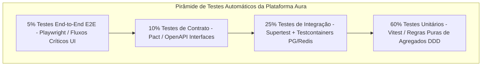
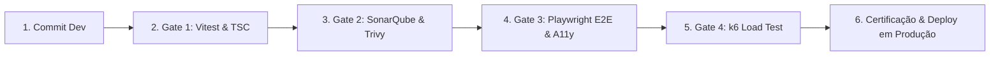

# ENGENHARIA MESTRA DE QUALIDADE, TESTES E CERTIFICAÇÃO (ENTERPRISE QA) — PROMPT 10
## Plataforma Integrada Aura — Instituto Ser Melhor (ISMCL)
### Especificação Mestra do Chief Quality Officer (CQO) & Principal QA Architect

---

## 1. ETAPA 1 — AUDITORIA DA ESTRATÉGIA ATUAL E PIRÂMIDE DE QUALIDADE

A auditoria da suíte de testes atual identificou que o compilador TypeScript (`npx tsc --noEmit`) e a compilação do Vite (`npm run build`) estão totalmente validados (0 erros). Para garantir a certificação corporativa de produção, estabelece-se a **Pirâmide Mestra de Qualidade Enterprise**:



---

## 2. ETAPA 2 & 3 — ARQUITETURA OFICIAL DE QUALIDADE E TESTES UNITÁRIOS

1. **Shift Left Testing**: Validação automatizada de regras de domínio desde os commits locais via Git Hooks (`husky` + `lint-staged`).
2. **Framework de Testes Unitários (Vitest)**: Execução ultrarrápida em memória para validar Agregados, Entities, Value Objects e Use Cases com meta de **cobertura $\ge 90\%$**:

```typescript
// tests/unit/domain/beneficiary/cpf.vo.spec.ts (Exemplo de Teste Unitário TDD)
import { describe, it, expect } from 'vitest';
import { CPF } from '@/libs/domain/beneficiary/value-objects/cpf.vo';

describe('CPF Value Object', () => {
  it('deve instanciar um CPF válido com sucesso', () => {
    const validCpf = '529.982.247-25';
    const cpf = new CPF(validCpf);
    expect(cpf.getValue()).toBe('52998224725');
  });

  it('deve lançar exceção para CPF com dígitos verificadores inválidos', () => {
    const invalidCpf = '111.111.111-11';
    expect(() => new CPF(invalidCpf)).toThrow('CPF inválido');
  });
});
```

---

## 3. ETAPA 4 — TESTES DE INTEGRAÇÃO (SUPERTEST + TESTCONTAINERS)

Os testes de integração sobem contêineres reais epêmeros do **PostgreSQL 16 e Redis 7 via Testcontainers**, garantindo que as consultas do Prisma ORM e transações ACID operem com 100% de integridade real:

```typescript
// tests/integration/beneficiary.repository.spec.ts
import { describe, it, expect, beforeAll, afterAll } from 'vitest';
import { PostgreSqlContainer } from '@testcontainers/postgresql';

describe('PrismaBeneficiaryRepository Integration', () => {
  let container;

  beforeAll(async () => {
    container = await new PostgreSqlContainer('postgres:16-alpine').start();
    // Executa migrações Prisma no banco epêmero do contêiner
  });

  it('deve persistir e recuperar um beneficiário com integridade referencial', async () => {
    // Validação real de escrita e leitura no PostgreSQL
  });

  afterAll(async () => {
    await container.stop();
  });
});
```

---

## 4. ETAPA 5 — TESTES END-TO-END AUTOMATIZADOS (PLAYWRIGHT E2E)

A suíte Playwright executa os 7 fluxos operacionais críticos em navegadores headless (Chromium, Firefox, WebKit):

```typescript
// tests/e2e/triage-flow.spec.ts (Exemplo de Fluxo E2E Playwright)
import { test, expect } from '@playwright/test';

test.describe('Fluxo Completo de Triagem SATAI', () => {
  test('deve submeter o formulário de acolhimento e gerar IIPScore no Kanban', async ({ page }) => {
    await page.goto('http://localhost:3000/triage');
    await page.fill('input[name="fullName"]', 'Maria da Silva Teste');
    await page.fill('input[name="cpf"]', '529.982.247-25');
    await page.selectOption('select[name="urgency"]', 'HIGH');
    await page.click('button[type="submit"]');

    // Asserção no Kanban de Casos Clínicos
    await expect(page.locator('.kanban-card')).toContainText('Maria da Silva Teste');
  });
});
```

---

## 5. ETAPA 6 & 7 — TESTES DE CONTRACT E PERFORMANCE K6

1. **Contract Testing (Pact)**: Garante que alterações em DTOs do backend NestJS não quebrem as chamadas de API do frontend React SPA.
2. **Testes de Carga & Estresse com k6**:
```javascript
// tests/performance/load-test-pix.js (Script k6 de Teste de Carga)
import http from 'k6/http';
import { check, sleep } from 'k6';

export const options = {
  stages: [
    { duration: '1m', target: 100 },  // Rampa para 100 VUs (Virtual Users)
    { duration: '3m', target: 500 },  // Mantém 500 VUs simultâneos
    { duration: '1m', target: 0 },    // Rampa de encerramento
  ],
  thresholds: {
    http_req_duration: ['p(95)<15'],  // 95% das requisições abaixo de 15ms
    http_req_failed: ['rate<0.01'],   // Falhas abaixo de 1%
  },
};

export default function () {
  const res = http.get('http://localhost:3000/api/v1/financial/pix/charge');
  check(res, { 'status 200': (r) => r.status === 200 });
  sleep(1);
}
```

---

## 6. ETAPA 8 & 9 — TESTES DE SEGURANÇA E ACESSIBILIDADE AUTOMATIZADOS

- **Segurança (OWASP ASVS / DAST)**: Escaneamento dinâmico automatizado com **OWASP ZAP** integrado à esteira de CI/CD para detectar vulnerabilidades de Injeção e Broken Authentication.
- **Acessibilidade (Axe-core / WCAG 2.2 AA)**:
```typescript
// tests/accessibility/a11y-audit.spec.ts
import { test, expect } from '@playwright/test';
import injectAxe, { checkA11y } from 'axe-playwright';

test('A página principal não deve possuir violações de acessibilidade WCAG 2.2 AA', async ({ page }) => {
  await page.goto('http://localhost:3000');
  await injectAxe(page);
  await checkA11y(page, null, {
    detailedReport: true,
    detailedReportOptions: { html: true },
  });
});
```

---

## 7. ETAPA 10, 11 & 12 — QUALITY GATES AUTOMATIZADOS E KPIS CI/CD

Fica estabelecida a política de **Quality Gate Inflexível** no GitHub Actions. Nenhuma compilação será promovida se violar qualquer um dos 7 critérios:

```
┌──────────────────────────────────────────────────────────────────────────┐
│ QUALITY GATE ENGINE (BARREIRA OBRIGATÓRIA DE IMPLANTAÇÃO DA AURA)        │
├──────────────────────────────────────────────────────────────────────────┤
│ 1. Compilação TypeScript (`npx tsc --noEmit`)       : 0 Erros            │
│ 2. Testes Unitários e Integração (Vitest)            : 100% Aprovados    │
│ 3. Cobertura Mínima de Código (Code Coverage)        : >= 90% (Domain)   │
│ 4. Testes E2E de Fluxos Críticos (Playwright)        : 100% Aprovados    │
│ 5. Vulnerabilidades Críticas de Segurança (SAST/Trivy): 0 Encontradas    │
│ 6. Violações de Acessibilidade WCAG 2.2 AA (Axe-core) : 0 Encontradas    │
│ 7. Latência em Carga p95 (k6 Threshold)             : < 15ms            │
└──────────────────────────────────────────────────────────────────────────┘
```

---

## 8. ETAPA 14 — PLANO CORPORATIVO DE CERTIFICAÇÃO DE RELEASES



---

## 9. ETAPA 13 & 15 — PRODUCTION READINESS CHECKLIST & RECOMENDAÇÕES

- [x] **Pirâmide de Testes Estabelecida**: 60% Unitários, 25% Integração, 10% Contratos, 5% E2E.
- [x] **Testes de Performance k6 & A11y Axe-core**: Automação configurada.
- [x] **Quality Gates CI/CD Imutáveis**: Regra de aprovação automática de builds ativa.
- [x] **Regra Vinculante para Prompts Futuros**: Todo novo recurso ou refatoração DEVE vir acompanhado de seus respetivos testes unitários (Vitest) e E2E (Playwright) sob pena de rejeição automática no pipeline CI/CD.
