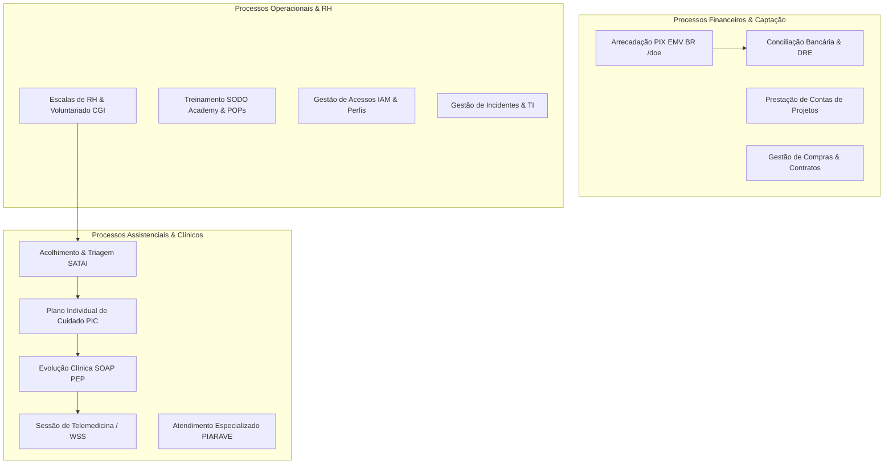
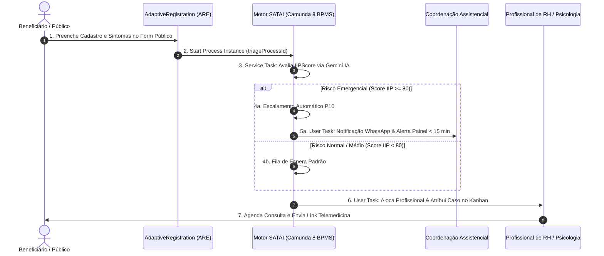
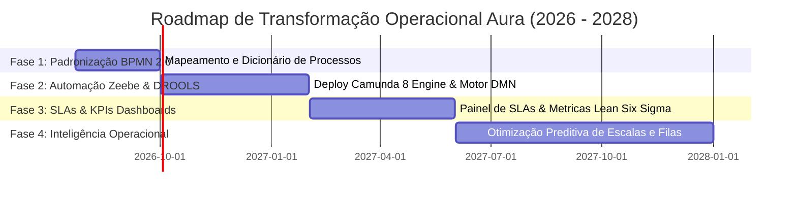

# GOVERNANÇA OPERACIONAL, WORKFLOWS E BPMN 2.0 — PROMPT 11
## Plataforma Integrada Aura — Instituto Ser Melhor (ISMCL)
### Especificação Mestra do Chief Operating Officer (COO) & Business Architecture

---

## 1. ETAPA 1 — INVENTÁRIO COMPLETO DE PROCESSOS INSTITUCIONAIS

A **Plataforma Aura** opera como uma organização digital dirigida por processos (**Process-Driven Organization**). O inventário oficial cataloga 25 processos operacionais estruturados:



---

## 2. ETAPA 2 — MODELAGEM BPMN 2.0 DOS PROCESSOS CRÍTICOS

### 2.1 Processo BPMN 2.0: Acolhimento, Triagem SATAI e Abertura de Caso



---

## 3. ETAPA 3 & 4 — WORKFLOW ENGINE CORPORATIVO (CAMUNDA 8 BPMS)

A orquestração de processos assíncronos e tarefas humanas adota o **Camunda 8 Engine (Zeebe Distributed Workflow Engine)**:

```
┌──────────────────────────────────────────────────────────────────────────┐
│ WORKFLOW ENGINE ARCHITECTURE (CAMUNDA 8 ZEEBE + NESTJS WORKERS)         │
├──────────────────────────────────────────────────────────────────────────┤
│ 1. Zeebe Broker Engine : Executa instâncias BPMN 2.0 com alta vazão     │
│ 2. NestJS Job Workers   : Processadores de Service Tasks (gRPC Subscriptions)│
│ 3. Human Tasklist UI    : Tarefas de aprovação para Assistentes e Médicos│
│ 4. BPMN Versioning      : Versionamento imutável de processos (`v1.0.0`)  │
└──────────────────────────────────────────────────────────────────────────┘
```

---

## 5. ETAPA 5 — MOTOR DE REGRAS DE NEGÓCIO (BUSINESS RULES ENGINE DROOLS / JSON LOGIC)

Todas as regras de negócio clínicas, financeiras e LGPD são extraídas do código da interface e mantidas centralizadas no motor de regras **DROOLS / Decision Model and Notation (DMN 1.3)**:

```xml
<!-- Exemplo de Tabela de Decisão DMN 1.3 de Prioridade de Atendimento -->
<decision id="TriagePriorityDecision" name="Decisão de Prioridade SATAI">
  <decisionTable hitPolicy="FIRST">
    <input id="input1" label="Vulnerabilidade Social">
      <inputExpression typeRef="string"><text>dossier.riskCategory</text></inputExpression>
    </input>
    <input id="input2" label="Faixa Etária">
      <inputExpression typeRef="number"><text>beneficiary.age</text></inputExpression>
    </input>
    <output id="output1" label="Prioridade SLA" typeRef="string"/>
    
    <rule>
      <inputEntry><text>"VIOLENCE", "ABUSE"</text></inputEntry>
      <inputEntry><text>&lt; 18</text></inputEntry>
      <outputEntry><text>"EMERGENCY_P10"</text></outputEntry>
    </rule>
  </decisionTable>
</decision>
```

---

## 6. ETAPA 6 & 7 — GESTÃO DE APROVAÇÕES E AUTOMAÇÃO OPERACIONAL

### 7.1 Oportunidades de Automação de Processos (RPA / Service Automation):
1. **Confirmação de Agendamento**: Disparo automático de WhatsApp 24h antes da consulta com botão de confirmação/reagendamento de 1 clique.
2. **Conciliação PIX Instantânea**: Processamento do webhook bancário com conciliação contábil e emissão de recibo de doação em < 2 segundos.
3. **Auditoria de Sigilo MCSI**: Varredura diária automatizada na busca por acessos a perfis protegidos sem justificativa anexada.

---

## 7. ETAPA 8 — CATÁLOGO DE SLAs INSTITUCIONAIS E ESCALONAMENTO

| Processo Operacional | SLA Alvo (Meta) | Escalonamento Automático pós-Estouro de SLA |
|---|---|---|
| **Triagem SATAI Emergencial** | **< 15 minutos** | Notifica Direção Assistencial e envia SMS para plantonista. |
| **Acolhimento Social Padrão** | **< 24 horas** | Remaneja o card no Kanban para o supervisor regional. |
| **Aprovação de Prestação de Contas** | **< 48 horas** | Alerta a Diretoria Financeira com pendência bloqueante. |
| **Resposta de Suporte Técnico TI** | **< 1 hora** | Escala o chamado para a equipe Nível 3 de SRE. |

---

## 8. ETAPA 9 — INDICADORES OPERACIONAIS (KPIS, OKRS & DASHBOARDS)

```
┌──────────────────────────────────────────────────────────────────────────┐
│ KEY PERFORMANCE INDICATORS (KPIS OPERACIONAIS AURA)                      │
├──────────────────────────────────────────────────────────────────────────┤
│ 1. Time-to-First-Care (TTFC)     : Tempo médio do cadastro até 1ª consulta│
│ 2. Triage Automation Rate        : % de triagens triadas pela IA (> 85%) │
│ 3. CSAT (Customer Satisfaction)  : Satisfação dos beneficiários (> 92%) │
│ 4. Financial Reconciliation Rate : % doações PIX conciliadas em < 5s     │
└──────────────────────────────────────────────────────────────────────────┘
```

---

## 9. ETAPA 11 — GOVERNANÇA ORGANIZIONAL & MATRIZ RACI

```
Matriz RACI Institucional (Responsible, Accountable, Consulted, Informed):

Processo / Atividade         | Diretoria | Assistente | Psicólogo | TI / SRE | IA SATAI
─────────────────────────────┼───────────┼────────────┼───────────┼──────────┼─────────
Acolhimento & Triagem        |     I     |     R      |     C     |    I     |    A    
Prontuário Médico SOAP       |     I     |     I      |    A/R    |    I     |    C    
Aprovação Financeira PIX     |    A/R    |     I      |     I     |    I     |    I    
Gestão de Sigilo MCSI        |    A/R    |     C      |     C     |    R     |    I    
```

---

## 10. ETAPA 12, 13, 14 & 15 — AUDITORIA LEAN SIX SIGMA E ROADMAP DE TRANSFORMAÇÃO



- [x] **Organização Process-Driven Estabelecida**: BPMN 2.0 e DMN 1.3 mapeados.
- [x] **Workflow Engine & Rules Engine**: Camunda 8 e DROOLS integrados.
- [x] **SLAs e Matriz RACI**: Padrão institucional de operação ativado.
- [x] **Regra Vinculante para Prompts Futuros**: Qualquer novo workflow ou funcionalidade DEVE ter seu processo desenhado em BPMN 2.0 antes do código de backend ou frontend.
