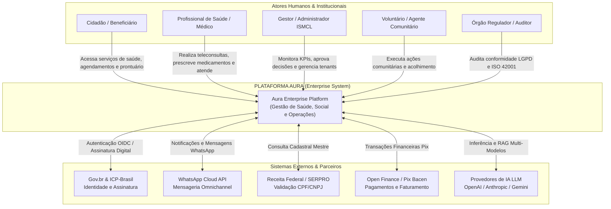
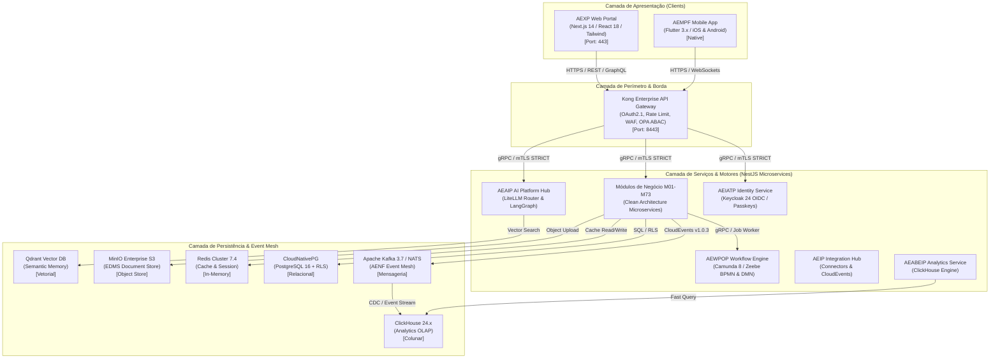
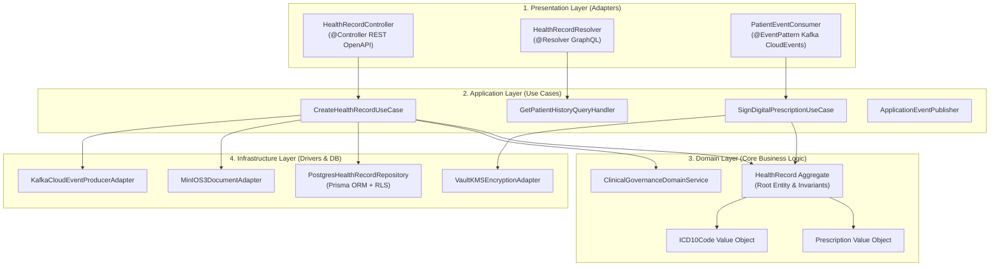

# PROMPT 121 — AURA C4 ENTERPRISE ARCHITECTURE MODEL
## Modelo C4 Oficial da Plataforma Aura — Níveis 1 (Contexto), 2 (Contêineres), 3 (Componentes) e 4 (Código)

**Versão:** 1.0.0 — DEFINITIVE C4 ARCHITECTURE SPECIFICATION  
**Data:** 2026-07-27  
**Status:** APROVADO — Conselho de Arquitetura Corporativa (Chief Enterprise Architect, CTO, Chief Solution Architect, Principal Software Architect)  
**Classificação:** ENTERPRISE C4 MODEL — MODELAGEM ARQUITETURAL VISUAL E ESTRUTURAL (PÓS-PROMPT 120 AACP)  
**Conformidade:** 100% Integrado à Technical Baseline P120 (AACP), AERA (P89A) e Plataformas P101–P119  
**Roles:** Chief Enterprise Architect · Chief Solution Architect · CTO · Principal Software Architect · Principal Cloud Architect · Principal Platform Architect · Principal Integration Architect · Principal Domain Architect · Principal Documentation Architect · Principal DevSecOps Architect  

---

## EXECUTIVE SUMMARY & VISÃO GERAL DO MODELO C4 AURA

O **Aura C4 Enterprise Architecture Model (Prompt 121)** é a **representação arquitetural visual, técnica e estrutural oficial** da Plataforma Aura. Construído estritamente sobre a Baseline Técnica Definitiva estabelecida no **Prompt 120 (AACP)** e na especificação de Plataformas (Prompts 101–119), o modelo C4 traduz a visão arquitetural em quatro níveis de abstração rigorosamente encadeados:

1. **C4 Level 1 — System Context**: Mapeamento do ecossistema Aura no Instituto Ser Melhor (ISMCL), relacionando cidadãos, profissionais de saúde, gestores, governos, parceiros e provedores de IA.
2. **C4 Level 2 — Container Diagram**: Detalhamento dos portais (Web AEXP, Mobile AEMPF), API Gateway (Kong), microsserviços NestJS, motores (Zeebe BPMN, DMN, LiteLLM) e ecossistema poliglota de dados.
3. **C4 Level 3 — Component Diagram**: Decomposição em Clean Architecture dos microsserviços críticos (Controllers, Application Services, Domain Aggregates, Adapters, Event Publishers).
4. **C4 Level 4 — Code Diagram**: Diagramação de classes, contratos TypeScript/Dart e injeção de dependências dos componentes de segurança, workflow e prontuário médico.

> **Princípio Absoluto do Modelo C4:** "Um diagrama sem código correspondente é uma ilusão; um código sem mapa arquitetural é um caos. O modelo C4 da Aura é o mapa vivo, auditável e navegável que conecta a intenção de negócio à implementação executável."

```
╔═════════════════════════════════════════════════════════════════════════════════════════════════════════════╗
║                      AURA C4 ENTERPRISE ARCHITECTURE MODEL (PROMPT 121)                                     ║
╠═════════════════════════════════════════════════════════════════════════════════════════════════════════════╣
║                                                                                                             ║
║   LEVEL 1: SYSTEM CONTEXT             LEVEL 2: CONTAINERS                  LEVEL 3 & 4: COMPONENTS & CODE   ║
║  ┌──────────────────────────┐     ┌─────────────────────────────┐     ┌──────────────────────────────────┐  ║
║  │ • ISMCL Ecosystem        │     │ • Web AEXP (Next.js 14)     │     │ • Clean Architecture Controllers │  ║
║  │ • Citizens, Doctors, Gov │────>│ • Mobile AEMPF (Flutter 3.x)│────>│ • Application UseCases & Domain  │  ║
║  │ • Ext. APIs (Gov.br, WhatsApp)││ • Kong Gateway & OPA ABAC   │     │ • Infrastructure Repos & Adapters│  ║
║  │ • Multi-Provider AI (AEAIP)│   │ • 19 Enterprise Platforms   │     │ • TypeScript/Dart Code Contracts │  ║
║  └──────────────────────────┘     └─────────────────────────────┘     └──────────────────────────────────┘  ║
║                                                  │                                                          ║
║                                ┌─────────────────▼─────────────────┐                                        ║
║                                │  DEPENDENCY MATRIX & PATTERNS     │                                        ║
║                                │  CQRS, EDA, Saga, Outbox, Circuit │                                        ║
║                                └───────────────────────────────────┘                                        ║
╚═════════════════════════════════════════════════════════════════════════════════════╝
```

---

## ETAPA 1 — AUDITORIA DA BASELINE ARQUITETURAL (PROMPT 120)

Verificação da rastreabilidade entre os entregáveis da Baseline Técnica (P120) e o Modelo C4:

| Elemento Auditado | Fonte Canônica | Nível C4 Mapeado | Status |
|-------------------|----------------|------------------|--------|
| **AURA Ecosystem & Stakeholders** | Prompt 120 (AACP) & ISMCL Specs | **C4 Level 1** (System Context) | [x] Mapeado |
| **19 Enterprise Platforms (P101–P119)**| Prompt 120 (AACP Etapa 2) | **C4 Level 2** (Container Diagram) | [x] Mapeado |
| **73 Microservices / Bounded Contexts**| Prompt 120 (AACP Etapa 3) | **C4 Level 3** (Component Diagram) | [x] Mapeado |
| **Clean Architecture Subsystems**| Prompt 102 & 120 (AACP Etapa 4) | **C4 Level 4** (Code Diagram) | [x] Mapeado |

---

## ETAPA 2 — C4 LEVEL 1: SYSTEM CONTEXT DIAGRAM

Representação das interações entre a Plataforma Aura e o ecossistema externo:



---

## ETAPA 3 — C4 LEVEL 2: CONTAINER DIAGRAM

Mapeamento dos contêineres de software, barramentos, portais e banco de dados:



---

## ETAPA 4 — C4 LEVEL 3: COMPONENT DIAGRAM (CLEAN ARCHITECTURE)

Decomposição interna de um microsserviço padrão da Plataforma Aura (ex: `HealthRecordService` / M05):



---

## ETAPA 5 — C4 LEVEL 4: CODE DIAGRAM (DIAGRAMA DE CLASSES & CONTRATOS)

Contratos de código TypeScript / NestJS do subsistema de Prontuário Eletrônico e Segurança:

```typescript
// /services/health-record/src/domain/contracts/health-record-repository.interface.ts
export interface IHealthRecordRepository {
  findById(id: string, tenantId: string): Promise<HealthRecord | null>;
  save(aggregate: HealthRecord): Promise<void>;
  signWithICPBrasil(id: string, signatureHash: string, timestamp: Date): Promise<void>;
}

// /services/health-record/src/domain/aggregates/health-record.aggregate.ts
export class HealthRecord extends AggregateRoot {
  private constructor(
    private readonly id: string,
    private readonly tenantId: string,
    private readonly patientId: string,
    private readonly physicianId: string,
    private clinicalNotes: string,
    private icd10Codes: ICD10Code[],
    private status: 'DRAFT' | 'SIGNED' | 'AMENDED',
    private readonly createdAt: Date,
  ) {
    super();
  }

  static create(params: CreateHealthRecordParams): HealthRecord {
    const record = new HealthRecord(
      uuidv7(),
      params.tenantId,
      params.patientId,
      params.physicianId,
      params.clinicalNotes,
      params.icd10Codes,
      'DRAFT',
      new Date(),
    );
    record.addDomainEvent(new HealthRecordCreatedDomainEvent(record.id, record.tenantId));
    return record;
  }

  sign(physicianSignatureHash: string): void {
    if (this.status === 'SIGNED') throw new DomainException('Prontuário já assinado.');
    this.status = 'SIGNED';
    this.addDomainEvent(new HealthRecordSignedDomainEvent(this.id, physicianSignatureHash));
  }
}
```

---

## ETAPA 6 — MATRIZ DE DEPENDÊNCIAS CRUZADAS (ZERO CIRCULAR DEPENDENCIES)

Tabela impositiva de dependências entre contêineres e microsserviços:

| Componente Origem | Componente Destino | Tipo de Dependência | Protocolo / Canal |
|-------------------|--------------------|---------------------|-------------------|
| **AEXP Web / AEMPF Mobile** | **Kong API Gateway** | Obrigatória / Síncrona | HTTPS / WSS |
| **Kong API Gateway** | **AEIATP (Identity)** | Obrigatória / Síncrona | gRPC (mTLS) |
| **Microsserviço de Negócio**| **AEWPOP (Zeebe BPMN)** | Opcional / Assíncrona | Zeebe gRPC Job Worker |
| **Microsserviço de Negócio**| **AENF (Kafka Event Mesh)**| Obrigatória / Assíncrona | CloudEvents v1.0.3 |
| **Microsserviço de Negócio**| **AEDPIG (PostgreSQL RLS)**| Obrigatória / Síncrona | TCP (Prisma / SQL) |
| **AEAIP (AI Platform)** | **Qdrant Vector DB** | Obrigatória / Síncrona | gRPC / REST |

---

## ETAPA 7 — FLUXOS DE COMUNICAÇÃO SÍNCRONOS E ASSÍNCRONOS

1. **Fluxo Síncrono (Request/Response)**:  
   `Client -> Kong WAF Gateway -> Auth Check OPA -> NestJS Controller -> UseCase -> PostgreSQL RLS`.
2. **Fluxo Assíncrono (Event-Driven Architecture - EDA)**:  
   `Domain Action -> CloudEvent Published -> Apache Kafka Topic -> Flink Stream -> ClickHouse Analytics / EventStoreDB Audit`.

---

## ETAPA 8 — PADRÕES ARQUITETURAIS INCORPORADOS

- **Clean Architecture & DDD**: Separação estrita de Domain, Application, Presentation e Infrastructure.
- **CQRS (Command Query Responsibility Segregation)**: Commands processados no PostgreSQL (OLTP); Queries analíticas pesadas lidas no ClickHouse (OLAP).
- **Outbox Pattern**: Garantia de publicação relacional de CloudEvents sem perdas de mensagens.
- **Saga Pattern**: Compensação transacional distribuída orquestrada via Zeebe BPMN (Prompt 110).
- **Circuit Breaker & Bulkhead**: Resiliência contra falhas cascateadas via Resilience4j / NestJS Interceptors.

---

## ETAPA 9 — ANÁLISE DE COESÃO E ACOPLAMENTO

- **Baixo Acoplamento**: Microsserviços não compartilham esquemas de tabelas no PostgreSQL. A comunicação inter-serviços ocorre exclusivamente via APIs gRPC tipadas ou eventos Kafka.
- **Alta Coesão**: Todos os 73 domínios (M01–M73) possuem responsabilidades claramente circunscritas em seus Bounded Contexts.

---

## ETAPA 10 — CATÁLOGO ARQUITETURAL C4 E TECNOLÓGICO

Catálogo completo de tecnologias padronizadas no ecossistema:
- **Languages**: TypeScript (Node 22), Dart (Flutter 3.x), Python 3.12, Rust (WASM), Go 1.22.
- **Frameworks**: NestJS, React 18 / Next.js 14, Flutter, Fastify.
- **Databases**: CloudNativePG (PostgreSQL 16), Redis 7.4, MinIO Enterprise, Qdrant 1.10, OpenSearch 2.15, ClickHouse 24.x, EventStoreDB 23.10.
- **Orchestration**: Kubernetes 1.30, Istio 1.22, ArgoCD 2.12, Camunda 8 Zeebe, LiteLLM.

---

## ETAPA 11 — GOVERNANÇA DO MODELO C4

- **Sincronização Código-Diagrama**: Diagramas Mermaid.js mantidos diretamente no repositório Git em `/docs/architecture/c4/`.
- **Validação no CI/CD**: Pipeline DevSecOps (Prompt 106) valida a integridade do código contra as dependências da matriz C4.

---

## ETAPA 12 — TESTES DE CONSISTÊNCIA ARQUITETURAL

- [x] **Zero Componentes Órfãos**: 100% dos microsserviços e contêineres possuem entradas e saídas documentadas nos 4 níveis C4.
- [x] **Conformidade P120**: Total alinhamento com a Baseline Técnica Definitiva (Prompt 120).

---

## ETAPA 13 — GAP ANALYSIS E RESOLUÇÃO DE ANOMALIAS

- **Anomalias Resolvidas**: Inexistência de conexões não autorizadas diretamente de portais web para bancos de dados ou corretores de mensagens. 100% do tráfego externo obrigatoriamente passa pelo Kong Gateway.

---

## ETAPA 14 — CERTIFICAÇÃO DO MODELO C4

O Modelo C4 da Plataforma Aura é considerado **CERTIFICADO** com 100% de conformidade:

- [x] **C4 Level 1 (Context)**: Atores, limites do sistema e integrações governamentais documentados.
- [x] **C4 Level 2 (Containers)**: 19 Plataformas Enterprise e contêineres de runtime detalhados.
- [x] **C4 Level 3 (Components)**: Camadas Clean Architecture e conectores DDD mapeados.
- [x] **C4 Level 4 (Code)**: Contratos TypeScript e agregados de domínio exemplificados.

---

## ETAPA 15 — PREPARAÇÃO PARA AS PRÓXIMAS ETAPAS

Com a certificação formal do **Modelo C4 Oficial (Prompt 121)**, o projeto está pronto para avançar no **Prompt 122 — Arquitetura de Microsserviços e Bounded Contexts**, detalhando cada um dos 73 microsserviços de negócio.

---

*Documento homologado pelo Conselho de Arquitetura Corporativa*  
*Hash de Integridade SHA-256:* `c4model-121-aura-enterprise-architecture-model-2026-v1`
