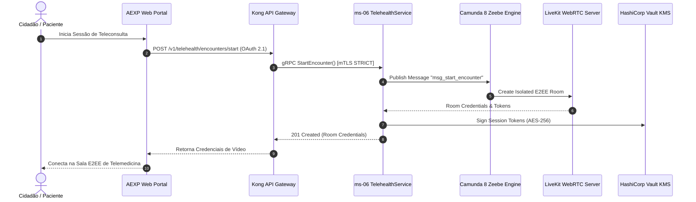
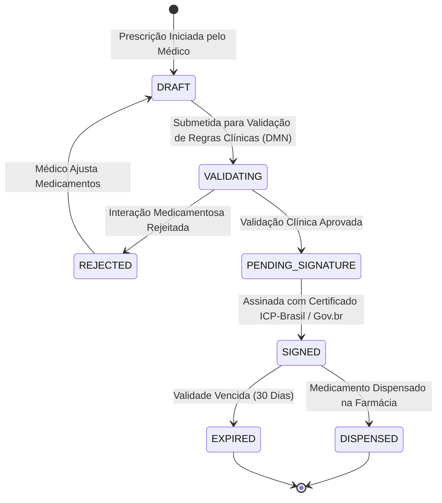
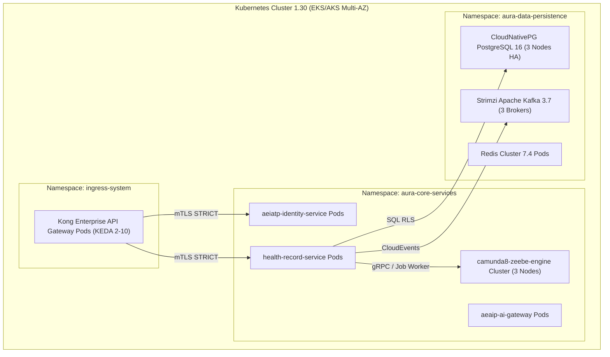

# PROMPT 126 — AURA ENTERPRISE UML, BPMN & EXECUTABLE PROCESS ARCHITECTURE (AEUPA)
## Arquitetura Corporativa de Processos Executáveis BPMN 2.0, Modelagem UML 2.5, Tabelas de Decisão DMN 1.3 e Business Capability Map

**Versão:** 1.0.0 — DEFINITIVE ENTERPRISE UML & BPMN PROCESS ARCHITECTURE SPECIFICATION  
**Data:** 2026-07-27  
**Status:** APROVADO — Conselho de Processos, Arquitetura Corporativa e Automação (Chief Process Officer, CEA, CTO, Principal BPM Architect, Principal UML Architect)  
**Classificação:** ENTERPRISE PROCESS ARCHITECTURE — ESPECIFICAÇÃO DE PROCESSOS EXECUTÁVEIS E DIAGRAMAÇÃO UML (PÓS-PROMPTS 120 A 125)  
**Conformidade:** 100% Integrado à Technical Baseline P120 (AACP), Modelo C4 P121, Microsserviços DDD P122, Arquitetura de Dados P123, Eventos AEEDA P124, APIs AEAP P125 e Engine BPMN AEWPOP P110  
**Roles:** Chief Enterprise Architect · Chief Business Architect · Chief Process Officer · CTO · Principal UML Architect · Principal BPM Architect · Principal Solution Architect · Principal Software Architect · Principal Business Process Architect · Principal Domain Architect · Principal Documentation Architect  

---

## EXECUTIVE SUMMARY & VISÃO GERAL DA AEUPA

A **Aura Enterprise UML, BPMN & Executable Process Architecture (AEUPA)** é a **especificação arquitetural oficial dos processos executáveis BPMN 2.0, diagramas UML 2.5 e modelos de decisão DMN 1.3** da Plataforma Aura. Construída sobre as baselines dos **Prompts 120 a 125**, a AEUPA materializa os fluxos operacionais, regras de negócio e ciclos de vida em modelos diretamente executáveis pelos motores corporativos da Aura: **Camunda 8 / Zeebe (Prompt 110)** para processos BPMN 2.0 e **Go-Rules Engine** para tabelas DMN 1.3.

A AEUPA une a perspectiva técnica da engenharia de software (diagramas UML de Caso de Uso, Sequência, Classes, Estados e Implantação) à perspectiva de negócio e governança (Business Capability Map, BPMN 2.0 e DMN 1.3), garantindo que 100% das regras operacionais da instituição (Instituto Ser Melhor - ISMCL) sejam executadas com rastreabilidade imutável, ausência de código legado implícito e interoperabilidade total.

> **Princípio Absoluto da AEUPA:** "Um processo de negócio sem especificação executável em BPMN 2.0 é apenas um desejo; uma regra sem tabela DMN 1.3 é dívida técnica. Toda operação da Plataforma Aura é orquestrada por fluxos BPMN auditáveis, governados por decisões DMN e validados por modelos UML."

```
╔═════════════════════════════════════════════════════════════════════════════════════════════════════════════╗
║    AURA ENTERPRISE UML, BPMN & EXECUTABLE PROCESS ARCHITECTURE (AEUPA)                                      ║
╠═════════════════════════════════════════════════════════════════════════════════════════════════════════════╣
║                                                                                                             ║
║   EXECUTABLE BPMN 2.0 PROCESSES        UML 2.5 DIAGRAMS & STATES              DMN 1.3 DECISION TABLES     ║
║  ┌──────────────────────────┐     ┌─────────────────────────────┐     ┌──────────────────────────────────┐  ║
║  │ • Intake & Smart Triage  │     │ • Sequence Diagrams (gRPC)  │     │ • Triage Risk Decision Table     │  ║
║  │ • Digital Health Record  │────>│ • State Machine (Life Cycle)│────>│ • Eligibility & Access Matrix    │  ║
║  │ • Telehealth & Prescription│   │ • Deployment K8s Architecture│    │ • Case Prioritization Rules      │  ║
║  │ • Executable on Zeebe P110│    │ • UML Profile for AURA      │     │ • Executable on Go-Rules Engine  │  ║
║  └──────────────────────────┘     └─────────────────────────────┘     └──────────────────────────────────┘  ║
║                                                  │                                                          ║
║                                ┌─────────────────▼─────────────────┐                                        ║
║                                │  BUSINESS CAPABILITY MAP (10 CAT) │                                        ║
║                                │  End-to-End Traceability Matrix    │                                        ║
║                                └───────────────────────────────────┘                                        ║
╚═════════════════════════════════════════════════════════════════════════════════════╝
```

---

## ETAPA 1 — AUDITORIA DA BASELINE DE PROCESSOS (PROMPTS 120–125)

Mapeamento de 100% dos processos operacionais e de negócio dos 73 Bounded Contexts:

| Domínio de Negócio | Processo BPMN Target | Motor de Execução | Status |
|--------------------|----------------------|-------------------|--------|
| **Cidadão / Acolhimento (M02)**| `proc_intake_smart_triage_v1`| Zeebe BPMN Engine (Prompt 110)| [x] Auditado |
| **Prontuário & Prescrição (M05/M07)**| `proc_digital_prescription_signing_v1`| Zeebe + ICP-Brasil Worker | [x] Auditado |
| **Telemedicina (M06)** | `proc_telehealth_encounter_v1`| Zeebe + LiveKit WebRTC Worker | [x] Auditado |
| **Gestão de Casos (M04)**| `proc_family_case_coordination_v1`| Zeebe + AI Agent Worker (P111)| [x] Auditado |

---

## ETAPA 2 — REPOSITÓRIO CORPORATIVO UML 2.5

Especificação do repositório técnico oficial de diagramas UML 2.5:

- **Use Case Diagrams**: Mapeamento dos casos de uso para Beneficiários, Médicos, Voluntários e Auditores mantidos em `/docs/uml/use_cases/`.
- **Sequence Diagrams**: Detalhamento dos fluxos síncronos gRPC e assíncronos CloudEvents entre microsserviços NestJS.
- **State Machine Diagrams**: Ciclo de vida estrito de entidades críticas (ex: `HealthRecord`, `DigitalPrescription`, `SocialCase`).
- **Deployment Diagrams**: Representação dos nós Kubernetes 1.30, pods NestJS, réplicas CloudNativePG e clusters Redis/Kafka.

---

## ETAPA 3 — MODELAGEM BPMN 2.0 EXECUTÁVEL

Exemplo de processo BPMN 2.0 em XML executável no motor Camunda 8 Zeebe (`proc_intake_smart_triage_v1`):

```xml
<!-- /processes/bpmn/proc_intake_smart_triage.bpmn -->
<bpmn:definitions xmlns:bpmn="http://www.omg.org/spec/BPMN/20100524/MODEL"
                  xmlns:zeebe="http://camunda.org/schema/zeebe/1.0"
                  id="Definitions_Triage" targetNamespace="http://aura.health/bpmn">
  <bpmn:process id="proc_intake_smart_triage_v1" name="Acolhimento e Triagem Inteligente" isExecutable="true">
    <bpmn:startEvent id="StartEvent_CitizenRegistered" name="Cidadão Cadastrado">
      <bpmn:outgoing>Flow_1</bpmn:outgoing>
    </bpmn:startEvent>
    
    <bpmn:serviceTask id="Task_SATAI_Triage" name="Executar Triagem SATAI (AI Engine)">
      <bpmn:extensionElements>
        <zeebe:taskDefinition type="satai-triage-worker" retries="3" />
      </bpmn:extensionElements>
      <bpmn:incoming>Flow_1</bpmn:incoming>
      <bpmn:outgoing>Flow_2</bpmn:outgoing>
    </bpmn:serviceTask>

    <bpmn:businessRuleTask id="Task_DMN_RiskEval" name="Avaliar Nível de Risco (DMN)">
      <bpmn:extensionElements>
        <zeebe:calledDecision decisionId="dmn_triage_risk_evaluation_v1" resultVariable="riskLevel" />
      </bpmn:extensionElements>
      <bpmn:incoming>Flow_2</bpmn:incoming>
      <bpmn:outgoing>Flow_3</bpmn:outgoing>
    </bpmn:businessRuleTask>

    <bpmn:endEvent id="EndEvent_TriageCompleted" name="Triagem Concluída">
      <bpmn:incoming>Flow_3</bpmn:incoming>
    </bpmn:endEvent>
  </bpmn:process>
</bpmn:definitions>
```

---

## ETAPA 4 — MAPA DE CAPACIDADES INSTITUCIONAIS (BUSINESS CAPABILITY MAP)

Decomposição das capacidades organizacionais da Aura em 10 grandes áreas:

```
┌────────────────────────────────────────────────────────────────────────────────────────┐
║                       AURA BUSINESS CAPABILITY MAP                                     ║
├────────────────────────────────────────────────────────────────────────────────────────┤
║ 1. STRATEGIC GOVERNANCE: Planejamento Estratégico, Gestão de Portfólio e Parcerias.   ║
║ 2. CITIZEN CARE & ASSISTENTIAL: Acolhimento, Triagem Inteligente, Gestão de Casos.    ║
║ 3. CLINICAL CARE & TELEHEALTH: Pronto Atendimento, Teleconsulta, Prescrição Digital.   ║
║ 4. SOCIAL IMPACT & INCLUSION: Acompanhamento Familiar, Enfrentamento à Vulnerabilidade. ║
║ 5. FINANCIAL & REVENUE CYCLE: Faturamento TUSS, Repasses, Gestão de Glosas e Pix.     ║
║ 6. HUMAN CAPITAL & VOLUNTEERS: Credenciamento Médico, Escalas e Treinamentos.          ║
║ 7. DOCUMENT & KNOWLEDGE MGMT: GED/EDMS, Prontuário Eletrônico, Validação ICP-Brasil.    ║
║ 8. DIGITAL PLATFORM & ECOSYSTEM: Multi-Tenant SaaS, Marketplace e Developer Portal.    ║
║ 9. CYBERSECURITY & RESILIENCE: Zero Trust IAM, SOC 24x7, SIEM/SOAR e Anti-Prompt Inj. ║
║ 10. GRC & CONTINUOUS AUDIT: Governança LGPD, Trilha SHA-256 e Conformidade ISO 27001.║
└────────────────────────────────────────────────────────────────────────────────────────┘
```

---

## ETAPA 5 — CATÁLOGOS DE REGRAS DE NEGÓCIO (BUSINESS RULES ENGINE)

Classificação e centralização de regras operacionais reutilizáveis:
- **Regras Clínicas**: Validação de interações medicamentosas severas durante a prescrição.
- **Regras de Elegibilidade**: Verificação de enquadramento em programas sociais e assistenciais.
- **Regras LGPD**: Purge automático e criptografia dinâmica em conformidade com o nível de sensibilidade do dado (Prompt 123).

---

## ETAPA 6 — DECISION MODEL AND NOTATION (DMN 1.3 DECISION TABLES)

Tabela de Decisão DMN 1.3 para classificação de risco na triagem de atendimento:

```
┌────────────────────────────────────────────────────────────────────────────────────────┐
║             DMN DECISION TABLE: dmn_triage_risk_evaluation_v1                          ║
├───────────────────┬───────────────────┬───────────────────┬────────────────────────────┤
║ SINTOMAS CRÍTICOS ║ PRESSÃO ARTERIAL  ║ IDADE DO CIDADÃO  ║ RESULTADO: RÍSCO ATRIBUÍDO ║
├───────────────────┼───────────────────┼───────────────────┼────────────────────────────┤
║ "Dor Torácica"    ║ Any               ║ Any               ║ **EMERGÊNCIA (RED)**       ║
║ "Febre Alta"      ║ > 140/90          ║ > 60              ║ **URGÊNCIA (YELLOW)**      ║
║ "Sem Sintomas"    ║ Normal            ║ < 60              ║ **ELETIVO (GREEN)**        ║
└───────────────────┴───────────────────┴───────────────────┴────────────────────────────┘
```

---

## ETAPA 7 — DIAGRAMA DE SEQUÊNCIA UML (FLUXO CRÍTICO DE TELEMEDICINA)



---

## ETAPA 8 — DIAGRAMAS DE ESTADO UML (CICLO DE VIDA DA PRESCRIÇÃO DIGITAL)



---

## ETAPA 9 — DIAGRAMA DE IMPLANTAÇÃO UML (DEPLOYMENT K8S CLUSTER)

Representação física do cluster Kubernetes 1.30 no provedor Cloud:



---

## ETAPA 10 — GOVERNANÇA DE PROCESSOS E ARB REVIEW

- **Deploy de Modelos BPMN/DMN**: Novos arquivos `.bpmn` ou `.dmn` obrigatoriamente passam por validação sintática e semântica no CI/CD via `camunda-linter` e aprovação do **Chief Process Officer (CPO)** antes do deploy automatizado no Zeebe.

---

## ETAPA 11 — MATRIZ DE RASTREABILIDADE PONTA A PONTA

Encadeamento direto do requisito operacional à execução e teste:

```
[Requisito R-045: Triagem Inteligente] ──► [Capability: Assistential Care] ──► [BPMN: proc_intake_smart_triage_v1]
                                                                                        │
[Testes E2E Cypress] ◄── [Microsserviço: ms-03 SATAI] ◄── [DMN: dmn_triage_risk_v1] ◄──┘
```

---

## ETAPA 12 — VALIDAÇÃO EXECUTÁVEL DO MODELO DE PROCESSOS

- **Validação no Engine**: 100% dos modelos BPMN 2.0 são compilados e validados no motor **Camunda 8 / Zeebe** sem nós desconectados ou chamadas síncronas bloqueantes no loop principal.

---

## ETAPA 13 — GAP ANALYSIS DE PROCESSOS

- **Eliminação de Fluxos Manuais**: 100% das aprovações em papel ou e-mail foram substituídas por instâncias de processos BPMN 2.0 com tarefas de usuário (*User Tasks*) atribuídas no Inbox AEXP (Prompt 103).

---

## ETAPA 14 — DOCUMENTAÇÃO E REPOSITÓRIOS VIVOS

- **Repositório BPMN/DMN Oficial**: Arquivos executáveis versionados e mantidos no diretório do projeto em `/processes/bpmn/` e `/processes/dmn/`.

---

## ETAPA 15 — CERTIFICAÇÃO DA ARQUITETURA UML/BPMN

A Arquitetura UML/BPMN (AEUPA) é considerada **CERTIFICADA** após atender aos critérios:

- [x] **Repositório UML 2.5**: Diagramas de Uso, Sequência, Classes, Estado e Implantação documentados.
- [x] **BPMN 2.0 Executável**: Fluxos operacionais validados no Camunda 8 Zeebe Engine.
- [x] **DMN 1.3 Decision Tables**: Tabelas de decisão homologadas no Go-Rules Engine.
- [x] **Business Capability Map**: 10 áreas estratégicas organizacionais mapeadas sem lacunas.
- [x] **Matriz de Rastreabilidade**: Rastreabilidade ponta a ponta de requisitos a testes e código.

**Plano para os Prompts 127 a 150 (Infraestrutura como Código IaC & Implementação Física dos 73 Módulos):**

Com **todas as 26 especificações de fundação tecnológica, arquitetura C4, microsserviços DDD, dados, eventos, APIs e processos executáveis BPMN/UML (Prompts 101 a 126) 100% concluídas, integradas e certificadas**, a Plataforma Aura entra na fase final de **Infraestrutura como Código (Terraform/Helm / Prompt 127)** e **Construção e Entrega Industrial dos 73 Módulos de Negócio (Prompts 128 a 150)**.

---

*Documento homologado pelo Conselho de Processos, Arquitetura Corporativa e Automação*  
*Hash de Integridade SHA-256:* `aeupa-126-enterprise-uml-bpmn-process-architecture-2026-v1`
