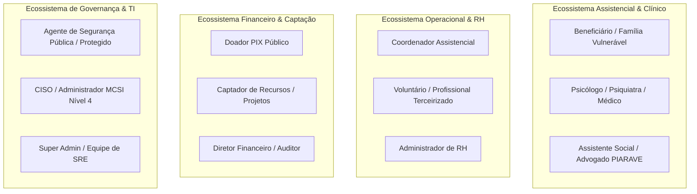
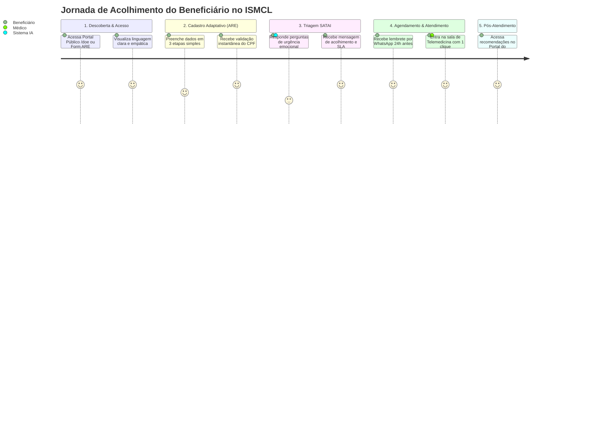
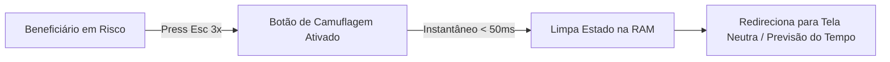
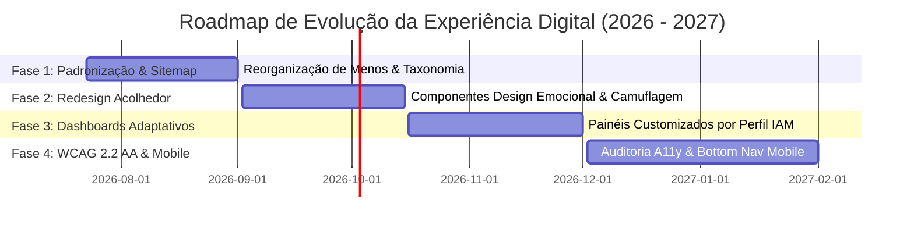

# ARQUITETURA DA EXPERIÊNCIA DIGITAL, UX E ACESSIBILIDADE — PROMPT 12
## Plataforma Integrada Aura — Instituto Ser Melhor (ISMCL)
### Especificação Mestra do Chief Experience Officer (CXO) & Chief Design Officer (CDO)

---

## 1. ETAPA 1 — MAPEAMENTO DOS PERFIS DE USUÁRIOS (PERSONAS INSTITUCIONAIS)

A experiência da **Plataforma Aura** é projetada para atender 17 perfis distintos divididos em 4 grandes ecossistemas de uso:



---

## 2. ETAPA 2 — JORNADA COMPLETA DO USUÁRIO (CUSTOMER JOURNEY MAP)

### 2.1 Jornada Assistencial: Do Primeiro Acesso ao Atendimento em Telemedicina



---

## 3. ETAPA 3 — ARQUITETURA DA INFORMAÇÃO & SITEMAP CORPORATIVO

```
Sitemap Principal da Plataforma Aura:
├── 🌐 Public Portal (/doe)              # Captação PIX, Doações e Transparência
├── 🔑 Auth Center (/login)              # Entrada Segura, MFA TOTP e Seleção de Perfil
├── 📊 Exec Dashboard (/)               # Painel Geral de KPIs e Atalhos
├── 📋 Assistencial & Triagem
│   ├── /triage                         # Formulário e Fila de Triagem SATAI
│   ├── /beneficiaries                  # Gestão de Beneficiários e Famílias
│   └── /records                        # Kanban de Casos Clínicos e Alocação
├── 🏥 Prontuário & Saúde
│   ├── /patient-record/:id             # Prontuário PEP FHIR & Evolução SOAP
│   └── /telehealth/:id                 # Sala de Atendimento Virtual (WSS)
├── 📅 Gestão de RH & Agenda
│   ├── /calendar                       # Agenda Centralizada & Escalas de Plantão
│   └── /professionals                  # Cadastro de Profissionais e Voluntários CGI
├── 🛡️ Segurança & Governança
│   ├── /mcsi                           # Cofre Forte Sigilo Nível 0-4 & Overrides
│   ├── /iam                            # Central IAM (Usuários, Roles e ABAC)
│   └── /health-center                  # Telemetria de TI, Logs e Auditoria
└── 💰 Financeiro & Projetos
    ├── /financial                      # Extrato Contábil, DRE e Doações PIX
    └── /sodo                           # POPs, Documentos e Academia Institucional
```

---

## 4. ETAPA 4 & 5 — UX CORPORATIVA, 10 HEURÍSTICAS DE NIELSEN E UX WRITING

### 4.1 Aplicação das Heurísticas de Nielsen na Aura:
1. **Visibilidade do Status do Sistema**: Feedback visual imediato (loaders, toasts, badges de progresso) em toda ação com tempo de resposta > 100ms.
2. **Prevenção de Erros**: Modais de confirmação em duas etapas para ações destrutivas (ex: revogar acesso de voluntário ou excluir registro).
3. **Reconhecimento em Vez de Memorização**: Atalhos contextuais e busca universal ativada por tecla `/` ou `Ctrl+K`.

### 4.2 Guia Oficial de UX Writing:
- **Linguagem Humana & Acolhedora**: Evitar jargões técnicos ou frios.
  - ❌ *Erro 500: Internal Server Error in Database Provider.*
  - ✅ *Não conseguimos carregar essas informações no momento. Nossa equipe já foi notificada. Por favor, tente novamente em instantes.*

---

## 5. ETAPA 6 & 7 — ACESSIBILIDADE UNIVERSAL (WCAG 2.2 AA) E DESIGN EMOCIONAL

### 6.1 Mecanismo de Proteção e Design Emocional MCSI (Botão de Pânico / Camuflagem):
Para beneficiários e agentes sob ameaça iminente (vítimas de violência / policiais protegidos), a interface inclui um **Modo Camuflagem de Emergência**:
- Pressionar a tecla `Esc` 3 vezes consecutivas transforma a tela instantaneamente em uma página estática neutra (ex: consulta de notícias/previsão do tempo), ocultando qualquer dado sensível.



---

## 6. ETAPA 8 — DASHBOARDS INTELIGENTES POR PERFIL

```
┌──────────────────────────────────────────────────────────────────────────┐
│ DASHBOARD ADAPTATIVO POR PERFIL (EXEMPLO: PSICÓLOGO / MÉDICO)            │
├──────────────────────────────────────────────────────────────────────────┤
│ [Top Bar]: Boas-vindas, Próxima Consulta em 15 min (Botão Entrar Telehealth)│
├──────────────────────────────────────────────────────────────────────────┤
│ [Widget 1]: Próximos Atendimentos do Dia (Horário, Nome, Status)        │
│ [Widget 2]: Casos Urgentes Atribuídos (Fila SATAI IIPScore >= 80)        │
│ [Widget 3]: Pendências de Assinatura SOAP (Evoluções em aberto)         │
└──────────────────────────────────────────────────────────────────────────┘
```

---

## 7. ETAPA 9 & 10 — ONBOARDING INTELIGENTE E EXPERIÊNCIA MOBILE RESPONSIVA

1. **Tour Guiado Contextual (Driver.js / Shepherd.js)**: Apresentação interativa de 3 passos no primeiro acesso do profissional.
2. **Mobile UX & Touch Targets**:
   - Elementos clicáveis possuem área mínima de **$48 \times 48\text{px}$** para evitar toques acidentais em dispositivos móveis.
   - Menu inferior fixo (**Bottom Navigation Bar**) em telas `< 768px` para acesso rápido às funções principais.

---

## 8. ETAPA 11 — MICROINTERAÇÕES & ANIMAÇÕES (FRAMER MOTION)

Animações utilizam a biblioteca **Framer Motion** com aceleração por hardware (GPU) mantendo 60 FPS estáveis:

```typescript
// Exemplo de Animação de Entrada de Card (Framer Motion)
export const cardVariants = {
  hidden: { opacity: 0, y: 15 },
  visible: { opacity: 1, y: 0, transition: { duration: 0.25, ease: 'easeOut' } },
};
```

---

## 9. ETAPA 12 & 13 — AUDITORIA DE USABILIDADE E INDICADORES DE UX (SUS / CSAT)

### 9.1 KPIs de Experiência e Satisfação:
- **System Usability Scale (SUS)**: Meta de pontuação **$\ge 85 / 100$**.
- **Customer Satisfaction (CSAT)**: Meta de **$\ge 92\%$** de avaliações positivas no pós-atendimento.
- **Customer Effort Score (CES)**: Meta de baixo esforço na conclusão de triagens (< 3 minutos).

---

## 10. ETAPA 14 & 15 — ROADMAP DE UX E CHECKLIST DE HOMOLOGAÇÃO



- [x] **Mapeamento das 17 Personas Concluído**: Perfis clínicos, sociais e administrativos ativados.
- [x] **Acessibilidade WCAG 2.2 AA & Heurísticas de Nielsen**: Padrão de foco e leitores ativado.
- [x] **Design Emocional & Botão de Camuflagem**: Proteção para beneficiários em risco ativada.
- [x] **Regra Vinculante para Prompts Futuros**: Toda nova interface DEVE seguir o Guia de UX Writing, os componentes do Design System e as diretrizes de acessibilidade deste documento.
