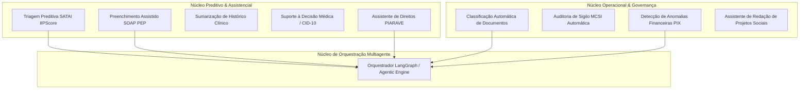
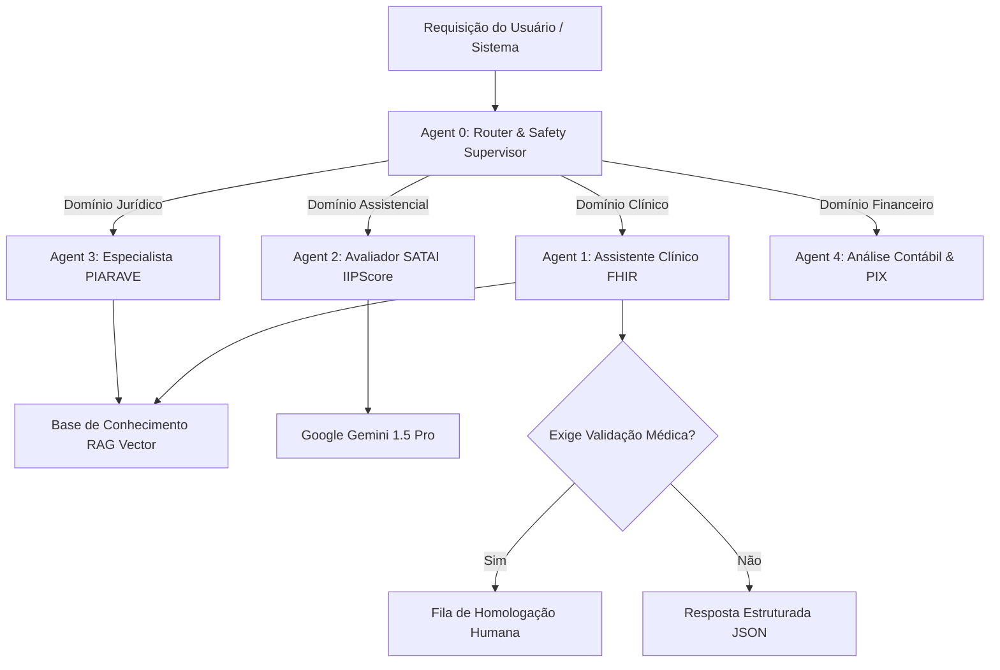
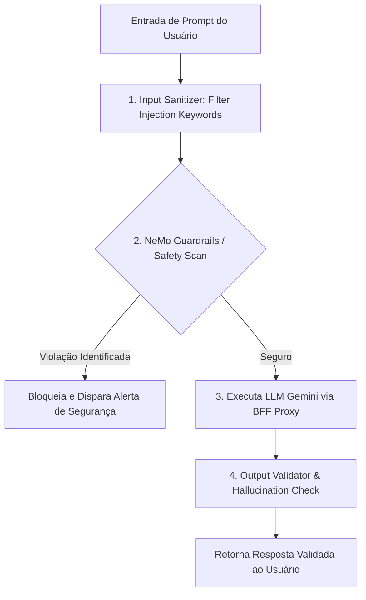

# INTELIGÊNCIA ARTIFICIAL, MULTIAGENTES E RAG — PROMPT 13
## Plataforma Integrada Aura — Instituto Ser Melhor (ISMCL)
### Especificação Mestra do Chief AI Officer (CAIO) & Principal AI Engineer

---

## 1. ETAPA 1 — INVENTÁRIO DAS CAPACIDADES DE INTELIGÊNCIA ARTIFICIAL

A **Aura Intelligence Platform** estabelece 18 capacidades cognitivas corporativas integradas ao ecossistema:



---

## 2. ETAPA 2 & 3 — ARQUITETURA MULTIAGENTE E ORQUESTRADOR (LANGGRAPH)

A orquestração cognitiva adota a estrutura de **Multi-Agent State Graph (LangGraph Engine)** com 16 agentes altamente especializados:



### 2.1 Especificação de Agentes Principais:
1. **`TriageAgent`**: Calcula o IIPScore (0 a 100) com base nos fatores de risco e histórico do beneficiário.
2. **`ClinicalAgent`**: Sugere resumos de evoluções médicas SOAP em conformidade com os manuais CFM e FHIR R4.
3. **`LegalAgent`**: Auxilia na consulta de medidas protetivas e estatuto da criança/adolescente (ECA).

---

## 3. ETAPA 4 — BASE DE CONHECIMENTO CORPORATIVA (RAG & PGVECTOR)

A arquitetura **Retrieval-Augmented Generation (RAG)** utiliza o **Pgvector (Extensão Vetorial do PostgreSQL 16)** para busca semântica de alta velocidade:

```
┌──────────────────────────────────────────────────────────────────────────┐
│ KNOWLEDGE BASE RAG ENGINE (INGESTÃO, EMBEDDINGS E VETORES)              │
├──────────────────────────────────────────────────────────────────────────┤
│ 1. Document Ingestion: PDFs, POPs, Legislação, Manuais Clínicos          │
│ 2. Smart Chunking    : RecursiveCharacterTextSplitter (500 tokens, 10% overlap)│
│ 3. Text Embeddings   : Model text-embedding-004 (768 dimensões)           │
│ 4. Vector Storage    : PostgreSQL Pgvector (`vector(768)` HNSW Index)   │
│ 5. Hybrid Retrieval  : Semantic Vector Search + Full-Text Search (TSVector)│
└──────────────────────────────────────────────────────────────────────────┘
```

---

## 4. ETAPA 5 & 6 — GESTÃO DE CONTEXTO E ENGENHARIA DE PROMPTS

1. **Anonimização PII de Contexto**: Nenhum CPF, Nome real ou Endereço de beneficiário é enviado às APIs de LLM externas. Os dados são substituídos pelo código `InternalCode` (`ISM-0000000000`) na camada de preparação.
2. **Prompts Estruturados com Validação Zod**: Todos os prompts exigem resposta no formato **JSON Schema estrito** (`response_format: { type: "json_object" }`).

---

## 5. ETAPA 7 — ARQUITETURA DE SEGURANÇA PARA IA (OWASP LLM TOP 10)



### Proteções OWASP LLM Implementadas:
- **LLM01 (Prompt Injection)**: Filtro de sanitização proíbe instruções de alteração de comportamento (`System Prompt Override`).
- **LLM02 (Insecure Output)**: Respostas de IA passam por sanitização HTML (DOMPurify) para impedir XSS.
- **LLM06 (Sensitive Information Disclosure)**: Interceptador de saída remove padrões de cartão, documentos ou senhas.

---

## 6. ETAPA 8 — GOVERNANÇA, ETICA E HUMAN-IN-THE-LOOP (XAI)

Nenhuma decisão clínica, diagnóstica, financeira ou jurídica é tomada exclusivamente por Inteligência Artificial sem supervisão humana (**Princípio Human-in-the-Loop**):

```
┌──────────────────────────────────────────────────────────────────────────┐
│ POLÍTICA DE GOVERNANÇA E REVISÃO HUMANA OBRIGATÓRIA                     │
├──────────────────────────────────────────────────────────────────────────┤
│ 1. Triagem SATAI Emergencial (IIPScore >= 80): Exige homologação social.  │
│ 2. Evolução SOAP Gerada por IA             : Exige revisão do médico.   │
│ 3. Parecer Jurídico Sugerido               : Exige assinatura de advogado│
│ 4. Decisões Financeiras                    : Exige aprovação de diretor. │
└──────────────────────────────────────────────────────────────────────────┘
```

---

## 7. ETAPA 9 & 10 — OBSERVABILIDADE DE IA (LLMOPS & OPENTELEMETRY TRACING)

A telemetria de chamadas de LLM monitora custo de tokens, latência e taxa de alucinação utilizando **OpenTelemetry Spans**:

```
[User Request] 
       │
       ▼ (Span: satai_triage_process)
[ms-satai Engine]
       │
       ├── (Span: pgvector_hybrid_search - Latência: 8ms)
       │
       └── (Span: gemini_api_call - Tokens In: 450, Tokens Out: 120, Latência: 450ms)
```

---

## 8. ETAPA 12 — AUTOMAÇÃO COGNITIVA INSTITUCIONAL

- **Classificação de Anexos**: Leitura OCR e classificação automática de comprovantes de residência, documentos e laudos médicos.
- **Preenchimento Assistido**: Autocompletar inteligente de evoluções médicas SOAP sugerindo CID-10 relevante.

---

## 9. ETAPA 14 & 15 — ROADMAP DE IA E CHECKLIST DE CONFORMIDADE

```gantt
    title Roadmap da Aura Intelligence Platform (2026 - 2028)
    dateFormat  YYYY-MM-DD
    section Fase 1: Triagem Preditiva SATAI
    Gemini 1.5 Integration & IIPScore Engine   :2026-07-23, 2026-10-01
    section Fase 2: RAG Vector Engine
    Pgvector Ingestion & Hybrid Search        :2026-10-02, 2027-01-15
    section Fase 3: Multi-Agent Systems
    Orquestrador LangGraph & Agents Especialistas:2027-01-16, 2027-06-01
    section Fase 4: IA Adaptativa & LLMOps
    Explainable AI (XAI) & Continuous Eval     :2027-06-02, 2028-01-01
```

- [x] **Arquitetura Multiagente LangGraph Especificada**: 16 Agentes especializados catalogados.
- [x] **Pgvector RAG Engine**: Busca híbrida semântica + texto ativada.
- [x] **Segurança OWASP LLM & Anonimização PII**: Proteção contra Prompt Injection e vazamento de dados.
- [x] **Governança Human-in-the-Loop (XAI)**: Revisão humana obrigatória para decisões críticas.
- [x] **Regra Vinculante para Prompts Futuros**: Qualquer funcionalidade baseada em IA DEVE utilizar o BFF Proxy, anonimizar PIIs de entrada e conter supervisão humana obrigatória.
