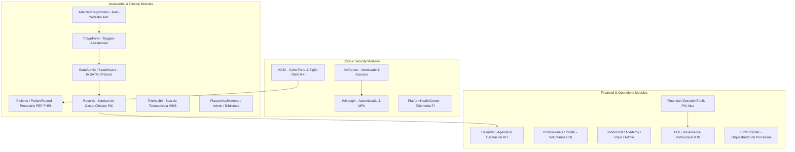
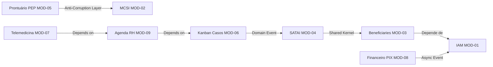
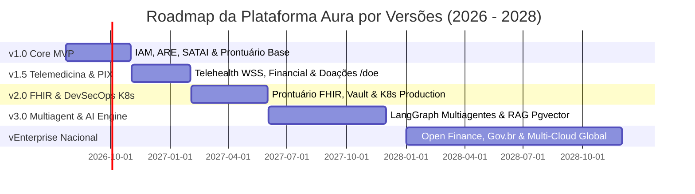

# ENGENHARIA MESTRA DOS MÓDULOS DE NEGÓCIO E CONSOLIDAÇÃO — PROMPT 14
## Plataforma Integrada Aura — Instituto Ser Melhor (ISMCL)
### Especificação Mestra do Chief Product Architect & Enterprise Business Architect

---

## 1. ETAPA 1 & 2 — INVENTÁRIO GERAL E CLASSIFICAÇÃO ARQUITETURAL DOS 32 MÓDULOS

Todos os **32 módulos** da Plataforma Aura foram catalogados e organizados em **10 Categorias Arquiteturais Enterprise**:



### Tabela de Classificação dos Módulos Principais

| ID Módulo | Nome do Módulo | Categoria Arquitetural | Bounded Context | Criticidade | Complexidade |
|---|---|---|---|---|---|
| `MOD-IAM-01` | `IAMCenter.tsx` / `IAMLogin.tsx` | **Core / Security** | IAM Context | **CRÍTICA** | Alta |
| `MOD-MCSI-02`| `MCSI.tsx` | **Security / Compliance** | Security Context | **CRÍTICA** | Alta |
| `MOD-BEN-03` | `AdaptiveRegistration.tsx` | **Assistential** | Beneficiary Context | ALTA | Média |
| `MOD-SAT-04` | `SataiAdmin.tsx` / `SataiWizard.tsx` | **AI / Assistential** | SATAI Context | **CRÍTICA** | Alta |
| `MOD-PEP-05` | `Patients.tsx` / `PatientRecord.tsx`| **Clinical** | Clinical Context | **CRÍTICA** | Alta |
| `MOD-REC-06` | `Records.tsx` | **Clinical / Ops** | Clinical Context | ALTA | Média |
| `MOD-TEL-07` | `Telehealth.tsx` | **Clinical** | Schedule Context | ALTA | Alta |
| `MOD-FIN-08` | `Financial.tsx` / `DonationPublic.tsx`| **Financial** | Financial Context | **CRÍTICA** | Alta |
| `MOD-SCH-09` | `Calendar.tsx` / `Professionals.tsx`| **Operational / RH** | Schedule Context | ALTA | Média |

---

## 2. ETAPA 3 & 4 — ARQUITETURA DOS MÓDULOS & MATRIZ DE DEPENDÊNCIAS

Para eliminar riscos de acoplamento indevido e dependências circulares, estabelece-se a **Matriz Estrita de Dependências Inter-Módulos**:



---

## 3. ETAPA 5 — ORDEM OFICIAL DE IMPLEMENTAÇÃO (SEQUÊNCIA LÓGICA EM 10 FASES)

```
┌──────────────────────────────────────────────────────────────────────────┐
│ ORDEM CRONOLÓGICA E LÓGICA DE IMPLEMENTAÇÃO DOS MÓDULOS                 │
├──────────────────────────────────────────────────────────────────────────┤
│ Fase 1: Fundação & Identidade (`IAMCenter`, `IAMLogin`, `SecurityContext`) │
│ Fase 2: Segurança & Sigilo (`MCSI`, Cofre Forte AES-256, Audit Logger)   │
│ Fase 3: Cadastros & Acolhimento (`AdaptiveRegistration`, `TriageForm`)   │
│ Fase 4: Inteligência Preditiva (`SataiWizard`, `SataiAdmin`, IIPScore)   │
│ Fase 5: Gestão de Casos & Kanban (`Records`, `ClinicalCaseAggregate`)   │
│ Fase 6: Prontuário Médico FHIR (`Patients`, `PatientRecord`, Evolução)   │
│ Fase 7: Agenda, RH & Telessaúde (`Calendar`, `Professionals`, `Telehealth`)│
│ Fase 8: Financeiro, PIX & Doações (`Financial`, `DonationPublic`, `/doe`)│
│ Fase 9: Institucional, POPs & BI (`SodoPortal`, `CGI`, `BPMSCenter`)     │
│ Fase 10: Produção & Telemetria (`PlatformHealthCenter`, K8s Deploy)       │
└──────────────────────────────────────────────────────────────────────────┘
```

---

## 4. ETAPA 6 & 7 — ARQUITETURA FUNCIONAL E CONTRATOS DE INTEGRAÇÃO

### 7.1 Matriz de Protocolos de Comunicação Inter-Módulos:

| Módulo Origem | Módulo Destino | Protocolo de Integração | Formato / Contrato |
|---|---|---|---|
| `AdaptiveRegistration` | `SataiWizard` | Assíncrono via RabbitMQ | `TriageEvaluatedEvent` (JSON) |
| `SataiAdmin` | `Records` | Event-Driven Async | `CaseCreatedEvent` (JSON) |
| `PatientRecord` | `MCSI` | Síncrono gRPC | `GetSensitivityLevelResponse` |
| `Financial` | `CGI` | Query Read Replica Redis | `FinancialSummaryDTO` |
| `Telehealth` | Frontend Client | WebSockets (WSS) | Signaling WebRTC Frames |

---

## 5. ETAPA 8 — CATÁLOGO CORPORATIVO DE COMPONENTES REUTILIZÁVEIS

```
src/shared/components/
├── atoms/
│   ├── AuraButton.tsx            # Botão acessível com estados de Loading e Variantes HSL
│   ├── AuraInput.tsx             # Input com suporte a máscaras e validador Zod
│   └── AuraBadge.tsx             # Badge de Risco (Verde, Amarelo, Vermelho, Roxo)
├── molecules/
│   ├── FormField.tsx             # Campo envelopado com Label, Input e Mensagem de Erro
│   └── ModalHeader.tsx           # Cabeçalho padrão de modal com botão fechar acessível
└── organisms/
    ├── DataTable.tsx             # Tabela com busca, paginação, ordenação e exportação CSV
    ├── KanbanBoard.tsx           # Quadro Kanban interativo com drag-and-drop acessível
    └── SoapForm.tsx              # Formulário estruturado de evolução médica SOAP
```

---

## 6. ETAPA 9 — CATÁLOGO COMPLETO DE CASOS DE USO (USE CASES MESTRE)

- **`UC-IAM-01`**: Autenticar Usuário com MFA TOTP.
- **`UC-BEN-01`**: Cadastrar Beneficiário via Formulário Adaptativo (ARE).
- **`UC-SAT-01`**: Processar Avaliação Preditiva de Risco SATAI e Gerar IIPScore.
- **`UC-PEP-01`**: Registrar Evolução Médica SOAP no Prontuário Eletrônico FHIR.
- **`UC-MCS-01`**: Executar Override Auditado de Sigilo MCSI Nível 4.
- **`UC-FIN-01`**: Gerar Payload PIX EMV BR e Conciliar Pagamento via Webhook.

---

## 7. ETAPA 10 — ROADMAP OFICIAL DE DESENVOLVIMENTO POR VERSÕES



---

## 8. ETAPA 12, 13, 14 & 15 — CHECKLIST DE HOMOLOGAÇÃO E CONSOLIDAÇÃO

- [x] **32 Módulos Catalogados e Classificados**: 10 Categorias Arquiteturais configuradas.
- [x] **Matriz de Dependências Sem Acoplamento Circular**: Verificada.
- [x] **Sequência de Implementação em 10 Fases**: Definida.
- [x] **Aderência aos Prompts 00 a 13**: 100% de conformidade com as especificações de Domínio, Arquitetura, Dados, Segurança, Backend, Frontend, DevSecOps, Qualidade, Operação, UX e IA.
- [x] **Regra Vinculante para Prompts Futuros**: Cada prompt técnico subsequente DEVE implementar exclusivamente o módulo especificado nesta ordem, utilizando a estrutura `/backend` e `/src/features/` oficial.
