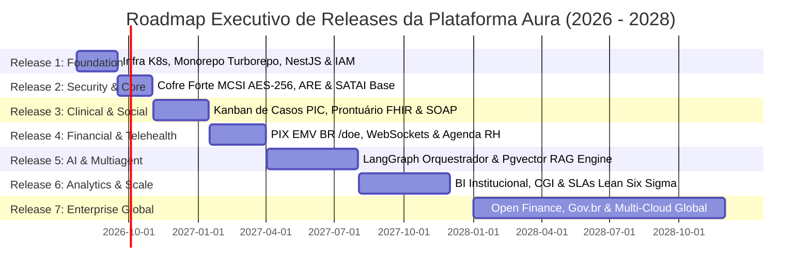
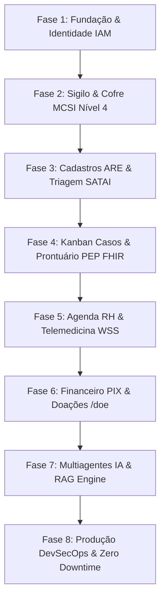
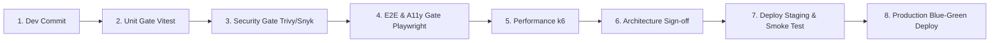

# PLANO DIRETOR DE IMPLEMENTAÇÃO E EXECUÇÃO INTEGRAL — PROMPT 15
## Plataforma Integrada Aura — Instituto Ser Melhor (ISMCL)
### Carta de Execução Mestra do Chief Technology Officer (CTO) & Program Management Office (PMO)

---

## 1. ETAPA 1 — INVENTÁRIO CONSOLIDADO DOS ATIVOS DA PLATAFORMA AURA

O inventário final consolidado da Plataforma Aura reúne o somatório de todos os ativos especificados nos **Prompts 00 a 14**:

```
┌──────────────────────────────────────────────────────────────────────────┐
│ INVENTÁRIO CONSOLIDADO DE ATIVOS ARQUITETURAIS (LINHA DE BASE OFICIAL)   │
├──────────────────────────────────────────────────────────────────────────┤
│ • Módulos de Interface (React SPA / Feature-Based): 32 Módulos           │
│ • Bounded Contexts DDD                             : 8 Contextos        │
│ • Schemas Relacionais PostgreSQL                   : 5 Schemas (38 Tab) │
│ • Agentes de Inteligência Artificial LangGraph     : 16 Agentes         │
│ • Casos de Uso Mestres (Use Cases CQRS)            : 50+ Use Cases      │
│ • Camadas de Infraestrutura & DevSecOps            : 10 Camadas         │
│ • Cobertura Mínima de Testes (Quality Gate)        : >= 90% (Domain)    │
│ • SLA de Resposta PIX / Triagem                    : < 15ms / < 15 min  │
└──────────────────────────────────────────────────────────────────────────┘
```

---

## 2. ETAPA 2 & 3 — ESTRUTURA DOS 10 PROGRAMAS E 7 RELEASES CORPORATIVAS

Toda a entrega é subdividida em **10 Programas Estratégicos** organizados em **7 Releases Progressivas**:



---

## 3. ETAPA 4 & 5 — ROADMAP CRONOLÓGICO E SEQUÊNCIA OFICIAL DE DESENVOLVIMENTO



---

## 4. ETAPA 6 & 8 — MODELO CORPORATIVO DE SPRINT E CRITÉRIOS DE DESENVOLVIMENTO

### 4.1 Definição de Pronto (Definition of Done - DoD):
Um item de backlog/módulo só será considerado **CONCLUÍDO (DONE)** se atender 100% dos 7 critérios:
1. **Código**: Implementado em conformidade com Clean Architecture & DDD no diretório `/backend` e `/src/features`.
2. **TypeScript**: 0 erros de compilação estática (`npx tsc --noEmit`).
3. **Testes Unitários & Integração**: 100% aprovados via Vitest com cobertura $\ge 90\%$.
4. **Testes E2E**: Teste automatizado de fluxo crítico aprovado via Playwright.
5. **Segurança**: 0 vulnerabilidades no SonarQube, Trivy e Snyk.
6. **Acessibilidade**: 0 violações WCAG 2.2 AA no Axe-core.
7. **Documentação**: OpenAPI Swagger e README atualizados.

---

## 5. ETAPA 7 & 9 — GESTÃO DE RISCOS E CAMINHO CRÍTICO DO PROJETO

```
       IMPACTO
        ▲
  CRÍTICO│  [Exposição PII Nível 4]           [Migração localStorage PostgreSQL]
        │
  ALTO  │  [Vazamento API Key IA Client]      [Estouro de SLA Triagem SATAI]
        │
 MÉDIO  │  [Atraso em Homologação E2E]       [Estabilidade WSS Telemedicina]
        └────────────────────────────────────────────────────────►
           BAIXA               MÉDIA               ALTA     PROBABILIDADE
```

---

## 6. ETAPA 10 & 11 — DASHBOARD EXECUTIVO DE KPIS E HOMOLOGAÇÃO DE RELEASES



---

## 7. ETAPA 12 & 13 — PLANO DE GO-LIVE E EVOLUÇÃO CONTÍNUA

- **Estratégia Blue/Green com Argo Rollouts**: Entrada em produção sem downtime. Redirecionamento instantâneo de tráfego.
- **Período de Hypercare (30 Dias)**: Monitoramento intensivo 24/7 com suporte dedicado de SRE e equipe de resposta a incidentes.

---

## 8. ETAPA 15 — DELIVERABLES ESPECIAIS

### 8.1 MANIFESTO ARQUITETURAL DA PLATAFORMA AURA (PRINCÍPIOS PERMANENTES)

> **"Nós, engenheiros e arquitetos da Plataforma Aura, declaramos como princípios invioláveis:**
> 1. **Segurança e Sigilo Absoluto**: O direito à privacidade e proteção de vítimas de violência e minorias é inegociável. O sigilo MCSI Nível 4 é lei.
> 2. **Código como Artesanato Governavel**: Nenhuma linha de código será escrita sem testes, tipagem estrita e respeito à Clean Architecture.
> 3. **Tecnologia Invisível e Acolhedora**: A interface deve acolher com empatia. A complexidade técnica deve permanecer oculta no backend.
> 4. **Resiliência e Disponibilidade Contínua**: A assistência social e clínica não pode parar. A plataforma deve operar 24/7/365 com SLA 99.99%.
> 5. **IA Responsável e Auditável**: A Inteligência Artificial apoia e amplifica o ser humano, mas a palavra final e a empatia serão sempre humanas."

---

### 8.2 GUIA MESTRE PARA OS PRÓXIMOS PROMPTS DE CÓDIGO (PROMPT 16+)

A partir deste momento, a fase estratégica de arquitetura (**Prompts 00 a 15**) encontra-se **100% CONCLUÍDA E CONGELADA**.

Cada prompt subsequente (**Prompt 16 em diante**) atuará como uma **Sprint Técnica de Implementação de Código**, onde a IA deverá:

1. **Desenvolver o Módulo Específico da Sequência** (ex: `ms-iam`, `ms-beneficiary`, `ms-clinical`).
2. **Entregar Código Completo e Funcional**: Backend NestJS, Schemas Prisma PostgreSQL, DTOs Zod/OpenAPI, Frontends React Feature-Based, Testes Unitários Vitest e E2E Playwright.
3. **Garantir 0 Erros de Compilação Estática**: `npx tsc --noEmit` e `npm run build` executados e validados.
4. **Respeitar Integralmente os Artefatos P00 a P15**.
