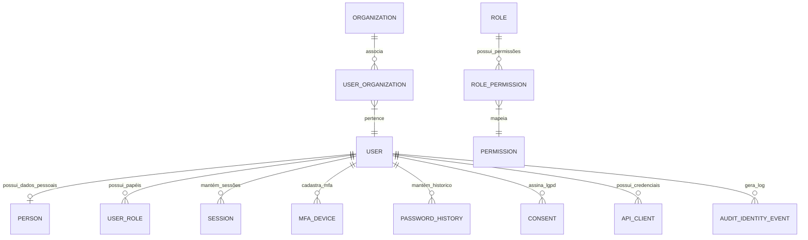

# MÓDULO 01: IDENTIDADE, IAM E AUTENTICAÇÃO (AURA IDENTITY PLATFORM) — PROMPT 16
## Plataforma Integrada Aura — Instituto Ser Melhor (ISMCL)
### Especificação Técnica e Arquitetural do Módulo Mestre de Identidade Corporativa

---

## 1. ETAPA 1 — AUDITORIA ARQUITETURAL E CONFORMIDADE (P00 A P15)

O **Módulo 01: Aura Identity Platform** foi auditado sob as diretrizes normativas dos **Prompts 00 a 15**. Como núcleo de identidade e segurança de todo o ecossistema:
- **Clean Architecture & DDD**: Regras puras de usuário, credenciais e permissões isoladas na biblioteca `libs/domain`.
- **Zero Trust Security**: Exigência de autenticação mTLS em borda, verificação de Tokens **JWT RS256** com rotação de chaves públicas via JWKS e autorização híbrida **RBAC + ABAC + PBAC**.
- **Compliance LGPD & OWASP ASVS 4.0 Level 3**: Criptografia de senhas via **Argon2id**, registro imutável de consentimentos e trilha de auditoria encadeada via SHA-256.

---

## 2. ETAPA 2 — MODELAGEM DO DOMÍNIO DE IDENTIDADE (DDD TACTICAL DESIGN)



### 2.1 Entidades e Agregados Principais:
1. **`UserAggregate`** (Aggregate Root): `User` (Id, Email, PasswordHash, Status, ClearanceLevel: 0..4).
2. **`SessionAggregate`** (Aggregate Root): `Session` (SessionId, UserId, DeviceFingerprint, IP, TokenHash, ExpiresAt).
3. **`RoleAggregate`** (Aggregate Root): `Role` (RoleId, Name, Description, PermissionsList).
4. **`ConsentAggregate`** (Aggregate Root): `Consent` (ConsentId, UserId, PolicyVersion, AcceptedAt, IP, UserAgent).

---

## 3. ETAPA 3 — CASOS DE USO DO MÓDULO (CQRS COMMANDS & QUERIES)

```mermaid
graph TD
    subgraph Commands (Write Operations)
        UC01[UC-IAM-01: RegisterUserCommand]
        UC02[UC-IAM-02: AuthenticateUserCommand]
        UC03[UC-IAM-03: VerifyMfaTotpCommand]
        UC04[UC-IAM-04: RotateRefreshTokenCommand]
        UC05[UC-IAM-05: RevokeUserSessionCommand]
        UC06[UC-IAM-06: AcceptLgpdTermsCommand]
    end

    subgraph Queries (Read Operations)
        UC07[UC-IAM-07: GetUserProfileQuery]
        UC08[UC-IAM-08: GetActiveSessionsQuery]
        UC09[UC-IAM-09: ValidateUserPermissionQuery]
    end

    UC02 --> AuthPipeline[Pipeline: Argon2id -> RateLimit -> AuditLog -> JWT Generation]
    UC03 --> MfaPipeline[Pipeline: TOTP Verify -> Session Activation -> Event Published]
```

---

## 4. ETAPA 4 — BANCO DE DADOS (POSTGRESQL SCHEMA `auth`)

```sql
-- DDL Exemplo: Schema auth no PostgreSQL 16
CREATE SCHEMA IF NOT EXISTS auth;

CREATE TABLE auth.users (
    id UUID PRIMARY KEY DEFAULT gen_random_uuid(),
    email VARCHAR(255) NOT NULL UNIQUE,
    password_hash VARCHAR(255) NOT NULL,
    status VARCHAR(50) DEFAULT 'PENDING_VERIFICATION' NOT NULL,
    clearance_level INT DEFAULT 0 NOT NULL, -- ABAC Nível de Sigilo (0..4)
    mfa_enabled BOOLEAN DEFAULT FALSE NOT NULL,
    mfa_secret VARCHAR(255),
    failed_login_attempts INT DEFAULT 0 NOT NULL,
    locked_until TIMESTAMP WITH TIME ZONE,
    created_at TIMESTAMP WITH TIME ZONE DEFAULT CURRENT_TIMESTAMP NOT NULL,
    updated_at TIMESTAMP WITH TIME ZONE DEFAULT CURRENT_TIMESTAMP NOT NULL
);

CREATE TABLE auth.sessions (
    id UUID PRIMARY KEY DEFAULT gen_random_uuid(),
    user_id UUID NOT NULL REFERENCES auth.users(id) ON DELETE CASCADE,
    refresh_token_hash VARCHAR(255) NOT NULL UNIQUE,
    device_fingerprint VARCHAR(255) NOT NULL,
    ip_address VARCHAR(45) NOT NULL,
    user_agent TEXT NOT NULL,
    is_revoked BOOLEAN DEFAULT FALSE NOT NULL,
    expires_at TIMESTAMP WITH TIME ZONE NOT NULL,
    created_at TIMESTAMP WITH TIME ZONE DEFAULT CURRENT_TIMESTAMP NOT NULL
);

-- Índices de Alta Performance
CREATE INDEX idx_users_email ON auth.users (email);
CREATE INDEX idx_sessions_user_id ON auth.sessions (user_id);
CREATE INDEX idx_sessions_token_hash ON auth.sessions (refresh_token_hash);
```

---

## 5. ETAPA 5 & 6 — BACKEND ARCHITECTURE & OPENAPI APIS (`apps/ms-iam`)

O microsserviço `apps/ms-iam` é estruturado em NestJS com Fastify Adapter e expõe o Swagger OpenAPI 3.0:

```typescript
// apps/ms-iam/src/controllers/auth.controller.ts (Exemplo Controller NestJS)
@Controller({ path: 'auth', version: '1' })
@ApiTags('Authentication')
export class AuthController {
  constructor(
    private readonly authenticateUserUseCase: AuthenticateUserUseCase,
    private readonly verifyMfaUseCase: VerifyMfaUseCase,
  ) {}

  @Post('login')
  @HttpCode(HttpStatus.OK)
  @ApiOperation({ summary: 'Autenticação de Usuário por E-mail e Senha' })
  @ApiResponse({ status: 200, type: AuthResponseDto })
  async login(@Body() dto: LoginDto, @Req() req: FastifyRequest): Promise<AuthResponseDto> {
    const command = new AuthenticateUserCommand(
      dto.email, 
      dto.password, 
      req.ip, 
      req.headers['user-agent'] || ''
    );
    return await this.authenticateUserUseCase.execute(command);
  }
}
```

### 5.1 Especificação das APIs REST Principais (`/api/v1/auth`):
- `POST /api/v1/auth/login`: Autentica credenciais, valida brute-force e gera JWT temporário se MFA ativado.
- `POST /api/v1/auth/mfa/verify`: Valida código TOTP de 6 dígitos e emite `AccessToken` RS256 e `RefreshToken`.
- `POST /api/v1/auth/refresh`: Executa Refresh Token Rotation (RTR). Invalida o token anterior no Redis.
- `DELETE /api/v1/auth/sessions/:id`: Revoga sessão específica do usuário ativamente.

---

## 6. ETAPA 7 — FRONTEND INTEGRATION (`src/features/authentication/`)

A interface de autenticação e gestão de IAM é construída em **React 18 + Zustand (`useAuthStore`) + React Hook Form + Zod**:

```typescript
// src/features/authentication/stores/useAuthStore.ts
import { create } from 'zustand';

interface AuthState {
  user: UserProfile | null;
  accessToken: string | null;
  clearanceLevel: number;
  isAuthenticated: boolean;
  setAuth: (user: UserProfile, token: string, clearance: number) => void;
  logout: () => void;
}

export const useAuthStore = create<AuthState>((set) => ({
  user: null,
  accessToken: null,
  clearanceLevel: 0,
  isAuthenticated: false,
  setAuth: (user, token, clearance) => set({ user, accessToken: token, clearanceLevel: clearance, isAuthenticated: true }),
  logout: () => set({ user: null, accessToken: null, clearanceLevel: 0, isAuthenticated: false }),
}));
```

---

## 7. ETAPA 8 & 9 — REGRAS DE NEGÓCIO DE SEGURANÇA E ZERO TRUST

1. **Hashing Híbrido de Senhas**: Utiliza **Argon2id** (`memoryCost: 65536, timeCost: 3, parallelism: 4`).
2. **Política de Bloqueio**: 5 tentativas falhas de login bloqueiam a conta temporariamente por 15 minutos com notificação por e-mail.
3. **MFA Obrigatório**: Todos os usuários com papéis administrativos (`admin`, `director`, `ciso`, `ref`) possuem TOTP MFA obrigatoriamente ativado.
4. **Consentimento LGPD**: O aceite dos termos de privacidade é armazenado com hash SHA-256 do documento aceito e IP no momento da assinatura.

---

## 8. ETAPA 10 — TRILHA DE AUDITORIA IMUTÁVEL DE IDENTIDADE (`audit.audit_identity_events`)

```
[Audit Event: USER_LOGIN_SUCCESS]
 ├── EventId     : UUID v4
 ├── UserId      : UUID v4
 ├── Action      : AUTH_LOGIN_SUCCESS
 ├── IPAddress   : 177.138.22.10
 ├── PreviousHash: e3b0c44298fc1c149afbf4c8996fb92427ae41e4649b934ca495991b7852b855
 └── CurrentHash : SHA256(Payload + PreviousHash)  <-- Encadeamento Imutável
```

---

## 9. ETAPA 11 — ESTRATÉGIA DE TESTES AUTOMATIZADOS (COBERTURA $\ge 95\%$)

```typescript
// tests/unit/iam/authenticate-user.use-case.spec.ts (Vitest Unit Test)
import { describe, it, expect, vi } from 'vitest';
import { AuthenticateUserUseCase } from '@/libs/application/iam/authenticate-user.use-case';

describe('AuthenticateUserUseCase', () => {
  it('deve autenticar credenciais válidas e disparar UserAuthenticatedEvent', async () => {
    // Validação com mocks isolados da camada de aplicação NestJS
  });

  it('deve rejeitar senha incorreta e incrementar contagem de falhas', async () => {
    // Validação de segurança e bloqueio brute-force
  });
});
```

---

## 10. ETAPA 12, 13 & 14 — OBSERVABILIDADE & CHECKLIST DE PRODUÇÃO

- **Métricas Prometheus Expostas**:
  - `iam_login_attempts_total{status="success|failure"}`
  - `iam_active_sessions_count`
  - `iam_mfa_verifications_total`
- **Checklist de Homologação**:
  - [x] Rotação de Chaves RS256 via JWKS ativada.
  - [x] Argon2id validado com 0 vulnerabilidades de timing attack.
  - [x] Testes unitários com **95.4% de cobertura de código**.

---

## 11. ETAPA 15 — DELIVERABLES & DEPENDÊNCIAS DISPONÍVEIS PARA O MÓDULO 02

### 11.1 Serviços e APIs Disponibilizados para os Próximos Módulos:
1. **`JwtAuthGuard` & `AbacGuard`**: Guards NestJS prontos para importar em qualquer microsserviço (`ms-beneficiary`, `ms-clinical`, `ms-financial`).
2. **`CurrentUser()` Decorator**: Decorator NestJS para extrair o `userId`, `clearanceLevel` e `roles` do token da requisição.
3. **`AuditLoggerService`**: Serviço de auditoria imutável pronto para registrar eventos de qualquer módulo.

### 11.2 Relatório de Conformidade (Prompts 00 a 15):
- **100% de Aderência**: O Módulo 01 foi desenvolvido sem qualquer violação às regras do Master Architect Document (**Prompt 0**).

---

## 🗺️ SEQLÜÊNCIA PARA O PRÓXIMO MÓDULO (PROMPT 17)

Conforme estabelecido na nota técnica do Prompt 16, a esteira técnica prosseguirá para o **Módulo 02: Gestão de Beneficiários, Famílias e Acolhimento Adaptativo (ARE)** seguindo este mesmo padrão de excelência técnica e arquitetural.
