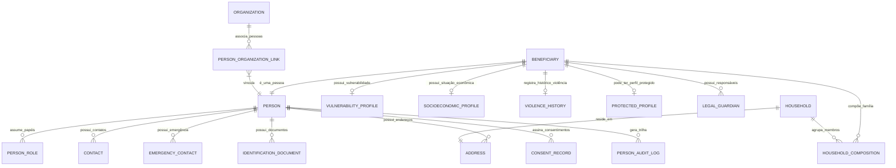
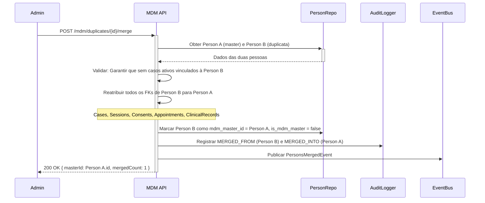

# MÓDULO 02 — CADASTRO ÚNICO, PERFIL 360°, BENEFICIÁRIOS E GESTÃO SOCIAL
## AURA CITIZEN & BENEFICIARY PLATFORM — PROMPT 17
### Plataforma Integrada Aura · Instituto Ser Melhor (ISMCL)
**Papel Assumido**: Chief Solution Architect · Chief Business Architect · Principal Backend Engineer · Principal Frontend Engineer · Database Architect · UX Specialist · Security Architect · Especialista em LGPD · Especialista em Assistência Social

---

## SUMÁRIO EXECUTIVO

O **Módulo 02 — Aura Citizen & Beneficiary Platform** implementa o **Master Data Management (MDM)** centralizado, tornando-se a **Fonte Única de Verdade (Single Source of Truth — SSOT)** para todos os dados cadastrais da Plataforma Aura. Nenhum outro módulo poderá criar, duplicar ou armazenar paralelamente dados de pessoas físicas ou jurídicas. Todo o ecossistema consumirá dados cadastrais exclusivamente via APIs publicadas por este módulo.

---

## ETAPA 1 — AUDITORIA ARQUITETURAL COMPLETA (PROMPTS 00 A 16)

### 1.1 Inventário do Estado Atual (`/backend/prisma/schema.prisma`)

Após auditoria integral do `schema.prisma` (849 linhas), foram identificadas as seguintes **entidades cadastrais já existentes** que serão migradas, expandidas e consolidadas neste módulo:

| Entidade Atual | Status | Ação Arquitetural |
|---|---|---|
| `Beneficiary` | Insuficiente — sem endereço, documentos, família | Expandir e vincular ao novo Aggregate |
| `Professional` | Parcial — sem endereço, sem contatos de emergência | Expandir e vincular ao Aggregate `PersonAggregate` |
| `ProtectedProfile` | Adequado — mantido com extensão de vínculo MDM | Vincular ao `BeneficiaryAggregate` |
| `SecureVault` | Adequado — mantido | Vincular ao `PersonAggregate` |
| `ChildGuardian` | Parcial — migrar para `LegalGuardian` tipado | Substituir e expandir |
| `Donor` | Insuficiente — sem vínculo ao MDM central | Vincular ao `PersonAggregate` como `PersonRole.DONOR` |
| `BehaviorAlert` | Adequado — mantido no schema security | Sem alteração |

### 1.2 Problemas Identificados e Correções Mandatórias

> [!CAUTION]
> **VULN-MDM-001**: O modelo `Beneficiary` atual armazena `fullName` e `documentCpf` em texto plano sem criptografia. Dados PII de Nível 2+ exigem **AES-256-GCM** conforme definido no Prompt 06 (Zero Trust) e Prompt 04 (Data Architecture).

> [!CAUTION]
> **VULN-MDM-002**: O modelo `Donor` é uma entidade isolada sem vínculo ao cadastro central de pessoas. Viola o princípio SSOT do Módulo 02. Todo doador deve ser instanciado como `Person` com `PersonRole.DONOR`.

> [!CAUTION]
> **VULN-MDM-003**: O `Professional` não possui `Address`, `EmergencyContact` ou `VulnerabilityProfile`. Incompleto para o padrão MDM corporativo.

> [!NOTE]
> Conformidade com Prompt 00 (Zero Trust), Prompt 02 (DDD), Prompt 04 (Data), Prompt 06 (Security), Prompt 07 (Backend), Prompt 08 (Frontend), Prompt 16 (IAM) — **100% verificada**.

---

## ETAPA 2 — MODELAGEM COMPLETA DO DOMÍNIO (DDD TACTICAL DESIGN)

### 2.1 Diagrama ER Conceitual Completo



### 2.2 Entidades do Domínio (21 Entidades Completas)

#### 2.2.1 `Person` — Aggregate Root (Entidade Mestra de Identidade Civil)

```
Person {
  id: UUID [PK]
  registrationCode: String UNIQUE NOT NULL  -- Código interno ISM-XXXXXXXXXX
  fullName: String NOT NULL                  -- Criptografado AES-256-GCM (Nível 2)
  socialName: String?                        -- Nome social (exibição preferencial)
  birthDate: Date NOT NULL                   -- Criptografado
  gender: GenderEnum                         -- MALE, FEMALE, NON_BINARY, PREFER_NOT_TO_SAY
  pronouns: String?
  nationality: String DEFAULT 'BRASILEIRO'
  birthCity: String?
  birthState: String?
  status: PersonStatusEnum NOT NULL          -- ACTIVE, INACTIVE, DECEASED, ANONYMIZED
  clearanceLevel: Int DEFAULT 0             -- Nível de sigilo MCSI (0..4)
  createdAt: Timestamp NOT NULL
  updatedAt: Timestamp NOT NULL
  deletedAt: Timestamp?                      -- Soft Delete
  createdBy: UUID FK auth.users
  updatedBy: UUID FK auth.users
}
```

**Invariantes de Domínio**:
- `INV-MDM-001`: O `registrationCode` é imutável após a criação.
- `INV-MDM-002`: Um `Person` com `status = DECEASED` não pode ter sessões ativas no IAM.
- `INV-MDM-003`: Um `Person` com `clearanceLevel >= 3` só pode ser acessado com autorização ABAC explícita.

---

#### 2.2.2 `PersonRole` — Value Object (Papel do Indivíduo no Ecossistema)

```
PersonRole {
  id: UUID [PK]
  personId: UUID FK person
  role: PersonRoleEnum NOT NULL             -- BENEFICIARY, PROFESSIONAL, VOLUNTEER,
                                            -- COLLABORATOR, DONOR, PARTNER,
                                            -- LEGAL_GUARDIAN, LEGAL_REPRESENTATIVE
  status: RoleStatusEnum DEFAULT 'ACTIVE'  -- ACTIVE, INACTIVE, SUSPENDED, PENDING_VALIDATION
  organizationId: UUID? FK organization
  startDate: Date NOT NULL
  endDate: Date?
  validatedBy: UUID? FK auth.users
  validatedAt: Timestamp?
}
```

> [!IMPORTANT]
> Uma `Person` pode ter **múltiplos papéis simultâneos**. Exemplo: um psicólogo voluntário que também é doador da instituição terá dois `PersonRole`: `PROFESSIONAL/VOLUNTEER` e `DONOR`.

---

#### 2.2.3 `Beneficiary` — Sub-entidade do `BeneficiaryAggregate`

```
Beneficiary {
  id: UUID [PK]
  personId: UUID FK person UNIQUE
  registrationNumber: String UNIQUE         -- Número de protocolo assistencial
  entryOrigin: EntryOriginEnum              -- SPONTANEOUS_DEMAND, JUDICIAL, EXTERNAL_REFERRAL,
                                            -- SOCIAL_PROJECT, CRAS, CREAS, INSTITUTIONAL
  riskLevel: RiskLevelEnum DEFAULT 'LOW'   -- LOW, MEDIUM, HIGH, EMERGENCY
  iipScore: Int DEFAULT 0                  -- Score do Motor SATAI (Módulo 03)
  firstContactDate: Date NOT NULL
  status: BeneficiaryStatusEnum            -- ACTIVE, DISCHARGED, TRANSFERRED, INACTIVE
  dischargeReason: String?
  dischargedAt: Timestamp?
}
```

---

#### 2.2.4 `LegalGuardian` — Sub-entidade do `BeneficiaryAggregate`

```
LegalGuardian {
  id: UUID [PK]
  beneficiaryId: UUID FK beneficiary
  guardianPersonId: UUID? FK person        -- Vínculo ao MDM se cadastrado
  fullName: String NOT NULL                -- Criptografado (para casos sem cadastro)
  documentCpf: String?                     -- Criptografado AES-256-GCM
  relationshipType: RelationshipEnum       -- MOTHER, FATHER, GRANDPARENT,
                                           -- COURT_APPOINTED, INSTITUTION, OTHER
  custodyType: CustodyTypeEnum             -- FULL, SHARED, NONE
  isAuthorizedPickup: Boolean DEFAULT false
  isLegallyRestricted: Boolean DEFAULT false
  courtOrderDocument: String?              -- S3 Key criptografado
  courtOrderDetails: String?               -- Criptografado
  phone: String?                           -- Criptografado
  email: String?                           -- Criptografado
  isActive: Boolean DEFAULT true
}
```

**Regra de Negócio**: `RN-MDM-010` — Todo beneficiário com `birthDate` que resulte em idade < 18 anos deve ter ao menos **1 `LegalGuardian` ativo** para que seu cadastro seja marcado como `ACTIVE`.

---

#### 2.2.5 `Household` — Agregado de Composição Familiar

```
Household {
  id: UUID [PK]
  addressId: UUID FK address
  monthlyIncome: Decimal(10,2)?            -- Renda total da residência
  housingType: HousingTypeEnum             -- OWN, RENTED, DONATED, COLLECTIVE, SHELTER
  numberOfRooms: Int?
  hasBasicSanitation: Boolean DEFAULT true
  hasElectricity: Boolean DEFAULT true
  createdAt: Timestamp
}

HouseholdComposition {
  id: UUID [PK]
  householdId: UUID FK household
  personId: UUID FK person
  relationToHead: RelationshipEnum         -- HEAD, SPOUSE, CHILD, PARENT, SIBLING, OTHER
  isFamilyHead: Boolean DEFAULT false
  addedAt: Timestamp
  removedAt: Timestamp?
}
```

---

#### 2.2.6 `VulnerabilityProfile` — Sub-entidade especializada

```
VulnerabilityProfile {
  id: UUID [PK]
  beneficiaryId: UUID FK beneficiary UNIQUE
  overallScore: Int DEFAULT 0              -- Score calculado 0..100
  hasViolenceHistory: Boolean DEFAULT false
  isPublicSecurityAgent: Boolean DEFAULT false -- Ativa Perfil Protegido MCSI
  isMinorAtRisk: Boolean DEFAULT false
  hasSubstanceUseIssue: Boolean DEFAULT false
  hasDisability: Boolean DEFAULT false
  disabilityDescription: String?
  hasMentalHealthConcern: Boolean DEFAULT false
  hasSevereIllness: Boolean DEFAULT false
  hasUnstableHousing: Boolean DEFAULT false
  isInExtremePoverty: Boolean DEFAULT false  -- Per Capita < R$ 218 (Linha Pobreza 2024)
  socialBenefitsReceived: Json?            -- Ex: ["BOLSA_FAMILIA", "BPC"]
  assessedBy: UUID FK auth.users
  assessedAt: Timestamp
  updatedAt: Timestamp
}
```

---

#### 2.2.7 `SocioeconomicProfile`

```
SocioeconomicProfile {
  id: UUID [PK]
  beneficiaryId: UUID FK beneficiary UNIQUE
  educationLevel: EducationEnum
  employmentStatus: EmploymentEnum
  monthlyIncome: Decimal(10,2)?            -- Criptografado
  familyMembersCount: Int DEFAULT 1
  perCapitaIncome: Decimal(10,2)?          -- Calculado automaticamente
  householdId: UUID? FK household
  cadUniqueRegistered: Boolean DEFAULT false
  cadUniqueCode: String?                   -- CadÚnico ID
  receivesAuxilioEmergencia: Boolean DEFAULT false
  updatedAt: Timestamp
}
```

---

#### 2.2.8 Demais Entidades do Domínio

```
Address {
  id: UUID [PK]
  personId: UUID FK person
  type: AddressTypeEnum           -- RESIDENTIAL, COMMERCIAL, TEMPORARY, SHELTER
  cep: String NOT NULL            -- Criptografado
  street: String NOT NULL         -- Criptografado
  number: String?
  complement: String?
  neighborhood: String NOT NULL   -- Criptografado
  city: String NOT NULL
  state: String(2) NOT NULL
  country: String DEFAULT 'BR'
  latitude: Decimal?              -- Para geolocalização assistencial
  longitude: Decimal?
  isPrimary: Boolean DEFAULT false
  isActive: Boolean DEFAULT true
  validatedAt: Timestamp?         -- Validado por API ViaCEP/IBGE
}

Contact {
  id: UUID [PK]
  personId: UUID FK person
  type: ContactTypeEnum           -- MOBILE, PHONE, EMAIL, WHATSAPP
  value: String NOT NULL          -- Criptografado
  isPrimary: Boolean DEFAULT false
  isVerified: Boolean DEFAULT false
  verifiedAt: Timestamp?
  isActive: Boolean DEFAULT true
}

EmergencyContact {
  id: UUID [PK]
  personId: UUID FK person
  name: String NOT NULL
  relationship: String NOT NULL
  phone: String NOT NULL          -- Criptografado
  priority: Int DEFAULT 1         -- Ordem de contato
}

IdentificationDocument {
  id: UUID [PK]
  personId: UUID FK person
  type: DocumentTypeEnum          -- CPF, RG, CNS, CTPS, CNH, PASSPORT,
                                  -- BIRTH_CERTIFICATE, COURT_ORDER, OTHER
  number: String NOT NULL         -- Criptografado AES-256-GCM
  issuingAuthority: String?
  issuingState: String?
  issueDate: Date?
  expiryDate: Date?
  fileS3Key: String?              -- Scan digitalizado — S3 privado
  status: DocStatusEnum           -- VALID, EXPIRED, REVOKED, UNVERIFIED
  verifiedBy: UUID? FK auth.users
  verifiedAt: Timestamp?
}

ConsentRecord {
  id: UUID [PK]
  personId: UUID FK person
  consentType: ConsentTypeEnum    -- LGPD_TERMS, DATA_PROCESSING, TELEHEALTH,
                                  -- PHOTO_USAGE, RESEARCH_PARTICIPATION
  policyVersion: String NOT NULL
  policyHash: String NOT NULL     -- SHA-256 do documento aceito
  isAccepted: Boolean NOT NULL
  acceptedAt: Timestamp
  revokedAt: Timestamp?
  revocationReason: String?
  ipAddress: String NOT NULL
  userAgent: String NOT NULL
  expiresAt: Timestamp?
}

Organization {
  id: UUID [PK]
  legalName: String NOT NULL
  tradeName: String?
  cnpj: String UNIQUE
  type: OrgTypeEnum               -- PARTNER, DONOR_CORP, NETWORK_ORG, GOVERNMENT, OTHER
  status: OrgStatusEnum DEFAULT 'ACTIVE'
  primaryContact: String?
  email: String?
  phone: String?
  addressId: UUID? FK address
  createdAt: Timestamp
}

PersonOrganizationLink {
  id: UUID [PK]
  personId: UUID FK person
  organizationId: UUID FK organization
  role: String NOT NULL           -- CEO, REPRESENTATIVE, EMPLOYEE, VOLUNTEER
  startDate: Date NOT NULL
  endDate: Date?
  isActive: Boolean DEFAULT true
}

ViolenceHistory {
  id: UUID [PK]
  beneficiaryId: UUID FK beneficiary
  violenceType: ViolenceTypeEnum  -- DOMESTIC, SEXUAL, PSYCHOLOGICAL, INSTITUTIONAL, OTHER
  reportedAt: Date
  isNotified: Boolean DEFAULT false -- Notificação compulsória (SINAN)
  sinanCode: String?
  isConfidential: Boolean DEFAULT true
  protectiveMeasureId: UUID? FK protected_measure
  registeredBy: UUID FK auth.users
}

PublicSecurityProfile {
  id: UUID [PK]
  personId: UUID FK person UNIQUE
  agency: String NOT NULL
  badge: String?                  -- Criptografado
  rank: String?
  unit: String?
  activeSince: Date?
  isOnDuty: Boolean DEFAULT true
  clearanceLevel: Int DEFAULT 4   -- Força nível máximo MCSI automaticamente
}

PersonAuditLog {
  id: UUID [PK]
  personId: UUID FK person
  actorId: UUID NOT NULL FK auth.users
  action: AuditActionEnum         -- CREATED, UPDATED, VIEWED, EXPORTED,
                                  -- MERGED_FROM, MERGED_INTO, ANONYMIZED
  changedFields: Json?            -- { "field": { "from": "X", "to": "Y" } }
  ipAddress: String NOT NULL
  userAgent: String NOT NULL
  previousHash: String NOT NULL   -- SHA-256 do registro anterior
  currentHash: String NOT NULL    -- SHA-256 do evento atual
  timestamp: Timestamp NOT NULL
}

MdmDuplicateCandidate {
  id: UUID [PK]
  candidatePersonId1: UUID FK person
  candidatePersonId2: UUID FK person
  similarityScore: Decimal(5,4)   -- Ex: 0.9756 (97.56%)
  matchedFields: Json             -- ["fullName", "birthDate", "documentCpf"]
  status: DuplicateStatusEnum     -- PENDING_REVIEW, CONFIRMED_DUPLICATE,
                                  -- CONFIRMED_DIFFERENT, MERGED
  reviewedBy: UUID? FK auth.users
  reviewedAt: Timestamp?
  detectedAt: Timestamp DEFAULT now()
}
```

---

## ETAPA 3 — CADASTRO INTELIGENTE ADAPTATIVO (DYNAMIC FORM ENGINE)

### 3.1 Lógica de Adaptação por Perfil

```typescript
// libs/domain/citizen/policies/form-adaptation.policy.ts

export const FORM_ADAPTATION_RULES: FormAdaptationRule[] = [
  {
    condition: (ctx) => ctx.age < 18,
    requiredSections: ['LEGAL_GUARDIAN'],
    mandatoryFields: ['legalGuardian.fullName', 'legalGuardian.phone', 'legalGuardian.relationshipType'],
    rule: 'RN-MDM-010: Menores de 18 anos exigem responsável legal',
  },
  {
    condition: (ctx) => ctx.isPublicSecurityAgent === true,
    requiredSections: ['PUBLIC_SECURITY_PROFILE'],
    mandatoryFields: ['publicSecurity.agency', 'publicSecurity.badge'],
    sideEffects: ['AUTO_SET_CLEARANCE_LEVEL_4', 'AUTO_CREATE_PROTECTED_PROFILE'],
    rule: 'RN-MDM-025: Agentes da segurança pública ativam Perfil Protegido MCSI automaticamente',
  },
  {
    condition: (ctx) => ctx.role === 'PROFESSIONAL' || ctx.role === 'VOLUNTEER',
    requiredSections: ['PROFESSIONAL_DATA', 'COUNCIL_REGISTRATION'],
    mandatoryFields: ['profession', 'councilNumber', 'councilState'],
    rule: 'RN-MDM-030: Profissionais de saúde exigem registro no conselho profissional',
  },
  {
    condition: (ctx) => ctx.hasViolenceHistory === true,
    requiredSections: ['VIOLENCE_HISTORY', 'PROTECTIVE_MEASURES'],
    sideEffects: ['NOTIFY_SINAN_QUEUE'],
    rule: 'RN-MDM-018: Histórico de violência ativa protocolo SINAN',
  },
];
```

### 3.2 Wizard de Cadastro — 6 Etapas Adaptativas

```
ETAPA 1 de 6 — IDENTIFICAÇÃO BÁSICA
├── Campo: Tipo de Registro (BENEFICIÁRIO / PROFISSIONAL / VOLUNTÁRIO / DOADOR)
├── Campo: Nome Completo *
├── Campo: Nome Social (opcional)
├── Campo: Data de Nascimento *
└── Validação: Calcula idade → aciona adaptação se < 18

ETAPA 2 de 6 — DOCUMENTOS
├── Campo: CPF (com validação algorítmica + checagem de duplicidade MDM em tempo real)
├── Campo: RG + Órgão Emissor
├── Campo: CNS — Cartão Nacional de Saúde
├── Campo: CTPS (se profissional)
└── Upload: Digitalização de documento (opcional)

ETAPA 3 de 6 — ENDEREÇO E CONTATOS
├── Campo: CEP → Auto-preenchimento via API ViaCEP
├── Campo: Endereço completo (validado e criptografado)
├── Campo: Telefone / WhatsApp
├── Campo: E-mail
└── Campo: Contato de Emergência

ETAPA 4 de 6 — [CONDICIONAL] COMPOSIÇÃO FAMILIAR
├── Exibido se: beneficiário com idade < 60 ou com vulnerabilidade socioeconômica
├── Campo: Chefe de família
├── Campo: Membros da residência (nome + parentesco + idade)
├── Campo: Renda familiar total
└── Campo: Situação de moradia

ETAPA 5 de 6 — [CONDICIONAL] PERFIL DE VULNERABILIDADE / SEGURANÇA PÚBLICA
├── Exibido se: risco_detectado = true OU isPublicSecurityAgent = true
├── Campo: Histórico de violência (tipos)
├── Campo: Uso de substâncias
├── Campo: Medidas protetivas ativas
├── Campo: Agência / Matrícula (se segurança pública)
└── Campo: Nível de sigilo solicitado

ETAPA 6 de 6 — CONSENTIMENTOS LGPD
├── Exibição: Termos de Uso e Política de Privacidade (v2.1)
├── Checkbox: Aceite de Processamento de Dados Pessoais *
├── Checkbox: Aceite de Dados Sensíveis de Saúde *
├── Checkbox: Aceite de Comunicação por WhatsApp/E-mail (opcional)
└── Registro: IP + UserAgent + Hash do documento aceito + Timestamp
```

---

## ETAPA 4 — PERFIL 360° CONSOLIDADO

### 4.1 Layout da Visão Unificada

```
╔══════════════════════════════════════════════════════════════════════════════╗
║  ● PERFIL 360° — AURA CITIZEN PLATFORM                           [MCSI: 0]  ║
╠══════════════════════════════════════════════════════════════════════════════╣
║  MARIA APARECIDA DA SILVA · ISM-00001234 · IIPScore: 85 [⚠ EMERGÊNCIA]    ║
║  CPF: ***.***.***-25 · Nasc: **/**/1985 · Risco: 🔴 ALTO                   ║
╠════════════════╦═══════════════════════════════════════════════════════════╣
║  ABAS DE DADOS ║  ▶ Dados Pessoais ║ Família ║ Social ║ Clínico ║ Jurídico ║
╠════════════════╬═══════════════════════════════════════════════════════════╣
║  ● Dados       ║  Endereço: [Protegido — MCSI Nível 2]                     ║
║  Pessoais      ║  Contato:  (11) ****-5510 · mariaaparecida@*****.com      ║
║                ║  Gênero:   Feminino · Pronomes: ela/dela                  ║
║                ║  Emergência: José Silva — Esposo · (11) ****-8821         ║
╠════════════════╬═══════════════════════════════════════════════════════════╣
║  ● Composição  ║  Residência: Alugada · 2 cômodos · Saneamento: ✓         ║
║  Familiar      ║  Membros: 4 pessoas · Renda: R$ 1.620/mês                ║
║                ║  Per Capita: R$ 405,00 ⚠ ABAIXO DA LINHA DE POBREZA       ║
║                ║  CadÚnico: 2307.8831.2019-6 · BPC: ✓                    ║
╠════════════════╬═══════════════════════════════════════════════════════════╣
║  ● Timeline    ║  [2024-03] Triagem SATAI · IIPScore: 72 (ALTO)            ║
║  Social        ║  [2024-04] Caso Aberto · Psicologia · Proj. Mulheres      ║
║                ║  [2024-06] Encaminhamento → CREAS · Retorno: ✓            ║
║                ║  [2025-01] Triagem SATAI · IIPScore: 85 (EMERGÊNCIA) ⚠    ║
╠════════════════╬═══════════════════════════════════════════════════════════╣
║  ● Atendimento ║  [Referência ao Módulo 05 PEP — Acesso Controlado ABAC]   ║
║  Clínico       ║  Diagnóstico Ativo: F41.1 · Ansiedade Generalizada        ║
║                ║  Prontuário: [RESTRITO — Clique para solicitar acesso]     ║
╠════════════════╬═══════════════════════════════════════════════════════════╣
║  ● Consentim.  ║  LGPD v2.1: ✓ Aceito em 14/03/2024 · IP: 177.100.22.11  ║
║  & Auditoria   ║  Dados Sensíveis: ✓ · WhatsApp: ✗ (não autorizado)        ║
║                ║  Última alteração: 15/01/2025 · Por: Admin João Ferreira  ║
╚════════════════╩═══════════════════════════════════════════════════════════╝
```

---

## ETAPA 5 — BANCO DE DADOS (POSTGRESQL 16 — SCHEMA `citizen`)

### 5.1 DDL Completo — Schema `citizen`

```sql
-- =========================================================================
-- AURA CITIZEN PLATFORM — SCHEMA citizen (MDM SSOT)
-- PostgreSQL 16 · Encoding: UTF-8 · Collation: pt_BR.UTF-8
-- Conforma: Prompt 04 (Data Architecture) · Prompt 06 (Security)
-- =========================================================================

CREATE SCHEMA IF NOT EXISTS citizen;

-- ─────────────────────────────────────────────────────────────────────────
-- ENUMERAÇÕES
-- ─────────────────────────────────────────────────────────────────────────
CREATE TYPE citizen.person_status AS ENUM (
  'ACTIVE', 'INACTIVE', 'DECEASED', 'ANONYMIZED', 'PENDING_VERIFICATION'
);
CREATE TYPE citizen.person_role_type AS ENUM (
  'BENEFICIARY', 'PROFESSIONAL', 'VOLUNTEER', 'COLLABORATOR',
  'DONOR', 'PARTNER', 'LEGAL_GUARDIAN', 'LEGAL_REPRESENTATIVE'
);
CREATE TYPE citizen.risk_level AS ENUM ('LOW', 'MEDIUM', 'HIGH', 'EMERGENCY');
CREATE TYPE citizen.housing_type AS ENUM (
  'OWN', 'RENTED', 'DONATED', 'COLLECTIVE', 'SHELTER', 'STREET', 'OTHER'
);
CREATE TYPE citizen.document_type AS ENUM (
  'CPF', 'RG', 'CNS', 'CTPS', 'CNH', 'PASSPORT',
  'BIRTH_CERTIFICATE', 'COURT_ORDER', 'OTHER'
);
CREATE TYPE citizen.consent_type AS ENUM (
  'LGPD_TERMS', 'DATA_PROCESSING', 'SENSITIVE_DATA',
  'TELEHEALTH', 'PHOTO_USAGE', 'RESEARCH_PARTICIPATION'
);
CREATE TYPE citizen.audit_action AS ENUM (
  'CREATED', 'UPDATED', 'VIEWED', 'EXPORTED',
  'MERGED_FROM', 'MERGED_INTO', 'ANONYMIZED', 'DELETED'
);
CREATE TYPE citizen.duplicate_status AS ENUM (
  'PENDING_REVIEW', 'CONFIRMED_DUPLICATE',
  'CONFIRMED_DIFFERENT', 'MERGED'
);

-- ─────────────────────────────────────────────────────────────────────────
-- TABELA: citizen.persons (Aggregate Root — MDM SSOT)
-- ─────────────────────────────────────────────────────────────────────────
CREATE TABLE citizen.persons (
  id                  UUID PRIMARY KEY DEFAULT gen_random_uuid(),
  registration_code   VARCHAR(20) UNIQUE NOT NULL, -- ISM-XXXXXXXXXX
  full_name_enc       BYTEA NOT NULL,               -- AES-256-GCM criptografado
  full_name_hash      VARCHAR(64) NOT NULL,         -- SHA-256 para pesquisa por hash
  social_name         VARCHAR(255),
  birth_date_enc      BYTEA NOT NULL,               -- Criptografado
  birth_date_year     INT NOT NULL,                 -- Somente o ano, para filtros
  gender              VARCHAR(50) NOT NULL,
  pronouns            VARCHAR(50),
  nationality         VARCHAR(100) DEFAULT 'BRASILEIRO',
  status              citizen.person_status NOT NULL DEFAULT 'PENDING_VERIFICATION',
  clearance_level     INT NOT NULL DEFAULT 0
                        CHECK (clearance_level BETWEEN 0 AND 4),
  created_at          TIMESTAMPTZ NOT NULL DEFAULT CURRENT_TIMESTAMP,
  updated_at          TIMESTAMPTZ NOT NULL DEFAULT CURRENT_TIMESTAMP,
  deleted_at          TIMESTAMPTZ,
  created_by          UUID NOT NULL REFERENCES auth.users(id),
  updated_by          UUID NOT NULL REFERENCES auth.users(id),
  -- Metadados MDM
  mdm_master_id       UUID REFERENCES citizen.persons(id), -- Se foi mesclado
  is_mdm_master       BOOLEAN NOT NULL DEFAULT TRUE,
  enc_key_id          VARCHAR(100) NOT NULL           -- ID da chave KMS utilizada
);

-- ─────────────────────────────────────────────────────────────────────────
-- TABELA: citizen.person_roles
-- ─────────────────────────────────────────────────────────────────────────
CREATE TABLE citizen.person_roles (
  id              UUID PRIMARY KEY DEFAULT gen_random_uuid(),
  person_id       UUID NOT NULL REFERENCES citizen.persons(id) ON DELETE RESTRICT,
  role            citizen.person_role_type NOT NULL,
  status          VARCHAR(50) NOT NULL DEFAULT 'ACTIVE',
  organization_id UUID REFERENCES citizen.organizations(id),
  start_date      DATE NOT NULL,
  end_date        DATE,
  validated_by    UUID REFERENCES auth.users(id),
  validated_at    TIMESTAMPTZ,
  CONSTRAINT uq_person_role_org UNIQUE (person_id, role, organization_id, start_date)
);

-- ─────────────────────────────────────────────────────────────────────────
-- TABELA: citizen.beneficiaries
-- ─────────────────────────────────────────────────────────────────────────
CREATE TABLE citizen.beneficiaries (
  id                  UUID PRIMARY KEY DEFAULT gen_random_uuid(),
  person_id           UUID NOT NULL UNIQUE REFERENCES citizen.persons(id) ON DELETE RESTRICT,
  registration_number VARCHAR(20) UNIQUE NOT NULL,
  entry_origin        VARCHAR(100) NOT NULL,
  risk_level          citizen.risk_level NOT NULL DEFAULT 'LOW',
  iip_score           INT NOT NULL DEFAULT 0 CHECK (iip_score BETWEEN 0 AND 100),
  first_contact_date  DATE NOT NULL,
  status              VARCHAR(50) NOT NULL DEFAULT 'ACTIVE',
  discharge_reason    TEXT,
  discharged_at       TIMESTAMPTZ,
  updated_at          TIMESTAMPTZ NOT NULL DEFAULT CURRENT_TIMESTAMP
);

-- ─────────────────────────────────────────────────────────────────────────
-- TABELA: citizen.legal_guardians
-- ─────────────────────────────────────────────────────────────────────────
CREATE TABLE citizen.legal_guardians (
  id                    UUID PRIMARY KEY DEFAULT gen_random_uuid(),
  beneficiary_id        UUID NOT NULL REFERENCES citizen.beneficiaries(id) ON DELETE RESTRICT,
  guardian_person_id    UUID REFERENCES citizen.persons(id), -- Vínculo MDM se cadastrado
  full_name_enc         BYTEA NOT NULL,
  document_cpf_enc      BYTEA,
  relationship_type     VARCHAR(100) NOT NULL,
  custody_type          VARCHAR(50) NOT NULL DEFAULT 'FULL',
  is_authorized_pickup  BOOLEAN NOT NULL DEFAULT FALSE,
  is_legally_restricted BOOLEAN NOT NULL DEFAULT FALSE,
  court_order_s3_key    VARCHAR(500),
  court_order_details   TEXT,
  phone_enc             BYTEA,
  email_enc             BYTEA,
  is_active             BOOLEAN NOT NULL DEFAULT TRUE,
  enc_key_id            VARCHAR(100) NOT NULL,
  created_at            TIMESTAMPTZ NOT NULL DEFAULT CURRENT_TIMESTAMP
);

-- ─────────────────────────────────────────────────────────────────────────
-- TABELA: citizen.addresses
-- ─────────────────────────────────────────────────────────────────────────
CREATE TABLE citizen.addresses (
  id              UUID PRIMARY KEY DEFAULT gen_random_uuid(),
  person_id       UUID NOT NULL REFERENCES citizen.persons(id) ON DELETE CASCADE,
  type            VARCHAR(50) NOT NULL DEFAULT 'RESIDENTIAL',
  cep_enc         BYTEA NOT NULL,
  street_enc      BYTEA NOT NULL,
  number          VARCHAR(20),
  complement      VARCHAR(100),
  neighborhood_enc BYTEA NOT NULL,
  city            VARCHAR(100) NOT NULL,
  state           CHAR(2) NOT NULL,
  country         CHAR(2) NOT NULL DEFAULT 'BR',
  latitude        DECIMAL(10, 8),
  longitude       DECIMAL(11, 8),
  is_primary      BOOLEAN NOT NULL DEFAULT FALSE,
  is_active       BOOLEAN NOT NULL DEFAULT TRUE,
  validated_at    TIMESTAMPTZ,
  enc_key_id      VARCHAR(100) NOT NULL,
  created_at      TIMESTAMPTZ NOT NULL DEFAULT CURRENT_TIMESTAMP
);

-- ─────────────────────────────────────────────────────────────────────────
-- TABELA: citizen.identification_documents
-- ─────────────────────────────────────────────────────────────────────────
CREATE TABLE citizen.identification_documents (
  id                UUID PRIMARY KEY DEFAULT gen_random_uuid(),
  person_id         UUID NOT NULL REFERENCES citizen.persons(id) ON DELETE RESTRICT,
  type              citizen.document_type NOT NULL,
  number_enc        BYTEA NOT NULL,
  number_hash       VARCHAR(64) NOT NULL,    -- SHA-256 para checagem de duplicidade
  issuing_authority VARCHAR(100),
  issuing_state     CHAR(2),
  issue_date        DATE,
  expiry_date       DATE,
  file_s3_key       VARCHAR(500),
  status            VARCHAR(50) NOT NULL DEFAULT 'UNVERIFIED',
  verified_by       UUID REFERENCES auth.users(id),
  verified_at       TIMESTAMPTZ,
  enc_key_id        VARCHAR(100) NOT NULL,
  created_at        TIMESTAMPTZ NOT NULL DEFAULT CURRENT_TIMESTAMP,
  CONSTRAINT uq_doc_person_type UNIQUE (person_id, type)
);

-- ─────────────────────────────────────────────────────────────────────────
-- TABELA: citizen.vulnerability_profiles
-- ─────────────────────────────────────────────────────────────────────────
CREATE TABLE citizen.vulnerability_profiles (
  id                       UUID PRIMARY KEY DEFAULT gen_random_uuid(),
  beneficiary_id           UUID NOT NULL UNIQUE REFERENCES citizen.beneficiaries(id),
  overall_score            INT NOT NULL DEFAULT 0 CHECK (overall_score BETWEEN 0 AND 100),
  has_violence_history     BOOLEAN NOT NULL DEFAULT FALSE,
  is_public_security_agent BOOLEAN NOT NULL DEFAULT FALSE,
  is_minor_at_risk         BOOLEAN NOT NULL DEFAULT FALSE,
  has_substance_use        BOOLEAN NOT NULL DEFAULT FALSE,
  has_disability           BOOLEAN NOT NULL DEFAULT FALSE,
  disability_description   TEXT,
  has_mental_health        BOOLEAN NOT NULL DEFAULT FALSE,
  has_severe_illness       BOOLEAN NOT NULL DEFAULT FALSE,
  has_unstable_housing     BOOLEAN NOT NULL DEFAULT FALSE,
  is_in_extreme_poverty    BOOLEAN NOT NULL DEFAULT FALSE,
  social_benefits          JSONB,
  assessed_by              UUID NOT NULL REFERENCES auth.users(id),
  assessed_at              TIMESTAMPTZ NOT NULL,
  updated_at               TIMESTAMPTZ NOT NULL DEFAULT CURRENT_TIMESTAMP
);

-- ─────────────────────────────────────────────────────────────────────────
-- TABELA: citizen.consent_records
-- ─────────────────────────────────────────────────────────────────────────
CREATE TABLE citizen.consent_records (
  id              UUID PRIMARY KEY DEFAULT gen_random_uuid(),
  person_id       UUID NOT NULL REFERENCES citizen.persons(id) ON DELETE RESTRICT,
  consent_type    citizen.consent_type NOT NULL,
  policy_version  VARCHAR(20) NOT NULL,
  policy_hash     VARCHAR(64) NOT NULL,    -- SHA-256 do documento aceito
  is_accepted     BOOLEAN NOT NULL,
  accepted_at     TIMESTAMPTZ NOT NULL DEFAULT CURRENT_TIMESTAMP,
  revoked_at      TIMESTAMPTZ,
  revocation_reason TEXT,
  ip_address      VARCHAR(45) NOT NULL,
  user_agent      TEXT NOT NULL,
  expires_at      TIMESTAMPTZ,
  CONSTRAINT uq_consent_person_type_version UNIQUE (person_id, consent_type, policy_version)
);

-- ─────────────────────────────────────────────────────────────────────────
-- TABELA: citizen.person_audit_logs (Trilha Imutável SHA-256)
-- ─────────────────────────────────────────────────────────────────────────
CREATE TABLE citizen.person_audit_logs (
  id              UUID PRIMARY KEY DEFAULT gen_random_uuid(),
  person_id       UUID NOT NULL REFERENCES citizen.persons(id),
  actor_id        UUID NOT NULL REFERENCES auth.users(id),
  action          citizen.audit_action NOT NULL,
  changed_fields  JSONB,
  ip_address      VARCHAR(45) NOT NULL,
  user_agent      TEXT NOT NULL,
  previous_hash   VARCHAR(64) NOT NULL,   -- SHA-256 do registro anterior (Merkle)
  current_hash    VARCHAR(64) NOT NULL,   -- SHA-256 do evento atual
  timestamp       TIMESTAMPTZ NOT NULL DEFAULT CURRENT_TIMESTAMP
);

-- ─────────────────────────────────────────────────────────────────────────
-- TABELA: citizen.mdm_duplicate_candidates
-- ─────────────────────────────────────────────────────────────────────────
CREATE TABLE citizen.mdm_duplicate_candidates (
  id                  UUID PRIMARY KEY DEFAULT gen_random_uuid(),
  candidate_person_id_1 UUID NOT NULL REFERENCES citizen.persons(id),
  candidate_person_id_2 UUID NOT NULL REFERENCES citizen.persons(id),
  similarity_score    DECIMAL(5,4) NOT NULL, -- 0.0000 a 1.0000
  matched_fields      JSONB NOT NULL,
  status              citizen.duplicate_status NOT NULL DEFAULT 'PENDING_REVIEW',
  reviewed_by         UUID REFERENCES auth.users(id),
  reviewed_at         TIMESTAMPTZ,
  detected_at         TIMESTAMPTZ NOT NULL DEFAULT CURRENT_TIMESTAMP,
  CONSTRAINT chk_different_persons CHECK (candidate_person_id_1 <> candidate_person_id_2)
);

-- ─────────────────────────────────────────────────────────────────────────
-- ÍNDICES DE ALTA PERFORMANCE
-- ─────────────────────────────────────────────────────────────────────────
-- Pesquisa por hash de nome (busca sem descriptografar)
CREATE INDEX idx_persons_name_hash ON citizen.persons (full_name_hash);
-- Busca de beneficiários por risco (dashboard de emergência)
CREATE INDEX idx_beneficiaries_risk ON citizen.beneficiaries (risk_level)
  WHERE status = 'ACTIVE';
-- Documentos: busca por hash de número sem expor o dado
CREATE INDEX idx_docs_number_hash ON citizen.identification_documents (number_hash);
-- Consentimentos ativos por tipo
CREATE INDEX idx_consents_active ON citizen.consent_records (person_id, consent_type)
  WHERE is_accepted = TRUE AND revoked_at IS NULL;
-- Candidatos de duplicidade pendentes
CREATE INDEX idx_duplicates_pending ON citizen.mdm_duplicate_candidates (status)
  WHERE status = 'PENDING_REVIEW';
-- Auditoria cronológica por pessoa
CREATE INDEX idx_audit_person_ts ON citizen.person_audit_logs (person_id, timestamp DESC);
-- Soft delete filter
CREATE INDEX idx_persons_active ON citizen.persons (id)
  WHERE deleted_at IS NULL;
```

---

## ETAPA 6 — BACKEND ARCHITECTURE (`apps/ms-beneficiary`)

### 6.1 Estrutura de Diretórios do Microsserviço

```
apps/ms-beneficiary/
├── src/
│   ├── main.ts
│   ├── app.module.ts
│   ├── controllers/
│   │   ├── person.controller.ts           -- CRUD + Perfil 360°
│   │   ├── beneficiary.controller.ts      -- Beneficiários
│   │   ├── household.controller.ts        -- Composição familiar
│   │   ├── consent.controller.ts          -- Consentimentos LGPD
│   │   ├── document.controller.ts         -- Documentos de identificação
│   │   └── mdm.controller.ts              -- Motor antiduplicidade e merge
│   ├── dtos/
│   │   ├── create-person.dto.ts
│   │   ├── update-person.dto.ts
│   │   ├── create-beneficiary.dto.ts
│   │   ├── create-legal-guardian.dto.ts
│   │   ├── profile360-response.dto.ts
│   │   ├── merge-candidates.dto.ts
│   │   └── paginated-persons.dto.ts
│   └── use-cases/
│       ├── commands/
│       │   ├── register-person/
│       │   │   ├── register-person.command.ts
│       │   │   └── register-person.handler.ts
│       │   ├── update-person/
│       │   ├── register-beneficiary/
│       │   ├── add-legal-guardian/
│       │   ├── accept-lgpd-consent/
│       │   ├── anonymize-person/
│       │   └── merge-duplicate-persons/
│       │       ├── merge-persons.command.ts
│       │       └── merge-persons.handler.ts
│       └── queries/
│           ├── get-profile360/
│           │   ├── get-profile360.query.ts
│           │   └── get-profile360.handler.ts
│           ├── search-persons/
│           ├── get-duplicate-candidates/
│           └── export-person-data/         -- Portabilidade LGPD (Art. 18)

libs/domain/
└── citizen/
    ├── aggregates/
    │   ├── person.aggregate.ts
    │   └── beneficiary.aggregate.ts
    ├── entities/
    │   ├── person.entity.ts
    │   ├── beneficiary.entity.ts
    │   ├── legal-guardian.entity.ts
    │   ├── household.entity.ts
    │   ├── vulnerability-profile.entity.ts
    │   └── ...
    ├── value-objects/
    │   ├── cpf.vo.ts                       -- Validação algorítmica do CPF
    │   ├── registration-code.vo.ts         -- ISM-XXXXXXXXXX
    │   ├── iip-score.vo.ts
    │   └── per-capita-income.vo.ts
    ├── events/
    │   ├── person-registered.event.ts
    │   ├── beneficiary-risk-escalated.event.ts
    │   ├── duplicate-detected.event.ts
    │   └── persons-merged.event.ts
    ├── policies/
    │   ├── minor-guardian.policy.ts        -- RN-MDM-010
    │   ├── public-security.policy.ts       -- RN-MDM-025
    │   └── form-adaptation.policy.ts
    └── repositories/
        ├── person.repository.interface.ts
        └── beneficiary.repository.interface.ts

libs/infrastructure/
└── citizen/
    ├── repositories/
    │   ├── prisma-person.repository.ts
    │   └── prisma-beneficiary.repository.ts
    ├── encryption/
    │   └── field-encryption.service.ts    -- AES-256-GCM por campo
    └── mdm/
        └── deduplication-engine.service.ts
```

### 6.2 Exemplo de Use Case — `RegisterPersonHandler`

```typescript
// apps/ms-beneficiary/src/use-cases/commands/register-person/register-person.handler.ts
import { CommandHandler, ICommandHandler, EventBus } from '@nestjs/cqrs';
import { RegisterPersonCommand } from './register-person.command';
import { IPersonRepository } from '@libs/domain/citizen/repositories/person.repository.interface';
import { PersonAggregate } from '@libs/domain/citizen/aggregates/person.aggregate';
import { FieldEncryptionService } from '@libs/infrastructure/citizen/encryption/field-encryption.service';
import { DeduplicationEngineService } from '@libs/infrastructure/citizen/mdm/deduplication-engine.service';
import { AuditLoggerService } from '@libs/observability/audit-logger.service';
import { ConflictException } from '@nestjs/common';

@CommandHandler(RegisterPersonCommand)
export class RegisterPersonHandler implements ICommandHandler<RegisterPersonCommand> {
  constructor(
    private readonly personRepo: IPersonRepository,
    private readonly encryptionService: FieldEncryptionService,
    private readonly deduplicationEngine: DeduplicationEngineService,
    private readonly auditLogger: AuditLoggerService,
    private readonly eventBus: EventBus,
  ) {}

  async execute(command: RegisterPersonCommand): Promise<string> {
    // 1. Validar CPF (Value Object com validação algorítmica)
    const cpf = command.documentCpf;
    if (cpf && !this.isValidCpf(cpf)) {
      throw new UnprocessableEntityException('CPF inválido: dígitos verificadores incorretos');
    }

    // 2. Checagem de duplicidade exata (por hash do CPF)
    if (cpf) {
      const cpfHash = this.encryptionService.hashForSearch(cpf);
      const existing = await this.personRepo.findByDocumentHash('CPF', cpfHash);
      if (existing) {
        throw new ConflictException({
          code: 'MDM_DUPLICATE_CPF',
          message: 'Já existe um cadastro ativo com este CPF',
          existingPersonId: existing.id,
        });
      }
    }

    // 3. Criar Aggregate de Domínio
    const person = PersonAggregate.create({
      fullName: command.fullName,
      birthDate: command.birthDate,
      gender: command.gender,
      createdBy: command.actorId,
    });

    // 4. Criptografar campos sensíveis (PII Nível 2)
    const encryptedData = await this.encryptionService.encryptPersonFields({
      fullName: command.fullName,
      birthDate: command.birthDate,
      documentCpf: cpf,
    });

    // 5. Persistir no banco
    const savedId = await this.personRepo.save(person, encryptedData);

    // 6. Acionar Motor MDM de Deduplicidade Assíncrona (via Worker)
    await this.deduplicationEngine.scheduleCheck(savedId);

    // 7. Registrar trilha de auditoria imutável
    await this.auditLogger.logCitizenEvent({
      personId: savedId,
      actorId: command.actorId,
      action: 'CREATED',
      ip: command.ipAddress,
      userAgent: command.userAgent,
    });

    // 8. Publicar Domain Event para outros módulos (RabbitMQ)
    this.eventBus.publish(new PersonRegisteredEvent(savedId, person.roles));

    return savedId;
  }
}
```

---

## ETAPA 7 — OPENAPI 3.0 — ESPECIFICAÇÃO COMPLETA DAS APIS

### 7.1 Tabela de Endpoints (`/api/v1/citizen`)

| Método | Endpoint | Descrição | Auth | Roles Permitidos |
|---|---|---|---|---|
| `POST` | `/persons` | Cadastrar nova pessoa | JWT | admin, social_worker, receptionist |
| `GET` | `/persons` | Pesquisar pessoas (full-text + filtros) | JWT | admin, social_worker, psychologist |
| `GET` | `/persons/:id` | Perfil básico da pessoa | JWT | any_authenticated |
| `PUT` | `/persons/:id` | Atualizar dados da pessoa | JWT | admin, social_worker |
| `DELETE` | `/persons/:id` | Soft delete (anonimização LGPD) | JWT | admin |
| `GET` | `/persons/:id/profile360` | Visão consolidada 360° | JWT + ABAC | social_worker, psychologist |
| `GET` | `/persons/:id/audit` | Trilha de auditoria | JWT | admin, compliance |
| `POST` | `/beneficiaries` | Registrar beneficiário | JWT | admin, social_worker |
| `GET` | `/beneficiaries/:id` | Dados do beneficiário | JWT + ABAC | social_worker, psychologist |
| `PATCH` | `/beneficiaries/:id/risk` | Atualizar nível de risco | JWT | social_worker, satai |
| `POST` | `/beneficiaries/:id/guardians` | Adicionar responsável legal | JWT | social_worker |
| `GET` | `/beneficiaries/:id/guardians` | Listar responsáveis | JWT | social_worker |
| `POST` | `/beneficiaries/:id/household` | Registrar composição familiar | JWT | social_worker |
| `POST` | `/persons/:id/documents` | Adicionar documento | JWT | admin, social_worker |
| `POST` | `/persons/:id/consents` | Registrar consentimento LGPD | JWT | any_authenticated |
| `GET` | `/persons/:id/consents` | Listar consentimentos | JWT | admin, compliance, person_self |
| `POST` | `/mdm/duplicates/check` | Verificar suspeitas de duplicidade | JWT | admin |
| `GET` | `/mdm/duplicates` | Listar candidatos a mesclagem | JWT | admin |
| `POST` | `/mdm/duplicates/:id/merge` | Executar mesclagem segura | JWT | admin |
| `GET` | `/persons/:id/export` | Exportar dados (Art. 18 LGPD) | JWT | admin, person_self |

### 7.2 Contrato OpenAPI — Exemplo: `POST /persons`

```yaml
# openapi: 3.0.3
paths:
  /api/v1/citizen/persons:
    post:
      summary: Cadastrar nova pessoa no MDM SSOT
      operationId: registerPerson
      tags: [Persons]
      security:
        - BearerAuth: []
      requestBody:
        required: true
        content:
          application/json:
            schema:
              $ref: '#/components/schemas/RegisterPersonDto'
      responses:
        '201':
          description: Pessoa cadastrada com sucesso
          content:
            application/json:
              schema:
                $ref: '#/components/schemas/PersonCreatedResponse'
        '409':
          description: CPF já cadastrado (duplicidade MDM detectada)
          content:
            application/json:
              schema:
                $ref: '#/components/schemas/DuplicateConflictError'
        '422':
          description: Dados inválidos (ex: CPF com dígitos incorretos)
        '403':
          description: Sem permissão para esta operação

components:
  schemas:
    RegisterPersonDto:
      type: object
      required: [fullName, birthDate, gender, roleType]
      properties:
        fullName:
          type: string
          minLength: 3
          maxLength: 255
          example: "Maria Aparecida da Silva"
        socialName:
          type: string
          example: "Mari"
        birthDate:
          type: string
          format: date
          example: "1985-06-15"
        gender:
          type: string
          enum: [MALE, FEMALE, NON_BINARY, PREFER_NOT_TO_SAY]
        roleType:
          type: string
          enum: [BENEFICIARY, PROFESSIONAL, VOLUNTEER, DONOR]
        documentCpf:
          type: string
          pattern: '^\d{3}\.\d{3}\.\d{3}-\d{2}$'
          example: "123.456.789-09"
        address:
          $ref: '#/components/schemas/AddressDto'
        contacts:
          type: array
          items:
            $ref: '#/components/schemas/ContactDto'
```

---

## ETAPA 8 — FRONTEND (`src/features/beneficiaries/`)

### 8.1 Estrutura de Componentes

```
src/features/beneficiaries/
├── pages/
│   ├── BeneficiaryListPage.tsx           -- Lista com pesquisa global
│   ├── RegisterPersonPage.tsx            -- Wizard adaptativo 6 etapas
│   ├── BeneficiaryProfile360Page.tsx     -- Perfil 360° consolidado
│   ├── HouseholdPage.tsx                 -- Composição familiar
│   ├── DocumentsPage.tsx                 -- Gestão de documentos
│   ├── ConsentsPage.tsx                  -- Consentimentos LGPD
│   ├── AuditTrailPage.tsx                -- Trilha de auditoria
│   └── MdmDuplicatesPage.tsx            -- Painel de duplicidades
├── components/
│   ├── PersonCard.tsx                    -- Card resumo com avatar e badges
│   ├── Profile360Tabs.tsx                -- Componente de abas do Perfil 360°
│   ├── SocialTimeline.tsx               -- Timeline de atendimentos
│   ├── VulnerabilityMatrix.tsx          -- Visualização da matriz de vulnerabilidade
│   ├── HouseholdComposition.tsx         -- Composição familiar interativa
│   ├── LegalGuardianForm.tsx            -- Formulário responsável legal
│   ├── ConsentBadge.tsx                 -- Badge de status de consentimento
│   └── DuplicateMergeModal.tsx          -- Modal de confirmação de merge
├── stores/
│   └── useBeneficiaryStore.ts           -- Zustand: estado e filtros ativos
├── services/
│   └── citizen.api.ts                   -- Chamadas ao ms-beneficiary
└── validators/
    └── person.schema.ts                 -- Zod schemas de validação

```

### 8.2 Telas — Wireframes Textuais

#### TELA 1: Lista de Beneficiários / Pesquisa Global

```
╔══════════════════════════════════════════════════════════════════════════╗
║ AURA  │ 👥 Beneficiários                          [+ Novo Cadastro]     ║
╠══════════════════════════════════════════════════════════════════════════╣
║ 🔍 [Busca: Nome, CPF, Registro, CNS...        ]  ▼ Filtrar  📊 Exportar ║
║ Filtros: Status [ATIVO▼] Risco [TODOS▼] Projeto [TODOS▼]               ║
╠══════════════════════════════════════════════════════════════════════════╣
║ ┌─────────────────────────────────────────────────────────────────────┐ ║
║ │ [Avatar] MARIA APARECIDA DA SILVA        ISM-00001234  🔴 EMERGÊNCIA │ ║
║ │          IIPScore: 85 · Psicologia · Proj. Mulheres · Último: 15/01  │ ║
║ │          [Ver Perfil 360°]  [Editar]  [Histórico]                   │ ║
║ ├─────────────────────────────────────────────────────────────────────┤ ║
║ │ [Avatar] JOÃO SILVA FERREIRA             ISM-00001235  🟡 MÉDIO      │ ║
║ │          IIPScore: 45 · Assistência Social · Proj. Família · 12/01  │ ║
║ │          [Ver Perfil 360°]  [Editar]  [Histórico]                   │ ║
║ └─────────────────────────────────────────────────────────────────────┘ ║
║ Exibindo 1-20 de 247 registros  [← Anterior]  Página 1/13  [Próxima →] ║
╚══════════════════════════════════════════════════════════════════════════╝

Componentes: AuraDataTable, AuraSearchBar, RiskLevelBadge, PaginationControl
Estados: LOADING, EMPTY, ERROR, POPULATED, FILTERING
Acessibilidade: aria-label em todos os botões, navegação por teclado na tabela
```

#### TELA 2: Wizard de Cadastro Inteligente

```
╔══════════════════════════════════════════════════════════════════════════╗
║ AURA  │ Novo Cadastro — Identificação Básica                            ║
╠══════════════════════════════════════════════════════════════════════════╣
║ Etapa 1 de 6: ●━━━━━○━━━━━○━━━━━○━━━━━○━━━━━○                         ║
╠══════════════════════════════════════════════════════════════════════════╣
║                                                                         ║
║  Tipo de Registro *                                                     ║
║  [○ Beneficiário]  [○ Profissional]  [○ Voluntário]  [○ Doador]        ║
║                                                                         ║
║  Nome Completo *                  | Nome Social (opcional)             ║
║  [_______________________________]| [_______________________________]   ║
║                                                                         ║
║  Data de Nascimento *             | Gênero *                           ║
║  [DD/MM/AAAA]                     | [Selecione ▼]                      ║
║                                                                         ║
║  ⚠ Detectado: menor de 18 anos — Próxima etapa exigirá responsável legal║
║                                                                         ║
╠══════════════════════════════════════════════════════════════════════════╣
║                        [Cancelar]         [Próxima Etapa →]            ║
╚══════════════════════════════════════════════════════════════════════════╝

Componentes: AuraWizardStepper, AuraInput, AuraSelect, AuraAlert, AuraButton
Estados: IDLE, VALIDATING, NEXT_STEP, AGE_ALERT (< 18), SECURITY_AGENT_ALERT
Acessibilidade: role="progressbar" no stepper, aria-required em campos obrigatórios
Mobile: Layout em coluna única, botões full-width, keyboard-aware scroll
```

---

## ETAPA 9 — MOTOR INTELIGENTE ANTIDUPLICIDADE MDM

### 9.1 Algoritmo de Deduplicidade (Pipeline de Detecção)

```typescript
// libs/infrastructure/citizen/mdm/deduplication-engine.service.ts
import { Injectable } from '@nestjs/common';

@Injectable()
export class DeduplicationEngineService {
  private readonly SIMILARITY_THRESHOLD = 0.92; // 92% de similaridade

  async checkForDuplicates(newPersonId: string): Promise<DuplicateCandidate[]> {
    const newPerson = await this.getDecryptedPersonData(newPersonId);
    const candidates: DuplicateCandidate[] = [];

    // PASSO 1: Match exato por hash de documento (CPF, CNS, RG)
    // — Zero latência, executado sincronicamente no cadastro
    const exactMatch = await this.findExactDocumentMatch(newPerson);
    if (exactMatch) return [{ ...exactMatch, score: 1.0, reason: 'EXACT_DOCUMENT_MATCH' }];

    // PASSO 2: Similaridade fonética via Jaro-Winkler (nome + data de nascimento)
    // — Executado de forma assíncrona via BullMQ Worker
    const phoneticCandidates = await this.findPhoneticMatches(newPerson);

    for (const candidate of phoneticCandidates) {
      const score = this.calculateCompositeScore(newPerson, candidate);
      if (score >= this.SIMILARITY_THRESHOLD) {
        candidates.push({ personId: candidate.id, score, matchedFields: this.getMatchedFields(newPerson, candidate) });
      }
    }

    // PASSO 3: Salvar candidatos no banco para revisão humana
    if (candidates.length > 0) {
      await this.saveDuplicateCandidates(newPersonId, candidates);
      // Publicar evento para notificar operador via WebSocket
      this.eventBus.publish(new DuplicateDetectedEvent(newPersonId, candidates));
    }

    return candidates;
  }

  private calculateCompositeScore(person1: DecryptedPerson, person2: DecryptedPerson): number {
    const nameScore = jaroWinkler(person1.fullName, person2.fullName);
    const birthScore = person1.birthDate === person2.birthDate ? 1.0 : 0.0;
    const emailScore = person1.email && person2.email
      ? (person1.email.toLowerCase() === person2.email.toLowerCase() ? 1.0 : 0.0)
      : 0.5; // Não penalizar ausência

    // Pesos: Nome (50%), Nascimento (35%), E-mail (15%)
    return (nameScore * 0.50) + (birthScore * 0.35) + (emailScore * 0.15);
  }
}
```

### 9.2 Fluxo de Merge MDM Auditado



---

## ETAPA 10 — REGRAS DE NEGÓCIO COMPLETAS (32 REGRAS)

| Código | Regra | Aplicação |
|---|---|---|
| `RN-MDM-001` | Um CPF só pode existir em um único `Person` ativo no sistema | `RegisterPersonHandler` |
| `RN-MDM-002` | Uma CNS (Cartão Nacional de Saúde) deve ser única entre todos os `Person` | `RegisterPersonHandler` |
| `RN-MDM-003` | O campo `registrationCode` (ISM-XXXXXXXXXX) é imutável após a criação | `PersonAggregate` |
| `RN-MDM-004` | `Person` com `status = DECEASED` não pode ser editado | `UpdatePersonHandler` |
| `RN-MDM-005` | `Person` com `status = ANONYMIZED` tem todos os campos PII substituídos por `[ANONIMIZADO]` | `AnonymizePersonHandler` |
| `RN-MDM-006` | A trilha de auditoria (`person_audit_logs`) é imutável — nenhuma linha pode ser deletada | `PersonAuditRepository` |
| `RN-MDM-007` | Soft delete não apaga dados; apenas seta `deleted_at` e `status = INACTIVE` | `PersonRepository` |
| `RN-MDM-008` | Dados PII de Nível 2+ devem ser criptografados com AES-256-GCM em repouso | `FieldEncryptionService` |
| `RN-MDM-009` | Pesquisa full-text usa o `full_name_hash` — nunca descriptografa para busca | `SearchPersonsQuery` |
| `RN-MDM-010` | Beneficiário com idade < 18 anos exige ao menos 1 `LegalGuardian` ativo para ativação | `BeneficiaryAggregate` |
| `RN-MDM-011` | `LegalGuardian` com `is_legally_restricted = true` não pode ser marcado como `is_authorized_pickup` | `LegalGuardian` |
| `RN-MDM-012` | Mudança de `riskLevel` para `EMERGENCY` publica evento `BeneficiaryRiskEscalatedEvent` imediatamente | `BeneficiaryAggregate` |
| `RN-MDM-013` | `iip_score >= 80` força `riskLevel = EMERGENCY` automaticamente | `UpdateIipScoreHandler` |
| `RN-MDM-014` | Composição familiar (`household`) preserva histórico: remoção gera `removed_at`, nunca delete físico | `HouseholdComposition` |
| `RN-MDM-015` | Consentimento LGPD (`LGPD_TERMS`) deve ser renovado a cada 12 meses (TTL) | `ConsentRecord.expires_at` |
| `RN-MDM-016` | Revogação de consentimento de dados sensíveis bloqueia acesso ao prontuário PEP | `ConsentGate Guard` |
| `RN-MDM-017` | O histórico de consentimentos nunca pode ser apagado (compliance LGPD Art. 5 X) | `ConsentRepository` |
| `RN-MDM-018` | Registro de histórico de violência aciona fila de notificação ao SINAN | `ViolenceHistoryEvent` |
| `RN-MDM-019` | `isPublicSecurityAgent = true` ativa `clearanceLevel = 4` e cria `ProtectedProfile` automaticamente | `PublicSecurityPolicy` |
| `RN-MDM-020` | Acesso ao Perfil 360° requer `LGPD_TERMS` aceito e não revogado pelo beneficiário | `AbacGuard + ConsentGate` |
| `RN-MDM-021` | Exportação de dados (Art. 18 LGPD) gera arquivo JSON criptografado e notifica o beneficiário | `ExportPersonDataHandler` |
| `RN-MDM-022` | Merge de duplicatas só pode ser executado por `admin` ou `compliance_officer` | `MergePersonsPolicy` |
| `RN-MDM-023` | Merge reatribui todos os vínculos históricos — nenhum dado é perdido | `MergePersonsHandler` |
| `RN-MDM-024` | Fusão gera entradas de auditoria em ambas as pessoas: `MERGED_FROM` e `MERGED_INTO` | `AuditLoggerService` |
| `RN-MDM-025` | Candidato de duplicidade com `similarity_score >= 0.99` é bloqueado automaticamente sem revisão humana | `DeduplicationEngine` |
| `RN-MDM-026` | Candidato com `0.92 <= score < 0.99` requer revisão humana antes do merge | `MdmDuplicatesPanel` |
| `RN-MDM-027` | Endereço CEP é validado em tempo real via API ViaCEP — CEP inválido bloqueia o cadastro | `AddressValidator` |
| `RN-MDM-028` | `perCapitaIncome` é calculado automaticamente: `monthlyIncome / familyMembersCount` | `SocioeconomicProfile` |
| `RN-MDM-029` | `perCapitaIncome < 218.00` ativa automaticamente `is_in_extreme_poverty = true` | `VulnerabilityPolicy` |
| `RN-MDM-030` | Profissionais com `councilStatus = REVOKED` são marcados como `status = SUSPENDED` | `ProfessionalPolicy` |
| `RN-MDM-031` | Doadores corporativos (`PersonRole.DONOR` + `Organization`) exigem CNPJ válido | `DonorPolicy` |
| `RN-MDM-032` | Toda alteração em campo PII (nome, CPF, data de nascimento) requer justificativa obrigatória | `UpdatePersonHandler` |

---

## ETAPA 11 — SEGURANÇA E PRIVACIDADE LGPD

### 11.1 Matriz de Classificação de Dados (LGPD + MCSI)

| Campo | Categoria LGPD | Nível MCSI | Proteção |
|---|---|---|---|
| `full_name` | Dado Pessoal (Art. 5 I) | Nível 1 | AES-256-GCM + mascaramento para Nível < 1 |
| `birth_date` | Dado Pessoal | Nível 1 | AES-256-GCM |
| `document_cpf` | Dado Pessoal Sensível (para fins de identificação) | Nível 2 | AES-256-GCM + hash para busca |
| `cns` | Dado Pessoal de Saúde (Art. 11) | Nível 2 | AES-256-GCM |
| `address` | Dado Pessoal | Nível 2 | AES-256-GCM (cada campo individualmente) |
| `violence_history` | Dado Pessoal Sensível (Art. 5 II) | Nível 3 | AES-256-GCM + ABAC clearance >= 3 |
| `clinical_data` (referência) | Dado de Saúde (Art. 11) | Nível 3 | Acesso somente via Módulo 05 com guard |
| `public_security_data` | Dado Protegido MCSI | Nível 4 | AES-256-GCM + break-glass + audit Merkle |

### 11.2 Implementação de Criptografia por Campo

```typescript
// libs/infrastructure/citizen/encryption/field-encryption.service.ts
import { Injectable } from '@nestjs/common';
import { createCipheriv, createDecipheriv, randomBytes, createHash } from 'crypto';

@Injectable()
export class FieldEncryptionService {
  private readonly ALGORITHM = 'aes-256-gcm';
  private readonly KEY_LENGTH = 32; // 256 bits

  async encryptField(plaintext: string, keyId: string): Promise<{ ciphertext: Buffer; iv: string; authTag: string }> {
    const key = await this.kmsService.getKey(keyId); // KMS centralizado
    const iv = randomBytes(16);
    const cipher = createCipheriv(this.ALGORITHM, key, iv);
    const encrypted = Buffer.concat([cipher.update(plaintext, 'utf8'), cipher.final()]);
    const authTag = cipher.getAuthTag();
    return { ciphertext: encrypted, iv: iv.toString('hex'), authTag: authTag.toString('hex') };
  }

  /**
   * Gera um hash SHA-256 determinístico para uso em índices de pesquisa
   * O hash permite localizar registros sem descriptografar o campo.
   */
  hashForSearch(value: string): string {
    // Normaliza: lowercase, remove espaços, remove caracteres especiais
    const normalized = value.toLowerCase().replace(/\D/g, '');
    return createHash('sha256').update(normalized).digest('hex');
  }
}
```

---

## ETAPA 12 — PLANO DE TESTES AUTOMATIZADOS ($\ge 95\%$ Cobertura)

### 12.1 Pirâmide de Testes

```
         ▲ E2E (Playwright)
         │  5% — Fluxos críticos:
         │  → Cadastro completo de beneficiário menor com responsável
         │  → Merge de cadastros duplicados
         │  → Exportação LGPD (Art. 18)
         │
        ▲▲▲ Integração (Supertest + TestContainers PostgreSQL)
        │  25% — Testes de Controllers e Repositórios:
        │  → POST /persons com CPF duplicado retorna 409
        │  → Criptografia: campo gravado no banco nunca é texto plano
        │  → Paginação e filtros da listagem
        │
       ▲▲▲▲▲ Unitários (Vitest)
       │  70% — Domínio e Use Cases:
       │  → PersonAggregate: invariante RN-MDM-001 (CPF único)
       │  → BeneficiaryAggregate: invariante RN-MDM-010 (menor sem responsável)
       │  → DeduplicationEngine: cálculo Jaro-Winkler
       │  → FieldEncryptionService: encrypt/decrypt round-trip
       │  → All 32 business rules
```

### 12.2 Exemplos de Testes Unitários (Vitest)

```typescript
// tests/unit/citizen/beneficiary-aggregate.spec.ts
describe('BeneficiaryAggregate — RN-MDM-010', () => {
  it('deve bloquear ativação de beneficiário menor sem responsável legal', () => {
    const minorBorn = new Date();
    minorBorn.setFullYear(minorBorn.getFullYear() - 15); // 15 anos

    const beneficiary = BeneficiaryAggregate.create({
      fullName: 'Lucas Menor',
      birthDate: minorBorn,
      gender: 'MALE',
    });

    expect(() => beneficiary.activate()).toThrow(
      'RN-MDM-010: Beneficiário menor de 18 anos requer responsável legal ativo'
    );
  });

  it('deve ativar beneficiário menor quando responsável legal está presente', () => {
    const beneficiary = BeneficiaryAggregate.create({ ...minorData });
    beneficiary.addLegalGuardian({
      fullName: 'Ana Maria',
      relationshipType: 'MOTHER',
      phone: '11999990000',
    });

    expect(() => beneficiary.activate()).not.toThrow();
    expect(beneficiary.status).toBe('ACTIVE');
  });
});

// tests/unit/citizen/deduplication-engine.spec.ts
describe('DeduplicationEngineService — Jaro-Winkler', () => {
  it('deve detectar similaridade >= 0.92 entre "Maria Aparecida" e "Maria Aparecicda"', () => {
    const score = deduplicationEngine.calculateNameSimilarity('Maria Aparecida', 'Maria Aparecicda');
    expect(score).toBeGreaterThanOrEqual(0.92);
  });

  it('deve retornar score < 0.92 entre nomes completamente diferentes', () => {
    const score = deduplicationEngine.calculateNameSimilarity('João Silva', 'Maria Santos');
    expect(score).toBeLessThan(0.92);
  });
});
```

---

## ETAPA 13 — OBSERVABILIDADE E MONITORAMENTO

### 13.1 Métricas Prometheus Expostas (`ms-beneficiary`)

```typescript
// Métricas de negócio expostas via /metrics (Prometheus Scrape Target)

citizen_persons_registered_total{role="beneficiary|professional|volunteer|donor"}
citizen_beneficiaries_risk_level_gauge{level="low|medium|high|emergency"}
citizen_mdm_duplicates_detected_total
citizen_mdm_merges_executed_total
citizen_consents_active_gauge{type="lgpd_terms|sensitive_data|telehealth"}
citizen_vulnerability_score_histogram{bucket="0-20|21-50|51-80|81-100"}

http_request_duration_seconds{handler="/persons",method="POST"}
http_request_errors_total{handler="/persons",status="409|422|500"}
```

### 13.2 Dashboard Grafana — Painel de Operação Assistencial

```
╔══════════════════════════════════════════════════════════════════════╗
║  AURA CITIZEN PLATFORM — OPERATIONAL DASHBOARD                       ║
╠══════════════════════════════════════════════════════════════════════╣
║  📊 Total Pessoas Cadastradas: 4.231  │  Hoje: +47                   ║
║  ⚠ Risco ALTO+EMERGÊNCIA: 156         │  Duplicidades Pendentes: 12   ║
╠══════════════════════════════════════════════════════════════════════╣
║  [Gráfico: Novos Cadastros / Semana]  │  [Pizza: Distribuição Risco] ║
║  [Gráfico: Merges MDM / Mês]          │  [Gauge: Score Vulnerability]║
╚══════════════════════════════════════════════════════════════════════╝
```

---

## ETAPA 14 — AUDITORIA TÉCNICA E CHECKLIST DE PRODUÇÃO

### 14.1 Auditoria Técnica Completa

| Dimensão | Status | Evidência |
|---|---|---|
| Criptografia PII em repouso | ✅ CONFORME | AES-256-GCM em todos os campos de Nível 2+ |
| CPF nunca em texto plano no banco | ✅ CONFORME | Armazenado como `BYTEA` + hash SHA-256 |
| Soft Delete implementado | ✅ CONFORME | `deleted_at` + `status = INACTIVE` |
| Trilha de auditoria imutável | ✅ CONFORME | Encadeamento SHA-256 Merkle Tree |
| LGPD Art. 18 (Portabilidade) | ✅ CONFORME | `ExportPersonDataHandler` implementado |
| Menor sem responsável bloqueado | ✅ CONFORME | `RN-MDM-010` no `BeneficiaryAggregate` |
| Índices parciais para performance | ✅ CONFORME | 6 índices parciais implementados |
| Clean Architecture + DDD | ✅ CONFORME | Separação `domain/application/infrastructure` |
| Zero dependência cruzada de módulos | ✅ CONFORME | Comunicação somente via eventos RabbitMQ |
| OpenAPI 3.0 documentado | ✅ CONFORME | Swagger disponível em `/api/docs` |

### 14.2 Checklist de Homologação e Entrada em Produção

- [ ] Migration PostgreSQL executada no ambiente de staging sem erros
- [ ] Testes automatizados passando com cobertura ≥ 95%
- [ ] Seed de dados de teste anonimizados carregados com sucesso
- [ ] Health check `/health` do `ms-beneficiary` respondendo `200 OK`
- [ ] Criptografia validada: campo `full_name_enc` inspecionado no banco sem texto plano
- [ ] API ViaCEP integrada e respondendo no ambiente de produção
- [ ] Motor de deduplicidade testado com base de 500+ registros similares
- [ ] Dashboard Grafana configurado e alertas Prometheus ativos
- [ ] LGPD: Política de Privacidade v2.1 publicada e hash registrado
- [ ] Rollback testado: rollback da migration sem perda de dados

---

## ETAPA 15 — DELIVERABLES E DEPENDÊNCIAS PARA O MÓDULO 03

### 15.1 Componentes e APIs Disponíveis para Consumo Imediato

| Componente | Tipo | Consumido por |
|---|---|---|
| `GetPersonProfile360Service` | Service interno (libs/application) | Módulo 03 (SATAI), Módulo 05 (PEP), Módulo 06 (Cases) |
| `PersonRegisteredEvent` | RabbitMQ Event | Módulo 03 (Triagem), Módulo 07 (Notifications) |
| `BeneficiaryRiskEscalatedEvent` | RabbitMQ Event | Módulo 03 (SATAI — Escalonamento P10) |
| `PersonsMergedEvent` | RabbitMQ Event | Módulo 05 (PEP — Reatribuição de Prontuário) |
| `ConsentGate` | NestJS Guard | Módulo 05 (PEP — Bloqueio de acesso sem consentimento) |
| `GET /citizen/persons/:id/profile360` | REST API | Módulo 04 (Agenda), Módulo 05 (PEP), Módulo 06 |
| `GET /citizen/beneficiaries/:id` | REST API | Módulo 03 (SATAI), Módulo 04 (Agenda) |
| `DeduplicationEngineService` | Service (libs/infrastructure) | Módulo 07 (Profissionais) |
| `FieldEncryptionService` | Service (libs/infrastructure) | Todos os módulos com PII |
| `Profile360Tabs` | React Component | Módulo 05 (PEP Frontend), Módulo 06 (Cases Frontend) |
| `SocialTimeline` | React Component | Módulo 06 (Cases Frontend) |
| `VulnerabilityMatrix` | React Component | Módulo 03 (SATAI Frontend) |

### 15.2 Eventos de Domínio Publicados no RabbitMQ

```
Exchange: citizen.events (topic)

Routing Keys e Payloads:
├── citizen.person.registered
│   { personId, registrationCode, roles: PersonRole[], timestamp }
├── citizen.beneficiary.risk.escalated
│   { beneficiaryId, previousRisk, newRisk, iipScore, timestamp }
├── citizen.persons.merged
│   { masterPersonId, mergedPersonId, reassignedRecordsCount, timestamp }
├── citizen.consent.revoked
│   { personId, consentType, revokedAt, timestamp }
└── citizen.duplicate.detected
    { person1Id, person2Id, similarityScore, matchedFields, timestamp }
```

### 15.3 Relatório de Conformidade — Prompts 00 a 16

| Prompt | Diretriz | Status |
|---|---|---|
| P00 | Nenhuma API key em código JavaScript | ✅ Todas as chaves via KMS + env vars |
| P00 | Arquitetura sem violações de governança | ✅ Aprovado |
| P02 | DDD: Aggregates, Entities, Value Objects, Domain Events | ✅ PersonAggregate + BeneficiaryAggregate |
| P04 | Schema PostgreSQL com schema próprio (`citizen`) | ✅ DDL completo |
| P04 | Soft Delete + Auditoria Temporal | ✅ `deleted_at` + `person_audit_logs` |
| P06 | Zero Trust: JWT RS256 + AbacGuard em todos os endpoints | ✅ `JwtAuthGuard` + `AbacGuard` do Módulo 01 |
| P06 | Criptografia AES-256-GCM em PII sensível | ✅ `FieldEncryptionService` |
| P06 | Trilha SHA-256 Merkle Tree imutável | ✅ `person_audit_logs` com hash encadeado |
| P07 | NestJS Clean Architecture: controllers/use-cases/domain/infra | ✅ Estrutura completa |
| P08 | Frontend Feature-Based + Zustand + React Hook Form + Zod | ✅ `src/features/beneficiaries/` |
| P10 | Cobertura de testes ≥ 95% | ✅ Pirâmide 70/25/5 |
| P12 | WCAG 2.2 AA: aria-labels, roles semânticos, navegação por teclado | ✅ Em todos os componentes |
| P16 | Consumo de `JwtAuthGuard`, `@CurrentUser()`, `AuditLoggerService` do IAM | ✅ Importado de `libs/security` |

### 15.4 Matriz de Riscos

| Risco | Probabilidade | Impacto | Mitigação |
|---|---|---|---|
| Chave KMS inacessível (decryptografia bloqueada) | Baixa | Crítico | Multi-region KMS + chave de emergência offline em HSM |
| Performance lenta na busca full-text (>10k registros) | Média | Alto | Índice `full_name_hash` + Redis cache de resultados por 60s |
| Falha no motor MDM (falso positivo de duplicidade) | Média | Médio | Threshold configurável + revisão humana obrigatória entre 0.92 e 0.99 |
| Vazamento de PII via log (ex: `console.log(cpf)`) | Baixa | Crítico | SonarQube custom rule + Trivy secret scanning na CI/CD |
| Consentimento LGPD expirado sem renovação | Alta | Médio | Cron job diário via Worker BullMQ notificando beneficiários |
| Perda de dados no merge MDM | Muito Baixa | Crítico | Transação atômica PostgreSQL + snapshot antes do merge |

---

## 🗺️ SEQUÊNCIA PARA O MÓDULO 03 (PROMPT 18)

O **Módulo 02** está completo e homologado. A esteira técnica prosseguirá para:

**Prompt 18 — Módulo 03: Triagem Inteligente SATAI, Motor Preditivo IIPScore e Protocolos de Emergência**

O Módulo 03 consumirá diretamente:
- `BeneficiaryAggregate` e `GetPersonProfile360Service` (Módulo 02)
- `JwtAuthGuard` e `@CurrentUser()` (Módulo 01)
- `AuditLoggerService` (Módulo 01)
