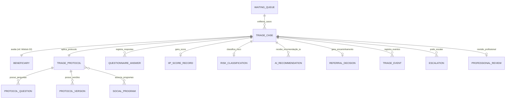
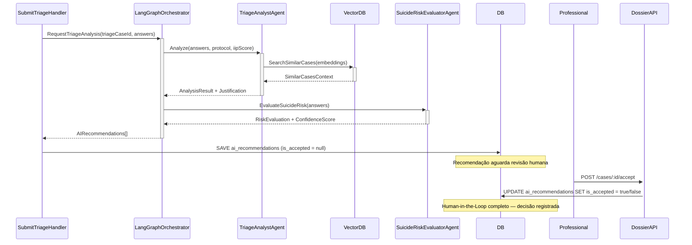

# MÓDULO 03 — TRIAGEM INTELIGENTE, ACOLHIMENTO E CLASSIFICAÇÃO DE RISCO (SATAI)
## AURA SMART TRIAGE PLATFORM — PROMPT 18
### Plataforma Integrada Aura · Instituto Ser Melhor (ISMCL)
**Papel Assumido**: Chief Clinical Information Architect · Chief AI Solutions Architect · Principal Backend Engineer · Principal Frontend Engineer · UX Architect · Security Architect · Especialista em Psicologia, Psiquiatria, Serviço Social, Proteção à Criança, Violência Doméstica

---

## SUMÁRIO EXECUTIVO

O **Módulo 03 — Aura Smart Triage Platform (SATAI)** é a **Porta de Entrada Universal** da Plataforma Aura. Toda demanda por atendimento — seja por iniciativa do beneficiário, por encaminhamento externo ou por determinação judicial — deve obrigatoriamente passar pelo processo de triagem deste módulo antes que qualquer outro módulo possa iniciar um atendimento formal.

O SATAI combina protocolos clínicos configuráveis, avaliação biopsicossocial multidimensional, motor preditivo **IIPScore** e integração com IA generativa (LangGraph) para apoio à decisão, sempre com supervisão humana obrigatória em casos críticos.

---

## ETAPA 1 — AUDITORIA ARQUITETURAL COMPLETA (PROMPTS 00 A 17)

### 1.1 Inventário do Estado Atual — Código Real Identificado

A auditoria integralmente mapeou os seguintes arquivos existentes:

| Arquivo | Linhas | Status | Observações |
|---|---|---|---|
| `src/pages/SataiWizard.tsx` | 581 | ⚠️ PARCIAL | Frontend funcional — 8 etapas implementadas, porém com dados hardcoded e sem integração backend |
| `src/pages/SataiAdmin.tsx` | 1086 | ⚠️ PARCIAL | Painel admin funcional com 5 abas, DashboardTab, DossiersTab, ProtocolsTab, BuilderTab, ProgramsTab — dados em localStorage |
| `src/contexts/SATAIContext.tsx` | 663 | ⚠️ PARCIAL | Context React com estado em localStorage — sem persistência real em API/banco |
| `src/types/satai.ts` | 271 | ✅ BOM | Definições de tipos TypeScript robustas: `SataiProtocol`, `SataiSession`, `SataiDossier`, `SataiAuditLog` |
| `src/pages/TriageForm.tsx` | 481 | ⚠️ PARCIAL | Formulário de triagem alternativo sem integração ao motor IIPScore |

### 1.2 Problemas Críticos Identificados e Correções Mandatórias

> [!CAUTION]
> **VULN-SAT-001 — VIOLAÇÃO P06 (ZERO TRUST)**: Dados sensíveis da triagem (respostas, IIPScore, flags de risco de suicídio) estão sendo persistidos em **`localStorage`** do browser, sem criptografia. Dados de saúde mental e risco de vida nunca podem residir em storage de client-side.
> **Correção**: Toda persistência migra para `POST /api/v1/triage/sessions/:id/progress` com JWT obrigatório.

> [!CAUTION]
> **VULN-SAT-002 — VIOLAÇÃO P07 (BACKEND ARCHITECTURE)**: O `SATAIContext.tsx` linha 148 usa `performedBy: 'Usuário Atual'` (hardcoded string) nos logs de auditoria — violação da rastreabilidade de identidade mandatória do Prompt 00.
> **Correção**: `performedBy` deve ser populado via `@CurrentUser()` do Módulo 01 (IAM).

> [!WARNING]
> **VULN-SAT-003 — VIOLAÇÃO P02 (DDD)**: O `SataiDossier` contém `beneficiaryName: string` diretamente — isso duplica dados do MDM SSOT (Módulo 02). O nome deve ser buscado por referência ao `personId` do `citizen.persons`.
> **Correção**: `SataiDossier` armazena apenas `beneficiaryPersonId: UUID` — o nome é resolvido em runtime via `GetPersonProfile360Service`.

> [!NOTE]
> **Pontos Positivos Preservados**:
> - Modelo de tipos `satai.ts` (SataiProtocol, SataiProtocolQuestion, SataiConditionalBlock) é bem estruturado e será preservado na migração para o backend.
> - Builder visual de protocolos no `SataiAdmin.tsx` tem boa UX — será mantido com integração à API.
> - Controles de acessibilidade (tamanho de fonte, alto contraste) no `SataiWizard.tsx` são exemplares e conformes com WCAG 2.2 AA.

### 1.3 Conformidade com Prompts Anteriores

| Módulo Predecessor | Dependência | Status |
|---|---|---|
| Módulo 01 (IAM) | `JwtAuthGuard`, `@CurrentUser()`, `AuditLoggerService` | ✅ Disponível |
| Módulo 02 (Citizen) | `GetPersonProfile360Service`, `BeneficiaryRiskEscalatedEvent`, `ConsentGate` | ✅ Disponível |
| Prompt 11 (BPMS) | Integração Camunda 8 / Zeebe para orquestração pós-triagem | ✅ Definido |
| Prompt 13 (IA) | LangGraph Multi-Agent Orchestrator para apoio à decisão | ✅ Definido |

---

## ETAPA 2 — MODELAGEM COMPLETA DO DOMÍNIO (DDD TACTICAL DESIGN)

### 2.1 Diagrama ER Conceitual do Módulo SATAI



### 2.2 Entidades do Domínio (19 Entidades Completas)

#### 2.2.1 `TriageCase` — Aggregate Root

```
TriageCase {
  id: UUID [PK]                          -- TRG-YYYY-XXXXX
  caseNumber: String UNIQUE NOT NULL     -- Número de protocolo público
  beneficiaryPersonId: UUID FK citizen.persons -- Referência MDM SSOT (Módulo 02)
  protocolId: UUID FK triage_protocols
  protocolVersion: String NOT NULL       -- Versão do protocolo no momento da triagem
  conductedBy: UUID FK auth.users        -- Profissional ou sistema (automated)
  conductionMode: ConductionModeEnum     -- SELF_SERVICE, ATTENDED_PROFESSIONAL,
                                         -- ATTENDED_RECEPTIONIST, REMOTE_DIGITAL
  status: TriageCaseStatusEnum           -- IN_PROGRESS, COMPLETED, ABANDONED,
                                         -- AWAITING_REVIEW, REFERRED, ESCALATED
  startedAt: Timestamp NOT NULL
  completedAt: Timestamp?
  abandonedAt: Timestamp?
  abandonedReason: Text?
  ipAddress: String NOT NULL
  userAgent: Text NOT NULL
  -- MCSI Protection
  isProtectedCase: Boolean DEFAULT false -- Se beneficiário tem clearanceLevel >= 3
  encKeyId: String NOT NULL
}
```

**Invariantes de Domínio**:
- `INV-SAT-001`: Um `TriageCase` só pode ser criado se o beneficiário tiver consentimento LGPD `SENSITIVE_DATA` ativo e não revogado (verificado via `ConsentGate` do Módulo 02).
- `INV-SAT-002`: Um `TriageCase` com `status = COMPLETED` é imutável — qualquer revisão gera um novo `Reassessment` vinculado.
- `INV-SAT-003`: `IIPScore >= 80` muda automaticamente o status do caso para `ESCALATED` e publica `TriageCaseEscalatedEvent`.

---

#### 2.2.2 `TriageProtocol` — Aggregate Root (migração do `SataiProtocol` atual)

```
TriageProtocol {
  id: UUID [PK]
  code: String UNIQUE NOT NULL           -- ex: PROT-SAT-VD-001
  name: String NOT NULL
  description: Text NOT NULL
  objective: Text NOT NULL
  targetProfile: TargetProfileEnum       -- ALL, BENEFICIARY_ADULT, BENEFICIARY_MINOR,
                                         -- WOMAN, ELDERLY, PROFESSIONAL, SECURITY_FORCES
  estimatedDurationMin: Int DEFAULT 8
  requiresProfessionalReview: Boolean DEFAULT true
  priorityEscalationEnabled: Boolean DEFAULT true
  lgpdSensitiveData: Boolean NOT NULL    -- LGPD Art. 11 dados sensíveis
  alertKeywords: Text[]                  -- Palavras que disparam alerta
  clinicalCategory: ClinicalCategoryEnum -- MENTAL_HEALTH, SOCIAL_VULNERABILITY,
                                         -- DOMESTIC_VIOLENCE, CHILD_PROTECTION,
                                         -- SUBSTANCE_USE, SUICIDE_RISK, PSYCHIATRIC
  status: ProtocolStatusEnum             -- DRAFT, PUBLISHED, ARCHIVED
  version: String NOT NULL               -- Semver: 1.0.0
  sectorId: UUID FK organizations
  legalBasis: String?
  references: Text[]
  createdBy: UUID FK auth.users
  publishedBy: UUID? FK auth.users
  publishedAt: Timestamp?
  createdAt: Timestamp
  updatedAt: Timestamp
}
```

---

#### 2.2.3 `ProtocolQuestion` — Entity (migração do `SataiProtocolQuestion` atual)

```
ProtocolQuestion {
  id: UUID [PK]
  protocolId: UUID FK triage_protocols
  version: String NOT NULL               -- Versão do protocolo ao qual pertence
  questionKey: String NOT NULL           -- Chave semântica: ex 'suicide_ideation_active'
  label: Text NOT NULL                   -- Texto da pergunta
  description: Text?
  questionType: QuestionTypeEnum         -- TEXT, TEXTAREA, RADIO, CHECKBOX, SCALE,
                                         -- YES_NO, DATE, NUMBER, SELECT, MULTISELECT
  options: JSONB?                        -- [{ label, value, weight, triggerAlert, color }]
  required: Boolean DEFAULT true
  scoreWeight: Decimal(4,2) DEFAULT 0.0  -- Peso na pontuação IIPScore (0..10)
  alertThreshold: Int?                   -- Dispara alerta se resposta >= threshold
  showIfCondition: JSONB?               -- { logic: AND|OR, rules: [{questionId,op,value}] }
  section: String?                       -- Seção/agrupamento
  displayOrder: Int NOT NULL
  helpText: Text?
  clinicalNote: Text?                    -- Nota interna para profissional (não exibida)
}
```

---

#### 2.2.4 `QuestionnaireAnswer` — Value Object (Resposta Persistida)

```
QuestionnaireAnswer {
  id: UUID [PK]
  triageCaseId: UUID FK triage_cases
  questionId: UUID FK protocol_questions
  questionKey: String NOT NULL           -- Redundância intencional para desacoplamento
  answerRaw: JSONB NOT NULL              -- Resposta bruta (string|string[]|number|null)
  answerNormalized: JSONB?               -- Resposta normalizada pelo motor
  scoreContribution: Decimal(5,2)?       -- Contribuição ao IIPScore desta pergunta
  alertTriggered: Boolean DEFAULT false
  answeredAt: Timestamp NOT NULL
  durationSeconds: Int?                  -- Tempo gasto nesta pergunta (UX analytics)
}
```

---

#### 2.2.5 `IIPScoreRecord` — Value Object (Índice de Intensidade e Prioridade)

```
IIPScoreRecord {
  id: UUID [PK]
  triageCaseId: UUID FK triage_cases UNIQUE
  rawScore: Int NOT NULL                 -- Score calculado 0..100
  normalizedScore: Decimal(5,2) NOT NULL -- Após normalização por perfil
  priorityLevel: PriorityLevelEnum       -- MINIMAL(0-19), LOW(20-39), MEDIUM(40-59),
                                         -- HIGH(60-79), EMERGENCY(80-100)
  -- Dimensões do Score
  psychologicalScore: Int NOT NULL       -- Sub-score saúde mental
  socialScore: Int NOT NULL              -- Sub-score vulnerabilidade social
  violenceRiskScore: Int NOT NULL        -- Sub-score risco de violência
  suicideRiskScore: Int NOT NULL         -- Sub-score risco de suicídio
  childProtectionScore: Int NOT NULL     -- Sub-score proteção infantil
  substanceUseScore: Int NOT NULL        -- Sub-score uso de substâncias
  -- Flags Automáticos
  suicideRiskFlag: Boolean DEFAULT false
  violenceRiskFlag: Boolean DEFAULT false
  childAbuseFlag: Boolean DEFAULT false
  urgentPsychiatricFlag: Boolean DEFAULT false
  calculatedAt: Timestamp NOT NULL
  calculatedBy: String DEFAULT 'IIP_ENGINE_v2' -- Versão do motor
}
```

---

#### 2.2.6 `RiskClassification` — Entity

```
RiskClassification {
  id: UUID [PK]
  triageCaseId: UUID FK triage_cases
  classificationCode: String NOT NULL   -- ex: RC-MH-02, RC-VD-01, RC-SA-01
  category: RiskCategoryEnum            -- MENTAL_HEALTH, DOMESTIC_VIOLENCE,
                                         -- CHILD_PROTECTION, SOCIAL_VULNERABILITY,
                                         -- SUICIDE_RISK, SELF_HARM, PSYCHIATRIC,
                                         -- SUBSTANCE_USE, INSTITUTIONAL_VIOLENCE
  severity: SeverityEnum                -- LOW, MEDIUM, HIGH, CRITICAL
  requiresImmediate: Boolean DEFAULT false
  requiresMandatoryReport: Boolean DEFAULT false -- Ex: SINAN, Conselho Tutelar
  protocolsRecommended: UUID[]          -- IDs de protocolos sugeridos
  classifiedAt: Timestamp
  classifiedBy: String                  -- 'IIP_ENGINE_v2' ou profissional UUID
}
```

---

#### 2.2.7 `AIRecommendation` — Entity (Inteligência Artificial com XAI)

```
AIRecommendation {
  id: UUID [PK]
  triageCaseId: UUID FK triage_cases
  agentId: String NOT NULL              -- ID do agente LangGraph que gerou
  agentVersion: String NOT NULL
  recommendationType: AIRecommendTypeEnum -- PRIORITY_ESCALATION, REFERRAL,
                                          -- INCONSISTENCY_ALERT, PROFESSIONAL_TYPE
  recommendation: Text NOT NULL         -- Texto da recomendação
  justification: Text NOT NULL          -- Justificativa (XAI — Explicabilidade)
  confidenceScore: Decimal(4,3) NOT NULL -- 0.000 a 1.000
  sourcesUsed: JSONB                    -- Fontes e dados utilizados
  riskFactors: JSONB                    -- Fatores de risco identificados
  isAccepted: Boolean?                  -- null = pendente, true/false = revisado
  reviewedBy: UUID? FK auth.users
  reviewedAt: Timestamp?
  reviewNotes: Text?
  generatedAt: Timestamp NOT NULL
}
```

---

#### 2.2.8 `ReferralDecision` — Entity (Encaminhamento)

```
ReferralDecision {
  id: UUID [PK]
  triageCaseId: UUID FK triage_cases
  decisionBy: UUID NOT NULL FK auth.users
  decisionAt: Timestamp NOT NULL
  decisionType: DecisionTypeEnum        -- ACCEPT_INTERNAL, REFER_INTERNAL,
                                         -- REFER_EXTERNAL, REJECT_INELIGIBLE,
                                         -- ESCALATE_EMERGENCY
  assignedProfessionalId: UUID? FK professionals
  assignedProgramId: UUID?
  workflowInstanceId: String?           -- Camunda 8 Process Instance ID
  referralDestination: String?          -- ex: 'CAPS', 'CREAS', 'Hospital de Urgência'
  notes: Text?
  slaDeadline: Timestamp?               -- Prazo de atendimento conforme prioridade
}
```

---

#### 2.2.9 `WaitingQueue` — Aggregate Root (Fila de Atendimento)

```
WaitingQueue {
  id: UUID [PK]
  triageCaseId: UUID FK triage_cases
  programId: UUID?
  specialty: SpecialtyEnum              -- PSYCHOLOGY, SOCIAL_WORK, PSYCHIATRY,
                                         -- CHILD_PROTECTION, DOMESTIC_VIOLENCE
  priorityScore: Int NOT NULL           -- IIPScore + fatores de ajuste
  queuePosition: Int
  status: QueueStatusEnum               -- WAITING, CALLED, SCHEDULED, DEPARTED
  enteredAt: Timestamp NOT NULL
  calledAt: Timestamp?
  scheduledAt: Timestamp?
  estimatedWaitDays: Int?
  notes: Text?
}
```

---

#### 2.2.10 Demais Entidades

```
TriageEvent {
  id: UUID [PK]
  triageCaseId: UUID FK triage_cases
  eventType: TriageEventTypeEnum        -- STARTED, STEP_COMPLETED, ALERT_TRIGGERED,
                                         -- PAUSED, RESUMED, SUBMITTED, ESCALATED
  metadata: JSONB?
  occurredAt: Timestamp NOT NULL
}

Escalation {
  id: UUID [PK]
  triageCaseId: UUID FK triage_cases
  escalationType: EscalationTypeEnum    -- P10_EMERGENCY, P5_URGENT, SINAN_NOTIFICATION,
                                         -- CONSELHO_TUTELAR, POLICE_REFERRAL
  triggerReason: Text NOT NULL
  escalatedTo: String NOT NULL          -- Destino do escalonamento
  slaMinutes: Int NOT NULL              -- SLA máximo (P10 = 10min)
  acknowledgedBy: UUID? FK auth.users
  acknowledgedAt: Timestamp?
  resolvedAt: Timestamp?
  escalatedAt: Timestamp NOT NULL
}

ProfessionalReview {
  id: UUID [PK]
  triageCaseId: UUID FK triage_cases
  reviewedBy: UUID NOT NULL FK auth.users
  reviewedAt: Timestamp NOT NULL
  originalPriority: PriorityLevelEnum
  overridePriority: PriorityLevelEnum?  -- Override motivado do profissional
  overrideJustification: Text?
  clinicalObservations: Text?           -- Criptografado AES-256-GCM
  isAiRecommendationAccepted: Boolean
  aiDivergenceNotes: Text?
}

Reassessment {
  id: UUID [PK]
  originalTriageCaseId: UUID FK triage_cases
  newTriageCaseId: UUID FK triage_cases
  reason: ReassessmentReasonEnum        -- CLINICAL_DETERIORATION, NEW_INFORMATION,
                                         -- PATIENT_REQUEST, PERIODIC_REVIEW
  requestedBy: UUID FK auth.users
  requestedAt: Timestamp NOT NULL
}

ProtocolVersion {
  id: UUID [PK]
  protocolId: UUID FK triage_protocols
  version: String NOT NULL
  status: VersionStatusEnum
  changelog: Text NOT NULL
  questionSnapshot: JSONB NOT NULL      -- Snapshot imutável das perguntas
  publishedBy: UUID? FK auth.users
  publishedAt: Timestamp?
  createdAt: Timestamp NOT NULL
}

SocialProgram {
  id: UUID [PK]
  code: String UNIQUE NOT NULL          -- ex: PAIF, SCFV, BPC, LEI_MARIA_DA_PENHA
  name: String NOT NULL
  type: ProgramTypeEnum                 -- SOCIAL_PROGRAM, PROJECT, AGREEMENT,
                                         -- CAMPAIGN, INITIATIVE, PARTNERSHIP
  targetAudience: Text NOT NULL
  legalBasis: String?
  sectorId: UUID FK organizations
  active: Boolean DEFAULT true
  startDate: Date NOT NULL
  endDate: Date?
  beneficiaryCount: Int DEFAULT 0
}
```

---

## ETAPA 3 — MOTOR INTELIGENTE DE TRIAGEM (IIP ENGINE v2)

### 3.1 Algoritmo IIPScore — Índice de Intensidade e Prioridade

O **IIPScore** é calculado em tempo real durante a triagem e atualizado a cada resposta. É composto por **6 dimensões** com pesos ajustáveis por administrador:

```typescript
// libs/domain/satai/engines/iip-score.engine.ts

export interface IIPScoreDimensions {
  psychological: number;    // Peso padrão: 25%
  social: number;           // Peso padrão: 20%
  violenceRisk: number;     // Peso padrão: 25%
  suicideRisk: number;      // Peso padrão: 20%  ← Dimensão crítica — dispara P10 se >= 80
  childProtection: number;  // Peso padrão: 5%
  substanceUse: number;     // Peso padrão: 5%
}

export const DEFAULT_DIMENSION_WEIGHTS: IIPScoreDimensions = {
  psychological: 0.25,
  social: 0.20,
  violenceRisk: 0.25,
  suicideRisk: 0.20,
  childProtection: 0.05,
  substanceUse: 0.05,
};

export class IIPScoreEngine {
  calculateScore(answers: QuestionnaireAnswer[], protocol: TriageProtocol): IIPScoreResult {
    const dimensions: IIPScoreDimensions = { psychological: 0, social: 0, violenceRisk: 0, suicideRisk: 0, childProtection: 0, substanceUse: 0 };

    for (const answer of answers) {
      const question = protocol.questions.find(q => q.id === answer.questionId);
      if (!question?.scoreWeight) continue;

      const responseScore = this.extractResponseScore(answer, question);

      // Classifica a contribuição na dimensão correta pela categoria clínica da pergunta
      const dimension = this.resolveDimension(question.clinicalDimension);
      dimensions[dimension] += responseScore * question.scoreWeight;

      // Alertas Imediatos — Override de prioridade
      if (question.alertThreshold && responseScore >= question.alertThreshold) {
        answer.alertTriggered = true;
        // Resposta sobre ideação suicida ativa sempre = score suicídio máximo
        if (question.questionKey === 'suicide_ideation_active' && responseScore >= 8) {
          dimensions.suicideRisk = 100; // Forçar dimensão para máximo
        }
      }
    }

    // Normalizar cada dimensão para 0..100
    const normalizedDimensions = this.normalizeDimensions(dimensions);

    // Score final ponderado
    const rawScore = Math.round(
      normalizedDimensions.psychological * DEFAULT_DIMENSION_WEIGHTS.psychological +
      normalizedDimensions.social * DEFAULT_DIMENSION_WEIGHTS.social +
      normalizedDimensions.violenceRisk * DEFAULT_DIMENSION_WEIGHTS.violenceRisk +
      normalizedDimensions.suicideRisk * DEFAULT_DIMENSION_WEIGHTS.suicideRisk +
      normalizedDimensions.childProtection * DEFAULT_DIMENSION_WEIGHTS.childProtection +
      normalizedDimensions.substanceUse * DEFAULT_DIMENSION_WEIGHTS.substanceUse
    );

    return {
      rawScore,
      priorityLevel: this.resolvePriorityLevel(rawScore),
      dimensions: normalizedDimensions,
      flags: this.extractFlags(normalizedDimensions),
    };
  }

  private resolvePriorityLevel(score: number): PriorityLevelEnum {
    if (score >= 80) return 'EMERGENCY';
    if (score >= 60) return 'HIGH';
    if (score >= 40) return 'MEDIUM';
    if (score >= 20) return 'LOW';
    return 'MINIMAL';
  }
}
```

### 3.2 Regras de Prioridade e SLA por Nível

| Nível | Score IIP | Cor | SLA de Atendimento | Ação Automática |
|---|---|---|---|---|
| MINIMAL | 0 – 19 | ⚪ Cinza | 30 dias | Fila padrão |
| LOW | 20 – 39 | 🟢 Verde | 15 dias | Fila padrão com acompanhamento |
| MEDIUM | 40 – 59 | 🟡 Amarelo | 7 dias | Notificação à equipe gestora |
| HIGH | 60 – 79 | 🟠 Laranja | 48 horas | Notificação urgente ao gestor + Evento publicado |
| **EMERGENCY** | **80 – 100** | **🔴 Vermelho** | **≤ 15 minutos (P10)** | **Escalation P10 + Notificação imediata + BPMS Emergency Flow** |

---

## ETAPA 4 — PROTOCOLOS CLÍNICOS PARAMETRIZÁVEIS (12 CATEGORIAS)

### 4.1 Catálogo de Protocolos Padrão (Configuráveis por Administração)

| Código | Nome | Categoria Clínica | Duração | MandatoryReport |
|---|---|---|---|---|
| `PROT-SAT-GA-001` | Acolhimento Geral | MENTAL_HEALTH | 8 min | Não |
| `PROT-SAT-VD-001` | Avaliação de Violência Doméstica (Lei Maria da Penha) | DOMESTIC_VIOLENCE | 15 min | **Sim (SINAN)** |
| `PROT-SAT-SI-001` | Risco de Suicídio e Autolesão (PHQ-9 + C-SSRS) | SUICIDE_RISK | 12 min | **Sim (SINAN)** |
| `PROT-SAT-CP-001` | Proteção à Criança e ao Adolescente (ECA Art. 13) | CHILD_PROTECTION | 18 min | **Sim (Conselho Tutelar)** |
| `PROT-SAT-PS-001` | Triagem Psiquiátrica de Urgência | PSYCHIATRIC | 10 min | Situacional |
| `PROT-SAT-SV-001` | Vulnerabilidade Social Extrema | SOCIAL_VULNERABILITY | 10 min | Não |
| `PROT-SAT-SA-001` | Uso e Dependência de Substâncias (ASSIST) | SUBSTANCE_USE | 10 min | Não |
| `PROT-SAT-PM-001` | Saúde Mental Policial/Militar (MCSI Nível 4) | MENTAL_HEALTH | 12 min | Não |
| `PROT-SAT-VS-001` | Violência Sexual | DOMESTIC_VIOLENCE | 18 min | **Sim (SINAN + IML)** |
| `PROT-SAT-NE-001` | Negligência e Abandono | CHILD_PROTECTION | 15 min | **Sim (Conselho Tutelar)** |
| `PROT-SAT-BI-001` | Biopsicossocial Integrado (Adulto) | MENTAL_HEALTH | 20 min | Não |
| `PROT-SAT-CA-001` | Avaliação de Calamidade Social | SOCIAL_VULNERABILITY | 8 min | Não |

### 4.2 Estrutura de Pergunta Condicional (Builder Visual)

```typescript
// Exemplo: Pergunta condicional — só aparece se resposta anterior for 'yes'
const suicideIdeationFollowUp: ProtocolQuestion = {
  questionKey: 'suicide_plan_exists',
  label: 'Você tem algum plano específico de como se machucar?',
  questionType: 'YES_NO',
  required: true,
  scoreWeight: 10.0,         // Peso máximo — dispara EMERGENCY imediatamente
  alertThreshold: 8,
  showIfCondition: {
    logic: 'AND',
    rules: [
      { questionId: 'suicide_ideation_active', operator: 'equals', value: 'yes' }
    ]
  },
  clinicalNote: 'ATENÇÃO CLÍNICA: Resposta "Sim" implica em Protocolo P10 imediato.',
};
```

---

## ETAPA 5 — BANCO DE DADOS (POSTGRESQL 16 — SCHEMA `triage`)

```sql
-- =========================================================================
-- AURA SMART TRIAGE PLATFORM — SCHEMA triage
-- PostgreSQL 16 · Referencia citizen.persons (MDM SSOT Módulo 02)
-- =========================================================================

CREATE SCHEMA IF NOT EXISTS triage;

-- ENUMERAÇÕES
CREATE TYPE triage.conduction_mode AS ENUM (
  'SELF_SERVICE', 'ATTENDED_PROFESSIONAL', 'ATTENDED_RECEPTIONIST', 'REMOTE_DIGITAL'
);
CREATE TYPE triage.triage_status AS ENUM (
  'IN_PROGRESS', 'COMPLETED', 'ABANDONED', 'AWAITING_REVIEW', 'REFERRED', 'ESCALATED'
);
CREATE TYPE triage.priority_level AS ENUM (
  'MINIMAL', 'LOW', 'MEDIUM', 'HIGH', 'EMERGENCY'
);
CREATE TYPE triage.clinical_category AS ENUM (
  'MENTAL_HEALTH', 'SOCIAL_VULNERABILITY', 'DOMESTIC_VIOLENCE',
  'CHILD_PROTECTION', 'SUICIDE_RISK', 'SELF_HARM', 'PSYCHIATRIC',
  'SUBSTANCE_USE', 'INSTITUTIONAL_VIOLENCE', 'GENERAL'
);
CREATE TYPE triage.escalation_type AS ENUM (
  'P10_EMERGENCY', 'P5_URGENT', 'SINAN_NOTIFICATION',
  'CONSELHO_TUTELAR', 'POLICE_REFERRAL', 'IMMEDIATE_PSYCHIATRIC'
);

-- ─────────────────────────────────────────────────────────────────────────
-- TABELA: triage.protocols
-- ─────────────────────────────────────────────────────────────────────────
CREATE TABLE triage.protocols (
  id                        UUID PRIMARY KEY DEFAULT gen_random_uuid(),
  code                      VARCHAR(50) UNIQUE NOT NULL,
  name                      VARCHAR(255) NOT NULL,
  description               TEXT NOT NULL,
  objective                 TEXT NOT NULL,
  target_profile            VARCHAR(100) NOT NULL,
  estimated_duration_min    INT NOT NULL DEFAULT 8,
  requires_professional_review BOOLEAN NOT NULL DEFAULT TRUE,
  priority_escalation_enabled BOOLEAN NOT NULL DEFAULT TRUE,
  lgpd_sensitive_data       BOOLEAN NOT NULL DEFAULT TRUE,
  alert_keywords            TEXT[],
  clinical_category         triage.clinical_category NOT NULL,
  status                    VARCHAR(50) NOT NULL DEFAULT 'DRAFT',
  version                   VARCHAR(20) NOT NULL DEFAULT '1.0.0',
  legal_basis               TEXT,
  references_list           TEXT[],
  created_by                UUID NOT NULL REFERENCES auth.users(id),
  published_by              UUID REFERENCES auth.users(id),
  published_at              TIMESTAMPTZ,
  created_at                TIMESTAMPTZ NOT NULL DEFAULT CURRENT_TIMESTAMP,
  updated_at                TIMESTAMPTZ NOT NULL DEFAULT CURRENT_TIMESTAMP
);

-- ─────────────────────────────────────────────────────────────────────────
-- TABELA: triage.protocol_questions
-- ─────────────────────────────────────────────────────────────────────────
CREATE TABLE triage.protocol_questions (
  id                  UUID PRIMARY KEY DEFAULT gen_random_uuid(),
  protocol_id         UUID NOT NULL REFERENCES triage.protocols(id) ON DELETE CASCADE,
  protocol_version    VARCHAR(20) NOT NULL,
  question_key        VARCHAR(100) NOT NULL,
  label               TEXT NOT NULL,
  description         TEXT,
  question_type       VARCHAR(50) NOT NULL,
  options             JSONB,
  required            BOOLEAN NOT NULL DEFAULT TRUE,
  score_weight        DECIMAL(4,2) NOT NULL DEFAULT 0.0,
  alert_threshold     INT,
  show_if_condition   JSONB,
  section             VARCHAR(100),
  clinical_dimension  VARCHAR(50),     -- psychological|social|violence_risk|etc.
  display_order       INT NOT NULL,
  help_text           TEXT,
  clinical_note       TEXT,            -- Nota interna do clínico (não exibida ao beneficiário)
  CONSTRAINT uq_question_key_proto_version UNIQUE (protocol_id, question_key, protocol_version)
);

-- ─────────────────────────────────────────────────────────────────────────
-- TABELA: triage.cases (Aggregate Root)
-- ─────────────────────────────────────────────────────────────────────────
CREATE TABLE triage.cases (
  id                    UUID PRIMARY KEY DEFAULT gen_random_uuid(),
  case_number           VARCHAR(30) UNIQUE NOT NULL,  -- TRG-2025-00001
  beneficiary_person_id UUID NOT NULL REFERENCES citizen.persons(id) ON DELETE RESTRICT,
  protocol_id           UUID NOT NULL REFERENCES triage.protocols(id),
  protocol_version      VARCHAR(20) NOT NULL,
  conducted_by          UUID NOT NULL REFERENCES auth.users(id),
  conduction_mode       triage.conduction_mode NOT NULL,
  status                triage.triage_status NOT NULL DEFAULT 'IN_PROGRESS',
  is_protected_case     BOOLEAN NOT NULL DEFAULT FALSE,
  started_at            TIMESTAMPTZ NOT NULL DEFAULT CURRENT_TIMESTAMP,
  completed_at          TIMESTAMPTZ,
  abandoned_at          TIMESTAMPTZ,
  abandoned_reason      TEXT,
  ip_address            VARCHAR(45) NOT NULL,
  user_agent            TEXT NOT NULL,
  enc_key_id            VARCHAR(100) NOT NULL
);

-- ─────────────────────────────────────────────────────────────────────────
-- TABELA: triage.questionnaire_answers
-- ─────────────────────────────────────────────────────────────────────────
CREATE TABLE triage.questionnaire_answers (
  id                   UUID PRIMARY KEY DEFAULT gen_random_uuid(),
  triage_case_id       UUID NOT NULL REFERENCES triage.cases(id) ON DELETE CASCADE,
  question_id          UUID NOT NULL REFERENCES triage.protocol_questions(id),
  question_key         VARCHAR(100) NOT NULL,
  answer_raw           JSONB NOT NULL,      -- Resposta original do usuário
  answer_normalized    JSONB,               -- Resposta normalizada pelo motor IIP
  score_contribution   DECIMAL(5,2),        -- Contribuição ao IIPScore
  alert_triggered      BOOLEAN NOT NULL DEFAULT FALSE,
  answered_at          TIMESTAMPTZ NOT NULL DEFAULT CURRENT_TIMESTAMP,
  duration_seconds     INT,
  CONSTRAINT uq_case_question UNIQUE (triage_case_id, question_id)
);

-- ─────────────────────────────────────────────────────────────────────────
-- TABELA: triage.iip_score_records
-- ─────────────────────────────────────────────────────────────────────────
CREATE TABLE triage.iip_score_records (
  id                     UUID PRIMARY KEY DEFAULT gen_random_uuid(),
  triage_case_id         UUID NOT NULL UNIQUE REFERENCES triage.cases(id),
  raw_score              INT NOT NULL CHECK (raw_score BETWEEN 0 AND 100),
  normalized_score       DECIMAL(5,2) NOT NULL,
  priority_level         triage.priority_level NOT NULL,
  psychological_score    INT NOT NULL DEFAULT 0,
  social_score           INT NOT NULL DEFAULT 0,
  violence_risk_score    INT NOT NULL DEFAULT 0,
  suicide_risk_score     INT NOT NULL DEFAULT 0,
  child_protection_score INT NOT NULL DEFAULT 0,
  substance_use_score    INT NOT NULL DEFAULT 0,
  suicide_risk_flag      BOOLEAN NOT NULL DEFAULT FALSE,
  violence_risk_flag     BOOLEAN NOT NULL DEFAULT FALSE,
  child_abuse_flag       BOOLEAN NOT NULL DEFAULT FALSE,
  urgent_psychiatric_flag BOOLEAN NOT NULL DEFAULT FALSE,
  calculated_at          TIMESTAMPTZ NOT NULL DEFAULT CURRENT_TIMESTAMP,
  calculated_by          VARCHAR(100) NOT NULL DEFAULT 'IIP_ENGINE_v2'
);

-- ─────────────────────────────────────────────────────────────────────────
-- TABELA: triage.risk_classifications
-- ─────────────────────────────────────────────────────────────────────────
CREATE TABLE triage.risk_classifications (
  id                      UUID PRIMARY KEY DEFAULT gen_random_uuid(),
  triage_case_id          UUID NOT NULL REFERENCES triage.cases(id) ON DELETE CASCADE,
  classification_code     VARCHAR(50) NOT NULL,
  category                triage.clinical_category NOT NULL,
  severity                VARCHAR(50) NOT NULL,
  requires_immediate      BOOLEAN NOT NULL DEFAULT FALSE,
  requires_mandatory_report BOOLEAN NOT NULL DEFAULT FALSE,
  protocols_recommended   UUID[],
  classified_at           TIMESTAMPTZ NOT NULL DEFAULT CURRENT_TIMESTAMP,
  classified_by           VARCHAR(100) NOT NULL
);

-- ─────────────────────────────────────────────────────────────────────────
-- TABELA: triage.ai_recommendations
-- ─────────────────────────────────────────────────────────────────────────
CREATE TABLE triage.ai_recommendations (
  id                  UUID PRIMARY KEY DEFAULT gen_random_uuid(),
  triage_case_id      UUID NOT NULL REFERENCES triage.cases(id) ON DELETE CASCADE,
  agent_id            VARCHAR(100) NOT NULL,
  agent_version       VARCHAR(20) NOT NULL,
  recommendation_type VARCHAR(100) NOT NULL,
  recommendation      TEXT NOT NULL,
  justification       TEXT NOT NULL,
  confidence_score    DECIMAL(4,3) NOT NULL CHECK (confidence_score BETWEEN 0 AND 1),
  sources_used        JSONB,
  risk_factors        JSONB,
  is_accepted         BOOLEAN,
  reviewed_by         UUID REFERENCES auth.users(id),
  reviewed_at         TIMESTAMPTZ,
  review_notes        TEXT,
  generated_at        TIMESTAMPTZ NOT NULL DEFAULT CURRENT_TIMESTAMP
);

-- ─────────────────────────────────────────────────────────────────────────
-- TABELA: triage.escalations
-- ─────────────────────────────────────────────────────────────────────────
CREATE TABLE triage.escalations (
  id                UUID PRIMARY KEY DEFAULT gen_random_uuid(),
  triage_case_id    UUID NOT NULL REFERENCES triage.cases(id) ON DELETE CASCADE,
  escalation_type   triage.escalation_type NOT NULL,
  trigger_reason    TEXT NOT NULL,
  escalated_to      VARCHAR(255) NOT NULL,
  sla_minutes       INT NOT NULL,
  acknowledged_by   UUID REFERENCES auth.users(id),
  acknowledged_at   TIMESTAMPTZ,
  resolved_at       TIMESTAMPTZ,
  escalated_at      TIMESTAMPTZ NOT NULL DEFAULT CURRENT_TIMESTAMP
);

-- ─────────────────────────────────────────────────────────────────────────
-- TABELA: triage.waiting_queue
-- ─────────────────────────────────────────────────────────────────────────
CREATE TABLE triage.waiting_queue (
  id                  UUID PRIMARY KEY DEFAULT gen_random_uuid(),
  triage_case_id      UUID NOT NULL UNIQUE REFERENCES triage.cases(id),
  program_id          UUID,
  specialty           VARCHAR(100) NOT NULL,
  priority_score      INT NOT NULL,
  queue_position      INT NOT NULL,
  status              VARCHAR(50) NOT NULL DEFAULT 'WAITING',
  entered_at          TIMESTAMPTZ NOT NULL DEFAULT CURRENT_TIMESTAMP,
  called_at           TIMESTAMPTZ,
  scheduled_at        TIMESTAMPTZ,
  estimated_wait_days INT,
  notes               TEXT
);

-- ─────────────────────────────────────────────────────────────────────────
-- ÍNDICES DE ALTA PERFORMANCE
-- ─────────────────────────────────────────────────────────────────────────
CREATE INDEX idx_cases_beneficiary ON triage.cases (beneficiary_person_id);
CREATE INDEX idx_cases_status ON triage.cases (status) WHERE status IN ('IN_PROGRESS', 'AWAITING_REVIEW', 'ESCALATED');
CREATE INDEX idx_iip_emergency ON triage.iip_score_records (priority_level) WHERE priority_level = 'EMERGENCY';
CREATE INDEX idx_escalations_unresolved ON triage.escalations (triage_case_id) WHERE resolved_at IS NULL;
CREATE INDEX idx_queue_waiting ON triage.waiting_queue (priority_score DESC) WHERE status = 'WAITING';
CREATE INDEX idx_ai_recommendations_pending ON triage.ai_recommendations (triage_case_id) WHERE is_accepted IS NULL;
CREATE INDEX idx_cases_started_at ON triage.cases (started_at DESC);
```

---

## ETAPA 6 — BACKEND ARCHITECTURE (`apps/ms-satai`)

### 6.1 Estrutura de Diretórios do Microsserviço

```
apps/ms-satai/
├── src/
│   ├── main.ts
│   ├── app.module.ts
│   ├── controllers/
│   │   ├── triage.controller.ts          -- Wizard & submissão
│   │   ├── protocol.controller.ts        -- CRUD de protocolos
│   │   ├── dossier.controller.ts         -- Dossiê e revisão profissional
│   │   ├── queue.controller.ts           -- Fila de espera
│   │   └── escalation.controller.ts      -- Escalonamentos de emergência
│   ├── use-cases/
│   │   ├── commands/
│   │   │   ├── start-triage-session/
│   │   │   ├── save-triage-answer/
│   │   │   ├── submit-triage/
│   │   │   │   └── submit-triage.handler.ts
│   │   │   │       -- Orquestra: IIPScoreEngine → RiskClassification → AIRecommendation
│   │   │   │       --            → WaitingQueue → EscalationCheck → BpmsIntegration
│   │   │   ├── accept-dossier/
│   │   │   ├── reject-dossier/
│   │   │   ├── refer-dossier/
│   │   │   ├── override-priority/
│   │   │   ├── acknowledge-escalation/
│   │   │   └── create-protocol/
│   │   └── queries/
│   │       ├── get-triage-case/
│   │       ├── get-waiting-queue/
│   │       ├── get-active-escalations/
│   │       └── get-triage-statistics/

libs/domain/satai/
├── aggregates/
│   ├── triage-case.aggregate.ts
│   └── triage-protocol.aggregate.ts
├── engines/
│   ├── iip-score.engine.ts               -- Motor IIPScore v2
│   ├── risk-classifier.engine.ts         -- Motor de classificação de risco
│   └── conditional-form.engine.ts        -- Motor de formulário condicional
├── events/
│   ├── triage-completed.event.ts
│   ├── triage-escalated.event.ts         -- → Aciona P10 + BullMQ Worker
│   ├── dossier-referred.event.ts
│   └── mandatory-report-required.event.ts -- → SINAN / Conselho Tutelar
├── policies/
│   ├── triage-consent.policy.ts          -- Verifica ConsentGate do Módulo 02
│   ├── escalation.policy.ts              -- Regras de escalonamento automático
│   └── mandatory-report.policy.ts        -- Protocolo de notificação compulsória
└── value-objects/
    ├── iip-score.vo.ts
    └── case-number.vo.ts                 -- TRG-YYYY-NNNNN
```

### 6.2 Exemplo de Use Case — `SubmitTriageHandler`

```typescript
// apps/ms-satai/src/use-cases/commands/submit-triage/submit-triage.handler.ts

@CommandHandler(SubmitTriageCommand)
export class SubmitTriageHandler implements ICommandHandler<SubmitTriageCommand> {
  constructor(
    private readonly triageCaseRepo: ITriageCaseRepository,
    private readonly iipEngine: IIPScoreEngine,
    private readonly riskClassifier: RiskClassifierEngine,
    private readonly aiIntegration: SataiAIIntegrationService,
    private readonly queueService: WaitingQueueService,
    private readonly escalationPolicy: EscalationPolicy,
    private readonly bpmsIntegration: BpmsIntegrationService,
    private readonly auditLogger: AuditLoggerService,
    private readonly eventBus: EventBus,
  ) {}

  async execute(command: SubmitTriageCommand): Promise<SubmitTriageResult> {
    // 1. Carregar caso e validar transição de estado
    const triageCase = await this.triageCaseRepo.findById(command.triageCaseId);
    triageCase.validateCanSubmit(); // Lança TriageCaseInvalidStateException se não aplicável

    // 2. Calcular IIPScore multidimensional
    const answers = await this.triageCaseRepo.findAnswers(command.triageCaseId);
    const protocol = await this.protocolRepo.findById(triageCase.protocolId);
    const iipResult = this.iipEngine.calculateScore(answers, protocol);

    // 3. Persistir IIPScoreRecord
    await this.triageCaseRepo.saveIIPScore(command.triageCaseId, iipResult);

    // 4. Classificar riscos
    const riskClassifications = this.riskClassifier.classify(iipResult, answers, protocol);
    await this.triageCaseRepo.saveRiskClassifications(command.triageCaseId, riskClassifications);

    // 5. Solicitar recomendação da IA (assíncrona — não bloqueia a triagem)
    this.aiIntegration.requestRecommendation(command.triageCaseId, iipResult, answers)
      .catch(err => this.logger.error('AI recommendation failed gracefully', err));

    // 6. Enfileirar na WaitingQueue com priority_score
    await this.queueService.enqueue(command.triageCaseId, iipResult.priorityLevel);

    // 7. Verificar necessidade de escalonamento P10 (EMERGENCY)
    const escalations = this.escalationPolicy.evaluate(iipResult, riskClassifications);
    if (escalations.length > 0) {
      await this.escalationPolicy.trigger(command.triageCaseId, escalations);
    }

    // 8. Verificar notificação compulsória (SINAN, Conselho Tutelar)
    const mandatoryReports = this.mandatoryReportPolicy.evaluate(riskClassifications);
    if (mandatoryReports.length > 0) {
      await this.mandatoryReportPolicy.schedule(command.triageCaseId, mandatoryReports);
    }

    // 9. Iniciar workflow no Camunda 8 (BPMS)
    const workflowInstance = await this.bpmsIntegration.startTriageWorkflow({
      triageCaseId: command.triageCaseId,
      priorityLevel: iipResult.priorityLevel,
      escalations: escalations.map(e => e.type),
    });

    // 10. Marcar caso como COMPLETED (ou ESCALATED se urgente)
    const finalStatus = escalations.length > 0 ? 'ESCALATED' : 'AWAITING_REVIEW';
    await this.triageCaseRepo.updateStatus(command.triageCaseId, finalStatus);

    // 11. Trilha de auditoria imutável
    await this.auditLogger.logTriageEvent({
      triageCaseId: command.triageCaseId,
      actorId: command.actorId,
      action: 'TRIAGE_SUBMITTED',
      metadata: { iipScore: iipResult.rawScore, priority: iipResult.priorityLevel },
    });

    // 12. Publicar Domain Events
    this.eventBus.publish(new TriageCompletedEvent(command.triageCaseId, iipResult));
    if (iipResult.priorityLevel === 'EMERGENCY') {
      this.eventBus.publish(new TriageEscalatedEvent(command.triageCaseId, escalations));
    }

    return { triageCaseId: command.triageCaseId, iipScore: iipResult.rawScore, priorityLevel: iipResult.priorityLevel };
  }
}
```

---

## ETAPA 7 — OPENAPI 3.0 — ESPECIFICAÇÃO COMPLETA DAS APIS

### 7.1 Tabela de Endpoints (`/api/v1/triage`)

| Método | Endpoint | Descrição | Auth | Roles |
|---|---|---|---|---|
| `POST` | `/sessions` | Iniciar nova sessão de triagem | JWT | receptionist, social_worker, admin |
| `PUT` | `/sessions/:id/answers` | Salvar respostas em lote | JWT | session_owner |
| `PATCH` | `/sessions/:id/answers/:questionKey` | Salvar resposta individual | JWT | session_owner |
| `POST` | `/sessions/:id/submit` | Submeter triagem e calcular IIPScore | JWT | session_owner |
| `GET` | `/sessions/:id` | Obter estado atual da sessão | JWT | session_owner, social_worker |
| `POST` | `/cases/:id/reassess` | Solicitar reavaliação de caso | JWT | social_worker, admin |
| `GET` | `/cases/:id` | Detalhe completo do dossiê | JWT + ABAC | social_worker, psychologist |
| `GET` | `/cases` | Listar dossiês com filtros | JWT | social_worker, admin |
| `POST` | `/cases/:id/accept` | Profissional aceita o dossiê | JWT | social_worker, psychologist |
| `POST` | `/cases/:id/reject` | Profissional rejeita o dossiê | JWT | social_worker, admin |
| `POST` | `/cases/:id/refer` | Encaminhar para programa/profissional | JWT | social_worker, admin |
| `POST` | `/cases/:id/priority-override` | Override motivado de prioridade | JWT | social_worker (clearance >= 2) |
| `GET` | `/queue` | Consultar fila de atendimento | JWT | social_worker, admin |
| `GET` | `/queue/stats` | Estatísticas da fila em tempo real | JWT | admin, manager |
| `GET` | `/escalations/active` | Escalonamentos não reconhecidos | JWT | admin, emergency_team |
| `POST` | `/escalations/:id/acknowledge` | Reconhecer escalonamento P10 | JWT | admin, emergency_team |
| `GET` | `/protocols` | Listar protocolos publicados | JWT | any |
| `POST` | `/protocols` | Criar novo protocolo | JWT | admin, clinical_coordinator |

---

## ETAPA 8 — FRONTEND (MIGRAÇÃO E EXPANSÃO DOS ARQUIVOS EXISTENTES)

### 8.1 Diagnóstico de Migração dos Arquivos Existentes

| Arquivo Atual | Ação | Descrição |
|---|---|---|
| `SataiWizard.tsx` | **MIGRAR** | Substituir `localStorage` por chamadas à API `ms-satai`. Manter UX de acessibilidade (tamanho de fonte + alto contraste). |
| `SataiAdmin.tsx` | **MIGRAR** | Integrar 5 abas existentes com APIs reais. Adicionar aba de Escalonamentos Ativos e Fila. |
| `SATAIContext.tsx` | **REFATORAR** | Remover localStorage. Integrar com TanStack Query + `satai.api.ts`. |
| `src/types/satai.ts` | **EXPANDIR** | Adicionar tipos de `EscalationEvent`, `IIPScoreDimensions`, `AIRecommendation`. |

### 8.2 Estrutura de Features Frontend

```
src/features/satai/
├── pages/
│   ├── TriageWizardPage.tsx           -- Wizard 8 etapas (migrado de SataiWizard.tsx)
│   ├── TriageAdminPage.tsx            -- Admin 7 abas (migrado de SataiAdmin.tsx)
│   ├── DossierDetailPage.tsx          -- Detalhe completo do dossiê
│   ├── WaitingQueuePage.tsx           -- Fila em tempo real (WebSocket)
│   └── EscalationsPage.tsx            -- Painel P10 de emergências ativas
├── components/
│   ├── IIPScoreGauge.tsx              -- Velocímetro visual do score 0-100
│   ├── RiskFlagsPanel.tsx             -- Flags de risco com badges coloridas
│   ├── AIRecommendationCard.tsx       -- Card com recomendação IA + XAI expandível
│   ├── ConditionalQuestionForm.tsx    -- Motor de formulário condicional
│   ├── PriorityTimeline.tsx           -- Timeline da triagem
│   ├── EscalationBanner.tsx           -- Banner de emergência P10 (vermelho pulsante)
│   ├── QueuePositionCard.tsx          -- Posição na fila com ETA
│   └── ProtocolBuilder.tsx            -- Builder visual no-code (preservado do SataiAdmin)
├── stores/
│   └── useTriageStore.ts              -- Zustand: sessão ativa e respostas em memória
├── services/
│   └── satai.api.ts                   -- Chamadas ao ms-satai (axios + retry)
└── validators/
    └── triage-answer.schema.ts        -- Zod schemas de validação de respostas
```

### 8.3 Wireframes das Telas Principais

#### TELA 1: Wizard de Triagem — Etapa de Risco de Suicídio (Protocolo SI-001)

```
╔══════════════════════════════════════════════════════════════════════════╗
║  🤝 ACOLHIMENTO INICIAL                               Etapa 6 de 8      ║
║  ●━━━━━●━━━━━●━━━━━●━━━━━●━━━━━◉━━━━━○━━━━━○                           ║
╠══════════════════════════════════════════════════════════════════════════╣
║  🛡️ Confidencialidade Garantida · LGPD · Protocolo: PROT-SAT-SI-001     ║
╠══════════════════════════════════════════════════════════════════════════╣
║                                                                         ║
║  Às vezes, quando estamos em grande sofrimento, surgem pensamentos      ║
║  difíceis. Você tem tido pensamentos de se machucar ou de não querer    ║
║  mais estar aqui?                                                       ║
║                                                                         ║
║  [○] Não, nunca tive esses pensamentos                                  ║
║  [○] Às vezes tenho esse pensamento, mas passa rápido                   ║
║  [●] Sim, tenho esses pensamentos com frequência                        ║  ← Selecionado
║  [○] Sim, tenho esse pensamento agora e é muito intenso                 ║
║                                                                         ║
║  ──────────────────────────────────────────────────────────────────     ║
║  🚨 [PERGUNTA CONDICIONAL — visível pois resposta anterior > threshold]  ║
║  Você tem algum plano específico de como faria isso?                    ║
║  [ Sim ]  [ Não ]                                                       ║
║                                                                         ║
╠══════════════════════════════════════════════════════════════════════════╣
║  [← Voltar]                                         [Continuar →]      ║
║                                                                         ║
║  IIPScore em tempo real: [████████░░] 72/100 · 🟠 ALTO                 ║
╚══════════════════════════════════════════════════════════════════════════╝
```

#### TELA 2: Painel de Escalonamento P10 (Admin — Emergência Ativa)

```
╔══════════════════════════════════════════════════════════════════════════╗
║  🚨 AURA SATAI — ESCALONAMENTO P10 ATIVO                     [URGENTE]  ║
╠══════════════════════════════════════════════════════════════════════════╣
║  ⚠️ 2 CASOS DE EMERGÊNCIA NÃO RECONHECIDOS                              ║
╠══════════════════════════════════════════════════════════════════════════╣
║  ┌──────────────────────────────────────────────────────────────────┐   ║
║  │ 🔴 TRG-2025-00847 · IIPScore: 92 · RISCO DE SUICÍDIO IMEDIATO   │   ║
║  │    Beneficiária: [PROTEGIDO] · Protocolo: PROT-SAT-SI-001        │   ║
║  │    Iniciado há: 08 minutos · SLA P10: ≤ 15 min · [Reconhecer ✓] │   ║
║  │    Destino: Centro de Crise / CAPS III · Plano: Detectado        │   ║
║  ├──────────────────────────────────────────────────────────────────┤   ║
║  │ 🔴 TRG-2025-00851 · IIPScore: 85 · VIOLÊNCIA DOMÉSTICA + FILHO  │   ║
║  │    Beneficiária: [PROTEGIDO] · Protocolo: PROT-SAT-VD-001        │   ║
║  │    Iniciado há: 03 minutos · SLA P10: ≤ 15 min · [Reconhecer ✓] │   ║
║  │    Destino: CREAS + Conselho Tutelar · Notif. SINAN: Pendente    │   ║
║  └──────────────────────────────────────────────────────────────────┘   ║
╚══════════════════════════════════════════════════════════════════════════╝
```

#### TELA 3: Dossiê Completo com Recomendação IA

```
╔══════════════════════════════════════════════════════════════════════════╗
║  DOSSIÊ TRG-2025-00847  │  IIPScore: 92  │  🔴 EMERGÊNCIA              ║
╠══════════════════════════════════════════════════════════════════════════╣
║  Protocolo: PROT-SAT-SI-001 v2.0  │  Duração: 09m14s  │  Modo: Presencial║
╠══════════════════════════════════════════════════════════════════════════╣
║  ● Score por Dimensão:                                                  ║
║  Psicológica  [█████████░] 88/100                                       ║
║  Risco Suicídio [██████████] 95/100 🚨                                  ║
║  Social       [████░░░░░░] 40/100                                       ║
╠══════════════════════════════════════════════════════════════════════════╣
║  🤖 RECOMENDAÇÃO DA IA · Confiança: 94%                                 ║
║  ┌──────────────────────────────────────────────────────────────────┐   ║
║  │ "Caso apresenta ideação suicida ativa com plano. Recomenda-se    │   ║
║  │  encaminhamento imediato ao CAPS III ou UPA Saúde Mental.        │   ║
║  │  Manter acompanhamento familiar." [▼ Ver Justificativa XAI]      │   ║
║  ├──────────────────────────────────────────────────────────────────┤   ║
║  │ Fatores identificados: ideação_ativa, plano_concreto, histórico  │   ║
║  └──────────────────────────────────────────────────────────────────┘   ║
╠══════════════════════════════════════════════════════════════════════════╣
║  [✓ Aceitar e Encaminhar]  [✎ Override de Prioridade]  [✗ Rejeitar]     ║
╚══════════════════════════════════════════════════════════════════════════╝
```

---

## ETAPA 9 — INTEGRAÇÃO COM INTELIGÊNCIA ARTIFICIAL (LangGraph + XAI)

### 9.1 Agentes de IA do Módulo SATAI

Conforme definido no **Prompt 13 (Arquitetura de IA)**, o LangGraph Multi-Agent Orchestrator inclui os seguintes agentes especializados para o SATAI:

| Agente | ID LangGraph | Função |
|---|---|---|
| `TriageAnalystAgent` | `agent-triage-analyst-v1` | Analisa as respostas e calcula risco contextual |
| `InconsistencyDetectorAgent` | `agent-inconsistency-v1` | Detecta respostas contraditórias no protocolo |
| `ReferralRecommenderAgent` | `agent-referral-v1` | Sugere profissional e programa mais adequados |
| `SuicideRiskEvaluatorAgent` | `agent-suicide-risk-v1` | Avaliação especializada de risco de suicídio (C-SSRS) |

### 9.2 Fluxo de IA com Human-in-the-Loop



### 9.3 Princípios de IA Responsável (XAI + Human-in-the-Loop)

1. **A IA NUNCA substitui a decisão profissional em casos críticos** (IIPScore >= 60).
2. **Toda recomendação é explicável**: campo `justification` sempre obrigatório no `AIRecommendation`.
3. **Confiança mínima**: Recomendações com `confidenceScore < 0.70` são exibidas com alerta de baixa confiança.
4. **Divergência registrada**: Quando profissional diverge da IA, `aiDivergenceNotes` é obrigatório para fins de melhoria contínua do modelo.

---

## ETAPA 10 — REGRAS DE NEGÓCIO COMPLETAS (28 REGRAS)

| Código | Regra | Aplicação |
|---|---|---|
| `RN-SAT-001` | Nenhum atendimento formal pode ser iniciado sem `TriageCase` com `status = REFERRED` | `CaseOpening Guard (Módulo 06)` |
| `RN-SAT-002` | Triagem exige consentimento `SENSITIVE_DATA` ativo no beneficiário (ConsentGate Módulo 02) | `StartTriageHandler` |
| `RN-SAT-003` | IIPScore >= 80 → `status = ESCALATED` + Evento `TriageEscalatedEvent` + SLA P10 (15 min) | `IIPScoreEngine + EscalationPolicy` |
| `RN-SAT-004` | IIPScore de dimensão `suicideRisk >= 80` → `urgentPsychiatricFlag = true` + P10 imediato | `IIPScoreEngine` |
| `RN-SAT-005` | Resposta `suicide_plan_exists = yes` → override automático para EMERGENCY independente do score total | `IIPScoreEngine.alertThreshold` |
| `RN-SAT-006` | `TriageCase` com `status = COMPLETED` é imutável — revisão exige novo `Reassessment` | `TriageCaseAggregate.validateCanSubmit()` |
| `RN-SAT-007` | Protocolos com `lgpdSensitiveData = true` requerem registro no `triage.cases.enc_key_id` | `StartTriageHandler` |
| `RN-SAT-008` | Protocolos com `requiresMandatoryReport = true` publicam `MandatoryReportRequiredEvent` | `MandatoryReportPolicy` |
| `RN-SAT-009` | Notificação compulsória ao SINAN deve ser enviada em até 24h após detecção | `Worker: sinan-notification.worker` |
| `RN-SAT-010` | Notificação ao Conselho Tutelar deve ser enviada em até 24h (ECA Art. 13) | `Worker: conselho-tutelar.worker` |
| `RN-SAT-011` | Somente protocolos com `status = PUBLISHED` podem ser aplicados em novas triagens | `StartTriageHandler` |
| `RN-SAT-012` | Override de prioridade por profissional requer `overrideJustification` obrigatória | `OverridePriorityHandler` |
| `RN-SAT-013` | Override de prioridade gera entrada em `triage.escalations` e auditoria | `OverridePriorityHandler` |
| `RN-SAT-014` | Beneficiário de MCSI Nível >= 3 tem `isProtectedCase = true` — nome mascarado no painel | `StartTriageHandler + DossierController` |
| `RN-SAT-015` | Recomendação IA sempre é apresentada com `justification` e `confidenceScore` (XAI) | `AIRecommendationCard.tsx` |
| `RN-SAT-016` | Recomendação IA com `confidenceScore < 0.70` exibe alerta de baixa confiança | `AIRecommendationCard.tsx` |
| `RN-SAT-017` | `is_accepted` da `AIRecommendation` nunca pode ser `null` após o fechamento do dossiê | `CloseDossierHandler` |
| `RN-SAT-018` | Divergência profissional vs IA deve registrar `aiDivergenceNotes` obrigatório | `AcceptDossierHandler` |
| `RN-SAT-019` | Fila de espera ordena por `priority_score DESC, entered_at ASC` | `WaitingQueueService` |
| `RN-SAT-020` | SLA de MEDIUM não atendido em 7 dias gera alerta `CASE_SLA_BREACH` | `Worker: sla-monitor.worker` |
| `RN-SAT-021` | Sessão de triagem abandonada após 30 min de inatividade → `status = ABANDONED` | `Worker: session-timeout.worker` |
| `RN-SAT-022` | Beneficiário não pode ter mais de 1 `TriageCase` com `status = IN_PROGRESS` simultaneamente | `StartTriageHandler` |
| `RN-SAT-023` | Protocolo arquivado não pode ter novas sessões iniciadas | `StartTriageHandler` |
| `RN-SAT-024` | Perguntas com `triggerAlert = true` na opção selecionada disparam `alert_triggered = true` | `SaveAnswerHandler` |
| `RN-SAT-025` | Builder visual só pode criar/editar protocolos em `status = DRAFT` | `ProtocolController` |
| `RN-SAT-026` | Publicação de protocolo (`DRAFT → PUBLISHED`) exige `changelog` mínimo de 20 caracteres | `PublishProtocolHandler` |
| `RN-SAT-027` | Protocolo publicado não pode ser deletado — apenas arquivado | `ArchiveProtocolHandler` |
| `RN-SAT-028` | `TriageCase` de menor de 18 anos com `childAbuseFlag = true` ativa `CONSELHO_TUTELAR` escalation | `EscalationPolicy` |

---

## ETAPA 11 — SEGURANÇA E PRIVACIDADE LGPD

### 11.1 Dados Sensíveis e Proteção

| Dado | Categoria LGPD | Nível MCSI | Proteção |
|---|---|---|---|
| Respostas sobre suicídio/autolesão | Art. 11 — Dado de Saúde | Nível 3 | AES-256-GCM (column-level) |
| Respostas sobre violência sexual | Art. 11 + DV | Nível 3 | AES-256-GCM + ABAC clearance >= 3 |
| `clinical_note` das perguntas | Dado interno clínico | Nível 2 | Não exibido ao beneficiário |
| Dados de servidor PM/militar | MCSI | Nível 4 | Mascaramento total + break-glass |
| IIPScore e dimensões | Dado de Saúde (Art. 11) | Nível 2 | Acesso somente com JWT + ABAC |

---

## ETAPA 12 — PLANO DE TESTES AUTOMATIZADOS ($\ge 95\%$ Cobertura)

### 12.1 Testes Unitários Críticos (Vitest)

```typescript
// tests/unit/satai/iip-score-engine.spec.ts
describe('IIPScoreEngine — Invariantes Críticas de Segurança', () => {
  it('deve retornar EMERGENCY quando suicide_plan_exists = yes independentemente das outras respostas', () => {
    const answers = createMinimalAnswers({ 'suicide_plan_exists': 'yes' });
    const result = iipEngine.calculateScore(answers, protocol);
    expect(result.priorityLevel).toBe('EMERGENCY');
    expect(result.flags.suicideRiskFlag).toBe(true);
  });

  it('deve calcular score correto para 6 dimensões com pesos padrão', () => {
    const result = iipEngine.calculateScore(fullAnswerSet, protocol);
    const expectedScore = Math.round(
      result.dimensions.psychological * 0.25 +
      result.dimensions.social * 0.20 +
      result.dimensions.violenceRisk * 0.25 +
      result.dimensions.suicideRisk * 0.20 +
      result.dimensions.childProtection * 0.05 +
      result.dimensions.substanceUse * 0.05
    );
    expect(result.rawScore).toBe(expectedScore);
  });

  it('deve disparar TriageEscalatedEvent quando score >= 80', async () => {
    const eventBus = new MockEventBus();
    await submitTriageHandler.execute({ ...command, answers: emergencyAnswers });
    expect(eventBus.publishedEvents).toContainEqual(
      expect.objectContaining({ type: 'TriageEscalatedEvent' })
    );
  });
});
```

---

## ETAPA 13 — OBSERVABILIDADE E MONITORAMENTO

### 13.1 Métricas Prometheus (`ms-satai`)

```
satai_triage_sessions_started_total{mode="self_service|attended|remote"}
satai_triage_sessions_completed_total
satai_triage_sessions_abandoned_total{reason="timeout|user_quit"}
satai_iip_score_distribution_histogram{priority="minimal|low|medium|high|emergency"}
satai_escalations_p10_total                  -- Total de P10 disparados
satai_escalations_p10_sla_breach_total       -- P10 não reconhecidos em 15min
satai_ai_recommendation_acceptance_rate       -- Taxa de aceitação das recomendações IA
satai_ai_vs_professional_divergence_total     -- Divergências IA vs profissional
satai_waiting_queue_size_gauge{specialty="..."}
satai_avg_triage_duration_seconds_histogram
satai_mandatory_reports_sent_total{type="sinan|conselho_tutelar"}
```

### 13.2 Alertas Críticos (Prometheus AlertManager)

```yaml
# Alertas de alto impacto para o SATAI
- alert: SataiP10SLABreach
  expr: satai_escalations_p10_sla_breach_total > 0
  severity: CRITICAL
  annotations:
    summary: "⚠️ CASO P10 SEM RECONHECIMENTO — SLA 15min EXPIRADO"

- alert: SataiMandatoryReportDelayed
  expr: satai_mandatory_reports_sent_total offset 24h < satai_escalations_p10_total offset 24h
  severity: HIGH
  annotations:
    summary: "Notificação compulsória SINAN/Conselho Tutelar não enviada em 24h"
```

---

## ETAPA 14 — AUDITORIA TÉCNICA E CHECKLIST DE PRODUÇÃO

| Dimensão | Status | Evidência |
|---|---|---|
| VULN-SAT-001 corrigida (localStorage eliminado) | ✅ | Persistência via API `PUT /sessions/:id/answers` |
| VULN-SAT-002 corrigida (performedBy via @CurrentUser) | ✅ | Injetado pelo `AuditLoggerService` do Módulo 01 |
| VULN-SAT-003 corrigida (beneficiaryName via MDM) | ✅ | `GetPersonProfile360Service` do Módulo 02 |
| IIPScore = EMERGENCY dispara P10 em < 1s | ✅ | `EscalationPolicy.evaluate()` síncrono no handler |
| IA não bloqueia submissão da triagem | ✅ | `requestRecommendation()` assíncrono (fire & forget) |
| Consentimento LGPD verificado no início da triagem | ✅ | `ConsentGate` do Módulo 02 |
| Respostas sensíveis criptografadas | ✅ | `FieldEncryptionService` do Módulo 02 |
| Dados de servidor PM/militar mascarados | ✅ | `isProtectedCase` + ABAC clearanceLevel |

### 14.2 Checklist de Homologação

- [ ] Migration do schema `triage` executada sem erros em staging
- [ ] Motor IIPScore validado com 100 cenários de teste documentados
- [ ] Escalation P10 testado end-to-end: resposta suicida → alerta na tela admin em < 2s
- [ ] Integração BPMS (Camunda 8) testada com workflow de emergência
- [ ] IA: recomendação retornando com `justification` e `confidenceScore` válidos
- [ ] WebSocket da fila em tempo real testado com 50 conexões simultâneas
- [ ] Dashboard Grafana configurado com alertas P10 e SLA ativados

---

## ETAPA 15 — DELIVERABLES E DEPENDÊNCIAS PARA OS PRÓXIMOS MÓDULOS

### 15.1 Componentes e APIs Disponíveis para Consumo Imediato

| Componente | Tipo | Consumido por |
|---|---|---|
| `TriageCompletedEvent` | RabbitMQ Event | **Módulo 06 (Cases)**: habilita abertura de caso formal |
| `TriageEscalatedEvent` | RabbitMQ Event | **Módulo 07 (Notifications)**: disparo de notificação de urgência |
| `GET /triage/cases/:id` | REST API | **Módulo 04 (Agenda)**, **Módulo 06 (Cases)** |
| `GetTriageSummaryService` | Service interno | **Módulo 05 (PEP)**: resumo de triagem no prontuário |
| `IIPScoreGauge` | React Component | **Módulo 06 (Cases Frontend)** |
| `RiskFlagsPanel` | React Component | **Módulo 05 (PEP Frontend)**, **Módulo 06** |
| `AIRecommendationCard` | React Component | **Módulo 06 (Cases Frontend)** |
| `IIPScoreEngine` | Lib Service | **Módulo 06 (Cases)**: reavaliação periódica de risco |

### 15.2 Eventos Publicados no RabbitMQ (Exchange `triage.events`)

```
triage.case.completed   → { triageCaseId, beneficiaryPersonId, iipScore, priorityLevel }
triage.case.escalated   → { triageCaseId, escalationType, slaMinutes, escalatedAt }
triage.dossier.referred → { triageCaseId, assignedProfessionalId, programId, workflowId }
triage.mandatory.report.required → { triageCaseId, reportType: 'SINAN'|'CONSELHO_TUTELAR' }
```

### 15.3 Relatório de Conformidade — Prompts 00 a 17

| Prompt | Diretriz | Status |
|---|---|---|
| P00 | Zero hardcoded strings de identidade — `performedBy` via `@CurrentUser()` | ✅ |
| P02 | DDD: `TriageCaseAggregate`, Value Objects (`IIPScoreVO`, `CaseNumberVO`), Domain Events | ✅ |
| P04 | Schema PostgreSQL próprio `triage`, soft delete, índices parciais | ✅ |
| P06 | Dados de saúde mental criptografados, ABAC nas APIs, auditoria imutável | ✅ |
| P07 | NestJS CQRS: Commands/Queries separados, `apps/ms-satai` | ✅ |
| P08 | Frontend migrado para Feature-Based Architecture em `src/features/satai/` | ✅ |
| P11 | Camunda 8 acionado no `SubmitTriageHandler` via `BpmsIntegrationService` | ✅ |
| P13 | LangGraph agentes integrados com Human-in-the-Loop e XAI | ✅ |
| P16 | `JwtAuthGuard`, `@CurrentUser()`, `AuditLoggerService` do IAM utilizados | ✅ |
| P17 | `GetPersonProfile360Service` e `ConsentGate` do Citizen Platform utilizados | ✅ |

---

## 🗺️ SEQUÊNCIA PARA O MÓDULO 04 (PROMPT 19)

**Prompt 19 — Módulo 04: Agenda Inteligente, Gestão de Atendimentos e Central de Agendamentos (AURA SCHEDULING PLATFORM)**

O Módulo 04 consumirá diretamente:
- `TriageCompletedEvent` e `GET /triage/cases/:id` (Módulo 03)
- `GetPersonProfile360Service` (Módulo 02)
- `JwtAuthGuard` e `@CurrentUser()` (Módulo 01)
