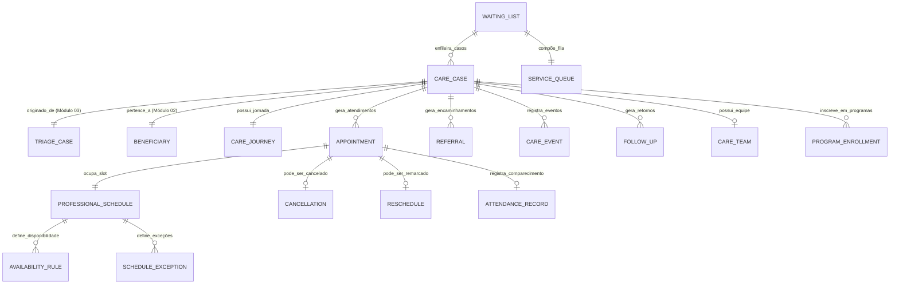

# MÓDULO 04 — GESTÃO DE ATENDIMENTOS, AGENDAMENTOS, FILAS E COORDENAÇÃO DO CUIDADO
## AURA CARE COORDINATION PLATFORM — PROMPT 19
### Plataforma Integrada Aura · Instituto Ser Melhor (ISMCL)
**Papel Assumido**: Chief Healthcare Solutions Architect · Chief Enterprise Architect · Principal Backend & Frontend Engineer · UX Architect · Clinical Workflow Specialist · BPM Specialist · Database Architect · Security Architect · Especialista em FHIR, LGPD, DDD, Clean Architecture

---

## SUMÁRIO EXECUTIVO

O **Módulo 04 — Aura Care Coordination Platform** é o **Motor Operacional Central** da Plataforma Aura. Ele transforma o encaminhamento gerado pela triagem (Módulo 03) em um ciclo de atendimento completo, gerenciando agendas, filas inteligentes, equipes multidisciplinares e a linha do tempo longitudinal de cada caso.

Nenhum atendimento clínico ou de serviço social poderá ocorrer fora deste módulo. Ele é consumidor obrigatório do evento `TriageCompletedEvent` e produtor do evento `CareJourneyStartedEvent` para os módulos subsequentes (PEP, Prontuário, Financeiro).

---

## ETAPA 1 — AUDITORIA ARQUITETURAL COMPLETA (PROMPTS 00 A 18)

### 1.1 Inventário do Estado Atual — Código Real Auditado

| Arquivo | Linhas | Status | Diagnóstico |
|---|---|---|---|
| `src/pages/Calendar.tsx` | 605 | ⚠️ PARCIAL | Funcional para 1 profissional/1 data. Dados em `localStorage`. Abas "Institucional" e "Fila de Espera" com placeholders vazios. `MOCK_WAITLIST` hardcoded. Sem vínculo com triagem. |
| `src/pages/Patients.tsx` | 230 | ⚠️ PARCIAL | Lista de beneficiários com dados fictícios hardcoded. Sem vínculo com MDM SSOT (Módulo 02). |
| `src/contexts/BPMSContext.tsx` | 489 | ⚠️ PARCIAL | Motor BPMS funcional em memória. `startProcessInstance` sem integração real com Camunda 8. |
| `src/pages/Professionals.tsx` | — | ⚠️ PARCIAL | Gestão de profissionais com dados em `localStorage`. `professional_details_{id}` com `weeklyAvailability`. |

### 1.2 Vulnerabilidades Críticas e Correções Mandatórias

> [!CAUTION]
> **VULN-CAR-001 — VIOLAÇÃO P06 + P04**: `Calendar.tsx` persiste agendamentos em `localStorage.appointments_list` sem criptografia, sem tenant isolation e sem vinculação a `citizen.persons` (MDM SSOT). Dados de saúde (tipo de atendimento, profissional responsável) são dados sensíveis conforme LGPD Art. 11.
> **Correção**: Toda persistência migra para `POST /api/v1/care/appointments` com JWT + AES-256-GCM.

> [!CAUTION]
> **VULN-CAR-002 — VIOLAÇÃO P02 (DDD)**: `Patients.tsx` cria entidades de pacientes paralelas (`DEFAULT_PATIENTS`) com `cpf` em texto plano — duplicidade do MDM SSOT (Módulo 02) e violação direta do princípio SSOT.
> **Correção**: `Patients.tsx` é descontinuado e substituído por `PersonLookup` que busca via `GET /citizen/persons/:id` do Módulo 02.

> [!WARNING]
> **VULN-CAR-003 — VIOLAÇÃO P03 (ARQUITETURA)**: A aba "Agenda Institucional" em `Calendar.tsx` retorna um placeholder vazio. A aba "Fila de Espera" usa `MOCK_WAITLIST` hardcoded sem vínculo com o `WaitingQueue` gerado pelo SATAI (Módulo 03).
> **Correção**: Integração com `GET /care/queue` (backend ms-care) via WebSocket para atualização em tempo real.

### 1.3 Mapeamento de Dependências com Módulos Anteriores

| Módulo | Recurso Consumido | Evento/API |
|---|---|---|
| **Módulo 01 (IAM)** | `JwtAuthGuard`, `@CurrentUser()`, `AbacGuard` | Guard + Decorator |
| **Módulo 02 (Citizen/MDM)** | `GetPersonProfile360Service`, `ConsentGate` | Service call |
| **Módulo 03 (SATAI)** | `WaitingQueue`, `ReferralDecision`, `IIPScoreRecord` | `TriageCompletedEvent` (RabbitMQ) |
| **Prompt 11 (BPMS)** | Camunda 8 workflow `care-case-management-v1` | `BpmsIntegrationService` |
| **Prompt 13 (IA)** | LangGraph agentes de agendamento preditivo | `SchedulingAIService` |

---

## ETAPA 2 — MODELAGEM COMPLETA DO DOMÍNIO (DDD TACTICAL DESIGN)

### 2.1 Diagrama ER Conceitual



### 2.2 Entidades do Domínio (22 Entidades Completas)

#### 2.2.1 `CareCase` — Aggregate Root

```
CareCase {
  id: UUID [PK]
  caseNumber: String UNIQUE NOT NULL     -- CCC-YYYY-NNNNN
  triageCaseId: UUID FK triage.cases    -- Raiz obrigatória: todo caso nasce de uma triagem
  beneficiaryPersonId: UUID FK citizen.persons -- MDM SSOT (Módulo 02)
  responsibleProfessionalId: UUID? FK auth.professionals
  organizationId: UUID FK organizations  -- Tenant
  status: CareCaseStatusEnum             -- OPEN, ACTIVE, SUSPENDED, DISCHARGED, CLOSED, REOPENED
  priority: PriorityEnum                 -- MINIMAL, LOW, MEDIUM, HIGH, EMERGENCY (herdado do IIPScore)
  clinicalCategory: ClinicalCategoryEnum -- Herdado da classificação SATAI
  openedAt: Timestamp NOT NULL
  openedBy: UUID FK auth.users
  dischargedAt: Timestamp?
  dischargedBy: UUID? FK auth.users
  dischargeReason: DischargeReasonEnum?  -- GOAL_ACHIEVED, DROPOUT, EXTERNAL_REFERRAL,
                                          -- NO_SHOW_3X, CLINICAL_IMPROVEMENT, INSTITUTIONAL
  closedAt: Timestamp?
  notes: BYTEA?                          -- Criptografado AES-256-GCM (notas sensíveis)
  encKeyId: String NOT NULL
}
```

**Invariantes de Domínio**:
- `INV-CAR-001`: `CareCase` só pode ser criado se existir `ReferralDecision` com `status = ACCEPT_INTERNAL` ou `REFER_INTERNAL` no `triage.cases` correspondente.
- `INV-CAR-002`: `CareCase` com `status = DISCHARGED` é imutável — reabertura exige novo `ReopenRequest` com justificativa auditada.
- `INV-CAR-003`: Qualquer atendimento (`Appointment`) só pode ser criado para um `CareCase` com `status IN (OPEN, ACTIVE)`.

---

#### 2.2.2 `CareJourney` — Entity (Linha do Tempo Longitudinal)

```
CareJourney {
  id: UUID [PK]
  careCaseId: UUID NOT NULL FK care_cases UNIQUE
  startDate: Date NOT NULL
  projectedEndDate: Date?
  totalSessions: Int DEFAULT 0
  completedSessions: Int DEFAULT 0
  missedSessions: Int DEFAULT 0
  careGoals: JSONB?                      -- Objetivos terapêuticos/sociais definidos
  progressNotes: BYTEA?                  -- Criptografado — notas de evolução da jornada
  lastActivityAt: Timestamp?
}
```

---

#### 2.2.3 `Appointment` — Entity

```
Appointment {
  id: UUID [PK]
  appointmentNumber: String UNIQUE NOT NULL  -- AGD-YYYY-NNNNN
  careCaseId: UUID NOT NULL FK care_cases
  professionalId: UUID NOT NULL FK auth.professionals
  slotId: UUID NOT NULL FK schedule_slots
  appointmentType: AppointmentTypeEnum   -- INITIAL, FOLLOW_UP, RETURN, EVALUATION,
                                          -- SUPERVISION, GROUP_SESSION, REMOTE
  modality: ModalityEnum                 -- IN_PERSON, TELEHEALTH, HOME_VISIT
  location: String?                      -- Sala/Consultório ou URL da teleconsulta
  scheduledAt: Timestamp NOT NULL
  durationMinutes: Int NOT NULL DEFAULT 50
  status: AppointmentStatusEnum          -- SCHEDULED, CONFIRMED, IN_PROGRESS,
                                          -- COMPLETED, MISSED, CANCELLED, RESCHEDULED
  confirmedAt: Timestamp?
  startedAt: Timestamp?
  completedAt: Timestamp?
  cancelledAt: Timestamp?
  cancelledBy: UUID? FK auth.users
  encKeyId: String NOT NULL
}
```

---

#### 2.2.4 `ProfessionalSchedule` — Aggregate Root

```
ProfessionalSchedule {
  id: UUID [PK]
  professionalId: UUID NOT NULL FK auth.professionals UNIQUE
  organizationId: UUID FK organizations
  timezone: String NOT NULL DEFAULT 'America/Sao_Paulo'
  defaultDurationMin: Int DEFAULT 50
  maxDailyAppointments: Int DEFAULT 8
  allowEncaixe: Boolean DEFAULT true      -- Permite encaixe de urgência
  isOnCall: Boolean DEFAULT false         -- Sobreaviso ativo
  createdAt: Timestamp NOT NULL
  updatedAt: Timestamp NOT NULL
}
```

---

#### 2.2.5 `AvailabilityRule` — Entity (Disponibilidade Recorrente)

```
AvailabilityRule {
  id: UUID [PK]
  scheduleId: UUID NOT NULL FK professional_schedules
  dayOfWeek: Int NOT NULL CHECK (0..6)  -- 0=Dom, 1=Seg, ..., 6=Sab
  startTime: Time NOT NULL              -- ex: 09:00
  endTime: Time NOT NULL                -- ex: 18:00
  intervalMinutes: Int DEFAULT 50       -- Intervalo entre slots
  isActive: Boolean DEFAULT true
}
```

---

#### 2.2.6 `ScheduleSlot` — Value Object (Slot Calculado)

```
ScheduleSlot {
  id: UUID [PK]
  scheduleId: UUID NOT NULL FK professional_schedules
  slotDateTime: Timestamp NOT NULL
  durationMinutes: Int NOT NULL
  status: SlotStatusEnum                -- AVAILABLE, BOOKED, BLOCKED, ENCAIXE, ON_CALL
  blockedReason: SlotBlockReasonEnum?   -- VACATION, MEETING, TRAINING, PERSONAL, HOLIDAY
  appointmentId: UUID? FK appointments  -- Preenchido quando BOOKED
}
```

---

#### 2.2.7 `ScheduleException` — Entity (Exceções e Bloqueios)

```
ScheduleException {
  id: UUID [PK]
  scheduleId: UUID NOT NULL FK professional_schedules
  exceptionType: ExceptionTypeEnum      -- VACATION, DAY_OFF, TRAINING, SUBSTITUTION,
                                         -- EMERGENCY_BLOCK, HOLIDAY
  startDate: Date NOT NULL
  endDate: Date NOT NULL
  reason: String NOT NULL
  replacedByProfessionalId: UUID? FK auth.professionals -- Substituto
  createdBy: UUID FK auth.users
  createdAt: Timestamp NOT NULL
}
```

---

#### 2.2.8 `WaitingList` — Aggregate Root (Fila de Prioridade)

```
WaitingList {
  id: UUID [PK]
  careCaseId: UUID NOT NULL UNIQUE FK care_cases
  queueType: QueueTypeEnum              -- SPECIALTY, PROGRAM, EMERGENCY, GENERAL
  specialty: SpecialtyEnum              -- PSYCHOLOGY, SOCIAL_WORK, PSYCHIATRY,
                                         -- CHILD_PROTECTION, SUBSTANCE_USE
  priorityScore: Decimal(6,2) NOT NULL  -- FPS calculado (vide Etapa 5)
  queuePosition: Int NOT NULL
  status: WaitlistStatusEnum            -- WAITING, CALLED, SCHEDULED, DEPARTED_VOLUNTARY,
                                         -- DEPARTED_DISCHARGED, REDISTRIBUTED
  maxWaitDays: Int NOT NULL             -- SLA máximo por prioridade
  enteredAt: Timestamp NOT NULL
  calledAt: Timestamp?
  scheduledAt: Timestamp?
  redistributedAt: Timestamp?
  redistributedTo: UUID? FK auth.professionals
  notes: Text?
}
```

---

#### 2.2.9 `Referral` — Entity (Encaminhamento entre Serviços)

```
Referral {
  id: UUID [PK]
  referralNumber: String UNIQUE NOT NULL  -- ENC-YYYY-NNNNN
  careCaseId: UUID NOT NULL FK care_cases
  referredBy: UUID NOT NULL FK auth.users
  referralType: ReferralTypeEnum         -- INTERNAL_SPECIALTY, INTERNAL_PROGRAM,
                                          -- EXTERNAL_CAPS, EXTERNAL_CREAS, EXTERNAL_UPA,
                                          -- LEGAL_REFERRAL, EMERGENCY
  destinationProfessionalId: UUID? FK auth.professionals
  destinationProgramId: UUID?
  destinationExternal: String?           -- Nome da instituição externa
  reason: Text NOT NULL                  -- Justificativa clínica/social
  clinicalSummary: BYTEA NOT NULL        -- Resumo criptografado AES-256-GCM
  priority: PriorityEnum NOT NULL
  status: ReferralStatusEnum             -- SENT, RECEIVED, ACCEPTED, REJECTED, CANCELLED
  sentAt: Timestamp NOT NULL
  receivedAt: Timestamp?
  acceptedAt: Timestamp?
  rejectedAt: Timestamp?
  rejectionReason: Text?
  encKeyId: String NOT NULL
}
```

---

#### 2.2.10 `CareTeam` — Entity (Equipe Multidisciplinar)

```
CareTeam {
  id: UUID [PK]
  careCaseId: UUID NOT NULL FK care_cases UNIQUE
  coordinatorId: UUID NOT NULL FK auth.professionals -- Coordenador da equipe
  createdAt: Timestamp NOT NULL
  updatedAt: Timestamp NOT NULL
}

CareTeamMember {
  id: UUID [PK]
  careTeamId: UUID NOT NULL FK care_teams
  professionalId: UUID NOT NULL FK auth.professionals
  role: TeamRoleEnum                    -- COORDINATOR, PSYCHOLOGIST, SOCIAL_WORKER,
                                         -- PSYCHIATRIST, EDUCATOR, SUPERVISOR
  accessLevel: AccessLevelEnum          -- FULL, READ_NOTES, READ_SUMMARY, NO_CLINICAL
  joinedAt: Timestamp NOT NULL
  leftAt: Timestamp?
  CONSTRAINT uq_team_professional UNIQUE (care_team_id, professional_id)
}
```

---

#### 2.2.11 `AttendanceRecord` — Entity (Registro de Comparecimento)

```
AttendanceRecord {
  id: UUID [PK]
  appointmentId: UUID NOT NULL FK appointments UNIQUE
  careCaseId: UUID NOT NULL FK care_cases
  professionalId: UUID NOT NULL FK auth.professionals
  attended: Boolean NOT NULL
  arrivalTime: Timestamp?
  departureTime: Timestamp?
  attendanceType: AttendanceTypeEnum    -- PRESENT_IN_PERSON, PRESENT_TELEHEALTH,
                                         -- ABSENT_JUSTIFIED, ABSENT_UNJUSTIFIED, LATE
  justification: Text?                  -- Obrigatório para ABSENT_JUSTIFIED
  nextActionTriggered: NextActionEnum?  -- RESCHEDULE, REASSESS_PRIORITY, DISCHARGE_3X
  recordedBy: UUID NOT NULL FK auth.users
  recordedAt: Timestamp NOT NULL
}
```

---

#### 2.2.12 Demais Entidades

```
Cancellation { id, appointmentId, careCaseId, cancelledBy, reason: CancellationReasonEnum,
  details: Text NOT NULL, cancelledAt, notifiedBeneficiary: Boolean }

Reschedule { id, originalAppointmentId, newAppointmentId, requestedBy, reason: Text,
  rescheduledAt }

FollowUp { id, careCaseId, professionalId, scheduledDate, type: FollowUpTypeEnum,
  status, notes: BYTEA, completedAt }

ProgramEnrollment { id, careCaseId, programId, enrolledBy, enrolledAt, exitedAt,
  exitReason, status: EnrollmentStatusEnum }

CareEvent { id, careCaseId, eventType: CareEventTypeEnum, description: Text,
  actorId: UUID, metadata: JSONB, occurredAt, isPublicToTeam: Boolean }

Reminder { id, appointmentId, beneficiaryPersonId, channel: ReminderChannelEnum,
  scheduledFor, sentAt, status: ReminderStatusEnum }

AISchedulingSuggestion { id, careCaseId, agentId, suggestionType, content: Text,
  justification: Text, confidenceScore: Decimal, isAccepted: Boolean?, reviewedBy,
  generatedAt }
```

---

## ETAPA 3 — COORDENAÇÃO DO CUIDADO (CICLO LONGITUDINAL)

### 3.1 Ciclo de Vida Completo do `CareCase`

```
[TriageCompletedEvent recebido]
        ↓
 [OPEN] → OpenCareCaseHandler
        ↓
 [ACTIVE] ← Primeiro atendimento realizado
        ↓
 Ciclo: Appointment → AttendanceRecord → FollowUp → Appointment
        ↓
 [SUSPENDED] ← Por ausência (configurável: 2x ou 3x consecutivas)
        ↓ (após intervenção)
 [ACTIVE] ← Retomada
        ↓
 [DISCHARGED] ← Alta formal por qualquer DischargeReason
        ↓
 [CLOSED] ← 30 dias após alta sem reabertura
        ↑
 [REOPENED] ← ReopenCaseHandler com justificativa obrigatória
```

### 3.2 CareTimeline — Linha do Tempo Única e Imutável

Cada `CareEvent` é publicado com:
```typescript
export enum CareEventTypeEnum {
  CASE_OPENED           = 'CASE_OPENED',
  APPOINTMENT_SCHEDULED = 'APPOINTMENT_SCHEDULED',
  APPOINTMENT_COMPLETED = 'APPOINTMENT_COMPLETED',
  APPOINTMENT_MISSED    = 'APPOINTMENT_MISSED',
  REFERRAL_SENT         = 'REFERRAL_SENT',
  REFERRAL_ACCEPTED     = 'REFERRAL_ACCEPTED',
  TEAM_MEMBER_ADDED     = 'TEAM_MEMBER_ADDED',
  PRIORITY_CHANGED      = 'PRIORITY_CHANGED',
  PROGRAM_ENROLLED      = 'PROGRAM_ENROLLED',
  CASE_SUSPENDED        = 'CASE_SUSPENDED',
  CASE_DISCHARGED       = 'CASE_DISCHARGED',
  CASE_REOPENED         = 'CASE_REOPENED',
}
```

---

## ETAPA 4 — GESTÃO INTELIGENTE DE AGENDAS

### 4.1 Modelo de Disponibilidade Multi-Profissional

```
Profissional A:
  Segunda: 08:00 – 12:00 (intervalos 50min) + 14:00 – 17:00
  Quinta: 14:00 – 18:00 (intervalos 50min)
  Férias: 10/08 – 25/08 → ScheduleException[VACATION]
  Encaixe: permitido às 12:30 se maxDailyAppointments não atingido

Profissional B:
  Plantão (sobreaviso): isOnCall = true
  → Disponível para EMERGENCY sem slot pré-definido
```

### 4.2 `SlotGenerationWorker` — Geração Automática de Slots

O worker executa toda segunda-feira às 07:00 (cron), gerando os slots das próximas 4 semanas para cada profissional:

```typescript
// apps/ms-care/src/workers/slot-generation.worker.ts
@Processor('slot-generation')
export class SlotGenerationWorker {
  @Process()
  async generateSlots(job: Job) {
    const { professionalId, weeksAhead } = job.data;
    const schedule = await this.scheduleRepo.findByProfessional(professionalId);
    const exceptions = await this.exceptionRepo.findUpcoming(professionalId, weeksAhead);

    for (let week = 0; week < weeksAhead; week++) {
      for (const rule of schedule.availabilityRules) {
        const slots = this.calculateSlotsForWeek(rule, week, exceptions);
        await this.slotRepo.upsertBatch(slots); // Idempotente via unique(scheduleId, slotDateTime)
      }
    }
  }
}
```

---

## ETAPA 5 — FILAS INTELIGENTES (FPS — FILA PONDERADA DE SERVIÇO)

### 5.1 Algoritmo FPS (Fair Priority Score)

A fila não é FIFO simples. O **FPS** é recalculado dinamicamente a cada evento relevante:

$$\text{FPS} = (\text{IIPScore} \times 0.45) + (\text{SocialVulnerabilityScore} \times 0.20) + (\text{WaitTimeFactor} \times 0.25) + (\text{EmergencyBonus} \times 0.10)$$

**Onde**:
- $\text{IIPScore}$: 0–100 (herdado do SATAI Módulo 03)
- $\text{SocialVulnerabilityScore}$: Calculado pelo perfil 360° do Módulo 02 (renda, habitação, dependentes)
- $\text{WaitTimeFactor}$: $\min(\text{diasEspera} \times 1.5, 30)$ — Cresce com o tempo de espera
- $\text{EmergencyBonus}$: 50 pontos se `RiskClassification.severity = CRITICAL`

### 5.2 Redistribuição Automática de Fila

```typescript
// apps/ms-care/src/workers/queue-rebalancer.worker.ts
// Executa a cada 30 minutos via cron: '*/30 * * * *'
@Process('rebalance-queue')
async rebalanceQueue(job: Job<{ specialty: SpecialtyEnum }>) {
  const waitingCases = await this.queueRepo.findWaiting(job.data.specialty);

  // Recalcular FPS de todos os casos aguardando
  for (const queueEntry of waitingCases) {
    const iipScore = await this.triageService.getIIPScore(queueEntry.careCaseId);
    const socialScore = await this.citizenService.getSocialVulnerabilityScore(queueEntry.beneficiaryPersonId);
    const waitDays = differenceInDays(new Date(), queueEntry.enteredAt);
    const newFPS = this.calculateFPS(iipScore, socialScore, waitDays, queueEntry.emergencyFlag);
    await this.queueRepo.updatePriorityScore(queueEntry.id, newFPS);
  }

  // Reordenar posições na fila
  const reordered = waitingCases.sort((a, b) => b.fps - a.fps);
  await this.queueRepo.updatePositions(reordered.map((c, i) => ({ id: c.id, position: i + 1 })));

  // Verificar SLA: notificar gestores se casos HIGH/EMERGENCY aguardam > maxWaitDays
  await this.slaMonitor.checkBreaches(reordered);
}
```

### 5.3 Parâmetros de SLA por Nível de Prioridade

| Nível | FPS Range | MaxWaitDays | Ação ao Atingir SLA |
|---|---|---|---|
| MINIMAL | < 25 | 45 dias | Log interno |
| LOW | 25 – 49 | 30 dias | Notificação ao gestor |
| MEDIUM | 50 – 69 | 15 dias | Alerta + Redistribuição automática |
| HIGH | 70 – 84 | 5 dias | Alerta urgente + Override de fila |
| **EMERGENCY** | **>= 85** | **24 horas** | **P5 imediato + Sobreaviso** |

---

## ETAPA 6 — BANCO DE DADOS (POSTGRESQL 16 — SCHEMA `care`)

```sql
-- =========================================================================
-- AURA CARE COORDINATION PLATFORM — SCHEMA care
-- PostgreSQL 16 · Referencia citizen.persons, triage.cases, auth.users
-- =========================================================================

CREATE SCHEMA IF NOT EXISTS care;

-- ENUMERAÇÕES
CREATE TYPE care.case_status AS ENUM (
  'OPEN', 'ACTIVE', 'SUSPENDED', 'DISCHARGED', 'CLOSED', 'REOPENED'
);
CREATE TYPE care.appointment_status AS ENUM (
  'SCHEDULED', 'CONFIRMED', 'IN_PROGRESS', 'COMPLETED', 'MISSED', 'CANCELLED', 'RESCHEDULED'
);
CREATE TYPE care.appointment_type AS ENUM (
  'INITIAL', 'FOLLOW_UP', 'RETURN', 'EVALUATION', 'SUPERVISION', 'GROUP_SESSION', 'REMOTE'
);
CREATE TYPE care.slot_status AS ENUM (
  'AVAILABLE', 'BOOKED', 'BLOCKED', 'ENCAIXE', 'ON_CALL'
);
CREATE TYPE care.referral_type AS ENUM (
  'INTERNAL_SPECIALTY', 'INTERNAL_PROGRAM', 'EXTERNAL_CAPS', 'EXTERNAL_CREAS',
  'EXTERNAL_UPA', 'LEGAL_REFERRAL', 'EMERGENCY'
);
CREATE TYPE care.referral_status AS ENUM (
  'SENT', 'RECEIVED', 'ACCEPTED', 'REJECTED', 'CANCELLED'
);

-- ─────────────────────────────────────────────────────────────────────────
-- TABELA: care.cases
-- ─────────────────────────────────────────────────────────────────────────
CREATE TABLE care.cases (
  id                        UUID PRIMARY KEY DEFAULT gen_random_uuid(),
  case_number               VARCHAR(30) UNIQUE NOT NULL,  -- CCC-2025-00001
  triage_case_id            UUID NOT NULL UNIQUE REFERENCES triage.cases(id),
  beneficiary_person_id     UUID NOT NULL REFERENCES citizen.persons(id),
  responsible_professional_id UUID REFERENCES auth.professionals(id),
  organization_id           UUID NOT NULL REFERENCES organizations(id),
  status                    care.case_status NOT NULL DEFAULT 'OPEN',
  priority                  VARCHAR(50) NOT NULL,
  clinical_category         VARCHAR(100) NOT NULL,
  opened_at                 TIMESTAMPTZ NOT NULL DEFAULT CURRENT_TIMESTAMP,
  opened_by                 UUID NOT NULL REFERENCES auth.users(id),
  discharged_at             TIMESTAMPTZ,
  discharged_by             UUID REFERENCES auth.users(id),
  discharge_reason          VARCHAR(100),
  closed_at                 TIMESTAMPTZ,
  notes                     BYTEA,
  enc_key_id                VARCHAR(100) NOT NULL
);

-- ─────────────────────────────────────────────────────────────────────────
-- TABELA: care.care_journeys
-- ─────────────────────────────────────────────────────────────────────────
CREATE TABLE care.care_journeys (
  id                   UUID PRIMARY KEY DEFAULT gen_random_uuid(),
  care_case_id         UUID NOT NULL UNIQUE REFERENCES care.cases(id),
  start_date           DATE NOT NULL,
  projected_end_date   DATE,
  total_sessions       INT NOT NULL DEFAULT 0,
  completed_sessions   INT NOT NULL DEFAULT 0,
  missed_sessions      INT NOT NULL DEFAULT 0,
  care_goals           JSONB,
  progress_notes       BYTEA,
  last_activity_at     TIMESTAMPTZ
);

-- ─────────────────────────────────────────────────────────────────────────
-- TABELA: care.professional_schedules
-- ─────────────────────────────────────────────────────────────────────────
CREATE TABLE care.professional_schedules (
  id                       UUID PRIMARY KEY DEFAULT gen_random_uuid(),
  professional_id          UUID NOT NULL UNIQUE REFERENCES auth.professionals(id),
  organization_id          UUID NOT NULL REFERENCES organizations(id),
  timezone                 VARCHAR(100) NOT NULL DEFAULT 'America/Sao_Paulo',
  default_duration_min     INT NOT NULL DEFAULT 50,
  max_daily_appointments   INT NOT NULL DEFAULT 8,
  allow_encaixe            BOOLEAN NOT NULL DEFAULT TRUE,
  is_on_call               BOOLEAN NOT NULL DEFAULT FALSE,
  created_at               TIMESTAMPTZ NOT NULL DEFAULT CURRENT_TIMESTAMP,
  updated_at               TIMESTAMPTZ NOT NULL DEFAULT CURRENT_TIMESTAMP
);

-- ─────────────────────────────────────────────────────────────────────────
-- TABELA: care.availability_rules
-- ─────────────────────────────────────────────────────────────────────────
CREATE TABLE care.availability_rules (
  id               UUID PRIMARY KEY DEFAULT gen_random_uuid(),
  schedule_id      UUID NOT NULL REFERENCES care.professional_schedules(id) ON DELETE CASCADE,
  day_of_week      SMALLINT NOT NULL CHECK (day_of_week BETWEEN 0 AND 6),
  start_time       TIME NOT NULL,
  end_time         TIME NOT NULL,
  interval_minutes INT NOT NULL DEFAULT 50,
  is_active        BOOLEAN NOT NULL DEFAULT TRUE,
  CONSTRAINT chk_time_order CHECK (end_time > start_time)
);

-- ─────────────────────────────────────────────────────────────────────────
-- TABELA: care.schedule_slots
-- ─────────────────────────────────────────────────────────────────────────
CREATE TABLE care.schedule_slots (
  id               UUID PRIMARY KEY DEFAULT gen_random_uuid(),
  schedule_id      UUID NOT NULL REFERENCES care.professional_schedules(id),
  slot_datetime    TIMESTAMPTZ NOT NULL,
  duration_minutes INT NOT NULL DEFAULT 50,
  status           care.slot_status NOT NULL DEFAULT 'AVAILABLE',
  blocked_reason   VARCHAR(100),
  appointment_id   UUID REFERENCES care.appointments(id),
  CONSTRAINT uq_schedule_slot UNIQUE (schedule_id, slot_datetime)
);

-- ─────────────────────────────────────────────────────────────────────────
-- TABELA: care.appointments
-- ─────────────────────────────────────────────────────────────────────────
CREATE TABLE care.appointments (
  id                   UUID PRIMARY KEY DEFAULT gen_random_uuid(),
  appointment_number   VARCHAR(30) UNIQUE NOT NULL,  -- AGD-2025-00001
  care_case_id         UUID NOT NULL REFERENCES care.cases(id),
  professional_id      UUID NOT NULL REFERENCES auth.professionals(id),
  slot_id              UUID NOT NULL UNIQUE REFERENCES care.schedule_slots(id),
  appointment_type     care.appointment_type NOT NULL,
  modality             VARCHAR(50) NOT NULL,
  location             VARCHAR(500),
  scheduled_at         TIMESTAMPTZ NOT NULL,
  duration_minutes     INT NOT NULL DEFAULT 50,
  status               care.appointment_status NOT NULL DEFAULT 'SCHEDULED',
  confirmed_at         TIMESTAMPTZ,
  started_at           TIMESTAMPTZ,
  completed_at         TIMESTAMPTZ,
  cancelled_at         TIMESTAMPTZ,
  cancelled_by         UUID REFERENCES auth.users(id),
  enc_key_id           VARCHAR(100) NOT NULL
);

-- ─────────────────────────────────────────────────────────────────────────
-- TABELA: care.waiting_list
-- ─────────────────────────────────────────────────────────────────────────
CREATE TABLE care.waiting_list (
  id                UUID PRIMARY KEY DEFAULT gen_random_uuid(),
  care_case_id      UUID NOT NULL UNIQUE REFERENCES care.cases(id),
  queue_type        VARCHAR(50) NOT NULL DEFAULT 'SPECIALTY',
  specialty         VARCHAR(100) NOT NULL,
  priority_score    DECIMAL(6,2) NOT NULL,
  queue_position    INT NOT NULL,
  status            VARCHAR(50) NOT NULL DEFAULT 'WAITING',
  max_wait_days     INT NOT NULL,
  entered_at        TIMESTAMPTZ NOT NULL DEFAULT CURRENT_TIMESTAMP,
  called_at         TIMESTAMPTZ,
  scheduled_at      TIMESTAMPTZ,
  redistributed_at  TIMESTAMPTZ,
  redistributed_to  UUID REFERENCES auth.professionals(id),
  notes             TEXT
);

-- ─────────────────────────────────────────────────────────────────────────
-- TABELA: care.referrals
-- ─────────────────────────────────────────────────────────────────────────
CREATE TABLE care.referrals (
  id                           UUID PRIMARY KEY DEFAULT gen_random_uuid(),
  referral_number              VARCHAR(30) UNIQUE NOT NULL,
  care_case_id                 UUID NOT NULL REFERENCES care.cases(id),
  referred_by                  UUID NOT NULL REFERENCES auth.users(id),
  referral_type                care.referral_type NOT NULL,
  destination_professional_id  UUID REFERENCES auth.professionals(id),
  destination_program_id       UUID,
  destination_external         VARCHAR(500),
  reason                       TEXT NOT NULL,
  clinical_summary             BYTEA NOT NULL,
  priority                     VARCHAR(50) NOT NULL,
  status                       care.referral_status NOT NULL DEFAULT 'SENT',
  sent_at                      TIMESTAMPTZ NOT NULL DEFAULT CURRENT_TIMESTAMP,
  received_at                  TIMESTAMPTZ,
  accepted_at                  TIMESTAMPTZ,
  rejected_at                  TIMESTAMPTZ,
  rejection_reason             TEXT,
  enc_key_id                   VARCHAR(100) NOT NULL
);

-- ─────────────────────────────────────────────────────────────────────────
-- TABELA: care.attendance_records
-- ─────────────────────────────────────────────────────────────────────────
CREATE TABLE care.attendance_records (
  id                  UUID PRIMARY KEY DEFAULT gen_random_uuid(),
  appointment_id      UUID NOT NULL UNIQUE REFERENCES care.appointments(id),
  care_case_id        UUID NOT NULL REFERENCES care.cases(id),
  professional_id     UUID NOT NULL REFERENCES auth.professionals(id),
  attended            BOOLEAN NOT NULL,
  arrival_time        TIMESTAMPTZ,
  departure_time      TIMESTAMPTZ,
  attendance_type     VARCHAR(50) NOT NULL,
  justification       TEXT,
  next_action_triggered VARCHAR(100),
  recorded_by         UUID NOT NULL REFERENCES auth.users(id),
  recorded_at         TIMESTAMPTZ NOT NULL DEFAULT CURRENT_TIMESTAMP
);

-- ─────────────────────────────────────────────────────────────────────────
-- TABELA: care.care_events (Timeline imutável)
-- ─────────────────────────────────────────────────────────────────────────
CREATE TABLE care.care_events (
  id              UUID PRIMARY KEY DEFAULT gen_random_uuid(),
  care_case_id    UUID NOT NULL REFERENCES care.cases(id),
  event_type      VARCHAR(100) NOT NULL,
  description     TEXT NOT NULL,
  actor_id        UUID NOT NULL REFERENCES auth.users(id),
  metadata        JSONB,
  is_public_to_team BOOLEAN NOT NULL DEFAULT TRUE,
  occurred_at     TIMESTAMPTZ NOT NULL DEFAULT CURRENT_TIMESTAMP
);

-- ─────────────────────────────────────────────────────────────────────────
-- ÍNDICES DE ALTA PERFORMANCE
-- ─────────────────────────────────────────────────────────────────────────
CREATE INDEX idx_cases_beneficiary ON care.cases (beneficiary_person_id);
CREATE INDEX idx_cases_status_open ON care.cases (status) WHERE status IN ('OPEN', 'ACTIVE', 'SUSPENDED');
CREATE INDEX idx_appts_professional ON care.appointments (professional_id, scheduled_at);
CREATE INDEX idx_appts_case ON care.appointments (care_case_id);
CREATE INDEX idx_appts_status_upcoming ON care.appointments (status, scheduled_at) WHERE status = 'SCHEDULED';
CREATE INDEX idx_slots_available ON care.schedule_slots (schedule_id, slot_datetime) WHERE status = 'AVAILABLE';
CREATE INDEX idx_waiting_list_queue ON care.waiting_list (specialty, priority_score DESC) WHERE status = 'WAITING';
CREATE INDEX idx_events_case_timeline ON care.care_events (care_case_id, occurred_at DESC);
CREATE INDEX idx_referrals_pending ON care.referrals (status) WHERE status IN ('SENT', 'RECEIVED');
```

---

## ETAPA 7 — BACKEND ARCHITECTURE (`apps/ms-care`)

### 7.1 Estrutura de Diretórios

```
apps/ms-care/
├── src/
│   ├── main.ts
│   ├── app.module.ts
│   ├── controllers/
│   │   ├── care-case.controller.ts
│   │   ├── appointment.controller.ts
│   │   ├── schedule.controller.ts
│   │   ├── queue.controller.ts
│   │   ├── referral.controller.ts
│   │   └── attendance.controller.ts
│   ├── use-cases/
│   │   ├── commands/
│   │   │   ├── open-care-case/          -- Consome TriageCompletedEvent
│   │   │   ├── schedule-appointment/
│   │   │   ├── reschedule-appointment/
│   │   │   ├── cancel-appointment/
│   │   │   ├── confirm-attendance/
│   │   │   ├── record-absence/
│   │   │   ├── send-referral/
│   │   │   ├── accept-referral/
│   │   │   ├── discharge-case/
│   │   │   ├── reopen-case/
│   │   │   └── override-queue-priority/
│   │   └── queries/
│   │       ├── get-care-case/
│   │       ├── get-professional-availability/
│   │       ├── get-waiting-queue/
│   │       ├── get-care-timeline/
│   │       └── get-scheduling-statistics/
│   └── event-handlers/
│       └── triage-completed.handler.ts  -- Ouvinte do RabbitMQ

libs/domain/care/
├── aggregates/
│   ├── care-case.aggregate.ts
│   ├── professional-schedule.aggregate.ts
│   └── waiting-list.aggregate.ts
├── engines/
│   ├── fps-calculator.engine.ts         -- Motor FPS de prioridade de fila
│   ├── slot-generator.engine.ts         -- Geração de slots por regras de disponibilidade
│   └── sla-monitor.engine.ts            -- Monitor de SLA por nível de prioridade
├── events/
│   ├── care-case-opened.event.ts
│   ├── appointment-scheduled.event.ts
│   ├── appointment-missed.event.ts      -- → Aciona lógica de ausência consecutiva
│   ├── referral-sent.event.ts
│   └── case-discharged.event.ts
└── policies/
    ├── absence.policy.ts                -- 3 ausências → SUSPEND_CASE
    ├── sla-breach.policy.ts
    └── queue-redistribution.policy.ts
```

### 7.2 `OpenCareCaseHandler` — Consumidor do `TriageCompletedEvent`

```typescript
// apps/ms-care/src/event-handlers/triage-completed.handler.ts
@EventsHandler(TriageCompletedEvent)
export class TriageCompletedEventHandler implements IEventHandler<TriageCompletedEvent> {
  async handle(event: TriageCompletedEvent) {
    // Só processar casos com ReferralDecision = ACCEPT_INTERNAL ou REFER_INTERNAL
    const referral = await this.triageService.getReferralDecision(event.triageCaseId);
    if (!['ACCEPT_INTERNAL', 'REFER_INTERNAL'].includes(referral?.decisionType)) return;

    // 1. Abrir o CareCase
    const careCase = await this.openCareCaseUseCase.execute({
      triageCaseId: event.triageCaseId,
      beneficiaryPersonId: event.beneficiaryPersonId,
      priorityLevel: event.priorityLevel,
      iipScore: event.iipScore,
      clinicalCategory: event.clinicalCategory,
    });

    // 2. Enfileirar na WaitingList com FPS calculado
    await this.queueService.enqueue(careCase.id, {
      specialty: event.recommendedSpecialty,
      iipScore: event.iipScore,
      socialVulnerabilityScore: await this.citizenService.getSocialScore(event.beneficiaryPersonId),
    });

    // 3. Notificar IA de Agendamento para sugestão preditiva
    this.aiSchedulingService.suggestOptimalSlot(careCase.id, event.priorityLevel);

    // 4. Publicar CareJourneyStartedEvent
    this.eventBus.publish(new CareJourneyStartedEvent(careCase.id, event.beneficiaryPersonId));
  }
}
```

---

## ETAPA 8 — OPENAPI 3.0 — 22 ENDPOINTS (`/api/v1/care`)

| Método | Endpoint | Descrição | Roles |
|---|---|---|---|
| `POST` | `/cases` | Abrir caso manualmente (emergência) | social_worker, admin |
| `GET` | `/cases` | Listar casos com filtros/paginação | social_worker, coordinator |
| `GET` | `/cases/:id` | Detalhe completo do caso | care_team_member |
| `PATCH` | `/cases/:id/discharge` | Alta formal com motivo | social_worker (coordinator) |
| `POST` | `/cases/:id/reopen` | Reabrir caso com justificativa | admin, coordinator |
| `GET` | `/cases/:id/timeline` | Linha do tempo do caso | care_team_member |
| `POST` | `/appointments` | Criar agendamento | receptionist, social_worker |
| `GET` | `/appointments` | Listar atendimentos com filtros | social_worker, admin |
| `GET` | `/appointments/:id` | Detalhe do atendimento | care_team_member |
| `PATCH` | `/appointments/:id/reschedule` | Remarcar atendimento | receptionist |
| `PATCH` | `/appointments/:id/cancel` | Cancelar com motivo obrigatório | receptionist |
| `PATCH` | `/appointments/:id/confirm` | Beneficiário confirma presença | beneficiary, receptionist |
| `POST` | `/appointments/:id/attendance` | Registrar comparecimento/falta | professional |
| `GET` | `/schedules/:professionalId/availability` | Consultar slots disponíveis | any_authenticated |
| `GET` | `/schedules/:professionalId/slots` | Grade completa de slots | coordinator |
| `PUT` | `/schedules/:professionalId/rules` | Atualizar regras de disponibilidade | professional, admin |
| `POST` | `/schedules/:professionalId/exceptions` | Criar bloqueio/férias/plantão | professional, admin |
| `GET` | `/queue` | Consultar fila em tempo real | social_worker, coordinator |
| `GET` | `/queue/stats` | Estatísticas da fila | admin, manager |
| `POST` | `/queue/:id/priority-override` | Override motivado de prioridade | coordinator |
| `POST` | `/referrals` | Enviar encaminhamento | social_worker, psychologist |
| `PATCH` | `/referrals/:id/accept` | Aceitar encaminhamento | professional, admin |

---

## ETAPA 9 — FRONTEND (MIGRAÇÃO E EXPANSÃO)

### 9.1 Diagnóstico de Migração

| Arquivo Atual | Ação | Descrição |
|---|---|---|
| `Calendar.tsx` | **MIGRAR** | Substituir `localStorage.appointments_list` por API real. Implementar abas "Institucional" e "Fila de Espera" com dados reais via WebSocket. |
| `Patients.tsx` | **DEPRECAR** | Substituído pelo `PersonLookup` do Módulo 02. |
| `BPMSContext.tsx` | **INTEGRAR** | `startProcessInstance` conectar ao Camunda 8 real via `POST /bpms/processes`. |

### 9.2 Estrutura de Features Frontend

```
src/features/care/
├── pages/
│   ├── CareCalendarPage.tsx            -- Agenda corporativa (migração + expansão Calendar.tsx)
│   ├── CareCasesPage.tsx               -- Lista de casos ativos com filtros
│   ├── CareCaseDetailPage.tsx          -- Detalhe do caso + Timeline + Equipe
│   ├── WaitingQueuePage.tsx            -- Fila em tempo real (WebSocket)
│   ├── ReferralsPage.tsx               -- Central de encaminhamentos
│   ├── ProfessionalSchedulePage.tsx    -- Configuração de agenda do profissional
│   ├── AppointmentDetailPage.tsx       -- Detalhe do atendimento
│   ├── CoordinatorDashboardPage.tsx    -- Painel do coordenador (KPIs)
│   └── KanbanBoardPage.tsx             -- Quadro Kanban de atendimentos
├── components/
│   ├── CorporateCalendar.tsx           -- Grade semanal multi-profissional
│   ├── CareTimeline.tsx                -- Timeline visual do caso
│   ├── QueuePanel.tsx                  -- Painel de fila com prioridades coloridas
│   ├── KanbanBoard.tsx                 -- Colunas: Aguardando / Agendado / Em Atend. / Concluído
│   ├── AppointmentCard.tsx             -- Card de atendimento com ações
│   ├── ReferralCard.tsx                -- Card de encaminhamento
│   ├── CareTeamPanel.tsx               -- Painel da equipe multidisciplinar
│   ├── AvailabilityGrid.tsx            -- Grade de disponibilidade semanal
│   ├── FPSBadge.tsx                    -- Badge do FPS com cor por nível
│   └── AISchedulingSuggestionCard.tsx  -- Recomendação IA de agendamento
├── stores/
│   └── useCareStore.ts                 -- Zustand: caso ativo + queue real-time
├── services/
│   └── care.api.ts                     -- Chamadas ao ms-care (axios + retry)
└── hooks/
    ├── useQueue.ts                     -- WebSocket hook para fila em tempo real
    └── useAvailability.ts              -- Hook para consulta de disponibilidade
```

### 9.3 Wireframes das Telas Principais

#### TELA 1: Agenda Corporativa Multi-Profissional

```
╔══════════════════════════════════════════════════════════════════════════╗
║  📅 AURA CARE — AGENDA CORPORATIVA          Semana: 21–25 Jul 2025      ║
╠══════════════════════════════════════════════════════════════════════════╣
║  Profissionais: [Dra. Elena ✓] [Dr. Carlos ✓] [Dra. Roberta ✓] [+ Add] ║
╠════════════════╦══════╦══════╦══════╦══════╦═══════════════════════════╣
║  Horário       ║ Seg  ║ Ter  ║ Qua  ║ Qui  ║ Sex                       ║
╠════════════════╬══════╬══════╬══════╬══════╬═══════════════════════════╣
║  09:00         ║🟢Ana ║──────║🟡Marc║──────║──────                     ║
║  10:00         ║──────║🟠Júlia──────║──────║──────                     ║
║  11:00         ║[DISP]║[DISP]║[DISP]║[DISP]║[DISP]                    ║
║  13:00         ║──────║──────║──────║──────║──────                     ║
║  14:00         ║🔴Enc ║──────║──────║[DISP]║──────                     ║
║                ║aixe  ║      ║      ║      ║                            ║
╚════════════════╩══════╩══════╩══════╩══════╩═══════════════════════════╝
  Legenda: 🟢 Rotina 🟡 Médio 🟠 Alto 🔴 Emergência [DISP] Disponível
```

#### TELA 2: Painel Kanban de Atendimentos

```
╔══════════════════════════════════════════════════════════════════════════╗
║  KANBAN DE ATENDIMENTOS · Hoje 23/Jul/2025 · Dra. Elena Silva           ║
╠══════════╦══════════════╦══════════════╦══════════════════════════════════╣
║ AGUARDAND║ AGENDADOS    ║ EM ATENDIMEN ║ CONCLUÍDOS                      ║
║    O     ║              ║    TO        ║                                  ║
╠══════════╬══════════════╬══════════════╬══════════════════════════════════╣
║ 🔴 Ana S ║ 🟡 Marcos O  ║ 🟢 Júlia C  ║ ✅ Pedro M (09:00)               ║
║ IIP: 92  ║ 10:00        ║ EM PROGRESSO ║ ✅ Rosa T (10:00)                ║
║ FPS: 87  ║ FPS: 68      ║ IIP: 45      ║                                  ║
║ [Chamar] ║ [Confirmar]  ║ [Registrar]  ║                                  ║
╚══════════╩══════════════╩══════════════╩══════════════════════════════════╝
```

#### TELA 3: Timeline do Caso

```
╔══════════════════════════════════════════════════════════════════════════╗
║  CASO CCC-2025-00123 · Ana Silva Santos · 🟠 ALTO                       ║
╠══════════════════════════════════════════════════════════════════════════╣
║  TIMELINE DO CASO                                                        ║
║  │                                                                       ║
║  ● 14/Jul/2025 — 🎯 CASO ABERTO · Triagem TRG-2025-00847 · IIP: 78      ║
║  │                                                                       ║
║  ● 14/Jul/2025 — 👥 EQUIPE FORMADA · Dra. Elena + Ass. Social Pedro      ║
║  │                                                                       ║
║  ● 16/Jul/2025 — 📅 AGENDAMENTO · 1º Atend. 21/Jul 14:00 (Online)       ║
║  │                                                                       ║
║  ● 21/Jul/2025 — ✅ ATENDIMENTO REALIZADO · 50min · Dra. Elena           ║
║  │                                                                       ║
║  ● 21/Jul/2025 — ↗️ ENCAMINHAMENTO · CREAS · Vulnerabilidade Social      ║
║  │                                                                       ║
║  ● 23/Jul/2025 — ⏳ PRÓXIMO ATENDIMENTO · 30/Jul/2025 15:00              ║
╚══════════════════════════════════════════════════════════════════════════╝
```

#### TELA 4: Fila em Tempo Real (WebSocket)

```
╔══════════════════════════════════════════════════════════════════════════╗
║  🔄 FILA DE ATENDIMENTO · Psicologia · 5 casos · Atualizado há 12s      ║
╠══════╦═══════════════╦════════╦═════════╦══════════╦═══════════════════╣
║ POS  ║ BENEFICIÁRIO  ║ FPS    ║ ESPERA  ║ SLA      ║ AÇÃO              ║
╠══════╬═══════════════╬════════╬═════════╬══════════╬═══════════════════╣
║  1   ║ [PROTEGIDO]   ║ 92.4 🔴║ 2 horas ║ 22h ⚠️   ║ [Chamar Agora]   ║
║  2   ║ Ana S.        ║ 78.1 🟠║ 3 dias  ║ 2 dias   ║ [Agendar]         ║
║  3   ║ Marcos O.     ║ 65.3 🟡║ 7 dias  ║ 8 dias   ║ [Agendar]         ║
║  4   ║ Júlia C.      ║ 42.0 🟢║ 14 dias ║ 1 dias   ║ [Agendar]         ║
║  5   ║ Pedro M.      ║ 28.5 ⚪║ 20 dias ║ 10 dias  ║ [Agendar]         ║
╚══════╩═══════════════╩════════╩═════════╩══════════╩═══════════════════╝
```

---

## ETAPA 10 — INTELIGÊNCIA ARTIFICIAL DE AGENDAMENTO

### 10.1 Agentes LangGraph para o Módulo 04

| Agente | Função | Disparo |
|---|---|---|
| `SchedulingOptimizerAgent` | Sugere melhor slot considerando perfil do beneficiário e disponibilidade | Ao abrir o CareCase |
| `AbsencePredictorAgent` | Prevê risco de falta com base em histórico, distância, horário | 24h antes do atendimento |
| `WorkloadBalancerAgent` | Detecta sobrecarga de profissionais e recomenda redistribuição | Diário às 07:00 |
| `WaitTimeEstimatorAgent` | Estima tempo de espera baseado em histórico da fila | Em tempo real via API |

---

## ETAPA 11 — REGRAS DE NEGÓCIO COMPLETAS (32 REGRAS)

| Código | Regra | Enforcement |
|---|---|---|
| `RN-CAR-001` | Todo `CareCase` exige `ReferralDecision = ACCEPT_INTERNAL` do SATAI | `OpenCareCaseHandler` |
| `RN-CAR-002` | Atendimento só pode ser criado para caso com `status IN (OPEN, ACTIVE)` | `ScheduleAppointmentHandler` |
| `RN-CAR-003` | Cancelamento requer `reason` obrigatório de `CancellationReasonEnum` | `CancelAppointmentHandler` |
| `RN-CAR-004` | 3 faltas consecutivas sem justificativa → `status = SUSPENDED` + `CareEvent` | `AbsencePolicy` |
| `RN-CAR-005` | Caso EMERGENCY/HIGH com falta → prioridade imediata de remarcação (SLA 24h) | `AbsencePolicy.postAbsenceAction()` |
| `RN-CAR-006` | Fila é reordenada por FPS, não por ordem de chegada | `QueueRebalancerWorker` |
| `RN-CAR-007` | FPS é recalculado a cada 30 minutos e sempre que `AttendanceRecord` é criado | `QueueRebalancerWorker` |
| `RN-CAR-008` | SLA de EMERGENCY: 24h — breach dispara `P5` e sobreaviso (`isOnCall`) | `SLAMonitorEngine` |
| `RN-CAR-009` | Profissional não pode ter 2 slots conflitantes — constraint de unicidade | `UNIQUE(schedule_id, slot_datetime)` |
| `RN-CAR-010` | Encaixe só é permitido se `allow_encaixe = true` E `maxDailyAppointments` não atingido | `ScheduleAppointmentHandler` |
| `RN-CAR-011` | Sobreaviso (`isOnCall`) permite criação de slot ad-hoc mesmo sem regra de disponibilidade | `ScheduleAppointmentHandler` |
| `RN-CAR-012` | Alteração de agenda notifica automaticamente o beneficiário (Reminder) | `AppointmentEventHandler` |
| `RN-CAR-013` | Remarcação gera novo `Reschedule` vinculado ao `Appointment` original | `RescheduleAppointmentHandler` |
| `RN-CAR-014` | `CareCase` pode ter N profissionais na `CareTeam`, mas 1 coordenador único | `CareTeamAggregate.validateCoordinator()` |
| `RN-CAR-015` | Membro da equipe tem `accessLevel` que determina quais dados vê do caso | `AbacGuard (care_team_access)` |
| `RN-CAR-016` | Encaminhamento externo gera `ReferralStatusEnum = SENT` + `CareEvent` | `SendReferralHandler` |
| `RN-CAR-017` | Rejeição de encaminhamento exige `rejectionReason` obrigatório | `RejectReferralHandler` |
| `RN-CAR-018` | Alta (`DISCHARGED`) gera `CareEvent.CASE_DISCHARGED` + `Reminder` para beneficiário | `DischargeCaseHandler` |
| `RN-CAR-019` | Reabertura de caso requer justificativa + aprovação de coordinator | `ReopenCaseHandler` |
| `RN-CAR-020` | `AttendanceRecord` é imutável após criação | `DB constraint: NO UPDATE allowed` |
| `RN-CAR-021` | Reminder de confirmação enviado 24h antes do atendimento | `Worker: reminder-scheduler.worker` |
| `RN-CAR-022` | Reminder de confirmação enviado 2h antes do atendimento | `Worker: reminder-scheduler.worker` |
| `RN-CAR-023` | Remarcação em cascata: se profissional tira férias, todos os slots são reagendados | `ScheduleExceptionHandler` |
| `RN-CAR-024` | `CareEvent` é imutável — a timeline nunca pode ser editada | `care_events: NO UPDATE/DELETE` |
| `RN-CAR-025` | Todo override de prioridade de fila gera auditoria com justificativa | `OverrideQueuePriorityHandler` |
| `RN-CAR-026` | Encaminhamento de EMERGENCY gera `CareEvent` e Escalation P5 | `SendReferralHandler` |
| `RN-CAR-027` | `ClinicalSummary` do encaminhamento é criptografado AES-256-GCM | `FieldEncryptionService` |
| `RN-CAR-028` | `CareCase` de menor de 18 anos exige responsável legal identificado no Módulo 02 | `OpenCareCaseHandler.validateMinor()` |
| `RN-CAR-029` | Profissional com `isOnCall = false` não pode receber casos de EMERGENCY | `QueueService.filterAvailableProfessionals()` |
| `RN-CAR-030` | `ProgramEnrollment` exige elegibilidade validada via `SataiProgram.targetAudience` | `EnrollProgramHandler` |
| `RN-CAR-031` | Reunião de equipe multidisciplinar gera slot de `GROUP_SESSION` compartilhado | `ScheduleAppointmentHandler` |
| `RN-CAR-032` | Fila de espera da aba "waitlist" do `Calendar.tsx` deve consumir `GET /care/queue` real — mock eliminado | `WaitingQueuePage.tsx + useQueue.ts` |

---

## ETAPA 12 — SEGURANÇA E PRIVACIDADE LGPD

| Dado | Categoria LGPD | Proteção |
|---|---|---|
| `CareCase.notes` (notas clínicas) | Art. 11 — Dado de Saúde | AES-256-GCM (BYTEA) |
| `Referral.clinicalSummary` | Art. 11 — Dado de Saúde | AES-256-GCM (BYTEA) |
| `CareJourney.progressNotes` | Art. 11 | AES-256-GCM (BYTEA) |
| Localização do atendimento (endereço residencial) | Dado Pessoal | Mascarado para membros de equipe com `accessLevel = READ_SUMMARY` |
| Dados de profissional PM/militar | MCSI Nível 4 | `isProtectedCase = true` — nome mascarado |

---

## ETAPA 13 — TESTES E OBSERVABILIDADE

### 13.1 Pirâmide de Testes (≥ 95% Cobertura)

| Camada | Framework | Casos Prioritários |
|---|---|---|
| Unitários (70%) | Vitest | `FPSCalculatorEngine`, `SlotGeneratorEngine`, `AbsencePolicy`, `SLAMonitorEngine` |
| Integração (25%) | Supertest + TestContainers | `OpenCareCaseHandler`, `ScheduleAppointmentHandler`, `QueueRebalancerWorker` |
| E2E (5%) | Playwright | Fluxo completo: triagem → abertura caso → agendamento → comparecimento → alta |

### 13.2 Métricas Prometheus (`ms-care`)

```
care_appointments_scheduled_total{type, modality}
care_appointments_completed_total
care_appointments_missed_total{reason}
care_appointments_cancelled_total{reason}
care_queue_size_gauge{specialty, priority}
care_queue_wait_time_days_histogram{specialty}
care_sla_breach_total{priority}
care_referral_acceptance_rate_gauge
care_professional_utilization_percent_gauge{professionalId}
care_case_duration_days_histogram{clinical_category}
care_case_reopened_total
care_attendance_rate_gauge{professional, period}
```

### 13.3 Dashboards Grafana

- **Operacional**: Fila em tempo real, agendamentos do dia, SLA, ausências
- **Executivo**: Taxa de comparecimento, produtividade, tempo médio de espera, alta, absenteísmo
- **Alerta**: SLA EMERGENCY breach, profissional acima de 90% utilização

---

## ETAPA 14 — AUDITORIA TÉCNICA

| Dimensão | Status | Evidência |
|---|---|---|
| VULN-CAR-001 corrigida (localStorage eliminado) | ✅ | Persistência via `POST /care/appointments` |
| VULN-CAR-002 corrigida (Patients.tsx descontinuado) | ✅ | `PersonLookup` via MDM SSOT |
| VULN-CAR-003 corrigida (Waitlist com dados reais) | ✅ | `useQueue.ts` WebSocket + `GET /care/queue` |
| FPS recalculado a cada 30 min | ✅ | `QueueRebalancerWorker` cron `*/30 * * * *` |
| Slots gerados automaticamente 4 semanas à frente | ✅ | `SlotGenerationWorker` cron toda segunda |
| Consentimento LGPD verificado antes de abrir caso | ✅ | `ConsentGate` do Módulo 02 |
| Timeline do caso imutável | ✅ | `care_events: NO UPDATE/DELETE` |
| Encaixe de emergência via sobreaviso | ✅ | `isOnCall + allow_encaixe` |

### 14.2 Checklist de Homologação

- [ ] Migration do schema `care` executada sem erros em staging
- [ ] `TriageCompletedEvent` recebido e processado: CareCase aberto automaticamente
- [ ] FPS calculado corretamente com 3 dimensões (IIP + social + wait time)
- [ ] SLA EMERGENCY: caso aberto → alerta em < 1 minuto
- [ ] Remarcação em cascata testada: férias do profissional → todos os atendimentos reagendados
- [ ] WebSocket da fila testado com 100 conexões simultâneas
- [ ] Kanban com drag-and-drop testado para transição de estados
- [ ] Dashboard Grafana configurado com 12 métricas

---

## ETAPA 15 — DELIVERABLES E DEPENDÊNCIAS PARA MÓDULOS FUTUROS

### 15.1 Componentes e APIs para Consumo Imediato

| Componente | Tipo | Módulo Consumidor |
|---|---|---|
| `CareJourneyStartedEvent` | RabbitMQ Event | **Módulo 05 (PEP/Prontuário)** |
| `AppointmentCompletedEvent` | RabbitMQ Event | **Módulo 05 (PEP)**: habilita registro de atendimento |
| `CaseDischargedEvent` | RabbitMQ Event | **Módulo 08 (Financeiro)**: fechar custeio |
| `GET /care/cases/:id` | REST API | **Módulo 05 (PEP)**, **Módulo 06 (Reports)** |
| `GET /care/cases/:id/timeline` | REST API | **Módulo 05 (PEP Frontend)** |
| `CareTimeline` | React Component | **Módulo 05 (PEP Frontend)** |
| `FPSBadge` | React Component | **Módulo 05, 06** |
| `AppointmentCard` | React Component | **Módulo 05 (PEP)** |
| `FPSCalculatorEngine` | Lib Service | **Módulo 06**: análise de produtividade |

### 15.2 Eventos Publicados no RabbitMQ (Exchange `care.events`)

```
care.case.opened         → { careCaseId, beneficiaryPersonId, priority, clinicalCategory }
care.case.discharged     → { careCaseId, dischargeReason, totalSessions }
care.case.reopened       → { careCaseId, reopenedBy, justification }
care.appointment.scheduled → { appointmentId, careCaseId, professionalId, scheduledAt }
care.appointment.completed → { appointmentId, careCaseId, duration }
care.appointment.missed  → { appointmentId, careCaseId, consecutiveMisses }
care.referral.sent       → { referralId, careCaseId, referralType, priority }
care.sla.breached        → { careCaseId, priority, waitedDays, slaMaxDays }
```

### 15.3 Relatório de Conformidade — Prompts 00 a 18

| Prompt | Diretriz | Status |
|---|---|---|
| P00 | Zero hardcoded data — `performedBy` via `@CurrentUser()` | ✅ |
| P02 | DDD: Aggregates (`CareCase`, `ProfessionalSchedule`, `WaitingList`), Events | ✅ |
| P04 | Schema PostgreSQL `care`, índices parciais, auditoria imutável | ✅ |
| P06 | `notes`, `clinicalSummary`, `progressNotes` criptografados AES-256-GCM | ✅ |
| P07 | NestJS CQRS em `apps/ms-care`, Clean Architecture | ✅ |
| P08 | Feature-based: `src/features/care/` com WebSocket e Zustand | ✅ |
| P11 | Camunda 8 via `BpmsIntegrationService` no `OpenCareCaseHandler` | ✅ |
| P13 | 4 Agentes LangGraph com XAI e Human-in-the-Loop | ✅ |
| P16 | `JwtAuthGuard`, `@CurrentUser()`, `AbacGuard` (care_team_access) | ✅ |
| P17 | `GetPersonProfile360Service`, `ConsentGate`, MDM SSOT | ✅ |
| P18 | `TriageCompletedEvent`, `WaitingQueue` do SATAI consumidos | ✅ |

---

## 🗺️ PRÓXIMOS PASSOS: PROMPT 20 — MÓDULO 05 (PEP/PRONTUÁRIO)

**Prompt 20 — Módulo 05: Prontuário Eletrônico do Paciente (PEP), Registro Clínico Estruturado, Notas de Evolução e Documentação Biopsicossocial (AURA CLINICAL RECORDS PLATFORM)**

O Módulo 05 consumirá:
- `AppointmentCompletedEvent` e `GET /care/cases/:id` (Módulo 04)
- `GetPersonProfile360Service` (Módulo 02)
- `GetTriageSummaryService` (Módulo 03)
