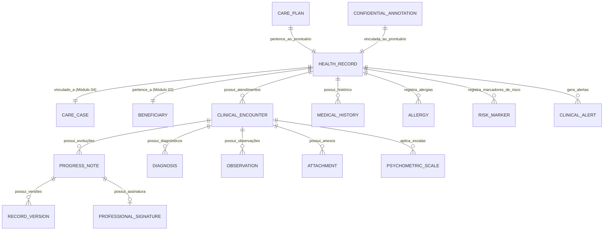

# MÓDULO 05 — PRONTUÁRIO ELETRÔNICO UNIFICADO (PEU), EVOLUÇÃO MULTIPROFISSIONAL E HISTÓRICO ASSISTENCIAL
## AURA UNIFIED HEALTH RECORD PLATFORM — PROMPT 20
### Plataforma Integrada Aura · Instituto Ser Melhor (ISMCL)
**Papel Assumido**: Chief Health Information Officer (CHIO) · Chief Clinical Architect · Enterprise Healthcare Architect · Principal Backend & Frontend Engineer · Especialista em FHIR R4/R5, HL7, CID-11, CIAP-2, LGPD, Assinatura Digital, Saúde Mental, Psicologia, Psiquiatria, Assistência Social

---

## SUMÁRIO EXECUTIVO

O **Módulo 05 — Aura Unified Health Record Platform (PEU)** é o **Núcleo Documental** da Plataforma Aura. Ele centraliza toda a produção clínica, psicológica, psiquiátrica e social em um único prontuário longitudinal imutável, multiprofissional, auditável e com interoperabilidade FHIR R4/R5.

Cada evolução registrada é **assinada digitalmente** pelo profissional, **versionada** (histórico preservado para sempre) e **criptografada** (AES-256-GCM por campo). O mecanismo **Break the Glass** permite acesso emergencial auditado a prontuários protegidos.

---

## ETAPA 1 — AUDITORIA ARQUITETURAL COMPLETA (PROMPTS 00 A 19)

### 1.1 Inventário do Estado Atual — Código Real Auditado

| Arquivo | Linhas | Status | Diagnóstico |
|---|---|---|---|
| `src/pages/Records.tsx` | 972 | ⚠️ CRÍTICO | Gerencia "casos" em `localStorage.clinical_cases_list`. Cria registros de beneficiários paralelos (`patients_list`) violando MDM SSOT. Sem prontuário real — só metadados de caso. Sem versão, sem assinatura, sem criptografia. |
| `src/contexts/ProfessionalPortalContext.tsx` | 716 | ⚠️ PARCIAL | `PatientEvolution` tem campos `isSigned`, `auditHash` — mas sem versionamento real, sem criptografia, persistência em memória. |
| `src/contexts/BeneficiaryPortalContext.tsx` | 758 | ⚠️ PARCIAL | `PortalDocument` (RECEITA, LAUDO, RELATORIO) sem integração com módulo de prontuário real. |

### 1.2 Vulnerabilidades Críticas e Correções Mandatórias

> [!CAUTION]
> **VULN-HEA-001 — VIOLAÇÃO P04 + P06 (DADOS + SEGURANÇA)**: `Records.tsx` persiste casos clínicos em `localStorage.clinical_cases_list`. O campo `reason` contém narrativas clínicas sensíveis (ex: "Encaminhamento urgente da Defensoria Pública para proteção integral, acolhimento psicossocial...") em texto plano. Dados de saúde mental (LGPD Art. 11) nunca podem residir em storage de cliente.
> **Correção**: Migração completa para `POST /api/v1/health-records/encounters` com AES-256-GCM.

> [!CAUTION]
> **VULN-HEA-002 — VIOLAÇÃO P02 (DDD/SSOT)**: `Records.tsx` linha 226 cria registros de beneficiários novos em `patients_list` dentro do módulo de prontuário — dupla violação do MDM SSOT do Módulo 02. A função `handleOpenCaseSubmit()` chama `localStorage.setItem('patients_list', ...)`.
> **Correção**: `Records.tsx` consultará apenas `GET /citizen/persons/:id` do Módulo 02 — sem criação paralela de pessoas.

> [!WARNING]
> **VULN-HEA-003 — VIOLAÇÃO P07 (BACKEND)**: `ProfessionalPortalContext.tsx` possui `PatientEvolution.auditHash` calculado em frontend — hash de auditoria nunca pode ser gerado no cliente (vulnerável a manipulação). O `isSigned` é um booleano sem validação criptográfica real.
> **Correção**: `auditHash` calculado pelo backend com HMAC-SHA256 sobre o conteúdo + timestamp + professionalId. `isSigned` verificado via `GET /health-records/:id/signature/verify`.

### 1.3 Pontos Positivos Preservados

- `ProfessionalPortalContext.PatientEvolution`: campos `diagnosticsCode` (CID-11), `isSigned`, `auditHash` — a semântica é correta, apenas a implementação precisa migrar para o backend.
- `Records.tsx`: UX de abertura de caso, designação de profissional, alta e reabertura — toda a lógica de estados do caso (`triagem → acolhimento → acompanhamento → revisao → alta`) é bem modelada e será preservada no Módulo 04 (migrado no Prompt 19).
- `BeneficiaryPortalContext.PortalDocument`: tipos de documento (`RECEITA, ATESTADO, LAUDO, RELATORIO`) usados como base para `DocumentTypeEnum`.

### 1.4 Divisão de Responsabilidades PEU vs Módulo 04

> [!IMPORTANT]
> **Separação Arquitetural Crítica**:
> - **Módulo 04 (CareCase)**: Ciclo de vida do caso — abertura, equipe, alta, status. É o container.
> - **Módulo 05 (PEU)**: Conteúdo clínico — evoluções, diagnósticos, escalas, planos, documentos. É o registro.
> O `HealthRecord` está sempre vinculado a um `CareCase` (Módulo 04) via `careCaseId`.

---

## ETAPA 2 — MODELAGEM COMPLETA DO DOMÍNIO (DDD TACTICAL DESIGN)

### 2.1 Diagrama ER Conceitual



### 2.2 Entidades do Domínio (24 Entidades Completas)

#### 2.2.1 `HealthRecord` — Aggregate Root (Prontuário Raiz)

```
HealthRecord {
  id: UUID [PK]
  recordNumber: String UNIQUE NOT NULL  -- PEU-YYYY-NNNNN
  careCaseId: UUID NOT NULL UNIQUE FK care.cases -- Exatamente 1 prontuário por caso
  beneficiaryPersonId: UUID NOT NULL FK citizen.persons
  organizationId: UUID FK organizations
  status: RecordStatusEnum             -- ACTIVE, SUSPENDED, DISCHARGED, ARCHIVED
  openedAt: Timestamp NOT NULL
  openedBy: UUID FK auth.users
  archivedAt: Timestamp?
  retentionUntil: Date NOT NULL        -- LGPD: data de retenção legal (20 anos para saúde)
  fhirPatientId: String?               -- ID no servidor FHIR (interoperabilidade futura)
  encKeyId: String NOT NULL
}
```

**Invariantes**:
- `INV-HEA-001`: Exatamente 1 `HealthRecord` por `CareCase` (UNIQUE constraint).
- `INV-HEA-002`: `HealthRecord` nunca pode ser deletado — apenas arquivado após o prazo de retenção legal.
- `INV-HEA-003`: Acesso a `HealthRecord` com `isProtectedCase = true` exige `clearanceLevel >= 3` (ABAC) ou Break-the-Glass documentado.

---

#### 2.2.2 `ClinicalEncounter` — Entity (Atendimento Clínico)

```
ClinicalEncounter {
  id: UUID [PK]
  encounterNumber: String UNIQUE NOT NULL  -- ATD-YYYY-NNNNN
  healthRecordId: UUID NOT NULL FK health_records
  appointmentId: UUID NOT NULL FK care.appointments -- Vínculo 1:1 com o agendamento
  professionalId: UUID NOT NULL FK auth.professionals
  encounterType: EncounterTypeEnum     -- PSYCHOLOGY, PSYCHIATRY, SOCIAL_WORK,
                                        -- MEDICINE, NURSING, LEGAL, PEDAGOGICAL
  startedAt: Timestamp NOT NULL
  completedAt: Timestamp?
  durationMinutes: Int?
  modality: ModalityEnum               -- IN_PERSON, TELEHEALTH, HOME_VISIT
  status: EncounterStatusEnum          -- IN_PROGRESS, COMPLETED, VOIDED
  voidedAt: Timestamp?
  voidedBy: UUID? FK auth.users
  voidedReason: Text?
  fhirEncounterId: String?
}
```

---

#### 2.2.3 `ProgressNote` — Entity (Evolução Clínica — Núcleo do PEU)

```
ProgressNote {
  id: UUID [PK]
  noteNumber: String UNIQUE NOT NULL   -- EVO-YYYY-NNNNN
  encounterId: UUID NOT NULL FK clinical_encounters
  healthRecordId: UUID NOT NULL FK health_records
  authorId: UUID NOT NULL FK auth.professionals
  authorRole: ProfessionalRoleEnum     -- PSYCHOLOGIST, PSYCHIATRIST, SOCIAL_WORKER, etc.
  noteType: NoteTypeEnum               -- SOAP, BIRP, DAP, FREE_TEXT,
                                        -- PSYCHOLOGICAL_EVOLUTION, PSYCHIATRIC_EVOLUTION,
                                        -- SOCIAL_WORK_EVOLUTION, MENTAL_STATUS_EXAM
  -- Conteúdo criptografado por campo (AES-256-GCM)
  contentEncrypted: BYTEA NOT NULL     -- Conteúdo principal (JSON estruturado por tipo)
  contentHash: String NOT NULL         -- SHA-256 do conteúdo decriptado (verificação de integridade)
  previousHash: String?                -- Hash da nota anterior na cadeia (Merkle-like)
  -- Classificação Diagnóstica
  icdCodes: String[]                   -- CID-11 (ex: ['6A70', '6B41'])
  icpcCodes: String[]                  -- CIAP-2
  tussCodes: String[]                  -- TUSS (procedimentos)
  -- Versionamento
  version: Int NOT NULL DEFAULT 1
  isLatestVersion: Boolean NOT NULL DEFAULT TRUE
  supersededById: UUID? FK progress_notes  -- Versão mais nova que substitui esta
  -- Assinatura Digital
  isSigned: Boolean NOT NULL DEFAULT FALSE
  signedAt: Timestamp?
  -- Visibilidade
  isConfidential: Boolean NOT NULL DEFAULT FALSE  -- Anotação sigilosa
  visibleRoles: ProfessionalRoleEnum[]            -- Quais papéis podem ver
  encKeyId: String NOT NULL
}
```

---

#### 2.2.4 Modelos de Evolução Estruturados (JSON Schema por tipo)

**Modelo SOAP** (Subjetivo · Objetivo · Avaliação · Plano):
```json
{
  "noteType": "SOAP",
  "subjective": "Relato do beneficiário em suas próprias palavras sobre o estado atual.",
  "objective": "Observações clínicas objetivas do profissional (comportamento, aparência, afeto).",
  "assessment": "Avaliação clínica/diagnóstica. Hipóteses e diagnósticos formais.",
  "plan": "Plano terapêutico para próximo período. Encaminhamentos, prescrições, retornos.",
  "icdCodes": ["6A70"],
  "nextSessionGoals": ["Trabalhar regulação emocional", "Psicoeducação sobre ansiedade"]
}
```

**Modelo de Evolução Psicológica** (Específico para Psicólogos — Res. CFP 01/2009):
```json
{
  "noteType": "PSYCHOLOGICAL_EVOLUTION",
  "sessionNumber": 12,
  "therapeuticApproach": "TCC",
  "sessionSummary": "Relato e condução da sessão.",
  "behavioralObservations": "Comportamento observado, afeto, pensamentos relatados.",
  "therapeuticProgress": "Progresso em relação aos objetivos terapêuticos.",
  "riskAssessment": "Avaliação de risco (suicídio, autolesão, violência): AUSENTE/PRESENTE",
  "nextSessionPlan": "Planejamento da próxima sessão.",
  "icdCodes": ["6A70", "6B41"]
}
```

**Modelo de Exame do Estado Mental (EEM)** (Psiquiatria):
```json
{
  "noteType": "MENTAL_STATUS_EXAM",
  "appearance": "Asseado, colaborativo, olho a olho mantido.",
  "behavior": "Cooperativo, sem agitação psicomotora.",
  "speechRate": "Normal",
  "moodAffect": "Humor deprimido, afeto embotado.",
  "thoughtProcess": "Curso lógico, sem aceleração. Conteúdo com ruminações.",
  "perceptions": "Sem alterações sensoperceptivas relatadas.",
  "cognition": "Atenção levemente reduzida. Memória imediata preservada.",
  "insight": "Parcial",
  "judgment": "Preservado",
  "suicideRisk": "PRESENT_NO_PLAN",
  "pharmacologicalPlan": "Manutenção de Sertralina 50mg/dia.",
  "icdCodes": ["6A71"]
}
```

**Modelo de Evolução Social** (Assistência Social — CRAS/CREAS):
```json
{
  "noteType": "SOCIAL_WORK_EVOLUTION",
  "socialSituation": "Situação habitacional, familiar, econômica atual.",
  "socialNetworkAnalysis": "Redes de suporte: família, comunidade, serviços públicos.",
  "vulnerabilityFactors": ["Renda abaixo do mínimo", "Histórico de violência"],
  "protectiveFactors": ["Apoio familiar", "Vínculo institucional"],
  "interventionsDone": "Ações realizadas neste encontro.",
  "referralsMade": ["CREAS", "PAIF"],
  "socialCarePlan": "Objetivos e estratégias do plano social.",
  "nextVisitDate": "2025-08-01"
}
```

---

#### 2.2.5 `ProfessionalSignature` — Value Object (Assinatura Digital)

```
ProfessionalSignature {
  id: UUID [PK]
  progressNoteId: UUID NOT NULL FK progress_notes UNIQUE
  professionalId: UUID NOT NULL FK auth.professionals
  professionalName: String NOT NULL           -- Snapshot do nome no momento da assinatura
  professionalCouncilCode: String NOT NULL    -- CRP, CRM, CRESS no momento da assinatura
  signatureHash: String NOT NULL              -- HMAC-SHA256(noteContent + noteId + professionalId + signedAt)
  signedAt: Timestamp NOT NULL
  ipAddress: String NOT NULL                  -- IP do dispositivo de assinatura
  deviceFingerprint: String NOT NULL          -- User-Agent hash
  isValid: Boolean NOT NULL DEFAULT TRUE      -- Invalidado se nota for retificada
}
```

---

#### 2.2.6 `RecordVersion` — Entity (Versionamento Imutável)

```
RecordVersion {
  id: UUID [PK]
  progressNoteId: UUID NOT NULL FK progress_notes
  version: Int NOT NULL
  contentSnapshot: BYTEA NOT NULL     -- Cópia criptografada do conteúdo nesta versão
  changedBy: UUID NOT NULL FK auth.professionals
  changedAt: Timestamp NOT NULL
  changeReason: Text NOT NULL          -- Justificativa OBRIGATÓRIA para qualquer edição
  changeType: ChangeTypeEnum           -- CORRECTION, ADDENDUM, RETRACTION
  CONSTRAINT uq_note_version UNIQUE (progress_note_id, version)
}
```

---

#### 2.2.7 `CarePlan` — Entity (Plano Terapêutico)

```
CarePlan {
  id: UUID [PK]
  healthRecordId: UUID NOT NULL FK health_records UNIQUE  -- 1 plano ativo por prontuário
  version: Int NOT NULL DEFAULT 1
  status: CarePlanStatusEnum           -- DRAFT, ACTIVE, REVISED, COMPLETED
  clinicalObjectives: JSONB            -- Array de objetivos terapêuticos com status
  socialObjectives: JSONB
  interventionStrategies: Text?
  expectedDurationWeeks: Int?
  reviewDate: Date?
  createdBy: UUID FK auth.professionals
  approvedBy: UUID? FK auth.professionals  -- Supervisor/coordenador
  approvedAt: Timestamp?
  contentEncrypted: BYTEA NOT NULL
  encKeyId: String NOT NULL
  updatedAt: Timestamp NOT NULL
}
```

---

#### 2.2.8 Demais Entidades

```
Diagnosis {
  id, encounterId, healthRecordId, icdCode, icdDescription,
  diagnosisType: PRIMARY|SECONDARY|DIFFERENTIAL, status: PROVISIONAL|CONFIRMED|RULED_OUT,
  diagnosticianId, diagnosedAt, notes: BYTEA
}

PsychometricScale {
  id, encounterId, healthRecordId, scaleType: PHQ9|GAD7|CSSRS|AUDIT|PCL5|HAMILTON,
  appliedBy, appliedAt, scoresJson: JSONB, totalScore: Int, interpretation: Text,
  clinicalSignificance: MINIMAL|MILD|MODERATE|SEVERE|EXTREME
}

MedicalHistory { id, healthRecordId, historyType: PERSONAL|FAMILY|SURGICAL|PSYCHIATRIC,
  contentEncrypted: BYTEA, recordedBy, recordedAt, encKeyId }

Allergy { id, healthRecordId, allergenName, allergenType: MEDICATION|FOOD|ENVIRONMENTAL,
  reactionDescription, severity: MILD|MODERATE|SEVERE|ANAPHYLAXIS, status: ACTIVE|INACTIVE }

RiskMarker { id, healthRecordId, markerType: SUICIDE_RISK|VIOLENCE_RISK|SUBSTANCE_USE|
  CHILD_ABUSE|SELF_HARM|FLIGHT_RISK, severity, isActive, identifiedBy, identifiedAt,
  resolvedAt, notes }

ClinicalAlert { id, healthRecordId, alertType, description, severity, createdBy,
  createdAt, resolvedAt, resolvedBy, isActive }

Observation { id, encounterId, observationType: VITAL_SIGNS|BEHAVIORAL|FUNCTIONAL,
  contentJson: JSONB, recordedAt, recordedBy }

Attachment { id, encounterId, healthRecordId, fileName, mimeType, fileSizeBytes,
  storageKey, checksum, documentType: DocumentTypeEnum, uploadedBy, uploadedAt,
  isConfidential }

ConfidentialAnnotation { id, healthRecordId, authorId, contentEncrypted: BYTEA,
  visibleToRoles: ProfessionalRoleEnum[], createdAt, encKeyId }

RecordAudit { id, healthRecordId, progressNoteId?, action: RecordAuditActionEnum,
  actorId, actorRole, ipAddress, accessContext: NORMAL|BREAK_THE_GLASS,
  breakGlassReason?, occurredAt }

FhirResourceSnapshot { id, healthRecordId, resourceType: FHIR_ResourceTypeEnum,
  fhirResourceId, resourceJson: JSONB, exportedAt, fhirVersion: R4|R5 }
```

---

## ETAPA 3 — PRONTUÁRIO LONGITUDINAL (NAVEGAÇÃO E ESTRUTURA)

### 3.1 Organização da Timeline Clínica

O PEU é visualizado em 3 camadas sobrepostas:

```
TIMELINE LONGITUDINAL DO PRONTUÁRIO
│
├── [NÍVEL 1 — EPISÓDIOS DE CUIDADO]
│   ├── Episódio 1: Jul 2025 – Out 2025 (Acolhimento Inicial)
│   │   ├── [NÍVEL 2 — ATENDIMENTOS]
│   │   │   ├── Atend. 1 (21/Jul/2025) — Psicóloga Dra. Elena
│   │   │   │   └── [NÍVEL 3 — REGISTROS]
│   │   │   │       ├── Evolução SOAP (assinada 21/07 16:42)
│   │   │   │       ├── PHQ-9 aplicado: Score 14 (Moderado)
│   │   │   │       └── Diagnóstico CID-11: 6A70 (Confirmed)
│   │   │   └── Atend. 2 (28/Jul/2025) — Assistente Social Pedro
│   │   │       └── Evolução Social (assinada 28/07 18:10)
│   └── Episódio 2: Nov 2025 (Reabertura)
│       └── ...
```

---

## ETAPA 4 — EVOLUÇÃO MULTIPROFISSIONAL E SIGILO PROFISSIONAL

### 4.1 Matriz de Acesso por Papel Profissional

| Papel Profissional | Ler Evolução Psi | Ler EEM | Ler Evolução Social | Criar Evolução | Ver Conf. Anotação |
|---|---|---|---|---|---|
| Psicólogo (do caso) | ✅ | ✅ Parcial | ✅ | ✅ SOAP/PSICO | ✅ (próprias) |
| Psiquiatra | ✅ | ✅ Completo | ✅ | ✅ EEM/SOAP | ✅ (próprias) |
| Assistente Social | ✅ Resumo | ❌ | ✅ | ✅ SOCIAL | ✅ (próprias) |
| Coordenador Técnico | ✅ | ✅ | ✅ | ✅ | ✅ (todas) |
| Advogado | ❌ | ❌ | ✅ Resumo | ✅ LEGAL | ❌ |
| Auditor Interno | ✅ Hash/Meta | ✅ Hash/Meta | ✅ Hash/Meta | ❌ | ❌ |
| Beneficiário | ✅ Resumo | ❌ | ✅ Resumo | ❌ | ❌ |

### 4.2 Sigilo Profissional por Legislação

| Profissão | Norma | Impacto no PEU |
|---|---|---|
| Psicólogo | Resolução CFP 01/2009 | `isConfidential = true` por padrão para conteúdo psicoterápico; `visibleRoles = [PSYCHOLOGIST, COORDINATOR]` |
| Psiquiatra | CFM | Conteúdo médico acessível apenas à equipe clínica com `clearanceLevel >= 2` |
| Assistente Social | CFESS Res. 493/2006 | Relatórios sociais: visíveis para equipe, não para psicólogos sem consentimento |
| Advogado | OAB | Anotações jurídicas com sigilo absoluto (`visibleRoles = [LEGAL, COORDINATOR]`) |

---

## ETAPA 5 — BANCO DE DADOS (POSTGRESQL 16 — SCHEMA `health_record`)

```sql
-- =========================================================================
-- AURA UNIFIED HEALTH RECORD PLATFORM — SCHEMA health_record
-- PostgreSQL 16 · Referencia care.cases (Módulo 04), citizen.persons (Módulo 02)
-- =========================================================================

CREATE SCHEMA IF NOT EXISTS health_record;

-- ENUMERAÇÕES
CREATE TYPE health_record.encounter_type AS ENUM (
  'PSYCHOLOGY', 'PSYCHIATRY', 'SOCIAL_WORK', 'MEDICINE', 'NURSING', 'LEGAL', 'PEDAGOGICAL', 'GROUP'
);
CREATE TYPE health_record.note_type AS ENUM (
  'SOAP', 'BIRP', 'DAP', 'FREE_TEXT', 'PSYCHOLOGICAL_EVOLUTION',
  'PSYCHIATRIC_EVOLUTION', 'SOCIAL_WORK_EVOLUTION', 'MENTAL_STATUS_EXAM',
  'NURSING_NOTE', 'LEGAL_NOTE', 'GROUP_NOTE'
);
CREATE TYPE health_record.scale_type AS ENUM (
  'PHQ9', 'GAD7', 'CSSRS', 'AUDIT', 'PCL5', 'HAMILTON_DEPRESSION',
  'HAMILTON_ANXIETY', 'BECK_DEPRESSION', 'YOUNG_MANIA', 'BPRS', 'CUSTOM'
);
CREATE TYPE health_record.diagnosis_type AS ENUM ('PRIMARY', 'SECONDARY', 'DIFFERENTIAL');
CREATE TYPE health_record.diagnosis_status AS ENUM ('PROVISIONAL', 'CONFIRMED', 'RULED_OUT');
CREATE TYPE health_record.change_type AS ENUM ('CORRECTION', 'ADDENDUM', 'RETRACTION');
CREATE TYPE health_record.record_audit_action AS ENUM (
  'RECORD_OPENED', 'NOTE_CREATED', 'NOTE_SIGNED', 'NOTE_EDITED', 'NOTE_VOIDED',
  'DIAGNOSIS_ADDED', 'SCALE_APPLIED', 'ATTACHMENT_UPLOADED', 'BREAK_THE_GLASS_ACCESS',
  'EXPORT_FHIR', 'RECORD_ACCESSED'
);

-- ─────────────────────────────────────────────────────────────────────────
-- TABELA: health_record.records (Aggregate Root)
-- ─────────────────────────────────────────────────────────────────────────
CREATE TABLE health_record.records (
  id                  UUID PRIMARY KEY DEFAULT gen_random_uuid(),
  record_number       VARCHAR(30) UNIQUE NOT NULL,   -- PEU-2025-00001
  care_case_id        UUID NOT NULL UNIQUE REFERENCES care.cases(id) ON DELETE RESTRICT,
  beneficiary_person_id UUID NOT NULL REFERENCES citizen.persons(id) ON DELETE RESTRICT,
  organization_id     UUID NOT NULL REFERENCES organizations(id),
  status              VARCHAR(50) NOT NULL DEFAULT 'ACTIVE',
  opened_at           TIMESTAMPTZ NOT NULL DEFAULT CURRENT_TIMESTAMP,
  opened_by           UUID NOT NULL REFERENCES auth.users(id),
  archived_at         TIMESTAMPTZ,
  retention_until     DATE NOT NULL,  -- LGPD: 20 anos para dados de saúde
  fhir_patient_id     VARCHAR(255),
  enc_key_id          VARCHAR(100) NOT NULL
);

-- ─────────────────────────────────────────────────────────────────────────
-- TABELA: health_record.encounters (Atendimentos)
-- ─────────────────────────────────────────────────────────────────────────
CREATE TABLE health_record.encounters (
  id                UUID PRIMARY KEY DEFAULT gen_random_uuid(),
  encounter_number  VARCHAR(30) UNIQUE NOT NULL,    -- ATD-2025-00001
  health_record_id  UUID NOT NULL REFERENCES health_record.records(id),
  appointment_id    UUID NOT NULL UNIQUE REFERENCES care.appointments(id),
  professional_id   UUID NOT NULL REFERENCES auth.professionals(id),
  encounter_type    health_record.encounter_type NOT NULL,
  started_at        TIMESTAMPTZ NOT NULL,
  completed_at      TIMESTAMPTZ,
  duration_minutes  INT,
  modality          VARCHAR(50) NOT NULL,
  status            VARCHAR(50) NOT NULL DEFAULT 'IN_PROGRESS',
  voided_at         TIMESTAMPTZ,
  voided_by         UUID REFERENCES auth.users(id),
  voided_reason     TEXT,
  fhir_encounter_id VARCHAR(255)
);

-- ─────────────────────────────────────────────────────────────────────────
-- TABELA: health_record.progress_notes (Núcleo do PEU)
-- ─────────────────────────────────────────────────────────────────────────
CREATE TABLE health_record.progress_notes (
  id                 UUID PRIMARY KEY DEFAULT gen_random_uuid(),
  note_number        VARCHAR(30) UNIQUE NOT NULL,   -- EVO-2025-00001
  encounter_id       UUID NOT NULL REFERENCES health_record.encounters(id),
  health_record_id   UUID NOT NULL REFERENCES health_record.records(id),
  author_id          UUID NOT NULL REFERENCES auth.professionals(id),
  author_role        VARCHAR(100) NOT NULL,
  note_type          health_record.note_type NOT NULL,
  -- Conteúdo (criptografado AES-256-GCM)
  content_encrypted  BYTEA NOT NULL,
  content_hash       VARCHAR(64) NOT NULL,   -- SHA-256 do conteúdo decriptado
  previous_hash      VARCHAR(64),            -- Hash da nota anterior (cadeia Merkle-like)
  -- Classificações
  icd_codes          TEXT[],
  icpc_codes         TEXT[],
  tuss_codes         TEXT[],
  -- Versionamento
  version            INT NOT NULL DEFAULT 1,
  is_latest_version  BOOLEAN NOT NULL DEFAULT TRUE,
  superseded_by_id   UUID REFERENCES health_record.progress_notes(id),
  -- Assinatura
  is_signed          BOOLEAN NOT NULL DEFAULT FALSE,
  signed_at          TIMESTAMPTZ,
  -- Visibilidade
  is_confidential    BOOLEAN NOT NULL DEFAULT FALSE,
  visible_roles      TEXT[],
  enc_key_id         VARCHAR(100) NOT NULL,
  created_at         TIMESTAMPTZ NOT NULL DEFAULT CURRENT_TIMESTAMP,
  updated_at         TIMESTAMPTZ NOT NULL DEFAULT CURRENT_TIMESTAMP
);

-- ─────────────────────────────────────────────────────────────────────────
-- TABELA: health_record.record_versions (Versionamento Imutável)
-- ─────────────────────────────────────────────────────────────────────────
CREATE TABLE health_record.record_versions (
  id               UUID PRIMARY KEY DEFAULT gen_random_uuid(),
  progress_note_id UUID NOT NULL REFERENCES health_record.progress_notes(id),
  version          INT NOT NULL,
  content_snapshot BYTEA NOT NULL,   -- Snapshot criptografado nesta versão
  changed_by       UUID NOT NULL REFERENCES auth.professionals(id),
  changed_at       TIMESTAMPTZ NOT NULL DEFAULT CURRENT_TIMESTAMP,
  change_reason    TEXT NOT NULL,    -- OBRIGATÓRIO
  change_type      health_record.change_type NOT NULL,
  CONSTRAINT uq_note_version UNIQUE (progress_note_id, version)
);

-- ─────────────────────────────────────────────────────────────────────────
-- TABELA: health_record.professional_signatures
-- ─────────────────────────────────────────────────────────────────────────
CREATE TABLE health_record.professional_signatures (
  id                       UUID PRIMARY KEY DEFAULT gen_random_uuid(),
  progress_note_id         UUID NOT NULL UNIQUE REFERENCES health_record.progress_notes(id),
  professional_id          UUID NOT NULL REFERENCES auth.professionals(id),
  professional_name        VARCHAR(255) NOT NULL,     -- Snapshot
  professional_council_code VARCHAR(100) NOT NULL,   -- CRP/CRM/CRESS Snapshot
  signature_hash           VARCHAR(128) NOT NULL,    -- HMAC-SHA256(content+noteId+profId+signedAt)
  signed_at                TIMESTAMPTZ NOT NULL,
  ip_address               VARCHAR(45) NOT NULL,
  device_fingerprint       VARCHAR(255) NOT NULL,
  is_valid                 BOOLEAN NOT NULL DEFAULT TRUE
);

-- ─────────────────────────────────────────────────────────────────────────
-- TABELA: health_record.diagnoses
-- ─────────────────────────────────────────────────────────────────────────
CREATE TABLE health_record.diagnoses (
  id               UUID PRIMARY KEY DEFAULT gen_random_uuid(),
  encounter_id     UUID NOT NULL REFERENCES health_record.encounters(id),
  health_record_id UUID NOT NULL REFERENCES health_record.records(id),
  icd_code         VARCHAR(20) NOT NULL,   -- CID-11 (ex: 6A70)
  icd_description  VARCHAR(500) NOT NULL,
  diagnosis_type   health_record.diagnosis_type NOT NULL,
  status           health_record.diagnosis_status NOT NULL DEFAULT 'PROVISIONAL',
  diagnostician_id UUID NOT NULL REFERENCES auth.professionals(id),
  diagnosed_at     TIMESTAMPTZ NOT NULL,
  notes            BYTEA,
  enc_key_id       VARCHAR(100) NOT NULL
);

-- ─────────────────────────────────────────────────────────────────────────
-- TABELA: health_record.psychometric_scales
-- ─────────────────────────────────────────────────────────────────────────
CREATE TABLE health_record.psychometric_scales (
  id                    UUID PRIMARY KEY DEFAULT gen_random_uuid(),
  encounter_id          UUID NOT NULL REFERENCES health_record.encounters(id),
  health_record_id      UUID NOT NULL REFERENCES health_record.records(id),
  scale_type            health_record.scale_type NOT NULL,
  applied_by            UUID NOT NULL REFERENCES auth.professionals(id),
  applied_at            TIMESTAMPTZ NOT NULL,
  scores_json           JSONB NOT NULL,    -- Respostas item a item
  total_score           INT NOT NULL,
  interpretation        TEXT NOT NULL,
  clinical_significance VARCHAR(50) NOT NULL
);

-- ─────────────────────────────────────────────────────────────────────────
-- TABELA: health_record.care_plans
-- ─────────────────────────────────────────────────────────────────────────
CREATE TABLE health_record.care_plans (
  id                       UUID PRIMARY KEY DEFAULT gen_random_uuid(),
  health_record_id         UUID NOT NULL REFERENCES health_record.records(id),
  version                  INT NOT NULL DEFAULT 1,
  status                   VARCHAR(50) NOT NULL DEFAULT 'DRAFT',
  clinical_objectives      JSONB,
  social_objectives        JSONB,
  intervention_strategies  TEXT,
  expected_duration_weeks  INT,
  review_date              DATE,
  created_by               UUID NOT NULL REFERENCES auth.professionals(id),
  approved_by              UUID REFERENCES auth.professionals(id),
  approved_at              TIMESTAMPTZ,
  content_encrypted        BYTEA NOT NULL,
  enc_key_id               VARCHAR(100) NOT NULL,
  updated_at               TIMESTAMPTZ NOT NULL DEFAULT CURRENT_TIMESTAMP
);

-- ─────────────────────────────────────────────────────────────────────────
-- TABELA: health_record.record_audits (Trilha Imutável — sem UPDATE/DELETE)
-- ─────────────────────────────────────────────────────────────────────────
CREATE TABLE health_record.record_audits (
  id                   UUID PRIMARY KEY DEFAULT gen_random_uuid(),
  health_record_id     UUID NOT NULL REFERENCES health_record.records(id),
  progress_note_id     UUID REFERENCES health_record.progress_notes(id),
  action               health_record.record_audit_action NOT NULL,
  actor_id             UUID NOT NULL REFERENCES auth.users(id),
  actor_role           VARCHAR(100) NOT NULL,
  ip_address           VARCHAR(45) NOT NULL,
  access_context       VARCHAR(50) NOT NULL DEFAULT 'NORMAL',  -- NORMAL | BREAK_THE_GLASS
  break_glass_reason   TEXT,
  metadata             JSONB,
  occurred_at          TIMESTAMPTZ NOT NULL DEFAULT CURRENT_TIMESTAMP
);
-- CRITICAL: REGRA NO BANCO — Proibir UPDATE e DELETE na tabela record_audits
REVOKE UPDATE, DELETE ON health_record.record_audits FROM PUBLIC;
REVOKE UPDATE, DELETE ON health_record.record_audits FROM aura_app_role;

-- ─────────────────────────────────────────────────────────────────────────
-- ÍNDICES DE ALTA PERFORMANCE
-- ─────────────────────────────────────────────────────────────────────────
CREATE INDEX idx_records_beneficiary ON health_record.records (beneficiary_person_id);
CREATE INDEX idx_encounters_record ON health_record.encounters (health_record_id, started_at DESC);
CREATE INDEX idx_notes_encounter ON health_record.progress_notes (encounter_id);
CREATE INDEX idx_notes_record_timeline ON health_record.progress_notes (health_record_id, created_at DESC)
  WHERE is_latest_version = TRUE;
CREATE INDEX idx_notes_unsigned ON health_record.progress_notes (health_record_id)
  WHERE is_signed = FALSE;
CREATE INDEX idx_diagnoses_icd ON health_record.diagnoses (icd_code, health_record_id);
CREATE INDEX idx_scales_type ON health_record.psychometric_scales (scale_type, health_record_id);
CREATE INDEX idx_audits_break_glass ON health_record.record_audits (health_record_id)
  WHERE access_context = 'BREAK_THE_GLASS';
CREATE INDEX idx_risk_markers_active ON health_record.risk_markers (health_record_id)
  WHERE is_active = TRUE;
```

---

## ETAPA 6 — BACKEND ARCHITECTURE (`apps/ms-health-record`)

### 6.1 Estrutura de Diretórios

```
apps/ms-health-record/
├── src/
│   ├── main.ts
│   ├── app.module.ts
│   ├── controllers/
│   │   ├── health-record.controller.ts
│   │   ├── encounter.controller.ts
│   │   ├── progress-note.controller.ts
│   │   ├── care-plan.controller.ts
│   │   ├── psychometric-scale.controller.ts
│   │   ├── attachment.controller.ts
│   │   └── fhir-export.controller.ts
│   ├── use-cases/
│   │   ├── commands/
│   │   │   ├── create-health-record/      -- Consome AppointmentCompletedEvent
│   │   │   ├── create-progress-note/
│   │   │   ├── edit-progress-note/        -- Gera RecordVersion
│   │   │   ├── sign-progress-note/        -- Gera ProfessionalSignature
│   │   │   ├── void-encounter/
│   │   │   ├── apply-psychometric-scale/
│   │   │   ├── add-diagnosis/
│   │   │   ├── create-care-plan/
│   │   │   ├── break-the-glass/           -- Acesso de emergência auditado
│   │   │   └── export-fhir-bundle/
│   │   └── queries/
│   │       ├── get-health-record/
│   │       ├── get-clinical-timeline/
│   │       ├── search-clinical-history/
│   │       └── get-unsigned-notes/
│   └── event-handlers/
│       └── appointment-completed.handler.ts

libs/domain/health-record/
├── aggregates/
│   └── health-record.aggregate.ts
├── engines/
│   ├── signature.engine.ts              -- HMAC-SHA256 + cadeia de hashes
│   ├── fhir-mapper.engine.ts            -- Conversor PEU → FHIR R4/R5 Bundle
│   └── clinical-ai.service.ts          -- Integração LangGraph (resumo + análise)
├── events/
│   ├── health-record-opened.event.ts
│   ├── progress-note-signed.event.ts
│   └── risk-marker-activated.event.ts
└── policies/
    ├── break-the-glass.policy.ts
    ├── record-access.policy.ts          -- ABAC: acesso por papel + equipe de cuidado
    └── confidentiality.policy.ts        -- Verificação de anotações sigilosas
```

### 6.2 Mecanismo Break the Glass

```typescript
// libs/domain/health-record/policies/break-the-glass.policy.ts

export class BreakTheGlassPolicy {
  async execute(
    actorId: string,
    healthRecordId: string,
    reason: string,
    context: BreakGlassContextEnum,
  ): Promise<BreakGlassSession> {
    // 1. Verificar se o ator tem clearanceLevel >= 2 (exigido para BTG)
    const actor = await this.iamService.getUserWithClearance(actorId);
    if (actor.clearanceLevel < 2) throw new ForbiddenException('BTG requer clearanceLevel >= 2');

    // 2. Justificativa obrigatória
    if (!reason || reason.length < 30) throw new ValidationException('Justificativa mínima 30 caracteres');

    // 3. Registrar na trilha de auditoria REFORÇADA
    await this.auditRepo.create({
      healthRecordId,
      action: 'BREAK_THE_GLASS_ACCESS',
      actorId,
      actorRole: actor.role,
      accessContext: 'BREAK_THE_GLASS',
      breakGlassReason: reason,
      ipAddress: context.ipAddress,
      metadata: { context, requestedAt: new Date().toISOString() },
    });

    // 4. Notificar IMEDIATAMENTE: supervisor, CISO e DPO via RabbitMQ
    this.eventBus.publish(new BreakGlassAccessedEvent(healthRecordId, actorId, reason));

    // 5. Conceder acesso temporário por 60 minutos
    return this.sessionService.grantTemporaryAccess(actorId, healthRecordId, 60);
  }
}
```

### 6.3 Motor de Assinatura Digital

```typescript
// libs/domain/health-record/engines/signature.engine.ts

export class SignatureEngine {
  signProgressNote(
    noteContent: string,
    noteId: string,
    professional: ProfessionalSnapshot,
  ): ProfessionalSignatureDto {
    const signedAt = new Date().toISOString();
    const payload = `${noteContent}|${noteId}|${professional.id}|${signedAt}`;
    const signatureHash = createHmac('sha256', this.signingSecret)
      .update(payload)
      .digest('hex');

    return {
      professionalId: professional.id,
      professionalName: professional.name,
      professionalCouncilCode: professional.councilCode,
      signatureHash,
      signedAt,
      ipAddress: professional.ipAddress,
      deviceFingerprint: createHash('sha256').update(professional.userAgent).digest('hex'),
    };
  }

  verifySignature(note: ProgressNote, signature: ProfessionalSignature): boolean {
    const payload = `${note.contentDecrypted}|${note.id}|${signature.professionalId}|${signature.signedAt}`;
    const expectedHash = createHmac('sha256', this.signingSecret)
      .update(payload)
      .digest('hex');
    return timingSafeEqual(Buffer.from(expectedHash), Buffer.from(signature.signatureHash));
  }
}
```

---

## ETAPA 7 — OPENAPI 3.0 — 20 ENDPOINTS (`/api/v1/health-records`)

| Método | Endpoint | Descrição | Roles |
|---|---|---|---|
| `POST` | `/` | Criar prontuário (automático via AppointmentCompletedEvent) | system, admin |
| `GET` | `/:id` | Obter prontuário completo | care_team_member (ABAC) |
| `GET` | `/:id/timeline` | Timeline clínica cronológica paginada | care_team_member |
| `GET` | `/by-case/:careCaseId` | Buscar prontuário por caso | care_team_member |
| `POST` | `/:id/encounters` | Criar atendimento | professional (care_team) |
| `GET` | `/:id/encounters/:eid` | Detalhe do atendimento | care_team_member |
| `POST` | `/:id/encounters/:eid/notes` | Criar evolução clínica | professional (encounter_author) |
| `PUT` | `/:id/notes/:nid` | Editar evolução (gera RecordVersion) | note_author (pre_sign only) |
| `POST` | `/:id/notes/:nid/sign` | Assinar evolução digitalmente | note_author |
| `POST` | `/:id/notes/:nid/void` | Anular nota com justificativa | coordinator, admin |
| `GET` | `/:id/notes/:nid/history` | Histórico de versões da nota | auditor, coordinator |
| `POST` | `/:id/encounters/:eid/scales` | Aplicar escala psicométrica | psychologist, psychiatrist |
| `POST` | `/:id/encounters/:eid/diagnoses` | Registrar diagnóstico CID-11 | medical_professional |
| `GET` | `/:id/diagnoses` | Histórico diagnóstico completo | care_team_member |
| `POST` | `/:id/care-plan` | Criar/atualizar Plano Terapêutico | professional, coordinator |
| `POST` | `/:id/attachments` | Anexar documento | professional |
| `POST` | `/:id/break-the-glass` | Acesso emergencial auditado | clearanceLevel >= 2 |
| `POST` | `/:id/risk-markers` | Registrar marcador de risco | professional |
| `POST` | `/:id/export/fhir` | Exportar Bundle FHIR R4/R5 | admin, integration |
| `GET` | `/:id/unsigned-notes` | Listar evoluções não assinadas | coordinator, supervisor |

---

## ETAPA 8 — FRONTEND (MIGRAÇÃO E EXPANSÃO)

### 8.1 Diagnóstico de Migração

| Arquivo Atual | Ação | Descrição |
|---|---|---|
| `Records.tsx` | **REFATORAR** | Manter UI de lista de casos; migrar abertura/alta/reabertura para API `ms-care`. Remover criação de `patients_list`. |
| `ProfessionalPortalContext.tsx (PatientEvolution)` | **MIGRAR** | `PatientEvolution` → `ProgressNote` via `POST /health-records/:id/notes`. Hash real do backend. |
| `BeneficiaryPortalContext.tsx (PortalDocument)` | **INTEGRAR** | `PortalDocument` → `GET /health-records/:id/attachments` filtrado por `isAuthorized`. |

### 8.2 Estrutura de Features

```
src/features/health-record/
├── pages/
│   ├── HealthRecordPage.tsx           -- Prontuário completo com timeline
│   ├── ClinicalTimelinePage.tsx       -- Timeline cronológica com filtros
│   ├── ProgressNotePage.tsx           -- Editor de evolução (SOAP/Psico/Social/etc.)
│   ├── CarePlanPage.tsx               -- Plano terapêutico
│   ├── DiagnosesPage.tsx              -- Histórico diagnóstico CID-11
│   ├── PsychometricScalesPage.tsx     -- Escalas PHQ-9, GAD-7, C-SSRS, AUDIT
│   ├── AttachmentsPage.tsx            -- Gestão de anexos
│   ├── UnsignedNotesPage.tsx          -- Painel de pendências de assinatura
│   └── RecordAuditPage.tsx            -- Trilha de auditoria do prontuário
├── components/
│   ├── ClinicalTimeline.tsx           -- Timeline com filtro por profissional/tipo
│   ├── NoteEditor.tsx                 -- Editor rico por tipo (SOAP/Psico/Social)
│   ├── SOAPNoteForm.tsx               -- Formulário SOAP estruturado
│   ├── PsychologicalNoteForm.tsx      -- Formulário específico para psicólogos
│   ├── SocialWorkNoteForm.tsx         -- Formulário específico para assistente social
│   ├── MentalStatusExamForm.tsx       -- EEM estruturado (Psiquiatria)
│   ├── DiagnosisPanel.tsx             -- Painel CID-11 com autocomplete
│   ├── PsychometricScaleWidget.tsx    -- Aplicação guiada de escala
│   ├── DigitalSignatureButton.tsx     -- Botão de assinatura com confirmação biométrica
│   ├── RecordVersionHistory.tsx       -- Histórico de versões side-by-side
│   ├── BreakGlassModal.tsx            -- Modal de acesso emergencial com justificativa
│   ├── ConfidentialBadge.tsx          -- Badge de anotação sigilosa
│   ├── RiskMarkersPanel.tsx           -- Marcadores de risco ativos
│   └── AIAssistPanel.tsx              -- Painel IA de sugestões (read-only)
├── stores/
│   └── useHealthRecordStore.ts        -- Zustand: prontuário ativo + nota em rascunho
└── services/
    └── health-record.api.ts           -- Chamadas ao ms-health-record
```

### 8.3 Wireframes das Telas Principais

#### TELA 1: Prontuário Eletrônico — Timeline Clínica

```
╔══════════════════════════════════════════════════════════════════════════╗
║  PRONTUÁRIO PEU-2025-00123 · [PROTEGIDO] · 🟠 ALTO                     ║
║  Caso CCC-2025-00123 · Psicologia + Assistência Social · 8 atend.        ║
╠══════════════════════════════════════════════════════════════════════════╣
║  Filtrar por: [Todos ▼] [Psicologia ▼] [Social ▼]  🔍 Buscar           ║
║  ⚠️ 2 evoluções não assinadas · [Ver Pendências]                         ║
╠══════════════════════════════════════════════════════════════════════════╣
║  JULHO 2025                                                              ║
║  │                                                                       ║
║  ● 28/Jul · Dra. Elena (Psicóloga)                                       ║
║  │  Evolução Psicológica nº 12 · SOAP · ✅ Assinada 28/07 16:42         ║
║  │  CID-11: 6A70 · PHQ-9: 14 (Moderado) · [Ver Completo]               ║
║  │                                                                       ║
║  ● 28/Jul · Pedro Lima (Assistente Social)                               ║
║  │  Evolução Social nº 5 · ✅ Assinada · Enc.: CREAS                    ║
║  │  [Ver Completo]                                                       ║
║  │                                                                       ║
║  ● 21/Jul · Dra. Elena (Psicóloga)                                       ║
║  │  Evolução Psicológica nº 11 · ⏳ AGUARDA ASSINATURA · [Assinar]      ║
╚══════════════════════════════════════════════════════════════════════════╝
```

#### TELA 2: Editor de Evolução SOAP

```
╔══════════════════════════════════════════════════════════════════════════╗
║  NOVA EVOLUÇÃO · Atendimento ATD-2025-00589 · 28/Jul/2025               ║
║  Tipo: [SOAP ▼]  Profissional: Dra. Elena Silva (Psicóloga)              ║
╠══════════════════════════════════════════════════════════════════════════╣
║  S — SUBJETIVO                                                           ║
║  ┌────────────────────────────────────────────────────────────────────┐  ║
║  │ Paciente relata melhora do sono desde início da psicoeducação...   │  ║
║  └────────────────────────────────────────────────────────────────────┘  ║
║  O — OBJETIVO                                                            ║
║  ┌────────────────────────────────────────────────────────────────────┐  ║
║  │ Apresentou-se colaborativa, humor eutímico, contato ocular...      │  ║
║  └────────────────────────────────────────────────────────────────────┘  ║
║  A — AVALIAÇÃO  ───  CID-11: [6A70 ▼] + [Adicionar]                    ║
║  ┌────────────────────────────────────────────────────────────────────┐  ║
║  │ Quadro ansioso em remissão parcial. Reforçar estratégias...        │  ║
║  └────────────────────────────────────────────────────────────────────┘  ║
║  P — PLANO                                                               ║
║  ┌────────────────────────────────────────────────────────────────────┐  ║
║  │ Retorno em 7 dias. Tarefa: diário de humor. Encaminhar ao CREAS.   │  ║
║  └────────────────────────────────────────────────────────────────────┘  ║
║  🤖 IA SUGERIU: "Verificar PHQ-9 na próxima sessão (última: 14/Moderado)"║
╠══════════════════════════════════════════════════════════════════════════╣
║  [Salvar Rascunho]              [✍️ Assinar e Finalizar]                 ║
╚══════════════════════════════════════════════════════════════════════════╝
```

#### TELA 3: Assinatura Digital — Confirmação

```
╔══════════════════════════════════════════════════════════════════════════╗
║  ✍️ ASSINATURA DIGITAL — EVOLUÇÃO EVO-2025-01234                         ║
╠══════════════════════════════════════════════════════════════════════════╣
║  Profissional: Dra. Elena Silva Nascimento                               ║
║  Registro: CRP 06/98765                                                  ║
║  Data/Hora: 28/07/2025 16:41:30 -03:00                                  ║
║  Dispositivo: Chrome 126 / macOS 14.x                                   ║
║                                                                          ║
║  ┌──────────────────────────────────────────────────────────────────┐    ║
║  │ ⚠️ Ao assinar, você confirma que o conteúdo acima é verdadeiro   │    ║
║  │ e responsabilidade clínica sua. Esta assinatura é juridicamente   │    ║
║  │ vinculante e não pode ser desfeita.                               │    ║
║  └──────────────────────────────────────────────────────────────────┘    ║
║                                                                          ║
║  Confirme com sua senha do Aura: [••••••••]                             ║
║                                                                          ║
║  [Cancelar]                              [✅ Confirmar Assinatura]       ║
╚══════════════════════════════════════════════════════════════════════════╝
```

---

## ETAPA 9 — INTEGRAÇÃO COM IA (LangGraph — Leitura Apenas)

### 9.1 Agentes Clínicos de IA

| Agente | Função | Trigger |
|---|---|---|
| `ClinicalSummaryAgent` | Resume o histórico clínico do prontuário (últimas N sessões) | Manual por profissional |
| `RiskPatternAgent` | Identifica padrões de risco longitudinal (aumento do PHQ-9, reincidência de VD) | Após cada assinatura de nota |
| `InconsistencyDetectorAgent` | Detecta inconsistências entre evoluções de diferentes profissionais | Semanal + manual |
| `NoteAssistAgent` | Sugere complementos para evoluções em rascunho baseado no histórico | Tempo real (typing) |

> [!IMPORTANT]
> **A IA NUNCA pode alterar, criar ou assinar registros clínicos.** Todas as sugestões são salvas como `AIRecommendation` com `confidenceScore` e `justification` e exibidas em painel separado (leitura apenas). Revisão humana é obrigatória.

---

## ETAPA 10 — REGRAS DE NEGÓCIO COMPLETAS (30 REGRAS)

| Código | Regra | Enforcement |
|---|---|---|
| `RN-HEA-001` | 1 `HealthRecord` por `CareCase` — constraint UNIQUE | `INV-HEA-001` |
| `RN-HEA-002` | `ProgressNote` assinada é imutável — edição gera nova versão (`RecordVersion`) | `EditProgressNoteHandler` |
| `RN-HEA-003` | Nota assinada: campo `changeType = CORRECTION` exige justificativa >= 50 chars | `EditProgressNoteHandler` |
| `RN-HEA-004` | `ProgressNote` criada por profissional que NÃO faz parte da `CareTeam` → FORBIDDEN | `RecordAccessPolicy` |
| `RN-HEA-005` | Evoluções confidenciais (`isConfidential = true`) visíveis apenas para `visibleRoles` | `ConfidentialityPolicy` |
| `RN-HEA-006` | Break-the-Glass exige `clearanceLevel >= 2` + justificativa + notifica supervisor | `BreakGlassPolicy` |
| `RN-HEA-007` | `record_audits` não permite UPDATE nem DELETE (REVOKE no PostgreSQL) | DDL constraint |
| `RN-HEA-008` | `signatureHash` calculado exclusivamente no backend — nunca no cliente | `SignatureEngine` |
| `RN-HEA-009` | `professionalCouncilCode` no momento da assinatura é snapshot imutável | `SignProgressNoteHandler` |
| `RN-HEA-010` | Cada `ProgressNote` armazena `previousHash` — permite verificação da cadeia | `CreateProgressNoteHandler` |
| `RN-HEA-011` | Diagnóstico CID-11 apenas por profissional com `role IN (PSYCHIATRIST, MEDICINE)` | `AddDiagnosisHandler` |
| `RN-HEA-012` | Escala PHQ-9 / GAD-7: somente psicólogos e psiquiatras | `ApplyScaleHandler` |
| `RN-HEA-013` | Escala C-SSRS (risco de suicídio) ao detectar score crítico → `RiskMarker` criado automaticamente | `ScaleResultProcessor` |
| `RN-HEA-014` | `RiskMarker.suicideRisk` ativo publica `RiskMarkerActivatedEvent` → SATAI reavalia IIPScore | `RiskMarkerEventHandler` |
| `RN-HEA-015` | Plano Terapêutico (`CarePlan`) deve ser aprovado por `coordinator` ou `supervisor` para `status = ACTIVE` | `ApproveCareplanHandler` |
| `RN-HEA-016` | Evolução sigilosa de psicólogo: `visibleRoles = [PSYCHOLOGIST, COORDINATOR]` (CFP 01/2009) | `CreateProgressNoteHandler` |
| `RN-HEA-017` | Nota psiquiátrica: `visibleRoles = [PSYCHIATRIST, COORDINATOR]` por padrão | `CreateProgressNoteHandler` |
| `RN-HEA-018` | Relatório social: visível para `visibleRoles = [SOCIAL_WORKER, PSYCHOLOGIST, COORDINATOR]` | `CreateProgressNoteHandler` |
| `RN-HEA-019` | Anotação jurídica: `visibleRoles = [LEGAL, COORDINATOR]` (sigilo OAB) | `CreateProgressNoteHandler` |
| `RN-HEA-020` | IA nunca pode criar, editar ou assinar evoluções | Arquitetural — sem endpoint de escrita para IA |
| `RN-HEA-021` | Prontuário nunca é excluído — `retentionUntil = openedAt + 20 anos` (mínimo legal saúde) | DDL: sem DELETE |
| `RN-HEA-022` | Exportação FHIR gera `FhirResourceSnapshot` auditado | `ExportFhirHandler` |
| `RN-HEA-023` | Beneficiário pode solicitar acesso ao próprio prontuário (LGPD Art. 18) — versão com mascaramentos | `GetHealthRecordBeneficiaryView` |
| `RN-HEA-024` | `HealthRecord` de MCSI Nível 4: requer Break-the-Glass mesmo para membros da equipe | `RecordAccessPolicy.isProtectedCase` |
| `RN-HEA-025` | Profissional sem vínculo ativo com a `CareTeam` não pode criar evoluções — somente leitura de resumo | `RecordAccessPolicy` |
| `RN-HEA-026` | `Observation.VITAL_SIGNS` não é dado sensível — visível para toda equipe sem restrição | `ConfidentialityPolicy` |
| `RN-HEA-027` | `Attachment.isConfidential = true` exige `accessLevel = FULL` no `CareTeamMember` | `AttachmentAccessPolicy` |
| `RN-HEA-028` | Supervisão clínica: coordenador pode ver todas as evoluções independente do `visibleRoles` | `RecordAccessPolicy.isCoordinator` |
| `RN-HEA-029` | Anonimização para pesquisa: `beneficiaryPersonId` → UUID pseudonimizado irreversível | `AnonymizationService` |
| `RN-HEA-030` | `PsychometricScale` com `clinicalSignificance = EXTREME` → alerta automático ao coordenador | `ScaleResultProcessor` |

---

## ETAPA 11 — SEGURANÇA, PRIVACIDADE E LGPD

### 11.1 Mapa de Proteção de Dados

| Dado | Art. LGPD | Proteção | Retenção |
|---|---|---|---|
| Conteúdo da evolução clínica | Art. 11 — Saúde | AES-256-GCM (BYTEA) | 20 anos |
| Diagnóstico CID-11 | Art. 11 | AES-256-GCM (notes) | 20 anos |
| Scores de escalas psicométricas | Art. 11 | `scores_json` em tabela com row-level security | 20 anos |
| Anotação sigilosa (psicoterápica) | Art. 11 + CFP | AES-256-GCM + ABAC (visibleRoles) | 20 anos |
| Dados de saúde para pesquisa | Art. 13 §4° | Anonimização pseudonimizada irreversível | Indefinido |
| Trilha de auditoria | — | Imutável (REVOKE UPDATE/DELETE) | 20 anos |

### 11.2 Break-the-Glass — Fluxo Completo

```
Profissional solicita BTG
         ↓
BreakGlassPolicy.validate() — clearanceLevel >= 2 ?
         ↓ SIM
Registrar RecordAudit (BREAK_THE_GLASS_ACCESS)
         ↓
Publicar BreakGlassAccessedEvent → RabbitMQ
         ↓
NotificationService → Supervisor + CISO + DPO (em tempo real)
         ↓
Conceder token de acesso temporário (TTL: 60min)
         ↓
Acesso concedido com marca visual "ACESSO EMERGENCIAL" na UI
         ↓
60min depois: token revogado automaticamente
```

---

## ETAPA 12 — INTEROPERABILIDADE FHIR R4/R5

### 12.1 Mapeamento PEU → FHIR Resources

| Entidade PEU | FHIR Resource |
|---|---|
| `HealthRecord` | `Patient` + `EpisodeOfCare` |
| `ClinicalEncounter` | `Encounter` |
| `ProgressNote` | `DocumentReference` + `Composition` |
| `Diagnosis` | `Condition` |
| `PsychometricScale` | `Observation` (LOINC: 44249-1 PHQ-9, 72166-2 GAD-7) |
| `Allergy` | `AllergyIntolerance` |
| `CarePlan` | `CarePlan` (FHIR) |
| `Attachment` | `DocumentReference` |
| `ProfessionalSignature` | `Provenance` |

---

## ETAPA 13 — OBSERVABILIDADE

### 13.1 Métricas Prometheus

```
health_record_notes_created_total{type, role}
health_record_notes_signed_total
health_record_notes_unsigned_gauge              -- Evoluções pendentes de assinatura
health_record_break_glass_access_total          -- Acessos emergenciais
health_record_ai_suggestions_accepted_total
health_record_ai_suggestions_rejected_total
health_record_documentation_time_seconds_histogram  -- Tempo médio de documentação
health_record_scale_applied_total{scale_type}
health_record_risk_markers_activated_total{marker_type}
health_record_fhir_exports_total
health_record_access_total{access_context}
health_record_signature_verification_failed_total   -- Falhas de integridade
```

---

## ETAPA 14 — AUDITORIA TÉCNICA

| Dimensão | Status | Evidência |
|---|---|---|
| VULN-HEA-001 corrigida (localStorage eliminado) | ✅ | Persistência via `POST /health-records/:id/encounters/:eid/notes` |
| VULN-HEA-002 corrigida (sem criação paralela de pessoas) | ✅ | `Records.tsx` usa apenas `GET /citizen/persons/:id` |
| VULN-HEA-003 corrigida (hash calculado no backend) | ✅ | `SignatureEngine.signProgressNote()` no ms-health-record |
| Cadeia de hashes Merkle-like implementada | ✅ | `previousHash` em cada `ProgressNote` |
| Break-the-Glass auditado e notificado em tempo real | ✅ | `BreakGlassPolicy` + `BreakGlassAccessedEvent` |
| `record_audits` protegida contra DELETE/UPDATE | ✅ | `REVOKE UPDATE, DELETE` no DDL |
| FHIR R4/R5 mapeado para 8 recursos | ✅ | `FhirMapperEngine` |
| IA sem escrita no prontuário (read-only) | ✅ | Sem endpoint de escrita para agentes IA |

### 14.2 Checklist de Homologação

- [ ] Migration do schema `health_record` executada sem erros em staging
- [ ] `AppointmentCompletedEvent` recebido → `HealthRecord` criado automaticamente
- [ ] Cadeia de hashes verificada: alterar conteúdo de nota assinada invalida `signatureHash`
- [ ] BTG testado: acesso → auditoria → notificação em < 5s
- [ ] PHQ-9 score crítico → `RiskMarker` criado → `RiskMarkerActivatedEvent` publicado
- [ ] Nota confidencial: profissional sem role autorizado recebe 403
- [ ] FHIR Bundle exportado e validado contra FHIR R4 StructureDefinition

---

## ETAPA 15 — DELIVERABLES E DEPENDÊNCIAS PARA MÓDULOS FUTUROS

### 15.1 Componentes e APIs para Consumo Imediato

| Componente | Tipo | Módulo Consumidor |
|---|---|---|
| `ProgressNoteSigned Event` | RabbitMQ Event | **Módulo 06 (Relatórios)** |
| `RiskMarkerActivatedEvent` | RabbitMQ Event | **Módulo 03 (SATAI)**: reavaliação IIPScore |
| `GET /health-records/:id/timeline` | REST API | **Portal do Beneficiário** (resumo) |
| `GET /health-records/:id/diagnoses` | REST API | **Módulo 06 (Reports)** |
| `ClinicalTimeline` | React Component | **Portal do Profissional** |
| `NoteEditor + SOAPNoteForm` | React Components | **Portal do Profissional** |
| `PsychometricScaleWidget` | React Component | **Módulo 03 (SATAI)** |
| `RiskMarkersPanel` | React Component | **Módulo 04 (Care)**, **Portal do Profissional** |
| `FhirMapperEngine` | Lib Service | **Módulo 06 (Integração Externa)** |
| `AnonymizationService` | Lib Service | **Módulo 06 (Pesquisa e BI)** |

### 15.2 Eventos Publicados no RabbitMQ (Exchange `health_record.events`)

```
health_record.opened           → { healthRecordId, careCaseId, beneficiaryPersonId }
health_record.note.signed      → { noteId, healthRecordId, professionalId, noteType }
health_record.risk.activated   → { healthRecordId, markerType, severity, careCaseId }
health_record.break_glass      → { healthRecordId, actorId, reason }
health_record.care_plan.approved → { carePlanId, healthRecordId, approvedBy }
```

### 15.3 Relatório de Conformidade — Prompts 00 a 19

| Prompt | Diretriz | Status |
|---|---|---|
| P00 | Zero hardcoded data, auditoria imutável | ✅ |
| P02 | DDD: `HealthRecordAggregate`, eventos de domínio, value objects | ✅ |
| P04 | Schema PostgreSQL `health_record`, REVOKE, retenção 20 anos | ✅ |
| P06 | AES-256-GCM por campo, ABAC, Break-the-Glass documentado | ✅ |
| P07 | `apps/ms-health-record`, CQRS, Clean Architecture | ✅ |
| P08 | `src/features/health-record/`, Zustand, TanStack Query | ✅ |
| P13 | 4 Agentes LangGraph — read-only, XAI, Human-in-the-Loop | ✅ |
| P16 | `JwtAuthGuard`, `@CurrentUser()`, `AbacGuard` (care_team_access) | ✅ |
| P17 | MDM SSOT via `GET /citizen/persons/:id` — sem dados paralelos | ✅ |
| P18 | `RiskMarkerActivatedEvent` → reavaliação SATAI IIPScore | ✅ |
| P19 | `AppointmentCompletedEvent` → criação automática do `HealthRecord` | ✅ |

---

## 🗺️ PRÓXIMO: PROMPT 21 — MÓDULO 06 (RELATÓRIOS E BI)

**Prompt 21 — Módulo 06: Business Intelligence, Relatórios Assistenciais, Indicadores Institucionais e Dashboards Executivos (AURA ANALYTICS PLATFORM)**

Consumirá: `health_record.events`, `care.events`, `triage.events`, `GET /health-records`, `FhirMapperEngine`, `AnonymizationService`.
