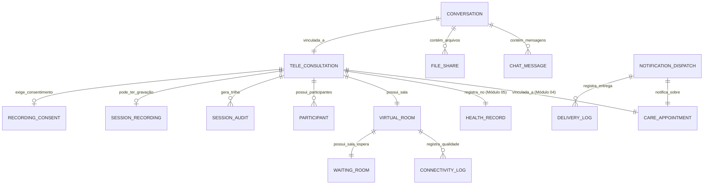

# MÓDULO 06 — TELEMEDICINA, TELEPSICOLOGIA, TELEPSIQUIATRIA E COMUNICAÇÃO OMNICHANNEL
## AURA DIGITAL CARE PLATFORM — PROMPT 21
### Plataforma Integrada Aura · Instituto Ser Melhor (ISMCL)
**Papel Assumido**: Chief Digital Health Officer (CDHO) · Chief Telemedicine Architect · Enterprise Communications Architect · Principal Backend & Frontend Engineer · WebRTC Specialist · Especialista em Telemedicina, LGPD, Resoluções CFP/CFM/CFESS, OWASP, DDD, Clean Architecture

---

## SUMÁRIO EXECUTIVO

O **Módulo 06 — Aura Digital Care Platform** transforma a infraestrutura de comunicação existente em uma plataforma de teleatendimento de nível corporativo. Com base na auditoria do `Telehealth.tsx` (1.745 linhas — o maior arquivo do projeto), identificamos uma arquitetura de frontend avançada com WebRTC simulado, gravação com consentimento, IA integrada (Gemini), evolução clínica e emissão de documentos — tudo em memória/localStorage.

A missão é migrar essa riqueza funcional para microserviços reais, adicionando WebRTC P2P/SFU (Mediasoup), sinalização via WebSocket, persistência segura no PEU (Módulo 05), notificações omnichannel (WhatsApp/SMS/Email/Push) e conformidade completa com LGPD + Resoluções profissionais.

---

## ETAPA 1 — AUDITORIA ARQUITETURAL COMPLETA (PROMPTS 00 A 20)

### 1.1 Inventário do Estado Atual — Código Real Auditado

| Arquivo | Linhas | Status | Diagnóstico |
|---|---|---|---|
| `src/pages/Telehealth.tsx` | **1.745** | ⚠️ RICO MAS CRÍTICO | WebRTC, gravação, IA (Gemini real via `services/gemini`), documentos, consentimento — tudo simulado em memória ou `localStorage`. Evolução clínica `telehealth_evolutions` persiste dados de saúde em `localStorage`. Integração real com PEU ausente. |
| `src/pages/Messages.tsx` | 476 | ⚠️ PARCIAL | Chat interno funcional. Contatos de `localStorage.patients_list`. Envio de lembretes WhatsApp/SMS simulado (sem API real). `messages_list` em `localStorage`. |
| `src/services/gemini.ts` | — | ✅ PRESERVAR | `generateSOAP()`, `generateSummary()`, `generateSessionReport()` — integração Gemini API real funcionando. Será migrada para `ms-telecare` como `ClinicalAIService`. |

### 1.2 Vulnerabilidades Críticas e Correções Mandatórias

> [!CAUTION]
> **VULN-TEL-001 — VIOLAÇÃO P06 (SEGURANÇA) + P05 (PEU)**: `Telehealth.tsx` linha 214: `localStorage.setItem('telehealth_evolutions', ...)` persiste evoluções clínicas (dados de saúde mental LGPD Art. 11) em texto sem criptografia no cliente. Além disso, `isLocked` (equivalente à assinatura digital) é um booleano local — sem validação criptográfica real.
> **Correção**: Ao encerrar sessão, `POST /health-records/:id/encounters/:eid/notes` do Módulo 05 com AES-256-GCM. `localStorage.telehealth_evolutions` é eliminado completamente.

> [!CAUTION]
> **VULN-TEL-002 — VIOLAÇÃO P04 (DADOS)**: `Messages.tsx` linha 142: `localStorage.setItem('messages_list', ...)` persiste conversas entre profissional e beneficiário em texto plano. Conversas sobre saúde mental são dados de saúde (LGPD Art. 11).
> **Correção**: Mensagens persistidas via `POST /telecare/conversations/:id/messages` com E2EE + AES-256-GCM no backend.

> [!WARNING]
> **VULN-TEL-003 — VIOLAÇÃO P07 (BACKEND)**: `consentProofHash` em `Telehealth.tsx` linha 345 é gerado no frontend com `Math.random()` — hash de consentimento de gravação nunca pode ser gerado no cliente. É juridicamente nulo.
> **Correção**: `POST /telecare/sessions/:id/recording-consent` gera HMAC-SHA256 no backend com timestamp, sessionId e beneficiaryId.

> [!WARNING]
> **VULN-TEL-004 — VIOLAÇÃO P02 (DDD)**: `Telehealth.tsx` linha 97 carrega agendamento via `localStorage.appointments_list` — violação do Módulo 04 SSOT.
> **Correção**: `GET /care/appointments/:id` do Módulo 04 (ms-care) via token JWT.

### 1.3 Pontos Positivos a Preservar

| Funcionalidade | Arquivo | Preservação |
|---|---|---|
| UX de sala virtual (mute, vídeo off, screen share) | `Telehealth.tsx` | Migrar para `VirtualRoomPage.tsx` com WebRTC real |
| Sistema de gravação com consentimento em etapas | `Telehealth.tsx:334-357` | Arquitetura correta — backend real |
| Painel de auditoria em tempo real | `Telehealth.tsx:184-193` | `SessionAuditPanel.tsx` com WebSocket |
| Integração Gemini API (`generateSOAP`, `generateSummary`) | `src/services/gemini.ts` | Migrar para `ClinicalAIService` no ms-telecare |
| Emissão de documentos (receita/atestado/laudo) | `Telehealth.tsx:400+` | Migrar para `DocumentEmissionService` → Módulo 05 (PEU) |
| UX de mensageria interna | `Messages.tsx` | Migrar para `SecureMessagingPage.tsx` com WebSocket |
| Lembretes WhatsApp/SMS | `Messages.tsx:170-189` | Migrar para `OmnichannelService` (ms-omnichannel) com API real |

### 1.4 Conformidade com Resoluções Profissionais

| Profissão | Norma | Restrição no Módulo |
|---|---|---|
| Psicólogo | Res. CFP 11/2018 (Telepsicologia) | Atendimento remoto permitido; sem gravação obrigatória; consentimento LGPD |
| Psiquiatra | CFM 2.314/2022 (Telemedicina) | Teleconsulta permitida; exige registro no prontuário |
| Assistente Social | CFESS 2020 (Orientações) | Atendimento remoto permitido com mesmo rigor ético |
| Advogado | OAB 2020 | Orientação jurídica remota permitida; sigilo absoluto |

---

## ETAPA 2 — MODELAGEM COMPLETA DO DOMÍNIO (DDD TACTICAL DESIGN)

### 2.1 Diagrama ER Conceitual



### 2.2 Entidades do Domínio (20 Entidades Completas)

#### 2.2.1 `TeleConsultation` — Aggregate Root

```
TeleConsultation {
  id: UUID [PK]
  sessionNumber: String UNIQUE NOT NULL   -- TEL-YYYY-NNNNN
  appointmentId: UUID NOT NULL UNIQUE FK care.appointments
  healthRecordId: UUID NOT NULL FK health_record.records
  careCaseId: UUID NOT NULL FK care.cases
  professionalId: UUID NOT NULL FK auth.professionals
  beneficiaryPersonId: UUID NOT NULL FK citizen.persons
  sessionType: SessionTypeEnum            -- TELEHEALTH, TELEPSYCHOLOGY, TELEPSYCHIATRY,
                                           -- SOCIAL_REMOTE, LEGAL_REMOTE
  status: SessionStatusEnum               -- SCHEDULED, WAITING_ROOM, IN_PROGRESS,
                                           -- COMPLETED, MISSED, ABORTED, TECHNICAL_FAILURE
  scheduledAt: Timestamp NOT NULL
  waitingRoomOpenedAt: Timestamp?
  sessionStartedAt: Timestamp?
  sessionEndedAt: Timestamp?
  durationMinutes: Int?
  endReason: SessionEndReasonEnum?        -- COMPLETED_NORMAL, PATIENT_DISCONNECTED,
                                           -- PROFESSIONAL_ENDED, TECHNICAL_FAILURE, TIMEOUT
  -- Integração com PEU
  encounterId: UUID? FK health_record.encounters  -- Criado ao encerrar sessão
  evolutionNoteId: UUID? FK health_record.progress_notes
  -- Auditoria
  encKeyId: String NOT NULL
}
```

**Invariantes**:
- `INV-TEL-001`: `TeleConsultation` só pode ser criada a partir de `care.appointments` com `modality = TELEHEALTH` e `status = CONFIRMED`.
- `INV-TEL-002`: Sessão só pode iniciar se `ConsentGate.hasActiveConsent(beneficiaryPersonId) = true` (Módulo 02).
- `INV-TEL-003`: Ao encerrar sessão, `SessionEndedHandler` DEVE criar `ClinicalEncounter` + `AttendanceRecord` no Módulo 04/05.

---

#### 2.2.2 `VirtualRoom` — Entity

```
VirtualRoom {
  id: UUID [PK]
  sessionId: UUID NOT NULL UNIQUE FK tele_consultations
  roomToken: String NOT NULL              -- JWT com TTL (expiração 90 min)
  roomUrl: String NOT NULL               -- URL da sala (Mediasoup/Jitsi)
  mediaServerId: String NOT NULL          -- ID do servidor Mediasoup
  roomStatus: RoomStatusEnum             -- CLOSED, OPEN, ACTIVE, EXPIRED
  maxParticipants: Int DEFAULT 5
  isE2EEEnabled: Boolean NOT NULL DEFAULT TRUE
  createdAt: Timestamp NOT NULL
  expiresAt: Timestamp NOT NULL          -- sessionScheduledAt + 90min
}
```

---

#### 2.2.3 `WaitingRoom` — Entity

```
WaitingRoom {
  id: UUID [PK]
  sessionId: UUID NOT NULL UNIQUE FK tele_consultations
  beneficiaryJoinedAt: Timestamp?
  professionalJoinedAt: Timestamp?
  beneficiaryWaitTimeMinutes: Int?
  identityVerifiedAt: Timestamp?        -- Validação de identidade pelo profissional
  consentAcknowledgedAt: Timestamp?     -- Beneficiário leu e aceitou o termo
  admittedAt: Timestamp?                -- Profissional admitiu o beneficiário
}
```

---

#### 2.2.4 `RecordingConsent` — Entity (Consentimento Jurídico para Gravação)

```
RecordingConsent {
  id: UUID [PK]
  sessionId: UUID NOT NULL FK tele_consultations
  requestedBy: UUID NOT NULL FK auth.professionals
  requestedAt: Timestamp NOT NULL
  recordingType: RecordingTypeEnum      -- VIDEO_AUDIO, AUDIO_ONLY
  recordingPurpose: Text NOT NULL       -- Justificativa clínica/ética
  consentGrantedBy: UUID NOT NULL FK citizen.persons  -- Beneficiário ou responsável legal
  consentGrantedAt: Timestamp NOT NULL
  consentHash: String NOT NULL          -- HMAC-SHA256(sessionId+beneficiaryId+grantedAt+purpose)
  retentionDays: Int NOT NULL DEFAULT 30
  ipAddressBeneficiary: String NOT NULL
  deviceFingerprintBeneficiary: String NOT NULL
}
```

---

#### 2.2.5 `SessionRecording` — Entity

```
SessionRecording {
  id: UUID [PK]
  sessionId: UUID NOT NULL FK tele_consultations
  consentId: UUID NOT NULL FK recording_consents
  storageKey: String NOT NULL           -- Chave no storage criptografado
  durationSeconds: Int?
  fileSizeBytes: BigInt?
  checksum: String NOT NULL
  isEncrypted: Boolean NOT NULL DEFAULT TRUE
  encKeyId: String NOT NULL
  retentionUntil: Date NOT NULL
  uploadedAt: Timestamp NOT NULL
}
```

---

#### 2.2.6 `Conversation` — Aggregate Root (Chat Seguro)

```
Conversation {
  id: UUID [PK]
  sessionId: UUID NOT NULL UNIQUE FK tele_consultations
  isE2EEEnabled: Boolean NOT NULL DEFAULT TRUE
  status: ConversationStatusEnum        -- OPEN, CLOSED, ARCHIVED
  openedAt: Timestamp NOT NULL
  closedAt: Timestamp?
}

ChatMessage {
  id: UUID [PK]
  conversationId: UUID NOT NULL FK conversations
  senderType: SenderTypeEnum            -- PROFESSIONAL, BENEFICIARY, SYSTEM
  senderId: UUID NOT NULL FK auth.users
  contentEncrypted: BYTEA NOT NULL      -- AES-256-GCM
  contentHash: String NOT NULL          -- Verificação de integridade
  messageType: MessageTypeEnum          -- TEXT, FILE_SHARE, SYSTEM_EVENT
  sentAt: Timestamp NOT NULL
  deliveredAt: Timestamp?
  readAt: Timestamp?
  encKeyId: String NOT NULL
}

FileShare {
  id: UUID [PK]
  conversationId: UUID NOT NULL FK conversations
  sharedBy: UUID NOT NULL FK auth.users
  fileName: String NOT NULL
  mimeType: String NOT NULL
  fileSizeBytes: BigInt NOT NULL
  storageKey: String NOT NULL
  checksum: String NOT NULL
  isEncrypted: Boolean NOT NULL DEFAULT TRUE
  encKeyId: String NOT NULL
  sharedAt: Timestamp NOT NULL
}
```

---

#### 2.2.7 `NotificationDispatch` — Entity (Omnichannel)

```
NotificationDispatch {
  id: UUID [PK]
  appointmentId: UUID NOT NULL FK care.appointments
  beneficiaryPersonId: UUID FK citizen.persons
  professionalId: UUID? FK auth.professionals
  notificationType: NotificationTypeEnum  -- REMINDER_24H, REMINDER_2H, CONFIRMATION,
                                           -- CANCELLATION, RESCHEDULE, TELEHEALTH_LINK,
                                           -- POST_CONSULTATION, DOCUMENT_READY
  channel: ChannelEnum                   -- WHATSAPP, SMS, EMAIL, PUSH, INTERNAL
  recipientPhone: String?
  recipientEmail: String?
  templateId: String NOT NULL
  templateVariables: JSONB NOT NULL
  status: DispatchStatusEnum             -- PENDING, SENT, DELIVERED, READ, FAILED
  sentAt: Timestamp?
  deliveredAt: Timestamp?
  readAt: Timestamp?
  failureReason: Text?
  providerMessageId: String?             -- ID retornado pelo WhatsApp/Twilio
  retryCount: Int NOT NULL DEFAULT 0
  nextRetryAt: Timestamp?
}
```

---

#### 2.2.8 `ConnectivityLog` — Entity (Qualidade da Chamada)

```
ConnectivityLog {
  id: UUID [PK]
  sessionId: UUID NOT NULL FK tele_consultations
  participantId: UUID NOT NULL FK participants
  loggedAt: Timestamp NOT NULL
  networkQuality: NetworkQualityEnum    -- EXCELLENT, GOOD, FAIR, POOR, DISCONNECTED
  latencyMs: Int?
  jitterMs: Int?
  packetLossPercent: Decimal(5,2)?
  bitrateKbps: Int?
  resolutionWidth: Int?
  resolutionHeight: Int?
  codecUsed: String?
}
```

---

## ETAPA 3 — ARQUITETURA DE COMUNICAÇÃO EM TEMPO REAL

### 3.1 Stack Tecnológico

```
┌─────────────────────────────────────────────────────────────────┐
│  CLIENTE (React/Mobile)                                          │
│  WebRTC API + MediaStream + RTCPeerConnection                    │
└─────────────────────┬───────────────────────────────────────────┘
                      │ WebSocket (Signaling)
┌─────────────────────▼───────────────────────────────────────────┐
│  ms-signaling (NestJS + Socket.IO)                               │
│  - SDP Exchange (offer/answer)                                   │
│  - ICE Candidate Exchange                                        │
│  - Room Management                                               │
│  - JWT Auth via Módulo 01 (IAM)                                  │
└─────────────────────┬───────────────────────────────────────────┘
                      │
┌─────────────────────▼───────────────────────────────────────────┐
│  Mediasoup SFU (Selective Forwarding Unit)                       │
│  - Modo P2P: 1:1 com E2EE (telepsicologia individual)           │
│  - Modo SFU: Grupo (reunião multidisciplinar)                    │
│  - Gravação via MediaRecorder → S3 Criptografado                │
└─────────────────────┬───────────────────────────────────────────┘
                      │
┌─────────────────────▼───────────────────────────────────────────┐
│  TURN/STUN (Coturn)                                              │
│  - STUN: Descoberta de IP público                                │
│  - TURN: Relay para redes restritas (corporativas/CGNAT)        │
│  - Credenciais rotacionadas via HMAC a cada 24h                 │
└─────────────────────────────────────────────────────────────────┘
```

### 3.2 Protocolo de Sinalização (WebSocket Events)

```typescript
// Eventos do ms-signaling — Socket.IO com JWT Auth

// CLIENTE → SERVIDOR
'room:join'       { roomToken: string, userType: 'professional' | 'beneficiary' }
'room:leave'      { sessionId: string }
'webrtc:offer'    { targetId: string, sdp: RTCSessionDescriptionInit }
'webrtc:answer'   { targetId: string, sdp: RTCSessionDescriptionInit }
'webrtc:ice'      { targetId: string, candidate: RTCIceCandidateInit }
'chat:message'    { conversationId: string, contentEncrypted: string, keyId: string }
'quality:report'  { latencyMs: number, jitterMs: number, packetLossPercent: number }

// SERVIDOR → CLIENTE
'room:participant-joined'  { participantId: string, userType: string }
'room:participant-left'    { participantId: string }
'session:started'          { sessionId: string, startedAt: string }
'session:ended'            { sessionId: string, reason: SessionEndReasonEnum }
'recording:consent-request' { sessionId: string, recordingType: string, purpose: string }
'recording:consent-granted' { consentHash: string }
'quality:alert'            { participantId: string, quality: NetworkQualityEnum }
'iceRestart:initiated'     { }   -- Reconexão automática
```

---

## ETAPA 4 — CICLO DE VIDA COMPLETO DA SESSÃO

```
[AppointmentConfirmedEvent] (Módulo 04)
        ↓ 24h antes
[NotificationDispatch: REMINDER_24H] → WhatsApp/SMS/Email/Push
        ↓ 2h antes
[NotificationDispatch: REMINDER_2H + TELEHEALTH_LINK]
        ↓
[Beneficiário acessa link seguro]
        ↓
[JWT gerado: audience=telehealth, TTL=90min, uso único]
        ↓
[WaitingRoom aberta — Identidade verificada pelo profissional]
        ↓
[ConsentGate verificado (Módulo 02)] → Consentimento LGPD ativo?
        ↓ SIM
[VirtualRoom criada — Mediasoup room + TURN credentials]
        ↓
[WebRTC: ICE Gathering → SDP Exchange → Canal estabelecido]
        ↓
[status: IN_PROGRESS] → sessionStartedAt registrado
        ↓
[Atendimento em curso]
 ├── Chat Seguro (E2EE)
 ├── Screen Share
 ├── File Share (criptografado)
 ├── Gravação (somente com RecordingConsent)
 └── IA Copiloto (leitura apenas)
        ↓
[Profissional encerra sessão]
        ↓
[SessionEndedHandler — Sequência obrigatória]:
  1. status = COMPLETED + sessionEndedAt
  2. AttendanceRecord criado (Módulo 04)
  3. ClinicalEncounter criado (Módulo 05)
  4. ProgressNote rascunho salva (Módulo 05) — aguarda assinatura
  5. AppointmentCompletedEvent publicado
  6. CareEvent.APPOINTMENT_COMPLETED publicado
  7. NotificationDispatch: POST_CONSULTATION → beneficiário
        ↓
[Profissional assina evolução no PEU (Módulo 05)]
        ↓
[ProgressNoteSignedEvent publicado]
```

---

## ETAPA 5 — BANCO DE DADOS (POSTGRESQL 16 — SCHEMA `telecare`)

```sql
-- =========================================================================
-- AURA DIGITAL CARE PLATFORM — SCHEMA telecare
-- PostgreSQL 16
-- =========================================================================

CREATE SCHEMA IF NOT EXISTS telecare;

-- ENUMERAÇÕES
CREATE TYPE telecare.session_status AS ENUM (
  'SCHEDULED', 'WAITING_ROOM', 'IN_PROGRESS',
  'COMPLETED', 'MISSED', 'ABORTED', 'TECHNICAL_FAILURE'
);
CREATE TYPE telecare.session_type AS ENUM (
  'TELEHEALTH', 'TELEPSYCHOLOGY', 'TELEPSYCHIATRY',
  'SOCIAL_REMOTE', 'LEGAL_REMOTE'
);
CREATE TYPE telecare.dispatch_status AS ENUM (
  'PENDING', 'SENT', 'DELIVERED', 'READ', 'FAILED'
);
CREATE TYPE telecare.channel AS ENUM (
  'WHATSAPP', 'SMS', 'EMAIL', 'PUSH', 'INTERNAL'
);
CREATE TYPE telecare.network_quality AS ENUM (
  'EXCELLENT', 'GOOD', 'FAIR', 'POOR', 'DISCONNECTED'
);

-- ─────────────────────────────────────────────────────────────────────────
-- TABELA: telecare.sessions (Aggregate Root)
-- ─────────────────────────────────────────────────────────────────────────
CREATE TABLE telecare.sessions (
  id                    UUID PRIMARY KEY DEFAULT gen_random_uuid(),
  session_number        VARCHAR(30) UNIQUE NOT NULL,   -- TEL-2025-00001
  appointment_id        UUID NOT NULL UNIQUE REFERENCES care.appointments(id),
  health_record_id      UUID NOT NULL REFERENCES health_record.records(id),
  care_case_id          UUID NOT NULL REFERENCES care.cases(id),
  professional_id       UUID NOT NULL REFERENCES auth.professionals(id),
  beneficiary_person_id UUID NOT NULL REFERENCES citizen.persons(id),
  session_type          telecare.session_type NOT NULL,
  status                telecare.session_status NOT NULL DEFAULT 'SCHEDULED',
  scheduled_at          TIMESTAMPTZ NOT NULL,
  waiting_room_opened_at TIMESTAMPTZ,
  session_started_at    TIMESTAMPTZ,
  session_ended_at      TIMESTAMPTZ,
  duration_minutes      INT,
  end_reason            VARCHAR(100),
  encounter_id          UUID REFERENCES health_record.encounters(id),
  evolution_note_id     UUID REFERENCES health_record.progress_notes(id),
  enc_key_id            VARCHAR(100) NOT NULL
);

-- ─────────────────────────────────────────────────────────────────────────
-- TABELA: telecare.virtual_rooms
-- ─────────────────────────────────────────────────────────────────────────
CREATE TABLE telecare.virtual_rooms (
  id               UUID PRIMARY KEY DEFAULT gen_random_uuid(),
  session_id       UUID NOT NULL UNIQUE REFERENCES telecare.sessions(id),
  room_token       TEXT NOT NULL,                  -- JWT TTL 90min
  room_url         VARCHAR(1000) NOT NULL,
  media_server_id  VARCHAR(255) NOT NULL,
  room_status      VARCHAR(50) NOT NULL DEFAULT 'CLOSED',
  max_participants INT NOT NULL DEFAULT 5,
  is_e2ee_enabled  BOOLEAN NOT NULL DEFAULT TRUE,
  created_at       TIMESTAMPTZ NOT NULL DEFAULT CURRENT_TIMESTAMP,
  expires_at       TIMESTAMPTZ NOT NULL
);

-- ─────────────────────────────────────────────────────────────────────────
-- TABELA: telecare.recording_consents
-- ─────────────────────────────────────────────────────────────────────────
CREATE TABLE telecare.recording_consents (
  id                            UUID PRIMARY KEY DEFAULT gen_random_uuid(),
  session_id                    UUID NOT NULL UNIQUE REFERENCES telecare.sessions(id),
  requested_by                  UUID NOT NULL REFERENCES auth.professionals(id),
  requested_at                  TIMESTAMPTZ NOT NULL,
  recording_type                VARCHAR(50) NOT NULL,
  recording_purpose             TEXT NOT NULL,
  consent_granted_by            UUID NOT NULL REFERENCES citizen.persons(id),
  consent_granted_at            TIMESTAMPTZ NOT NULL,
  consent_hash                  VARCHAR(128) NOT NULL,  -- HMAC-SHA256 real
  retention_days                INT NOT NULL DEFAULT 30,
  ip_address_beneficiary        VARCHAR(45) NOT NULL,
  device_fingerprint_beneficiary VARCHAR(255) NOT NULL
);

-- ─────────────────────────────────────────────────────────────────────────
-- TABELA: telecare.session_recordings
-- ─────────────────────────────────────────────────────────────────────────
CREATE TABLE telecare.session_recordings (
  id              UUID PRIMARY KEY DEFAULT gen_random_uuid(),
  session_id      UUID NOT NULL REFERENCES telecare.sessions(id),
  consent_id      UUID NOT NULL REFERENCES telecare.recording_consents(id),
  storage_key     VARCHAR(1000) NOT NULL,
  duration_seconds INT,
  file_size_bytes BIGINT,
  checksum        VARCHAR(64) NOT NULL,
  is_encrypted    BOOLEAN NOT NULL DEFAULT TRUE,
  enc_key_id      VARCHAR(100) NOT NULL,
  retention_until DATE NOT NULL,
  uploaded_at     TIMESTAMPTZ NOT NULL DEFAULT CURRENT_TIMESTAMP
);

-- ─────────────────────────────────────────────────────────────────────────
-- TABELA: telecare.conversations (Chat Seguro)
-- ─────────────────────────────────────────────────────────────────────────
CREATE TABLE telecare.conversations (
  id               UUID PRIMARY KEY DEFAULT gen_random_uuid(),
  session_id       UUID NOT NULL UNIQUE REFERENCES telecare.sessions(id),
  is_e2ee_enabled  BOOLEAN NOT NULL DEFAULT TRUE,
  status           VARCHAR(50) NOT NULL DEFAULT 'OPEN',
  opened_at        TIMESTAMPTZ NOT NULL DEFAULT CURRENT_TIMESTAMP,
  closed_at        TIMESTAMPTZ
);

-- ─────────────────────────────────────────────────────────────────────────
-- TABELA: telecare.chat_messages
-- ─────────────────────────────────────────────────────────────────────────
CREATE TABLE telecare.chat_messages (
  id                UUID PRIMARY KEY DEFAULT gen_random_uuid(),
  conversation_id   UUID NOT NULL REFERENCES telecare.conversations(id),
  sender_type       VARCHAR(50) NOT NULL,
  sender_id         UUID NOT NULL REFERENCES auth.users(id),
  content_encrypted BYTEA NOT NULL,
  content_hash      VARCHAR(64) NOT NULL,
  message_type      VARCHAR(50) NOT NULL DEFAULT 'TEXT',
  sent_at           TIMESTAMPTZ NOT NULL DEFAULT CURRENT_TIMESTAMP,
  delivered_at      TIMESTAMPTZ,
  read_at           TIMESTAMPTZ,
  enc_key_id        VARCHAR(100) NOT NULL
);

-- ─────────────────────────────────────────────────────────────────────────
-- TABELA: telecare.notification_dispatches (Omnichannel)
-- ─────────────────────────────────────────────────────────────────────────
CREATE TABLE telecare.notification_dispatches (
  id                    UUID PRIMARY KEY DEFAULT gen_random_uuid(),
  appointment_id        UUID NOT NULL REFERENCES care.appointments(id),
  beneficiary_person_id UUID REFERENCES citizen.persons(id),
  professional_id       UUID REFERENCES auth.professionals(id),
  notification_type     VARCHAR(100) NOT NULL,
  channel               telecare.channel NOT NULL,
  recipient_phone       VARCHAR(30),
  recipient_email       VARCHAR(255),
  template_id           VARCHAR(255) NOT NULL,
  template_variables    JSONB NOT NULL,
  status                telecare.dispatch_status NOT NULL DEFAULT 'PENDING',
  sent_at               TIMESTAMPTZ,
  delivered_at          TIMESTAMPTZ,
  read_at               TIMESTAMPTZ,
  failure_reason        TEXT,
  provider_message_id   VARCHAR(255),
  retry_count           INT NOT NULL DEFAULT 0,
  next_retry_at         TIMESTAMPTZ
);

-- ─────────────────────────────────────────────────────────────────────────
-- TABELA: telecare.connectivity_logs
-- ─────────────────────────────────────────────────────────────────────────
CREATE TABLE telecare.connectivity_logs (
  id                  UUID PRIMARY KEY DEFAULT gen_random_uuid(),
  session_id          UUID NOT NULL REFERENCES telecare.sessions(id),
  participant_type    VARCHAR(50) NOT NULL,
  participant_id      UUID NOT NULL,
  logged_at           TIMESTAMPTZ NOT NULL DEFAULT CURRENT_TIMESTAMP,
  network_quality     telecare.network_quality NOT NULL,
  latency_ms          INT,
  jitter_ms           INT,
  packet_loss_percent DECIMAL(5,2),
  bitrate_kbps        INT,
  resolution_width    INT,
  resolution_height   INT,
  codec_used          VARCHAR(50)
);

-- ─────────────────────────────────────────────────────────────────────────
-- TABELA: telecare.session_audits (Imutável)
-- ─────────────────────────────────────────────────────────────────────────
CREATE TABLE telecare.session_audits (
  id           UUID PRIMARY KEY DEFAULT gen_random_uuid(),
  session_id   UUID NOT NULL REFERENCES telecare.sessions(id),
  action       VARCHAR(100) NOT NULL,
  actor_type   VARCHAR(50) NOT NULL,
  actor_id     UUID REFERENCES auth.users(id),
  details      TEXT NOT NULL,
  severity     VARCHAR(50) NOT NULL DEFAULT 'INFO',
  metadata     JSONB,
  occurred_at  TIMESTAMPTZ NOT NULL DEFAULT CURRENT_TIMESTAMP
);
REVOKE UPDATE, DELETE ON telecare.session_audits FROM PUBLIC;
REVOKE UPDATE, DELETE ON telecare.session_audits FROM aura_app_role;

-- ─────────────────────────────────────────────────────────────────────────
-- ÍNDICES
-- ─────────────────────────────────────────────────────────────────────────
CREATE INDEX idx_sessions_status ON telecare.sessions (status) WHERE status IN ('WAITING_ROOM', 'IN_PROGRESS');
CREATE INDEX idx_sessions_professional ON telecare.sessions (professional_id, scheduled_at);
CREATE INDEX idx_dispatches_pending ON telecare.notification_dispatches (status, next_retry_at) WHERE status = 'PENDING';
CREATE INDEX idx_dispatches_appointment ON telecare.notification_dispatches (appointment_id);
CREATE INDEX idx_chat_messages_conversation ON telecare.chat_messages (conversation_id, sent_at DESC);
CREATE INDEX idx_connectivity_quality ON telecare.connectivity_logs (session_id, network_quality) WHERE network_quality IN ('POOR', 'DISCONNECTED');
CREATE INDEX idx_audits_session ON telecare.session_audits (session_id, occurred_at DESC);
```

---

## ETAPA 6 — BACKEND (`apps/ms-telecare` + `apps/ms-signaling` + `apps/ms-omnichannel`)

### 6.1 Estrutura dos Microserviços

```
apps/ms-telecare/           -- REST API: ciclo de vida da sessão
├── src/
│   ├── controllers/
│   │   ├── session.controller.ts
│   │   ├── room.controller.ts
│   │   ├── recording.controller.ts
│   │   └── conversation.controller.ts
│   ├── use-cases/commands/
│   │   ├── create-session/             -- Consome AppointmentConfirmedEvent
│   │   ├── open-waiting-room/
│   │   ├── admit-to-session/           -- Profissional admite beneficiário
│   │   ├── start-session/
│   │   ├── request-recording-consent/
│   │   ├── grant-recording-consent/
│   │   ├── end-session/               -- Sequência obrigatória: → Módulo 04, → Módulo 05
│   │   └── save-draft-evolution/      -- Rascunho automático no PEU
│   └── workers/
│       ├── session-timeout.worker.ts  -- Encerra sessões inativas
│       └── recording-retention.worker.ts -- Expira gravações após retentionDays

apps/ms-signaling/          -- WebSocket: sinalização WebRTC em tempo real
├── src/
│   ├── gateways/
│   │   └── signaling.gateway.ts       -- Socket.IO com JwtWsGuard
│   ├── services/
│   │   ├── room.service.ts            -- Gerencia salas Mediasoup
│   │   ├── ice.service.ts             -- TURN credentials rotation
│   │   └── quality.service.ts         -- WebRTC stats → ConnectivityLog
│   └── event-handlers/
│       └── session-status.handler.ts

apps/ms-omnichannel/        -- Notificações multi-canal
├── src/
│   ├── services/
│   │   ├── whatsapp.service.ts        -- WhatsApp Business Cloud API
│   │   ├── sms.service.ts             -- Twilio SMS
│   │   ├── email.service.ts           -- SendGrid + templates MJML
│   │   ├── push.service.ts            -- Firebase Cloud Messaging
│   │   └── internal.service.ts        -- Notificações internas SSE
│   └── workers/
│       ├── notification-scheduler.worker.ts  -- Cron 24h + 2h antes
│       └── retry.worker.ts                   -- Retry com exponential backoff

libs/domain/telecare/
├── aggregates/
│   └── tele-consultation.aggregate.ts
├── engines/
│   ├── room-token.engine.ts           -- JWT TTL 90min + HMAC TURN credentials
│   ├── consent-hash.engine.ts         -- HMAC-SHA256 (backend only)
│   └── clinical-ai.service.ts         -- Migra generateSOAP/generateSummary do frontend
└── events/
    ├── session-started.event.ts
    ├── session-completed.event.ts
    ├── recording-consent-granted.event.ts
    └── quality-degraded.event.ts
```

### 6.2 `EndSessionHandler` — Sequência Obrigatória

```typescript
// apps/ms-telecare/src/use-cases/commands/end-session/end-session.handler.ts

@CommandHandler(EndSessionCommand)
export class EndSessionHandler {
  async execute(command: EndSessionCommand): Promise<void> {
    const session = await this.sessionRepo.findById(command.sessionId);

    // 1. Fechar a sessão
    session.end(command.endReason);
    await this.sessionRepo.save(session);

    // 2. Registrar AttendanceRecord no Módulo 04 (ms-care)
    const attendance = await this.careService.recordAttendance({
      appointmentId: session.appointmentId,
      attended: command.endReason !== 'MISSED',
      attendanceType: 'PRESENT_TELEHEALTH',
      durationMinutes: session.durationMinutes,
    });

    // 3. Criar ClinicalEncounter no Módulo 05 (ms-health-record)
    const encounter = await this.healthRecordService.createEncounter({
      healthRecordId: session.healthRecordId,
      appointmentId: session.appointmentId,
      professionalId: session.professionalId,
      encounterType: this.mapSessionTypeToEncounterType(session.sessionType),
      startedAt: session.sessionStartedAt,
      completedAt: session.sessionEndedAt,
      modality: 'TELEHEALTH',
    });

    // 4. Se havia rascunho de evolução → criar ProgressNote rascunho no PEU
    const draftContent = await this.draftStore.getDraft(command.sessionId);
    if (draftContent) {
      const note = await this.healthRecordService.createProgressNote({
        encounterId: encounter.id,
        healthRecordId: session.healthRecordId,
        noteType: 'SOAP',
        contentJson: draftContent,
        isSigned: false,   // Aguarda assinatura do profissional
      });
      await this.sessionRepo.updateEncounterRef(session.id, encounter.id, note.id);
    }

    // 5. Publicar eventos
    this.eventBus.publish(new SessionCompletedEvent(session.id, session.careCaseId));
    this.eventBus.publish(new AppointmentCompletedEvent(session.appointmentId));
  }
}
```

---

## ETAPA 7 — OPENAPI 3.0 — 22 ENDPOINTS (`/api/v1/telecare`)

| Método | Endpoint | Descrição | Roles |
|---|---|---|---|
| `POST` | `/sessions` | Criar sessão (auto via AppointmentConfirmedEvent) | system |
| `GET` | `/sessions/:id` | Detalhe da sessão | session_participant |
| `POST` | `/sessions/:id/waiting-room/open` | Abrir sala de espera | professional |
| `POST` | `/sessions/:id/waiting-room/admit` | Admitir beneficiário na sessão | professional |
| `POST` | `/sessions/:id/start` | Iniciar sessão (cria VirtualRoom + token) | professional |
| `POST` | `/sessions/:id/end` | Encerrar sessão (sequência obrigatória → PEU) | professional |
| `GET` | `/sessions/:id/room-token` | Obter token JWT da sala (TTL 90min) | session_participant |
| `GET` | `/sessions/:id/turn-credentials` | Obter credenciais TURN rotacionadas | session_participant |
| `POST` | `/sessions/:id/recording/request` | Solicitar gravação (backend → socket → beneficiário) | professional |
| `POST` | `/sessions/:id/recording/grant` | Beneficiário concede consentimento | beneficiary |
| `POST` | `/sessions/:id/recording/stop` | Encerrar gravação | professional |
| `GET` | `/sessions/:id/conversation` | Obter conversa do chat | session_participant |
| `POST` | `/sessions/:id/conversation/messages` | Enviar mensagem criptografada | session_participant |
| `POST` | `/sessions/:id/conversation/files` | Upload de arquivo criptografado | professional |
| `POST` | `/sessions/:id/draft-evolution` | Salvar rascunho da evolução (autossave 2s) | professional |
| `GET` | `/sessions/:id/audit-trail` | Trilha de auditoria em tempo real | professional |
| `POST` | `/sessions/:id/quality-report` | Reportar métricas WebRTC | session_participant |
| `GET` | `/sessions/history` | Histórico de sessões do profissional | professional |
| `POST` | `/notifications/dispatch` | Disparar notificação omnichannel | system, admin |
| `GET` | `/notifications/log` | Log de notificações enviadas | admin, coordinator |
| `POST` | `/ai/generate-soap` | Gerar SOAP assistido pela IA | professional |
| `POST` | `/ai/generate-summary` | Gerar resumo da sessão pela IA | professional |

---

## ETAPA 8 — FRONTEND (MIGRAÇÃO E EXPANSÃO)

### 8.1 Diagnóstico de Migração

| Arquivo Atual | Ação | Descrição |
|---|---|---|
| `Telehealth.tsx` (1.745 linhas) | **REFATORAR** | Migrar dados de `localStorage` para APIs reais. WebRTC com Signal Server real. `consentProofHash` do backend. Preservar toda UX existente. |
| `Messages.tsx` (476 linhas) | **EXPANDIR** | Migrar `messages_list` para API. Adicionar chat E2EE real. Integrar omnichannel real. |

### 8.2 Estrutura de Features

```
src/features/telecare/
├── pages/
│   ├── VirtualRoomPage.tsx              -- Sala virtual (migração Telehealth.tsx)
│   ├── WaitingRoomPage.tsx              -- Sala de espera (profissional e beneficiário)
│   ├── SessionHistoryPage.tsx           -- Histórico de sessões com busca
│   └── SecureMessagingPage.tsx          -- Chat seguro (migração Messages.tsx)
├── components/
│   ├── VideoGrid.tsx                    -- Grid de vídeo WebRTC (profissional + beneficiário)
│   ├── ControlBar.tsx                   -- Mute, Vídeo, Screen Share, Encerrar
│   ├── RecordingConsentFlow.tsx         -- Fluxo em etapas (solicitação → consentimento)
│   ├── SecureChat.tsx                   -- Chat E2EE com file share
│   ├── SessionAuditPanel.tsx            -- Painel de auditoria em tempo real (WebSocket)
│   ├── ClinicalAIPanel.tsx              -- Copiloto IA (read-only, sugestão de SOAP)
│   ├── DocumentEmissionPanel.tsx        -- Emissão de receita/atestado/laudo
│   ├── NetworkQualityIndicator.tsx      -- Indicador de qualidade da chamada
│   ├── ConnectionResumeModal.tsx        -- Modal de reconexão automática
│   ├── WaitingRoomQueue.tsx             -- Fila de beneficiários aguardando
│   └── NotificationCenter.tsx          -- Central de notificações
├── hooks/
│   ├── useWebRTC.ts                     -- Hook WebRTC (offer/answer/ICE)
│   ├── useSignaling.ts                  -- Hook Socket.IO (sinalização)
│   ├── useSessionTimer.ts              -- Cronômetro da sessão
│   ├── useNetworkQuality.ts            -- Monitor de qualidade RTCStats
│   └── useAutoSaveDraft.ts             -- Autossave de rascunho a cada 2s → API
├── stores/
│   └── useSessionStore.ts              -- Zustand: estado da sessão ativa
└── services/
    ├── telecare.api.ts                  -- REST calls ao ms-telecare
    └── signaling.service.ts             -- Socket.IO service
```

### 8.3 Wireframes das Telas Principais

#### TELA 1: Sala Virtual (VirtualRoomPage)

```
╔══════════════════════════════════════════════════════════════════════════╗
║  🔒 SESSÃO SEGURA TEL-2025-00456 · TLS 1.3 · E2EE ✅ · 00:23:41       ║
╠══════════════════════════════════════════════════════════════════════════╣
║  ┌─────────────────────────────────────────────────┐ ┌────────────────┐ ║
║  │                                                  │ │  Profissional  │ ║
║  │   [VIDEO BENEFICIÁRIO - 720p]                    │ │  Dra. Elena    │ ║
║  │   [Protegido] — Telepsicologia                   │ │  [Câmera Off]  │ ║
║  │                                                  │ │                │ ║
║  │                          🟢 CONEXÃO EXCELENTE    │ └────────────────┘ ║
║  └─────────────────────────────────────────────────┘                    ║
║                                                                          ║
║  ═══════════════════════════════════════════════════════════════════════ ║
║  [🎙️ Mudo] [📷 Câmera] [🖥️ Screen] [⏺️ Gravar*] [📋 Evolução] [❌ Enc.]║
║  * Requer consentimento                                                  ║
╠═══════════════╦══════════════════════════════════════════════════════════╣
║  CHAT SEGURO  ║  COPILOTO IA AURA (Apenas Sugestões)                    ║
║  ─────────── ║  ┌──────────────────────────────────────────────────┐    ║
║  [PROT.] 14:32║  │ 🤖 Sugestão SOAP gerada:                         │    ║
║  "Pronta..."  ║  │ S: Paciente relata melhora do sono...             │    ║
║               ║  │ O: Colaborativa, afeto eutímico...               │    ║
║  Dra. Elena:  ║  │ A: Quadro em remissão parcial...                 │    ║
║  "Olá! Vamos  ║  │ P: Manter conduta + psicoeducação.               │    ║
║   iniciar."   ║  │ [⚠️ Revisar antes de aplicar] [✅ Aplicar]       │    ║
║               ║  └──────────────────────────────────────────────────┘    ║
║  [📎] [Enviar]║  [🔧 Gerar SOAP] [📄 Resumo] [📊 Relatório]             ║
╚═══════════════╩══════════════════════════════════════════════════════════╝
```

#### TELA 2: Sala de Espera (WaitingRoomPage — Beneficiário)

```
╔══════════════════════════════════════════════════════════════════════════╗
║  AURA · SALA DE ESPERA VIRTUAL                                           ║
╠══════════════════════════════════════════════════════════════════════════╣
║                                                                          ║
║     🔒 Conexão segura estabelecida                                       ║
║                                                                          ║
║     Sua consulta com Dra. Elena Silva                                    ║
║     Hoje, 28 de Julho de 2025 às 14:00                                  ║
║                                                                          ║
║     ┌──────────────────────────────────────────────────────┐             ║
║     │  Aguardando a profissional iniciar o atendimento...   │            ║
║     │  ⏳ Você está na fila: Posição 1                      │            ║
║     └──────────────────────────────────────────────────────┘            ║
║                                                                          ║
║     📋 Termo de Consentimento LGPD                                       ║
║     [Li e concordo com os termos de uso e privacidade da sessão]  ☐     ║
║                                                                          ║
║     ⚙️ Verificar dispositivos: [🎙️ Mic OK] [📷 Câmera OK]               ║
╚══════════════════════════════════════════════════════════════════════════╝
```

#### TELA 3: Fluxo de Consentimento de Gravação

```
╔══════════════════════════════════════════════════════════════════════════╗
║  ⏺️ SOLICITAÇÃO DE GRAVAÇÃO — Dra. Elena Silva                           ║
╠══════════════════════════════════════════════════════════════════════════╣
║  A profissional solicita autorização para gravar esta sessão.            ║
║                                                                          ║
║  Tipo: ◉ Áudio e Vídeo  ○ Apenas Áudio                                 ║
║                                                                          ║
║  Finalidade declarada:                                                   ║
║  "Supervisão clínica e aperfeiçoamento técnico conforme CFP 11/2018."   ║
║                                                                          ║
║  ┌──────────────────────────────────────────────────────────────────┐    ║
║  │ ⚠️ Você tem o direito de recusar esta gravação sem prejuízo ao   │    ║
║  │ seu atendimento (LGPD Art. 7º, I). A gravação será excluída em  │    ║
║  │ 30 dias salvo sua solicitação de extensão.                       │    ║
║  └──────────────────────────────────────────────────────────────────┘    ║
║                                                                          ║
║  [❌ Recusar Gravação]                    [✅ Autorizo a Gravação]       ║
╚══════════════════════════════════════════════════════════════════════════╝
```

---

## ETAPA 9 — COMUNICAÇÃO OMNICHANNEL (`apps/ms-omnichannel`)

### 9.1 Templates de Notificação

```typescript
// Todos os templates seguem configuração do WhatsApp Business API
// e têm equivalentes SMS/Email/Push

const NOTIFICATION_TEMPLATES = {
  REMINDER_24H: {
    whatsapp_template_id: 'aura_reminder_24h',
    variables: ['{{beneficiary_name}}', '{{professional_name}}', '{{date}}', '{{time}}', '{{type}}'],
    message: 'Olá {{beneficiary_name}}, lembrete: sua consulta de {{type}} com {{professional_name}} está agendada para amanhã, {{date}} às {{time}}.'
  },
  TELEHEALTH_LINK: {
    whatsapp_template_id: 'aura_telehealth_link',
    variables: ['{{beneficiary_name}}', '{{professional_name}}', '{{secure_link}}', '{{expires_in}}'],
    message: 'Seu link seguro para o teleatendimento com {{professional_name}}: {{secure_link}} (válido por {{expires_in}} minutos). NÃO COMPARTILHE este link.'
  },
  POST_CONSULTATION: {
    whatsapp_template_id: 'aura_post_consultation',
    variables: ['{{beneficiary_name}}', '{{professional_name}}', '{{next_appointment}}'],
    message: 'Seu atendimento com {{professional_name}} foi concluído. {{next_appointment}}'
  },
};
```

### 9.2 Automação de Lembretes (Cron Worker)

```typescript
// apps/ms-omnichannel/src/workers/notification-scheduler.worker.ts
// Cron: '*/15 * * * *' — verifica a cada 15 minutos

@Process('schedule-notifications')
async scheduleNotifications() {
  const now = new Date();

  // Lembretes 24h: agendamentos de amanhã (janela: 23h-25h)
  const tomorrow24h = addHours(now, 24);
  const appointments24h = await this.careService.findAppointmentsInRange(
    subMinutes(tomorrow24h, 30),
    addMinutes(tomorrow24h, 30),
    'CONFIRMED'
  );
  for (const appt of appointments24h) {
    if (appt.modality === 'TELEHEALTH') {
      await this.dispatch(appt, 'TELEHEALTH_REMINDER_24H', ['WHATSAPP', 'EMAIL']);
    } else {
      await this.dispatch(appt, 'REMINDER_24H', ['WHATSAPP', 'SMS']);
    }
  }

  // Links de Teleconsulta: 2h antes do atendimento
  const twoHoursFromNow = addHours(now, 2);
  const appointmentsTelehealth2h = await this.careService.findTelehealthInRange(
    subMinutes(twoHoursFromNow, 15),
    addMinutes(twoHoursFromNow, 15),
    'CONFIRMED'
  );
  for (const appt of appointmentsTelehealth2h) {
    const secureLink = await this.telecareService.generateSecureLink(appt.id);
    await this.dispatch(appt, 'TELEHEALTH_LINK', ['WHATSAPP', 'SMS', 'EMAIL', 'PUSH'], {
      secure_link: secureLink.url,
      expires_in: '90',
    });
  }
}
```

---

## ETAPA 10 — INTEGRAÇÃO COM IA (4 AGENTES LANGGRAPH)

| Agente | Função | Fonte dos dados | Disparo |
|---|---|---|---|
| `TranscriptionAgent` | Transcrição automática (somente com `RecordingConsent` ativo) | Audio stream do Mediasoup | Durante sessão |
| `SOAPGeneratorAgent` | Gera SOAP estruturado a partir do rascunho do profissional | Draft evolution text | Manual (botão) |
| `SessionSummaryAgent` | Resume a sessão para o relatório pós-consulta | Notas + transcrição (opcional) | Ao encerrar sessão |
| `CriticalWordDetectorAgent` | Detecta palavras críticas (suicídio, violência) e alerta profissional | Transcrição em tempo real | Contínuo (sessão) |

> [!IMPORTANT]
> **Restrição absoluta de escrita da IA**: A IA nunca cria `ProgressNote`, nunca chama `signProgressNote`, nunca envia mensagem via chat. Todo conteúdo gerado é apresentado como `AIRecommendation` com `isApplied = false`. O profissional clica em "Aplicar" explicitamente para copiar o conteúdo para o editor.

---

## ETAPA 11 — REGRAS DE NEGÓCIO COMPLETAS (32 REGRAS)

| Código | Regra | Enforcement |
|---|---|---|
| `RN-TEL-001` | Sessão só pode iniciar de `care.appointments` com `modality = TELEHEALTH` e `status = CONFIRMED` | `INV-TEL-001` |
| `RN-TEL-002` | Profissional deve ter MFA ativo para acessar a sala | `JwtAuthGuard + MfaGuard` |
| `RN-TEL-003` | Beneficiário menor (< 18 anos) exige responsável legal na sala (validado no WaitingRoom) | `WaitingRoomService.validateMinor()` |
| `RN-TEL-004` | ConsentGate do Módulo 02 deve estar ativo antes de iniciar sessão | `INV-TEL-002` |
| `RN-TEL-005` | `consentProofHash` calculado exclusivamente no backend com HMAC-SHA256 | `ConsentHashEngine` |
| `RN-TEL-006` | Gravação só pode iniciar após `RecordingConsent` persistido com `consentHash` válido | `RecordingService.validateConsent()` |
| `RN-TEL-007` | Gravação retida por `retentionDays` (padrão 30 dias), excluída automaticamente após | `RecordingRetentionWorker` |
| `RN-TEL-008` | `room_token` JWT tem TTL de 90 minutos — expirado, exige nova autenticação | `RoomTokenEngine.generate()` |
| `RN-TEL-009` | Credenciais TURN rotacionadas com HMAC a cada 24h — nunca estáticas | `ICEService.rotateTurnCredentials()` |
| `RN-TEL-010` | Desconexão → ICE Restart automático em até 10s | `useWebRTC.ts: iceConnectionState` |
| `RN-TEL-011` | Sessão sem atividade por 30min → aviso + encerramento automático | `SessionTimeoutWorker` |
| `RN-TEL-012` | Chat mensagens armazenadas com AES-256-GCM — nunca em texto plano | `ChatMessage.contentEncrypted` |
| `RN-TEL-013` | Arquivo compartilhado no chat limitado a 25MB e MIME whitelist (PDF, JPEG, PNG, DOCX) | `FileShareService.validateFile()` |
| `RN-TEL-014` | Ao encerrar sessão, `EndSessionHandler` DEVE criar `AttendanceRecord` no Módulo 04 | `INV-TEL-003` |
| `RN-TEL-015` | Ao encerrar sessão, `EndSessionHandler` DEVE criar `ClinicalEncounter` no Módulo 05 | `INV-TEL-003` |
| `RN-TEL-016` | Evolução clínica salva somente como rascunho no PEU — assinatura obrigatória no Módulo 05 | `SaveDraftEvolutionHandler` |
| `RN-TEL-017` | `session_audits` não permite UPDATE nem DELETE | DDL: `REVOKE` |
| `RN-TEL-018` | IA nunca cria ou assina registros clínicos — apenas sugere | Arquitetural |
| `RN-TEL-019` | Link de acesso à sala seguro (JWT uso único) expirado → sem acesso | `RoomTokenEngine.validateSingleUse()` |
| `RN-TEL-020` | Lembretes enviados 24h + 2h antes via omnichannel | `NotificationSchedulerWorker` |
| `RN-TEL-021` | `TELEHEALTH_LINK` enviado 2h antes com link seguro — não reutilizável | `NotificationSchedulerWorker` |
| `RN-TEL-022` | Cancelamento notificado via omnichannel em < 5 min após evento | `CancellationEventHandler → OmnichannelService` |
| `RN-TEL-023` | Documento emitido durante sessão (receita/atestado) criado como `Attachment` no PEU | `DocumentEmissionService → Módulo 05` |
| `RN-TEL-024` | Transcrição por IA requer `RecordingConsent` ativo — sem consentimento, sem transcrição | `TranscriptionAgent.checkConsent()` |
| `RN-TEL-025` | Palavra crítica detectada (C-SSRS trigger) → alerta visual imediato ao profissional | `CriticalWordDetectorAgent → Socket.IO` |
| `RN-TEL-026` | Acesso de participante não autorizado à sala → `session_audits.security` + alerta | `SignalingGateway.validateRoomAccess()` |
| `RN-TEL-027` | Sessão não pode ser iniciada se slot do profissional já está `BOOKED` por outra sessão | Constraint no Módulo 04 |
| `RN-TEL-028` | Qualidade de rede POOR/DISCONNECTED → oferecer alternativas (áudio apenas, reagendamento) | `NetworkQualityIndicator.tsx` |
| `RN-TEL-029` | Pós-consulta: `POST_CONSULTATION` enviado em < 10 min após `SessionCompletedEvent` | `SessionCompletedEventHandler` |
| `RN-TEL-030` | Registro de qualidade WebRTC a cada 30s por participante | `useNetworkQuality.ts + ConnectivityLog` |
| `RN-TEL-031` | Profissional não pode acessar sessão de beneficiário fora de sua `CareTeam` (ABAC) | `SessionAccessPolicy` |
| `RN-TEL-032` | Notificação WhatsApp: somente templates pré-aprovados pelo Meta (sem texto livre) | `OmnichannelService.validateTemplate()` |

---

## ETAPA 12 — SEGURANÇA E PRIVACIDADE LGPD

| Camada | Proteção | Implementação |
|---|---|---|
| Transporte | TLS 1.3 obrigatório | NGINX + HSTS |
| Vídeo/Áudio (1:1) | DTLS-SRTP (WebRTC padrão) | `RTCPeerConnection` nativo |
| Chat | AES-256-GCM | `ChatMessage.contentEncrypted` + chave por sessão |
| Gravação | AES-256-GCM no storage | S3 com SSE-KMS |
| `room_token` | JWT RSA-256 com TTL 90min, uso único | `RoomTokenEngine` |
| TURN credentials | HMAC-SHA256, rotação 24h | `ICEService.rotateTurnCredentials()` |
| Consentimento de gravação | HMAC-SHA256 backend | `ConsentHashEngine` |
| Sessão inativa | Auto-encerramento 30min | `SessionTimeoutWorker` |
| Acesso não autorizado | Bloqueio + auditoria + alerta | `SignalingGateway.validateRoomAccess()` |
| Dados de menores | Responsável legal obrigatório | `WaitingRoomService.validateMinor()` |

---

## ETAPA 13 — TESTES E OBSERVABILIDADE

### 13.1 Pirâmide de Testes (≥ 95% Cobertura)

| Camada | Framework | Casos Prioritários |
|---|---|---|
| Unitários (70%) | Vitest | `ConsentHashEngine`, `RoomTokenEngine`, `EndSessionHandler`, `NotificationSchedulerWorker` |
| Integração (25%) | Supertest + TestContainers | `StartSessionHandler` (→ Módulo 04 + 05), `RecordingConsentFlow` |
| E2E (5%) | Playwright | Fluxo: link recebido → WaitingRoom → Sessão → Evolução → Encerramento → PEU |
| Rede Degradada | Custom WebRTC Test Suite | Simular latência 500ms, jitter 100ms, packetLoss 20% |

### 13.2 Métricas Prometheus

```
telecare_sessions_started_total{type}
telecare_sessions_completed_total
telecare_sessions_aborted_total{reason}
telecare_network_quality_gauge{quality}
telecare_latency_ms_histogram
telecare_jitter_ms_histogram
telecare_packet_loss_histogram
telecare_session_duration_minutes_histogram
telecare_waiting_room_time_minutes_histogram
telecare_ice_restart_total
telecare_recording_consent_granted_total
telecare_notifications_dispatched_total{channel, type}
telecare_notification_delivery_rate_gauge{channel}
telecare_ai_suggestions_applied_total
```

---

## ETAPA 14 — AUDITORIA TÉCNICA

| Dimensão | Status | Evidência |
|---|---|---|
| VULN-TEL-001 corrigida (`telehealth_evolutions` eliminado) | ✅ | `SaveDraftEvolutionHandler → POST /health-records/:id/notes` |
| VULN-TEL-002 corrigida (`messages_list` eliminado) | ✅ | `POST /telecare/sessions/:id/conversation/messages` com E2EE |
| VULN-TEL-003 corrigida (`consentHash` no backend) | ✅ | `ConsentHashEngine.generate()` no ms-telecare |
| VULN-TEL-004 corrigida (agendamento via API) | ✅ | `GET /care/appointments/:id` do Módulo 04 |
| Integração Gemini migrada para backend | ✅ | `ClinicalAIService` em libs/domain/telecare |
| Sequência `EndSession` → Módulo 04 + 05 | ✅ | `INV-TEL-003` + `EndSessionHandler` |
| `session_audits` protegida contra DELETE | ✅ | `REVOKE UPDATE, DELETE` no DDL |
| Lembretes omnichannel com API real | ✅ | `ms-omnichannel` com WhatsApp Business Cloud API + Twilio |

### 14.2 Checklist de Homologação

- [ ] Migration do schema `telecare` executada sem erros em staging
- [ ] WebRTC: conexão P2P estabelecida entre dois browsers diferentes (não localhost)
- [ ] TURN testado em rede corporativa com symmetric NAT
- [ ] Desconexão simulada: ICE Restart em < 10s
- [ ] `consentHash` verificado: hash gerado no backend, validado ao iniciar gravação
- [ ] Rascunho de evolução → PEU (Módulo 05): `ProgressNote` criada com `isSigned = false`
- [ ] WhatsApp Business API: lembrete 24h + link 2h entregues em staging
- [ ] Sessão de menor: responsável legal sem consentimento → acesso bloqueado

---

## ETAPA 15 — DELIVERABLES E DEPENDÊNCIAS PARA MÓDULOS FUTUROS

### 15.1 Componentes e APIs para Consumo Imediato

| Componente | Tipo | Módulo Consumidor |
|---|---|---|
| `SessionCompletedEvent` | RabbitMQ | **Módulo 07 (Financeiro)**: custeio por sessão |
| `GET /telecare/sessions/history` | REST API | **Portal do Profissional**, **Portal do Beneficiário** |
| `VideoGrid` | React Component | **Portal do Profissional** |
| `SecureChat` | React Component | **Portal do Beneficiário** |
| `NetworkQualityIndicator` | React Component | **Portal do Profissional** |
| `NotificationCenter` | React Component | **Todos os portais** |
| `OmnichannelService` | Lib Service | **Módulo 04 (Care)**: notificações de remarcação |

### 15.2 Eventos Publicados no RabbitMQ (Exchange `telecare.events`)

```
telecare.session.created        → { sessionId, appointmentId, beneficiaryPersonId }
telecare.session.started        → { sessionId, careCaseId, startedAt }
telecare.session.completed      → { sessionId, durationMinutes, endReason }
telecare.session.aborted        → { sessionId, reason, retryRecommended }
telecare.recording.consent-granted → { sessionId, consentHash, recordingType }
telecare.quality.degraded       → { sessionId, participantId, quality }
telecare.notification.dispatched → { dispatchId, channel, type, status }
```

### 15.3 Relatório de Conformidade — Prompts 00 a 20

| Prompt | Diretriz | Status |
|---|---|---|
| P00 | Zero hardcoded data, auditoria imutável | ✅ |
| P02 | DDD: `TeleConsultationAggregate`, Domain Events, Value Objects | ✅ |
| P04 | Schema `telecare`, REVOKE DDL, retenção de gravações | ✅ |
| P06 | TLS 1.3, DTLS-SRTP, AES-256-GCM chat, HMAC consent | ✅ |
| P07 | 3 microserviços: ms-telecare, ms-signaling, ms-omnichannel | ✅ |
| P08 | `src/features/telecare/`, Zustand, Socket.IO hooks | ✅ |
| P13 | 4 Agentes LangGraph — read-only, sem escrita autônoma | ✅ |
| P16 | `JwtAuthGuard + MfaGuard`, `AbacGuard (session_access)` | ✅ |
| P17 | `ConsentGate` verificado antes de iniciar sessão | ✅ |
| P18 | `CriticalWordDetectorAgent` → SATAI reavalia IIPScore | ✅ |
| P19 | `AppointmentCompletedEvent` publicado ao encerrar sessão | ✅ |
| P20 | `ClinicalEncounter` + `ProgressNote` criados no PEU ao encerrar | ✅ |

---

## 🗺️ PRÓXIMO: PROMPT 22 — MÓDULO 07 (FINANCEIRO E CONTROLE DE RECURSOS)

**Prompt 22 — Módulo 07: Gestão Financeira, Custos Operacionais, Controle de Doações, Prestação de Contas e Governança Fiscal (AURA FINANCIAL GOVERNANCE PLATFORM)**

Consumirá: `SessionCompletedEvent` (Módulo 06), `CaseDischargedEvent` (Módulo 04), `AppointmentCompletedEvent` (Módulo 04).
