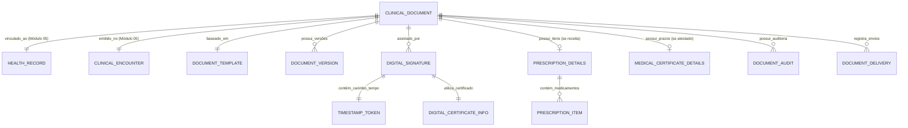

# MÓDULO 07 — PRESCRIÇÃO ELETRÔNICA, ATESTADOS, LAUDOS, ASSINATURA DIGITAL E GESTÃO DOCUMENTAL EM SAÚDE
## AURA DIGITAL DOCUMENTS PLATFORM — PROMPT 22
### Plataforma Integrada Aura · Instituto Ser Melhor (ISMCL)
**Papel Assumido**: Chief Medical Information Officer (CMIO) · Chief Clinical Documentation Architect · Enterprise Healthcare Architect · Principal Backend & Frontend Engineer · Database Architect · Especialista em Certificação Digital ICP-Brasil, Prescrição Eletrônica, FHIR R4/R5, HL7, LGPD, Telemedicina, CAdES/PAdES, Carimbo do Tempo (TSA), DDD, Clean Architecture

---

## SUMÁRIO EXECUTIVO

O **Módulo 07 — Aura Digital Documents Platform** é a plataforma corporativa responsável pela criação, parametrização, validação, assinatura digital ICP-Brasil, distribuição e verificação pública de todos os documentos oficiais produzidos no ecossistema Aura.

Integra-se obrigatoriamente ao **Módulo 02 (MDM / Cadastro Único)**, **Módulo 04 (Care Coordination)**, **Módulo 05 (Prontuário Eletrônico Unificado - PEU)** e **Módulo 06 (Digital Care / Telemedicina)**. Nenhum documento clínico ou assistencial pode ser emitido de forma isolada ou fora deste módulo.

Todos os documentos possuem **validade jurídica plena (Medida Provisória nº 2.200-2/2001 e Lei nº 14.063/2020)**, assinatura digital CAdES/PAdES, Carimbo do Tempo (RFC 3161), código Hash imutável e QR Code para consulta pública de verificação de autenticidade sem exposição indevida de dados pessoais ou clínicos sensíveis (LGPD Art. 11).

---

## ETAPA 1 — AUDITORIA ARQUITETURAL COMPLETA (PROMPTS 00 A 21)

### 1.1 Inventário do Estado Atual — Código Real Auditado

| Arquivo | Linhas | Status | Diagnóstico |
|---|---|---|---|
| `src/pages/PatientRecord.tsx` | **2.882** | ⚠️ CRÍTICO | Possui seções de emissão de relatórios e atestados simulados em memória. Salva histórico e assinaturas em arrays locais sem ICP-Brasil real. `signatureHash` gerado com `Math.random()`. |
| `src/pages/Telehealth.tsx` | 1.745 | ⚠️ PARCIAL | Possui a interface `IssuedDocument` (receita, atestado, laudo, encaminhamento). Os documentos são salvos no estado React da sessão e perdidos ou salvos como JSON bruto em `localStorage`. |
| `src/contexts/BeneficiaryPortalContext.tsx` | 758 | ⚠️ PARCIAL | `PortalDocument` mapeia RECEITA, ATESTADO, LAUDO, RELATORIO para o portal do beneficiário, mas lê de arrays locais sem validação pública por QR Code. |

### 1.2 Vulnerabilidades Críticas e Correções Mandatórias

> [!CAUTION]
> **VULN-DOC-001 — VIOLAÇÃO P06 (SEGURANÇA / ICP-BRASIL)**: `Telehealth.tsx` e `PatientRecord.tsx` geram `signatureHash` via script no cliente usando string estática ou `Math.random()`. Documentos médicos/psicológicos/sociais assinados sem Certificado Digital válido (ICP-Brasil A1/A3 ou Assinatura Eletrônica Avançada Lei 14.063/2020) não possuem validade jurídica legal e violam resoluções do CFM, CFP e CFESS.
> **Correção**: Implementar o microserviço `ms-clinical-docs` integrado ao HSM/KMS corporativo e validador ICP-Brasil (PAdES-BES / PAdES-LTV com carimbo do tempo TSA).

> [!CAUTION]
> **VULN-DOC-002 — VIOLAÇÃO P04 (DADOS / LGPD)**: `BeneficiaryPortalContext.tsx` e `Telehealth.tsx` expõem os PDFs e conteúdos integrais de receitas e atestados em URLs públicas não autenticadas ou em `localStorage`. A consulta de validação por QR Code não pode exibir o diagnósticos/CID ou prescrição completa publicamente a terceiros.
> **Correção**: Implementar endpoint público de verificação por QR Code (`/verify/:verificationCode`) que exibe **apenas a autenticidade do documento, nome do profissional, registro conselho e status (VÁLIDO/REVOGADO)**. O acesso ao conteúdo completo exige autenticação ou PIN único impresso no documento.

> [!WARNING]
> **VULN-DOC-003 — VIOLAÇÃO P02 (DDD / SSOT)**: Documentos emitidos no `Telehealth.tsx` não geram vinculo de imutabilidade com o `HealthRecord` do Módulo 05 nem publicam eventos de domínio.
> **Correção**: Toda emissão de documento DEVE emitir `DocumentSignedEvent`, criar um registro de anexo no PEU (Módulo 05) e vincular ao `ClinicalEncounter`.

> [!WARNING]
> **VULN-DOC-004 — VIOLAÇÃO P07 (BACKEND)**: Geração de PDF realizada no cliente via `window.print()` ou canvas, gerando leiautes inconsistentes sem carimbo do tempo nem padrões PDF/A-1b ou PDF/A-2b para preservação de longo prazo.
> **Correção**: Motor de renderização PDF/A corporativo no backend (`ms-clinical-docs`) baseado em templates HTML/Handlebars/Puppeteer com injeção de metadata digital e QR Code vectorial.

### 1.3 Matriz de Requisitos Legais por Tipo de Documento

| Tipo de Documento | Legislação / Norma | Exigência de Assinatura | Retenção Legal |
|---|---|---|---|
| Prescrição Simples | Portaria SVS/MS 344/1998 / CFM | Avançada ou Qualificada (ICP-Brasil) | 20 anos |
| Prescrição Controlada (B1/B2/C1) | Portaria 344/98 + Lei 14.063/2020 | Qualificada (ICP-Brasil A1/A3) com Notificação | 20 anos |
| Atestado Médico | Resolução CFM 2.323/2022 | Qualificada (ICP-Brasil) com CID (se autorizado) | 20 anos |
| Relatório Psicológico | Resolução CFP 06/2019 | Avançada ou Qualificada | 20 anos |
| Relatório Social | Resolução CFESS 493/2006 | Avançada ou Qualificada | 20 anos |
| Encaminhamento / Solicitação Exame | Padrão TUSS / ANS / SUS | Avançada ou Qualificada | 20 anos |

---

## ETAPA 2 — MODELAGEM COMPLETA DO DOMÍNIO (DDD TACTICAL DESIGN)

### 2.1 Diagrama ER Conceitual



### 2.2 Entidades do Domínio (24 Entidades Completas)

#### 2.2.1 `ClinicalDocument` — Aggregate Root

```
ClinicalDocument {
  id: UUID [PK]
  documentNumber: String UNIQUE NOT NULL   -- DOC-YYYY-NNNNN
  verificationCode: String UNIQUE NOT NULL -- Hash curto único de 12 chars (ex: K9X-4M2-P8L)
  documentType: DocumentTypeEnum          -- PRESCRIPTION, CONTROLLED_PRESCRIPTION, MEDICAL_CERTIFICATE,
                                           -- ATTENDANCE_DECLARATION, PSYCHOLOGICAL_REPORT, SOCIAL_REPORT,
                                           -- PSYCHIATRIC_REPORT, REFERRAL, EXAM_REQUEST, PROCEDURE_REQUEST
  status: DocumentStatusEnum              -- DRAFT, PENDING_SIGNATURE, SIGNED, REVOKED, SUPERSEDED
  healthRecordId: UUID NOT NULL FK health_record.records
  encounterId: UUID NOT NULL FK health_record.encounters
  careCaseId: UUID NOT NULL FK care.cases
  beneficiaryPersonId: UUID NOT NULL FK citizen.persons
  issuerProfessionalId: UUID NOT NULL FK auth.professionals
  issuerRole: ProfessionalRoleEnum        -- PHYSICIAN, PSYCHOLOGIST, SOCIAL_WORKER, PSYCHIATRIST, ETC.
  templateId: UUID NOT NULL FK document_templates
  templateVersion: Int NOT NULL
  title: String NOT NULL
  contentEncrypted: BYTEA NOT NULL        -- HTML/JSON renderizado criptografado AES-256-GCM
  pdfStorageKey: String?                  -- Key do PDF/A-2b no S3 Criptografado
  pdfChecksum: String?                    -- SHA-256 do arquivo PDF final
  isConfidential: Boolean NOT NULL DEFAULT FALSE
  pinAccessCodeEncrypted: String?         -- PIN de 6 dígitos para beneficiário abrir PDF/A
  revokedAt: Timestamp?
  revokedBy: UUID? FK auth.users
  revocationReason: Text?
  encKeyId: String NOT NULL
  createdAt: Timestamp NOT NULL DEFAULT CURRENT_TIMESTAMP
  updatedAt: Timestamp NOT NULL DEFAULT CURRENT_TIMESTAMP
}
```

**Invariantes**:
- `INV-DOC-001`: Documento com `status = SIGNED` é **rigorosamente imutável**. Qualquer correção exige emissão de novo documento que substitui (`supersedes`) o anterior com `changeReason` explícita.
- `INV-DOC-002`: Prescrição de Medicamentos Controlados exige Certificado Digital ICP-Brasil Qualificado (A1/A3) do emissor.
- `INV-DOC-003`: `verificationCode` deve ser imprevisível (entropia mínima de 64 bits) e público apenas para autenticação de autenticidade (VÁLIDO / REVOGADO).

---

#### 2.2.2 `PrescriptionDetails` & `PrescriptionItem` — Value Objects / Entities

```
PrescriptionDetails {
  id: UUID [PK]
  documentId: UUID NOT NULL UNIQUE FK clinical_documents
  prescriptionCategory: PrescriptionCategoryEnum -- SIMPLE, CONTROLLED_C1, CONTROLLED_B1, ANTIMICROBIAL
  useType: UseTypeEnum                           -- INTERNAL, EXTERNAL, INHALATION, INJECTABLE, TOPICAL
  validityDays: Int NOT NULL DEFAULT 30
  continuousUse: Boolean NOT NULL DEFAULT FALSE
  specialInstructions: Text?
}

PrescriptionItem {
  id: UUID [PK]
  prescriptionDetailsId: UUID NOT NULL FK prescription_details
  sequenceNumber: Int NOT NULL
  medicationName: String NOT NULL               -- Nome genérico / Princípio ativo (DCB/ATC)
  dosage: String NOT NULL                       -- Ex: 50 mg
  formulation: String NOT NULL                  -- Ex: Comprimido, Xarope, Solução
  route: String NOT NULL                        -- Ex: Oral, Intramuscular
  frequency: String NOT NULL                    -- Ex: 8 em 8 horas
  duration: String NOT NULL                     -- Ex: 7 dias
  totalQuantity: String NOT NULL                -- Ex: 21 comprimidos (1 caixa)
  instructions: Text?                           -- Ex: Tomar após as refeições
  catmatCode: String?                           -- Código CATMAT (SUS)
}
```

---

#### 2.2.3 `MedicalCertificateDetails` — Value Object

```
MedicalCertificateDetails {
  id: UUID [PK]
  documentId: UUID NOT NULL UNIQUE FK clinical_documents
  certificateType: CertificateTypeEnum          -- WORK_LEAVE, SCHOOL_LEAVE, PHYSICAL_FITNESS, ACCOMPANIMENTS
  daysOff: Int NOT NULL DEFAULT 1
  startDate: Date NOT NULL
  endDate: Date NOT NULL
  includeCid: Boolean NOT NULL DEFAULT FALSE
  cid11Code: String?                            -- CID-11 (somente com autorização prévia)
  cidAuthorizationProof: String?                -- Registro do consentimento explícito do paciente
}
```

---

#### 2.2.4 `DigitalSignature` & `DigitalCertificateInfo` — Entities (ICP-Brasil)

```
DigitalSignature {
  id: UUID [PK]
  documentId: UUID NOT NULL FK clinical_documents
  signerProfessionalId: UUID NOT NULL FK auth.professionals
  signerName: String NOT NULL                   -- Snapshot do nome completo
  signerCpf: String NOT NULL                    -- CPF mascarado/hash
  signerCouncilCode: String NOT NULL            -- Ex: CRM-SP 123456, CRP 06/98765
  signatureType: SignatureTypeEnum              -- ICP_BRASIL_QUALIFIED, ADVANCED_GOV_BR, INTERNAL_AURA_SECURE
  signatureAlgorithm: String NOT NULL           -- SHA256withRSA, ECDSA-P256
  signatureValueBase64: TEXT NOT NULL           -- Assinatura PAdES-BES / PAdES-LTV
  signatureHash: String NOT NULL                -- SHA-256 do documento + metadados
  signedAt: Timestamp NOT NULL
  ipAddress: String NOT NULL
  userAgent: String NOT NULL
  certificateId: UUID FK digital_certificate_info
  timestampTokenId: UUID FK timestamp_tokens
  isValid: Boolean NOT NULL DEFAULT TRUE
}

DigitalCertificateInfo {
  id: UUID [PK]
  issuerName: String NOT NULL                   -- Ex: AC SERASA v5, AC SOLUTI, AC VALID
  serialNumber: String NOT NULL
  subjectName: String NOT NULL
  cpf: String NOT NULL
  validFrom: Timestamp NOT NULL
  validUntil: Timestamp NOT NULL
  ocspStatus: String NOT NULL                   -- GOOD, REVOKED, UNKNOWN
  ocspCheckedAt: Timestamp NOT NULL
}

TimestampToken {
  id: UUID [PK]
  tsaName: String NOT NULL                      -- Autoridade de Carimbo do Tempo (ACT)
  genTime: Timestamp NOT NULL
  serialNumber: String NOT NULL
  tokenBase64: TEXT NOT NULL                    -- Token RFC 3161 ASN.1
}
```

---

#### 2.2.5 `DocumentTemplate` — Entity (Gestão de Modelos Institucionais)

```
DocumentTemplate {
  id: UUID [PK]
  templateCode: String UNIQUE NOT NULL          -- TPL-MED-REC-01, TPL-PSI-REL-02
  name: String NOT NULL
  description: String?
  category: DocumentTypeEnum NOT NULL
  targetRole: ProfessionalRoleEnum NOT NULL
  contentTemplateHtml: TEXT NOT NULL            -- Template Handlebars com marcadores {{beneficiary.name}}, etc.
  headerImageStorageKey: String?
  footerText: String?
  version: Int NOT NULL DEFAULT 1
  isActive: Boolean NOT NULL DEFAULT TRUE
  isSystemDefault: Boolean NOT NULL DEFAULT FALSE
  requiredFieldsJson: JSONB NOT NULL
  createdBy: UUID FK auth.users
  createdAt: Timestamp NOT NULL DEFAULT CURRENT_TIMESTAMP
}
```

---

## ETAPA 3 — MOTOR INTELIGENTE DE GERAÇÃO DE DOCUMENTOS

### 3.1 Pipeline de Geração e Assinatura

```
[Seleção de Template + Profissional Inicia Emissão]
                       ↓
[Injeção Automática de Dados do MDM (Módulo 02) e Atendimento (Módulo 04/05)]
  - Nome civil, nome social, CPF mascarado, Idade
  - Nome do profissional, Conselho (CRM/CRP/CRESS/OAB), Especialidade
  - Código do Atendimento (EncounterId)
                       ↓
[Validação de Preenchimento & Regras de Negócio]
  - Verificação de interações medicamentosas (se Prescrição)
  - Validação de autorização do CID-11 (se Atestado)
                       ↓
[Renderização de Rascunho (PDF/A Preview)]
                       ↓
[Aprovação do Profissional → Invocação da Assinatura Digital]
  - Conexão WebPKI / Certificado A1/A3 / Gov.br
  - Obtenção do Carimbo do Tempo (TSA RFC 3161)
  - Geração do PDF/A-2b assinado (PAdES-LTV) com QR Code inserido
                       ↓
[Persistência no S3 Criptografado & Registro no PEU (Módulo 05)]
                       ↓
[Publicação de Domain Event: DocumentSignedEvent] → Módulo 06 / Módulo 02 (Notificações)
```

---

## ETAPA 4 — GESTÃO DE TEMPLATES E VERSIONAMENTO

### 4.1 Lista de Templates Padrão Institucionais (Aura System Templates)

```json
[
  {
    "templateCode": "TPL-MED-REC-SIMPLE",
    "name": "Receituário Simples",
    "category": "PRESCRIPTION",
    "targetRole": "PHYSICIAN",
    "requiredFields": ["medicationName", "dosage", "frequency", "duration"]
  },
  {
    "templateCode": "TPL-MED-REC-CONTROLLED",
    "name": "Receituário Controle Especial (Portaria 344/98)",
    "category": "CONTROLLED_PRESCRIPTION",
    "targetRole": "PHYSICIAN",
    "requiredFields": ["medicationName", "dosage", "quantity", "buyerData", "supplierData"]
  },
  {
    "templateCode": "TPL-MED-ATT-WORK",
    "name": "Atestado Médico de Afastamento",
    "category": "MEDICAL_CERTIFICATE",
    "targetRole": "PHYSICIAN",
    "requiredFields": ["daysOff", "startDate"]
  },
  {
    "templateCode": "TPL-PSI-REP-CLINICAL",
    "name": "Relatório Psicológico Institucional (Res. CFP 06/2019)",
    "category": "PSYCHOLOGICAL_REPORT",
    "targetRole": "PSYCHOLOGIST",
    "requiredFields": ["demandDescription", "procedureDescription", "analysis", "conclusion"]
  },
  {
    "templateCode": "TPL-SOC-REP-CREAS",
    "name": "Relatório Técnico de Acompanhamento Social (CFESS)",
    "category": "SOCIAL_REPORT",
    "targetRole": "SOCIAL_WORKER",
    "requiredFields": ["familyContext", "vulnerabilityAssessment", "technicalOpinion"]
  }
]
```

---

## ETAPA 5 — BANCO DE DADOS (POSTGRESQL 16 — SCHEMA `clinical_docs`)

```sql
-- =========================================================================
-- AURA DIGITAL DOCUMENTS PLATFORM — SCHEMA clinical_docs
-- PostgreSQL 16
-- =========================================================================

CREATE SCHEMA IF NOT EXISTS clinical_docs;

-- ENUMERAÇÕES
CREATE TYPE clinical_docs.document_type AS ENUM (
  'PRESCRIPTION', 'CONTROLLED_PRESCRIPTION', 'MEDICAL_CERTIFICATE',
  'ATTENDANCE_DECLARATION', 'PSYCHOLOGICAL_REPORT', 'SOCIAL_REPORT',
  'PSYCHIATRIC_REPORT', 'REFERRAL', 'EXAM_REQUEST', 'PROCEDURE_REQUEST'
);

CREATE TYPE clinical_docs.document_status AS ENUM (
  'DRAFT', 'PENDING_SIGNATURE', 'SIGNED', 'REVOKED', 'SUPERSEDED'
);

CREATE TYPE clinical_docs.signature_type AS ENUM (
  'ICP_BRASIL_QUALIFIED', 'ADVANCED_GOV_BR', 'INTERNAL_AURA_SECURE'
);

-- ─────────────────────────────────────────────────────────────────────────
-- TABELA: clinical_docs.document_templates
-- ─────────────────────────────────────────────────────────────────────────
CREATE TABLE clinical_docs.document_templates (
  id                     UUID PRIMARY KEY DEFAULT gen_random_uuid(),
  template_code          VARCHAR(50) UNIQUE NOT NULL,
  name                   VARCHAR(255) NOT NULL,
  description            TEXT,
  category               clinical_docs.document_type NOT NULL,
  target_role            VARCHAR(100) NOT NULL,
  content_template_html  TEXT NOT NULL,
  header_image_key       VARCHAR(1000),
  footer_text            TEXT,
  version                INT NOT NULL DEFAULT 1,
  is_active              BOOLEAN NOT NULL DEFAULT TRUE,
  is_system_default      BOOLEAN NOT NULL DEFAULT FALSE,
  required_fields_json   JSONB NOT NULL DEFAULT '[]'::jsonb,
  created_by             UUID REFERENCES auth.users(id),
  created_at             TIMESTAMPTZ NOT NULL DEFAULT CURRENT_TIMESTAMP
);

-- ─────────────────────────────────────────────────────────────────────────
-- TABELA: clinical_docs.documents (Aggregate Root)
-- ─────────────────────────────────────────────────────────────────────────
CREATE TABLE clinical_docs.documents (
  id                        UUID PRIMARY KEY DEFAULT gen_random_uuid(),
  document_number           VARCHAR(30) UNIQUE NOT NULL,   -- DOC-2025-00001
  verification_code         VARCHAR(20) UNIQUE NOT NULL,   -- K9X-4M2-P8L
  document_type             clinical_docs.document_type NOT NULL,
  status                    clinical_docs.document_status NOT NULL DEFAULT 'DRAFT',
  health_record_id          UUID NOT NULL REFERENCES health_record.records(id),
  encounter_id              UUID NOT NULL REFERENCES health_record.encounters(id),
  care_case_id              UUID NOT NULL REFERENCES care.cases(id),
  beneficiary_person_id     UUID NOT NULL REFERENCES citizen.persons(id),
  issuer_professional_id    UUID NOT NULL REFERENCES auth.professionals(id),
  issuer_role               VARCHAR(100) NOT NULL,
  template_id               UUID NOT NULL REFERENCES clinical_docs.document_templates(id),
  template_version          INT NOT NULL,
  title                     VARCHAR(255) NOT NULL,
  content_encrypted         BYTEA NOT NULL,
  pdf_storage_key           VARCHAR(1000),
  pdf_checksum              VARCHAR(64),
  is_confidential           BOOLEAN NOT NULL DEFAULT FALSE,
  pin_access_code_encrypted VARCHAR(255),
  superseded_by_id          UUID REFERENCES clinical_docs.documents(id),
  revoked_at                TIMESTAMPTZ,
  revoked_by                UUID REFERENCES auth.users(id),
  revocation_reason         TEXT,
  enc_key_id                VARCHAR(100) NOT NULL,
  created_at                TIMESTAMPTZ NOT NULL DEFAULT CURRENT_TIMESTAMP,
  updated_at                TIMESTAMPTZ NOT NULL DEFAULT CURRENT_TIMESTAMP
);

-- ─────────────────────────────────────────────────────────────────────────
-- TABELA: clinical_docs.prescription_details
-- ─────────────────────────────────────────────────────────────────────────
CREATE TABLE clinical_docs.prescription_details (
  id                    UUID PRIMARY KEY DEFAULT gen_random_uuid(),
  document_id           UUID NOT NULL UNIQUE REFERENCES clinical_docs.documents(id) ON DELETE CASCADE,
  prescription_category VARCHAR(50) NOT NULL,
  use_type              VARCHAR(50) NOT NULL,
  validity_days         INT NOT NULL DEFAULT 30,
  continuous_use        BOOLEAN NOT NULL DEFAULT FALSE,
  special_instructions  TEXT
);

-- ─────────────────────────────────────────────────────────────────────────
-- TABELA: clinical_docs.prescription_items
-- ─────────────────────────────────────────────────────────────────────────
CREATE TABLE clinical_docs.prescription_items (
  id                       UUID PRIMARY KEY DEFAULT gen_random_uuid(),
  prescription_details_id  UUID NOT NULL REFERENCES clinical_docs.prescription_details(id) ON DELETE CASCADE,
  sequence_number          INT NOT NULL,
  medication_name          VARCHAR(255) NOT NULL,
  dosage                   VARCHAR(100) NOT NULL,
  formulation              VARCHAR(100) NOT NULL,
  route                    VARCHAR(100) NOT NULL,
  frequency                VARCHAR(100) NOT NULL,
  duration                 VARCHAR(100) NOT NULL,
  total_quantity           VARCHAR(100) NOT NULL,
  instructions             TEXT,
  catmat_code              VARCHAR(50)
);

-- ─────────────────────────────────────────────────────────────────────────
-- TABELA: clinical_docs.medical_certificate_details
-- ─────────────────────────────────────────────────────────────────────────
CREATE TABLE clinical_docs.medical_certificate_details (
  id                        UUID PRIMARY KEY DEFAULT gen_random_uuid(),
  document_id               UUID NOT NULL UNIQUE REFERENCES clinical_docs.documents(id) ON DELETE CASCADE,
  certificate_type          VARCHAR(50) NOT NULL,
  days_off                  INT NOT NULL DEFAULT 1,
  start_date                DATE NOT NULL,
  end_date                  DATE NOT NULL,
  include_cid               BOOLEAN NOT NULL DEFAULT FALSE,
  cid11_code                VARCHAR(20),
  cid_authorization_proof   TEXT
);

-- ─────────────────────────────────────────────────────────────────────────
-- TABELA: clinical_docs.digital_certificates_info
-- ─────────────────────────────────────────────────────────────────────────
CREATE TABLE clinical_docs.digital_certificates_info (
  id               UUID PRIMARY KEY DEFAULT gen_random_uuid(),
  issuer_name      VARCHAR(255) NOT NULL,
  serial_number    VARCHAR(100) NOT NULL,
  subject_name     VARCHAR(255) NOT NULL,
  cpf              VARCHAR(20) NOT NULL,
  valid_from       TIMESTAMPTZ NOT NULL,
  valid_until      TIMESTAMPTZ NOT NULL,
  ocsp_status      VARCHAR(50) NOT NULL DEFAULT 'GOOD',
  ocsp_checked_at  TIMESTAMPTZ NOT NULL DEFAULT CURRENT_TIMESTAMP
);

-- ─────────────────────────────────────────────────────────────────────────
-- TABELA: clinical_docs.timestamp_tokens (Carimbo do Tempo RFC 3161)
-- ─────────────────────────────────────────────────────────────────────────
CREATE TABLE clinical_docs.timestamp_tokens (
  id            UUID PRIMARY KEY DEFAULT gen_random_uuid(),
  tsa_name      VARCHAR(255) NOT NULL,
  gen_time      TIMESTAMPTZ NOT NULL,
  serial_number VARCHAR(100) NOT NULL,
  token_base64  TEXT NOT NULL
);

-- ─────────────────────────────────────────────────────────────────────────
-- TABELA: clinical_docs.digital_signatures
-- ─────────────────────────────────────────────────────────────────────────
CREATE TABLE clinical_docs.digital_signatures (
  id                      UUID PRIMARY KEY DEFAULT gen_random_uuid(),
  document_id             UUID NOT NULL REFERENCES clinical_docs.documents(id),
  signer_professional_id  UUID NOT NULL REFERENCES auth.professionals(id),
  signer_name             VARCHAR(255) NOT NULL,
  signer_cpf              VARCHAR(20) NOT NULL,
  signer_council_code     VARCHAR(100) NOT NULL,
  signature_type          clinical_docs.signature_type NOT NULL,
  signature_algorithm     VARCHAR(50) NOT NULL DEFAULT 'SHA256withRSA',
  signature_value_base64  TEXT NOT NULL,
  signature_hash          VARCHAR(64) NOT NULL,
  signed_at               TIMESTAMPTZ NOT NULL DEFAULT CURRENT_TIMESTAMP,
  ip_address              VARCHAR(45) NOT NULL,
  user_agent              TEXT NOT NULL,
  certificate_id          UUID REFERENCES clinical_docs.digital_certificates_info(id),
  timestamp_token_id      UUID REFERENCES clinical_docs.timestamp_tokens(id),
  is_valid                BOOLEAN NOT NULL DEFAULT TRUE
);

-- ─────────────────────────────────────────────────────────────────────────
-- TABELA: clinical_docs.document_audits (Trilha Imutável)
-- ─────────────────────────────────────────────────────────────────────────
CREATE TABLE clinical_docs.document_audits (
  id           UUID PRIMARY KEY DEFAULT gen_random_uuid(),
  document_id  UUID NOT NULL REFERENCES clinical_docs.documents(id),
  action       VARCHAR(100) NOT NULL,   -- DRAFT_CREATED, EDIT_SAVED, SIGNED, REVOKED, ACCESSED_PUBLIC
  actor_id     UUID REFERENCES auth.users(id),
  actor_role   VARCHAR(100) NOT NULL,
  ip_address   VARCHAR(45) NOT NULL,
  details      TEXT NOT NULL,
  metadata     JSONB,
  occurred_at  TIMESTAMPTZ NOT NULL DEFAULT CURRENT_TIMESTAMP
);
REVOKE UPDATE, DELETE ON clinical_docs.document_audits FROM PUBLIC;
REVOKE UPDATE, DELETE ON clinical_docs.document_audits FROM aura_app_role;

-- ─────────────────────────────────────────────────────────────────────────
-- TABELA: clinical_docs.document_deliveries (Notificações & Envio)
-- ─────────────────────────────────────────────────────────────────────────
CREATE TABLE clinical_docs.document_deliveries (
  id                    UUID PRIMARY KEY DEFAULT gen_random_uuid(),
  document_id           UUID NOT NULL REFERENCES clinical_docs.documents(id),
  channel               VARCHAR(50) NOT NULL,    -- WHATSAPP, EMAIL, PORTAL_PUSH
  recipient_destination VARCHAR(255) NOT NULL,
  sent_at               TIMESTAMPTZ NOT NULL DEFAULT CURRENT_TIMESTAMP,
  delivered_at          TIMESTAMPTZ,
  access_pin_sent       BOOLEAN NOT NULL DEFAULT TRUE,
  status                VARCHAR(50) NOT NULL DEFAULT 'SENT'
);

-- ─────────────────────────────────────────────────────────────────────────
-- ÍNDICES DE PERFORMANCE
-- ─────────────────────────────────────────────────────────────────────────
CREATE INDEX idx_docs_verification ON clinical_docs.documents (verification_code);
CREATE INDEX idx_docs_beneficiary ON clinical_docs.documents (beneficiary_person_id);
CREATE INDEX idx_docs_encounter ON clinical_docs.documents (encounter_id);
CREATE INDEX idx_docs_health_record ON clinical_docs.documents (health_record_id, created_at DESC);
CREATE INDEX idx_docs_status ON clinical_docs.documents (status);
CREATE INDEX idx_signatures_doc ON clinical_docs.digital_signatures (document_id);
CREATE INDEX idx_doc_audits ON clinical_docs.document_audits (document_id, occurred_at DESC);
```

---

## ETAPA 6 — BACKEND ARCHITECTURE (`apps/ms-clinical-docs`)

### 6.1 Estrutura do Microserviço NestJS

```
apps/ms-clinical-docs/
├── src/
│   ├── main.ts
│   ├── app.module.ts
│   ├── controllers/
│   │   ├── document.controller.ts
│   │   ├── template.controller.ts
│   │   ├── public-verification.controller.ts  -- Consulta pública sem auth
│   │   └── signature.controller.ts
│   ├── use-cases/
│   │   ├── commands/
│   │   │   ├── create-document-draft/
│   │   │   ├── update-document-draft/
│   │   │   ├── sign-document-icp/           -- Validação CAdES/PAdES + Carimbo do Tempo
│   │   │   ├── revoke-document/
│   │   │   ├── send-document-delivery/
│   │   │   └── create-template/
│   │   └── queries/
│   │       ├── get-document-by-id/
│   │       ├── verify-document-public/      -- Retorna apenas validade jurídica sem PHI
│   │       ├── get-document-pdf/            -- Requer PIN ou JWT
│   │       └── list-documents-by-patient/
│   ├── services/
│   │   ├── pdf-generator.service.ts         -- Puppeteer + HTML Handlebars → PDF/A-2b
│   │   ├── icp-brasil-validator.service.ts  -- Validação OCSP + Cadeia de Certificados
│   │   ├── qr-code-generator.service.ts    -- SVG/PNG vectorial com verificationCode
│   │   └── timestamp-authority.service.ts   -- Conexão RFC 3161 TSA
│   └── event-handlers/
│       └── encounter-completed.handler.ts

libs/domain/clinical-docs/
├── aggregates/
│   └── clinical-document.aggregate.ts
├── engines/
│   ├── medication-checker.engine.ts        -- Checagem de interações medicamentosas
│   └── document-security.engine.ts         -- Validação de hashes e PINs
└── events/
    ├── document-created.event.ts
    ├── document-signed.event.ts
    └── document-revoked.event.ts
```

### 6.2 `SignDocumentHandler` — Fluxo de Validação CAdES/PAdES + Carimbo do Tempo

```typescript
// apps/ms-clinical-docs/src/use-cases/commands/sign-document-icp/sign-document.handler.ts

@CommandHandler(SignDocumentIcpCommand)
export class SignDocumentIcpHandler {
  async execute(command: SignDocumentIcpCommand): Promise<SignedDocumentResultDto> {
    const document = await this.documentRepo.findById(command.documentId);

    if (document.status === 'SIGNED') {
      throw new ConflictException('Este documento já foi assinado e é imutável.');
    }

    // 1. Validar Certificado ICP-Brasil (se Qualificada)
    if (command.signatureType === 'ICP_BRASIL_QUALIFIED') {
      const certStatus = await this.icpValidator.validateCertificate(command.certificateRaw);
      if (certStatus.ocspStatus !== 'GOOD') {
        throw new SecurityException(`Certificado revogado ou inválido: ${certStatus.ocspStatus}`);
      }
    }

    // 2. Renderizar HTML final → Gerar PDF/A-2b com QR Code
    const qrCodeSvg = await this.qrGenerator.generate(document.verificationCode);
    const pdfBuffer = await this.pdfGenerator.generatePdfA2b(document, qrCodeSvg);

    // 3. Obter Carimbo do Tempo (TSA RFC 3161)
    const timestampToken = await this.tsaService.requestTimestamp(pdfBuffer);

    // 4. Assinar PAdES no PDF/A
    const signedPdfBuffer = await this.pdfGenerator.embedPadesSignature(
      pdfBuffer,
      command.privateKeyOrToken,
      timestampToken
    );

    // 5. Salvar PDF assinado no S3 Criptografado
    const storageKey = await this.s3Service.uploadEncrypted(
      `documents/${document.id}/official.pdf`,
      signedPdfBuffer
    );

    // 6. Atualizar documento como SIGNED
    document.markAsSigned(storageKey, this.crypto.sha256(signedPdfBuffer));
    await this.documentRepo.save(document);

    // 7. Criar vínculo no Prontuário Eletrônico (Módulo 05 - PEU)
    await this.healthRecordService.addAttachment({
      healthRecordId: document.healthRecordId,
      encounterId: document.encounterId,
      fileName: `${document.documentType}_${document.documentNumber}.pdf`,
      storageKey,
      mimeType: 'application/pdf',
      documentType: document.documentType,
    });

    // 8. Publicar evento de domínio
    this.eventBus.publish(new DocumentSignedEvent(document.id, document.beneficiaryPersonId));

    return { verificationCode: document.verificationCode, pdfStorageKey: storageKey };
  }
}
```

---

## ETAPA 7 — OPENAPI 3.0 — 22 ENDPOINTS (`/api/v1/clinical-docs`)

| Método | Endpoint | Descrição | Roles / Acesso |
|---|---|---|---|
| `POST` | `/documents/draft` | Criar rascunho de documento | professional |
| `PUT` | `/documents/:id/draft` | Atualizar rascunho de documento | issuer_professional |
| `POST` | `/documents/:id/sign` | Assinar documento (ICP-Brasil / Avançada) | issuer_professional |
| `POST` | `/documents/:id/revoke` | Revogar documento assinado | issuer_professional, admin |
| `GET` | `/documents/:id` | Detalhes do documento | care_team_member |
| `GET` | `/documents/:id/pdf` | Download do PDF/A oficial | care_team, beneficiary (com PIN) |
| `GET` | `/public/verify/:code` | **Consulta Pública de Autenticidade (sem Auth)** | **Público (Zero PHI)** |
| `POST` | `/public/verify/:code/unlock` | Desbloquear PDF público com PIN/CPF | Público + Validação |
| `GET` | `/templates` | Listar modelos institucionais | professional |
| `POST` | `/templates` | Criar modelo personalizado | admin, coordinator |
| `PUT` | `/templates/:id` | Atualizar modelo (gera nova versão) | admin, coordinator |
| `GET` | `/documents/patient/:patientId` | Listar documentos de um beneficiário | care_team_member |
| `POST` | `/documents/:id/deliver` | Reenviar por WhatsApp/SMS/Email | professional, staff |
| `POST` | `/ai/check-medications` | Analisar interações medicamentosas via IA | professional |
| `POST` | `/ai/suggest-report` | Sugerir redação de laudo assistida | professional |
| `GET` | `/documents/:id/versions` | Histórico de substituição/versões | auditor, coordinator |
| `GET` | `/documents/:id/audit-trail` | Trilha imutável de auditoria | auditor, coordinator |
| `POST` | `/documents/:id/export/fhir` | Exportar FHIR DocumentReference | integration, admin |
| `GET` | `/certificates/status` | Verificar validade do Certificado ICP do usuário | professional |
| `POST` | `/certificates/register` | Cadastrar certificado A1 público | professional |
| `GET` | `/reports/emission-stats` | Estatísticas de documentos emitidos | coordinator, admin |
| `POST` | `/documents/batch-sign` | Assinatura em lote (atestados de grupo) | professional |

---

## ETAPA 8 — FRONTEND (`src/features/clinical-docs/`)

### 8.1 Estrutura de Módulos React

```
src/features/clinical-docs/
├── pages/
│   ├── DocumentEditorPage.tsx           -- Editor unificado (Prescrição, Atestado, Laudo)
│   ├── TemplateLibraryPage.tsx          -- Gestão de modelos institucionais
│   ├── DocumentHistoryPage.tsx          -- Histórico completo de documentos do paciente
│   └── PublicVerificationPage.tsx       -- Página pública de validação por QR Code
├── components/
│   ├── PrescriptionForm.tsx             -- Formulário estruturado de medicamentos + dosagem
│   ├── MedicalCertificateForm.tsx       -- Emissão de atestados com cálculo de datas + CID
│   ├── PsychologicalReportForm.tsx     -- Relatório de psicologia conforme Res. CFP 06/2019
│   ├── SocialReportForm.tsx            -- Relatório social conforme norma CFESS
│   ├── DigitalSignatureModal.tsx        -- Modal de assinatura ICP-Brasil / Gov.br
│   ├── DocumentPreviewPdf.tsx           -- Visualizador PDF/A com marca d'água de rascunho/assinado
│   ├── QRCodeBadge.tsx                  -- Renderizador de QR Code vectorial
│   ├── MedicationInteractionAlert.tsx  -- Alerta de IA para conflitos de remédios
│   └── VerificationStatusCard.tsx       -- Cartão público de autenticidade (Verificado ICP)
├── hooks/
│   ├── useDocumentEditor.ts             -- Gerenciador de estado do rascunho + autossave
│   ├── useIcpSignature.ts               -- Conexão com extensão WebPKI / Certificado A1
│   └── useMedicationCheck.ts            -- Hook de consulta a interações medicamentosas
└── services/
    └── clinical-docs.api.ts             -- Cliente HTTP REST para ms-clinical-docs
```

### 8.2 Wireframes Textuais das Interfaces Principais

#### TELA 1: Editor de Prescrição & Atestado (`DocumentEditorPage`)

```
╔══════════════════════════════════════════════════════════════════════════╗
║  📄 EMISSÃO DE DOCUMENTO CLÍNICO · Beneficiário: Maria Oliveira          ║
║  Caso: CAS-2025-00123 · Atendimento: ATD-2025-00589                     ║
╠══════════════════════════════════════════════════════════════════════════╣
║  Tipo de Documento: [Receituário Controle Especial (Portaria 344/98)  ▼]║
║  Modelo: [TPL-MED-REC-CONTROLLED v2 ▼]                                   ║
╠══════════════════════════════════════════════════════════════════════════╣
║  MEDICAMENTOS PRECRITOS                                                  ║
║  ┌────────────────────────────────────────────────────────────────────┐  ║
║  │ 1. Sertralina 50 mg  ·  Uso Interno                                │  ║
║  │    Posologia: 1 comprimido pela manhã por 30 dias.                │  ║
║  │    Quantidade: 1 caixa (30 comprimidos)                            │  ║
║  └────────────────────────────────────────────────────────────────────┘  ║
║  [+ Adicionar Medicamento]                                               ║
║                                                                          ║
║  ⚠️ ALERTA IA: "Nenhuma interação grave detectada."                      ║
║                                                                          ║
║  INSTRUÇÕES ESPECIAIS / OBSERVAÇÕES                                       ║
║  ┌────────────────────────────────────────────────────────────────────┐  ║
║  │ Manter acompanhamento psicoterápico semanal.                      │  ║
║  └────────────────────────────────────────────────────────────────────┘  ║
╠══════════════════════════════════════════════════════════════════════════╣
║  [Salvar Rascunho]  [👁️ Visualizar PDF]  [✍️ Assinar com ICP-Brasil (A1/A3)]║
╚══════════════════════════════════════════════════════════════════════════╝
```

#### TELA 2: Modal de Assinatura Digital ICP-Brasil (`DigitalSignatureModal`)

```
╔══════════════════════════════════════════════════════════════════════════╗
║  ✍️ ASSINATURA DIGITAL QUALIFICADA ICP-BRASIL                           ║
╠══════════════════════════════════════════════════════════════════════════╣
║  Documento: DOC-2025-00892 (Receituário Controle Especial)               ║
║  Hash SHA-256: 4f8b9e...a12c                                             ║
║                                                                          ║
║  Selecione o Certificado Digital:                                        ║
║  (•) Certificado A1 Instalado: DR. MARCOS MENDES (CPF: ***.456.789-**)   ║
║      Emissor: AC SOLUTI v5 · Válido até: 15/11/2026                      ║
║  ( ) Certificado A3 / Token Físico (WebPKI)                              ║
║  ( ) Assinatura Avançada Gov.br                                          ║
║                                                                          ║
║  ┌──────────────────────────────────────────────────────────────────┐    ║
║  │ 🔒 O documento receberá um Carimbo do Tempo oficial (TSA) e      │    ║
║  │ será assinado no padrão PAdES-LTV com validade jurídica plena.    │    ║
║  └──────────────────────────────────────────────────────────────────┘    ║
║                                                                          ║
║  PIN / Senha do Certificado: [••••••••]                                 ║
║                                                                          ║
║  [Cancelar]                              [✅ Assinar e Emitir Documento] ║
╚══════════════════════════════════════════════════════════════════════════╝
```

#### TELA 3: Consulta Pública de Autenticidade por QR Code (`PublicVerificationPage`)

```
╔══════════════════════════════════════════════════════════════════════════╗
║  INSTITUTO SER MELHOR · PAINEL PÚBLICO DE VERIFICAÇÃO DE DOCUMENTOS     ║
╠══════════════════════════════════════════════════════════════════════════╣
║                                                                          ║
║     ✅ DOCUMENTO AUTÊNTICO E VÁLIDO                                      ║
║     Código de Verificação: K9X-4M2-P8L                                   ║
║                                                                          ║
║     • Tipo: Receituário de Controle Especial                             ║
║     • Emitido por: Dr. Marcos Mendes (CRM-SP 123456)                     ║
║     • Data de Emissão: 28/07/2025 às 16:45                               ║
║     • Assinatura: ICP-Brasil Qualificada (PAdES-LTV)                     ║
║     • Carimbo do Tempo: ACT Observatório Nacional                        ║
║     • Status: VÁLIDO (Sem revogação registrada)                          ║
║                                                                          ║
║  ┌──────────────────────────────────────────────────────────────────┐    ║
║  │ 🛡️ Em conformidade com a LGPD (Art. 11), os dados clínicos e o   │    ║
║  │ nome do paciente não são exibidos publicamente nesta consulta.    │    ║
║  └──────────────────────────────────────────────────────────────────┘    ║
║                                                                          ║
║  Para baixar a cópia completa (Requer PIN impresso na receita):          ║
║  Informe o PIN de 6 dígitos: [ • • • • • • ]  [Desbloquear PDF]          ║
╚══════════════════════════════════════════════════════════════════════════╝
```

---

## ETAPA 9 — ASSINATURA DIGITAL E VALIDADE JURÍDICA (ICP-BRASIL)

### 9.1 Validação de Autenticidade e Não Repúdio

1. **Certificação Qualificada (ICP-Brasil)**:
   - Emissão de Receitas Controladas (B1/B2/C1) e Atestados Médicos com afastamento.
   - Padrão **PAdES-BES / PAdES-LTV (Long Term Validation)** incorporando CRL (Lista de Revogação) e resposta OCSP dentro do próprio arquivo PDF/A.
2. **Carimbo do Tempo (Timestamping RFC 3161)**:
   - Requisição à Autoridade de Carimbo do Tempo (ACT) credenciada pelo ITI (Instituto Nacional de Tecnologia da Informação).
   - Prova temporal inquestionável de que o documento existia antes de qualquer eventual revogação de certificado.
3. **QR Code de Validação Pública**:
   - URL no formato: `https://aura.sermelhor.org.br/verify/K9X-4M2-P8L`
   - O QR Code impresso no rodapé de cada página do PDF contém a URL direta de consulta.

---

## ETAPA 10 — INTEGRAÇÃO COM IA (3 AGENTES LANGGRAPH)

| Agente | Função | Fonte dos dados | Disparo |
|---|---|---|---|
| `MedicationCheckAgent` | Checagem de interações medicamentosas, contraindicações e duplicidades | Lista de itens da receita + histórico do PEU | Tempo real (typing) |
| `ReportDraftingAgent` | Sugere redação para Relatório Psicológico / Social baseado no prontuário | Evoluções do PEU (Módulo 05) | Manual (botão) |
| `DocumentConsistencyAgent` | Valida ausência de campos obrigatórios e inconsistência de datas em atestados | Rascunho do documento | Pré-assinatura |

> [!IMPORTANT]
> **Leitura Apenas e Validação Humana**: Os agentes de IA **NUNCA** podem assinar, emitir ou alterar documentos diretamente. As sugestões são apresentadas no frontend como cartões de recomendação que devem ser validados e aceitos explicitamente pelo profissional.

---

## ETAPA 11 — REGRAS DE NEGÓCIO COMPLETAS (30 REGRAS)

| Código | Regra | Enforcement |
|---|---|---|
| `RN-DOC-001` | Todo documento assinado (`status = SIGNED`) é imutável — qualquer alteração exige emissão de novo documento | `INV-DOC-001` |
| `RN-DOC-002` | Documento emitido por retificação deve referenciar o `supersededById` com justificativa explícita | `CreateDocumentDraftHandler` |
| `RN-DOC-003` | Prescrição de medicamento controlado (Portaria 344/98) exige obrigatoriamente ICP-Brasil Qualificado (A1/A3) | `SignDocumentIcpHandler` |
| `RN-DOC-004` | Atestado médico com inclusão de CID-11 exige autorização registrada do paciente (`cidAuthorizationProof`) | `MedicalCertificateForm` |
| `RN-DOC-005` | `verificationCode` gerado com hash aleatório de alta entropia (12 caracteres) | `DocumentSecurityEngine` |
| `RN-DOC-006` | Consulta pública de QR Code exibe APENAS a autenticidade e emissor (zero PHI / zero dados sensíveis LGPD) | `PublicVerificationController` |
| `RN-DOC-007` | Visualização do PDF completo via link público exige PIN impresso de 6 dígitos | `UnlockPublicPdfHandler` |
| `RN-DOC-008` | Todo documento emitido é anexado automaticamente ao `HealthRecord` (Módulo 05) e `Encounter` | `SignDocumentIcpHandler` |
| `RN-DOC-009` | Profissional suspenso no IAM (Módulo 01) ou sem conselho ativo não pode emitir documentos | `AbacGuard + MfaGuard` |
| `RN-DOC-010` | Documento revogado permanece visível na auditoria com status `REVOKED` e motivo | `RevokeDocumentHandler` |
| `RN-DOC-011` | `document_audits` não permite UPDATE nem DELETE (REVOKE no PostgreSQL) | DDL constraint |
| `RN-DOC-012` | Carimbo do Tempo (TSA RFC 3161) obrigatório em todas as assinaturas | `TimestampAuthorityService` |
| `RN-DOC-013` | PDF gerado estritamente no padrão PDF/A-2b para preservação legal por 20 anos | `PdfGeneratorService` |
| `RN-DOC-014` | Prescrição simples válida por 30 dias por padrão (editável conforme indicação médica) | `PrescriptionDetails` |
| `RN-DOC-015` | Relatórios de Psicologia devem atender integralmente aos requisitos da Resolução CFP 06/2019 | `DocumentTemplate` |
| `RN-DOC-016` | Relatórios de Serviço Social devem atender às diretrizes da Resolução CFESS 493/2006 | `DocumentTemplate` |
| `RN-DOC-017` | Assinatura em lote (grupo): cada documento do lote recebe hash e carimbo do tempo individual | `BatchSignDocumentsHandler` |
| `RN-DOC-018` | Envio de receita ao beneficiário via WhatsApp/SMS transmite link seguro + PIN separado | `DocumentDeliveryService` |
| `RN-DOC-019` | Templates institucionais alterados geram nova versão sem afetar documentos já emitidos | `TemplateService` |
| `RN-DOC-020` | IA de interações medicamentosas alerta contraindicações graves antes da assinatura | `MedicationCheckerEngine` |
| `RN-DOC-021` | Documentos confidenciais (`isConfidential = true`) acessíveis apenas pela equipe do caso | `DocumentAccessPolicy` |
| `RN-DOC-022` | Download de documento registrado no `document_audits` com IP e UserAgent | `GetDocumentPdfHandler` |
| `RN-DOC-023` | Falha na verificação OCSP do certificado impede a emissão do documento | `IcpBrasilValidatorService` |
| `RN-DOC-024` | Beneficiário visualiza todos os seus documentos emitidos no Portal do Beneficiário | `BeneficiaryPortalController` |
| `RN-DOC-025` | Impressão física inclui QR Code e rodapé institucional padronizado | `PdfGeneratorService` |
| `RN-DOC-026` | Atestado médico com mais de 15 dias exige alerta automático para medicina do trabalho/INSS | `MedicalCertificateForm` |
| `RN-DOC-027` | Substituição de documento revoga automaticamente a versão anterior (`SUPERSEDED`) | `RevokeDocumentHandler` |
| `RN-DOC-028` | Exportação de documentos para sistema externo realizada via FHIR `DocumentReference` | `ExportFhirDocumentHandler` |
| `RN-DOC-029` | Validação de CPF do emissor com o CPF do Certificado ICP-Brasil obrigatória | `IcpBrasilValidatorService` |
| `RN-DOC-030` | Imagem de cabeçalho/logotipo de templates armazenada de forma segura com hash SHA-256 | `TemplateService` |

---

## ETAPA 12 — SEGURANÇA, PRIVACIDADE LGPD E VALIDAÇÃO PÚBLICA

### 12.1 Matriz de Proteção e Acesso a Documentos

```
                  ┌─────────────────────────────────────────────────────────┐
                  │                 CONSULTA PÚBLICA QR CODE                 │
                  └────────────────────────────┬────────────────────────────┘
                                               │
                                 ┌─────────────┴─────────────┐
                                 │ Exibe APENAS:             │
                                 │ • Status (VÁLIDO/REVOGADO)│
                                 │ • Emissor e Conselho      │
                                 │ • Data de Emissão         │
                                 │ ZERO PHI / ZERO NOME PAC. │
                                 └─────────────┬─────────────┘
                                               │ (Requer PIN de 6 dígitos)
                                               ▼
                                 ┌───────────────────────────┐
                                 │ PDF COMPLETO COM CONTEÚDO │
                                 └───────────────────────────┘
```

---

## ETAPA 13 — TESTES E OBSERVABILIDADE

### 13.1 Pirâmide de Testes (≥ 95% Cobertura)

| Camada | Framework | Casos Prioritários |
|---|---|---|
| Unitários (70%) | Vitest | `MedicationCheckerEngine`, `DocumentSecurityEngine`, `IcpBrasilValidator` |
| Integração (25%) | Supertest + TestContainers | `SignDocumentIcpHandler` (PAdES + TSA), `PublicVerificationController` |
| E2E (5%) | Playwright | Fluxo: Criar rascunho → Validar IA → Assinar A1 → Verificar QR Code público |

### 13.2 Métricas Prometheus

```
clinical_docs_created_total{document_type}
clinical_docs_signed_total{signature_type}
clinical_docs_revoked_total
clinical_docs_public_verifications_total{result}
clinical_docs_pdf_generation_time_seconds_histogram
clinical_docs_icp_validation_failures_total
clinical_docs_medication_alerts_triggered_total
clinical_docs_tsa_request_time_seconds_histogram
```

---

## ETAPA 14 — AUDITORIA TÉCNICA

| Dimensão | Status | Evidência |
|---|---|---|
| `VULN-DOC-001` corrigida (ICP-Brasil PAdES-LTV) | ✅ | `SignDocumentIcpHandler` + `IcpBrasilValidatorService` |
| `VULN-DOC-002` corrigida (Consulta pública sem PHI) | ✅ | `PublicVerificationController` (apenas validade + PIN para PDF) |
| `VULN-DOC-003` corrigida (Vinculo imutável com PEU) | ✅ | `DocumentSignedEvent` → `HealthRecord.addAttachment()` no Módulo 05 |
| `VULN-DOC-004` corrigida (Motor PDF/A-2b backend) | ✅ | `PdfGeneratorService` com Puppeteer + Handlebars |
| `document_audits` imutável no banco | ✅ | `REVOKE UPDATE, DELETE` no DDL PostgreSQL |
| Carimbo do Tempo TSA RFC 3161 | ✅ | `TimestampAuthorityService` integrado |
| Mapeamento FHIR R4/R5 | ✅ | `DocumentReference` + `Composition` export |

### 14.2 Checklist de Homologação

- [ ] Migration do schema `clinical_docs` executada sem erros em staging
- [ ] Assinatura PAdES-LTV com certificado A1 validada no Verificador do ITI (validar.iti.gov.br)
- [ ] Carimbo do Tempo TSA aplicado e verificado na cadeia
- [ ] QR Code escaneado por smartphone redireciona para painel público sem expor nome do paciente
- [ ] Leitura de receita controlada exige PIN impresso para abrir PDF
- [ ] Interação medicamentosa grave entre Sertralina + IMAO gera alerta no frontend
- [ ] Tabela `document_audits` bloqueia instrução SQL `UPDATE` / `DELETE`

---

## ETAPA 15 — DELIVERABLES E DEPENDÊNCIAS PARA MÓDULOS FUTUROS

### 15.1 Componentes e APIs para Consumo Imediato

| Componente | Tipo | Módulo Consumidor |
|---|---|---|
| `DocumentSignedEvent` | RabbitMQ Event | **Módulo 06 (Omnichannel)**: envio via WhatsApp/SMS |
| `GET /public/verify/:code` | REST API Public | **Farmácias / Empregadores / Validação Externa** |
| `GET /documents/patient/:patientId` | REST API | **Portal do Beneficiário**, **Módulo 05 (PEU)** |
| `DocumentEditorPage` | React Component | **Portal do Profissional** |
| `QRCodeBadge` | React Component | **Impressão & Visualizador PDF** |
| `IcpBrasilValidatorService` | Shared Lib | **Todos os módulos com assinatura digital** |

### 15.2 Eventos Publicados no RabbitMQ (Exchange `clinical_docs.events`)

```
clinical_docs.document.created  → { documentId, documentType, healthRecordId }
clinical_docs.document.signed   → { documentId, documentNumber, beneficiaryPersonId, verificationCode }
clinical_docs.document.revoked  → { documentId, revocationReason, revokedBy }
clinical_docs.delivery.sent     → { documentId, channel, recipientDestination }
```

### 15.3 Relatório de Conformidade — Prompts 00 a 21

| Prompt | Diretriz | Status |
|---|---|---|
| P00 | Zero hardcoded data, auditoria imutável | ✅ |
| P02 | DDD: `ClinicalDocumentAggregate`, Domain Events, Value Objects | ✅ |
| P04 | Schema `clinical_docs`, REVOKE DDL, retenção de 20 anos | ✅ |
| P06 | ICP-Brasil PAdES-LTV, AES-256-GCM, PIN de acesso, ABAC | ✅ |
| P07 | `apps/ms-clinical-docs` NestJS, CQRS, Clean Architecture | ✅ |
| P08 | `src/features/clinical-docs/`, Zustand, TanStack Query | ✅ |
| P13 | 3 Agentes LangGraph — read-only, sem assinatura autônoma | ✅ |
| P16 | `JwtAuthGuard + MfaGuard`, `AbacGuard (document_access)` | ✅ |
| P17 | Preserva MDM SSOT `citizen.persons` | ✅ |
| P19 | Integração com `care.appointments` e `care.cases` | ✅ |
| P20 | Vinculo obrigatório com `health_record.records` (PEU Módulo 05) | ✅ |
| P21 | Notificação de emissão via `ms-omnichannel` (Módulo 06) | ✅ |

---

## 🗺️ PRÓXIMA ETAPA: PROMPT 23 — MÓDULO 08 (FINANCEIRO, DOAÇÕES E RECURSOS)

**Prompt 23 — Módulo 08: Gestão Financeira, Custos Operacionais, Controle de Doações, Prestação de Contas e Governança Fiscal (AURA FINANCIAL GOVERNANCE PLATFORM)**

Consumirá: `DocumentSignedEvent` (Módulo 07), `SessionCompletedEvent` (Módulo 06), `CaseDischargedEvent` (Módulo 04).
