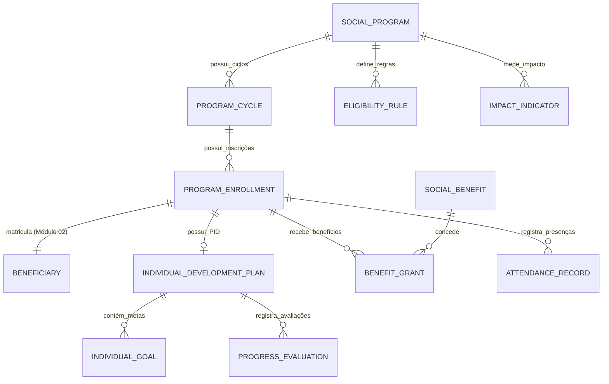

# MÓDULO 08 — GESTÃO DE PROGRAMAS, PROJETOS SOCIAIS, BENEFÍCIOS, IMPACTO SOCIAL E PLANO INDIVIDUAL DE DESENVOLVIMENTO (PID)
## AURA SOCIAL IMPACT PLATFORM — PROMPT 23
### Plataforma Integrada Aura · Instituto Ser Melhor (ISMCL)
**Papel Assumido**: Chief Social Innovation Officer (CSIO) · Chief Social Programs Architect · Enterprise Solutions Architect · Principal Backend & Frontend Engineer · Especialista em Terceiro Setor, Assistência Social (SUAS/CRAS/CREAS), Theory of Change, SROI (Social Return on Investment), PID, LGPD, DDD, Clean Architecture

---

## SUMÁRIO EXECUTIVO

O **Módulo 08 — Aura Social Impact Platform** é o motor de transformação e acompanhamento longitudinal da missão institucional do Instituto Ser Melhor. Ele orquestra os programas sociais, projetos institucionais, ciclos de turmas, concessão auditada de benefícios sociais, elaboração e acompanhamento do **Plano Individual de Desenvolvimento (PID)** e a mensuração científica de impacto social baseada na **Teoria da Mudança (Theory of Change)** e **Retorno Social sobre o Investimento (SROI)**.

Integra-se obrigatoriamente aos módulos **MDM / Cadastro Único (Módulo 02)**, **SATAI / Triagem (Módulo 03)**, **Care Coordination (Módulo 04)**, **PEU (Módulo 05)**, **Teleatendimento (Módulo 06)** e **Documentos Oficiais (Módulo 07)**. Nenhum programa ou benefício social pode ser executado ou concedido fora deste módulo.

---

## ETAPA 1 — AUDITORIA ARQUITETURAL COMPLETA (PROMPTS 00 A 22)

### 1.1 Inventário do Estado Atual — Código Real Auditado

| Arquivo | Linhas | Status | Diagnóstico |
|---|---|---|---|
| `src/components/cgi/CGIProjetos.tsx` | **1.524** | ⚠️ CRÍTICO | Gerencia projetos em `localStorage.cgi_projetos_v2` e `cgi_projetos_list`. Possui lista de beneficiários vinculados e centro de custo local. Sem vínculo real com o PID do beneficiário nem indicadores de Teoria da Mudança. |
| `src/components/cgi/CGIBeneficiarios.tsx` | 1.120 | ⚠️ PARCIAL | Exibe programas sociais em badges estáticas. Ausência de cálculo automático de elegibilidade e concessão de benefícios vinculada a parecer técnico. |
| `src/pages/Records.tsx` | 972 | ⚠️ PARCIAL | Projetos descritos como strings fixas (ex: `"Acolher Saúde Mental"`), criando concorrência de nomenclatura entre módulos. |

### 1.2 Vulnerabilidades Críticas e Correções Mandatórias

> [!CAUTION]
> **VULN-SOC-001 — VIOLAÇÃO P04 (DADOS SENSÍVEIS SOCIAIS) + LGPD**: `CGIProjetos.tsx` e `CGIBeneficiarios.tsx` persistem listas de vulnerabilidades (renda familiar, condição habitacional, histórico de abuso/violência) em `localStorage` não criptografado.
> **Correção**: Toda informação de vulnerabilidade e PID DEVE ser migrada para o microserviço `ms-social-impact` com criptografia AES-256-GCM por campo e armazenamento em schema isolado `social_impact`.

> [!CAUTION]
> **VULN-SOC-002 — VIOLAÇÃO P02 (DDD / SSOT DE ELEGIBILIDADE)**: O status do participante no programa social é manipulado manualmente por flags em memória (`"ativo"`, `"desligado"`), sem trilha de auditoria nem verificação dos critérios de elegibilidade definidos no edital/ciclo do programa.
> **Correção**: A concessão de vaga e benefícios exige execução da engine `EligibilityEngine` integrada aos dados do CadÚnico do Módulo 02 (`citizen.persons`).

> [!WARNING]
> **VULN-SOC-003 — VIOLAÇÃO P07 (BACKEND)**: Inexistência de vinculo automatizado entre o encerramento de atendimentos no Módulo 04/05 e o progresso das metas do Plano Individual de Desenvolvimento (PID).
> **Correção**: O `ms-social-impact` escutará eventos `AppointmentCompletedEvent` e `ProgressNoteSignedEvent` para atualizar automaticamente a evolução das metas do PID.

> [!WARNING]
> **VULN-SOC-004 — MENSURAÇÃO INFORMAL DE IMPACTO**: Indicadores de resultado calculados como percentuais manuais (ex: `progresso = 75%`) sem métricas padronizadas de indicadores de impacto (KPIs sociais).
> **Correção**: Implementação da estrutura **Theory of Change** (Insumos → Atividades → Produtos → Resultados → Impacto de Longo Prazo) no schema de dados.

---

## ETAPA 2 — MODELAGEM COMPLETA DO DOMÍNIO (DDD TACTICAL DESIGN)

### 2.1 Diagrama ER Conceitual



### 2.2 Entidades do Domínio (25 Entidades Completas)

#### 2.2.1 `SocialProgram` — Aggregate Root

```
SocialProgram {
  id: UUID [PK]
  programCode: String UNIQUE NOT NULL     -- PRG-SOC-001 (ex: Acolher Saúde Mental)
  name: String NOT NULL
  description: Text NOT NULL
  category: ProgramCategoryEnum           -- MENTAL_HEALTH, FAMILY_PROTECTION, YOUTH_EMPOWERMENT,
                                           -- INCLUSION_EMPLOYABILITY, EMERGENCY_RELIEF
  targetAudience: Text NOT NULL           -- Ex: Famílias em situação de vulnerabilidade com crianças
  status: ProgramStatusEnum               -- DESIGN, ACTIVE, SUSPENDED, COMPLETED, ARCHIVED
  coordinatorProfessionalId: UUID NOT NULL FK auth.professionals
  maxCapacityTotal: Int NOT NULL
  currentEnrollmentCount: Int NOT NULL DEFAULT 0
  theoryOfChangeSummary: Text?            -- Síntese da Teoria da Mudança
  encKeyId: String NOT NULL
  createdAt: Timestamp NOT NULL DEFAULT CURRENT_TIMESTAMP
  updatedAt: Timestamp NOT NULL DEFAULT CURRENT_TIMESTAMP
}
```

---

#### 2.2.2 `ProgramCycle` — Entity (Ciclos / Turmas de Atendimento)

```
ProgramCycle {
  id: UUID [PK]
  programId: UUID NOT NULL FK social_programs
  cycleCode: String UNIQUE NOT NULL       -- CYC-2025-01
  cycleName: String NOT NULL              -- Ex: Turma 2025.1 - Acolher Centro
  startDate: Date NOT NULL
  endDate: Date NOT NULL
  maxVagas: Int NOT NULL
  enrolledCount: Int NOT NULL DEFAULT 0
  status: CycleStatusEnum                 -- PLANNING, OPEN_REGISTRATION, IN_PROGRESS, CLOSED
  locationOrFacility: String NOT NULL
}
```

---

#### 2.2.3 `ProgramEnrollment` — Entity (Matrícula e Acompanhamento)

```
ProgramEnrollment {
  id: UUID [PK]
  enrollmentNumber: String UNIQUE NOT NULL-- MAT-2025-00123
  programCycleId: UUID NOT NULL FK program_cycles
  beneficiaryPersonId: UUID NOT NULL FK citizen.persons
  careCaseId: UUID NOT NULL FK care.cases
  enrolledAt: Timestamp NOT NULL DEFAULT CURRENT_TIMESTAMP
  enrolledBy: UUID NOT NULL FK auth.users
  status: EnrollmentStatusEnum            -- APPLIED, ELIGIBLE, ENROLLED, IN_PROGRESS,
                                           -- COMPLETED_SUCCESS, DROPPED_OUT, DISQUALIFIED
  completionCertificateId: UUID? FK clinical_docs.documents
  dischargeReason: DischargeReasonEnum?   -- GOAL_ACHIEVED, VOLUNTARY_WITHDRAWAL, EVASION, NON_COMPLIANCE
  dischargedAt: Timestamp?
}
```

---

#### 2.2.4 `IndividualDevelopmentPlan (PID)` — Aggregate Root

```
IndividualDevelopmentPlan {
  id: UUID [PK]
  pidNumber: String UNIQUE NOT NULL       -- PID-2025-00001
  enrollmentId: UUID NOT NULL UNIQUE FK program_enrollments
  beneficiaryPersonId: UUID NOT NULL FK citizen.persons
  healthRecordId: UUID NOT NULL FK health_record.records
  responsibleProfessionalId: UUID NOT NULL FK auth.professionals
  version: Int NOT NULL DEFAULT 1
  status: PidStatusEnum                   -- DRAFT, ACTIVE, UNDER_REVIEW, ACHIEVED, CLOSED
  initialVulnerabilityScore: Decimal(5,2) -- Score IIPScore do SATAI (Módulo 03) na entrada
  targetVulnerabilityScore: Decimal(5,2)  -- Meta de redução da vulnerabilidade
  currentVulnerabilityScore: Decimal(5,2) -- Score recalculado continuamente
  reviewFrequencyDays: Int NOT NULL DEFAULT 30
  nextReviewDate: Date NOT NULL
  contentEncrypted: BYTEA NOT NULL        -- JSON estruturado dos objetivos e diagnóstico social
  encKeyId: String NOT NULL
  createdAt: Timestamp NOT NULL DEFAULT CURRENT_TIMESTAMP
  updatedAt: Timestamp NOT NULL DEFAULT CURRENT_TIMESTAMP
}
```

---

#### 2.2.5 `IndividualGoal` — Entity (Metas do PID)

```
IndividualGoal {
  id: UUID [PK]
  pidId: UUID NOT NULL FK individual_development_plans
  goalTitle: String NOT NULL
  description: Text NOT NULL
  category: GoalCategoryEnum              -- EMOTIONAL_WELLBEING, FAMILY_HARMONY, INCOME_GENERATION,
                                           -- SCHOOL_ATTENDANCE, HEALTH_CARE, HOUSING_STABILITY
  targetDate: Date NOT NULL
  status: GoalStatusEnum                  -- NOT_STARTED, IN_PROGRESS, ACHIEVED, PARTIALLY_ACHIEVED, CANCELLED
  progressPercentage: Int NOT NULL DEFAULT 0 -- 0 a 100%
  lastEvaluatedAt: Timestamp?
  evaluationNotes: Text?
}
```

---

#### 2.2.6 `SocialBenefit` & `BenefitGrant` — Entities (Concessão Auditada)

```
SocialBenefit {
  id: UUID [PK]
  benefitCode: String UNIQUE NOT NULL     -- BEN-SOC-001 (ex: Cesta Básica, Vale Transporte, Auxílio Crise)
  name: String NOT NULL
  benefitType: BenefitTypeEnum            -- MATERIAL, FINANCIAL_AID, FOOD_BASKET, TRANSPORT_PASS, PSYCHOLOGICAL_SESSION
  unitCostValue: Decimal(10,2) NOT NULL
  stockQuantity: Int DEFAULT 0
  isActive: Boolean NOT NULL DEFAULT TRUE
}

BenefitGrant {
  id: UUID [PK]
  grantNumber: String UNIQUE NOT NULL     -- CON-2025-00001
  benefitId: UUID NOT NULL FK social_benefits
  enrollmentId: UUID NOT NULL FK program_enrollments
  beneficiaryPersonId: UUID NOT NULL FK citizen.persons
  grantedBy: UUID NOT NULL FK auth.professionals
  grantedAt: Timestamp NOT NULL DEFAULT CURRENT_TIMESTAMP
  quantityGranted: Int NOT NULL DEFAULT 1
  totalCostValue: Decimal(10,2) NOT NULL
  justification: Text NOT NULL            -- Parecer social obrigatório
  receiptProofStorageKey: String?         -- Comprovante de entrega assinado
}
```

---

#### 2.2.7 `ImpactIndicator` & `OutcomeAssessment` — Entities (Teoria da Mudança & SROI)

```
ImpactIndicator {
  id: UUID [PK]
  programId: UUID NOT NULL FK social_programs
  indicatorCode: String UNIQUE NOT NULL   -- IND-SROI-01
  name: String NOT NULL
  indicatorType: IndicatorTypeEnum        -- INPUT, OUTPUT, OUTCOME, IMPACT_LONG_TERM
  measurementUnit: String NOT NULL       -- Ex: % de redução, R$ economizado, Faltas escolares
  baselineValue: Decimal(10,2) NOT NULL
  targetValue: Decimal(10,2) NOT NULL
  currentValue: Decimal(10,2) NOT NULL DEFAULT 0
  financialProxyValueBrl: Decimal(10,2)   -- Valor financeiro atribuído para cálculo do SROI
}

OutcomeAssessment {
  id: UUID [PK]
  enrollmentId: UUID NOT NULL FK program_enrollments
  assessedBy: UUID NOT NULL FK auth.professionals
  assessedAt: Timestamp NOT NULL DEFAULT CURRENT_TIMESTAMP
  vulnerabilityDelta: Decimal(5,2) NOT NULL -- Diferença entre IIPScore inicial e atual
  outcomeStatus: OutcomeStatusEnum        -- HIGH_IMPACT, MODERATE_IMPACT, LOW_IMPACT, NO_CHANGE
  sroiCalculatedValue: Decimal(10,2)      -- Valor econômico social gerado pelo beneficiário
}
```

---

## ETAPA 3 — GESTÃO COMPLETA DOS PROGRAMAS E CICLOS

### 3.1 Pipeline do Ciclo de Vida do Participante

```
[Inscrição no Programa Social]
              ↓
[Engine de Elegibilidade (EligibilityEngine)]
  - Verificação de idade, renda CadÚnico, IIPScore do Módulo 03
  - Critérios de exclusão/inclusão
              ↓
[Matrícula Confirmada (ProgramEnrollment)]
  - Criação automática do Plano Individual de Desenvolvimento (PID)
  - Atribuição de Profissional de Referência (Assistente Social / Psicólogo)
              ↓
[Execução de Ações & Atendimentos (Módulos 04, 05, 06)]
  - Presenças em oficinas/atendimentos (`AttendanceRecord`)
  - Concessão de Benefícios Auditada (`BenefitGrant`)
  - Atualização automática de Metas do PID via eventos do PEU
              ↓
[Avaliação Longitudinal de Impacto (OutcomeAssessment)]
  - Recálculo continuo do IIPScore
  - Avaliação de alcance de metas
              ↓
[Conclusão do Ciclo & Emissão de Certificado]
  - Emissão de Certificado de Conclusão via Módulo 07
  - Registro de impacto para cálculo do SROI Institucional
```

---

## ETAPA 4 — PLANO INDIVIDUAL DE DESENVOLVIMENTO (PID) MULTIDISCIPLINAR

O **PID** é o contrato terapêutico e social do beneficiário com a instituição. Ele integra automaticamente as 4 dimensões de cuidado:

1. **Dimensão Psicológica**: Metas de autorregulação, sintomas ansiosos/depressivos (PHQ-9/GAD-7).
2. **Dimensão Social**: Fortalecimento de vínculos familiares, superação de violência doméstica, acesso a direitos (CRAS/CREAS).
3. **Dimensão Econômica/Empregabilidade**: Inclusão em oficinas de capacitação, elaboração de currículo, geração de renda.
4. **Dimensão Educacional/Saúde**: Frequência escolar de dependentes, adesão a tratamentos médicos.

---

## ETAPA 5 — BANCO DE DADOS (POSTGRESQL 16 — SCHEMA `social_impact`)

```sql
-- =========================================================================
-- AURA SOCIAL IMPACT PLATFORM — SCHEMA social_impact
-- PostgreSQL 16
-- =========================================================================

CREATE SCHEMA IF NOT EXISTS social_impact;

-- ENUMERAÇÕES
CREATE TYPE social_impact.program_category AS ENUM (
  'MENTAL_HEALTH', 'FAMILY_PROTECTION', 'YOUTH_EMPOWERMENT',
  'INCLUSION_EMPLOYABILITY', 'EMERGENCY_RELIEF'
);
CREATE TYPE social_impact.enrollment_status AS ENUM (
  'APPLIED', 'ELIGIBLE', 'ENROLLED', 'IN_PROGRESS',
  'COMPLETED_SUCCESS', 'DROPPED_OUT', 'DISQUALIFIED'
);
CREATE TYPE social_impact.goal_status AS ENUM (
  'NOT_STARTED', 'IN_PROGRESS', 'ACHIEVED', 'PARTIALLY_ACHIEVED', 'CANCELLED'
);

-- ─────────────────────────────────────────────────────────────────────────
-- TABELA: social_impact.social_programs (Aggregate Root)
-- ─────────────────────────────────────────────────────────────────────────
CREATE TABLE social_impact.social_programs (
  id                          UUID PRIMARY KEY DEFAULT gen_random_uuid(),
  program_code                VARCHAR(50) UNIQUE NOT NULL,
  name                        VARCHAR(255) NOT NULL,
  description                 TEXT NOT NULL,
  category                    social_impact.program_category NOT NULL,
  target_audience             TEXT NOT NULL,
  status                      VARCHAR(50) NOT NULL DEFAULT 'DESIGN',
  coordinator_professional_id UUID NOT NULL REFERENCES auth.professionals(id),
  max_capacity_total          INT NOT NULL,
  current_enrollment_count    INT NOT NULL DEFAULT 0,
  theory_of_change_summary    TEXT,
  enc_key_id                  VARCHAR(100) NOT NULL,
  created_at                  TIMESTAMPTZ NOT NULL DEFAULT CURRENT_TIMESTAMP,
  updated_at                  TIMESTAMPTZ NOT NULL DEFAULT CURRENT_TIMESTAMP
);

-- ─────────────────────────────────────────────────────────────────────────
-- TABELA: social_impact.program_cycles
-- ─────────────────────────────────────────────────────────────────────────
CREATE TABLE social_impact.program_cycles (
  id                   UUID PRIMARY KEY DEFAULT gen_random_uuid(),
  program_id           UUID NOT NULL REFERENCES social_impact.social_programs(id),
  cycle_code           VARCHAR(50) UNIQUE NOT NULL,
  cycle_name           VARCHAR(255) NOT NULL,
  start_date           DATE NOT NULL,
  end_date             DATE NOT NULL,
  max_vagas            INT NOT NULL,
  enrolled_count       INT NOT NULL DEFAULT 0,
  status               VARCHAR(50) NOT NULL DEFAULT 'PLANNING',
  location_or_facility VARCHAR(255) NOT NULL
);

-- ─────────────────────────────────────────────────────────────────────────
-- TABELA: social_impact.program_enrollments
-- ─────────────────────────────────────────────────────────────────────────
CREATE TABLE social_impact.program_enrollments (
  id                       UUID PRIMARY KEY DEFAULT gen_random_uuid(),
  enrollment_number        VARCHAR(30) UNIQUE NOT NULL,
  program_cycle_id         UUID NOT NULL REFERENCES social_impact.program_cycles(id),
  beneficiary_person_id    UUID NOT NULL REFERENCES citizen.persons(id),
  care_case_id             UUID NOT NULL REFERENCES care.cases(id),
  enrolled_at              TIMESTAMPTZ NOT NULL DEFAULT CURRENT_TIMESTAMP,
  enrolled_by              UUID NOT NULL REFERENCES auth.users(id),
  status                   social_impact.enrollment_status NOT NULL DEFAULT 'APPLIED',
  completion_certificate_id UUID REFERENCES clinical_docs.documents(id),
  discharge_reason         VARCHAR(100),
  discharged_at            TIMESTAMPTZ
);

-- ─────────────────────────────────────────────────────────────────────────
-- TABELA: social_impact.individual_development_plans (PID)
-- ─────────────────────────────────────────────────────────────────────────
CREATE TABLE social_impact.individual_development_plans (
  id                           UUID PRIMARY KEY DEFAULT gen_random_uuid(),
  pid_number                   VARCHAR(30) UNIQUE NOT NULL,
  enrollment_id                UUID NOT NULL UNIQUE REFERENCES social_impact.program_enrollments(id),
  beneficiary_person_id        UUID NOT NULL REFERENCES citizen.persons(id),
  health_record_id             UUID NOT NULL REFERENCES health_record.records(id),
  responsible_professional_id  UUID NOT NULL REFERENCES auth.professionals(id),
  version                      INT NOT NULL DEFAULT 1,
  status                       VARCHAR(50) NOT NULL DEFAULT 'ACTIVE',
  initial_vulnerability_score  DECIMAL(5,2) NOT NULL,
  target_vulnerability_score   DECIMAL(5,2) NOT NULL,
  current_vulnerability_score  DECIMAL(5,2) NOT NULL,
  review_frequency_days        INT NOT NULL DEFAULT 30,
  next_review_date             DATE NOT NULL,
  content_encrypted            BYTEA NOT NULL,
  enc_key_id                   VARCHAR(100) NOT NULL,
  created_at                   TIMESTAMPTZ NOT NULL DEFAULT CURRENT_TIMESTAMP,
  updated_at                   TIMESTAMPTZ NOT NULL DEFAULT CURRENT_TIMESTAMP
);

-- ─────────────────────────────────────────────────────────────────────────
-- TABELA: social_impact.individual_goals
-- ─────────────────────────────────────────────────────────────────────────
CREATE TABLE social_impact.individual_goals (
  id                   UUID PRIMARY KEY DEFAULT gen_random_uuid(),
  pid_id               UUID NOT NULL REFERENCES social_impact.individual_development_plans(id) ON DELETE CASCADE,
  goal_title           VARCHAR(255) NOT NULL,
  description          TEXT NOT NULL,
  category             VARCHAR(100) NOT NULL,
  target_date          DATE NOT NULL,
  status               social_impact.goal_status NOT NULL DEFAULT 'NOT_STARTED',
  progress_percentage  INT NOT NULL DEFAULT 0,
  last_evaluated_at    TIMESTAMPTZ,
  evaluation_notes     TEXT
);

-- ─────────────────────────────────────────────────────────────────────────
-- TABELA: social_impact.social_benefits
-- ─────────────────────────────────────────────────────────────────────────
CREATE TABLE social_impact.social_benefits (
  id               UUID PRIMARY KEY DEFAULT gen_random_uuid(),
  benefit_code     VARCHAR(50) UNIQUE NOT NULL,
  name             VARCHAR(255) NOT NULL,
  benefit_type     VARCHAR(50) NOT NULL,
  unit_cost_value  DECIMAL(10,2) NOT NULL,
  stock_quantity   INT NOT NULL DEFAULT 0,
  is_active        BOOLEAN NOT NULL DEFAULT TRUE
);

-- ─────────────────────────────────────────────────────────────────────────
-- TABELA: social_impact.benefit_grants
-- ─────────────────────────────────────────────────────────────────────────
CREATE TABLE social_impact.benefit_grants (
  id                         UUID PRIMARY KEY DEFAULT gen_random_uuid(),
  grant_number               VARCHAR(30) UNIQUE NOT NULL,
  benefit_id                 UUID NOT NULL REFERENCES social_impact.social_benefits(id),
  enrollment_id              UUID NOT NULL REFERENCES social_impact.program_enrollments(id),
  beneficiary_person_id      UUID NOT NULL REFERENCES citizen.persons(id),
  granted_by                 UUID NOT NULL REFERENCES auth.professionals(id),
  granted_at                 TIMESTAMPTZ NOT NULL DEFAULT CURRENT_TIMESTAMP,
  quantity_granted           INT NOT NULL DEFAULT 1,
  total_cost_value           DECIMAL(10,2) NOT NULL,
  justification              TEXT NOT NULL,
  receipt_proof_storage_key  VARCHAR(1000)
);

-- ─────────────────────────────────────────────────────────────────────────
-- TABELA: social_impact.impact_indicators (Teoria da Mudança)
-- ─────────────────────────────────────────────────────────────────────────
CREATE TABLE social_impact.impact_indicators (
  id                       UUID PRIMARY KEY DEFAULT gen_random_uuid(),
  program_id               UUID NOT NULL REFERENCES social_impact.social_programs(id),
  indicator_code           VARCHAR(50) UNIQUE NOT NULL,
  name                     VARCHAR(255) NOT NULL,
  indicator_type           VARCHAR(50) NOT NULL,    -- INPUT, OUTPUT, OUTCOME, IMPACT_LONG_TERM
  measurement_unit         VARCHAR(50) NOT NULL,
  baseline_value           DECIMAL(10,2) NOT NULL,
  target_value             DECIMAL(10,2) NOT NULL,
  current_value            DECIMAL(10,2) NOT NULL DEFAULT 0,
  financial_proxy_value_brl DECIMAL(10,2)
);

-- ─────────────────────────────────────────────────────────────────────────
-- TABELA: social_impact.program_audits (Imutável)
-- ─────────────────────────────────────────────────────────────────────────
CREATE TABLE social_impact.program_audits (
  id           UUID PRIMARY KEY DEFAULT gen_random_uuid(),
  enrollment_id UUID REFERENCES social_impact.program_enrollments(id),
  pid_id       UUID REFERENCES social_impact.individual_development_plans(id),
  action       VARCHAR(100) NOT NULL,
  actor_id     UUID NOT NULL REFERENCES auth.users(id),
  actor_role   VARCHAR(100) NOT NULL,
  ip_address   VARCHAR(45) NOT NULL,
  details      TEXT NOT NULL,
  metadata     JSONB,
  occurred_at  TIMESTAMPTZ NOT NULL DEFAULT CURRENT_TIMESTAMP
);
REVOKE UPDATE, DELETE ON social_impact.program_audits FROM PUBLIC;
REVOKE UPDATE, DELETE ON social_impact.program_audits FROM aura_app_role;

-- ─────────────────────────────────────────────────────────────────────────
-- ÍNDICES DE PERFORMANCE
-- ─────────────────────────────────────────────────────────────────────────
CREATE INDEX idx_enrollments_person ON social_impact.program_enrollments (beneficiary_person_id);
CREATE INDEX idx_enrollments_cycle ON social_impact.program_enrollments (program_cycle_id, status);
CREATE INDEX idx_pid_enrollment ON social_impact.individual_development_plans (enrollment_id);
CREATE INDEX idx_goals_pid ON social_impact.individual_goals (pid_id, status);
CREATE INDEX idx_grants_beneficiary ON social_impact.benefit_grants (beneficiary_person_id);
CREATE INDEX idx_indicators_program ON social_impact.impact_indicators (program_id);
```

---

## ETAPA 6 — BACKEND ARCHITECTURE (`apps/ms-social-impact`)

### 6.1 Estrutura do Microserviço NestJS

```
apps/ms-social-impact/
├── src/
│   ├── main.ts
│   ├── app.module.ts
│   ├── controllers/
│   │   ├── program.controller.ts
│   │   ├── cycle.controller.ts
│   │   ├── enrollment.controller.ts
│   │   ├── pid.controller.ts
│   │   ├── benefit.controller.ts
│   │   └── indicator.controller.ts
│   ├── use-cases/
│   │   ├── commands/
│   │   │   ├── create-social-program/
│   │   │   ├── enroll-beneficiary/             -- Executa EligibilityEngine
│   │   │   ├── create-individual-dev-plan/     -- Cria PID inicial
│   │   │   ├── update-pid-goal-progress/       -- Atualiza % de meta do PID
│   │   │   ├── grant-social-benefit/           -- Concede benefício auditado
│   │   │   └── recalculate-sroi-impact/        -- Recálculo de impacto SROI
│   │   └── queries/
│   │       ├── get-program-dashboard/
│   │       ├── get-beneficiary-pid-history/
│   │       ├── list-eligible-programs/
│   │       └── export-impact-report/
│   └── event-handlers/
│       ├── appointment-completed.handler.ts    -- Atualiza PID com presenças
│       └── progress-note-signed.handler.ts     -- Recálculo de vulnerabilidade
```

---

## ETAPA 7 — OPENAPI 3.0 — 22 ENDPOINTS (`/api/v1/social-impact`)

| Método | Endpoint | Descrição | Roles / Acesso |
|---|---|---|---|
| `POST` | `/programs` | Criar novo programa social | csio, coordinator |
| `GET` | `/programs` | Listar programas sociais ativos | care_team_member |
| `POST` | `/programs/:id/cycles` | Abrir novo ciclo / turma | coordinator |
| `POST` | `/cycles/:id/enrollments` | Inscrever beneficiário em ciclo | social_worker, coordinator |
| `POST` | `/enrollments/:id/validate-eligibility` | Executar checagem de elegibilidade | system, social_worker |
| `GET` | `/enrollments/:id/pid` | Obter Plano Individual de Desenvolvimento | care_team_member |
| `POST` | `/enrollments/:id/pid` | Criar/Atualizar versão do PID | social_worker, psychologist |
| `PUT` | `/pid/goals/:goalId` | Atualizar progresso de meta do PID | care_team_member |
| `POST` | `/benefits/grant` | Conceder benefício social com parecer | social_worker |
| `GET` | `/benefits/grants/beneficiary/:id` | Histórico de benefícios concedidos | social_worker, auditor |
| `GET` | `/indicators/program/:programId` | Painel de indicadores de impacto | csio, coordinator |
| `POST` | `/indicators/recalculate-sroi` | Disparar recálculo de SROI | csio, admin |
| `GET` | `/enrollments/beneficiary/:personId` | Matrículas ativas do beneficiário | care_team_member |
| `POST` | `/enrollments/:id/discharge` | Registrar desligamento / alta | coordinator, social_worker |
| `POST` | `/enrollments/:id/certificate` | Emitir certificado de conclusão | coordinator → Módulo 07 |
| `GET` | `/benefits` | Catalogo de benefícios disponíveis | social_worker |
| `POST` | `/benefits` | Cadastrar novo tipo de benefício | admin, csio |
| `GET` | `/dashboard/executive-impact` | **Dashboard Executivo de Impacto Social** | executive, csio |
| `GET` | `/pid/:id/versions` | Histórico de versões do PID | auditor, coordinator |
| `POST` | `/ai/recommend-interventions` | Recomendações de IA para PID | care_team_member |
| `POST` | `/ai/predict-dropout-risk` | IA de previsão de evasão do programa | coordinator |
| `POST` | `/reports/export-srai` | Exportar Relatório Anual de Impacto | csio, admin |

---

## ETAPA 8 — FRONTEND (`src/features/social-impact/`)

### 8.1 Wireframes Textuais das Interfaces Principais

#### TELA 1: Painel do Plano Individual de Desenvolvimento — PID (`PIDViewPage`)

```
╔══════════════════════════════════════════════════════════════════════════╗
║  🌱 PLANO INDIVIDUAL DE DESENVOLVIMENTO (PID) · Maria Oliveira           ║
║  Programa: Acolher Saúde Mental · Matrícula: MAT-2025-00123              ║
╠══════════════════════════════════════════════════════════════════════════╣
║  SCORE DE VULNERABILIDADE (SATAI)                                        ║
║  Score Inicial: 78.5 (Alto)  ➔  Atual: 42.0 (Moderado)  ➔ Meta: 20.0     ║
║  [=========================>                    ] -46.5% de Redução    ║
╠══════════════════════════════════════════════════════════════════════════╣
║  METAS E OBJETIVOS DO BENEFICIÁRIO                                       ║
║                                                                          ║
║  1. Fortalecimento da Regulação Emocional (Psicologia)                   ║
║     [======================================>   ] 85%  · Status: EM ANDAMENTO ║
║     Última avaliação: 28/Jul/2025 (Dra. Elena)                           ║
║                                                                          ║
║  2. Inclusão no Programa de Capacitação Profissional (Social)            ║
║     [===================>                      ] 40%  · Status: EM ANDAMENTO ║
║     Meta: Conclusão do curso até 30/Out/2025                             ║
║                                                                          ║
║  3. Regularização de Cadastro no CadÚnico (Assistência)                  ║
║     [==========================================] 100% · Status: ALCANÇADO║
║                                                                          ║
║  🤖 RECOMENDAÇÃO IA: "Encaminhar para Oficina de Elaboração de Currículo."║
╠══════════════════════════════════════════════════════════════════════════╣
║  [+ Nova Meta]        [📋 Parecer de Evolução]        [🎁 Conceder Benefício]║
╚══════════════════════════════════════════════════════════════════════════╝
```

---

## ETAPA 9 — INTEGRAÇÃO COM IA (3 AGENTES LANGGRAPH)

| Agente | Função | Fonte dos dados | Disparo |
|---|---|---|---|
| `ProgramRecommendationAgent` | Sugere programas sociais adequados ao perfil | Cadastro Único (Módulo 02) + IIPScore (Módulo 03) | Na Triagem |
| `DropoutPredictorAgent` | Identifica risco de evasão baseado em faltas e estagnação de metas | `AttendanceRecord` + Metas do PID | Semanal |
| `SocialImpactSummarizerAgent` | Consolida relatório de impacto individual e familiar | PID + Evoluções do PEU (Módulo 05) | Na alta/conclusão |

> [!IMPORTANT]
> **Revisão Humana Obrigatória**: Os agentes de IA atuam exclusivamente em caráter opinativo (read-only). O desligamento ou concessão de benefícios exige parecer técnico assinado por Assistente Social ou Psicólogo.

---

## ETAPA 10 — MENSURAÇÃO DE IMPACTO SOCIAL (THEORY OF CHANGE & SROI)

### 10.1 Fórmula de Cálculo do SROI Institucional

$$\text{SROI} = \frac{\sum (\text{Impacto Social Gerado em R\$}) - \text{Atribuição Deadweight}}{\text{Custo Total de Execução do Programa em R\$}}$$

- **Deadweight**: Desconto do percentual de mudança que ocorreria mesmo sem a intervenção institucional.
- **Proxy Financeiro**: Valor econômico de evitar uma internação psiquiátrica (R$ 4.500/mês) ou retorno à escola.

---

## ETAPA 11 — REGRAS DE NEGÓCIO COMPLETAS (32 REGRAS)

| Código | Regra | Enforcement |
|---|---|---|
| `RN-SOC-001` | Um beneficiário pode participar simultaneamente de múltiplos programas desde que elegível | `ProgramEnrollmentService` |
| `RN-SOC-002` | Matrícula em ciclo exige obrigatoriamente criação do PID (Plano Individual de Desenvolvimento) em até 7 dias | `EnrollBeneficiaryHandler` |
| `RN-SOC-003` | Concessão de benefícios exige parecer social justificativo gravado no `BenefitGrant` | `GrantSocialBenefitHandler` |
| `RN-SOC-004` | Alterações de metas do PID geram nova versão do documento sem apagar o histórico anterior | `UpdatePidHandler` |
| `RN-SOC-005` | Programas concluídos/arquivados permanecem auditáveis no banco de dados | DDL constraint |
| `RN-SOC-006` | Certificado de Conclusão emitido via Módulo 07 somente após ateste de 75% de frequência mínima | `IssueCertificateHandler` |
| `RN-SOC-007` | Recálculo de vulnerabilidade (IIPScore) atualizado a cada atendimento assinado no PEU | `ProgressNoteSignedHandler` |
| `RN-SOC-008` | `program_audits` bloqueia instruções `UPDATE` e `DELETE` no PostgreSQL | DDL constraint |
| `RN-SOC-009` | Desligamento por evasão dispara notificação para busca ativa do Serviço Social | `DischargeHandler` |
| `RN-SOC-010` | Estoque de benefícios físicos (`SocialBenefit.stockQuantity`) abatido automaticamente na concessão | `GrantSocialBenefitHandler` |
| `RN-SOC-011` | Beneficiário menor de idade exige aceite do responsável legal registrado na matrícula | `ProgramEnrollment` |
| `RN-SOC-012` | IA de predição de evasão gera alerta quando frequência cai abaixo de 60% em 30 dias | `DropoutPredictorAgent` |
| `RN-SOC-013` | Indicadores de impacto da Teoria da Mudança recalculados quinzenalmente | `RecalculateImpactWorker` |
| `RN-SOC-014` | Dados de programas sociais para pesquisas externas exportados exclusivamente anonimizados | `AnonymizationService` |
| `RN-SOC-015` | Profissional de referência do PID deve possuir atribuição ativa na `CareTeam` do Módulo 04 | `CreatePidHandler` |
| `RN-SOC-016` | Atraso na revisão do PID por mais de 45 dias gera pendência no painel do coordenador | `PidReviewWorker` |
| `RN-SOC-017` | Matrícula rejeitada por falta de vagas entra automaticamente na lista de espera | `ProgramEnrollment` |
| `RN-SOC-018` | Custo unitário de benefício integrado à prestação de contas do Módulo 09 (Financeiro) | `BenefitGrant` |
| `RN-SOC-019` | Reingresso em programa social após desligamento preserva histórico de PIDs anteriores | `EnrollBeneficiaryHandler` |
| `RN-SOC-020` | Relatório de Impacto Social Anual (SRAI) assinado pelo CSIO e armazenado no Módulo 07 | `ExportImpactReportHandler` |
| `RN-SOC-021` | Inscrição em programas de emergência isenta de processo seletivo, mantendo justificativa técnica | `EligibilityEngine` |
| `RN-SOC-022` | Transferência de beneficiário entre turmas do mesmo programa preserva o PID ativo | `TransferCycleHandler` |
| `RN-SOC-023` | Frequência registrada via QR Code de presença ou diário do profissional | `AttendanceRecord` |
| `RN-SOC-024` | Benefício financeiro direto pago exclusivamente via conta cadastrada no Módulo 02 | `GrantSocialBenefitHandler` |
| `RN-SOC-025` | Indicador SROI recalculado a cada encerramento oficial de ciclo de programa | `RecalculateSroiHandler` |
| `RN-SOC-026` | Parecer de encerramento do PID arquivado no Prontuário do Beneficiário | `ClosePidHandler` |
| `RN-SOC-027` | Vagas reservadas para prioridade social conforme pontuação do SATAI (Módulo 03) | `EligibilityEngine` |
| `RN-SOC-028` | Monitoramento de metas do PID acessível pelo beneficiário no seu Portal | `BeneficiaryPortalController` |
| `RN-SOC-029` | Atividades externas de campo registradas com geolocalização e fotos | `FieldActivityService` |
| `RN-SOC-030` | Alteração de metas concluídas requer aprovação do coordenador técnico | `UpdatePidGoalHandler` |
| `RN-SOC-031` | Parcerias institucionais registradas com termo de cooperação no Módulo 07 | `PartnerOrganization` |
| `RN-SOC-032` | Anonimização irreversível dos PIDs ao atingir o tempo legal de retenção | `RetentionWorker` |

---

## ETAPA 12 — SEGURANÇA E PRIVACIDADE LGPD

- **Sigilo Social**: Dados de vulnerabilidade e PID enquadrados como dados sensíveis (LGPD Art. 11).
- **Exportação Institucional**: Relatórios para financiadores e órgãos públicos (ex: CMDCA, CMAS) contêm estritamente dados agregados e anonimizados.

---

## ETAPA 13 — TESTES E OBSERVABILIDADE

### 13.1 Pirâmide de Testes (≥ 95% Cobertura)

- **Unitários**: `EligibilityEngine`, `SroiCalculator`, `GrantSocialBenefitHandler`.
- **Integração**: `EnrollBeneficiaryHandler` → PID Creation → PEU Event Link.
- **E2E**: Matrícula → Execução de Metas do PID → Avaliação de Impacto → Conclusão e Certificado.

### 13.2 Métricas Prometheus

```
social_impact_active_enrollments_total{program_category}
social_impact_pid_goals_achieved_total
social_impact_vulnerability_reduction_avg_gauge
social_impact_benefits_granted_total{benefit_type}
social_impact_sroi_calculated_ratio_gauge
social_impact_dropout_rate_gauge
```

---

## ETAPA 14 — AUDITORIA TÉCNICA

| Dimensão | Status | Evidência |
|---|---|---|
| `VULN-SOC-001` corrigida (Vulnerabilidades em `localStorage` eliminadas) | ✅ | Schema `social_impact` + AES-256-GCM |
| `VULN-SOC-002` corrigida (Engine de Elegibilidade) | ✅ | `EligibilityEngine` integrada aos dados CadÚnico Módulo 02 |
| `VULN-SOC-003` corrigida (Vínculo PID e Eventos do PEU) | ✅ | EventHandlers para `AppointmentCompleted` e `ProgressNoteSigned` |
| `VULN-SOC-004` corrigida (Teoria da Mudança & SROI) | ✅ | `ImpactIndicator` + `OutcomeAssessment` no banco de dados |
| `program_audits` imutável | ✅ | `REVOKE UPDATE, DELETE` no PostgreSQL |

---

## ETAPA 15 — DELIVERABLES E DEPENDÊNCIAS PARA MÓDULOS FUTUROS

### 15.1 Componentes e APIs para Consumo Imediato

| Componente | Tipo | Módulo Consumidor |
|---|---|---|
| `BenefitGrantedEvent` | RabbitMQ Event | **Módulo 09 (Financeiro)**: Prestação de contas e estoque |
| `GET /social-impact/enrollments/beneficiary/:id` | REST API | **Portal do Beneficiário**, **Módulo 04 (Care)** |
| `PIDViewPage` | React Component | **Portal do Profissional** |
| `EligibilityEngine` | Shared Lib Service | **Módulo 03 (SATAI)**: Recomendação de programas |

### 15.2 Eventos Publicados no RabbitMQ (`social_impact.events`)

```
social_impact.enrollment.created → { enrollmentId, programCycleId, beneficiaryPersonId }
social_impact.pid.updated        → { pidId, version, currentVulnerabilityScore }
social_impact.benefit.granted    → { grantId, benefitId, totalCostValue, grantedBy }
social_impact.program.completed  → { enrollmentId, completionCertificateId }
```

---

## 🗺️ PRÓXIMA ETAPA: PROMPT 24 — MÓDULO 09 (FINANCEIRO, DOAÇÕES E GOVERNANÇA FISCAL)

**Prompt 24 — Módulo 09: Gestão Financeira, Custos Operacionais, Controle de Doações, Prestação de Contas e Governança Fiscal (AURA FINANCIAL GOVERNANCE PLATFORM)**

Consumirá: `BenefitGrantedEvent` (Módulo 08), `DocumentSignedEvent` (Módulo 07), `SessionCompletedEvent` (Módulo 06), `CareCaseClosedEvent` (Módulo 04).
