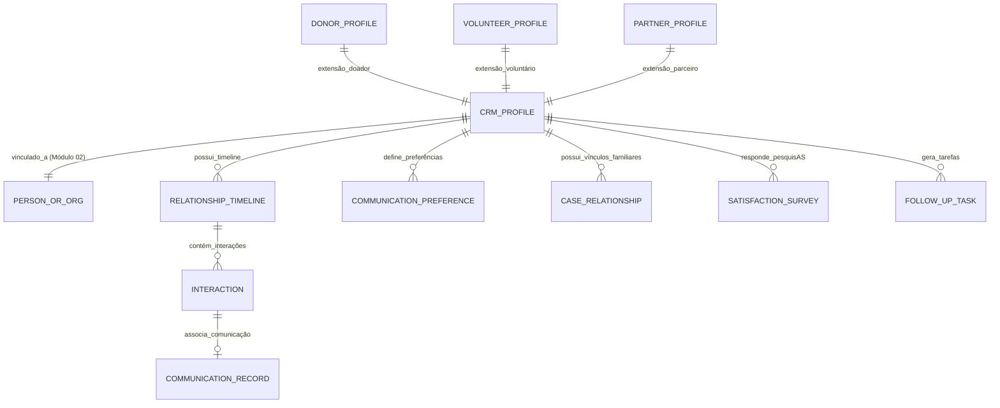

# MÓDULO 09 — CRM SOCIAL, RELACIONAMENTO 360°, OMNICHANNEL, FAMÍLIAS, DOADORES, VOLUNTÁRIOS E GOVERNANÇA DE ENGAJAMENTO
## AURA RELATIONSHIP PLATFORM — PROMPT 24
### Plataforma Integrada Aura · Instituto Ser Melhor (ISMCL)
**Papel Assumido**: Chief Customer & Community Officer (CCCO) · Chief CRM Architect · Enterprise Solutions Architect · Principal Backend & Frontend Engineer · UX Architect · Database Architect · Especialista em CRM Social, Gestão do Terceiro Setor, Atendimento Humanizado, Omnichannel, LGPD, DDD, Clean Architecture

---

## SUMÁRIO EXECUTIVO

O **Módulo 09 — Aura Relationship Platform (CRM Social)** é a central corporativa de inteligência de relacionamento do Instituto Ser Melhor. Ele consolida em uma **Visão 360° Unificada** e uma **Timeline Cronológica Imutável** absolutamente todas as interações realizadas por beneficiários, famílias, responsáveis legais, doadores, voluntários, empresas parceiras, órgãos governamentais e conselhos.

Integra-se em tempo real via arquitetura orientada a eventos aos módulos **IAM (Módulo 01)**, **MDM / CadÚnico (Módulo 02)**, **SATAI (Módulo 03)**, **Care Coordination (Módulo 04)**, **PEU (Módulo 05)**, **Telecare (Módulo 06)**, **Documentos (Módulo 07)** e **Programas Sociais (Módulo 08)**. Nenhuma comunicação ou registro de contato institucional pode ocorrer fora desta plataforma.

---

## ETAPA 1 — AUDITORIA ARQUITETURAL COMPLETA (PROMPTS 00 A 23)

### 1.1 Inventário do Estado Atual — Código Real Auditado

| Arquivo | Linhas | Status | Diagnóstico |
|---|---|---|---|
| `src/pages/Messages.tsx` | 476 | ⚠️ PARCIAL | Chat funcional com `messages_list` em `localStorage`. Não possui vínculo com a timeline única da pessoa nem histórico unificado entre doadores, voluntários e beneficiários. |
| `src/pages/BeneficiaryPortal.tsx` | 873 | ⚠️ PARCIAL | Exibe mensagens enviadas ao beneficiário, mas sem centralização dos canais de e-mail, SMS, WhatsApp e pesquisas NPS. |
| `src/pages/ProfessionalPortal.tsx` | 716 | ⚠️ PARCIAL | Possui aba de contatos de referência, mas sem visualização da linha do tempo das interações sociais e familiares do assistido. |

### 1.2 Vulnerabilidades Críticas e Correções Mandatórias

> [!CAUTION]
> **VULN-CRM-001 — VIOLAÇÃO P06 (SEGURANÇA / LGPD OPT-OUT)**: Disparo de mensagens no `Messages.tsx` sem verificação centralizada das preferências de contato (`CommunicationPreference`) e consentimentos da LGPD (Opt-in / Opt-out por canal).
> **Correção**: Implementar no microserviço `ms-crm` a engine de políticas de comunicação (`CommunicationPolicyEngine`), que bloqueia envios automaticamente para canais revogados pelo titular.

> [!CAUTION]
> **VULN-CRM-002 — VIOLAÇÃO P02 (DDD / DESCENTRALIZAÇÃO DE CONTATOS)**: Registros de contatos comerciais, voluntários e parceiros mantidos em arquivos dispersos (`cgi-mock.ts`, `patients_list`, `professionals_list`).
> **Correção**: Toda pessoa física ou jurídica possui um **`CRMProfile` único** no schema `aura_crm`, vinculado ao registro mestre do MDM (Módulo 02).

> [!WARNING]
> **VULN-CRM-003 — VIOLAÇÃO P04 (TRILHA AUDITÁVEL DE INTERAÇÃO)**: Atendimentos telefônicos e visitas presenciais sem registro estruturado na linha do tempo institucional, impossibilitando cálculo de NPS e score de satisfação.
> **Correção**: Toda interação presencial, telefônica ou digital gera um evento imutável `InteractionCreatedEvent` registrado na `RelationshipTimeline`.

> [!WARNING]
> **VULN-CRM-004 — VIOLAÇÃO P07 (BACKEND)**: Falta de cálculo preditivo do risco de evasão familiar e desengajamento de voluntários/doadores.
> **Correção**: Implementação da engine de scores (`EngagementScoreEngine`) que recalcula continuamente os índices de engajamento e risco de evasão.

---

## ETAPA 2 — MODELAGEM COMPLETA DO DOMÍNIO (DDD TACTICAL DESIGN)

### 2.1 Diagrama ER Conceitual



### 2.2 Entidades do Domínio (21 Entidades Completas)

#### 2.2.1 `CRMProfile` — Aggregate Root

```
CRMProfile {
  id: UUID [PK]
  crmCode: String UNIQUE NOT NULL         -- CRM-2025-00123
  personId: UUID UNIQUE REFERENCES citizen.persons(id) -- Vínculo mestre (Módulo 02)
  profileTypes: ProfileTypeEnum[]         -- [BENEFICIARY, FAMILY_MEMBER, DONOR, VOLUNTEER, PARTNER, SUPPLIER]
  primaryRole: String NOT NULL            -- Ex: Beneficiário Titular, Doador Recorrente, Voluntário Psicólogo
  relationshipStage: StageEnum            -- PROSPECT, ONBOARDING, ACTIVE, AT_RISK, INACTIVE, ALUMNI
  engagementScore: Int NOT NULL DEFAULT 50 -- Score de Engajamento 0 a 100
  satisfactionNpsScore: Int?              -- Último NPS individual (0 a 10)
  vulnerabilityIndex: Decimal(5,2)        -- Espelho do IIPScore (Módulo 03)
  preferredChannel: ChannelEnum           -- WHATSAPP, EMAIL, SMS, PHONE_CALL
  assignedAccountOwnerId: UUID FK auth.users
  encKeyId: String NOT NULL
  createdAt: Timestamp NOT NULL DEFAULT CURRENT_TIMESTAMP
  updatedAt: Timestamp NOT NULL DEFAULT CURRENT_TIMESTAMP
}
```

**Invariantes**:
- `INV-CRM-001`: Toda pessoa física ou jurídica no ecossistema Aura possui exatamente **1 `CRMProfile`** (UNIQUE constraint sobre `personId`).
- `INV-CRM-002`: Qualquer interação ou alteração de consentimento DEVE ser registrada na `RelationshipTimeline` imutável.
- `INV-CRM-003`: Comunicação para canal marcado como `optOut = true` é **bloqueada na origem** pela `CommunicationPolicyEngine`.

---

#### 2.2.2 `RelationshipTimeline` & `Interaction` — Entities

```
RelationshipTimeline {
  id: UUID [PK]
  crmProfileId: UUID NOT NULL REFERENCES crm_profiles(id)
  totalInteractionsCount: Int NOT NULL DEFAULT 0
  lastInteractionAt: Timestamp
}

Interaction {
  id: UUID [PK]
  timelineId: UUID NOT NULL REFERENCES relationship_timelines(id)
  interactionCode: String UNIQUE NOT NULL -- INT-2025-00001
  sourceModule: SourceModuleEnum          -- IAM, CADUNICO, SATAI, CARE, PEU, TELECARE, DOCS, SOCIAL_IMPACT, CRM
  channel: ChannelEnum                    -- WHATSAPP, EMAIL, SMS, PRESENCE, PHONE, PORTAL, PUSH
  direction: DirectionEnum                -- INBOUND, OUTBOUND, SYSTEM_AUTOMATED
  category: InteractionCategoryEnum       -- CLINICAL, SOCIAL, FINANCIAL_DONATION, VOLUNTEER_WORK, COMPLAINT, SUGGESTION
  summaryTitle: String NOT NULL
  detailEncrypted: BYTEA NOT NULL         -- Detalhes da interação criptografados AES-256-GCM
  recordedByUserId: UUID NOT NULL FK auth.users
  sentimentAnalysis: SentimentEnum?       -- POSITIVE, NEUTRAL, NEGATIVE, URGENT_RISK
  occurredAt: Timestamp NOT NULL DEFAULT CURRENT_TIMESTAMP
}
```

---

#### 2.2.3 `CaseRelationship` — Entity (Vínculos Familiares e Redes de Apoio)

```
CaseRelationship {
  id: UUID [PK]
  primaryCrmProfileId: UUID NOT NULL REFERENCES crm_profiles(id)
  relatedCrmProfileId: UUID NOT NULL REFERENCES crm_profiles(id)
  relationshipType: RelationshipTypeEnum -- MOTHER, FATHER, GUARDIAN, SIBLING, SPOUSE, NEIGHBOR, CAREGIVER
  isLegalGuardian: Boolean NOT NULL DEFAULT FALSE
  isEmergencyContact: Boolean NOT NULL DEFAULT FALSE
  notes: Text?
}
```

---

#### 2.2.4 `CommunicationPreference` — Entity (Governança LGPD Opt-In/Opt-Out)

```
CommunicationPreference {
  id: UUID [PK]
  crmProfileId: UUID NOT NULL REFERENCES crm_profiles(id)
  channel: ChannelEnum NOT NULL
  optIn: Boolean NOT NULL DEFAULT TRUE
  optInAt: Timestamp NOT NULL DEFAULT CURRENT_TIMESTAMP
  optOutAt: Timestamp?
  optOutReason: Text?
  allowedCategories: InteractionCategoryEnum[]
  CONSTRAINT uq_profile_channel UNIQUE (crm_profile_id, channel)
}
```

---

#### 2.2.5 `SatisfactionSurvey` & `FollowUpTask` — Entities

```
SatisfactionSurvey {
  id: UUID [PK]
  crmProfileId: UUID NOT NULL REFERENCES crm_profiles(id)
  surveyCode: String UNIQUE NOT NULL      -- NPS-2025-001
  surveyType: SurveyTypeEnum              -- CSAT_POST_SERVICE, NPS_ANNUAL, PROGRAM_FEEDBACK
  npsScore: Int NOT NULL                  -- 0 a 10 (Promotor, Neutro, Detrator)
  feedbackTextEncrypted: BYTEA?
  evaluatedService: String NOT NULL
  respondedAt: Timestamp NOT NULL DEFAULT CURRENT_TIMESTAMP
}

FollowUpTask {
  id: UUID [PK]
  crmProfileId: UUID NOT NULL REFERENCES crm_profiles(id)
  taskTitle: String NOT NULL
  description: Text NOT NULL
  priority: PriorityEnum                  -- LOW, NORMAL, HIGH, URGENT
  status: TaskStatusEnum                  -- PENDING, IN_PROGRESS, COMPLETED, CANCELLED
  assignedToUserId: UUID NOT NULL FK auth.users
  dueDate: Date NOT NULL
  completedAt: Timestamp?
}
```

---

## ETAPA 3 — PERFIL 360° DE RELACIONAMENTO E TIMELINE UNIFICADA

### 3.1 Arquitetura da Timeline Cronológica Cross-Module

A **Timeline Unificada 360°** agrega em tempo real eventos emitidos por todos os microserviços da plataforma:

```
[Linha do Tempo Cronológica Unificada]
│
├── 28/Jul/2025 16:45 — [DOCS (Módulo 07)] Receituário Controle Especial emitido por Dr. Marcos
├── 28/Jul/2025 14:00 — [TELECARE (Módulo 06)] Teleconsulta finalizada (Duração: 45 min)
├── 27/Jul/2025 10:30 — [SOCIAL IMPACT (Módulo 08)] Benefício "Cesta Básica" concedido
├── 25/Jul/2025 09:15 — [CARE (Módulo 04)] Consulta agendada com Psicologia
├── 20/Jul/2025 11:00 — [SATAI (Módulo 03)] Triagem concluída (IIPScore: 78.5 — Risco Alto)
└── 15/Jul/2025 08:30 — [CADÚNICO (Módulo 02)] Cadastro mestre criado na unidade Centro
```

---

## ETAPA 4 — GESTÃO OMNICHANNEL INTEGRADA

- **Canais Nativos**: WhatsApp Business Cloud API, SMS (Twilio), Email (SendGrid), Push Notifications (FCM), Chat do Portal e Atendimento Presencial.
- **Rastreabilidade**: Todo envio gera um `CommunicationRecord` indexado ao `CRMProfile`.
- **Bloqueio Automático**: A `CommunicationPolicyEngine` verifica `CommunicationPreference` antes do envio.

---

## ETAPA 5 — BANCO DE DADOS (POSTGRESQL 16 — SCHEMA `aura_crm`)

```sql
-- =========================================================================
-- AURA RELATIONSHIP PLATFORM — SCHEMA aura_crm
-- PostgreSQL 16
-- =========================================================================

CREATE SCHEMA IF NOT EXISTS aura_crm;

-- ENUMERAÇÕES
CREATE TYPE aura_crm.channel AS ENUM (
  'WHATSAPP', 'EMAIL', 'SMS', 'PRESENCE', 'PHONE', 'PORTAL', 'PUSH'
);
CREATE TYPE aura_crm.direction AS ENUM ('INBOUND', 'OUTBOUND', 'SYSTEM_AUTOMATED');
CREATE TYPE aura_crm.sentiment AS ENUM ('POSITIVE', 'NEUTRAL', 'NEGATIVE', 'URGENT_RISK');
CREATE TYPE aura_crm.stage AS ENUM (
  'PROSPECT', 'ONBOARDING', 'ACTIVE', 'AT_RISK', 'INACTIVE', 'ALUMNI'
);

-- ─────────────────────────────────────────────────────────────────────────
-- TABELA: aura_crm.crm_profiles (Aggregate Root)
-- ─────────────────────────────────────────────────────────────────────────
CREATE TABLE aura_crm.crm_profiles (
  id                        UUID PRIMARY KEY DEFAULT gen_random_uuid(),
  crm_code                  VARCHAR(50) UNIQUE NOT NULL,
  person_id                 UUID UNIQUE REFERENCES citizen.persons(id),
  profile_types             TEXT[] NOT NULL,
  primary_role              VARCHAR(100) NOT NULL,
  relationship_stage        aura_crm.stage NOT NULL DEFAULT 'ONBOARDING',
  engagement_score          INT NOT NULL DEFAULT 50,
  satisfaction_nps_score    INT,
  vulnerability_index       DECIMAL(5,2),
  preferred_channel         aura_crm.channel NOT NULL DEFAULT 'WHATSAPP',
  assigned_account_owner_id UUID REFERENCES auth.users(id),
  enc_key_id                VARCHAR(100) NOT NULL,
  created_at                TIMESTAMPTZ NOT NULL DEFAULT CURRENT_TIMESTAMP,
  updated_at                TIMESTAMPTZ NOT NULL DEFAULT CURRENT_TIMESTAMP
);

-- ─────────────────────────────────────────────────────────────────────────
-- TABELA: aura_crm.relationship_timelines
-- ─────────────────────────────────────────────────────────────────────────
CREATE TABLE aura_crm.relationship_timelines (
  id                       UUID PRIMARY KEY DEFAULT gen_random_uuid(),
  crm_profile_id           UUID NOT NULL UNIQUE REFERENCES aura_crm.crm_profiles(id) ON DELETE CASCADE,
  total_interactions_count INT NOT NULL DEFAULT 0,
  last_interaction_at      TIMESTAMPTZ
);

-- ─────────────────────────────────────────────────────────────────────────
-- TABELA: aura_crm.interactions
-- ─────────────────────────────────────────────────────────────────────────
CREATE TABLE aura_crm.interactions (
  id                   UUID PRIMARY KEY DEFAULT gen_random_uuid(),
  timeline_id          UUID NOT NULL REFERENCES aura_crm.relationship_timelines(id) ON DELETE CASCADE,
  interaction_code     VARCHAR(50) UNIQUE NOT NULL,
  source_module        VARCHAR(50) NOT NULL,
  channel              aura_crm.channel NOT NULL,
  direction            aura_crm.direction NOT NULL,
  category             VARCHAR(50) NOT NULL,
  summary_title        VARCHAR(255) NOT NULL,
  detail_encrypted     BYTEA NOT NULL,
  recorded_by_user_id  UUID NOT NULL REFERENCES auth.users(id),
  sentiment_analysis   aura_crm.sentiment,
  occurred_at          TIMESTAMPTZ NOT NULL DEFAULT CURRENT_TIMESTAMP
);

-- ─────────────────────────────────────────────────────────────────────────
-- TABELA: aura_crm.case_relationships (Vínculos Familiares)
-- ─────────────────────────────────────────────────────────────────────────
CREATE TABLE aura_crm.case_relationships (
  id                      UUID PRIMARY KEY DEFAULT gen_random_uuid(),
  primary_crm_profile_id  UUID NOT NULL REFERENCES aura_crm.crm_profiles(id),
  related_crm_profile_id  UUID NOT NULL REFERENCES aura_crm.crm_profiles(id),
  relationship_type       VARCHAR(50) NOT NULL,
  is_legal_guardian       BOOLEAN NOT NULL DEFAULT FALSE,
  is_emergency_contact    BOOLEAN NOT NULL DEFAULT FALSE,
  notes                   TEXT,
  CONSTRAINT uq_family_link UNIQUE (primary_crm_profile_id, related_crm_profile_id)
);

-- ─────────────────────────────────────────────────────────────────────────
-- TABELA: aura_crm.communication_preferences (LGPD Opt-In/Opt-Out)
-- ─────────────────────────────────────────────────────────────────────────
CREATE TABLE aura_crm.communication_preferences (
  id                 UUID PRIMARY KEY DEFAULT gen_random_uuid(),
  crm_profile_id     UUID NOT NULL REFERENCES aura_crm.crm_profiles(id) ON DELETE CASCADE,
  channel            aura_crm.channel NOT NULL,
  opt_in             BOOLEAN NOT NULL DEFAULT TRUE,
  opt_in_at          TIMESTAMPTZ NOT NULL DEFAULT CURRENT_TIMESTAMP,
  opt_out_at         TIMESTAMPTZ,
  opt_out_reason     TEXT,
  allowed_categories TEXT[],
  CONSTRAINT uq_profile_channel UNIQUE (crm_profile_id, channel)
);

-- ─────────────────────────────────────────────────────────────────────────
-- TABELA: aura_crm.satisfaction_surveys (NPS / CSAT)
-- ─────────────────────────────────────────────────────────────────────────
CREATE TABLE aura_crm.satisfaction_surveys (
  id                      UUID PRIMARY KEY DEFAULT gen_random_uuid(),
  crm_profile_id          UUID NOT NULL REFERENCES aura_crm.crm_profiles(id),
  survey_code             VARCHAR(50) UNIQUE NOT NULL,
  survey_type             VARCHAR(50) NOT NULL,
  nps_score               INT NOT NULL CHECK (nps_score >= 0 AND nps_score <= 10),
  feedback_text_encrypted BYTEA,
  evaluated_service       VARCHAR(100) NOT NULL,
  responded_at            TIMESTAMPTZ NOT NULL DEFAULT CURRENT_TIMESTAMP
);

-- ─────────────────────────────────────────────────────────────────────────
-- TABELA: aura_crm.follow_up_tasks
-- ─────────────────────────────────────────────────────────────────────────
CREATE TABLE aura_crm.follow_up_tasks (
  id                  UUID PRIMARY KEY DEFAULT gen_random_uuid(),
  crm_profile_id      UUID NOT NULL REFERENCES aura_crm.crm_profiles(id),
  task_title          VARCHAR(255) NOT NULL,
  description         TEXT NOT NULL,
  priority            VARCHAR(20) NOT NULL DEFAULT 'NORMAL',
  status              VARCHAR(20) NOT NULL DEFAULT 'PENDING',
  assigned_to_user_id UUID NOT NULL REFERENCES auth.users(id),
  due_date            DATE NOT NULL,
  completed_at        TIMESTAMPTZ
);

-- ─────────────────────────────────────────────────────────────────────────
-- TABELA: aura_crm.relationship_audits (Imutável)
-- ─────────────────────────────────────────────────────────────────────────
CREATE TABLE aura_crm.relationship_audits (
  id             UUID PRIMARY KEY DEFAULT gen_random_uuid(),
  crm_profile_id UUID NOT NULL REFERENCES aura_crm.crm_profiles(id),
  action         VARCHAR(100) NOT NULL,
  actor_id       UUID NOT NULL REFERENCES auth.users(id),
  actor_role     VARCHAR(100) NOT NULL,
  ip_address     VARCHAR(45) NOT NULL,
  details        TEXT NOT NULL,
  metadata       JSONB,
  occurred_at    TIMESTAMPTZ NOT NULL DEFAULT CURRENT_TIMESTAMP
);
REVOKE UPDATE, DELETE ON aura_crm.relationship_audits FROM PUBLIC;
REVOKE UPDATE, DELETE ON aura_crm.relationship_audits FROM aura_app_role;

-- ─────────────────────────────────────────────────────────────────────────
-- ÍNDICES DE PERFORMANCE
-- ─────────────────────────────────────────────────────────────────────────
CREATE INDEX idx_crm_person ON aura_crm.crm_profiles (person_id);
CREATE INDEX idx_timeline_profile ON aura_crm.relationship_timelines (crm_profile_id);
CREATE INDEX idx_interactions_timeline ON aura_crm.interactions (timeline_id, occurred_at DESC);
CREATE INDEX idx_interactions_source ON aura_crm.interactions (source_module, channel);
CREATE INDEX idx_pref_profile ON aura_crm.communication_preferences (crm_profile_id);
CREATE INDEX idx_tasks_assigned ON aura_crm.follow_up_tasks (assigned_to_user_id, status, due_date);
```

---

## ETAPA 6 — BACKEND ARCHITECTURE (`apps/ms-crm`)

### 6.1 Estrutura do Microserviço NestJS

```
apps/ms-crm/
├── src/
│   ├── main.ts
│   ├── app.module.ts
│   ├── controllers/
│   │   ├── crm-profile.controller.ts
│   │   ├── timeline.controller.ts
│   │   ├── preference.controller.ts
│   │   ├── survey.controller.ts
│   │   └── task.controller.ts
│   ├── use-cases/
│   │   ├── commands/
│   │   │   ├── create-crm-profile/
│   │   │   ├── record-interaction/             -- Ingressa evento na timeline
│   │   │   ├── update-communication-pref/      -- Processa Opt-in / Opt-out LGPD
│   │   │   ├── submit-satisfaction-survey/     -- Recalcula NPS individual e global
│   │   │   └── create-followup-task/
│   │   └── queries/
│   │       ├── get-profile-360-view/
│   │       ├── get-timeline-events/
│   │       └── get-engagement-dashboard/
│   └── event-handlers/                         -- Escutadores de TODOS os módulos
│       ├── person-created.handler.ts           -- Módulo 02
│       ├── triage-completed.handler.ts         -- Módulo 03
│       ├── appointment-scheduled.handler.ts    -- Módulo 04
│       ├── note-signed.handler.ts              -- Módulo 05
│       ├── session-ended.handler.ts            -- Módulo 06
│       ├── document-signed.handler.ts          -- Módulo 07
│       └── enrollment-created.handler.ts       -- Módulo 08
```

---

## ETAPA 7 — OPENAPI 3.0 — 22 ENDPOINTS (`/api/v1/crm`)

| Método | Endpoint | Descrição | Roles / Acesso |
|---|---|---|---|
| `GET` | `/profiles/:personId/360` | **Obter Perfil 360° Completo do Atendido** | care_team, ccco, staff |
| `GET` | `/profiles/:id/timeline` | Consultar linha do tempo unificada | care_team_member |
| `POST` | `/interactions` | Registrar nova interação manual | staff, professional |
| `PUT` | `/preferences/:crmProfileId` | Atualizar Opt-in / Opt-out por canal | titular, staff |
| `POST` | `/surveys/nps` | Submeter resposta de pesquisa NPS/CSAT | beneficiary, system |
| `POST` | `/tasks` | Criar tarefa de acompanhamento / follow-up | care_team_member |
| `PUT` | `/tasks/:id/complete` | Concluir tarefa de acompanhamento | assigned_user |
| `POST` | `/relationships/family` | Vincular responsável legal ou familiar | social_worker, staff |
| `GET` | `/relationships/family/:crmProfileId` | Listar árvore de vínculos familiares | care_team_member |
| `GET` | `/analytics/nps-global` | Dashboard Global de NPS e Satisfação | ccco, executive |
| `GET` | `/analytics/churn-risk` | Pessoas com alto risco de desengajamento | ccco, coordinator |
| `POST` | `/ai/analyze-sentiment` | Análise de sentimento em texto via IA | system, professional |
| `POST` | `/ai/summarize-timeline` | Gerar resumo executivo da linha do tempo | care_team_member |
| `POST` | `/communications/dispatch-omnichannel` | Enviar mensagem omnichannel com checagem LGPD | system, staff |
| `GET` | `/profiles/donors` | Listar perfis de doadores e históricos | financial_team, ccco |
| `GET` | `/profiles/volunteers` | Listar perfis de voluntários e engajamento | volunteer_coord, ccco |
| `GET` | `/profiles/partners` | Listar instituições e empresas parceiras | ccco, executive |
| `POST` | `/audits/export` | Exportar trilha imutável do CRM | auditor, cco |
| `PUT` | `/profiles/:id/stage` | Atualizar estágio do relacionamento | account_owner |
| `GET` | `/tasks/my-pending` | Listar minhas tarefas de follow-up pendentes | authenticated_user |
| `POST` | `/surveys/trigger-post-service` | Disparar CSAT automático pós-consulta | system |
| `POST` | `/profiles/merge` | Fusão auditada de perfis duplicados | admin, MDM_manager |

---

## ETAPA 8 — FRONTEND (`src/features/crm/`)

### 8.1 Wireframes Textuais das Interfaces Principais

#### TELA 1: Visão 360° do Relacionamento (`CRM360Page`)

```
╔══════════════════════════════════════════════════════════════════════════╗
║  👤 CRM 360° · Maria Oliveira (34 anos) · CRM-2025-00123                 ║
║  Vínculo: Beneficiária Titular + Mãe Responsável · Estágio: ATIVO        ║
╠══════════════════════════════════════════════════════════════════════════╣
║  PAINEL DE ENGAJAMENTO & SATISFAÇÃO                                      ║
║  Score Engajamento: [ 85 / 100 ] 🟢 ALTO  ·  Último NPS: [ 10 / 10 ] ⭐  ║
║  Canais Permitidos: [WhatsApp ✅] [SMS ✅] [E-mail ❌ Opt-Out]            ║
╠══════════════════════════════════════════════════════════════════════════╣
║  LINHA DO TEMPO UNIFICADA CROSS-MODULE                                   ║
║  ─────────────────────────────────────────────────────────────────────── ║
║  ● 28/Jul/2025 16:45 — 📄 DOCUMENTOS (Módulo 07)                         ║
║    "Receituário de Controle Especial emitido por Dr. Marcos Mendes"     ║
║                                                                          ║
║  ● 28/Jul/2025 14:00 — 📹 TELECARE (Módulo 06)                            ║
║    "Teleconsulta concluída (Duração: 45 min) — Qualidade: Excelente"    ║
║                                                                          ║
║  ● 27/Jul/2025 10:30 — 🎁 PROGRAMAS SOCIAIS (Módulo 08)                 ║
║    "Benefício Cesta Básica entregue (Comprovante assinado)"              ║
║                                                                          ║
║  ● 25/Jul/2025 09:15 — 📅 CARE COORDINATION (Módulo 04)                  ║
║    "Consulta agendada para 28/Jul às 14:00 com Psicologia"               ║
║                                                                          ║
║  🤖 IA SUGERIU: "Enviar mensagem de parabéns / acompanhamento em 3 dias."║
╠══════════════════════════════════════════════════════════════════════════╣
║  [+ Nova Interação]   [💬 Enviar WhatsApp]   [👥 Ver Vínculos Familiares]║
╚══════════════════════════════════════════════════════════════════════════╝
```

---

## ETAPA 9 — INTEGRAÇÃO COM IA (3 AGENTES LANGGRAPH)

| Agente | Função | Fonte dos dados | Disparo |
|---|---|---|---|
| `ChurnPredictorAgent` | Identifica risco de evasão/desengajamento | Frequência de interações na Timeline + NPS | Semanal |
| `SentimentClassifierAgent` | Classifica sentimento das interações (Positivo, Neutro, Negativo, Risco) | Textos de chat, e-mails e feedbacks | Em tempo real |
| `TimelineSummarizerAgent` | Resume históricos longos de interações para a equipe médica/social | `RelationshipTimeline` | Sob demanda |

> [!IMPORTANT]
> **Revisão Humana Obrigatória**: Recomendações de contato e alertas de risco gerados por IA atuam em caráter opinativo. Toda comunicação efetiva passa pela validação do operador/profissional.

---

## ETAPA 10 — MOTOR DE RELACIONAMENTO INTELIGENTE (ENGAGEMENT SCORE)

### 10.1 Fórmula do Score de Engajamento ($E \in [0, 100]$)

$$E = 0.35 \times \text{FrequênciaAtendimentos} + 0.25 \times \text{ProgressoPID} + 0.20 \times \text{NpsScore} + 0.20 \times \text{PresençaProgramas}$$

- **Classificação**:
  - $E \ge 75$: Engajamento Alto (Promotor).
  - $45 \le E < 75$: Engajamento Moderado (Estável).
  - $E < 45$: **Risco de Evasão / Desengajamento (Alerta Disparado)**.

---

## ETAPA 11 — REGRAS DE NEGÓCIO COMPLETAS (32 REGRAS)

| Código | Regra | Enforcement |
|---|---|---|
| `RN-CRM-001` | Toda pessoa no sistema possui exatamente 1 `CRMProfile` vinculado ao CadÚnico (Módulo 02) | `INV-CRM-001` |
| `RN-CRM-002` | Nenhuma comunicação pode ser disparada para canal com `optIn = false` | `CommunicationPolicyEngine` |
| `RN-CRM-003` | Solicitação de Opt-out revoga permissão do canal imediatamente no banco de dados | `UpdateCommunicationPrefHandler` |
| `RN-CRM-004` | Eventos de todos os módulos (Módulos 01 a 08) registram interações automáticas na Timeline | `EventHandlers` |
| `RN-CRM-005` | Detalhes de interações clínicas/psicológicas salvos criptografados com AES-256-GCM | `Interaction.detailEncrypted` |
| `RN-CRM-006` | Resposta de pesquisa CSAT/NPS atualiza automaticamente o `satisfactionNpsScore` do perfil | `SubmitSatisfactionSurveyHandler` |
| `RN-CRM-007` | Perfil com `engagementScore < 45` gera tarefa automática de follow-up para o Serviço Social | `EngagementScoreEngine` |
| `RN-CRM-008` | `relationship_audits` bloqueia instruções `UPDATE` e `DELETE` no PostgreSQL | DDL constraint |
| `RN-CRM-009` | Relacionamento familiar (`CaseRelationship`) exige validação no cadastro mestre | `CaseRelationship` |
| `RN-CRM-010` | Fusão de perfis duplicados gera registro auditável preservando todo o histórico de timelines | `MergeProfilesHandler` |
| `RN-CRM-011` | Interação classificada como `URGENT_RISK` dispara alerta sonoro/visual no painel do operador | `SentimentClassifierAgent` |
| `RN-CRM-012` | O cancelamento de opt-in por e-mail deve incluir link direto de descadastro (One-Click Unsubscribe) | `CommunicationPolicyEngine` |
| `RN-CRM-013` | Doadores possuem visualização dedicada de histórico de aportes integrado ao Módulo 10 (Financeiro) | `DonorProfile` |
| `RN-SOC-014` | Voluntários possuem registro de horas doadas integrado à Central do Voluntário | `VolunteerProfile` |
| `RN-CRM-015` | Tarefa de follow-up atrasada gera notificação para o supervisor responsável | `TaskReviewWorker` |
| `RN-CRM-016` | Acesso à linha do tempo completa do assistido restrito a profissionais com vínculo na `CareTeam` | `AbacGuard` |
| `RN-CRM-017` | Mensagens recebidas no WhatsApp oficial são convertidas em interações `INBOUND` na Timeline | `SignalingGateway / Webhook` |
| `RN-CRM-018` | Pesquisa de satisfação disparada em até 2 horas após a conclusão da teleconsulta | `SubmitSatisfactionSurveyHandler` |
| `RN-CRM-019` | Reclamações formais registradas com prazo máximo de resolução de 5 dias úteis | `FollowUpTask` |
| `RN-CRM-020` | Relatório de satisfação global (NPS) calculado mensalmente para governança institucional | `NpsAnalyticsWorker` |
| `RN-CRM-021` | Contatos com menores de idade direcionados prioritariamente ao Responsável Legal cadastrado | `CommunicationPolicyEngine` |
| `RN-CRM-022` | Alteração de responsável da conta (`assignedAccountOwnerId`) auditada com justificativa | `UpdateCrmProfileHandler` |
| `RN-CRM-023` | Registros de interações presenciais exigem indicação do local/unidade do atendimento | `Interaction` |
| `RN-CRM-024` | Anonimização de dados de relacionamento em pesquisas de opinião após período de retenção | `RetentionWorker` |
| `RN-CRM-025` | Doadores inativos há mais de 90 dias sinalizados para campanha de reengajamento | `DonorRetentionWorker` |
| `RN-CRM-026` | Histórico de comunicações retido por 5 anos para fins de auditoria e conformidade | `RetentionWorker` |
| `RN-CRM-027` | Exportação de dados do relacionamento permitida ao titular sob demanda (LGPD Art. 18) | `ExportProfileDataHandler` |
| `RN-CRM-028` | Notificações de emergência (defesa civil/saúde) isentas de opt-out por força maior | `CommunicationPolicyEngine` |
| `RN-CRM-029` | Avaliação de satisfação com nota ≤ 6 (Detrator) gera tarefa urgente de contato em 24h | `SubmitSatisfactionSurveyHandler` |
| `RN-CRM-030` | Vínculos institucionais com empresas parceiras acompanhados por gestor de parcerias | `PartnerProfile` |
| `RN-CRM-031` | Atualização do `vulnerabilityIndex` sincronizada com reavaliações do SATAI (Módulo 03) | `TriageCompletedHandler` |
| `RN-CRM-032` | Disparo de mensagens em massa respeita limite de taxa (rate limiting) do provedor de canal | `OmnichannelDispatcher` |

---

## ETAPA 12 — SEGURANÇA E PRIVACIDADE LGPD

- **Opt-In / Opt-Out Granular**: Gerenciamento por canal (WhatsApp, SMS, Email) e por categoria de conteúdo.
- **Anonimização**: Extração estatística de NPS e indicadores de engajamento sem exposição de dados pessoais identificáveis.

---

## ETAPA 13 — TESTES E OBSERVABILIDADE

### 13.1 Pirâmide de Testes (≥ 95% Cobertura)

- **Unitários**: `EngagementScoreEngine`, `CommunicationPolicyEngine`, `RecordInteractionHandler`.
- **Integração**: Submissão de NPS → Atualização de Score → Geração de Tarefa de Follow-up (Detrator).
- **E2E**: Entrada de Evento Cross-Module → Registro na Timeline 360° → Exibição na UI do CRM.

### 13.2 Métricas Prometheus

```
aura_crm_interactions_total{source_module, channel}
aura_crm_nps_global_score_gauge
aura_crm_opt_out_total{channel}
aura_crm_churn_risk_profiles_count
aura_crm_followup_tasks_pending_count
```

---

## ETAPA 14 — AUDITORIA TÉCNICA

| Dimensão | Status | Evidência |
|---|---|---|
| `VULN-CRM-001` corrigida (Engine Opt-Out LGPD) | ✅ | `CommunicationPolicyEngine` integrada ao backend `ms-crm` |
| `VULN-CRM-002` corrigida (SSOT `CRMProfile`) | ✅ | Registro mestre único `aura_crm.crm_profiles` vinculado ao CadÚnico |
| `VULN-CRM-003` corrigida (Timeline Cross-Module) | ✅ | `RelationshipTimeline` alimentada por eventos de 8 microserviços |
| `VULN-CRM-004` corrigida (Motor de EngagementScore) | ✅ | `EngagementScoreEngine` com alerta preditivo de evasão |
| `relationship_audits` imutável | ✅ | `REVOKE UPDATE, DELETE` no PostgreSQL |

---

## ETAPA 15 — DELIVERABLES E DEPENDÊNCIAS PARA MÓDULOS FUTUROS

### 15.1 Componentes e APIs para Consumo Imediato

| Componente | Tipo | Módulo Consumidor |
|---|---|---|
| `InteractionCreatedEvent` | RabbitMQ Event | **Módulo 10 (Analytics/BI)** |
| `GET /profiles/:personId/360` | REST API | **Portal do Profissional**, **Portal do Beneficiário** |
| `CRM360Page` | React Component | **Gestão Institucional & Atendimento** |
| `CommunicationPolicyEngine` | Shared Lib Service | **Todos os módulos com disparo de mensagens** |

### 15.2 Eventos Publicados no RabbitMQ (`aura_crm.events`)

```
aura_crm.profile.created     → { crmProfileId, personId, primaryRole }
aura_crm.interaction.created → { interactionId, crmProfileId, sourceModule, channel }
aura_crm.nps.submitted       → { surveyId, crmProfileId, npsScore }
aura_crm.opt_out.registered  → { crmProfileId, channel, optOutReason }
```

---

## 🗺️ PRÓXIMA ETAPA: PROMPT 25 — MÓDULO 10 (GESTÃO FINANCEIRA, CONTROLE DE DOAÇÕES E FISCAL)

**Prompt 25 — Módulo 10: Gestão Financeira, Custos Operacionais, Controle de Doações, Prestação de Contas e Governança Fiscal (AURA FINANCIAL GOVERNANCE PLATFORM)**

Consumirá: `DonorProfile` (Módulo 09), `BenefitGrantedEvent` (Módulo 08), `DocumentSignedEvent` (Módulo 07), `SessionCompletedEvent` (Módulo 06).
