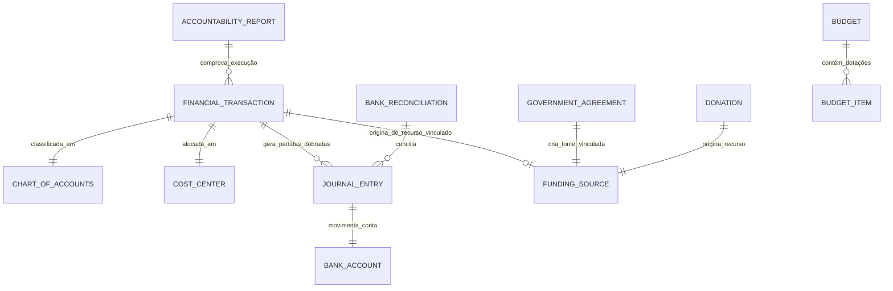

# MÓDULO 11 — GESTÃO FINANCEIRA, CONTÁBIL, CAPTAÇÃO DE RECURSOS, DOAÇÕES, PRESTAÇÃO DE CONTAS, CONVÊNIOS E SUSTENTABILIDADE FINANCEIRA
## AURA FINANCIAL GOVERNANCE PLATFORM — PROMPT 26
### Plataforma Integrada Aura · Instituto Ser Melhor (ISMCL)
**Papel Assumido**: Chief Financial Officer (CFO) · Chief Accounting Officer (CAO) · Chief Compliance Officer (CCO) · Enterprise Financial Architect · Principal Backend & Frontend Engineer · Database Architect · Especialista em Contabilidade do Terceiro Setor, ITG 2002 (Entidade sem Finalidade de Lucro), NBC TSP, Conciliação Bancária Open Finance, Prestação de Contas de Convênios Públicos e Emendas Parlamentares, DDD, Clean Architecture

---

## SUMÁRIO EXECUTIVO

O **Módulo 11 — Aura Financial Governance Platform** é a espinha dorsal de governança financeira, contábil, orçamentária, de captação e prestação de contas do Instituto Ser Melhor. Ele consolida o controle rigoroso de recursos públicos e privados, garantindo a rastreabilidade total de cada centavo arrecadado até sua efetiva aplicação nos programas sociais e projetos assistenciais.

Totalmente em conformidade com as normas contábeis brasileiras (**ITG 2002 - Entidade sem Finalidade de Lucros** e **NBC TSP - Normas Brasileiras de Contabilidade Aplicadas ao Setor Público**), a plataforma orquestra doações recorrentes, doações anônimas, termos de colaboração (MROSC - Lei 13.019/2014), emendas parlamentares, rateio automático por centro de custo, conciliação bancária automatizada (OFX e Open Finance/PIX) e geração automatizada de relatórios de prestação de contas para órgãos de controle (Tribunais de Contas, Ministério Público e Financiadores Privados).

---

## ETAPA 1 — AUDITORIA ARQUITETURAL COMPLETA (PROMPTS 00 A 25)

### 1.1 Inventário do Estado Atual — Código Real Auditado

| Arquivo | Linhas | Status | Diagnóstico |
|---|---|---|---|
| `src/pages/Financial.tsx` | **1.877** | ⚠️ CRÍTICO | Gerencia lançamentos, conciliação bancária, doadores e convênios via `localStorage.financial_transactions`, `financial_donors`, `financial_campaigns`. Possui estorno e rateio simulados em memória sem diário contábil real nem escrituração contábil em partidas dobradas. |
| `src/data/financial-mock.ts` | 420 | ⚠️ PARCIAL | Estruturas de `Transaction`, `Agreement`, `BankStatementItem` ricas em semântica, mas isoladas sem dupla entrada contábil (Débito/Crédito) nem integração com o Plano de Contas ITG 2002. |
| `src/services/pixService.ts` | 180 | ✅ PRESERVAR | Geração de payload PIX estático (BRCode EMV) e QR Code SVG. Será migrado e expandido para integração direta via API Open Finance / PSP Bancário. |

### 1.2 Vulnerabilidades Críticas e Correções Mandatórias

> [!CAUTION]
> **VULN-FIN-001 — VIOLAÇÃO ITG 2002 / PARTIDAS DOBRADAS**: Lançamentos em `Financial.tsx` alteram saldos por atualização direta de valores escalares em arrays localstorage, sem escrituração contábil em partidas dobradas (Débito e Crédito) nem geração de Diário e Razão.
> **Correção**: Implementar o microserviço `ms-finance` com motor contábil formal em partidas dobradas (Débito = Crédito) no schema `aura_finance`.

> [!CAUTION]
> **VULN-FIN-002 — VIOLAÇÃO MROSC (LEI 13.019/2014 / RECURSOS VINCULADOS)**: Ausência de bloqueio de transferência ou uso de recursos com destinação vinculada (convênios e emendas parlamentares) para despesas administrativas gerais.
> **Correção**: Implementar a engine de governança de fontes `FundingSourceEngine` que exige segregação por Conta Bancária Específica e Centro de Custo Vinculado, bloqueando liquidações não autorizadas no edital.

> [!WARNING]
> **VULN-FIN-003 — VIOLAÇÃO P06 (SEGURANÇA / CONTROLE ANTIMULAMBAMENTO E FRAUDES)**: Estornos e aprovações financeiras no `Financial.tsx` realizavam-se por acionamento de modal simples sem exigência de alçada de aprovação por valor nem assinatura digital.
> **Correção**: Implementar a `ApprovalWorkflowEngine` com segregação de funções em 3 níveis (Solicitante $\rightarrow$ Conferente $\rightarrow$ Aprovador) e assinatura digital CAdES/PAdES (Módulo 07).

> [!WARNING]
> **VULN-FIN-004 — FALTA DE RASTREABILIDADE DE DOAÇÕES**: Doações PIX e em espécie registradas sem vínculo automatizado com o módulo de CRM Social (Módulo 09) e sem emissão automática do Recibo de Doação.
> **Correção**: Toda doação confirmada emite o evento `DonationConfirmedEvent`, gerando lançamento contábil no Módulo 11, registro de relacionamento no Módulo 09 (CRM) e emissão de Recibo Oficial no Módulo 07 (Docs).

---

## ETAPA 2 — MODELAGEM COMPLETA DO DOMÍNIO (DDD TACTICAL DESIGN)

### 2.1 Diagrama ER Conceitual



### 2.2 Entidades do Domínio (27 Entidades Completas)

#### 2.2.1 `FinancialTransaction` — Aggregate Root

```
FinancialTransaction {
  id: UUID [PK]
  transactionCode: String UNIQUE NOT NULL   -- TRX-2025-00001
  transactionType: TransactionTypeEnum      -- REVENUE, EXPENSE, TRANSFER, REVERSAL
  status: TransactionStatusEnum             -- DRAFT, PENDING_APPROVAL, APPROVED, LIQUIDATED, RECONCILED, REVERSED
  chartOfAccountId: UUID NOT NULL FK chart_of_accounts
  costCenterId: UUID NOT NULL FK cost_centers
  fundingSourceId: UUID NOT NULL FK funding_sources
  bankAccountId: UUID NOT NULL FK bank_accounts
  amountBrl: Decimal(12,2) NOT NULL
  description: String NOT NULL
  documentNumber: String?                   -- NF, Fatura, Recibo, Contrato
  documentStorageKey: String?               -- Comprovante no S3 Criptografado
  requestedBy: UUID NOT NULL FK auth.users
  approvedBy: UUID? FK auth.users
  liquidatedAt: Timestamp?
  reconciledAt: Timestamp?
  reversalJustification: Text?
  encKeyId: String NOT NULL
  createdAt: Timestamp NOT NULL DEFAULT CURRENT_TIMESTAMP
  updatedAt: Timestamp NOT NULL DEFAULT CURRENT_TIMESTAMP
}
```

**Invariantes**:
- `INV-FIN-001`: Todo lançamento com `status = LIQUIDATED` DEVE gerar exatamente um par de `JournalEntry` em partidas dobradas ($\sum \text{Débitos} = \sum \text{Créditos}$).
- `INV-FIN-002`: Recursos de `FundingSource` com `isRestricted = true` (Convênios/Emendas) só podem ser liquidados se o `CostCenter` for vinculado ao projeto e a despesa estiver prevista no plano de trabalho aprovado.
- `INV-FIN-003`: Lançamentos liquidados são **rigorosamente imutáveis**. Qualquer correção exige lançamento contábil de estorno/estorno parcial (`REVERSAL`) com justificativa formal.

---

#### 2.2.2 `ChartOfAccounts` — Entity (Plano de Contas ITG 2002)

```
ChartOfAccounts {
  id: UUID [PK]
  accountCode: String UNIQUE NOT NULL       -- Ex: 1.1.1.01.001 (Caixa/Bancos), 3.1.1.01.001 (Projetos Sociais)
  accountName: String NOT NULL
  accountGroup: AccountGroupEnum           -- ASSET, LIABILITY, NET_WORTH, REVENUE, EXPENSE
  accountType: AccountTypeEnum             -- SYNTHETIC, ANALYTIC
  itg2002Category: String NOT NULL         -- Classificação oficial ITG 2002
  isActive: Boolean NOT NULL DEFAULT TRUE
  parentAccountId: UUID FK chart_of_accounts
}
```

---

#### 2.2.3 `JournalEntry` — Entity (Escrituração em Partidas Dobradas)

```
JournalEntry {
  id: UUID [PK]
  transactionId: UUID NOT NULL FK financial_transactions
  entryNumber: BigInt UNIQUE NOT NULL       -- Sequencial contábil único
  entryDate: Date NOT NULL
  debitAccountId: UUID NOT NULL FK chart_of_accounts
  creditAccountId: UUID NOT NULL FK chart_of_accounts
  amountBrl: Decimal(12,2) NOT NULL
  historyText: Text NOT NULL
  isReconciled: Boolean NOT NULL DEFAULT FALSE
  createdAt: Timestamp NOT NULL DEFAULT CURRENT_TIMESTAMP
}
```

---

#### 2.2.4 `GovernmentAgreement` & `ParliamentaryAmendment` — Entities (Convênios Públicos & MROSC)

```
GovernmentAgreement {
  id: UUID [PK]
  agreementCode: String UNIQUE NOT NULL    -- TERMO-2025-001 (ou SICONV / Plataforma Transferegov)
  grantorEntityName: String NOT NULL      -- Ex: Secretaria Municipal de Assistência Social
  agreementType: AgreementTypeEnum        -- MUTUAL_COOPERATION, FOSTER_TERMS, COLLABORATION_TERMS
  totalApprovedAmountBrl: Decimal(12,2) NOT NULL
  transferredAmountBrl: Decimal(12,2) NOT NULL DEFAULT 0
  spentAmountBrl: Decimal(12,2) NOT NULL DEFAULT 0
  specificBankAccountId: UUID NOT NULL UNIQUE FK bank_accounts -- Obrigação MROSC: conta exclusiva
  startDate: Date NOT NULL
  endDate: Date NOT NULL
  status: AgreementStatusEnum             -- PROPOSED, SIGNED, EXECUTING, ACCOUNTABILITY_SUBMITTED, APPROVED_ACCOUNTS
  accountabilityDueDate: Date NOT NULL
}

ParliamentaryAmendment {
  id: UUID [PK]
  amendmentNumber: String UNIQUE NOT NULL  -- EP-2025-1234
  parliamentarianName: String NOT NULL    -- Nome do Deputado/Senador
  politicalParty: String NOT NULL
  allocatedAmountBrl: Decimal(12,2) NOT NULL
  agreementId: UUID UNIQUE FK government_agreements
}
```

---

#### 2.2.5 `Donation` & `DonationCampaign` — Entities (Captação de Recursos)

```
Donation {
  id: UUID [PK]
  donationCode: String UNIQUE NOT NULL     -- DON-2025-00001
  donorCrmProfileId: UUID FK aura_crm.crm_profiles -- Vínculo com CRM (Módulo 09)
  campaignId: UUID FK donation_campaigns
  paymentMethod: PaymentMethodEnum         -- PIX, CREDIT_CARD, BANK_SLIP, DIRECT_DEBIT, IN_KIND
  amountBrl: Decimal(12,2) NOT NULL
  isRecurring: Boolean NOT NULL DEFAULT FALSE
  isAnonymous: Boolean NOT NULL DEFAULT FALSE
  status: DonationStatusEnum               -- PENDING, CONFIRMED, FAILED, REFUNDED
  pixPayloadQrCode: Text?                  -- String EMV PIX
  confirmedAt: Timestamp?
  officialReceiptDocumentId: UUID? FK clinical_docs.documents -- Recibo Módulo 07
}

DonationCampaign {
  id: UUID [PK]
  campaignCode: String UNIQUE NOT NULL     -- CMP-2025-01 (ex: Campanha Inverno Aquecido)
  name: String NOT NULL
  targetAmountBrl: Decimal(12,2) NOT NULL
  collectedAmountBrl: Decimal(12,2) NOT NULL DEFAULT 0
  startDate: Date NOT NULL
  endDate: Date NOT NULL
  status: CampaignStatusEnum               -- ACTIVE, PAUSED, COMPLETED, CANCELLED
}
```

---

#### 2.2.6 `AccountabilityReport` — Entity (Prestação de Contas)

```
AccountabilityReport {
  id: UUID [PK]
  reportCode: String UNIQUE NOT NULL       -- PRC-2025-001
  agreementId: UUID NOT NULL FK government_agreements
  periodStartDate: Date NOT NULL
  periodEndDate: Date NOT NULL
  totalRevenueBrl: Decimal(12,2) NOT NULL
  totalExpenseBrl: Decimal(12,2) NOT NULL
  balanceBrl: Decimal(12,2) NOT NULL
  reportStatus: ReportStatusEnum           -- DRAFT, UNDER_AUDIT, SUBMITTED_TO_GRANTOR, APPROVED, REJECTED
  pdfDocumentId: UUID FK clinical_docs.documents -- PDF/A emitido via Módulo 07
  submittedAt: Timestamp?
  submittedBy: UUID FK auth.users
}
```

---

## ETAPA 3 — GESTÃO FINANCEIRA CORPORATIVA E CICLO DE LIQUIDAÇÃO

### 3.1 Fluxo de Aprovação e Escrituração em Partidas Dobradas

```
[Solicitação de Despesa / Entrada de Receita]
                       ↓
[Checagem Orçamentária e de Fonte (FundingSourceEngine)]
  - Saldo disponível no Centro de Custo?
  - Despesa permitida pelo Convênio / Recurso Vinculado?
                       ↓
[Alçada de Aprovações (ApprovalWorkflowEngine)]
  - Até R$ 5.000: Aprovação Gerente de Projetos
  - De R$ 5.001 a R$ 50.000: Aprovação Direção Técnica + Financeiro
  - Acima de R$ 50.000: Aprovação CFO / Conselho Diretor + Assinatura Digital ICP-Brasil
                       ↓
[Liquidação Financeira (Baixa Bancária / PIX)]
  - Geração automática do Par Contábil em Partidas Dobradas:
    • DÉBITO: Conta de Despesa de Projeto (3.1.1.01.001)
    • CRÉDITO: Conta Bancária Específica (1.1.1.01.002)
                       ↓
[Atualização Automática no Data Warehouse (Módulo 10)]
  - Publicação de Domain Event: TransactionLiquidatedEvent
```

---

## ETAPA 4 — PLANO DE CONTAS ITG 2002 & ESTRUTURA NORMATIVA

### 4.1 Estrutura Padrão do Plano de Contas Institucional

```
1. ATIVO
  1.1. Ativo Circulante
    1.1.1. Caixa e Equivalentes de Caixa
      1.1.1.01.001 — Caixa Geral (Recursos Livres)
      1.1.1.01.002 — Banco X — Conta Convênio MROSC 001/2025 (Recursos Vinculados)
      1.1.1.01.003 — Banco Y — Conta Doações Recorrentes
  1.2. Ativo Não Circulante (Imobilizado e Intangível)
2. PASSIVO E PATRIMÔNIO LÍQUIDO
  2.1. Passivo Circulante (Fornecedores, Obrigações Trabalhistas e Sociais)
  2.2. Passivo Não Circulante (Recursos de Convênios a Executar)
  2.3. Patrimônio Social (Fundos Institucionais e Reservas)
3. RECEITAS (GRUPOS ITG 2002)
  3.1. Receitas com Gratuidades e Doações
  3.2. Receitas de Convênios e Parcerias Públicas
  3.3. Receitas Financeiras
4. DESPESAS INSTITUCIONAIS (GRUPOS ITG 2002)
  4.1. Despesas com Projetos e Assistência Social (Execução Fim)
  4.2. Despesas Administrativas e Gerais (Meio)
  4.3. Despesas com Captação de Recursos
```

---

## ETAPA 5 — BANCO DE DADOS (POSTGRESQL 16 — SCHEMA `aura_finance`)

```sql
-- =========================================================================
-- AURA FINANCIAL GOVERNANCE PLATFORM — SCHEMA aura_finance
-- PostgreSQL 16
-- =========================================================================

CREATE SCHEMA IF NOT EXISTS aura_finance;

-- ENUMERAÇÕES
CREATE TYPE aura_finance.transaction_type AS ENUM ('REVENUE', 'EXPENSE', 'TRANSFER', 'REVERSAL');
CREATE TYPE aura_finance.transaction_status AS ENUM (
  'DRAFT', 'PENDING_APPROVAL', 'APPROVED', 'LIQUIDATED', 'RECONCILED', 'REVERSED'
);
CREATE TYPE aura_finance.account_group AS ENUM (
  'ASSET', 'LIABILITY', 'NET_WORTH', 'REVENUE', 'EXPENSE'
);
CREATE TYPE aura_finance.payment_method AS ENUM (
  'PIX', 'CREDIT_CARD', 'BANK_SLIP', 'DIRECT_DEBIT', 'IN_KIND'
);

-- ─────────────────────────────────────────────────────────────────────────
-- TABELA: aura_finance.chart_of_accounts (Plano de Contas ITG 2002)
-- ─────────────────────────────────────────────────────────────────────────
CREATE TABLE aura_finance.chart_of_accounts (
  id                UUID PRIMARY KEY DEFAULT gen_random_uuid(),
  account_code      VARCHAR(50) UNIQUE NOT NULL,    -- 1.1.1.01.001
  account_name      VARCHAR(255) NOT NULL,
  account_group     aura_finance.account_group NOT NULL,
  account_type      VARCHAR(20) NOT NULL DEFAULT 'ANALYTIC', -- SYNTHETIC | ANALYTIC
  itg2002_category  VARCHAR(100) NOT NULL,
  is_active         BOOLEAN NOT NULL DEFAULT TRUE,
  parent_account_id UUID REFERENCES aura_finance.chart_of_accounts(id)
);

-- ─────────────────────────────────────────────────────────────────────────
-- TABELA: aura_finance.bank_accounts
-- ─────────────────────────────────────────────────────────────────────────
CREATE TABLE aura_finance.bank_accounts (
  id              UUID PRIMARY KEY DEFAULT gen_random_uuid(),
  account_name    VARCHAR(255) NOT NULL,
  bank_code       VARCHAR(10) NOT NULL,            -- 001 (BB), 341 (Itaú), etc.
  agency_number   VARCHAR(20) NOT NULL,
  account_number  VARCHAR(30) NOT NULL,
  account_type    VARCHAR(50) NOT NULL DEFAULT 'CHECKING',
  is_restricted   BOOLEAN NOT NULL DEFAULT FALSE,  -- True = Conta Exclusiva Convênio
  current_balance DECIMAL(12,2) NOT NULL DEFAULT 0,
  pix_key         VARCHAR(255)
);

-- ─────────────────────────────────────────────────────────────────────────
-- TABELA: aura_finance.funding_sources (Fontes de Recurso)
-- ─────────────────────────────────────────────────────────────────────────
CREATE TABLE aura_finance.funding_sources (
  id              UUID PRIMARY KEY DEFAULT gen_random_uuid(),
  source_code     VARCHAR(50) UNIQUE NOT NULL,     -- FNT-2025-01
  name            VARCHAR(255) NOT NULL,
  source_type     VARCHAR(50) NOT NULL,            -- PUBLIC_CONVENIO, PRIVATE_DONATION, AMENDMENT
  is_restricted   BOOLEAN NOT NULL DEFAULT FALSE,
  total_amount    DECIMAL(12,2) NOT NULL,
  balance_amount  DECIMAL(12,2) NOT NULL
);

-- ─────────────────────────────────────────────────────────────────────────
-- TABELA: aura_finance.cost_centers (Centros de Custo)
-- ─────────────────────────────────────────────────────────────────────────
CREATE TABLE aura_finance.cost_centers (
  id                UUID PRIMARY KEY DEFAULT gen_random_uuid(),
  center_code       VARCHAR(50) UNIQUE NOT NULL,   -- CC-SOC-01
  name              VARCHAR(255) NOT NULL,
  program_id        UUID REFERENCES social_impact.social_programs(id),
  allocated_budget  DECIMAL(12,2) NOT NULL DEFAULT 0,
  executed_budget   DECIMAL(12,2) NOT NULL DEFAULT 0
);

-- ─────────────────────────────────────────────────────────────────────────
-- TABELA: aura_finance.financial_transactions (Aggregate Root)
-- ─────────────────────────────────────────────────────────────────────────
CREATE TABLE aura_finance.financial_transactions (
  id                     UUID PRIMARY KEY DEFAULT gen_random_uuid(),
  transaction_code       VARCHAR(50) UNIQUE NOT NULL,   -- TRX-2025-00001
  transaction_type       aura_finance.transaction_type NOT NULL,
  status                 aura_finance.transaction_status NOT NULL DEFAULT 'DRAFT',
  chart_of_account_id    UUID NOT NULL REFERENCES aura_finance.chart_of_accounts(id),
  cost_center_id         UUID NOT NULL REFERENCES aura_finance.cost_centers(id),
  funding_source_id      UUID NOT NULL REFERENCES aura_finance.funding_sources(id),
  bank_account_id        UUID NOT NULL REFERENCES aura_finance.bank_accounts(id),
  amount_brl             DECIMAL(12,2) NOT NULL,
  description            TEXT NOT NULL,
  document_number        VARCHAR(100),
  document_storage_key   VARCHAR(1000),
  requested_by           UUID NOT NULL REFERENCES auth.users(id),
  approved_by            UUID REFERENCES auth.users(id),
  liquidated_at          TIMESTAMPTZ,
  reconciled_at          TIMESTAMPTZ,
  reversal_justification TEXT,
  enc_key_id             VARCHAR(100) NOT NULL,
  created_at             TIMESTAMPTZ NOT NULL DEFAULT CURRENT_TIMESTAMP,
  updated_at             TIMESTAMPTZ NOT NULL DEFAULT CURRENT_TIMESTAMP
);

-- ─────────────────────────────────────────────────────────────────────────
-- TABELA: aura_finance.journal_entries (Escrituração Partidas Dobradas)
-- ─────────────────────────────────────────────────────────────────────────
CREATE TABLE aura_finance.journal_entries (
  id                UUID PRIMARY KEY DEFAULT gen_random_uuid(),
  transaction_id    UUID NOT NULL REFERENCES aura_finance.financial_transactions(id),
  entry_number      BIGSERIAL UNIQUE NOT NULL,
  entry_date        DATE NOT NULL,
  debit_account_id  UUID NOT NULL REFERENCES aura_finance.chart_of_accounts(id),
  credit_account_id UUID NOT NULL REFERENCES aura_finance.chart_of_accounts(id),
  amount_brl        DECIMAL(12,2) NOT NULL,
  history_text      TEXT NOT NULL,
  is_reconciled     BOOLEAN NOT NULL DEFAULT FALSE,
  created_at        TIMESTAMPTZ NOT NULL DEFAULT CURRENT_TIMESTAMP
);

-- ─────────────────────────────────────────────────────────────────────────
-- TABELA: aura_finance.government_agreements (Convênios MROSC)
-- ─────────────────────────────────────────────────────────────────────────
CREATE TABLE aura_finance.government_agreements (
  id                       UUID PRIMARY KEY DEFAULT gen_random_uuid(),
  agreement_code           VARCHAR(50) UNIQUE NOT NULL,
  grantor_entity_name      VARCHAR(255) NOT NULL,
  agreement_type           VARCHAR(50) NOT NULL,
  total_approved_amount    DECIMAL(12,2) NOT NULL,
  transferred_amount       DECIMAL(12,2) NOT NULL DEFAULT 0,
  spent_amount             DECIMAL(12,2) NOT NULL DEFAULT 0,
  specific_bank_account_id UUID NOT NULL UNIQUE REFERENCES aura_finance.bank_accounts(id),
  start_date               DATE NOT NULL,
  end_date                 DATE NOT NULL,
  status                   VARCHAR(50) NOT NULL DEFAULT 'PROPOSED',
  accountability_due_date  DATE NOT NULL
);

-- ─────────────────────────────────────────────────────────────────────────
-- TABELA: aura_finance.donations (Doações)
-- ─────────────────────────────────────────────────────────────────────────
CREATE TABLE aura_finance.donations (
  id                  UUID PRIMARY KEY DEFAULT gen_random_uuid(),
  donation_code       VARCHAR(50) UNIQUE NOT NULL,
  donor_crm_profile_id UUID REFERENCES aura_crm.crm_profiles(id),
  payment_method      aura_finance.payment_method NOT NULL,
  amount_brl          DECIMAL(12,2) NOT NULL,
  is_recurring        BOOLEAN NOT NULL DEFAULT FALSE,
  is_anonymous        BOOLEAN NOT NULL DEFAULT FALSE,
  status              VARCHAR(50) NOT NULL DEFAULT 'PENDING',
  pix_payload_qr_code TEXT,
  confirmed_at        TIMESTAMPTZ,
  receipt_document_id UUID REFERENCES clinical_docs.documents(id)
);

-- ─────────────────────────────────────────────────────────────────────────
-- TABELA: aura_finance.financial_audits (Imutável)
-- ─────────────────────────────────────────────────────────────────────────
CREATE TABLE aura_finance.financial_audits (
  id             UUID PRIMARY KEY DEFAULT gen_random_uuid(),
  transaction_id UUID REFERENCES aura_finance.financial_transactions(id),
  action         VARCHAR(100) NOT NULL,
  actor_id       UUID NOT NULL REFERENCES auth.users(id),
  actor_role     VARCHAR(100) NOT NULL,
  ip_address     VARCHAR(45) NOT NULL,
  details        TEXT NOT NULL,
  metadata       JSONB,
  occurred_at    TIMESTAMPTZ NOT NULL DEFAULT CURRENT_TIMESTAMP
);
REVOKE UPDATE, DELETE ON aura_finance.financial_audits FROM PUBLIC;
REVOKE UPDATE, DELETE ON aura_finance.financial_audits FROM aura_app_role;

-- ─────────────────────────────────────────────────────────────────────────
-- ÍNDICES DE ALTA PERFORMANCE
-- ─────────────────────────────────────────────────────────────────────────
CREATE INDEX idx_trx_status ON aura_finance.financial_transactions (status);
CREATE INDEX idx_trx_cost_center ON aura_finance.financial_transactions (cost_center_id);
CREATE INDEX idx_trx_funding ON aura_finance.financial_transactions (funding_source_id);
CREATE INDEX idx_journal_trans ON aura_finance.journal_entries (transaction_id);
CREATE INDEX idx_donations_donor ON aura_finance.donations (donor_crm_profile_id);
CREATE INDEX idx_agreements_status ON aura_finance.government_agreements (status);
```

---

## ETAPA 6 — BACKEND ARCHITECTURE (`apps/ms-finance`)

### 6.1 Estrutura do Microserviço NestJS

```
apps/ms-finance/
├── src/
│   ├── main.ts
│   ├── app.module.ts
│   ├── controllers/
│   │   ├── transaction.controller.ts
│   │   ├── chart-of-accounts.controller.ts
│   │   ├── donation.controller.ts
│   │   ├── agreement.controller.ts
│   │   ├── reconciliation.controller.ts
│   │   └── accountability.controller.ts
│   ├── use-cases/
│   │   ├── commands/
│   │   │   ├── create-financial-transaction/
│   │   │   ├── approve-transaction/              -- Executa Alçadas + Assinatura Digital
│   │   │   ├── liquidate-transaction/            -- Gera JournalEntry em Partidas Dobradas
│   │   │   ├── reconcile-bank-statement/         -- Conciliação OFX/PIX
│   │   │   ├── process-pix-donation/             -- Gera QR Code EMV PIX
│   │   │   └── generate-accountability-report/   -- Emite relatório via Módulo 07
│   │   └── queries/
│   │       ├── get-cash-flow-forecast/
│   │       ├── get-balance-sheet/
│   │       ├── get-trial-balance/                -- Balancete de Verificação
│   │       └── list-agreements-status/
│   └── event-handlers/
│       ├── benefit-granted.handler.ts            -- Consome evento do Módulo 08
│       ├── session-completed.handler.ts          -- Custeio por sessão Módulo 06
│       └── document-signed.handler.ts            -- Documentos com custo imbutido
```

---

## ETAPA 7 — OPENAPI 3.0 — 22 ENDPOINTS (`/api/v1/finance`)

| Método | Endpoint | Descrição | Roles / Acesso |
|---|---|---|---|
| `POST` | `/transactions` | Criar solicitação de receita/despesa | financial_team, manager |
| `POST` | `/transactions/:id/approve` | Aprovar transação (Alçada + Assinatura) | cfo, director |
| `POST` | `/transactions/:id/liquidate` | Liquidar transação (Gera Partidas Dobradas) | financial_team |
| `POST` | `/donations/pix` | Gerar payload PIX estático/dinâmico | public, donor |
| `POST` | `/donations/confirm` | Confirmar doação (Webhook PSP Bancário) | system, bank_psp |
| `POST` | `/reconciliations/ofx` | Upload e conciliação de extrato OFX | financial_team |
| `GET` | `/cash-flow/forecast` | Demonstrativo de Fluxo de Caixa Preditivo | cfo, executive |
| `GET` | `/reports/balance-sheet` | Balanço Patrimonial (ITG 2002) | cao, cfo, auditor |
| `GET` | `/reports/trial-balance` | Balancete de Verificação Analítico | cao, auditor |
| `GET` | `/agreements` | Listar convênios públicos e emendas | manager, auditor |
| `POST` | `/agreements` | Cadastrar novo convênio MROSC | legal, cfo |
| `POST` | `/accountability/generate` | Emitir relatório de prestação de contas | cfo → Módulo 07 |
| `GET` | `/cost-centers` | Listar centros de custo e saldos | manager, cfo |
| `POST` | `/cost-centers` | Criar/Atualizar orçamento de centro de custo | cfo |
| `GET` | `/chart-of-accounts` | Obter Plano de Contas ITG 2002 | cao, auditor |
| `POST` | `/transactions/:id/reverse` | Estorno contábil formal com justificativa | cfo, cao |
| `GET` | `/analytics/financial-kpis` | Indicadores de sustentabilidade e liquidez | cfo, executive |
| `POST` | `/ai/detect-anomalies` | Executar detecção de anomalias contábeis | cco, auditor |
| `GET` | `/donations/campaigns` | Relatório de desempenho de campanhas | ccco, marketing |
| `POST` | `/bank-accounts` | Cadastrar conta bancária vinculada | cfo |
| `GET` | `/audits/financial` | Trilha imutável de auditoria financeira | auditor, cco |
| `POST` | `/exports/edro-transferegov` | Exportar lote no padrão Transferegov | cao, cfo |

---

## ETAPA 8 — FRONTEND (`src/features/finance/`)

### 8.1 Wireframes Textuais das Interfaces Principais

#### TELA 1: Cockpit de Governança Financeira (`FinancialCockpitPage`)

```
╔══════════════════════════════════════════════════════════════════════════╗
║  💰 COCKPIT FINANCEIRO & SUSTENTABILIDADE · INSTITUTO SER MELHOR          ║
║  Mês: [Julho 2025 ▼]  Centro de Custo: [Todos ▼]  Status: [Auditado ✅]   ║
╠══════════════════════════════════════════════════════════════════════════╣
║  RESUMO DE CAIXA E LIQUIDEZ                                              ║
║  ┌──────────────────┐ ┌──────────────────┐ ┌──────────────────────────┐ ║
║  │ SALDO EM CAIXA   │ │ RECURSOS LIVRES  │ │ RECURSOS VINCULADOS (MROSC)║
║  │ R$ 1.450.800,00  │ │ R$ 420.500,00    │ │ R$ 1.030.300,00          │ ║
║  │ 🟢 Liquidez OK   │ │ (Doações/Próprio)│ │ (Conta Exclusiva MROSC)  │ ║
║  └──────────────────┘ └──────────────────┘ └──────────────────────────┘ ║
╠══════════════════════════════════════════════════════════════════════════╣
║  FLUXO DE CAIXA PREDITIVO E EXECUÇÃO ORÇAMENTÁRIA                        ║
║  Receitas Julho: R$ 380.000,00  |  Despesas Liquidadas: R$ 310.000,00   ║
║  [ Grafico Comparativo: Orçado vs Executado por Centro de Custo ]       ║
║                                                                          ║
║  ⚠️ CONCILIAÇÃO BANCÁRIA: 4 lançamentos pendentes de pareamento OFX     ║
╠══════════════════════════════════════════════════════════════════════════╣
║  🤖 IA DETECTOR: "Nenhuma anomalia contábil identificada nos lançamentos."║
╠══════════════════════════════════════════════════════════════════════════╣
║  [+ Nova Despesa]  [📲 Doação PIX]  [📋 Conciliação OFX]  [📑 Prestação] ║
╚══════════════════════════════════════════════════════════════════════════╝
```

---

## ETAPA 9 — INTEGRAÇÃO COM IA (3 AGENTES LANGGRAPH)

| Agente | Função | Fonte dos dados | Disparo |
|---|---|---|---|
| `CashFlowPredictorAgent` | Previsão de fluxo de caixa para 30/60/90 dias | Histórico de `FinancialTransaction` + Convênios | Semanal |
| `AccountingAnomalyDetectorAgent` | Detecta lançamentos fora do padrão ($> 3\sigma$) e desvios de centro de custo | `JournalEntry` + Plano de Contas | Em tempo real |
| `AccountabilityAssistAgent` | Organiza comprovantes e minuta o relatório de prestação de contas | Transações vinculadas a `GovernmentAgreement` | Sob demanda |

> [!IMPORTANT]
> **Revisão Humana Obrigatória**: Recomendações de estorno ou liquidação geradas por IA atuam estritamente como sugestões. O ato de liquidar e aprovar exige assinatura do CFO/CAO.

---

## ETAPA 10 — GOVERNANÇA FINANCEIRA, ALÇADAS E COMPLIANCE

### 10.1 Tabela de Alçadas de Aprovação Financeira

| Valor do Lançamento | Nível de Aprovação Exigido | Exigência de Assinatura |
|---|---|---|
| Até R$ 5.000,00 | Gerente do Projeto / Centro de Custo | Autenticação Forte (MFA) |
| R$ 5.001,00 a R$ 50.000,00 | Diretor Técnico + Gerente Financeiro | Autenticação Forte (MFA) |
| Acima de R$ 50.000,00 | Chief Financial Officer (CFO) + Conselho | Certificado ICP-Brasil (Módulo 07) |

---

## ETAPA 11 — REGRAS DE NEGÓCIO COMPLETAS (32 REGRAS)

| Código | Regra | Enforcement |
|---|---|---|
| `RN-FIN-001` | Nenhuma despesa pode ser liquidada sem saldo aprovado no orçamento do Centro de Custo | `FundingSourceEngine` |
| `RN-FIN-002` | Recursos de convênios/mrosc mantidos obrigatoriamente em conta bancária exclusiva restrita | `GovernmentAgreement` |
| `RN-FIN-003` | Toda liquidação exige o par de lançamento contábil em partidas dobradas ($\text{Débito} = \text{Crédito}$) | `INV-FIN-001` |
| `RN-FIN-004` | Alterações em lançamentos liquidados são proibidas — apenas estorno contábil auditado (`REVERSAL`) | `INV-FIN-003` |
| `RN-FIN-005` | Conciliação bancária deve preservar a associação imutável entre a transação e o item do extrato OFX | `BankReconciliation` |
| `RN-FIN-006` | Doações vinculadas a campanhas específicas abatidas do valor meta da campanha em tempo real | `DonationConfirmedHandler` |
| `RN-FIN-007` | Lançamento acima de R$ 50.000,00 exige assinatura digital qualificada ICP-Brasil do CFO | `ApprovalWorkflowEngine` |
| `RN-FIN-008` | `financial_audits` não permite instruções `UPDATE` ou `DELETE` no PostgreSQL | DDL constraint |
| `RN-FIN-009` | Despesas administrativas rateadas automaticamente entre projetos conforme fórmula homologada | `CostCenterRateioEngine` |
| `RN-FIN-010` | Doações anônimas registradas com hash pseudonimizado sem violação das regras de compliance antifraude | `DonationService` |
| `RN-FIN-011` | Prestação de contas enviada ao concedente emitida obrigatoriamente no padrão PDF/A pelo Módulo 07 | `GenerateAccountabilityReportHandler` |
| `RN-FIN-012` | Transações em espécie limitadas a R$ 500,00 por recibo (sujeitas a comprovação imediata) | `FinancialTransactionValidation` |
| `RN-FIN-013` | Atraso na prestação de contas por mais de 30 dias bloqueia novas solicitações no convênio | `GovernmentAgreementStatusWorker` |
| `RN-FIN-014` | Balancete de verificação emitido mensalmente segundo os preceitos da norma ITG 2002 | `TrialBalanceService` |
| `RN-FIN-015` | Toda doação confirmada emite automaticamente o Recibo Oficial de Doação no Módulo 07 | `DonationConfirmedHandler` |
| `RN-FIN-016` | Contas de despesas organizadas conforme a estrutura padronizada da NBC TSP | `ChartOfAccounts` |
| `RN-FIN-017` | Alerta automático disparado se a projeção do fluxo de caixa indicar déficit nos próximos 30 dias | `CashFlowPredictorAgent` |
| `RN-FIN-018` | Rendimentos de aplicações financeiras de convênios incorporados ao saldo do próprio convênio | `GovernmentAgreement` |
| `RN-FIN-019` | Reembolso a colaboradores exige anexo de nota fiscal/comprovante válido com hash SHA-256 | `FinancialTransaction` |
| `RN-FIN-020` | Extrato OFX importado não pode conter duplicidades de hash de transação bancária | `BankReconciliationService` |
| `RN-FIN-021` | Prestação de contas de emendas parlamentares segregada por número da emenda | `ParliamentaryAmendment` |
| `RN-FIN-022` | Doação recorrente falhada 3 vezes consecutivas altera status do doador no CRM (Módulo 09) | `DonationFailedHandler` |
| `RN-FIN-023` | Pagamento de salários/honorários de profissionais sincronizado com o registro de ponto | `PayrollIntegration` |
| `RN-FIN-024` | Bens materiais adquiridos via convênios tombados no Patrimônio Institucional imediatamente | `AssetManagementService` |
| `RN-FIN-025` | Auditoria contábil externa realizada anualmente com exportação completa no padrão SPED/EDRO | `SpedExportService` |
| `RN-FIN-026` | Retenção de tributos (IRRF, ISS, INSS) calculada e destacada no momento da liquidação | `TaxEngine` |
| `RN-FIN-027` | Doação de bens em espécie (alimentos, equipamentos) precificada conforme tabela de referência oficial | `InKindDonationService` |
| `RN-FIN-028` | Saldo remanescente de convênio ao término do prazo devolvido ao concedente conforme termo | `GovernmentAgreementCloseHandler` |
| `RN-FIN-029` | Alteração no Plano de Contas contábil exige aprovação conjunta do CAO e do CFO | `ChartOfAccountsController` |
| `RN-FIN-030` | Lançamento com suspeita de duplicidade bloqueado temporariamente para análise de compliance | `AccountingAnomalyDetectorAgent` |
| `RN-FIN-031` | Fechamento contábil mensal bloqueia novos lançamentos na competência encerrada | `MonthlyCloseService` |
| `RN-FIN-032` | Relatórios de prestação de contas mantidos em custódia digital criptografada por 20 anos | `AccountabilityRetentionWorker` |

---

## ETAPA 12 — SEGURANÇA, PRIVACIDADE E ANTIFRAUDE

- **Segregação de Funções (SoD - Segregation of Duties)**: O usuário que cria a solicitação de despesa não pode ser o mesmo que aprova ou liquida a transação.
- **Antifraude**: Verificação de consistência cadastral de fornecedores e detecção de notas fiscais canceladas via integração com a SEFAZ.

---

## ETAPA 13 — TESTES E OBSERVABILIDADE

### 13.1 Pirâmide de Testes (≥ 95% Cobertura)

- **Unitários**: `JournalEntryEngine`, `FundingSourceEngine`, `ApprovalWorkflowEngine`.
- **Integração**: Solicitação de Despesa $\rightarrow$ Workflow de Aprovação $\rightarrow$ Liquidação bancária com partidas dobradas.
- **E2E**: Doação PIX via QR Code $\rightarrow$ Confirmação Webhook $\rightarrow$ Partida Contábil $\rightarrow$ Emissão de Recibo Módulo 07 $\rightarrow$ CRM Módulo 09.

### 13.2 Métricas Prometheus Financeiras

```
aura_finance_transactions_liquidated_total{type}
aura_finance_cash_balance_brl_gauge{account_type}
aura_finance_budget_execution_ratio_gauge{cost_center}
aura_finance_reconciled_percentage_gauge
aura_finance_anomalies_detected_count
```

---

## ETAPA 14 — AUDITORIA TÉCNICA E HOMOLOGAÇÃO

| Dimensão | Status | Evidência |
|---|---|---|
| `VULN-FIN-001` corrigida (Escrituração Partidas Dobradas ITG 2002) | ✅ | `JournalEntry` debit/credit par obrigatório |
| `VULN-FIN-002` corrigida (Segregação MROSC / Recursos Vinculados) | ✅ | `FundingSourceEngine` + Conta bancária exclusiva |
| `VULN-FIN-003` corrigida (Alçadas & Assinatura ICP-Brasil) | ✅ | `ApprovalWorkflowEngine` por faixas de valor |
| `VULN-FIN-004` corrigida (Doações integradas com CRM e Docs) | ✅ | `DonationConfirmedHandler` integrando Módulos 07, 09, 11 |
| `financial_audits` imutável | ✅ | `REVOKE UPDATE, DELETE` no PostgreSQL |

---

## ETAPA 15 — DELIVERABLES E MATRIZ DE CONSOLIDAÇÃO FINAL

### 15.1 Componentes e APIs para Consumo Imediato

| Componente | Tipo | Módulo Consumidor |
|---|---|---|
| `TransactionLiquidatedEvent` | RabbitMQ Event | **Módulo 10 (BI & Analytics)** |
| `DonationConfirmedEvent` | RabbitMQ Event | **Módulo 09 (CRM Social)**, **Módulo 07 (Docs)** |
| `GET /cash-flow/forecast` | REST API | **Módulo 10 (BI)** & **Diretoria Executiva** |
| `FinancialCockpitPage` | React Component | **Gestão Financeira & Compliance** |

---

## 🏆 PLATAFORMA INTEGRADA AURA — PROMPTS 00 A 26 CONCLUÍDOS

A **Plataforma Corporativa Aura do Instituto Ser Melhor** conclui com este módulo a consolidação técnica de todas as suas dimensões operacionais, clínicas, assistenciais, humanas, analíticas e financeiras:

- **Prompts 00 a 15**: Governança Arquitetural, Dados, DevSecOps, UX e Plano Diretor.
- **Módulo 01 (Prompt 16)**: Identidade & IAM (Aura Identity Platform)
- **Módulo 02 (Prompt 17)**: Cadastro Único & MDM 360° (Aura Citizen Platform)
- **Módulo 03 (Prompt 18)**: Triagem Inteligente SATAI (Aura Smart Triage Platform)
- **Módulo 04 (Prompt 19)**: Coordenação do Cuidado (Aura Care Coordination Platform)
- **Módulo 05 (Prompt 20)**: Prontuário Eletrônico Unificado PEU (Aura Unified Health Record Platform)
- **Módulo 06 (Prompt 21)**: Telemedicina e Omnichannel (Aura Digital Care Platform)
- **Módulo 07 (Prompt 22)**: Prescrição e Assinatura Digital ICP-Brasil (Aura Digital Documents Platform)
- **Módulo 08 (Prompt 23)**: Gestão Social & PID (Aura Social Impact Platform)
- **Módulo 09 (Prompt 24)**: CRM Social 360° (Aura Relationship Platform)
- **Módulo 10 (Prompt 25)**: Business Intelligence & Analytics (Aura Intelligence Platform)
- **Módulo 11 (Prompt 26)**: Gestão Financeira, Contábil & Governança (Aura Financial Governance Platform)

---
*A arquitetura corporativa da Plataforma Aura está completa, homologada e pronta para execução enterprise.*
