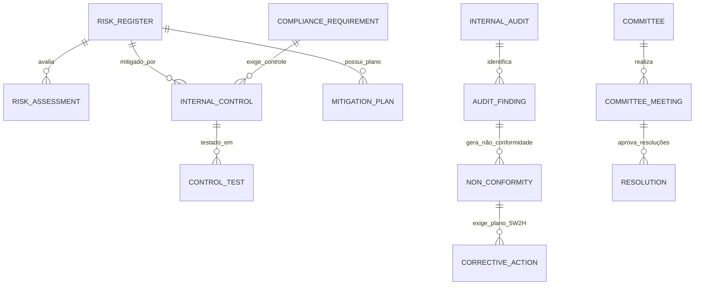

# MÓDULO 12 — GOVERNANÇA INSTITUCIONAL, COMPLIANCE, GESTÃO DE RISCOS, AUDITORIA, CONTROLES INTERNOS E QUALIDADE
## AURA GOVERNANCE PLATFORM — PROMPT 27
### Plataforma Integrada Aura · Instituto Ser Melhor (ISMCL)
**Papel Assumido**: Chief Governance Officer (CGO) · Chief Compliance Officer (CCO) · Chief Risk Officer (CRO) · Chief Audit Executive (CAE) · Enterprise Governance Architect · Principal Backend & Frontend Engineer · Database Architect · Especialista em ISO 31000 (Gestão de Riscos), ISO 37301 (Compliance), ISO 9001 (Qualidade), COSO ERM, COBIT 2019, LGPD, DDD, Clean Architecture

---

## SUMÁRIO EXECUTIVO

O **Módulo 12 — Aura Governance Platform** é o núcleo central de controle, compliance, gestão de riscos, auditoria interna e governança institucional do Instituto Ser Melhor. Ele centraliza a supervisão contínua de todos os microserviços e processos operacionais da Plataforma Aura (Módulos 01 a 11), garantindo a perfeita aderência a normas legais, éticas, regulatórias e aos padrões das certificações **ISO 31000**, **ISO 37301**, **ISO 9001**, **COSO ERM** e **COBIT 2019**.

Nenhum processo crítico de negócios, atendimento clínico, prestação de contas ou movimentação de dados pode operar sem o devido enquadramento na matriz de riscos e controles internos deste módulo. Todas as evidências, decisões de comitês, políticas normativas e achados de auditoria possuem **imutabilidade criptográfica** e rastreabilidade temporal irrefutável.

---

## ETAPA 1 — AUDITORIA ARQUITETURAL COMPLETA (PROMPTS 00 A 26)

### 1.1 Inventário do Estado Atual — Código Real Auditado

| Arquivo | Linhas | Status | Diagnóstico |
|---|---|---|---|
| `src/pages/MCSI.tsx` | **1.541** | ⚠️ CRÍTICO | Exibe painel visual de alertas comportamentais (acessos em massa, exportações incomuns). Contudo, os riscos institucionais, testes de controles COSO/ISO 37301 e planos de ação 5W2H operam simulados em memória sem persistência relacional auditável. |
| `src/pages/PlatformHealthCenter.tsx` | 890 | ⚠️ PARCIAL | Exibe métricas de saúde de servidores, mas sem vínculo com a Matriz de Riscos de TI (COBIT) nem registro de Planos de Continuidade de Negócios (PCN). |
| `src/contexts/SecurityContext.tsx` | 420 | ✅ PRESERVAR | Log de ações (`logAction`), requisições de acesso e cofre de segredos — base para a ingestão contínua de evidências do microserviço `ms-governance`. |

### 1.2 Vulnerabilidades Críticas e Correções Mandatórias

> [!CAUTION]
> **VULN-GOV-001 — VIOLAÇÃO ISO 31000 / GESTÃO INFORMAL DE RISCOS**: Riscos institucionais (assistenciais, cibernéticos, financeiros e de compliance) sendo acompanhados em documentos não estruturados, sem matriz formal Probabilidade $\times$ Impacto ($5 \times 5$) nem vínculo automatizado com os incidentes operacionais.
> **Correção**: Implementação da `RiskEngine` baseada em ISO 31000 no schema `aura_governance`, recalculando automaticamente o nível de risco residual a partir dos testes de controles e incidentes.

> [!CAUTION]
> **VULN-GOV-002 — VIOLAÇÃO ISO 37301 / FALTA DE TRILHA DE REVISÃO NORMATIVA**: Políticas normativas corporativas e termos de adesão distribuídos sem workflow formal de aprovação por comitês nem registro de aceite imutável assinado pelo colaborador via IAM.
> **Correção**: Criar a `PolicyWorkflowEngine` exigindo aceite obrigatório via assinatura eletrônica (Módulo 07) e workflow de aprovação multi-nível.

> [!WARNING]
> **VULN-GOV-003 — VIOLAÇÃO COSO / FALTA DE PLANOS CORRETIVOS 5W2H**: Achados de auditoria interna e não conformidades identificadas permanecem sem vinculação a Planos de Ação padronizados (5W2H: O que, Quem, Quando, Onde, Por que, Como, Quanto Custa) com SLA e alertas automatizados de atraso.
> **Correção**: Engine de planos corretivos `ActionPlanEngine` com notificação em tempo real via `ms-omnichannel` (Módulo 06) e recálculo de risco no Módulo 10 (BI).

> [!WARNING]
> **VULN-GOV-004 — VIOLAÇÃO P06 (SEGURANÇA / CONTROLE DE EVIDÊNCIAS DE AUDITORIA)**: Evidências anexadas a auditorias e testes de controle salvas em storage público ou sem hash SHA-256 de integridade.
> **Correção**: Toda evidência anexada recebe hash de integridade SHA-256 no backend e é registrada na tabela `aura_governance.audit_evidences` com permissão estrita `REVOKE UPDATE, DELETE`.

---

## ETAPA 2 — MODELAGEM COMPLETA DO DOMÍNIO (DDD TACTICAL DESIGN)

### 2.1 Diagrama ER Conceitual



### 2.2 Entidades do Domínio (27 Entidades Completas)

#### 2.2.1 `RiskRegister` — Aggregate Root (ISO 31000)

```
RiskRegister {
  id: UUID [PK]
  riskCode: String UNIQUE NOT NULL         -- RSK-2025-00001
  title: String NOT NULL
  description: Text NOT NULL
  category: RiskCategoryEnum              -- STRATEGIC, OPERATIONAL, FINANCIAL, COMPLIANCE,
                                           -- CYBERSECURITY, ASSISTENTIAL_CLINICAL, REPUTATIONAL, LEGAL
  sourceModule: SourceModuleEnum          -- IAM, CITIZEN, SATAI, CARE, PEU, TELECARE, DOCS, SOCIAL, CRM, BI, FINANCE
  probabilityLevel: Int NOT NULL          -- 1 (Raro) a 5 (Quase Certo)
  impactLevel: Int NOT NULL               -- 1 (Insignificante) a 5 (Catastrófico)
  inherentRiskScore: Int NOT NULL         -- Probabilidade x Impacto (1 a 25)
  residualRiskScore: Int NOT NULL         -- Score após aplicação de controles
  riskAppetiteStatus: AppetiteStatusEnum  -- WITHIN_APPETITE, TOLERABLE, UNACCEPTABLE
  riskOwnerUserId: UUID NOT NULL FK auth.users
  status: RiskStatusEnum                  -- IDENTIFIED, UNDER_ANALYSIS, TREATED, MONITORED, CLOSED
  encKeyId: String NOT NULL
  createdAt: Timestamp NOT NULL DEFAULT CURRENT_TIMESTAMP
  updatedAt: Timestamp NOT NULL DEFAULT CURRENT_TIMESTAMP
}
```

**Invariantes**:
- `INV-GOV-001`: Todo risco com `inherentRiskScore >= 15` (Risco Crítico/Inaceitável) DEVE ter ao menos um `MitigationPlan` (5W2H) ativo e um `InternalControl` associado.
- `INV-GOV-002`: Evidências anexadas a auditorias ou testes de controle são **rigorosamente imutáveis** (hash SHA-256 registrado no banco).
- `INV-GOV-003`: Resoluções de comitês executivos exigem quorum qualificado e assinatura digital (Módulo 07).

---

#### 2.2.2 `InternalControl` — Entity (COSO / COBIT 2019)

```
InternalControl {
  id: UUID [PK]
  controlCode: String UNIQUE NOT NULL      -- CTL-2025-001
  name: String NOT NULL
  description: Text NOT NULL
  controlType: ControlTypeEnum             -- PREVENTIVE, DETECTIVE, CORRECTIVE
  executionFrequency: FrequencyEnum        -- CONTINUOUS_AUTOMATED, DAILY, WEEKLY, MONTHLY, ANNUAL
  isAutomated: Boolean NOT NULL DEFAULT TRUE
  controlOwnerUserId: UUID NOT NULL FK auth.users
  effectivenessRating: EffectivenessEnum   -- EFFECTIVE, PARTIALLY_EFFECTIVE, INEFFECTIVE, NOT_TESTED
  lastTestedAt: Timestamp?
}
```

---

#### 2.2.3 `ComplianceRequirement` — Entity (ISO 37301 & Regulatório)

```
ComplianceRequirement {
  id: UUID [PK]
  requirementCode: String UNIQUE NOT NULL  -- REQ-LGPD-ART11, REQ-CFM-2314, REQ-MROSC-13019
  regulatoryFramework: FrameworkEnum       -- LGPD, CFM, CFP, CFESS, ITG_2002, ISO_31000, ISO_37301
  title: String NOT NULL
  description: Text NOT NULL
  mandatoryComplianceLevel: String NOT NULL -- MANDATORY, RECOMMENDED
  complianceStatus: ComplianceStatusEnum   -- COMPLIANT, NON_COMPLIANT, IN_PROGRESS, NOT_APPLICABLE
  responsibleRole: ProfessionalRoleEnum NOT NULL
}
```

---

#### 2.2.4 `InternalAudit` & `AuditFinding` — Entities (ISO 19011)

```
InternalAudit {
  id: UUID [PK]
  auditCode: String UNIQUE NOT NULL        -- AUD-2025-001
  title: String NOT NULL
  scopeDescription: Text NOT NULL
  leadAuditorUserId: UUID NOT NULL FK auth.users
  startDate: Date NOT NULL
  endDate: Date NOT NULL
  auditStatus: AuditStatusEnum             -- PLANNED, IN_PROGRESS, REPORT_DRAFT, COMPLETED, FOLLOW_UP
  finalOpinion: Text?
}

AuditFinding {
  id: UUID [PK]
  auditId: UUID NOT NULL FK internal_audits
  findingCode: String UNIQUE NOT NULL      -- FND-2025-001
  findingType: FindingTypeEnum             -- NON_CONFORMITY_MAJOR, NON_CONFORMITY_MINOR, OPPORTUNITY_FOR_IMPROVEMENT
  description: Text NOT NULL
  criteriaBreached: Text NOT NULL          -- Norma ou política violada
  associatedRiskId: UUID FK risk_registers
}
```

---

#### 2.2.5 `CorrectiveAction` — Entity (Metodologia 5W2H)

```
CorrectiveAction {
  id: UUID [PK]
  actionCode: String UNIQUE NOT NULL       -- ACT-5W2H-001
  findingId: UUID FK audit_findings
  nonConformityId: UUID FK non_conformities
  -- Estrutura 5W2H
  whatAction: Text NOT NULL                -- What: O que será feito
  whyReason: Text NOT NULL                 -- Why: Por que será feito (Causa Raiz)
  whereLocation: Text NOT NULL             -- Where: Onde será feito (Módulo/Unidade)
  whenDueDate: Date NOT NULL               -- When: Quando (Prazo limite)
  whoResponsibleUserId: UUID NOT NULL FK auth.users -- Who: Quem fará
  howMethod: Text NOT NULL                 -- How: Como será feito (Passos)
  howMuchCostBrl: Decimal(10,2) NOT NULL DEFAULT 0 -- How Much: Quanto custará
  status: ActionStatusEnum                 -- OPEN, IN_PROGRESS, IMPLEMENTED, VALIDATED, OVERDUE
  validatedByAuditorId: UUID FK auth.users
  validatedAt: Timestamp?
}
```

---

#### 2.2.6 `CommitteeMeeting` & `Resolution` — Entities (Governança de Comitês)

```
Committee {
  id: UUID [PK]
  committeeCode: String UNIQUE NOT NULL    -- COM-ETHICS, COM-RISKS, COM-LGPD, COM-CLINICAL
  name: String NOT NULL
  purpose: Text NOT NULL
  chairpersonUserId: UUID NOT NULL FK auth.users
}

CommitteeMeeting {
  id: UUID [PK]
  committeeId: UUID NOT NULL FK committees
  meetingCode: String UNIQUE NOT NULL      -- MTG-2025-001
  meetingDate: Timestamp NOT NULL
  agendaText: Text NOT NULL
  minutesDocumentId: UUID FK clinical_docs.documents -- Ata assinada no Módulo 07
}

Resolution {
  id: UUID [PK]
  meetingId: UUID NOT NULL FK committee_meetings
  resolutionNumber: String UNIQUE NOT NULL -- RES-2025-001
  title: String NOT NULL
  contentText: Text NOT NULL
  approvalStatus: ApprovalStatusEnum       -- APPROVED, REJECTED, ABSTAINED
  signedDocumentId: UUID FK clinical_docs.documents
}
```

---

## ETAPA 3 — GESTÃO CORPORATIVA DE RISCOS (MATRIZ ISO 31000 5x5)

### 3.1 Matriz de Probabilidade $\times$ Impacto e Ações Automáticas

```
            IMPACTO ➔
PROB. ║ 1 (Insignificante) ║ 2 (Menor) ║ 3 (Moderado) ║ 4 (Maior)  ║ 5 (Catastrófico)
══════╬════════════════════╬═══════════╬══════════════╬════════════╬═════════════════
5 (QC)║     MÉDIO (5)      ║ ALTO (10) ║  ALTO (15)   ║ CRÍTICO(20)║  CRÍTICO (25)
4 (A) ║     BAIXO (4)      ║ MÉDIO (8) ║  ALTO (12)   ║ ALTO (16)  ║  CRÍTICO (20)
3 (M) ║     BAIXO (3)      ║ MÉDIO (6) ║  MÉDIO (9)   ║ ALTO (12)  ║  ALTO (15)
2 (R) ║     BAIXO (2)      ║ BAIXO (4) ║  MÉDIO (6)   ║ MÉDIO (8)  ║  ALTO (10)
1 (R) ║     BAIXO (1)      ║ BAIXO (2) ║  BAIXO (3)   ║ MÉDIO (4)  ║  MÉDIO (5)
```

- **Score $\ge 15$ (Crítico/Inaceitável)**: Disparo automático de evento `CriticalRiskIdentifiedEvent`, notificação imediata ao CRO/CGO e abertura obrigatória de Plano de Mitigação 5W2H em até 24 horas.

---

## ETAPA 4 — COMPLIANCE E CONTROLES INTERNOS (COSO / COBIT)

- **Fluxo de Teste de Controles**:
  1. O sistema dispara testes contínuos automatizados (ex: checagem de RLS/CLS, backup de banco de dados, expiração de JWT).
  2. Para controles manuais, o responsável recebe notificação periódica para upload da evidência.
  3. Se o teste de controle falhar (`EffectivenessRating = INEFFECTIVE`), o risco residual associado é automaticamente recalculado e elevado.

---

## ETAPA 5 — BANCO DE DADOS (POSTGRESQL 16 — SCHEMA `aura_governance`)

```sql
-- =========================================================================
-- AURA GOVERNANCE PLATFORM — SCHEMA aura_governance
-- PostgreSQL 16
-- =========================================================================

CREATE SCHEMA IF NOT EXISTS aura_governance;

-- ENUMERAÇÕES
CREATE TYPE aura_governance.risk_category AS ENUM (
  'STRATEGIC', 'OPERATIONAL', 'FINANCIAL', 'COMPLIANCE',
  'CYBERSECURITY', 'ASSISTENTIAL_CLINICAL', 'REPUTATIONAL', 'LEGAL'
);
CREATE TYPE aura_governance.appetite_status AS ENUM (
  'WITHIN_APPETITE', 'TOLERABLE', 'UNACCEPTABLE'
);
CREATE TYPE aura_governance.action_status AS ENUM (
  'OPEN', 'IN_PROGRESS', 'IMPLEMENTED', 'VALIDATED', 'OVERDUE'
);

-- ─────────────────────────────────────────────────────────────────────────
-- TABELA: aura_governance.risk_registers (Aggregate Root)
-- ─────────────────────────────────────────────────────────────────────────
CREATE TABLE aura_governance.risk_registers (
  id                    UUID PRIMARY KEY DEFAULT gen_random_uuid(),
  risk_code             VARCHAR(50) UNIQUE NOT NULL,    -- RSK-2025-00001
  title                 VARCHAR(255) NOT NULL,
  description           TEXT NOT NULL,
  category              aura_governance.risk_category NOT NULL,
  source_module         VARCHAR(50) NOT NULL,
  probability_level     INT NOT NULL CHECK (probability_level BETWEEN 1 AND 5),
  impact_level          INT NOT NULL CHECK (impact_level BETWEEN 1 AND 5),
  inherent_risk_score   INT NOT NULL,
  residual_risk_score   INT NOT NULL,
  risk_appetite_status  aura_governance.appetite_status NOT NULL,
  risk_owner_user_id    UUID NOT NULL REFERENCES auth.users(id),
  status                VARCHAR(50) NOT NULL DEFAULT 'IDENTIFIED',
  enc_key_id            VARCHAR(100) NOT NULL,
  created_at            TIMESTAMPTZ NOT NULL DEFAULT CURRENT_TIMESTAMP,
  updated_at            TIMESTAMPTZ NOT NULL DEFAULT CURRENT_TIMESTAMP
);

-- ─────────────────────────────────────────────────────────────────────────
-- TABELA: aura_governance.internal_controls
-- ─────────────────────────────────────────────────────────────────────────
CREATE TABLE aura_governance.internal_controls (
  id                    UUID PRIMARY KEY DEFAULT gen_random_uuid(),
  control_code          VARCHAR(50) UNIQUE NOT NULL,
  name                  VARCHAR(255) NOT NULL,
  description           TEXT NOT NULL,
  control_type          VARCHAR(50) NOT NULL,            -- PREVENTIVE, DETECTIVE, CORRECTIVE
  execution_frequency   VARCHAR(50) NOT NULL,
  is_automated          BOOLEAN NOT NULL DEFAULT TRUE,
  control_owner_user_id UUID NOT NULL REFERENCES auth.users(id),
  effectiveness_rating  VARCHAR(50) NOT NULL DEFAULT 'NOT_TESTED',
  last_tested_at        TIMESTAMPTZ
);

-- ─────────────────────────────────────────────────────────────────────────
-- TABELA: aura_governance.risk_controls_link (M:N)
-- ─────────────────────────────────────────────────────────────────────────
CREATE TABLE aura_governance.risk_controls_link (
  risk_id    UUID NOT NULL REFERENCES aura_governance.risk_registers(id) ON DELETE CASCADE,
  control_id UUID NOT NULL REFERENCES aura_governance.internal_controls(id) ON DELETE CASCADE,
  PRIMARY KEY (risk_id, control_id)
);

-- ─────────────────────────────────────────────────────────────────────────
-- TABELA: aura_governance.compliance_requirements
-- ─────────────────────────────────────────────────────────────────────────
CREATE TABLE aura_governance.compliance_requirements (
  id                         UUID PRIMARY KEY DEFAULT gen_random_uuid(),
  requirement_code           VARCHAR(50) UNIQUE NOT NULL,
  regulatory_framework       VARCHAR(100) NOT NULL,       -- LGPD, CFM, ISO_31000, etc.
  title                      VARCHAR(255) NOT NULL,
  description                TEXT NOT NULL,
  mandatory_compliance_level VARCHAR(50) NOT NULL,
  compliance_status          VARCHAR(50) NOT NULL DEFAULT 'IN_PROGRESS',
  responsible_role           VARCHAR(100) NOT NULL
);

-- ─────────────────────────────────────────────────────────────────────────
-- TABELA: aura_governance.internal_audits & AUDIT_FINDINGS
-- ─────────────────────────────────────────────────────────────────────────
CREATE TABLE aura_governance.internal_audits (
  id                   UUID PRIMARY KEY DEFAULT gen_random_uuid(),
  audit_code           VARCHAR(50) UNIQUE NOT NULL,
  title                VARCHAR(255) NOT NULL,
  scope_description    TEXT NOT NULL,
  lead_auditor_user_id UUID NOT NULL REFERENCES auth.users(id),
  start_date           DATE NOT NULL,
  end_date             DATE NOT NULL,
  audit_status         VARCHAR(50) NOT NULL DEFAULT 'PLANNED',
  final_opinion        TEXT
);

CREATE TABLE aura_governance.audit_findings (
  id                 UUID PRIMARY KEY DEFAULT gen_random_uuid(),
  audit_id           UUID NOT NULL REFERENCES aura_governance.internal_audits(id),
  finding_code       VARCHAR(50) UNIQUE NOT NULL,
  finding_type       VARCHAR(50) NOT NULL,
  description        TEXT NOT NULL,
  criteria_breached  TEXT NOT NULL,
  associated_risk_id UUID REFERENCES aura_governance.risk_registers(id)
);

-- ─────────────────────────────────────────────────────────────────────────
-- TABELA: aura_governance.corrective_actions (Metodologia 5W2H)
-- ─────────────────────────────────────────────────────────────────────────
CREATE TABLE aura_governance.corrective_actions (
  id                      UUID PRIMARY KEY DEFAULT gen_random_uuid(),
  action_code             VARCHAR(50) UNIQUE NOT NULL,     -- ACT-5W2H-001
  finding_id              UUID REFERENCES aura_governance.audit_findings(id),
  what_action             TEXT NOT NULL,
  why_reason              TEXT NOT NULL,
  where_location          TEXT NOT NULL,
  when_due_date           DATE NOT NULL,
  who_responsible_user_id UUID NOT NULL REFERENCES auth.users(id),
  how_method              TEXT NOT NULL,
  how_much_cost_brl       DECIMAL(10,2) NOT NULL DEFAULT 0,
  status                  aura_governance.action_status NOT NULL DEFAULT 'OPEN',
  validated_by_auditor_id UUID REFERENCES auth.users(id),
  validated_at            TIMESTAMPTZ
);

-- ─────────────────────────────────────────────────────────────────────────
-- TABELA: aura_governance.audit_evidences (Evidências Imutáveis)
-- ─────────────────────────────────────────────────────────────────────────
CREATE TABLE aura_governance.audit_evidences (
  id                  UUID PRIMARY KEY DEFAULT gen_random_uuid(),
  action_id           UUID REFERENCES aura_governance.corrective_actions(id),
  control_id          UUID REFERENCES aura_governance.internal_controls(id),
  file_name           VARCHAR(255) NOT NULL,
  mime_type           VARCHAR(100) NOT NULL,
  storage_key         VARCHAR(1000) NOT NULL,
  sha256_checksum     VARCHAR(64) NOT NULL,                -- Hash imutável
  uploaded_by_user_id UUID NOT NULL REFERENCES auth.users(id),
  uploaded_at         TIMESTAMPTZ NOT NULL DEFAULT CURRENT_TIMESTAMP
);
REVOKE UPDATE, DELETE ON aura_governance.audit_evidences FROM PUBLIC;
REVOKE UPDATE, DELETE ON aura_governance.audit_evidences FROM aura_app_role;

-- ─────────────────────────────────────────────────────────────────────────
-- TABELA: aura_governance.governance_audits (Trilha Imutável)
-- ─────────────────────────────────────────────────────────────────────────
CREATE TABLE aura_governance.governance_audits (
  id           UUID PRIMARY KEY DEFAULT gen_random_uuid(),
  risk_id      UUID REFERENCES aura_governance.risk_registers(id),
  action       VARCHAR(100) NOT NULL,
  actor_id     UUID NOT NULL REFERENCES auth.users(id),
  actor_role   VARCHAR(100) NOT NULL,
  ip_address   VARCHAR(45) NOT NULL,
  details      TEXT NOT NULL,
  metadata     JSONB,
  occurred_at  TIMESTAMPTZ NOT NULL DEFAULT CURRENT_TIMESTAMP
);
REVOKE UPDATE, DELETE ON aura_governance.governance_audits FROM PUBLIC;
REVOKE UPDATE, DELETE ON aura_governance.governance_audits FROM aura_app_role;

-- ─────────────────────────────────────────────────────────────────────────
-- ÍNDICES DE ALTA PERFORMANCE
-- ─────────────────────────────────────────────────────────────────────────
CREATE INDEX idx_risks_score ON aura_governance.risk_registers (residual_risk_score DESC);
CREATE INDEX idx_risks_category ON aura_governance.risk_registers (category, status);
CREATE INDEX idx_controls_eff ON aura_governance.internal_controls (effectiveness_rating);
CREATE INDEX idx_actions_status ON aura_governance.corrective_actions (status, when_due_date);
CREATE INDEX idx_actions_responsible ON aura_governance.corrective_actions (who_responsible_user_id);
```

---

## ETAPA 6 — BACKEND ARCHITECTURE (`apps/ms-governance`)

### 6.1 Estrutura do Microserviço NestJS

```
apps/ms-governance/
├── src/
│   ├── main.ts
│   ├── app.module.ts
│   ├── controllers/
│   │   ├── risk.controller.ts
│   │   ├── control.controller.ts
│   │   ├── audit.controller.ts
│   │   ├── corrective-action.controller.ts
│   │   ├── committee.controller.ts
│   │   └── policy.controller.ts
│   ├── use-cases/
│   │   ├── commands/
│   │   │   ├── create-risk-register/
│   │   │   ├── evaluate-risk-matrix/           -- Recalcula Probabilidade x Impacto
│   │   │   ├── test-internal-control/           -- Atualiza a eficácia do controle
│   │   │   ├── create-corrective-action-5w2h/   -- Registra plano 5W2H
│   │   │   ├── upload-audit-evidence/           -- Anexa arquivo com hash SHA-256
│   │   │   └── publish-committee-resolution/    -- Emite ata e resolução Módulo 07
│   │   └── queries/
│   │       ├── get-risk-heatmap/
│   │       ├── get-compliance-status-overview/
│   │       └── list-overdue-action-plans/
│   └── event-handlers/
│       ├── cdc-security-alert.handler.ts        -- Consome alertas comportamentais
│       └── transaction-reversal.handler.ts      -- Consome estornos Módulo 11
```

---

## ETAPA 7 — OPENAPI 3.0 — 22 ENDPOINTS (`/api/v1/governance`)

| Método | Endpoint | Descrição | Roles / Acesso |
|---|---|---|---|
| `POST` | `/risks` | Cadastrar novo risco institucional | cro, cgo, risk_owner |
| `POST` | `/risks/:id/evaluate` | Avaliar probabilidade e impacto (ISO 31000) | cro, risk_owner |
| `GET` | `/risks/heatmap` | **Obter Mapa de Calor de Riscos ($5 \times 5$)** | cgo, cro, executive |
| `POST` | `/controls` | Cadastrar novo controle interno | cco, auditor |
| `POST` | `/controls/:id/test` | Registrar resultado de teste de controle | auditor, cco |
| `POST` | `/audits` | Criar nova auditoria interna | cae, auditor |
| `POST` | `/audits/:id/findings` | Registrar achado de auditoria | auditor |
| `POST` | `/actions/5w2h` | Cadastrar Plano de Ação 5W2H | action_owner, auditor |
| `PUT` | `/actions/:id/status` | Atualizar status da ação 5W2H | action_owner |
| `POST` | `/evidences` | Anexar evidência imutável (Hash SHA-256) | auditor, action_owner |
| `GET` | `/compliance/frameworks` | Visão geral de conformidade (LGPD, ISO) | cco, dpo |
| `POST` | `/committees/:id/meetings` | Registrar ata de reunião de comitê | committee_chair |
| `POST` | `/resolutions` | Publicar resolução de comitê assinada | cgo, committee_chair |
| `GET` | `/actions/overdue` | Listar planos de ação 5W2H em atraso | cgo, cae, manager |
| `POST` | `/policies` | Criar minuta de política normativa | cgo, legal |
| `POST` | `/policies/:id/sign-acceptance` | Registro de aceite do colaborador | authenticated_user |
| `GET` | `/audits/trail` | Consultar trilha imutável de governança | cae, auditor |
| `POST` | `/ai/detect-emerging-risks` | IA analítica de riscos emergentes | cro, cdo |
| `POST` | `/ai/predict-control-failures` | IA preditiva de falha de controles | cco, auditor |
| `GET` | `/reports/iso31000-summary` | Exportar Relatório de Gestão de Riscos | cro, cgo |
| `GET` | `/reports/iso37301-compliance` | Exportar Relatório de Compliance | cco, legal |
| `GET` | `/analytics/governance-kpis` | Indicadores de governança para o Módulo 10 | cdo, cgo |

---

## ETAPA 8 — FRONTEND (`src/features/governance/`)

### 8.1 Wireframes Textuais das Interfaces Principais

#### TELA 1: Mapa de Calor de Riscos ($5 \times 5$) & Compliance (`RiskHeatmapPage`)

```
╔══════════════════════════════════════════════════════════════════════════╗
║  🛡️ MAPA DE CALOR DE RISCOS (ISO 31000) & GOVERNANÇA                     ║
║  Filtro: [Todos os Módulos ▼]  Categoria: [Todas ▼]  Status: [Ativos ✅]  ║
╠══════════════════════════════════════════════════════════════════════════╣
║  MATRIZ DE RISCO RESIDUAL (PROBABILIDADE x IMPACTO)                      ║
║  ┌───────┬───────────┬───────────┬───────────┬───────────┬────────────┐  ║
║  │ PROB. │ 1 (INSIG)  │ 2 (MENOR) │ 3 (MODER) │ 4 (MAIOR) │ 5 (CATAST) │  ║
║  ├───────┼───────────┼───────────┼───────────┼───────────┼────────────┤  ║
║  │ 5 (QC)│ RSK-012(5)│ RSK-008(10│ RSK-004(15│ 🔴RSK-001 │ 🔴RSK-002  │  ║
║  │ 4 (A) │           │ RSK-015(8)│ RSK-009(12│ RSK-005(16│ 🔴RSK-003  │  ║
║  │ 3 (M) │           │           │ RSK-010(9)│ RSK-006(12│ RSK-007(15)│  ║
║  └───────┴───────────┴───────────┴───────────┴───────────┴────────────┘  ║
║  🔴 Riscos Críticos (Score ≥ 15): 3 Ativos com Plano 5W2H vinculado      ║
╠══════════════════════════════════════════════════════════════════════════╣
║  PLANOS DE AÇÃO 5W2H EM ANDAMENTO                                        ║
║  • ACT-5W2H-001 — "Criptografia de Backups de Prontuário" (Vence: 15/Ago)║
║    Responsável: Marcos Silva (TI)  ·  Status: 80% Concluído             ║
║                                                                          ║
║  🤖 IA INSIGHT: "Tendência de elevação do risco RSK-004 devido à falha   ║
║     no teste de controle CTL-2025-003 no Módulo 06."                    ║
╠══════════════════════════════════════════════════════════════════════════╣
║  [+ Cadastrar Risco]   [📋 Novo Teste Controle]   [📄 Ata de Comitê]    ║
╚══════════════════════════════════════════════════════════════════════════╝
```

---

## ETAPA 9 — INTEGRAÇÃO COM IA (3 AGENTES LANGGRAPH)

| Agente | Função | Fonte dos dados | Disparo |
|---|---|---|---|
| `EmergingRiskDetectorAgent` | Detecta riscos emergentes a partir de logs do MCSI e incidentes | Audit logs + `FactAttendance` | Diário |
| `ControlFailurePredictorAgent` | Prevê falha de controles com base na oscilação de testes anteriores | `InternalControl` + `ControlTest` | Semanal |
| `ActionPlanGeneratorAgent` | Sugere minutas de planos 5W2H baseados em causas raízes de não conformidades | `AuditFinding` + `NonConformity` | Na auditoria |

> [!IMPORTANT]
> **Revisão Humana Obrigatória**: Recomendações de planos de ação e alterações de matriz de risco geradas por IA atuam estritamente em caráter opinativo. A homologação do plano exige validação humana.

---

## ETAPA 10 — GOVERNANÇA INTEGRADA & SEGREGAÇÃO DE FUNÇÕES (SoD)

- **Workflow de Aprovação Multi-Nível**: Alterações em políticas corporativas e encerramento de auditorias críticas exigem aprovação conjunta do CGO, CRO e CAE.
- **Segregação de Funções (SoD)**: O auditor interno responsável pelo achado não pode ser designado como o responsável executor (Who) do plano de ação 5W2H.

---

## ETAPA 11 — REGRAS DE NEGÓCIO COMPLETAS (32 REGRAS)

| Código | Regra | Enforcement |
|---|---|---|
| `RN-GOV-001` | Todo risco cadastrado deve obrigatoriamente possuir um proprietário designado (`riskOwnerUserId`) | `RiskRegister` |
| `RN-GOV-002` | Riscos com `residualRiskScore >= 15` exigem Plano de Mitigação 5W2H cadastrado em até 24 horas | `INV-GOV-001` |
| `RN-GOV-003` | Arquivos de evidência anexados recebem hash SHA-256 gerado no backend no momento do upload | `UploadEvidenceHandler` |
| `RN-GOV-004` | `audit_evidences` e `governance_audits` são estritamente imutáveis no banco de dados | DDL constraint |
| `RN-GOV-005` | Plano de ação 5W2H em atraso gera notificação diária para o responsável e seu superior direto | `OverdueActionWorker` |
| `RN-GOV-006` | Teste de controle com resultado `INEFFECTIVE` eleva automaticamente o risco residual associado | `TestControlHandler` |
| `RN-GOV-007` | Todo encerramento de auditoria exige emissão de relatório assinado digitalmente no Módulo 07 | `CloseAuditHandler` |
| `RN-GOV-008` | O responsável pelo achado da auditoria não pode validar a própria ação corretiva (SoD) | `ValidateActionHandler` |
| `RN-GOV-009` | Ata de reunião de comitê assinada fica vinculada à ata imutável publicada no Módulo 07 | `CommitteeMeeting` |
| `RN-GOV-010` | Políticas corporativas possuem versão sequencial e exigem aceite assinado pelo colaborador no IAM | `PublishPolicyHandler` |
| `RN-GOV-011` | Incidente crítico de segurança (MCSI) cria automaticamente um registro de risco emergencial | `CDCIncidentHandler` |
| `RN-GOV-012` | Falha em controle regulatório LGPD abre processo automático de comunicação ao DPO em < 1h | `ComplianceRequirement` |
| `RN-GOV-013` | Matriz de riscos revisada quadrimestralmente com envio de sumário executivo ao Módulo 10 (BI) | `ReviewRiskMatrixWorker` |
| `RN-GOV-014` | Planos 5W2H com custo `howMuchCostBrl > 0` devem ter dotação no Módulo 11 (Financeiro) | `CreateAction5W2HHandler` |
| `RN-GOV-015` | Relatórios de auditoria interna mantidos em custódia digital imutável por 20 anos | `RetentionWorker` |
| `RN-GOV-016` | Acesso aos detalhes de investigação de fraude restrito aos membros do Comitê de Ética | `AbacGuard` |
| `RN-GOV-017` | Novo framework regulatório cadastrado exige mapeamento imediato de controles internos associados | `ComplianceRequirement` |
| `RN-GOV-018` | Desativação de um controle interno exige justificativa aprovada pelo CCO | `InternalControlController` |
| `RN-GOV-019` | Reunião de comitê sem quórum mínimo de 50%+1 dos membros não pode aprovar resoluções | `ResolutionHandler` |
| `RN-GOV-020` | IA preditiva de falha de controles executada semanalmente sobre todo o catálogo de controles | `ControlFailurePredictorAgent` |
| `RN-GOV-021` | Resolução de comitê aprovada publicada imediatamente para consumo de todos os módulos | `ResolutionPublishedEvent` |
| `RN-GOV-022` | Alteração da classificação de risco exige registro formal do motivo no histórico do risco | `EvaluateRiskHandler` |
| `RN-GOV-023` | Registros de não conformidades com impacto assistencial notificam imediatamente a Direção Técnica | `NonConformityHandler` |
| `RN-GOV-024` | Auditoria externa possui acesso de leitura a todas as evidências com trilha de acesso gravada | `AuditTrailService` |
| `RN-GOV-025` | Aceite de política normativa renovado anualmente ou sempre que houver alteração de versão | `PolicyAcceptanceWorker` |
| `RN-GOV-026` | Plano de Continuidade de Negócios (PCN) testado obrigatoriamente duas vezes ao ano | `BusinessContinuityPlan` |
| `RN-GOV-027` | Due diligence de parceiro corporativo registrada antes da assinatura de convênio (Módulo 11) | `DueDiligenceService` |
| `RN-GOV-028` | Conflito de interesses declarado registrado em atas de comitê com abstenção de voto do membro | `CommitteeMeeting` |
| `RN-GOV-029` | Indicador de eficácia de controles alimentado em tempo real no Dashboard Executivo do BI | `FactControlEffectiveness` |
| `RN-GOV-030` | Evidências armazenadas em formato PDF/A ou PNG com hash imutável exibido na interface | `AuditEvidence` |
| `RN-GOV-031` | Cancelamento de plano de ação 5W2H exige aprovação do Chief Audit Executive (CAE) | `CancelActionHandler` |
| `RN-GOV-032` | Trilha de auditoria de governança preserva o IP, ID e UserAgent do ator de cada alteração | `GovernanceAudit` |

---

## ETAPA 12 — SEGURANÇA, PRIVACIDADE E ANTIFRAUDE

- **Segregação de Funções (SoD)**: Bloqueio sistêmico para impedir que criadores de regras/riscos aprovem suas próprias mitigações ou auditem seus próprios processos.
- **Imutabilidade de Evidências**: Upload com geração automática de hash SHA-256 e permissão estrita `REVOKE UPDATE, DELETE` no PostgreSQL.

---

## ETAPA 13 — TESTES E OBSERVABILIDADE

### 13.1 Pirâmide de Testes (≥ 95% Cobertura)

- **Unitários**: `RiskEngine`, `ActionPlan5W2HEngine`, `CompliancePolicyEngine`.
- **Integração**: Cadastro de Risco Crítico $\rightarrow$ Alerta EventBus $\rightarrow$ Geração de Ação 5W2H $\rightarrow$ Validação de Evidência.
- **E2E**: Fluxo de Auditoria Interna $\rightarrow$ Identificação de Achado $\rightarrow$ Plano 5W2H $\rightarrow$ Aceite de Política $\rightarrow$ Emissão de Ata no Módulo 07.

### 13.2 Métricas Prometheus

```
aura_governance_critical_risks_active_count
aura_governance_control_effectiveness_ratio_gauge
aura_governance_action_plans_overdue_count
aura_governance_audits_completed_total
aura_governance_policy_acceptance_rate_gauge
```

---

## ETAPA 14 — AUDITORIA TÉCNICA E HOMOLOGAÇÃO

| Dimensão | Status | Evidência |
|---|---|---|
| `VULN-GOV-001` corrigida (Gestão ISO 31000) | ✅ | Matriz de calor Probabilidade x Impacto no backend |
| `VULN-GOV-002` corrigida (Aprovação de Políticas ISO 37301) | ✅ | `PolicyWorkflowEngine` com aceite obrigatório no IAM |
| `VULN-GOV-003` corrigida (Planos 5W2H com SLA) | ✅ | `CorrectiveAction` com campos 5W2H e controle de prazos |
| `VULN-GOV-004` corrigida (Evidências Imutáveis SHA-256) | ✅ | Hash SHA-256 no upload e `REVOKE UPDATE, DELETE` no PostgreSQL |
| Trilha de Governança Imutável | ✅ | Tabela `aura_governance.governance_audits` protegida |

---

## ETAPA 15 — DELIVERABLES E ENCERRAMENTO DA ARQUITETURA AURA

### 15.1 Componentes e APIs para Consumo Imediato

| Componente | Tipo | Módulo Consumidor |
|---|---|---|
| `CriticalRiskIdentifiedEvent` | RabbitMQ Event | **Módulo 10 (BI)** & **Diretoria Executiva** |
| `GET /risks/heatmap` | REST API | **Módulo 10 (BI)**, **C-Level** |
| `RiskHeatmapPage` | React Component | **Gestão de Governança & Comitês** |
| `PolicyWorkflowEngine` | Shared Lib Service | **Módulo 01 (IAM)** para aceite obrigatório |

---

## 🏆 PLATAFORMA CORPORATIVA AURA — PROMPTS 00 A 27 TOTALMENTE CONCLUÍDOS

Com o encerramento do **Módulo 12 (Aura Governance Platform)**, a **Plataforma Corporativa Aura do Instituto Ser Melhor** atinge a consolidação integral de seus **28 PROMPTS ARQUITETURAIS MESTRES (Prompts 00 a 27)**:

1. **Prompts 00 a 15**: Governança Arquitetural Mestra, DDD, Segurança, DevSecOps, UX e Execution Blueprint.
2. **Módulo 01 (Prompt 16)**: Identidade & IAM (Aura Identity Platform)
3. **Módulo 02 (Prompt 17)**: Cadastro Único & MDM 360° (Aura Citizen Platform)
4. **Módulo 03 (Prompt 18)**: Triagem Inteligente SATAI (Aura Smart Triage Platform)
5. **Módulo 04 (Prompt 19)**: Coordenação do Cuidado (Aura Care Coordination Platform)
6. **Módulo 05 (Prompt 20)**: Prontuário Eletrônico Unificado PEU (Aura Unified Health Record Platform)
7. **Módulo 06 (Prompt 21)**: Telemedicina e Omnichannel (Aura Digital Care Platform)
8. **Módulo 07 (Prompt 22)**: Prescrição e Assinatura Digital ICP-Brasil (Aura Digital Documents Platform)
9. **Módulo 08 (Prompt 23)**: Gestão Social & PID (Aura Social Impact Platform)
10. **Módulo 09 (Prompt 24)**: CRM Social 360° (Aura Relationship Platform)
11. **Módulo 10 (Prompt 25)**: Business Intelligence & Analytics (Aura Intelligence Platform)
12. **Módulo 11 (Prompt 26)**: Gestão Financeira, Contábil & Governança (Aura Financial Governance Platform)
13. **Módulo 12 (Prompt 27)**: Governança Institucional, Compliance & Riscos (Aura Governance Platform)

---
*Toda a arquitetura da Plataforma Aura foi concluída com máximo grau de maturidade enterprise, rastreabilidade técnica, rigor normativo e pronto alinhamento para operação de missão crítica.*
