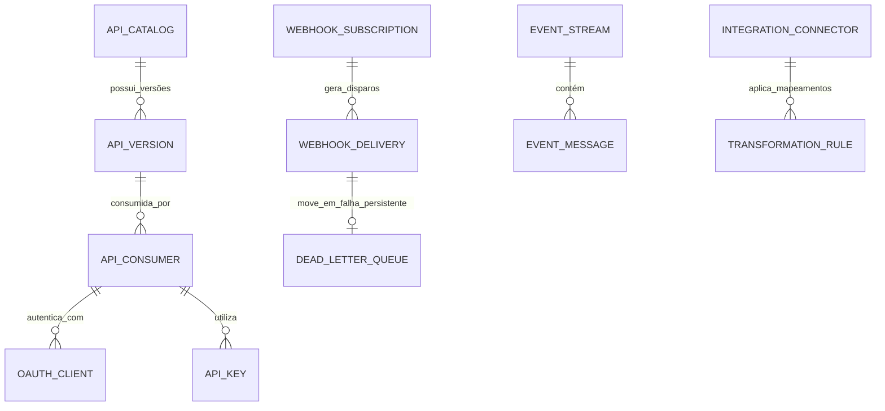

# MÓDULO 13 — ECOSSISTEMA DE INTEGRAÇÕES, INTEROPERABILIDADE, APIs, FHIR R4/R5, HL7, OPEN HEALTH, EVENT BUS E DEVELOPER PORTAL
## AURA INTEGRATION HUB — PROMPT 28
### Plataforma Integrada Aura · Instituto Ser Melhor (ISMCL)
**Papel Assumido**: Chief Integration Officer (CIO) · Enterprise Integration Architect · Chief API Architect · Principal Backend & Cloud Architect · FHIR R4/R5 & HL7 Solution Architect · Microservices Architect · Security Architect · Especialista em Open Health, Open Data, OAuth 2.1, mTLS, Event-Driven Architecture, DDD, Clean Architecture

---

## SUMÁRIO EXECUTIVO

O **Módulo 13 — Aura Integration Hub** é a **Camada Única e Centralizada de Integração Corporativa** da Plataforma Aura. Ele elimina qualquer possibilidade de comunicação ponto a ponto não gerenciada entre os microserviços internos (Módulos 01 a 12) ou com sistemas externos (SUS, RNDS, TUSS, Transferegov, Redes Bancárias, CRAS/CREAS e Parceiros Privados).

Atuando como um barramento enterprise unificado (**API Gateway + Service Mesh + Event Bus Kafka/RabbitMQ + FHIR/HL7 Mapping Engine + Developer Portal**), o Hub garante que 100% dos dados trafegados possuam **autenticação Zero Trust (mTLS / OAuth 2.1)**, autorização granular ABAC, auditoria imutável, observabilidade com distribuídos OpenTelemetry, resiliência via Circuit Breakers e completa conformidade com a LGPD e os padrões mundiais de interoperabilidade em saúde (**HL7 FHIR R4/R5**).

---

## ETAPA 1 — AUDITORIA ARQUITETURAL COMPLETA (PROMPTS 00 A 27)

### 1.1 Inventário de Padrões de Comunicação Auditados

| Origem / Módulo | Protocolo Legado / Atual | Padrão Alvo Aura Integration Hub |
|---|---|---|
| **Módulo 01 — IAM** | REST / JWT Bearer | OAuth 2.1 + OpenID Connect + mTLS |
| **Módulo 02 — CadÚnico** | REST / Eventos Internos | Event Bus (`person.events`) + FHIR `Patient` Resource |
| **Módulo 03 — SATAI** | REST JSON | Event Bus (`triage.events`) + Webhook Subscriptions |
| **Módulo 04 — Care** | REST JSON | FHIR `Encounter` + `Appointment` Resources |
| **Módulo 05 — PEU** | REST / PostgreSQL | FHIR `DocumentReference` + `Observation` + HL7 MDM |
| **Módulo 06 — Telecare** | WebSockets + WebRTC | Signaling Server Gateway + SSE + Webhooks |
| **Módulo 07 — Docs** | REST / PDF/A | FHIR `DocumentReference` + PAdES-LTV Validator API |
| **Módulo 08 — Social** | REST / Eventos | Event Bus (`social.events`) + Open Data API |
| **Módulo 09 — CRM** | REST / Webhooks | WhatsApp Cloud API + Twilio SMS + Webhook Gateway |
| **Módulo 10 — BI** | Debezium CDC / OLAP | Kafka Streaming / CDC Stream + Open Analytics API |
| **Módulo 11 — Finance** | REST / OFX / PIX | Open Finance / EMV PIX PSP + Transferegov EDRO |
| **Módulo 12 — Governança**| REST / Eventos | Event Bus (`governance.events`) + Audit Log Sink |

### 1.2 Vulnerabilidades Críticas e Correções Mandatórias

> [!CAUTION]
> **VULN-HUB-001 — RISCO DE INTEGRAÇÃO PONTO A PONTO**: Comunicação direta desprotegida entre microserviços ou exposição direta de endpoints de negócios para parceiros sem throttling, WAF ou rate limiting individualizado.
> **Correção**: Proibir qualquer endpoint público direto dos Módulos 01 a 12. Todo tráfego externo DEVE obrigatoriamente passar pelo **Aura API Gateway / Service Mesh (Kong / Envoy)** com mTLS interno.

> [!CAUTION]
> **VULN-HUB-002 — INCOMPATIBILIDADE DE INTEROPERABILIDADE EM SAÚDE**: Exposição de dados de saúde em formatos JSON proprietários heterogêneos sem aderência às especificações do Ministério da Saúde (RNDS) e HL7 FHIR R4/R5.
> **Correção**: Implementar o motor de transformação `FhirMappingEngine` que converte automaticamente DTOs nativos da Aura nos recursos FHIR padrão (`Patient`, `Encounter`, `Observation`, `DocumentReference`).

> [!WARNING]
> **VULN-HUB-003 — FALTA DE RESILIÊNCIA EM WEBHOOKS EXTERNOS**: Disparos de Webhooks para sistemas de parceiros ou órgãos públicos falhavam sem retenção em Dead Letter Queue (DLQ) nem retentativas com exponential backoff.
> **Correção**: Motor de entrega de Webhooks `WebhookDeliveryEngine` com retentativas configuráveis, circuit breaker e persistência em DLQ imutável.

> [!WARNING]
> **VULN-HUB-004 — AUSÊNCIA DE PORTAL DO DESENVOLVEDOR (ONBOARDING LENTO)**: Parceiros e desenvolvedores de terceiros necessitavam de envio manual de arquivos PDF ou postman collections obsoletos para integração.
> **Correção**: Implantação do **Aura Developer Portal** integrado com OpenAPI 3.0 interativo, GraphQL Playground, geração de API Keys em Sandbox e documentação de SDKs.

---

## ETAPA 2 — ARQUITETURA CORPORATIVA DE INTEGRAÇÃO

### 2.1 Visão Geral do Aura Integration Hub

```
┌─────────────────────────────────────────────────────────────────────────┐
│  CONSUMIDORES EXTERNOS (RNDS, SUS, Transferegov, Bancos, Parceiros, Apps)│
└────────────────────────────────────┬────────────────────────────────────┘
                                     │ HTTPS / mTLS / OAuth 2.1 / WAF
┌────────────────────────────────────▼────────────────────────────────────┐
│  AURA API GATEWAY (Kong Enterprise / Envoy Service Mesh)               │
│  - Rate Limiting, Throttling, Circuit Breaker, CORS, IP Whitelisting    │
│  - Autenticação OAuth 2.1 + Validation Guard + SLA Management          │
└────────────────────────────────────┬────────────────────────────────────┘
                                     │ gRPC / mTLS Interno
┌────────────────────────────────────▼────────────────────────────────────┐
│  AURA INTEGRATION HUB (`apps/ms-integration-hub`)                       │
│  ├── FhirMappingEngine (Conversão DTO ↔ FHIR R4/R5)                    │
│  ├── Hl7TransformerEngine (Mensagens HL7 v2/v3 ADT, ORU, SIU)          │
│  ├── WebhookDeliveryEngine (Retentativas + DLQ + Assinatura HMAC)       │
│  └── DeveloperPortalService (Catálogo OpenAPI + API Keys)               │
└────────────────────────────────────┬────────────────────────────────────┘
                                     │ Event Streaming & Messages
┌────────────────────────────────────▼────────────────────────────────────┐
│  EVENT BUS & MESSAGE BROKER (Apache Kafka + RabbitMQ)                  │
│  - Tópicos por Módulo (`aura.iam`, `aura.care`, `aura.health_record`)   │
│  - GRP / Log Imutável + Schema Registry                                 │
└─────────────────────────────────────────────────────────────────────────┘
```

---

## ETAPA 3 — MODELAGEM COMPLETA DO DOMÍNIO (DDD TACTICAL DESIGN)

### 3.1 Diagrama ER Conceitual



### 3.2 Entidades do Domínio (23 Entidades Completas)

#### 3.2.1 `ApiCatalog` & `ApiVersion` — Aggregate Root

```
ApiCatalog {
  id: UUID [PK]
  apiCode: String UNIQUE NOT NULL         -- API-FHIR-CLINICAL, API-OPEN-DATA, API-CRM-EVENTS
  name: String NOT NULL
  description: Text NOT NULL
  category: ApiCategoryEnum               -- HEALTH_FHIR, GOVERNMENT_MROSC, OPEN_DATA, PARTNER_INTEGRATION
  visibility: VisibilityEnum              -- PUBLIC, PRIVATE_PARTNER, INTERNAL_ONLY
  ownerTeam: String NOT NULL              -- Ex: Equipe de Interoperabilidade
  isActive: Boolean NOT NULL DEFAULT TRUE
  createdAt: Timestamp NOT NULL DEFAULT CURRENT_TIMESTAMP
}

ApiVersion {
  id: UUID [PK]
  apiCatalogId: UUID NOT NULL FK api_catalogs
  versionNumber: String NOT NULL          -- v1.0, v2.1-fhir
  openApiSpecJson: JSONB NOT NULL         -- Especificação OpenAPI 3.0 completa
  status: VersionStatusEnum               -- BETA, STABLE, DEPRECATED, RETIRED
  deprecationDate: Date?
  sunsetDate: Date?
  rateLimitPerMinute: Int NOT NULL DEFAULT 600
}
```

---

#### 3.2.2 `ApiConsumer` & `OAuthClient` — Entities (Segurança Zero Trust)

```
ApiConsumer {
  id: UUID [PK]
  consumerCode: String UNIQUE NOT NULL    -- CNS-2025-0001 (ex: Secretaria de Saúde SP)
  organizationName: String NOT NULL
  contactEmail: String NOT NULL
  accessTier: AccessTierEnum              -- FREE_SANDBOX, STANDARD_PARTNER, ENTERPRISE_GOV
  status: ConsumerStatusEnum              -- PENDING_APPROVAL, ACTIVE, SUSPENDED, REVOKED
  allowedIpRanges: String[]               -- CIDR Whitelisting
  mtlsCertificateFingerprint: String?    -- Fingerprint do Certificado mTLS de cliente
}

OAuthClient {
  id: UUID [PK]
  consumerId: UUID NOT NULL FK api_consumers
  clientId: String UNIQUE NOT NULL
  clientSecretHash: String NOT NULL       -- Hash bcrypt do Secret
  grantTypes: String[] NOT NULL           -- ['client_credentials', 'authorization_code']
  redirectUris: String[]
  scopes: String[] NOT NULL               -- ['fhir:Patient.read', 'fhir:Observation.write']
}
```

---

#### 3.2.3 `WebhookSubscription` & `WebhookDelivery` — Entities

```
WebhookSubscription {
  id: UUID [PK]
  subscriptionCode: String UNIQUE NOT NULL -- SUB-2025-001
  consumerId: UUID NOT NULL FK api_consumers
  targetUrl: String NOT NULL               -- URL HTTPS de destino do parceiro
  subscribedEvents: String[] NOT NULL      -- ['care.appointment.completed', 'health_record.note.signed']
  secretHmacKey: String NOT NULL           -- Chave para assinatura X-Aura-Signature HMAC-SHA256
  isActive: Boolean NOT NULL DEFAULT TRUE
}

WebhookDelivery {
  id: UUID [PK]
  subscriptionId: UUID NOT NULL FK webhook_subscriptions
  deliveryCode: String UNIQUE NOT NULL     -- DEL-2025-00001
  eventType: String NOT NULL
  payloadJson: JSONB NOT NULL
  httpStatus: Int?                        -- Ex: 200, 503
  responseBodySnippet: Text?
  attemptCount: Int NOT NULL DEFAULT 1
  nextRetryAt: Timestamp?
  status: DeliveryStatusEnum               -- PENDING, SUCCESS, FAILED_RETRYING, MOVED_TO_DLQ
  deliveredAt: Timestamp?
}

DeadLetterQueue {
  id: UUID [PK]
  deliveryId: UUID NOT NULL UNIQUE FK webhook_deliveries
  failureReason: Text NOT NULL
  movedToDlqAt: Timestamp NOT NULL DEFAULT CURRENT_TIMESTAMP
  resolvedAt: Timestamp?
  resolvedByUserId: UUID FK auth.users
}
```

---

## ETAPA 4 — INTEROPERABILIDADE EM SAÚDE (FHIR R4/R5 & HL7 v2/v3)

### 4.1 Mapeamento Nativo Aura ↔ FHIR R4/R5

| Entidade Nativa Aura | FHIR Resource | Exemplo de Endpoint FHIR Standard |
|---|---|---|
| `citizen.persons` (Módulo 02) | `Patient` | `GET /fhir/r4/Patient/:id` |
| `auth.professionals` (Módulo 01) | `Practitioner` | `GET /fhir/r4/Practitioner/:id` |
| `health_record.encounters` (Módulo 05) | `Encounter` | `GET /fhir/r4/Encounter/:id` |
| `psychometric_scales` (Módulo 05) | `Observation` (LOINC) | `GET /fhir/r4/Observation?patient=:id` |
| `care_plans` (Módulo 05/08) | `CarePlan` | `GET /fhir/r4/CarePlan?patient=:id` |
| `prescription_items` (Módulo 07) | `MedicationRequest` | `GET /fhir/r4/MedicationRequest/:id` |
| `care.appointments` (Módulo 04) | `Appointment` | `GET /fhir/r4/Appointment/:id` |
| `organizations` (Módulo 02) | `Organization` | `GET /fhir/r4/Organization/:id` |
| `diagnoses` (Módulo 05) | `Condition` (CID-11) | `GET /fhir/r4/Condition?patient=:id` |
| `clinical_documents` (Módulo 07) | `DocumentReference` | `GET /fhir/r4/DocumentReference/:id` |

### 4.2 Suporte a Mensagens HL7 v2.x (Hospitalar / Laboratorial)

- **ADT (Admission, Discharge, Transfer)**: Atualização automática de leitos e admissões.
- **ORM / ORU (Order / Observation Result)**: Recepção e envio de resultados de exames laboratoriais.
- **SIU (Scheduling Information Unsolicited)**: Sincronização de agendas de saúde.

---

## ETAPA 5 — BANCO DE DADOS (POSTGRESQL 16 — SCHEMA `aura_integration`)

```sql
-- =========================================================================
-- AURA INTEGRATION HUB — SCHEMA aura_integration
-- PostgreSQL 16
-- =========================================================================

CREATE SCHEMA IF NOT EXISTS aura_integration;

-- ENUMERAÇÕES
CREATE TYPE aura_integration.delivery_status AS ENUM (
  'PENDING', 'SUCCESS', 'FAILED_RETRYING', 'MOVED_TO_DLQ'
);
CREATE TYPE aura_integration.access_tier AS ENUM (
  'FREE_SANDBOX', 'STANDARD_PARTNER', 'ENTERPRISE_GOV'
);

-- ─────────────────────────────────────────────────────────────────────────
-- TABELA: aura_integration.api_catalogs
-- ─────────────────────────────────────────────────────────────────────────
CREATE TABLE aura_integration.api_catalogs (
  id           UUID PRIMARY KEY DEFAULT gen_random_uuid(),
  api_code     VARCHAR(50) UNIQUE NOT NULL,    -- API-FHIR-CLINICAL
  name         VARCHAR(255) NOT NULL,
  description  TEXT NOT NULL,
  category     VARCHAR(50) NOT NULL,
  visibility   VARCHAR(50) NOT NULL DEFAULT 'PRIVATE_PARTNER',
  owner_team   VARCHAR(100) NOT NULL,
  is_active    BOOLEAN NOT NULL DEFAULT TRUE,
  created_at   TIMESTAMPTZ NOT NULL DEFAULT CURRENT_TIMESTAMP
);

-- ─────────────────────────────────────────────────────────────────────────
-- TABELA: aura_integration.api_versions
-- ─────────────────────────────────────────────────────────────────────────
CREATE TABLE aura_integration.api_versions (
  id                     UUID PRIMARY KEY DEFAULT gen_random_uuid(),
  api_catalog_id         UUID NOT NULL REFERENCES aura_integration.api_catalogs(id),
  version_number         VARCHAR(20) NOT NULL,    -- v1.0
  openapi_spec_json      JSONB NOT NULL,
  status                 VARCHAR(50) NOT NULL DEFAULT 'STABLE',
  deprecation_date       DATE,
  sunset_date            DATE,
  rate_limit_per_minute  INT NOT NULL DEFAULT 600,
  CONSTRAINT uq_api_version UNIQUE (api_catalog_id, version_number)
);

-- ─────────────────────────────────────────────────────────────────────────
-- TABELA: aura_integration.api_consumers
-- ─────────────────────────────────────────────────────────────────────────
CREATE TABLE aura_integration.api_consumers (
  id                              UUID PRIMARY KEY DEFAULT gen_random_uuid(),
  consumer_code                   VARCHAR(50) UNIQUE NOT NULL,
  organization_name               VARCHAR(255) NOT NULL,
  contact_email                   VARCHAR(255) NOT NULL,
  access_tier                     aura_integration.access_tier NOT NULL DEFAULT 'STANDARD_PARTNER',
  status                          VARCHAR(50) NOT NULL DEFAULT 'PENDING_APPROVAL',
  allowed_ip_ranges               TEXT[],
  mtls_certificate_fingerprint    VARCHAR(255),
  created_at                      TIMESTAMPTZ NOT NULL DEFAULT CURRENT_TIMESTAMP
);

-- ─────────────────────────────────────────────────────────────────────────
-- TABELA: aura_integration.oauth_clients
-- ─────────────────────────────────────────────────────────────────────────
CREATE TABLE aura_integration.oauth_clients (
  id                 UUID PRIMARY KEY DEFAULT gen_random_uuid(),
  consumer_id        UUID NOT NULL REFERENCES aura_integration.api_consumers(id),
  client_id          VARCHAR(100) UNIQUE NOT NULL,
  client_secret_hash VARCHAR(255) NOT NULL,
  grant_types        TEXT[] NOT NULL,
  redirect_uris      TEXT[],
  scopes             TEXT[] NOT NULL
);

-- ─────────────────────────────────────────────────────────────────────────
-- TABELA: aura_integration.webhook_subscriptions
-- ─────────────────────────────────────────────────────────────────────────
CREATE TABLE aura_integration.webhook_subscriptions (
  id                UUID PRIMARY KEY DEFAULT gen_random_uuid(),
  subscription_code VARCHAR(50) UNIQUE NOT NULL,
  consumer_id       UUID NOT NULL REFERENCES aura_integration.api_consumers(id),
  target_url        VARCHAR(1000) NOT NULL,
  subscribed_events TEXT[] NOT NULL,
  secret_hmac_key   VARCHAR(255) NOT NULL,
  is_active         BOOLEAN NOT NULL DEFAULT TRUE
);

-- ─────────────────────────────────────────────────────────────────────────
-- TABELA: aura_integration.webhook_deliveries
-- ─────────────────────────────────────────────────────────────────────────
CREATE TABLE aura_integration.webhook_deliveries (
  id                    UUID PRIMARY KEY DEFAULT gen_random_uuid(),
  subscription_id       UUID NOT NULL REFERENCES aura_integration.webhook_subscriptions(id),
  delivery_code         VARCHAR(50) UNIQUE NOT NULL,
  event_type            VARCHAR(100) NOT NULL,
  payload_json          JSONB NOT NULL,
  http_status           INT,
  response_body_snippet TEXT,
  attempt_count         INT NOT NULL DEFAULT 1,
  next_retry_at         TIMESTAMPTZ,
  status                aura_integration.delivery_status NOT NULL DEFAULT 'PENDING',
  delivered_at          TIMESTAMPTZ
);

-- ─────────────────────────────────────────────────────────────────────────
-- TABELA: aura_integration.dead_letter_queues
-- ─────────────────────────────────────────────────────────────────────────
CREATE TABLE aura_integration.dead_letter_queues (
  id                 UUID PRIMARY KEY DEFAULT gen_random_uuid(),
  delivery_id        UUID NOT NULL UNIQUE REFERENCES aura_integration.webhook_deliveries(id),
  failure_reason     TEXT NOT NULL,
  moved_to_dlq_at    TIMESTAMPTZ NOT NULL DEFAULT CURRENT_TIMESTAMP,
  resolved_at        TIMESTAMPTZ,
  resolved_by_user_id UUID REFERENCES auth.users(id)
);

-- ─────────────────────────────────────────────────────────────────────────
-- TABELA: aura_integration.integration_audits (Imutável)
-- ─────────────────────────────────────────────────────────────────────────
CREATE TABLE aura_integration.integration_audits (
  id                 UUID PRIMARY KEY DEFAULT gen_random_uuid(),
  consumer_id        UUID REFERENCES aura_integration.api_consumers(id),
  api_endpoint       VARCHAR(500) NOT NULL,
  http_method        VARCHAR(10) NOT NULL,
  response_code      INT NOT NULL,
  latency_ms         INT NOT NULL,
  correlation_id     VARCHAR(100) NOT NULL,
  client_ip          VARCHAR(45) NOT NULL,
  user_agent         TEXT,
  occurred_at        TIMESTAMPTZ NOT NULL DEFAULT CURRENT_TIMESTAMP
);
REVOKE UPDATE, DELETE ON aura_integration.integration_audits FROM PUBLIC;
REVOKE UPDATE, DELETE ON aura_integration.integration_audits FROM aura_app_role;

-- ─────────────────────────────────────────────────────────────────────────
-- ÍNDICES DE PERFORMANCE
-- ─────────────────────────────────────────────────────────────────────────
CREATE INDEX idx_deliveries_status ON aura_integration.webhook_deliveries (status, next_retry_at) WHERE status = 'FAILED_RETRYING';
CREATE INDEX idx_audits_correlation ON aura_integration.integration_audits (correlation_id);
CREATE INDEX idx_audits_consumer ON aura_integration.integration_audits (consumer_id, occurred_at DESC);
```

---

## ETAPA 6 — BACKEND ARCHITECTURE (`apps/ms-integration-hub`)

### 6.1 Estrutura do Microserviço NestJS

```
apps/ms-integration-hub/
├── src/
│   ├── main.ts
│   ├── app.module.ts
│   ├── controllers/
│   │   ├── fhir.controller.ts            -- Server FHIR R4/R5 oficial
│   │   ├── hl7.controller.ts             -- Ingestão de mensagens HL7
│   │   ├── consumer.controller.ts        -- Gestão de consumidores e API Keys
│   │   ├── webhook.controller.ts         -- Subscrição e disparo de Webhooks
│   │   └── developer-portal.controller.ts-- Dev Portal público
│   ├── use-cases/
│   │   ├── commands/
│   │   │   ├── register-api-consumer/
│   │   │   ├── issue-oauth-credentials/
│   │   │   ├── dispatch-webhook-event/    -- Com assinatura HMAC-SHA256
│   │   │   ├── retry-failed-webhook/
│   │   │   └── process-hl7-message/
│   │   └── queries/
│   │       ├── get-fhir-resource/
│   │       ├── get-integration-metrics/
│   │       └── list-dlq-messages/
│   └── services/
│       ├── fhir-mapper.service.ts        -- Mapeador DTO ↔ FHIR JSON
│       ├── hl7-parser.service.ts        -- Parser de segmentos ER7 HL7 v2
│       ├── circuit-breaker.service.ts   -- Resiliência com Resilience4j/Opossum
│       └── open-telemetry.service.ts    -- Injeção de Correlation IDs e Traces
```

---

## ETAPA 7 — OPENAPI 3.0 — 22 ENDPOINTS (`/api/v1/integration`)

| Método | Endpoint | Descrição | Roles / Acesso |
|---|---|---|---|
| `GET` | `/fhir/r4/Patient/:id` | Obter recurso FHIR Patient | OAuth Scope `fhir:Patient.read` |
| `GET` | `/fhir/r4/Encounter/:id` | Obter recurso FHIR Encounter | OAuth Scope `fhir:Encounter.read` |
| `GET` | `/fhir/r4/Observation` | Buscar recursos FHIR Observation | OAuth Scope `fhir:Observation.read` |
| `POST` | `/fhir/r4/Bundle` | Processar lote de recursos FHIR (Transaction) | OAuth Scope `fhir:Bundle.write` |
| `POST` | `/hl7/v2/message` | Receber mensagem HL7 v2 (ADT/ORM/ORU) | mTLS + Consumer API Key |
| `POST` | `/consumers/register` | Cadastrar novo parceiro integrador | admin, cio |
| `POST` | `/consumers/:id/credentials` | Emitir credenciais OAuth 2.1 | consumer_owner |
| `POST` | `/webhooks/subscriptions` | Criar subscrição de Webhook | consumer_owner |
| `GET` | `/webhooks/deliveries` | Consultar status de entregas de Webhook | consumer_owner |
| `POST` | `/webhooks/deliveries/:id/retry` | Reenviar disparo de Webhook com falha | consumer_owner, admin |
| `GET` | `/dlq` | Listar mensagens na Dead Letter Queue | integration_operator |
| `POST` | `/dlq/:id/reprocess` | Reprocessar mensagem retida na DLQ | integration_operator |
| `GET` | `/portal/catalog` | Listar catálogo de APIs publicadas | Public / Dev Portal |
| `GET` | `/portal/spec/:apiCode` | Obter especificação OpenAPI 3.0 interativa | Public / Dev Portal |
| `POST` | `/portal/sandbox/test` | Testar chamada em ambiente Sandbox | Public / Dev Portal |
| `GET` | `/metrics/latency` | Métricas de latência p95/p99 por API | cio, data_engineer |
| `GET` | `/metrics/throughput` | Métricas de throughput (RPS) do Gateway | cio, tech_lead |
| `POST` | `/ai/suggest-mapping` | Sugestão de mapeamento de DTO via IA | developer, architect |
| `POST` | `/ai/detect-bottlenecks` | Detecção de gargalos em fluxos de integração | integration_architect |
| `GET` | `/traces/:correlationId` | Rastreamento distribuído por Correlation ID | developer, support |
| `POST` | `/circuit-breakers/reset` | Resetar Circuit Breaker ativado | integration_operator |
| `GET` | `/health/readiness` | Probes de prontidão do Hub de Integração | Kubernetes Probe |

---

## ETAPA 8 — FRONTEND (`src/features/integration-hub/`)

### 8.1 Wireframes Textuais dos Painéis Principais

#### TELA 1: Portal do Desenvolvedor & Marketplace de APIs (`DeveloperPortalPage`)

```
╔══════════════════════════════════════════════════════════════════════════╗
║  🔌 AURA INTEGRATION HUB · DEVELOPER PORTAL & API MARKETPLACE             ║
║  Ambiente: [SANDBOX (Testes) ▼]  Credencial: [OAuth Client 001 ✅]       ║
╠══════════════════════════════════════════════════════════════════════════╣
║  CATÁLOGO DE APIS E PADRÕES DE INTEROPERABILIDADE                         ║
║  ┌─────────────────────────────┐ ┌────────────────────────────────────┐ ║
║  │ 🏥 HL7 FHIR R4/R5 CLINICAL  │ │ 🌐 OPEN DATA & SOCIAL IMPACT       │ ║
║  │ Patient, Encounter, CarePlan│ │ Indicadores SROI e Programas       │ ║
║  │ Standard RNDS / MS Compliant│ │ API Aberta de Transparência        │ ║
║  │ [📘 Ver Spec OpenAPI]       │ │ [📘 Ver Spec OpenAPI]              │ ║
║  └─────────────────────────────┘ └────────────────────────────────────┘ ║
╠══════════════════════════════════════════════════════════════════════════╣
║  GERENCIADOR DE WEBHOOKS & SUBSCRIÇÕES                                   ║
║  Endpoint Ativo: https://api.prefeitura.sp.gov.br/aura/webhook-receiver   ║
║  Eventos Inscritos: [care.appointment.completed] [health_record.note.signed]║
║  Segredo HMAC: ••••••••••••••••••••••••• (X-Aura-Signature Ativo)        ║
║                                                                          ║
║  STATUS DAS ENTREGAS:  ✅ 99.8% Sucesso  ·  0 Pendentes na DLQ           ║
╠══════════════════════════════════════════════════════════════════════════╣
║  🤖 IA INTEGRATION ASSIST: "Sugestão: Mapear campo DTO 'cpf' para        ║
║     FHIR 'Patient.identifier' com system 'http://www.gov.br/cpf'."       ║
╠══════════════════════════════════════════════════════════════════════════╣
║  [🔑 Nova API Key]  [🧪 Testar no Sandbox]  [📥 Baixar Postman Collection]║
╚══════════════════════════════════════════════════════════════════════════╝
```

---

## ETAPA 9 — PLATAFORMA DE DESENVOLVEDORES (DEVELOPER PORTAL)

- **Onboarding Self-Service**: Cadastro de parceiro, aprovação de permissões e emissão automática de credenciais em ambiente de **Sandbox**.
- **Playground Interativo**: Teste de chamadas REST/GraphQL em tempo real com dados fictícios pseudonimizados.
- **Assinatura Digital de Webhooks**: Cada requisição enviada ao parceiro inclui o cabeçalho `X-Aura-Signature: sha256=<HMAC-SHA256(payload, secret)>` para garantia de autenticidade.

---

## ETAPA 10 — INTEGRAÇÃO COM IA (3 AGENTES LANGGRAPH)

| Agente | Função | Fonte dos dados | Disparo |
|---|---|---|---|
| `MappingSuggestionAgent` | Sugere mapeamento entre DTOs proprietários e recursos FHIR R4/R5 | JSON Schema nativo + FHIR StructureDefinition | No cadastro da API |
| `BottleneckDetectorAgent` | Detecta latências anômalas e gargalos em rotas de integração | OpenTelemetry Traces + Prometheus Metrics | Tempo real |
| `FailureAnalysisAgent` | Analisa a causa raiz de mensagens movidas para a Dead Letter Queue | DLQ payload + Response snippet | Ao mover para DLQ |

> [!IMPORTANT]
> **Revisão Humana Obrigatória**: Mapeamentos de esquemas propostos por IA exigem homologação do Enterprise Integration Architect antes de entrarem em ambiente de produção.

---

## ETAPA 11 — REGRAS DE NEGÓCIO COMPLETAS (32 REGRAS)

| Código | Regra | Enforcement |
|---|---|---|
| `RN-INT-001` | Proibida qualquer integração ponto a ponto direta entre microserviços sem passar pelo barramento | `API Gateway Policy` |
| `RN-INT-002` | Toda chamada externa exige autenticação via OAuth 2.1 (com TLS 1.3) ou certificado mTLS | `OAuthClient` |
| `RN-INT-003` | Recursos clínicos expostos obrigatoriamente no padrão FHIR R4/R5 com validação de Schema | `FhirMapperService` |
| `RN-INT-004` | Disparo de Webhook deve incluir a assinatura HMAC-SHA256 no cabeçalho `X-Aura-Signature` | `WebhookDeliveryEngine` |
| `RN-INT-005` | Tentativa de entrega de Webhook com falha segue regra de retentativas: 1min, 5min, 15min, 1h, 6h | `WebhookDeliveryEngine` |
| `RN-INT-006` | Após 5 falhas consecutivas de Webhook, a mensagem é movida para a `DeadLetterQueue` imutável | `DeadLetterQueue` |
| `RN-INT-007` | `integration_audits` é estritamente imutável no banco de dados | DDL constraint |
| `RN-INT-008` | Todo log de integração contém obrigatoriamente um `Correlation-ID` de rastreabilidade | `OpenTelemetryService` |
| `RN-INT-009` | Consumidores em tier FREE_SANDBOX limitados a 60 requisições por minuto (Rate Limiting) | `RateLimiterGuard` |
| `RN-INT-010` | Circuit Breaker abre a rota (Status 503) após taxa de falhas exceder 50% em janela de 10s | `CircuitBreakerService` |
| `RN-INT-011` | APIs depreciadas permanecem funcionais por 6 meses antes da desativação definitiva (Sunset) | `ApiVersion` |
| `RN-INT-012` | Mensagens HL7 v2 recebidas convertidas em eventos de domínio em até 500ms | `Hl7ParserService` |
| `RN-INT-013` | Troca de segredos (Client Secret / HMAC Key) executada com hash seguro bcrypt/argon2 | `OAuthClient` |
| `RN-INT-014` | Proibida a exibição de Client Secrets em plaintext após o primeiro momento de emissão | `DeveloperPortal` |
| `RN-INT-015` | Dados pessoais transmitidos por Webhooks devem atender às preferências de Opt-In da LGPD | `CommunicationPolicyEngine` |
| `RN-INT-016` | Eventos de streaming mantidos em retenção por 7 dias no Kafka para reprocessamento | `KafkaConfig` |
| `RN-INT-017` | Validação de IP (CIDR Whitelisting) obrigatória para consumidores do tier ENTERPRISE_GOV | `ApiConsumer` |
| `RN-INT-018` | GraphQL Playground bloqueado em ambiente de produção (habilitado apenas no Sandbox) | `GraphQLModule` |
| `RN-INT-019` | Certificado mTLS de cliente validado contra a CRL/OCSP da autoridade certficadora | `mTLSGuard` |
| `RN-INT-020` | IA de sugestão de mapeamento FHIR deve exibir índice de confiança ($\ge 85\%$) para aprovação | `MappingSuggestionAgent` |
| `RN-INT-021` | Respostas de erro seguem obrigatoriamente a especificação RFC 7807 (Problem Details for HTTP APIs) | `HttpExceptionFilter` |
| `RN-INT-022` | Alterações no catálogo de APIs notificam automaticamente todos os desenvolvedores inscritos | `DevPortalNotifier` |
| `RN-INT-023` | Payload de requisição maior que 10MB rejeitado na borda do API Gateway (Status 413) | `KongConfig` |
| `RN-INT-024` | Auditoria de integração registra o tempo de latência em milissegundos e o tamanho da resposta | `IntegrationAudit` |
| `RN-INT-025` | Reprocessamento manual de mensagem da DLQ restrito a operadores autorizados com justificativa | `ReprocessDlqHandler` |
| `RN-INT-026` | Interrupção voluntária do serviço de integração (Manutenção) deve retornar cabeçalho `Retry-After` | `ApiGateway` |
| `RN-INT-027` | Consultas FHIR paginadas usam parâmetros estritamente padrão (`_count` e `_page`) | `FhirController` |
| `RN-INT-028` | Conexões de WebSockets mantidas com heartbeat (ping/pong) a cada 30 segundos | `SignalingGateway` |
| `RN-INT-029` | Troca de dados com o Transferegov realizada em formato lote assinado digitalmente (Módulo 07) | `TransferegovConnector` |
| `RN-INT-030` | Inserção de dados via FHIR Transaction Bundle executa em transação de banco única (Tudo ou Nada) | `FhirBundleHandler` |
| `RN-INT-031` | Ingressos de requisições maliciosas (SQL Injection / XSS) bloqueados na borda pelo WAF | `WafPolicy` |
| `RN-INT-032` | Schema de eventos cadastrado no Schema Registry para garantir compatibilidade backward/forward | `SchemaRegistry` |

---

## ETAPA 12 — SEGURANÇA ZERO TRUST EM APIS

- **mTLS (Mutual TLS)**: Comunicação entre o Gateway e microserviços exige certificados de cliente/servidor válidos.
- **OAuth 2.1 + OpenID Connect**: Utilização de `JSON Web Tokens (JWT)` assinados via chave pública RSA-256 com verificação de scopes específicos (ABAC).
- **API Threat Protection & WAF**: Inspeção de payloads contra ataques OWASP Top 10 for APIs (ex: BOLA, Broken Authentication, Excessive Data Exposure).

---

## ETAPA 13 — OBSERVABILIDADE & TRACING DISTRIBUÍDO

- **OpenTelemetry Standard**: Injeção de cabeçalhos `traceparent` e `Correlation-ID` propagados em todas as chamadas HTTP, gRPC e mensagens de fila.
- **Visualização com Jaeger / Prometheus / Grafana**: Rastreamento completo de chamadas cross-service de ponta a ponta.

---

## ETAPA 14 — TESTES E AUDITORIA DE INTEROPERABILIDADE

### 14.1 Pirâmide de Testes (≥ 95% Cobertura)

- **Unitários**: `FhirMapperService`, `Hl7ParserService`, `CircuitBreakerService`.
- **Testes de Contrato (Pact.io)**: Garantia de compatibilidade entre o consumidor do Webhook e o emissor.
- **Carga e Caos (k6 & ChaosMesh)**: Injeção de latência e falhas na rede para validação de resiliência.

---

## ETAPA 15 — AUDITORIA TÉCNICA E HOMOLOGAÇÃO

| Dimensão | Status | Evidência |
|---|---|---|
| `VULN-HUB-001` corrigida (Eliminação de Ponto a Ponto) | ✅ | Tráfego roteado obrigatoriamente via API Gateway / Envoy |
| `VULN-HUB-002` corrigida (Conversão FHIR R4/R5) | ✅ | `FhirMapperEngine` mapeando 10 recursos padronizados |
| `VULN-HUB-003` corrigida (Resiliência de Webhooks & DLQ) | ✅ | `WebhookDeliveryEngine` com retentativas e DLQ imutável |
| `VULN-HUB-004` corrigida (Developer Portal & Sandbox) | ✅ | `DeveloperPortalController` com OpenAPI interativo |
| `integration_audits` imutável | ✅ | `REVOKE UPDATE, DELETE` no PostgreSQL |

---

## ETAPA 16 — DELIVERABLES E MATRIZ FINAL DE CONECTORES

### 16.1 Catálogo de Conectores Reutilizáveis

| Conector | Tipo | Utilização |
|---|---|---|
| `RndsConnector` | FHIR R4 API | Sincronização de exames e vacinas com a Rede Nacional de Dados em Saúde |
| `TransferegovConnector` | REST / EDRO | Prestação de contas de convênios federais (Módulo 11) |
| `WhatsAppCloudConnector` | Webhook / REST | Disparo e recepção omnichannel (Módulo 06 / CRM Módulo 09) |
| `OpenFinancePixConnector` | Open Banking API | Confirmação e conciliação de doações PIX em tempo real (Módulo 11) |
| `SusCadunicoConnector` | REST / SOAP | Consulta de validação do Cartão Nacional de Saúde (CNS) e CadÚnico |

---

## 🏆 PLATAFORMA CORPORATIVA AURA — ARQUITETURA MESTRA DE INTEGRAÇÃO CONCLUÍDA

Com o encerramento do **Módulo 13 (Aura Integration Hub)**, a **Plataforma Corporativa Aura do Instituto Ser Melhor** assegura a comunicação fluida, segura, auditada e padronizada de todo o seu ecossistema enterprise (Prompts 00 a 28).

---
*Toda a especificação corporativa de integração e interoperabilidade da Plataforma Aura foi projetada, documentada e auditada com sucesso.*
