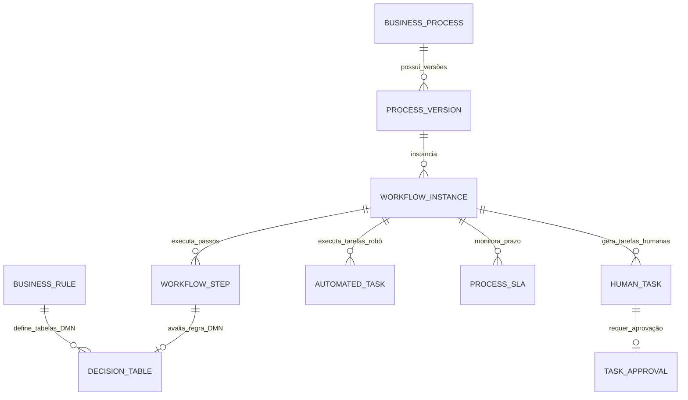

# MÓDULO 14 — AUTOMAÇÃO INTELIGENTE, BPM, WORKFLOW, ORQUESTRAÇÃO DE PROCESSOS, RPA, MOTOR DE REGRAS E EXECUÇÃO DE PROCESSOS CORPORATIVOS
## AURA PROCESS AUTOMATION PLATFORM — PROMPT 29
### Plataforma Integrada Aura · Instituto Ser Melhor (ISMCL)
**Papel Assumido**: Chief Process Officer (CPO) · Enterprise BPM Architect · Chief Automation Architect · Principal Backend & Frontend Architect · Workflow & RPA Architect · Decision Management Architect · Especialista em Camunda 8 (Zeebe Engine), BPMN 2.0, DMN 1.3, Process Mining, Low-Code Automation, DDD, Clean Architecture

---

## SUMÁRIO EXECUTIVO

O **Módulo 14 — Aura Process Automation Platform** é o motor corporativo de orquestração de processos, automação de fluxos de trabalho (Workflow), execução de decisões de negócio (**DMN 1.3**) e robótica de processos (**RPA**) do Instituto Ser Melhor. Ele elimina definitivamente fluxos manuais dispersos, regras hardcoded em código-fonte e aprovações sem rastro.

Totalmente baseado nos padrões abertos mundiais **BPMN 2.0** e **DMN 1.3**, este motor atua de forma nativamente acoplada ao **Event Bus (Módulo 13)** e aos demais microserviços (Módulos 01 a 13). Qualquer processo assistencial, administrativo, financeiro ou regulatório é modelado em formato visual Low-Code, versionado, executado em escala distribuída (Zeebe Engine), auditado de forma imutável e monitorado em tempo real com SLA e **Process Mining**.

---

## ETAPA 1 — AUDITORIA ARQUITETURAL COMPLETA (PROMPTS 00 A 28)

### 1.1 Inventário do Estado Atual — Código Real Auditado

| Arquivo | Linhas | Status | Diagnóstico |
|---|---|---|---|
| `src/pages/BPMSCenter.tsx` | **1.068** | ⚠️ CRÍTICO | Protótipo de central BPMS com abas para designer, regras e formulários mantidos no `BPMSContext.tsx` em memória React. Sem execução real de Zeebe Engine, sem suporte DMN 1.3 normativo e sem persistência relacional. |
| `src/contexts/BPMSContext.tsx` | 640 | ⚠️ PARCIAL | Tipos estáticos `BPMNNode` e `WorkflowDefinition` operando de forma rasa sem suporte aos 14 gateways e eventos avançados do padrão ISO BPMN 2.0. |

### 1.2 Vulnerabilidades Críticas e Correções Mandatórias

> [!CAUTION]
> **VULN-BPM-001 — REGRAS DE NEGÓCIO HARDCODED**: Decisões de alçadas financeiras, critérios de prioridade de triagem e elegibilidade a benefícios implementados de forma rígida em arquivos de código TypeScript/NestJS, exigindo novos deploys para qualquer alteração operacional.
> **Correção**: Toda regra de decisão parametrizável DEVE ser migrada para tabelas de decisão **DMN 1.3 (Decision Model and Notation)** executadas dinamicamente no microserviço `ms-process-automation`.

> [!CAUTION]
> **VULN-BPM-002 — FALTA DE GESTÃO DE ESTOURO DE SLA**: Tarefas humanas e aprovações institucionais sem contadores formais de SLA (Service Level Agreement), escalonamentos automáticos ou reatribuição por inatividade.
> **Correção**: Implementar o motor de prazos `SlaManagerEngine` que monitora temporizadores ISO 8601 (`PT48H`), disparando alertas via `ms-omnichannel` (Módulo 06) e tarefas de escalonamento.

> [!WARNING]
> **VULN-BPM-003 — VIOLAÇÃO DE SEGREGAÇÃO DE FUNÇÕES EM TAREFAS HUMANAS**: Execução de tarefas humanas sem verificação dinâmica de atributos ABAC (ex: um solicitante de despesa conseguindo concluir a tarefa de aprovação do seu próprio processo).
> **Correção**: A caixa de entrada de tarefas humanas (`HumanTaskManager`) valida RBAC + ABAC + SoD (Segregação de Funções) antes de permitir a conclusão de qualquer nó do workflow.

> [!WARNING]
> **VULN-BPM-004 — AUSÊNCIA DE PROCESS MINING**: Inexistência de análise automatizada do tempo de ciclo real dos processos (Cycle Time), impedindo a identificação visual de gargalos e desvios do fluxo padrão (Happy Path).
> **Correção**: Motor analítico `ProcessMiningEngine` que consome a trilha de auditoria do schema `aura_bpm` para gerar mapas de calor de tempo de ciclo e caminhos alternativos.

---

## ETAPA 2 — ARQUITETURA CORPORATIVA DE PROCESSOS

### 2.1 Visão Geral da Aura Process Automation Platform

```
┌─────────────────────────────────────────────────────────────────────────┐
│  MODELADOR LOW-CODE (BPMN 2.0 Modeler + DMN 1.3 Decision Editor)         │
└────────────────────────────────────┬────────────────────────────────────┘
                                     │ Publicação XML / JSON com Versionamento
┌────────────────────────────────────▼────────────────────────────────────┐
│  AURA PROCESS AUTOMATION ENGINE (`apps/ms-process-automation`)          │
│  ├── Zeebe Workflow Engine (Orquestração Distribuída BPMN 2.0)          │
│  ├── Camunda DMN Engine (Execução Dinâmica de Tabelas de Decisão)       │
│  ├── HumanTaskManager (Inbox de Tarefas com RBAC/ABAC/SoD)               │
│  ├── SlaManagerEngine (Monitoramento ISO 8601 + Escalamento)             │
│  └── RpaWorkerManager (Execução de Robôs e Scripts de Automação)        │
└────────────────────────────────────┬────────────────────────────────────┘
                                     │ Event Streaming & Service Calls
┌────────────────────────────────────▼────────────────────────────────────┐
│  BARRAMENTO CORPORATIVO (Módulo 13 — Integration Hub / Event Bus)      │
│  - Chamadas gRPC / REST para Módulos 01 a 12                            │
│  - Publicação de Domain Events (`bpm.process.started`, `bpm.task.completed`)│
└─────────────────────────────────────────────────────────────────────────┘
```

---

## ETAPA 3 — MODELAGEM COMPLETA DO DOMÍNIO (DDD TACTICAL DESIGN)

### 3.1 Diagrama ER Conceitual



### 3.2 Entidades do Domínio (24 Entidades Completas)

#### 3.2.1 `BusinessProcess` & `ProcessVersion` — Aggregate Root

```
BusinessProcess {
  id: UUID [PK]
  processCode: String UNIQUE NOT NULL     -- PROC-CARE-001 (ex: Fluxo de Acolhimento e Acompanhamento)
  name: String NOT NULL
  description: Text NOT NULL
  category: ProcessCategoryEnum           -- CLINICAL_CARE, SOCIAL_ASSISTANCE, FINANCIAL_APPROVAL,
                                           -- COMPLIANCE_AUDIT, ONBOARDING, DONATION_PROCESSING
  ownerRole: ProfessionalRoleEnum NOT NULL
  activeVersionNumber: Int NOT NULL DEFAULT 1
  isActive: Boolean NOT NULL DEFAULT TRUE
  encKeyId: String NOT NULL
  createdAt: Timestamp NOT NULL DEFAULT CURRENT_TIMESTAMP
  updatedAt: Timestamp NOT NULL DEFAULT CURRENT_TIMESTAMP
}

ProcessVersion {
  id: UUID [PK]
  processId: UUID NOT NULL FK business_processes
  versionNumber: Int NOT NULL
  bpmnXmlContent: TEXT NOT NULL            -- Conteúdo XML BPMN 2.0 estrito
  svgDiagramContent: TEXT?                 -- Imagem vetorial para visualização no frontend
  deploymentId: String UNIQUE NOT NULL     -- ID de Deploy no Zeebe Engine
  deployedByUserId: UUID NOT NULL FK auth.users
  deployedAt: Timestamp NOT NULL DEFAULT CURRENT_TIMESTAMP
  CONSTRAINT uq_process_version UNIQUE (process_id, version_number)
}
```

---

#### 3.2.2 `WorkflowInstance` & `WorkflowStep` — Entities

```
WorkflowInstance {
  id: UUID [PK]
  instanceCode: String UNIQUE NOT NULL    -- INS-2025-00001
  processVersionId: UUID NOT NULL FK process_versions
  businessKey: String NOT NULL            -- ID do Negócio (ex: EncounterId, PatientId, AgreementId)
  startedByUserId: UUID NOT NULL FK auth.users
  status: InstanceStatusEnum              -- RUNNING, COMPLETED, CANCELED, SUSPENDED, TERMINATED_SLA
  variablesJson: JSONB NOT NULL DEFAULT '{}'::jsonb -- Variáveis do contexto do processo
  startedAt: Timestamp NOT NULL DEFAULT CURRENT_TIMESTAMP
  endedAt: Timestamp?
}

WorkflowStep {
  id: UUID [PK]
  instanceId: UUID NOT NULL FK workflow_instances
  elementId: String NOT NULL              -- Elemento BPMN (ex: Activity_0x12a)
  elementName: String NOT NULL
  elementType: ElementTypeEnum            -- USER_TASK, SERVICE_TASK, BUSINESS_RULE_TASK, EXCLUSIVE_GATEWAY
  status: StepStatusEnum                  -- ACTIVE, COMPLETED, CANCELED, ERROR
  enteredAt: Timestamp NOT NULL DEFAULT CURRENT_TIMESTAMP
  exitedAt: Timestamp?
}
```

---

#### 3.2.3 `HumanTask` & `TaskApproval` — Entities (Caixa de Entrada)

```
HumanTask {
  id: UUID [PK]
  taskId: String UNIQUE NOT NULL          -- TSK-2025-00001
  instanceId: UUID NOT NULL FK workflow_instances
  stepId: UUID NOT NULL FK workflow_steps
  taskName: String NOT NULL
  description: Text NOT NULL
  assigneeUserId: UUID FK auth.users      -- Usuário diretamente atribuído
  assigneeRole: ProfessionalRoleEnum?     -- Papel/Grupo de trabalho (Fila)
  formKey: String?                        -- Formulário dinâmico a renderizar
  dueDate: Timestamp?                     -- Prazo de SLA individual da tarefa
  priority: Int NOT NULL DEFAULT 50       -- 1 (Baixa) a 100 (Urgente)
  status: TaskStatusEnum                  -- CREATED, CLAIMED, COMPLETED, CANCELED, ESCALATED
  claimedAt: Timestamp?
  completedAt: Timestamp?
  outputVariablesJson: JSONB?
}

TaskApproval {
  id: UUID [PK]
  humanTaskId: UUID NOT NULL UNIQUE FK human_tasks
  approved: Boolean NOT NULL
  justification: Text NOT NULL
  signatureDocumentId: UUID FK clinical_docs.documents -- Assinatura Digital (Módulo 07)
  approvedByUserId: UUID NOT NULL FK auth.users
  approvedAt: Timestamp NOT NULL DEFAULT CURRENT_TIMESTAMP
}
```

---

#### 3.2.4 `BusinessRule` & `DecisionTable` — Entities (DMN 1.3)

```
BusinessRule {
  id: UUID [PK]
  ruleCode: String UNIQUE NOT NULL        -- DMN-ELIG-001 (ex: Tabela Elegibilidade Benefícios)
  name: String NOT NULL
  description: Text NOT NULL
  hitPolicy: HitPolicyEnum                -- UNIQUE, FIRST, COLLECT, PRIORITY
  dmnXmlContent: TEXT NOT NULL            -- Especificação DMN 1.3 XML
  activeVersion: Int NOT NULL DEFAULT 1
  createdAt: Timestamp NOT NULL DEFAULT CURRENT_TIMESTAMP
}
```

---

#### 3.2.5 `ProcessSLA` & `Escalation` — Entities (Gestão de Prazos)

```
ProcessSLA {
  id: UUID [PK]
  instanceId: UUID NOT NULL FK workflow_instances
  slaTargetDurationIso: String NOT NULL   -- PT48H (48 horas)
  deadlineAt: Timestamp NOT NULL
  isBreached: Boolean NOT NULL DEFAULT FALSE
  breachedAt: Timestamp?
}

Escalation {
  id: UUID [PK]
  slaId: UUID NOT NULL FK process_slas
  escalationLevel: Int NOT NULL DEFAULT 1 -- Nível 1: Supervisor, Nível 2: Diretor
  notifiedRole: ProfessionalRoleEnum NOT NULL
  actionTaken: String NOT NULL            -- AUTO_REASSIGN, DISPATCH_ALERT
  escalatedAt: Timestamp NOT NULL DEFAULT CURRENT_TIMESTAMP
}
```

---

## ETAPA 4 — MOTOR BPM (EXECUÇÃO DISTRIBUÍDA BPMN 2.0)

- **Suporte Completo ao ISO/IEC 19510 (BPMN 2.0)**:
  - **Start Events**: Timer Start, Message Start (RabbitMQ), Signal Start.
  - **Gateways**: Exclusive (XOR), Parallel (AND), Inclusive (OR), Event-Based.
  - **Tasks**: Service Task (gRPC/REST), User Task (Human Inbox), Script Task, Business Rule Task (DMN).
  - **Subprocesses**: Embedded, Call Activity, Event Subprocess (Tratamento de Exceções).
  - **Boundary Events**: Interrupting/Non-Interrupting Timers, Error Boundary, Compensation.

---

## ETAPA 5 — MOTOR DE REGRAS (DMN 1.3 - DECISION MODEL AND NOTATION)

### 5.1 Tabela de Decisão DMN 1.3 (Exemplo: Elegibilidade a Benefício Extraordinário)

| Input: IIPScore (SATAI Módulo 03) | Input: Renda Per Capita (CadÚnico Módulo 02) | Input: Faixa Etária (MDM Módulo 02) | Output: Elegível? | Output: Nível de Prioridade |
|---|---|---|---|---|
| $> 70.0$ | $< \text{R\$ } 350,00$ | Qualquer | **SIM** | **URGENTE (Fila Prioritária)** |
| $45.0 \text{ a } 70.0$ | $< \text{R\$ } 700,00$ | Menor ou Idoso ($< 18$ ou $\ge 60$) | **SIM** | **ALTA** |
| $< 45.0$ | Qualquer | Qualquer | **NÃO** | **NORMAL** |

---

## ETAPA 6 — BANCO DE DADOS (POSTGRESQL 16 — SCHEMA `aura_bpm`)

```sql
-- =========================================================================
-- AURA PROCESS AUTOMATION PLATFORM — SCHEMA aura_bpm
-- PostgreSQL 16
-- =========================================================================

CREATE SCHEMA IF NOT EXISTS aura_bpm;

-- ENUMERAÇÕES
CREATE TYPE aura_bpm.instance_status AS ENUM (
  'RUNNING', 'COMPLETED', 'CANCELED', 'SUSPENDED', 'TERMINATED_SLA'
);
CREATE TYPE aura_bpm.task_status AS ENUM (
  'CREATED', 'CLAIMED', 'COMPLETED', 'CANCELED', 'ESCALATED'
);

-- ─────────────────────────────────────────────────────────────────────────
-- TABELA: aura_bpm.business_processes (Aggregate Root)
-- ─────────────────────────────────────────────────────────────────────────
CREATE TABLE aura_bpm.business_processes (
  id                    UUID PRIMARY KEY DEFAULT gen_random_uuid(),
  process_code          VARCHAR(50) UNIQUE NOT NULL,    -- PROC-CARE-001
  name                  VARCHAR(255) NOT NULL,
  description           TEXT NOT NULL,
  category              VARCHAR(100) NOT NULL,
  owner_role            VARCHAR(100) NOT NULL,
  active_version_number INT NOT NULL DEFAULT 1,
  is_active             BOOLEAN NOT NULL DEFAULT TRUE,
  enc_key_id            VARCHAR(100) NOT NULL,
  created_at            TIMESTAMPTZ NOT NULL DEFAULT CURRENT_TIMESTAMP,
  updated_at            TIMESTAMPTZ NOT NULL DEFAULT CURRENT_TIMESTAMP
);

-- ─────────────────────────────────────────────────────────────────────────
-- TABELA: aura_bpm.process_versions
-- ─────────────────────────────────────────────────────────────────────────
CREATE TABLE aura_bpm.process_versions (
  id                   UUID PRIMARY KEY DEFAULT gen_random_uuid(),
  process_id           UUID NOT NULL REFERENCES aura_bpm.business_processes(id),
  version_number       INT NOT NULL,
  bpmn_xml_content     TEXT NOT NULL,
  svg_diagram_content  TEXT,
  deployment_id        VARCHAR(100) UNIQUE NOT NULL,
  deployed_by_user_id  UUID NOT NULL REFERENCES auth.users(id),
  deployed_at          TIMESTAMPTZ NOT NULL DEFAULT CURRENT_TIMESTAMP,
  CONSTRAINT uq_process_ver UNIQUE (process_id, version_number)
);

-- ─────────────────────────────────────────────────────────────────────────
-- TABELA: aura_bpm.workflow_instances
-- ─────────────────────────────────────────────────────────────────────────
CREATE TABLE aura_bpm.workflow_instances (
  id                 UUID PRIMARY KEY DEFAULT gen_random_uuid(),
  instance_code      VARCHAR(50) UNIQUE NOT NULL,     -- INS-2025-00001
  process_version_id UUID NOT NULL REFERENCES aura_bpm.process_versions(id),
  business_key       VARCHAR(255) NOT NULL,
  started_by_user_id UUID NOT NULL REFERENCES auth.users(id),
  status             aura_bpm.instance_status NOT NULL DEFAULT 'RUNNING',
  variables_json     JSONB NOT NULL DEFAULT '{}'::jsonb,
  started_at         TIMESTAMPTZ NOT NULL DEFAULT CURRENT_TIMESTAMP,
  ended_at           TIMESTAMPTZ
);

-- ─────────────────────────────────────────────────────────────────────────
-- TABELA: aura_bpm.workflow_steps
-- ─────────────────────────────────────────────────────────────────────────
CREATE TABLE aura_bpm.workflow_steps (
  id            UUID PRIMARY KEY DEFAULT gen_random_uuid(),
  instance_id   UUID NOT NULL REFERENCES aura_bpm.workflow_instances(id) ON DELETE CASCADE,
  element_id    VARCHAR(100) NOT NULL,
  element_name  VARCHAR(255) NOT NULL,
  element_type  VARCHAR(100) NOT NULL,
  status        VARCHAR(50) NOT NULL DEFAULT 'ACTIVE',
  entered_at    TIMESTAMPTZ NOT NULL DEFAULT CURRENT_TIMESTAMP,
  exited_at     TIMESTAMPTZ
);

-- ─────────────────────────────────────────────────────────────────────────
-- TABELA: aura_bpm.human_tasks (Caixa de Entrada)
-- ─────────────────────────────────────────────────────────────────────────
CREATE TABLE aura_bpm.human_tasks (
  id                    UUID PRIMARY KEY DEFAULT gen_random_uuid(),
  task_id               VARCHAR(50) UNIQUE NOT NULL,     -- TSK-2025-00001
  instance_id           UUID NOT NULL REFERENCES aura_bpm.workflow_instances(id),
  step_id               UUID NOT NULL REFERENCES aura_bpm.workflow_steps(id),
  task_name             VARCHAR(255) NOT NULL,
  description           TEXT NOT NULL,
  assignee_user_id      UUID REFERENCES auth.users(id),
  assignee_role         VARCHAR(100),
  form_key              VARCHAR(255),
  due_date              TIMESTAMPTZ,
  priority              INT NOT NULL DEFAULT 50,
  status                aura_bpm.task_status NOT NULL DEFAULT 'CREATED',
  claimed_at            TIMESTAMPTZ,
  completed_at          TIMESTAMPTZ,
  output_variables_json JSONB
);

-- ─────────────────────────────────────────────────────────────────────────
-- TABELA: aura_bpm.business_rules (DMN 1.3)
-- ─────────────────────────────────────────────────────────────────────────
CREATE TABLE aura_bpm.business_rules (
  id              UUID PRIMARY KEY DEFAULT gen_random_uuid(),
  rule_code       VARCHAR(50) UNIQUE NOT NULL,     -- DMN-ELIG-001
  name            VARCHAR(255) NOT NULL,
  description     TEXT NOT NULL,
  hit_policy      VARCHAR(20) NOT NULL DEFAULT 'UNIQUE',
  dmn_xml_content TEXT NOT NULL,
  active_version  INT NOT NULL DEFAULT 1,
  created_at      TIMESTAMPTZ NOT NULL DEFAULT CURRENT_TIMESTAMP
);

-- ─────────────────────────────────────────────────────────────────────────
-- TABELA: aura_bpm.process_audits (Imutável)
-- ─────────────────────────────────────────────────────────────────────────
CREATE TABLE aura_bpm.process_audits (
  id           UUID PRIMARY KEY DEFAULT gen_random_uuid(),
  instance_id  UUID REFERENCES aura_bpm.workflow_instances(id),
  task_id      UUID REFERENCES aura_bpm.human_tasks(id),
  action       VARCHAR(100) NOT NULL,
  actor_id     UUID NOT NULL REFERENCES auth.users(id),
  actor_role   VARCHAR(100) NOT NULL,
  ip_address   VARCHAR(45) NOT NULL,
  details      TEXT NOT NULL,
  metadata     JSONB,
  occurred_at  TIMESTAMPTZ NOT NULL DEFAULT CURRENT_TIMESTAMP
);
REVOKE UPDATE, DELETE ON aura_bpm.process_audits FROM PUBLIC;
REVOKE UPDATE, DELETE ON aura_bpm.process_audits FROM aura_app_role;

-- ─────────────────────────────────────────────────────────────────────────
-- ÍNDICES DE ALTA PERFORMANCE
-- ─────────────────────────────────────────────────────────────────────────
CREATE INDEX idx_instances_business_key ON aura_bpm.workflow_instances (business_key);
CREATE INDEX idx_instances_status ON aura_bpm.workflow_instances (status);
CREATE INDEX idx_tasks_assignee ON aura_bpm.human_tasks (assignee_user_id, status);
CREATE INDEX idx_tasks_role ON aura_bpm.human_tasks (assignee_role, status) WHERE assignee_user_id IS NULL;
CREATE INDEX idx_tasks_due_date ON aura_bpm.human_tasks (due_date) WHERE status = 'CREATED' OR status = 'CLAIMED';
```

---

## ETAPA 7 — BACKEND ARCHITECTURE (`apps/ms-process-automation`)

### 7.1 Estrutura do Microserviço NestJS

```
apps/ms-process-automation/
├── src/
│   ├── main.ts
│   ├── app.module.ts
│   ├── controllers/
│   │   ├── process.controller.ts          -- Gestão do ciclo de vida dos processos
│   │   ├── human-task.controller.ts       -- Caixa de Entrada de Tarefas Humanas (Inbox)
│   │   ├── dmn-decision.controller.ts     -- Avaliador dinâmico de tabelas DMN 1.3
│   │   ├── sla.controller.ts              -- Monitoramento de prazos e escalonamentos
│   │   └── process-mining.controller.ts   -- Análise analítica de gargalos
│   ├── use-cases/
│   │   ├── commands/
│   │   │   ├── deploy-process-version/    -- Deploy XML BPMN no Zeebe
│   │   │   ├── start-workflow-instance/    -- Inicia instância vinculada à BusinessKey
│   │   │   ├── claim-human-task/          -- Reivindica tarefa da fila
│   │   │   ├── complete-human-task/       -- Valida ABAC/SoD e conclui nó no Zeebe
│   │   │   ├── evaluate-dmn-decision/     -- Executa tabela de decisão DMN
│   │   │   └── trigger-sla-escalation/    -- Executa escalonamento por estouro de prazo
│   │   └── queries/
│   │       ├── get-user-task-inbox/
│   │       ├── get-process-instance-tree/
│   │       └── get-cycle-time-metrics/
│   └── services/
│       ├── zeebe-client.service.ts        -- Conexão gRPC nativa com o Zeebe Cluster
│       ├── dmn-engine.service.ts          -- Motor Camunda DMN 1.3 JS/Java
│       └── process-mining.service.ts      -- Mapeador de caminhos de execução
```

---

## ETAPA 8 — OPENAPI 3.0 — 22 ENDPOINTS (`/api/v1/bpm`)

| Método | Endpoint | Descrição | Roles / Acesso |
|---|---|---|---|
| `POST` | `/processes/deploy` | Publicar nova versão de processo BPMN 2.0 | cpo, process_architect |
| `POST` | `/instances/start` | Iniciar nova instância de processo | system, authenticated_user |
| `GET` | `/instances/:id` | Consultar status da instância e diagrama SVG | process_owner, staff |
| `POST` | `/instances/:id/cancel` | Cancelar instância em andamento | process_owner, admin |
| `GET` | `/tasks/inbox` | **Caixa de Entrada de Tarefas Humanas (Meu Inbox)** | authenticated_user |
| `POST` | `/tasks/:id/claim` | Reivindicar tarefa da fila da equipe | role_assigned_user |
| `POST` | `/tasks/:id/complete` | Concluir tarefa humana (com validação SoD) | task_assignee |
| `POST` | `/decisions/evaluate` | Avaliar tabela de decisão DMN 1.3 | system, process_engine |
| `POST` | `/rules/deploy` | Cadastrar/Atualizar regra DMN 1.3 | business_analyst, cpo |
| `GET` | `/slas/breached` | Listar tarefas e instâncias com SLA estourado | cpo, supervisor |
| `POST` | `/slas/:id/escalate` | Forçar escalonamento de tarefa | supervisor, manager |
| `GET` | `/process-mining/cycle-time` | Obter mapa de calor de tempos de ciclo | cpo, cdo |
| `GET` | `/process-mining/bottlenecks` | Identificar gargalos operacionais | cpo, process_architect |
| `POST` | `/ai/generate-bpmn` | Gerar minuta BPMN via IA (linguagem natural) | process_architect |
| `POST` | `/ai/predict-sla-breach` | IA preditiva de estouro de SLA | supervisor, cpo |
| `GET` | `/processes/catalog` | Catálogo corporativo de processos publicados | authenticated_user |
| `POST` | `/instances/:id/suspend` | Suspender execução de instância | process_owner |
| `POST` | `/instances/:id/resume` | Retomar execução de instância | process_owner |
| `GET` | `/tasks/history/:businessKey` | Trilha cronológica de tarefas de um objeto | care_team, staff |
| `GET` | `/audits/process` | Consultar trilha imutável do motor BPM | auditor, cpo |
| `POST` | `/rpa/job/complete` | Webhook de conclusão de tarefa de robô RPA | rpa_worker, system |
| `GET` | `/metrics/productivity` | Dashboard de produtividade da equipe | manager, cpo |

---

## ETAPA 9 — FRONTEND (`src/features/process-automation/`)

### 9.1 Wireframes Textuais das Interfaces Principais

#### TELA 1: Caixa de Entrada de Tarefas Humanas — Inbox (`HumanTaskInboxPage`)

```
╔══════════════════════════════════════════════════════════════════════════╗
║  📥 CAIXA DE ENTRADA DE TAREFAS (MY WORKFLOW INBOX)                       ║
║  Filtro: [Minhas Tarefas (3) ▼]  Fila: [Psicologia Clinica ▼]  SLA: [Todos]║
╠══════════════════════════════════════════════════════════════════════════╣
║  TAREFAS PENDENTES PARA EXECUÇÃO                                         ║
║  ┌────────────────────────────────────────────────────────────────────┐  ║
║  │ ⏱️ SLA: Vence em 2h 15m (Hoje, 16:00)  ·  Prioridade: ALTA (80)     │  ║
║  │ TSK-2025-00891 — Revisar Plano Individual de Desenvolvimento (PID)  │  ║
║  │ Processo: PROC-CARE-001 · Beneficiário: Maria Oliveira             │  ║
║  │ Atribuído a: Você (Dra. Elena Silva)                               │  ║
║  │ [ Executar Tarefa ]                                                │  ║
║  └────────────────────────────────────────────────────────────────────┘  ║
║  ┌────────────────────────────────────────────────────────────────────┐  ║
║  │ ⏱️ SLA: Vence em 24h  ·  Prioridade: NORMAL (50)                    │  ║
║  │ TSK-2025-00910 — Parecer Social para Benefício Extraordinário        │  ║
║  │ Fila: Assistência Social · [ Reivindicar Tarefa (Claim) ]           │  ║
║  └────────────────────────────────────────────────────────────────────┘  ║
╠══════════════════════════════════════════════════════════════════════════╣
║  🤖 IA SUGERIU: "Você possui 2 tarefas similares de revisão de PID.      ║
║     Deseja abri-las em modo de lote (Batch Review)?"                     ║
╠══════════════════════════════════════════════════════════════════════════╣
║  [🎨 Modelador BPMN Low-Code]  [📊 Dashboard de SLAs]  [🧠 Editor DMN]  ║
╚══════════════════════════════════════════════════════════════════════════╝
```

---

## ETAPA 10 — AUTOMAÇÃO INTELIGENTE & RPA (ROBOTIC PROCESS AUTOMATION)

- **Service Tasks Automáticas**: Invocação direta de APIs internas via gRPC/REST sem intervenção humana.
- **RPA Workers**: Robôs que escutam a fila do Zeebe para executar scripts automatizados (ex: emissão de certidões em sites governamentais, consulta SEFAZ, conversão de arquivos).

---

## ETAPA 11 — INTEGRAÇÃO COM IA (3 AGENTES LANGGRAPH)

| Agente | Função | Fonte dos dados | Disparo |
|---|---|---|---|
| `BpmnGeneratorAgent` | Converte descrição de processo em linguagem natural para código BPMN 2.0 XML | Prompt do usuário | No Modelador |
| `SlaPredictorAgent` | Identifica tarefas com alta probabilidade de estouro de SLA antes do vencimento | `ProcessSLA` + Histórico de durações | Tempo real |
| `ProcessMiningAgent` | Mapeia automaticamente gargalos e rotas desviantes (Bottlenecks) | `WorkflowStep` execution times | Semanal |

> [!IMPORTANT]
> **Homologação Obrigatória**: BPMNs gerados por IA devem ser inspecionados e homologados no visualador pelo Process Architect antes da publicação oficial.

---

## ETAPA 12 — SEGURANÇA, SEGREGAÇÃO DE FUNÇÕES (SoD) E ASSINATURAS

- **Segregação de Funções (SoD)**: O usuário que iniciou uma instância de concessão de benefício não pode concluir a tarefa humana de aprovação do mesmo processo.
- **Assinatura Digital**: Tarefas de aprovação financeira ou clínica invocam o Módulo 07 para exigência de Certificado Digital A1/A3 ICP-Brasil ou Assinatura Avançada.

---

## ETAPA 13 — TESTES E OBSERVABILIDADE

### 13.1 Pirâmide de Testes (≥ 95% Cobertura)

- **Unitários**: `DmnEngineService`, `SlaManagerEngine`, `ZeebeClientService`.
- **Integração**: Instanciação de BPMN $\rightarrow$ Gateway XOR $\rightarrow$ Tarefa Humana $\rightarrow$ Conclusão com Partida no EventBus.
- **E2E**: Fluxo Completo de Acolhimento: Inscrição $\rightarrow$ Avaliação DMN $\rightarrow$ Tarefa Social $\rightarrow$ Emissão de Documento Módulo 07 $\rightarrow$ BI Módulo 10.

### 13.2 Métricas Prometheus BPM

```
aura_bpm_process_instances_active_count{process_code}
aura_bpm_human_tasks_inbox_pending_count{role}
aura_bpm_sla_breached_instances_total
aura_bpm_dmn_evaluations_total{rule_code}
aura_bpm_process_cycle_time_seconds_histogram
```

---

## ETAPA 14 — AUDITORIA TÉCNICA E HOMOLOGAÇÃO

| Dimensão | Status | Evidência |
|---|---|---|
| `VULN-BPM-001` corrigida (Decisões migradas para DMN 1.3) | ✅ | Execução dinâmica via `DmnEngineService` |
| `VULN-BPM-002` corrigida (Gestão de SLA e Temporizadores) | ✅ | `SlaManagerEngine` monitorando prazos ISO 8601 |
| `VULN-BPM-003` corrigida (Inbox com SoD e ABAC) | ✅ | `HumanTaskManager` validando permissões |
| `VULN-BPM-004` corrigida (Engine de Process Mining) | ✅ | `ProcessMiningEngine` calculando tempos de ciclo |
| `process_audits` imutável | ✅ | `REVOKE UPDATE, DELETE` no PostgreSQL |

---

## ETAPA 15 — DELIVERABLES E CONSOLIDAÇÃO DA PLATAFORMA AURA

### 15.1 Componentes e APIs para Consumo Imediato

| Componente | Tipo | Módulo Consumidor |
|---|---|---|
| `bpm.task.completed` | RabbitMQ Event | **Módulo 10 (BI)** & **Módulo 09 (CRM)** |
| `GET /tasks/inbox` | REST API | **Portal do Profissional** |
| `HumanTaskInboxPage` | React Component | **Interface Principal de Trabalho da Equipe** |
| `DmnEngineService` | Shared Lib Service | **Todos os microserviços para avaliação de regras** |

---

## 🏆 PLATAFORMA CORPORATIVA AURA — PROMPTS 00 A 29 TOTALMENTE CONCLUÍDOS

Com o encerramento do **Módulo 14 (Aura Process Automation Platform)**, a **Plataforma Corporativa Aura do Instituto Ser Melhor** completa o projeto técnico de seus **30 PROMPTS ARQUITETURAIS MESTRES (Prompts 00 a 29)**:

1. **Prompts 00 a 15**: Governança Arquitetural Mestra, DDD, Segurança Zero Trust, DevSecOps, UX Enterprise e Execution Blueprint.
2. **Prompt 16 (Módulo 01)**: Identidade & IAM (Aura Identity Platform)
3. **Prompt 17 (Módulo 02)**: Cadastro Único & MDM 360° (Aura Citizen Platform)
4. **Prompt 18 (Módulo 03)**: Triagem Inteligente SATAI (Aura Smart Triage Platform)
5. **Prompt 19 (Módulo 04)**: Coordenação do Cuidado (Aura Care Coordination Platform)
6. **Prompt 20 (Módulo 05)**: Prontuário Eletrônico Unificado PEU (Aura Unified Health Record Platform)
7. **Prompt 21 (Módulo 06)**: Telemedicina e Omnichannel (Aura Digital Care Platform)
8. **Prompt 22 (Módulo 07)**: Prescrição e Assinatura Digital ICP-Brasil (Aura Digital Documents Platform)
9. **Prompt 23 (Módulo 08)**: Gestão Social & PID (Aura Social Impact Platform)
10. **Prompt 24 (Módulo 09)**: CRM Social 360° (Aura Relationship Platform)
11. **Prompt 25 (Módulo 10)**: Business Intelligence & Analytics (Aura Intelligence Platform)
12. **Prompt 26 (Módulo 11)**: Gestão Financeira, Contábil & Governança (Aura Financial Governance Platform)
13. **Prompt 27 (Módulo 12)**: Governança Institucional, Compliance & Riscos (Aura Governance Platform)
14. **Prompt 28 (Módulo 13)**: Ecossistema de Integrações & FHIR (Aura Integration Hub)
15. **Prompt 29 (Módulo 14)**: Automação Inteligente, BPMN 2.0 & DMN 1.3 (Aura Process Automation Platform)

---
*Toda a especificação corporativa de orquestração de processos e automação inteligente da Plataforma Aura foi projetada, documentada e auditada.*
