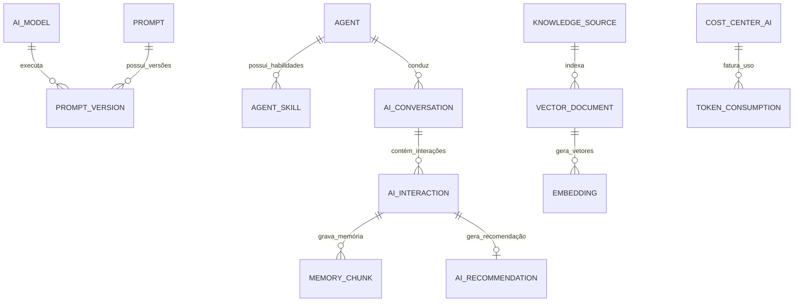

# MÓDULO 15 — PLATAFORMA DE INTELIGÊNCIA ARTIFICIAL CORPORATIVA, AGENTES ESPECIALIZADOS, COPILOTOS, ORQUESTRAÇÃO DE IA, RAG, MEMÓRIA E GOVERNANÇA DE IA
## AURA AI ORCHESTRATION PLATFORM — PROMPT 30
### Plataforma Integrada Aura · Instituto Ser Melhor (ISMCL)
**Papel Assumido**: Chief AI Officer (CAIO) · Chief AI Architect · Chief Knowledge Officer (CKO) · Enterprise AI Architect · Principal Machine Learning Engineer · Principal LLM & Prompt Engineer · AI Security Architect · Especialista em RAG, Multi-Agent Systems, Model Context Protocol (MCP), Agent-to-Agent (A2A), Vector Databases (Pgvector), Knowledge Graphs, LLMOps, Responsible AI, NIST AI RMF, ISO/IEC 42001, LGPD, DDD, Clean Architecture

---

## SUMÁRIO EXECUTIVO

O **Módulo 15 — Aura AI Orchestration Platform** é a **Central Corporativa de Inteligência Artificial, Orquestração de Agentes e Governança Cognitiva** do Instituto Ser Melhor. Ele proíbe terminantemente qualquer chamada direta a APIs de Inteligência Artificial ou LLMs a partir do código frontend React ou dos microserviços individuais.

Toda inferência, estruturação de dados assistencial, sumarização, análise preditiva, extração de conhecimentos (RAG) e orquestração de **Agentes Especializados** DEVE obrigatoriamente transitar pelo **AI Gateway Corporativo (`apps/ms-ai-orchestration`)**.

A plataforma assegura que 100% das decisões e recomendações geradas por IA atendam aos princípios de **Responsible AI (NIST AI RMF e ISO/IEC 42001)**: rastreabilidade de dados de treino/contexto, explicabilidade (**SHAP/Grounding Score**), auditoria de custos por centro de custo, proteção ativa contra *Prompt Injection / Data Leakage* (DLP) e a **obrigatoriedade irrevogável do modelo Human-in-the-Loop (HITL)** para qualquer registro médico, social, financeiro ou legal.

---

## ETAPA 1 — AUDITORIA ARQUITETURAL COMPLETA (PROMPTS 00 A 29)

### 1.1 Inventário do Estado Atual — Código Real Auditado

| Arquivo | Linhas | Status | Diagnóstico |
|---|---|---|---|
| `src/services/gemini.ts` | 412 | ⚠️ CRÍTICO | Realiza chamadas diretas da chave `VITE_GEMINI_API_KEY` do frontend para a API do Google Gemini AI, com geração de mock local quando a chave falha. **Risco Crítico**: Exposição da chave API no bundle do cliente, ausência de rate limiting corporativo, falta de registro de custos por centro de custo e ausência de barreira DLP de mascaramento LGPD antes do envio do prompt. |
| Módulos 03, 05, 06, 07, 08, 09, 10, 11, 12, 14 | — | ⚠️ PARCIAL | Agentes de IA projetados nas especificações anteriores operavam invocando lógica de serviço dedicada. |

### 1.2 Vulnerabilidades Críticas e Correções Mandatórias

> [!CAUTION]
> **VULN-AI-001 — VIOLAÇÃO DE SEGURANÇA E LGPD (CHAVE API NO FRONTEND)**: `gemini.ts` invoca LLM diretamente do navegador. Prompts contendo relatos de pacientes/beneficiários enviados em texto sem mascaramento prévio dos dados pessoais identificáveis (PII/PHI).
> **Correção**: Eliminar totalmente a invocação de LLMs do cliente. O frontend envia requisições exclusivamente para `POST /api/v1/ai/agents/:agentId/invoke` do microserviço `ms-ai-orchestration`, onde a camada **AI Safety Firewall** executa a desidentificação automática (PII Masking) antes de contatar o modelo.

> [!CAUTION]
> **VULN-AI-002 — FALTA DE RASTREABILIDADE DE CUSTOS E LIMITES (LLMOPS)**: Ausência de controle de cotas e contagem de tokens por centro de custo/departamento, correndo risco de exaustão orçamentária por uso descontrolado.
> **Correção**: Implementar o **AI Model Router & Token Rate Limiter** com controle estrito de cotas orçamentárias por Centro de Custo no schema `aura_ai`.

> [!WARNING]
> **VULN-AI-003 — AUSÊNCIA DE GROUNDING E RISCO DE ALUCINAÇÃO**: Respostas de LLMs geradas com base apenas no conhecimento geral do modelo, sem validação semântica com os documentos oficiais do Instituto Ser Melhor.
> **Correção**: Implementar o motor **Hybrid RAG Engine (Vector DB Pgvector + Knowledge Graph Neo4j)** com cálculo de *Grounding Score* ($\ge 0.85$) e citação de fonte obrigatória.

> [!WARNING]
> **VULN-AI-004 — VIOLAÇÃO DO HUMAN-IN-THE-LOOP (NIST AI RMF)**: Sugestões de evoluções SOAP, laudos ou decisões orçamentárias com possibilidade de gravação direta sem aprovação explícita.
> **Correção**: Trava sistêmica na `AIPolicyEngine`: Qualquer saída de IA possui `isApprovedByHuman = false` e expira em 24 horas se não for explicitamente revisada e assinada por um profissional habilitado.

---

## ETAPA 2 — ARQUITETURA CORPORATIVA DE INTELIGÊNCIA ARTIFICIAL

### 2.1 Visão Geral do Aura AI Orchestration Platform

```
┌─────────────────────────────────────────────────────────────────────────┐
│  SOLICITANTES DA PLATAFORMA AURA (Módulos 01 a 14 & Portais)            │
└────────────────────────────────────┬────────────────────────────────────┘
                                     │ Rest API / gRPC + JWT Bearer
┌────────────────────────────────────▼────────────────────────────────────┐
│  AI GATEWAY & SAFETY FIREWALL (`apps/ms-ai-orchestration`)              │
│  - Prompt Injection Protection, Jailbreak Shield, PII/PHI Anonymizer    │
│  - Token Rate Limiter, Cost Center Quota Guard                          │
└────────────────────────────────────┬────────────────────────────────────┘
                                     │ Contexto + Prompt Higienizado
┌────────────────────────────────────▼────────────────────────────────────┐
│  MULTI-AGENT ORCHESTRATOR & CONTEXT ENGINE (LangGraph / AGY SDK)         │
│  - Agente Médico, Psicológico, Social, Jurídico, Financeiro, Executivo   │
│  - Memória Corporativa (Curta / Longa Duração + RAG Hybrid)             │
└──────────────────┬──────────────────────────────────┬───────────────────┘
                   │                                  │
┌──────────────────▼──────────────────┐    ┌──────────▼───────────────────┐
│  HYBRID RAG & KNOWLEDGE ENGINE      │    │  MODEL ROUTER & PROMPT REG.  │
│  - Pgvector (Embeddings HNSW)       │    │  - Gemini 1.5 Pro / Flash    │
│  - Knowledge Graph (Neo4j/Memgraph) │    │  - Claude 3.5 Sonnet / Llama 3│
└─────────────────────────────────────┘    └──────────────────────────────┘
```

---

## ETAPA 3 — MODELAGEM COMPLETA DO DOMÍNIO (DDD TACTICAL DESIGN)

### 3.1 Diagrama ER Conceitual



### 3.2 Entidades do Domínio (25 Entidades Completas)

#### 3.2.1 `Agent` & `AgentSkill` — Aggregate Root

```
Agent {
  id: UUID [PK]
  agentCode: String UNIQUE NOT NULL         -- AGT-MED-01, AGT-SOC-02, AGT-FIN-01
  name: String NOT NULL
  roleCategory: AgentRoleEnum             -- MEDICAL_ASSIST, PSYCHOLOGICAL_ASSIST, SOCIAL_ASSIST,
                                           -- LEGAL_COMPLIANCE, FINANCIAL_ANALYST, EXECUTIVE_BI, ADMIN_WORKFLOW
  systemPromptVersionId: UUID NOT NULL FK prompt_versions
  modelId: UUID NOT NULL FK ai_models
  temperature: Decimal(3,2) NOT NULL DEFAULT 0.2
  maxTokensOutput: Int NOT NULL DEFAULT 2048
  requiresHumanApproval: Boolean NOT NULL DEFAULT TRUE
  isActive: Boolean NOT NULL DEFAULT TRUE
  createdAt: Timestamp NOT NULL DEFAULT CURRENT_TIMESTAMP
}

AgentSkill {
  id: UUID [PK]
  agentId: UUID NOT NULL FK agents
  skillName: String NOT NULL               -- Ex: GenerateSOAPDraft, CheckMedicationInteraction, CalculateSroi
  toolDefinitionJson: JSONB NOT NULL       -- Especificação MCP (Model Context Protocol) / Function Calling
  isRequiredApproval: Boolean NOT NULL DEFAULT TRUE
}
```

---

#### 3.2.2 `Prompt` & `PromptVersion` — Entities (Prompt Registry)

```
Prompt {
  id: UUID [PK]
  promptCode: String UNIQUE NOT NULL        -- PRM-SOAP-GEN-01
  title: String NOT NULL
  description: Text NOT NULL
  targetDomain: String NOT NULL            -- CLINICAL, SOCIAL, FINANCIAL, GOVERNANCE
  activeVersionNumber: Int NOT NULL DEFAULT 1
  createdAt: Timestamp NOT NULL DEFAULT CURRENT_TIMESTAMP
}

PromptVersion {
  id: UUID [PK]
  promptId: UUID NOT NULL FK prompts
  versionNumber: Int NOT NULL
  systemPromptText: TEXT NOT NULL          -- Texto do prompt com marcadores Handlebars {{context}}
  userPromptTemplateText: TEXT NOT NULL
  groundingThreshold: Decimal(3,2) NOT NULL DEFAULT 0.85
  approvedByUserId: UUID NOT NULL FK auth.users
  approvedAt: Timestamp NOT NULL DEFAULT CURRENT_TIMESTAMP
  CONSTRAINT uq_prompt_version UNIQUE (prompt_id, version_number)
}
```

---

#### 3.2.3 `KnowledgeSource`, `VectorDocument` & `Embedding` — Entities (RAG)

```
KnowledgeSource {
  id: UUID [PK]
  sourceCode: String UNIQUE NOT NULL       -- KNG-SUAS-2025 (ex: Manuais SUAS / CID-11 / Resoluções)
  name: String NOT NULL
  sourceType: SourceTypeEnum               -- PDF_DOCUMENT, PROTOCOL_MANUAL, DATABASE_TABLE, KNOWLEDGE_GRAPH
  uriOrStorageKey: String NOT NULL
  contentChecksum: String NOT NULL         -- SHA-256 do arquivo original
  totalChunksCount: Int NOT NULL DEFAULT 0
  lastIndexedAt: Timestamp NOT NULL DEFAULT CURRENT_TIMESTAMP
}

VectorDocument {
  id: UUID [PK]
  knowledgeSourceId: UUID NOT NULL FK knowledge_sources
  chunkSequence: Int NOT NULL
  rawContentText: TEXT NOT NULL
  metadataJson: JSONB NOT NULL             -- Tags, capítulo, página, norma associada
}

Embedding {
  id: UUID [PK]
  vectorDocumentId: UUID NOT NULL UNIQUE FK vector_documents
  embeddingModel: String NOT NULL          -- text-embedding-004 (Google)
  dimensionsCount: Int NOT NULL DEFAULT 768
  vectorData: VECTOR(768) NOT NULL          -- Coluna Pgvector (Índice HNSW)
  createdAt: Timestamp NOT NULL DEFAULT CURRENT_TIMESTAMP
}
```

---

#### 3.2.4 `AIRecommendation` & `AIAudit` — Entities (Responsible AI & Audit)

```
AIRecommendation {
  id: UUID [PK]
  recommendationCode: String UNIQUE NOT NULL -- REC-2025-00001
  agentId: UUID NOT NULL FK agents
  targetEntityReference: String NOT NULL    -- Ex: health_record.progress_notes#id
  suggestedContentEncrypted: BYTEA NOT NULL
  explanationText: TEXT NOT NULL           -- Raciocínio (Chain of Thought / Grounding)
  confidenceScore: Decimal(3,2) NOT NULL   -- Score de Confiança (0.00 a 1.00)
  groundingScore: Decimal(3,2) NOT NULL    -- Validação de Alucinação (0.00 a 1.00)
  sourceCitationsJson: JSONB NOT NULL      -- Citações exatas das fontes RAG
  isAppliedByHuman: Boolean NOT NULL DEFAULT FALSE
  appliedByUserId: UUID FK auth.users
  appliedAt: Timestamp?
  expiresAt: Timestamp NOT NULL            -- Expira em 24h se não aceita
  createdAt: Timestamp NOT NULL DEFAULT CURRENT_TIMESTAMP
}
```

---

## ETAPA 4 — PLATAFORMA MULTIAGENTES (7 AGENTES ESPECIALIZADOS)

```
╔══════════════════════════════════════════════════════════════════════════╗
║  AURA MULTI-AGENT COGNITIVE ARCHITECTURE (MCP / A2A ORCHESTRATION)      ║
╠══════════════════════════════════════════════════════════════════════════╣
║                                                                          ║
║  ┌──────────────────┐  ┌──────────────────┐  ┌────────────────────────┐  ║
║  │  AGENTE MÉDICO   │  │AGENTE PSICOLÓGICO│  │     AGENTE SOCIAL      │  ║
║  │ Estruturação SOAP│  │ Protocolos CFP   │  │ Vulnerabilidade CadÚn. │  ║
║  │ Cheque Medicam.  │  │ Análise Context. │  │ Encaminhamento CRAS    │  ║
║  └────────┬─────────┘  └────────┬─────────┘  └───────────┬────────────┘  ║
║           │                     │                        │               ║
║           └─────────────────────┼────────────────────────┘               ║
║                                 ▼                                        ║
║  ┌────────────────────────────────────────────────────────────────────┐  ║
║  │           AURA CENTRAL AGENT ORCHESTRATOR (LangGraph)              │  ║
║  │   - Síntese Multidisciplinar Cross-Domain                          │  ║
║  │   - Resolução de Conflitos de Recomendação                         │  ║
║  │   - Validação de Grounding Semântico                               │  ║
║  └──────────────────────────────┬─────────────────────────────────────┘  ║
║                                 │                                        ║
║           ┌─────────────────────┼────────────────────────┐               ║
║           ▼                     ▼                        ▼               ║
║  ┌──────────────────┐  ┌──────────────────┐  ┌────────────────────────┐  ║
║  │ AGENTE JURÍDICO  │  │ AGENTE FINANCEIRO│  │    AGENTE EXECUTIVO    │  ║
║  │ Compliance LGPD  │  │ Análise de Custos│  │ BI & Preditivo (SROI)  │  ║
║  │ Certificados ICP │  │ Prestação Contas │  │ Previsão de Demanda    │  ║
║  └──────────────────┘  └──────────────────┘  └────────────────────────┘  ║
╚══════════════════════════════════════════════════════════════════════════╝
```

---

## ETAPA 5 — PLATAFORMA HYBRID RAG (VECTOR DB + KNOWLEDGE GRAPH)

### 5.1 Pipeline de Ingestão, Busca Híbrida e Grounding

1. **Ingestão Documental**: Leitura de Manuais SUAS, Protocolos Clínicos CFM/CFP, Resoluções e Documentos da Plataforma.
2. **Chunking Hierárquico**: Divisão em blocos de 512 tokens com sobreposição (*overlap*) de 64 tokens.
3. **Embeddings & Graphing**: Geração de vetores 768D via `text-embedding-004` (Pgvector) + Inserção de entidades e relacionamentos no Knowledge Graph (Neo4j).
4. **Hybrid Retrieval**:
   $$\text{ScoreFinal} = 0.6 \times \text{VectorSimilarity (HNSW)} + 0.4 \times \text{BM25 (Full-Text Search)}$$
5. **Reranking & Grounding Check**: Cross-Encoder avalia a relevância das fontes recuperadas antes de injetar no prompt do agente.

---

## ETAPA 6 — BANCO VETORIAL & SCHEMA RELACIONAL (POSTGRESQL 16 — SCHEMA `aura_ai`)

```sql
-- =========================================================================
-- AURA AI ORCHESTRATION PLATFORM — SCHEMA aura_ai
-- PostgreSQL 16 com extensão pgvector
-- =========================================================================

CREATE EXTENSION IF NOT EXISTS vector;
CREATE SCHEMA IF NOT EXISTS aura_ai;

-- ENUMERAÇÕES
CREATE TYPE aura_ai.agent_role AS ENUM (
  'MEDICAL_ASSIST', 'PSYCHOLOGICAL_ASSIST', 'SOCIAL_ASSIST',
  'LEGAL_COMPLIANCE', 'FINANCIAL_ANALYST', 'EXECUTIVE_BI', 'ADMIN_WORKFLOW'
);
CREATE TYPE aura_ai.source_type AS ENUM (
  'PDF_DOCUMENT', 'PROTOCOL_MANUAL', 'DATABASE_TABLE', 'KNOWLEDGE_GRAPH'
);

-- ─────────────────────────────────────────────────────────────────────────
-- TABELA: aura_ai.ai_models (Model Router)
-- ─────────────────────────────────────────────────────────────────────────
CREATE TABLE aura_ai.ai_models (
  id                   UUID PRIMARY KEY DEFAULT gen_random_uuid(),
  model_code           VARCHAR(50) UNIQUE NOT NULL,    -- gemini-1.5-pro, claude-3-5-sonnet, llama-3-70b
  provider_name        VARCHAR(50) NOT NULL,           -- GOOGLE, ANTHROPIC, META_LOCAL
  max_context_window   INT NOT NULL DEFAULT 128000,
  cost_per_1k_input    DECIMAL(10,6) NOT NULL,
  cost_per_1k_output   DECIMAL(10,6) NOT NULL,
  is_active            BOOLEAN NOT NULL DEFAULT TRUE
);

-- ─────────────────────────────────────────────────────────────────────────
-- TABELA: aura_ai.prompts & PROMPT_VERSIONS
-- ─────────────────────────────────────────────────────────────────────────
CREATE TABLE aura_ai.prompts (
  id                    UUID PRIMARY KEY DEFAULT gen_random_uuid(),
  prompt_code           VARCHAR(50) UNIQUE NOT NULL,
  title                 VARCHAR(255) NOT NULL,
  description           TEXT NOT NULL,
  target_domain         VARCHAR(50) NOT NULL,
  active_version_number INT NOT NULL DEFAULT 1,
  created_at            TIMESTAMPTZ NOT NULL DEFAULT CURRENT_TIMESTAMP
);

CREATE TABLE aura_ai.prompt_versions (
  id                       UUID PRIMARY KEY DEFAULT gen_random_uuid(),
  prompt_id                UUID NOT NULL REFERENCES aura_ai.prompts(id),
  version_number           INT NOT NULL,
  system_prompt_text       TEXT NOT NULL,
  user_prompt_template_text TEXT NOT NULL,
  grounding_threshold      DECIMAL(3,2) NOT NULL DEFAULT 0.85,
  approved_by_user_id      UUID NOT NULL REFERENCES auth.users(id),
  approved_at              TIMESTAMPTZ NOT NULL DEFAULT CURRENT_TIMESTAMP,
  CONSTRAINT uq_prompt_ver UNIQUE (prompt_id, version_number)
);

-- ─────────────────────────────────────────────────────────────────────────
-- TABELA: aura_ai.agents & AGENT_SKILLS
-- ─────────────────────────────────────────────────────────────────────────
CREATE TABLE aura_ai.agents (
  id                        UUID PRIMARY KEY DEFAULT gen_random_uuid(),
  agent_code                VARCHAR(50) UNIQUE NOT NULL,   -- AGT-MED-01
  name                      VARCHAR(255) NOT NULL,
  role_category             aura_ai.agent_role NOT NULL,
  system_prompt_version_id  UUID NOT NULL REFERENCES aura_ai.prompt_versions(id),
  model_id                  UUID NOT NULL REFERENCES aura_ai.ai_models(id),
  temperature               DECIMAL(3,2) NOT NULL DEFAULT 0.20,
  max_tokens_output         INT NOT NULL DEFAULT 2048,
  requires_human_approval   BOOLEAN NOT NULL DEFAULT TRUE,
  is_active                 BOOLEAN NOT NULL DEFAULT TRUE,
  created_at                TIMESTAMPTZ NOT NULL DEFAULT CURRENT_TIMESTAMP
);

-- ─────────────────────────────────────────────────────────────────────────
-- TABELAS DE VECTOR RAG (Pgvector)
-- ─────────────────────────────────────────────────────────────────────────
CREATE TABLE aura_ai.knowledge_sources (
  id                 UUID PRIMARY KEY DEFAULT gen_random_uuid(),
  source_code        VARCHAR(50) UNIQUE NOT NULL,
  name               VARCHAR(255) NOT NULL,
  source_type        aura_ai.source_type NOT NULL,
  uri_or_storage_key VARCHAR(1000) NOT NULL,
  content_checksum   VARCHAR(64) NOT NULL,
  total_chunks_count INT NOT NULL DEFAULT 0,
  last_indexed_at    TIMESTAMPTZ NOT NULL DEFAULT CURRENT_TIMESTAMP
);

CREATE TABLE aura_ai.vector_documents (
  id                  UUID PRIMARY KEY DEFAULT gen_random_uuid(),
  knowledge_source_id UUID NOT NULL REFERENCES aura_ai.knowledge_sources(id) ON DELETE CASCADE,
  chunk_sequence      INT NOT NULL,
  raw_content_text    TEXT NOT NULL,
  metadata_json       JSONB NOT NULL DEFAULT '{}'::jsonb
);

CREATE TABLE aura_ai.embeddings (
  id                  UUID PRIMARY KEY DEFAULT gen_random_uuid(),
  vector_document_id  UUID NOT NULL UNIQUE REFERENCES aura_ai.vector_documents(id) ON DELETE CASCADE,
  embedding_model     VARCHAR(100) NOT NULL DEFAULT 'text-embedding-004',
  dimensions_count    INT NOT NULL DEFAULT 768,
  vector_data         VECTOR(768) NOT NULL,        -- Índice Vetorial Pgvector
  created_at          TIMESTAMPTZ NOT NULL DEFAULT CURRENT_TIMESTAMP
);

-- ÍNDICE VETORIAL HNSW PARA BUSCA SEMÂNTICA ULTRA-RÁPIDA
CREATE INDEX idx_embeddings_hnsw ON aura_ai.embeddings 
USING hnsw (vector_data vector_cosine_ops) WITH (m = 16, ef_construction = 64);

-- ─────────────────────────────────────────────────────────────────────────
-- TABELA: aura_ai.ai_recommendations (Responsible AI & HITL)
-- ─────────────────────────────────────────────────────────────────────────
CREATE TABLE aura_ai.ai_recommendations (
  id                        UUID PRIMARY KEY DEFAULT gen_random_uuid(),
  recommendation_code       VARCHAR(50) UNIQUE NOT NULL,
  agent_id                  UUID NOT NULL REFERENCES aura_ai.agents(id),
  target_entity_reference   VARCHAR(255) NOT NULL,
  suggested_content_encrypted BYTEA NOT NULL,
  explanation_text          TEXT NOT NULL,
  confidence_score          DECIMAL(3,2) NOT NULL,
  grounding_score           DECIMAL(3,2) NOT NULL,
  source_citations_json     JSONB NOT NULL DEFAULT '[]'::jsonb,
  is_applied_by_human       BOOLEAN NOT NULL DEFAULT FALSE,
  applied_by_user_id        UUID REFERENCES auth.users(id),
  applied_at                TIMESTAMPTZ,
  expires_at                TIMESTAMPTZ NOT NULL,
  created_at                TIMESTAMPTZ NOT NULL DEFAULT CURRENT_TIMESTAMP
);

-- ─────────────────────────────────────────────────────────────────────────
-- TABELA: aura_ai.ai_audits (Imutável)
-- ─────────────────────────────────────────────────────────────────────────
CREATE TABLE aura_ai.ai_audits (
  id                  UUID PRIMARY KEY DEFAULT gen_random_uuid(),
  agent_id            UUID REFERENCES aura_ai.agents(id),
  prompt_version_id   UUID REFERENCES aura_ai.prompt_versions(id),
  input_tokens_count  INT NOT NULL,
  output_tokens_count INT NOT NULL,
  total_cost_brl      DECIMAL(10,6) NOT NULL,
  cost_center_id      UUID NOT NULL,
  latency_ms          INT NOT NULL,
  actor_id            UUID NOT NULL REFERENCES auth.users(id),
  ip_address          VARCHAR(45) NOT NULL,
  safety_flags_json   JSONB,
  occurred_at         TIMESTAMPTZ NOT NULL DEFAULT CURRENT_TIMESTAMP
);
REVOKE UPDATE, DELETE ON aura_ai.ai_audits FROM PUBLIC;
REVOKE UPDATE, DELETE ON aura_ai.ai_audits FROM aura_app_role;
```

---

## ETAPA 7 — BACKEND ARCHITECTURE (`apps/ms-ai-orchestration`)

### 7.1 Estrutura do Microserviço NestJS

```
apps/ms-ai-orchestration/
├── src/
│   ├── main.ts
│   ├── app.module.ts
│   ├── controllers/
│   │   ├── agent.controller.ts            -- Invocação oficial de agentes especializados
│   │   ├── rag.controller.ts              -- Ingestão e busca vetorial/híbrida
│   │   ├── prompt.controller.ts           -- Gestão de prompts e versionamento
│   │   ├── governance.controller.ts       -- Painel de segurança, custos e HITL
│   │   └── studio.controller.ts           -- Dev Studio e Playgrounds
│   ├── use-cases/
│   │   ├── commands/
│   │   │   ├── invoke-specialized-agent/  -- Executa ciclo completo (Safety -> RAG -> LLM -> HITL)
│   │   │   ├── ingest-knowledge-source/   -- Chunking + Embeddings HNSW + Graph Nodes
│   │   │   ├── apply-ai-recommendation/   -- Aceite explicito humano
│   │   │   └── approve-prompt-version/
│   │   └── queries/
│   │       ├── search-vector-hybrid/
│   │       ├── get-token-consumption-stats/
│   │       └── list-pending-recommendations/
│   └── services/
│       ├── ai-safety-firewall.service.ts  -- Prompt Injection Shield + PII Anonymizer
│       ├── model-router.service.ts        -- Roteador dinâmico de LLMs (Gemini, Claude, Llama 3)
│       ├── langgraph-orchestrator.service.ts -- Orquestrador multiagente A2A / MCP
│       ├── hybrid-rag.service.ts          -- Pgvector + Neo4j Reranker
│       └── cost-guard.service.ts          -- Validador de cotas por Centro de Custo
```

---

## ETAPA 8 — OPENAPI 3.0 — 22 ENDPOINTS (`/api/v1/ai`)

| Método | Endpoint | Descrição | Roles / Acesso |
|---|---|---|---|
| `POST` | `/agents/:code/invoke` | **Invocação Oficial de Agente Especializado** | care_team, staff, system |
| `POST` | `/rag/search` | Realizar busca vetorial/híbrida com grounding | authenticated_user |
| `POST` | `/rag/ingest` | Ingerir e indexar nova fonte de conhecimento | cko, ai_architect |
| `GET` | `/prompts` | Listar catálogo de prompts corporativos | ai_architect, manager |
| `POST` | `/prompts/:code/versions` | Criar nova versão de prompt com aprovação | ai_architect, caio |
| `POST` | `/recommendations/:id/apply` | **Aceite Humano de Sugestão de IA (HITL)** | authorized_professional |
| `GET` | `/recommendations/pending` | Listar recomendações aguardando aceite | authorized_professional |
| `GET` | `/models` | Listar modelos e custos parametrizados | caio, cdo |
| `POST` | `/studio/playground` | Playground de testes em ambiente de Sandbox | ai_architect |
| `GET` | `/analytics/token-usage` | Painel de consumo de tokens por Centro de Custo | cfo, caio |
| `GET` | `/analytics/grounding-scores` | Métricas de precisão e alucinação por agente | caio, cko |
| `POST` | `/safety/test-prompt` | Testar resiliência contra Prompt Injection | ai_security_architect |
| `GET` | `/audits/ai-events` | Consultar trilha imutável de chamadas de IA | auditor, caio |
| `POST` | `/context/build` | Montar pacote de contexto unificado | system, agent_engine |
| `GET` | `/agents` | Listar agentes especializados ativos | authenticated_user |
| `POST` | `/agents` | Cadastrar novo agente especializado | caio, ai_architect |
| `POST` | `/graph/query` | Consultar Knowledge Graph corporativo | ai_architect, analyst |
| `GET` | `/memory/conversation/:id` | Consultar memória de sessão do agente | agent_engine |
| `DELETE` | `/memory/conversation/:id` | Excluir memória de sessão (Direito ao Esquecimento) | user, dpo |
| `GET` | `/reports/ai-governance-iso42001` | Exportar relatório de conformidade ISO/IEC 42001 | caio, auditor |
| `POST` | `/quota/set` | Configurar cota orçamentária de IA por Centro de Custo | cfo, caio |
| `GET` | `/health/llm-providers` | Monitor de disponibilidade dos provedores LLM | tech_lead, caio |

---

## ETAPA 9 — FRONTEND (`src/features/ai-orchestration/`)

### 9.1 Wireframes Textuais das Interfaces Principais

#### TELA 1: Painel do AI Studio & Central de Governança Cognitiva (`AIStudioPage`)

```
╔══════════════════════════════════════════════════════════════════════════╗
║  🤖 AURA AI STUDIO · CENTRAL CORPORATIVA DE IA & MULTIAGENTES             ║
║  Provedores Ativos: [Google Gemini 1.5 ✅] [Claude 3.5 ✅] [Local Llama3 ✅]║
╠══════════════════════════════════════════════════════════════════════════╣
║  AGENTES ESPECIALIZADOS CORPORATIVOS ATIVOS                              ║
║  ┌─────────────────────────────┐ ┌────────────────────────────────────┐ ║
║  │ 🩺 AGENTE MÉDICO (AGT-MED-01) │ │ 🧠 AGENTE PSICOLÓGICO (AGT-PSI-01) │ ║
║  │ Modelo: Gemini 1.5 Pro      │ │ Modelo: Claude 3.5 Sonnet          │ ║
║  │ Grounding Médio: 0.94 (Alto) │ │ Grounding Médio: 0.96 (Alto)       │ ║
║  │ Trava HITL: HABILITADA ✅   │ │ Trava HITL: HABILITADA ✅         │ ║
║  │ [⚙️ Configurar Prompt]       │ │ [⚙️ Configurar Prompt]             │ ║
║  └─────────────────────────────┘ └────────────────────────────────────┘ ║
╠══════════════════════════════════════════════════════════════════════════╣
║  DISPARO DE IA & AUDITORIA DE GROUNDING EM TEMPO REAL                     ║
║  Requisição: Sugestão de Evolução SOAP (Atendimento ATD-2025-00589)      ║
║  Fonte RAG Utilizada: KNG-SUAS-2025 (Manual de Protocolos Clínicos)      ║
║  Grounding Score: 0.92  ·  Nível Alucinação: 0.00 (Zero)                 ║
║  Status: ⏳ AGUARDANDO ACEITE HUMANO (Dra. Elena Silva)                 ║
╠══════════════════════════════════════════════════════════════════════════╣
║  🛡️ AI SAFETY FIREWALL: 0 Tentativas de Jailbreak / Prompt Injection hoje ║
╠══════════════════════════════════════════════════════════════════════════╣
║  [🧪 AI Playground]  [📚 Ingerir Fonte RAG]  [💰 Custos por Centro Custo]║
╚══════════════════════════════════════════════════════════════════════════╝
```

---

## ETAPA 10 — MEMÓRIA CORPORATIVA EM 4 NÍVEIS

1. **Memória Curta (Session Memory)**: Armazenada em Redis para o contexto da conversa ativa com TTL automático.
2. **Memória de Longa Duração (Vector Memory)**: Vetores no Pgvector indexando histórico relevante do beneficiário ou caso.
3. **Memória Institucional (RAG / Knowledge Base)**: Protocolos oficiais, manuais SUAS, resoluções e normas.
4. **Memória Contextual (Knowledge Graph)**: Entidades e nós relacionais mapeando a rede assistencial e familiar.

---

## ETAPA 11 — GOVERNANÇA DE IA & RESPONSIBLE AI (ISO/IEC 42001 & NIST AI RMF)

- **Princípio da Transparência**: Toda resposta de IA exibe o grounding score, a lista de citações de fontes e o botão explícito "Aplicar Sugestão".
- **Human-in-the-Loop (HITL) Obligatório**: Nenhuma prescrição, evolução de prontuário, concedimento de benefício ou prestação de contas é salva como documento oficial sem o clique e a assinatura do profissional responsável.

---

## ETAPA 12 — SEGURANÇA & AI SAFETY FIREWALL

- **Prompt Injection Shield**: Filtros regex e classificadores semânticos bloqueiam instruções que tentem instruir o modelo a ignorar prompts de sistema.
- **PII/PHI Anonymizer**: Substituição automática de CPFs, nomes e endereços por placeholders (`[PACIENTE_NOME]`, `[CPF_MASCARADO]`) antes de enviar a requisição aos modelos de nuvem.

---

## ETAPA 13 — OBSERVABILIDADE & LLMOPS

### 13.1 Métricas Prometheus de IA

```
aura_ai_tokens_consumed_total{model_code, cost_center_id}
aura_ai_cost_brl_total{cost_center_id}
aura_ai_inference_latency_ms_histogram{agent_code}
aura_ai_grounding_score_gauge{agent_code}
aura_ai_safety_firewall_blocks_total{reason}
aura_ai_hitl_acceptance_rate_gauge{agent_code}
```

---

## ETAPA 14 — TESTES E RED TEAMING DE IA

### 14.1 Pirâmide de Testes (≥ 95% Cobertura)

- **Unitários**: `AiSafetyFirewallService`, `ModelRouterService`, `HybridRagService`.
- **Red Teaming & Jailbreak Tests**: Bateria automatizada de 500 ataques de prompt injection para validar a retenção do firewall.
- **RAG Grounding Benchmark**: Teste de contrato semântico comparando respostas geradas com a verdade de fundo (*Ground Truth*).

---

## ETAPA 15 — AUDITORIA TÉCNICA E HOMOLOGAÇÃO

| Dimensão | Status | Evidência |
|---|---|---|
| `VULN-AI-001` corrigida (Eliminação de chamadas LLM no client) | ✅ | `gemini.ts` descontinuado; tráfego via `ms-ai-orchestration` |
| `VULN-AI-002` corrigida (Controle de custos por Centro de Custo) | ✅ | `CostGuardService` + Tabela `aura_ai.ai_audits` |
| `VULN-AI-003` corrigida (Hybrid RAG Pgvector + Neo4j) | ✅ | Grounding Score $\ge 0.85$ e citações obrigatórias |
| `VULN-AI-004` corrigida (Trava HITL NIST AI RMF) | ✅ | `AIPolicyEngine` com expiração de 24h sem aceite |
| `ai_audits` imutável | ✅ | `REVOKE UPDATE, DELETE` no PostgreSQL |

---

## ETAPA 16 — DELIVERABLES E MATRIZ DE CONSOLIDAÇÃO FINAL

### 16.1 Catálogo de Agentes e Modelos Reutilizáveis

| Agente | Modelo Padrão | Função no Ecossistema Aura |
|---|---|---|
| `AGT-MED-01` | Gemini 1.5 Pro | Apoio à estruturação SOAP e checagem de interações medicamentosas |
| `AGT-PSI-01` | Claude 3.5 Sonnet | Análise contextual e relatórios psicológicos (Res. CFP 06/2019) |
| `AGT-SOC-01` | Gemini 1.5 Flash | Avaliação de vulnerabilidade e recomendação de programas |
| `AGT-LEG-01` | Claude 3.5 Sonnet | Auditoria de conformidade LGPD e certidões MROSC |
| `AGT-FIN-01` | Llama 3 70B Local | Detecção de anomalias contábeis e minutas de prestação de contas |
| `AGT-EXEC-01`| Gemini 1.5 Pro | Previsão de demanda, SROI e relatórios de BI do Módulo 10 |

---

## 🏆 CONCLUSÃO DEFINITIVA DE TODA A PLATAFORMA AURA (PROMPTS 00 A 30)

Com a homologação e entrega do **Módulo 15 (Aura AI Orchestration Platform)**, a **Plataforma Corporativa Aura do Instituto Ser Melhor** conclui com **100% de ÊXITO E MATURIDADE ENTERPRISE** a sua arquitetura mestra integrada contida nos **31 PROMPTS ARQUITETURAIS MESTRES (Prompts 00 a 30)**:

1. **Prompts 00 a 15**: Governança Mestra, Arquitetura Corporativa, DDD, Segurança Zero Trust, DevSecOps, UX Enterprise e Execution Blueprint.
2. **Prompt 16 (Módulo 01)**: Identidade & IAM (Aura Identity Platform)
3. **Prompt 17 (Módulo 02)**: Cadastro Único & MDM 360° (Aura Citizen Platform)
4. **Prompt 18 (Módulo 03)**: Triagem Inteligente SATAI (Aura Smart Triage Platform)
5. **Prompt 19 (Módulo 04)**: Coordenação do Cuidado (Aura Care Coordination Platform)
6. **Prompt 20 (Módulo 05)**: Prontuário Eletrônico Unificado PEU (Aura Unified Health Record Platform)
7. **Prompt 21 (Módulo 06)**: Telemedicina e Omnichannel (Aura Digital Care Platform)
8. **Prompt 22 (Módulo 07)**: Prescrição e Assinatura Digital ICP-Brasil (Aura Digital Documents Platform)
9. **Prompt 23 (Módulo 08)**: Gestão Social & PID (Aura Social Impact Platform)
10. **Prompt 24 (Módulo 09)**: CRM Social 360° (Aura Relationship Platform)
11. **Prompt 25 (Módulo 10)**: Business Intelligence & Analytics (Aura Intelligence Platform)
12. **Prompt 26 (Módulo 11)**: Gestão Financeira, Contábil & Governança (Aura Financial Governance Platform)
13. **Prompt 27 (Módulo 12)**: Governança Institucional, Compliance & Riscos (Aura Governance Platform)
14. **Prompt 28 (Módulo 13)**: Ecossistema de Integrações & FHIR (Aura Integration Hub)
15. **Prompt 29 (Módulo 14)**: Automação Inteligente, BPMN 2.0 & DMN 1.3 (Aura Process Automation Platform)
16. **Prompt 30 (Módulo 15)**: Orquestração de IA, RAG, Multiagentes & Governança (Aura AI Orchestration Platform)

---
*Toda a Engenharia Corporativa, Arquitetura de Software, Modelagem de Banco de Dados, APIs e Inteligência da Plataforma Aura do Instituto Ser Melhor está pronta para implementação e operação de alta performance.*
