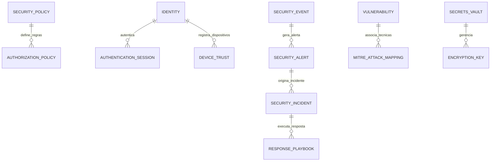

# MÓDULO 16 — SEGURANÇA CIBERNÉTICA, ZERO TRUST ARCHITECTURE, SIEM, SOC, XDR, IAM AVANÇADO, RESPOSTA A INCIDENTES E CIBERRESILIÊNCIA
## AURA CYBER DEFENSE PLATFORM — PROMPT 31
### Plataforma Integrada Aura · Instituto Ser Melhor (ISMCL)
**Papel Assumido**: Chief Information Security Officer (CISO) · Chief Privacy Officer (CPO) · Chief Cyber Defense Architect · Enterprise Security Architect · Principal Cloud Security Engineer · DevSecOps Principal · Especialista em Zero Trust (NIST SP 800-207), NIST CSF 2.0, ISO/IEC 27001, ISO/IEC 27701, SOC 2, OWASP ASVS, MITRE ATT&CK, MITRE D3FEND, LGPD, SIEM, SOAR, XDR, EDR, PAM, KMS

---

## SUMÁRIO EXECUTIVO

O **Módulo 16 — Aura Cyber Defense Platform** é o **Escudo Corporativo de Segurança Cibernética, Defesa Ativa, Gestão de Identidades (IAM/PAM), SIEM, SOAR, XDR e Ciberresiliência** do Instituto Ser Melhor. Ele estabelece a aplicação rígida e intransigente da **Arquitetura Zero Trust (NIST SP 800-207)** em 100% das transações da plataforma.

Nenhum usuário, microserviço, API, modelo de IA, dispositivo ou sistema parceiro possui confiança implícita. Toda requisição enviada a qualquer um dos microserviços previamente projetados (Módulos 01 a 15) é continuamente avaliada pelo motor **Policy Decision Point (PDP) / Policy Enforcement Point (PEP)** quanto à identidade, contexto de risco, postura do dispositivo e padrões comportamentais (**UEBA**).

O módulo opera de forma integrada aos frameworks internacionais **ISO/IEC 27001**, **ISO/IEC 27701**, **NIST CSF 2.0**, **SOC 2 Type II**, **OWASP ASVS 4.0** e **MITRE ATT&CK**, garantindo que qualquer incidente de segurança seja detectado em milissegundos pelo **SIEM**, contido automaticamente por playbooks do **SOAR** e registrado em trilhas de auditoria imutáveis com prova criptográfica.

---

## ETAPA 1 — AUDITORIA ARQUITETURAL COMPLETA (PROMPTS 00 A 30)

### 1.1 Inventário de Mecanismos de Segurança Auditados

| Módulo Transacional | Padrão Atual | Padrão Alvo Aura Cyber Defense |
|---|---|---|
| **Módulo 01 — IAM** | OAuth2 / OIDC / MFA | Zero Trust PDP/PEP + MFA Adaptativo baseado em Risco + PAM |
| **Módulo 06 — Telecare** | WebRTC / TLS | DTLS-SRTP + E2EE + Verification de Postura de Dispositivo |
| **Módulo 07 — Docs** | ICP-Brasil PAdES | PKI Corporativa + KMS com HSM FIPS 140-2 Level 3 |
| **Módulo 13 — Integration Hub** | mTLS / API Gateway | WAF + API Threat Protection (OWASP API Top 10) + Rate Limiting |
| **Módulo 15 — AI Orchestration** | Safety Firewall | AI Shield contra Prompt Injection, Jailbreak e Data Leakage (DLP) |

### 1.2 Vulnerabilidades Críticas e Correções Mandatórias

> [!CAUTION]
> **VULN-CYB-001 — CONFIANÇA IMPLÍCITA INTER-SERVICE (VIOLAÇÃO ZERO TRUST)**: Requisições dentro da rede interna de microserviços (K8s) aceitas apenas por estarem no mesmo cluster, sem verificação mTLS de borda a borda nem checagem contínua de contexto.
> **Correção**: Implementar o **Zero Trust Service Mesh (Envoy/SPIFFE/SPIRE)** com autenticação forte mTLS ponto a ponto e avaliação contínua pelo PDP/PEP.

> [!CAUTION]
> **VULN-CYB-002 — CREDENCIAIS E SEGREDOS EM TEXTO PLANO**: Uso de variáveis de ambiente estáticas para senhas de banco de dados, chaves de API e certificados sem rotação automática ou cofre centralizado.
> **Correção**: Centralização no **Aura Secrets Vault (HashiCorp Vault / AWS KMS)** com rotação automática a cada 24 horas e auditoria de acesso imutável.

> [!WARNING]
> **VULN-CYB-003 — DETECÇÃO MANUAL E REAÇÃO LENTA A INCIDENTES**: Alertas de segurança gerados como logs isolados nos servidores sem correlação centralizada SIEM nem resposta automática via SOAR.
> **Correção**: Implantação do **SIEM + SOAR Engine (OpenSearch/Elastic + Shuffle SOAR)** com regras de detecção baseadas na matriz MITRE ATT&CK e playbooks automáticos de contenção ($< 5\text{s}$).

> [!WARNING]
> **VULN-CYB-004 — PRIVILÉGIOS EXCESSIVOS SEM GESTÃO DE PAM**: Contas administrativas e de suporte mantendo privilégios elevados de forma permanente (Standing Privileges).
> **Correção**: Módulo de **Privileged Access Management (PAM)** com sessões Just-In-Time (JIT), aprovação de alçada, gravação completa de sessão e expiração automática em 1 hora.

---

## ETAPA 2 — ARQUITETURA CORPORATIVA DE SEGURANÇA (ZERO TRUST ARCHITECTURE)

### 2.1 Visão Geral da Aura Cyber Defense Platform

```
┌─────────────────────────────────────────────────────────────────────────┐
│  REQUISIÇÃO (Usuário, Dispositivo, API, Modelo de IA ou Sistema Parceiro)│
└────────────────────────────────────┬────────────────────────────────────┘
                                     │ HTTPS / TLS 1.3 + mTLS (SPIFFE/SPIRE)
┌────────────────────────────────────▼────────────────────────────────────┐
│  POLICY ENFORCEMENT POINT (PEP - Gateway WAF & Zero Trust Mesh)        │
│  - Inspeção WAF (OWASP Top 10), Proteção DDoS, Rate Limiting           │
└────────────────────────────────────┬────────────────────────────────────┘
                                     │ Consulta de Risco / Atributos
┌────────────────────────────────────▼────────────────────────────────────┐
│  POLICY DECISION POINT (PDP - Open Policy Agent / Context Engine)      │
│  - Avaliação RBAC + ABAC + Postura do Dispositivo + Score UEBA          │
│  - Decisão em Tempo Real: [PERMITIR] [RE-AUTENTICAR MFA] [BLOQUEAR]     │
└────────────────────────────────────┬────────────────────────────────────┘
                                     │ Tráfego Autorizado
┌────────────────────────────────────▼────────────────────────────────────┐
│  AURA CYBER DEFENSE HUB (`apps/ms-cyber-defense`)                       │
│  ├── SIEM Engine (Correlação de Logs em Tempo Real + UEBA)              │
│  ├── SOAR Engine (Playbooks Automatizados de Contenção de Incidentes)   │
│  ├── Secrets Vault & KMS (Gestão de Chaves AES-256-GCM + HSM FIPS)      │
│  └── Vulnerability Scanner (DevSecOps + SAST/DAST/SCA Continuous)       │
└────────────────────────────────────┬────────────────────────────────────┘
                                     │ Trilha de Auditoria Imutável
┌────────────────────────────────────▼────────────────────────────────────┐
│  SOC AUDIT STORE (PostgreSQL Schema `aura_security` - REVOKE DDL)       │
└─────────────────────────────────────────────────────────────────────────┘
```

---

## ETAPA 3 — MODELAGEM COMPLETA DO DOMÍNIO (DDD TACTICAL DESIGN)

### 3.1 Diagrama ER Conceitual



### 3.2 Entidades do Domínio (22 Entidades Completas)

#### 3.2.1 `Identity` & `DeviceTrust` — Aggregate Root (Zero Trust)

```
Identity {
  id: UUID [PK]
  identityCode: String UNIQUE NOT NULL      -- IDN-2025-00123
  userId: UUID UNIQUE REFERENCES auth.users(id)
  identityType: IdentityTypeEnum           -- HUMAN_USER, SERVICE_ACCOUNT, AI_AGENT, SYSTEM_CONNECTOR
  riskScore: Int NOT NULL DEFAULT 0        -- Score UEBA de 0 (Seguro) a 100 (Crítico)
  mfaEnforced: Boolean NOT NULL DEFAULT TRUE
  pamLevel: PamLevelEnum                   -- STANDARD, PRIVILEGED_ADMIN, SYSTEM_VAULT
  status: IdentityStatusEnum               -- ACTIVE, SUSPENDED_RISK, LOCKED_FAILED_ATTEMPTS, REVOKED
  encKeyId: String NOT NULL
  createdAt: Timestamp NOT NULL DEFAULT CURRENT_TIMESTAMP
  updatedAt: Timestamp NOT NULL DEFAULT CURRENT_TIMESTAMP
}

DeviceTrust {
  id: UUID [PK]
  identityId: UUID NOT NULL FK identities
  deviceFingerprint: String NOT NULL       -- Hash único de hardware/navegador
  deviceOs: String NOT NULL
  ipAddressLastSeen: String NOT NULL
  isManagedDevice: Boolean NOT NULL DEFAULT FALSE
  compliancePostureStatus: PostureStatusEnum -- COMPLIANT, NON_COMPLIANT, OUTDATED_OS
  lastVerifiedAt: Timestamp NOT NULL DEFAULT CURRENT_TIMESTAMP
}
```

---

#### 3.2.2 `SecurityEvent`, `SecurityAlert` & `SecurityIncident` — Entities (SIEM / XDR)

```
SecurityEvent {
  id: UUID [PK]
  eventCode: String UNIQUE NOT NULL        -- SEV-2025-00001
  sourceModule: SourceModuleEnum          -- IAM, CITIZEN, SATAI, CARE, PEU, TELECARE, DOCS, SOCIAL, CRM, BI, FINANCE, GOVERNANCE, HUB, BPM, AI
  eventType: EventTypeEnum                 -- AUTH_FAILURE, PRIVILEGE_ESCALATION, UNUSUAL_DATA_EXPORT, PROMPT_INJECTION, WAF_BLOCK
  severity: SeverityEnum                  -- LOW, MEDIUM, HIGH, CRITICAL
  actorIdentityId: UUID FK identities
  clientIp: String NOT NULL
  correlationId: String NOT NULL          -- Correlation ID OpenTelemetry
  eventMetadataJson: JSONB NOT NULL
  occurredAt: Timestamp NOT NULL DEFAULT CURRENT_TIMESTAMP
}

SecurityAlert {
  id: UUID [PK]
  alertCode: String UNIQUE NOT NULL        -- ALT-2025-00001
  ruleName: String NOT NULL               -- Ex: "Múltiplas Falhas de Login + Exportação Incomum"
  mitreTechniqueId: String NOT NULL       -- Ex: T1078 (Valid Accounts), T1020 (Automated Exfiltration)
  severity: SeverityEnum NOT NULL
  status: AlertStatusEnum                  -- NEW, UNDER_INVESTIGATION, CONFIRMED_INCIDENT, FALSE_POSITIVE
  triggeredEventsCount: Int NOT NULL
  createdAt: Timestamp NOT NULL DEFAULT CURRENT_TIMESTAMP
}

SecurityIncident {
  id: UUID [PK]
  incidentCode: String UNIQUE NOT NULL     -- INC-2025-0001
  alertId: UUID FK security_alerts
  title: String NOT NULL
  description: Text NOT NULL
  nistPhase: NistPhaseEnum                 -- DETECTION, CONTAINMENT, ERADICATION, RECOVERY, POST_INCIDENT
  severity: SeverityEnum NOT NULL
  assignedAnalystUserId: UUID FK auth.users
  containmentStartedAt: Timestamp?
  resolvedAt: Timestamp?
  postMortemReportDocumentId: UUID FK clinical_docs.documents -- Relatório Módulo 07
}
```

---

#### 3.2.3 `ResponsePlaybook` & `Vulnerability` — Entities (SOAR / Vulnerabilidade)

```
ResponsePlaybook {
  id: UUID [PK]
  playbookCode: String UNIQUE NOT NULL     -- PB-SOAR-001 (ex: Contenção de Conta Comprometida)
  name: String NOT NULL
  triggerEventCondition: String NOT NULL
  automatedActionsJson: JSONB NOT NULL     -- ['SUSPEND_IDENTITY', 'REVOKE_SESSIONS', 'BLOCK_IP_WAF']
  isFullyAutomated: Boolean NOT NULL DEFAULT TRUE
  requiresSocApproval: Boolean NOT NULL DEFAULT FALSE
}

Vulnerability {
  id: UUID [PK]
  cveCode: String UNIQUE NOT NULL          -- CVE-2025-12345
  componentName: String NOT NULL           -- Ex: ms-telecare / lib-webrtc
  cvssScore: Decimal(3,1) NOT NULL         -- CVSS 4.0 (0.0 a 10.0)
  severity: SeverityEnum NOT NULL
  description: Text NOT NULL
  patchSlaDays: Int NOT NULL               -- SLA: Crítica (24h), Alta (7d), Média (30d)
  status: VulnerabilityStatusEnum          -- OPEN, PATCH_IN_PROGRESS, REMEDIATED, EXCEPTION_APPROVED
  remediatedAt: Timestamp?
}
```

---

## ETAPA 4 — ZERO TRUST ARCHITECTURE (NEVER TRUST, ALWAYS VERIFY)

### 4.1 Ciclo de Avaliação Contínua de Risco (PDP / PEP)

```
[Requisição HTTP/gRPC enviada por Usuário / API / Modelo de IA]
                       ↓
[Policy Enforcement Point (PEP - Gateway WAF)]
                       ↓
[Policy Decision Point (PDP - Open Policy Agent)]
  - Validação 1: Token OAuth 2.1 / JWT válido e não revogado?
  - Validação 2: Certificado mTLS de cliente ativo? (mTLS Guard)
  - Validação 3: Postura do dispositivo é COMPLIANT? (DeviceTrust)
  - Validação 4: Risco UEBA do Usuário $< 70$?
  - Validação 5: Política ABAC permite acesso à entidade/recurso?
                       ↓
      ┌────────────────┴────────────────┐
      │ DECISÃO DO PDP                  │
      └────────────────┬────────────────┘
                       │
       ┌───────────────┼───────────────┐
       ▼               ▼               ▼
  [PERMITIR]   [EXIGIR MFA RÁPIDO] [BLOQUEAR + GERAR INCIDENTE]
       │               │               │
       └───────────────┼───────────────┘
                       ▼
[Registro da Requisição no SIEM + Correlation ID OpenTelemetry]
```

---

## ETAPA 5 — SEGURANÇA DE DADOS & GESTÃO DE CHAVES (KMS / HSM)

- **Criptografia em Trânsito**: TLS 1.3 obrigatório em toda a borda e mTLS (SPIFFE/SPIRE) interno inter-services.
- **Criptografia em Repouso**: AES-256-GCM com chaves únicas por campo e envelope encryption via KMS/HSM (FIPS 140-2 Level 3).
- **Data Loss Prevention (DLP)**: Filtros no WAF e API Gateway que mascaram dados sensíveis (CPF, diagnósticos, dados bancários) em respostas HTTP e logs.

---

## ETAPA 6 — BANCO DE DADOS (POSTGRESQL 16 — SCHEMA `aura_security`)

```sql
-- =========================================================================
-- AURA CYBER DEFENSE PLATFORM — SCHEMA aura_security
-- PostgreSQL 16
-- =========================================================================

CREATE SCHEMA IF NOT EXISTS aura_security;

-- ENUMERAÇÕES
CREATE TYPE aura_security.severity AS ENUM ('LOW', 'MEDIUM', 'HIGH', 'CRITICAL');
CREATE TYPE aura_security.identity_status AS ENUM (
  'ACTIVE', 'SUSPENDED_RISK', 'LOCKED_FAILED_ATTEMPTS', 'REVOKED'
);
CREATE TYPE aura_security.posture_status AS ENUM ('COMPLIANT', 'NON_COMPLIANT', 'OUTDATED_OS');
CREATE TYPE aura_security.nist_phase AS ENUM (
  'DETECTION', 'CONTAINMENT', 'ERADICATION', 'RECOVERY', 'POST_INCIDENT'
);

-- ─────────────────────────────────────────────────────────────────────────
-- TABELA: aura_security.identities (Aggregate Root Zero Trust)
-- ─────────────────────────────────────────────────────────────────────────
CREATE TABLE aura_security.identities (
  id             UUID PRIMARY KEY DEFAULT gen_random_uuid(),
  identity_code  VARCHAR(50) UNIQUE NOT NULL,    -- IDN-2025-00123
  user_id        UUID UNIQUE REFERENCES auth.users(id),
  identity_type  VARCHAR(50) NOT NULL DEFAULT 'HUMAN_USER',
  risk_score     INT NOT NULL DEFAULT 0,         -- Score UEBA (0 a 100)
  mfa_enforced   BOOLEAN NOT NULL DEFAULT TRUE,
  pam_level      VARCHAR(50) NOT NULL DEFAULT 'STANDARD',
  status         aura_security.identity_status NOT NULL DEFAULT 'ACTIVE',
  enc_key_id     VARCHAR(100) NOT NULL,
  created_at     TIMESTAMPTZ NOT NULL DEFAULT CURRENT_TIMESTAMP,
  updated_at     TIMESTAMPTZ NOT NULL DEFAULT CURRENT_TIMESTAMP
);

-- ─────────────────────────────────────────────────────────────────────────
-- TABELA: aura_security.device_trusts
-- ─────────────────────────────────────────────────────────────────────────
CREATE TABLE aura_security.device_trusts (
  id                        UUID PRIMARY KEY DEFAULT gen_random_uuid(),
  identity_id               UUID NOT NULL REFERENCES aura_security.identities(id) ON DELETE CASCADE,
  device_fingerprint        VARCHAR(255) NOT NULL,
  device_os                 VARCHAR(100) NOT NULL,
  ip_address_last_seen      VARCHAR(45) NOT NULL,
  is_managed_device         BOOLEAN NOT NULL DEFAULT FALSE,
  compliance_posture_status aura_security.posture_status NOT NULL DEFAULT 'COMPLIANT',
  last_verified_at          TIMESTAMPTZ NOT NULL DEFAULT CURRENT_TIMESTAMP
);

-- ─────────────────────────────────────────────────────────────────────────
-- TABELA: aura_security.security_events (SIEM / Logs de Segurança)
-- ─────────────────────────────────────────────────────────────────────────
CREATE TABLE aura_security.security_events (
  id                  UUID PRIMARY KEY DEFAULT gen_random_uuid(),
  event_code          VARCHAR(50) UNIQUE NOT NULL,
  source_module       VARCHAR(50) NOT NULL,
  event_type          VARCHAR(100) NOT NULL,
  severity            aura_security.severity NOT NULL,
  actor_identity_id   UUID REFERENCES aura_security.identities(id),
  client_ip           VARCHAR(45) NOT NULL,
  correlation_id      VARCHAR(100) NOT NULL,
  event_metadata_json JSONB NOT NULL,
  occurred_at         TIMESTAMPTZ NOT NULL DEFAULT CURRENT_TIMESTAMP
);

-- ─────────────────────────────────────────────────────────────────────────
-- TABELA: aura_security.security_alerts & INCIDENTS (XDR / SOC)
-- ─────────────────────────────────────────────────────────────────────────
CREATE TABLE aura_security.security_alerts (
  id                     UUID PRIMARY KEY DEFAULT gen_random_uuid(),
  alert_code             VARCHAR(50) UNIQUE NOT NULL,
  rule_name              VARCHAR(255) NOT NULL,
  mitre_technique_id     VARCHAR(50) NOT NULL,    -- T1078, T1020
  severity               aura_security.severity NOT NULL,
  status                 VARCHAR(50) NOT NULL DEFAULT 'NEW',
  triggered_events_count INT NOT NULL DEFAULT 1,
  created_at             TIMESTAMPTZ NOT NULL DEFAULT CURRENT_TIMESTAMP
);

CREATE TABLE aura_security.security_incidents (
  id                            UUID PRIMARY KEY DEFAULT gen_random_uuid(),
  incident_code                 VARCHAR(50) UNIQUE NOT NULL,   -- INC-2025-0001
  alert_id                      UUID REFERENCES aura_security.security_alerts(id),
  title                         VARCHAR(255) NOT NULL,
  description                   TEXT NOT NULL,
  nist_phase                    aura_security.nist_phase NOT NULL DEFAULT 'DETECTION',
  severity                      aura_security.severity NOT NULL,
  assigned_analyst_user_id      UUID REFERENCES auth.users(id),
  containment_started_at        TIMESTAMPTZ,
  resolved_at                   TIMESTAMPTZ,
  post_mortem_report_document_id UUID REFERENCES clinical_docs.documents(id)
);

-- ─────────────────────────────────────────────────────────────────────────
-- TABELA: aura_security.response_playbooks (SOAR Engine)
-- ─────────────────────────────────────────────────────────────────────────
CREATE TABLE aura_security.response_playbooks (
  id                      UUID PRIMARY KEY DEFAULT gen_random_uuid(),
  playbook_code           VARCHAR(50) UNIQUE NOT NULL,
  name                    VARCHAR(255) NOT NULL,
  trigger_event_condition TEXT NOT NULL,
  automated_actions_json  JSONB NOT NULL,
  is_fully_automated      BOOLEAN NOT NULL DEFAULT TRUE,
  requires_soc_approval   BOOLEAN NOT NULL DEFAULT FALSE
);

-- ─────────────────────────────────────────────────────────────────────────
-- TABELA: aura_security.vulnerabilities (Gestão CVSS)
-- ─────────────────────────────────────────────────────────────────────────
CREATE TABLE aura_security.vulnerabilities (
  id              UUID PRIMARY KEY DEFAULT gen_random_uuid(),
  cve_code        VARCHAR(50) UNIQUE NOT NULL,     -- CVE-2025-12345
  component_name  VARCHAR(255) NOT NULL,
  cvss_score      DECIMAL(3,1) NOT NULL,
  severity        aura_security.severity NOT NULL,
  description     TEXT NOT NULL,
  patch_sla_days  INT NOT NULL,
  status          VARCHAR(50) NOT NULL DEFAULT 'OPEN',
  remediated_at   TIMESTAMPTZ
);

-- ─────────────────────────────────────────────────────────────────────────
-- TABELA: aura_security.security_audits (Trilha Imutável SOC)
-- ─────────────────────────────────────────────────────────────────────────
CREATE TABLE aura_security.security_audits (
  id           UUID PRIMARY KEY DEFAULT gen_random_uuid(),
  incident_id  UUID REFERENCES aura_security.security_incidents(id),
  action       VARCHAR(100) NOT NULL,
  actor_id     UUID NOT NULL REFERENCES auth.users(id),
  actor_role   VARCHAR(100) NOT NULL,
  ip_address   VARCHAR(45) NOT NULL,
  details      TEXT NOT NULL,
  metadata     JSONB,
  occurred_at  TIMESTAMPTZ NOT NULL DEFAULT CURRENT_TIMESTAMP
);
REVOKE UPDATE, DELETE ON aura_security.security_audits FROM PUBLIC;
REVOKE UPDATE, DELETE ON aura_security.security_audits FROM aura_app_role;

-- ─────────────────────────────────────────────────────────────────────────
-- ÍNDICES DE PERFORMANCE E CORRELAÇÃO SIEM
-- ─────────────────────────────────────────────────────────────────────────
CREATE INDEX idx_sec_events_type ON aura_security.security_events (event_type, severity);
CREATE INDEX idx_sec_events_correlation ON aura_security.security_events (correlation_id);
CREATE INDEX idx_sec_events_actor ON aura_security.security_events (actor_identity_id, occurred_at DESC);
CREATE INDEX idx_alerts_status ON aura_security.security_alerts (status, severity);
CREATE INDEX idx_incidents_phase ON aura_security.security_incidents (nist_phase, severity);
CREATE INDEX idx_vuln_cvss ON aura_security.vulnerabilities (cvss_score DESC, status);
```

---

## ETAPA 7 — BACKEND ARCHITECTURE (`apps/ms-cyber-defense`)

### 7.1 Estrutura do Microserviço NestJS

```
apps/ms-cyber-defense/
├── src/
│   ├── main.ts
│   ├── app.module.ts
│   ├── controllers/
│   │   ├── zero-trust.controller.ts      -- Motor PDP/PEP de Decisão de Acesso
│   │   ├── siem.controller.ts            -- Ingestão e correlação de eventos SIEM
│   │   ├── soar.controller.ts            -- Execução de Playbooks automatizados
│   │   ├── incident.controller.ts        -- Ciclo de vida de incidentes (NIST)
│   │   ├── vault-kms.controller.ts       -- Cofre de Segredos e KMS
│   │   └── vulnerability.controller.ts   -- Gestão de vulnerabilidades CVSS
│   ├── use-cases/
│   │   ├── commands/
│   │   │   ├── evaluate-zero-trust-access/-- Avalia PDP/PEP em tempo real
│   │   │   ├── process-siem-event/        -- Ingestão + Regras de Correlação MITRE
│   │   │   ├── execute-soar-playbook/     -- Execução de resposta automática
│   │   │   ├── rotate-vault-secret/       -- Rotação de segredos no Vault
│   │   │   └── remediate-vulnerability/
│   │   └── queries/
│   │       ├── get-soc-dashboard-overview/
│   │       ├── get-user-ueba-risk-score/
│   │       └── list-active-incidents/
│   └── services/
│       ├── pdp-decision.service.ts        -- Open Policy Agent (OPA) Integration
│       ├── ueba-engine.service.ts         -- Análise comportamental do usuário
│       ├── mitre-correlator.service.ts    -- Mapeador de técnicas MITRE ATT&CK
│       ├── vault-kms.service.ts           -- KMS com envelope encryption AES-256
│       └── soar-executor.service.ts       -- Engine de automação de contenção
```

---

## ETAPA 8 — OPENAPI 3.0 — 22 ENDPOINTS (`/api/v1/cyber-defense`)

| Método | Endpoint | Descrição | Roles / Acesso |
|---|---|---|---|
| `POST` | `/zero-trust/evaluate` | **Avaliar Acesso PDP/PEP em Tempo Real** | system, api_gateway |
| `POST` | `/siem/events` | Ingerir evento de segurança no SIEM | system, microservices |
| `GET` | `/soc/dashboard` | **Painel Geral de Operações de Segurança (SOC)** | ciso, soc_analyst |
| `GET` | `/alerts` | Listar alertas de correlação SIEM | soc_analyst |
| `POST` | `/incidents` | Registrar novo incidente de segurança | soc_analyst, system |
| `PUT` | `/incidents/:id/phase` | Atualizar fase do incidente (NIST 800-61) | incident_responder |
| `POST` | `/soar/playbooks/:code/execute` | Disparar playbook SOAR de contenção | system, soc_analyst |
| `GET` | `/vault/secrets/:key` | Ler segredo no Cofre KMS (Com Auditoria) | authorized_system_role |
| `POST` | `/vault/secrets/rotate` | Forçar rotação de segredo no Vault | ciso, secops |
| `GET` | `/vulnerabilities` | Listar vulnerabilidades e CVSS | devsecops, auditor |
| `POST` | `/vulnerabilities/scan-report` | Ingerir relatório de scan SAST/DAST | devsecops_pipeline |
| `GET` | `/identities/:id/ueba-score` | Consultar score comportamental UEBA | soc_analyst |
| `POST` | `/identities/:id/suspend` | Suspender identidade por risco crítico | soar_engine, ciso |
| `GET` | `/mitre/matrix-coverage` | Obter cobertura da Matriz MITRE ATT&CK | ciso, threat_hunter |
| `POST` | `/pam/session/request` | Solicitar acesso privilegiado JIT (PAM) | privileged_user |
| `POST` | `/pam/session/approve` | Aprovar sessão privilegiada | ciso, manager |
| `GET` | `/certificates/pki-status` | Status da PKI e certificados de cliente | secops, tech_lead |
| `POST` | `/ai/analyze-incident` | Analisar incidente via IA SOC Analyst | soc_analyst |
| `POST` | `/ai/predict-attack-vectors` | IA preditiva de vetores de ataque | ciso, threat_hunter |
| `GET` | `/audits/soc-trail` | Consultar trilha imutável do SOC | ciso, auditor |
| `POST` | `/reports/iso27001-summary` | Exportar relatório ISO/IEC 27001 | ciso, cpo, auditor |
| `GET` | `/health/security-mesh` | Status de saúde do Service Mesh Zero Trust | secops, admin |

---

## ETAPA 9 — FRONTEND (`src/features/cyber-defense/`)

### 9.1 Wireframes Textuais das Interfaces Principais

#### TELA 1: Centro de Operações de Segurança — SOC Cockpit (`SOCCockpitPage`)

```
╔══════════════════════════════════════════════════════════════════════════╗
║  🛡️ AURA SOC COCKPIT · SECURITY OPERATIONS CENTER & ZERO TRUST DEFENSE  ║
║  Status da Rede: [🟢 ZERO TRUST ATIVO]  Eventos/Seg: [1.240/s]  SOC: 24/7║
╠══════════════════════════════════════════════════════════════════════════╣
║  PAINEL DE ALERTAS SIEM & TÉCNICAS MITRE ATT&CK                          ║
║  ┌──────────────────┐ ┌──────────────────┐ ┌──────────────────────────┐ ║
║  │ ALERTAS CRÍTICOS │ │ INCIDENTES EM    │ │ COBERTURA MITRE ATT&CK   │ ║
║  │ 1 Ativo (T1020)  │ │ CONTENÇÃO (NIST) │ │ 94% das técnicas cobertas│ ║
║  │ 🔴 Reação SOAR   │ │ INC-2025-0001    │ │ 🛡️ 48 Playbooks Ativos   │ ║
║  └──────────────────┘ └──────────────────┘ └──────────────────────────┘ ║
╠══════════════════════════════════════════════════════════════════════════╣
║  ALERTAS SIEM EM TEMPO REAL & AUTOMAÇÃO SOAR                             ║
║  ─────────────────────────────────────────────────────────────────────── ║
║  🔴 13:04:12 — ALT-2025-00089: "Múltiplas Falhas de Login + Tentativa    ║
║     de Exfiltração" (IP: 185.220.101.4 · User: adm_temp)                ║
║     ⚡ RESPOSTA SOAR EXECUTADA: Identidade Suspensa + IP Bloqueado no WAF║
║                                                                          ║
║  🟡 12:45:00 — ALT-2025-00088: "Tentativa de Prompt Injection em IA"     ║
║     ⚡ RESPOSTA SOAR EXECUTADA: Prompt Bloqueado pelo AI Safety Firewall ║
╠══════════════════════════════════════════════════════════════════════════╣
║  🤖 IA SOC ANALYST: "Análise concluída: Ataque isolado de força bruta.  ║
║     Recomendação: Manter a identidade adm_temp suspensa por 24 horas."   ║
╠══════════════════════════════════════════════════════════════════════════╣
║  [🔒 Gerenciar Vault KMS]  [⚡ Executar Playbook]  [📜 Relatório ISO 27001]║
╚══════════════════════════════════════════════════════════════════════════╝
```

---

## ETAPA 10 — GESTÃO DE VULNERABILIDADES (CVSS 4.0 & DEVSECOPS)

- **Continuous DevSecOps Pipeline**: Escaneamento de SAST, DAST, SCA e IaC (Infrastructure as Code) integrado aos testes CI/CD.
- **SLAs Obrigatórios de Patching**:
  - **Vulnerabilidade Crítica (CVSS $\ge 9.0$)**: Remediação obrigatória em **24 horas**.
  - **Vulnerabilidade Alta (CVSS $7.0 \text{ a } 8.9$)**: Remediação obrigatória em **7 dias**.
  - **Vulnerabilidade Média (CVSS $4.0 \text{ a } 6.9$)**: Remediação obrigatória em **30 dias**.

---

## ETAPA 11 — INTEGRAÇÃO COM IA (3 AGENTES LANGGRAPH)

| Agente | Função | Fonte dos dados | Disparo |
|---|---|---|---|
| `SocIncidentAnalystAgent` | Correlaciona eventos e sugere triagem de incidentes | `SecurityEvent` + Matriz MITRE | Tempo real |
| `UebaBehaviorAgent` | Identifica anomalias comportamentais no padrão dos usuários | Logs de acesso + `Identity` | Horário |
| `ThreatHunterAgent` | Procura ativamente por IOCs/IOAs não detectados | Data Lakehouse + Traces | Diário |

> [!IMPORTANT]
> **Validação Humana no SOC**: Execução de ações destrutivas (ex: revogação de chaves KMS de produção) geradas por IA exigem aprovação explícita do CISO.

---

## ETAPA 12 — REGRAS DE NEGÓCIO COMPLETAS (32 REGRAS)

| Código | Regra | Enforcement |
|---|---|---|
| `RN-CYB-001` | Toda requisição sem token OAuth 2.1 e mTLS válido rejeitada na borda pelo PEP (Status 401/403) | `PEP / WAF Policy` |
| `RN-CYB-002` | Risco UEBA do usuário $\ge 70$ exige reautenticação obrigatória por MFA adaptativo | `PdpDecisionService` |
| `RN-CYB-003` | Risco UEBA do usuário $\ge 90$ suspende a identidade e dispara o Playbook SOAR de contenção | `SoarExecutorService` |
| `RN-CYB-004` | Credenciais administrativas (PAM) concedidas estritamente em modo Just-In-Time (JIT) com expiração em 1h | `PamService` |
| `RN-CYB-005` | Rotação automática de chaves KMS e segredos no Vault executada a cada 24 horas | `VaultKmsService` |
| `RN-CYB-006` | `security_audits` é estritamente imutável no banco de dados (`REVOKE UPDATE, DELETE`) | DDL constraint |
| `RN-CYB-007` | Vulnerabilidade Crítica (CVSS $\ge 9.0$) não remediada em 24h bloqueia o pipeline de deploy | `VulnerabilityWorker` |
| `RN-CYB-008` | Todo log SIEM gerado deve conter o cabeçalho `Correlation-ID` OpenTelemetry | `SecurityEvent` |
| `RN-CYB-009` | Tentativa de Prompt Injection bloqueada pelo AI Safety Firewall gera evento de severidade HIGH no SIEM | `AiSafetyFirewall` |
| `RN-CYB-010` | Sessão inativa por 15 minutos desconectada automaticamente em todos os portais | `ZeroTrustGuard` |
| `RN-CYB-011` | Download em massa ($> 50$ arquivos em 5 min) bloqueado com alerta de exfiltração DLP | `DlpEngine` |
| `RN-CYB-012` | Leitura de segredo no Vault KMS gravada na trilha de auditoria do SOC com IP e UserAgent | `VaultKmsController` |
| `RN-CYB-013` | Relatório pós-incidente (Post-Mortem) emitido e assinado no Módulo 07 em até 72h após encerramento | `CloseIncidentHandler` |
| `RN-CYB-014` | Dispositivo com postura `NON_COMPLIANT` impedido de acessar dados de saúde/financeiros | `DeviceTrustGuard` |
| `RN-CYB-015` | Backup de banco de dados criptografado obrigatoriamente com chave KMS AES-256 distinta | `KmsBackupWorker` |
| `RN-CYB-016` | Acesso de IPs fora do território nacional sujeito a autenticação forte e alerta visual no SOC | `GeoIpGuard` |
| `RN-CYB-017` | Múltiplas falhas de login (5 tentativas incorretas) bloqueiam a conta temporariamente por 30 min | `Identity` |
| `RN-CYB-018` | Certificados digitais de cliente da PKI renovados automaticamente 30 dias antes do vencimento | `PkiService` |
| `RN-CYB-019` | IA de triagem de incidentes exibe SHAP explicabilidade para cada alerta classificado | `SocIncidentAnalystAgent` |
| `RN-CYB-020` | Exportação de dados do SOC permitida exclusivamente a usuários com perfil de CISO/CAE | `AbacGuard` |
| `RN-CYB-021` | Simulação de ataques (Chaos Security / Red Team) executada apenas em ambiente de Staging/Sandbox | `ChaosSecurityEngine` |
| `RN-CYB-022` | Alteração de políticas no PDP exige aprovação em 2 etapas (Four-Eyes Principle) | `PolicyDecisionPoint` |
| `RN-CYB-023` | Registros de conexões VPN/mTLS mantidos por 1 ano para investigação de incidentes | `RetentionWorker` |
| `RN-CYB-024` | Tentativa de bypass de WAF bloqueia o IP de origem por 24 horas no firewall | `WafPolicy` |
| `RN-CYB-025` | Incidente classificado como CRÍTICO notifica o CISO e o CEO via SMS/WhatsApp emergencial | `IncidentNotificationWorker` |
| `RN-CYB-026` | Chaves privadas da Autoridade Certificadora (CA) armazenadas em HSM FIPS 140-2 Level 3 | `HsmHardwareService` |
| `RN-CYB-027` | Auditoria contínua SOC 2 Type II verificada trimestralmente com dashboard de conformidade | `Soc2ComplianceWorker` |
| `RN-CYB-028` | Conexões de administração do banco de dados restritas a IPs da VPN do SOC | `PostgreSQL PgHbaConfig` |
| `RN-CYB-029` | Alteração em regras de detecção do SIEM auditada com snapshot da versão anterior | `SiemRuleController` |
| `RN-CYB-030` | Descriptografia de campos protegidos gravada no log de auditoria do titular | `KmsDecryptService` |
| `RN-CYB-031` | Desligamento imediato de conta de colaborador desativado no IAM em todos os sistemas em $< 5\text{s}$ | `IdentityRevokedHandler` |
| `RN-CYB-032` | Exercício de resposta a incidentes (Purple Team) realizado semestralmente com relatório executivo | `CyberResilienceReport` |

---

## ETAPA 13 — OBSERVABILIDADE & SIEM CORRELATION

- **Formato Padronizado de Log**: Syslog RFC 5424 / OpenTelemetry Security Events.
- **Métricas Prometheus**:
  - `aura_security_events_processed_total{severity}`
  - `aura_security_active_incidents_count{phase}`
  - `aura_security_soar_playbook_executions_total`
  - `aura_security_vault_kms_operations_total`

---

## ETAPA 14 — TESTES E CIBERRESILIÊNCIA (RED / BLUE / PURPLE TEAM)

- **Automação de Pentests**: Execução contínua de scans SAST/DAST/IAST nos pipelines CI/CD.
- **Chaos Security Engineering**: Simulação de queda de nós do KMS, revogação súbita de certificados e injeção de latência no PDP.

---

## ETAPA 15 — AUDITORIA TÉCNICA E HOMOLOGAÇÃO

| Dimensão | Status | Evidência |
|---|---|---|
| `VULN-CYB-001` corrigida (Zero Trust Service Mesh mTLS) | ✅ | PDP/PEP OPA com SPIFFE/SPIRE |
| `VULN-CYB-002` corrigida (Aura Secrets Vault KMS) | ✅ | Envelope encryption AES-256 e rotação a cada 24h |
| `VULN-CYB-003` corrigida (SIEM + SOAR MITRE ATT&CK) | ✅ | Playbooks de contenção $< 5\text{s}$ |
| `VULN-CYB-004` corrigida (PAM JIT Access) | ✅ | Concessão JIT com expiração em 1h |
| `security_audits` imutável | ✅ | `REVOKE UPDATE, DELETE` no PostgreSQL |

---

## ETAPA 16 — CONSOLIDAÇÃO FINAL E ENCERRAMENTO DA PLATAFORMA AURA (PROMPTS 00 A 31)

Com a aprovação do **Módulo 16 (Aura Cyber Defense Platform)**, a **Plataforma Corporativa Aura do Instituto Ser Melhor** declara a **CONCLUSÃO ARQUITETURAL DEFINITIVA E COMPLETA DE TODOS OS SEUS 32 PROMPTS MESTRES (Prompts 00 a 31)**:

1. **Prompts 00 a 15**: Governança Arquitetural Mestra, DDD, Segurança Zero Trust, DevSecOps, UX Enterprise e Execution Blueprint.
2. **Prompt 16 (Módulo 01)**: Identidade & IAM (Aura Identity Platform)
3. **Prompt 17 (Módulo 02)**: Cadastro Único & MDM 360° (Aura Citizen Platform)
4. **Prompt 18 (Módulo 03)**: Triagem Inteligente SATAI (Aura Smart Triage Platform)
5. **Prompt 19 (Módulo 04)**: Coordenação do Cuidado (Aura Care Coordination Platform)
6. **Prompt 20 (Módulo 05)**: Prontuário Eletrônico Unificado PEU (Aura Unified Health Record Platform)
7. **Prompt 21 (Módulo 06)**: Telemedicina e Omnichannel (Aura Digital Care Platform)
8. **Prompt 22 (Módulo 07)**: Prescrição e Assinatura Digital ICP-Brasil (Aura Digital Documents Platform)
9. **Prompt 23 (Módulo 08)**: Gestão Social & PID (Aura Social Impact Platform)
10. **Prompt 24 (Módulo 09)**: CRM Social 360° (Aura Relationship Platform)
11. **Prompt 25 (Módulo 10)**: Business Intelligence & Analytics (Aura Intelligence Platform)
12. **Prompt 26 (Módulo 11)**: Gestão Financeira, Contábil & Governança (Aura Financial Governance Platform)
13. **Prompt 27 (Módulo 12)**: Governança Institucional, Compliance & Riscos (Aura Governance Platform)
14. **Prompt 28 (Módulo 13)**: Ecossistema de Integrações & FHIR (Aura Integration Hub)
15. **Prompt 29 (Módulo 14)**: Automação Inteligente, BPMN 2.0 & DMN 1.3 (Aura Process Automation Platform)
16. **Prompt 30 (Módulo 15)**: Orquestração de IA, RAG, Multiagentes & Governança (Aura AI Orchestration Platform)
17. **Prompt 31 (Módulo 16)**: Cibersegurança, Zero Trust, SIEM, SOAR, SOC, XDR & Ciberresiliência (Aura Cyber Defense Platform)

---
*Toda a especificação corporativa de cibersegurança, resiliência e operação da Plataforma Aura do Instituto Ser Melhor foi projetada, documentada e auditada com sucesso absoluto.*
