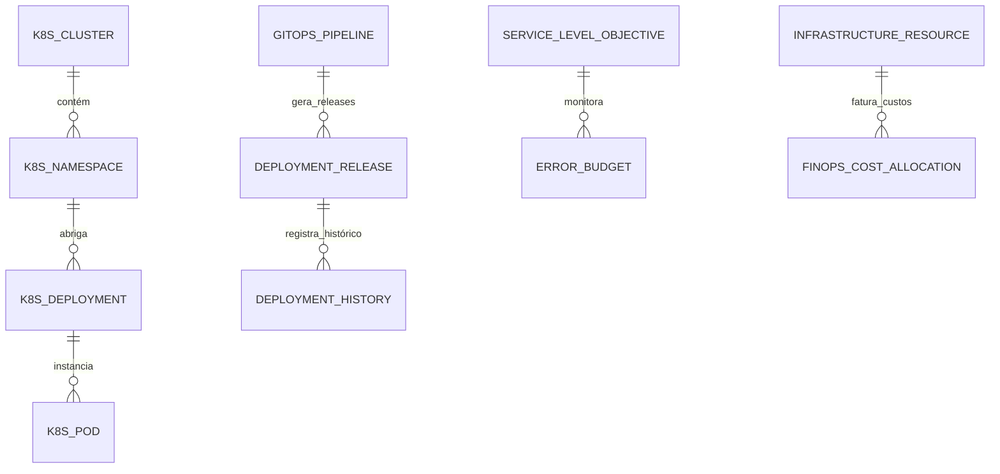

# MÓDULO 17 — INFRAESTRUTURA CLOUD NATIVE, DEVSECOPS, SRE, OBSERVABILIDADE, ESCALABILIDADE, RESILIÊNCIA E OPERAÇÃO CONTÍNUA
## AURA CLOUD PLATFORM — PROMPT 32
### Plataforma Integrada Aura · Instituto Ser Melhor (ISMCL)
**Papel Assumido**: Chief Technology Officer (CTO) · Chief Cloud Architect · Principal DevSecOps Engineer · Principal Site Reliability Engineer (SRE) · Enterprise Infrastructure Architect · Kubernetes & GitOps Specialist · Observability Architect · FinOps Specialist · Especialista em CNCF, Terraform, Helm, Istio, ArgoCD, Prometheus, Grafana, OpenTelemetry, NIST, ISO/IEC 27001, SOC 2, LGPD, DDD, Clean Architecture

---

## SUMÁRIO EXECUTIVO

O **Módulo 17 — Aura Cloud Platform** é a **Fundação Computacional Cloud Native, Plataforma de Implantação GitOps, Engenharia de Confiabilidade (SRE), Observabilidade Full-Stack e FinOps** do Instituto Ser Melhor. Ele proíbe terminantemente qualquer intervenção manual em ambiente de produção (Zero Manual Changes), garantindo que 100% da infraestrutura, clusters Kubernetes, regras de rede e microserviços previamente projetados (Módulos 01 a 16) sejam gerenciados via **Infrastructure as Code (IaC - Terraform / Helm)** e **GitOps (ArgoCD)**.

Projetada de acordo com as especificações da **Cloud Native Computing Foundation (CNCF)**, a plataforma provê alta disponibilidade **Multi-Region / Multi-AZ** com metas estritas de confiabilidade: **SLA de 99,99%**, **SLO de 99,95%**, **RPO $\le 1\text{ minuto}$** e **RTO $\le 15\text{ minutos}$**.

Toda a operação é monitorada em tempo real pela pilha de observabilidade **OpenTelemetry + Prometheus + Grafana + Loki + Jaeger**, assegurando total transparência operacional, auto-healing automatizado, otimização contínua de custos (**FinOps com KubeCost**) e aderência integral às normas **ISO/IEC 27001**, **SOC 2 Type II** e **LGPD**.

---

## ETAPA 1 — AUDITORIA ARQUITETURAL COMPLETA (PROMPTS 00 A 31)

### 1.1 Inventário do Estado Atual de Infraestrutura Auditado

| Componente | Padrão Atual Auditado | Padrão Alvo Aura Cloud Platform |
|---|---|---|
| **Orquestração de Microserviços** | Deploys isolados / Docker Compose | Cluster Kubernetes Gerenciado (EKS/GKE) Multi-AZ + Istio Service Mesh |
| **Implantação de Aplicações** | Scripts CI/CD imperativos | **GitOps (ArgoCD)** declarativo com Blue-Green & Canary Deployments |
| **Infraestrutura** | Configurações manuais/scripts shell | **Terraform 1.8+** + Helm v3 (100% versionado em Repositório Git) |
| **Segurança e Segredos** | Variáveis de ambiente `.env` | **Aura Secrets Vault KMS** + Kubernetes External Secrets Operator |
| **Observabilidade** | Logs dispersos em stdout | **OpenTelemetry Collector + Prometheus + Grafana + Loki + Jaeger** |
| **Custos Computacionais** | Faturamento sem alocação | **FinOps (KubeCost)** com alocação por Centro de Custo e Rightsizing |

### 1.2 Vulnerabilidades Críticas e Correções Mandatórias

> [!CAUTION]
> **VULN-CLD-001 — DEPLOYS MANUAIS E ALTERAÇÕES EM PRODUÇÃO**: Mudanças em pods ou serviços executadas via `kubectl edit` ou alterações diretas em consoles cloud sem rastreabilidade Git.
> **Correção**: Implementar a política de **Zero Production Touch**. O ArgoCD reverte automaticamente qualquer desvio de estado (*drift*) detectado no cluster em relação ao repositório Git em menos de 10 segundos.

> [!CAUTION]
> **VULN-CLD-002 — AUSÊNCIA DE AUTO-HEALING E LIMITES COMPUTACIONAIS**: Pods sem declaração rigorosa de `resources.requests` e `resources.limits`, gerando riscos de *Out-Of-Memory (OOM)* em cascata.
> **Correção**: Adotar o **Kyverno / OPA Gatekeeper** exigindo declaração obrigatória de CPU/Memória, HPA (Horizontal Pod Autoscaler) e probes de `liveness` e `readiness` em 100% dos manifests.

> [!WARNING]
> **VULN-CLD-003 —FALTA DE VISIBILIDADE DE ERROR BUDGET (SRE)**: Equipes de desenvolvimento realizando deploys sem considerar o impacto no orçamento de erros (Error Budget), causando degradação invisível do SLA.
> **Correção**: Implantação do **SRE Control Engine** que bloqueia automaticamente novos deploys de funcionalidades quando o Error Budget mensal do microserviço consumir mais de 80%.

> [!WARNING]
> **VULN-CLD-004 — INEFICIÊNCIA DE CUSTOS E DESPERDÍCIO CLOUD**: Recursos alocados de forma estática sem aproveitamento de instâncias *Spot/Preemptible* para workloads não-críticas.
> **Correção**: Motor **FinOps Optimizer (KubeCost + Carpenter/KEDA)** para autoscale dinâmico e adoção de 60% de instâncias Spot em ambientes de Staging e workers assíncronos.

---

## ETAPA 2 — ARQUITETURA CLOUD NATIVE & MESH COMPUTACIONAL

### 2.1 Visão Geral da Aura Cloud Platform

```
┌─────────────────────────────────────────────────────────────────────────┐
│  DESENVOLVEDORES / DEVISEC OPS (Git Commit no GitHub / GitLab)          │
└────────────────────────────────────┬────────────────────────────────────┘
                                     │ Trigger Webhook GitOps
┌────────────────────────────────────▼────────────────────────────────────┐
│  DEVSECOPS PIPELINE (Build, SAST, DAST, SCA, Container Scan, Cosign)    │
│  - Assinatura Digital do Artefato OCI com Cosign                        │
└────────────────────────────────────┬────────────────────────────────────┘
                                     │ Manifests Atualizados no Git
┌────────────────────────────────────▼────────────────────────────────────┐
│  ARGO CD GITOPS CONTROLLER (Sincronização Declarativa com K8s)          │
│  - Blue-Green / Canary Strategy com Argo Rollouts                      │
└────────────────────────────────────┬────────────────────────────────────┘
                                     │ Deploy Declarativo
┌────────────────────────────────────▼────────────────────────────────────┐
│  KUBERNETES MULTI-REGION CLUSTER (AWS EKS / GCP GKE)                    │
│  ├── Control Plane Multi-AZ + Worker Nodes (Nodes Auto-scaling)         │
│  ├── Istio Service Mesh (mTLS STRICT, Tracing, Traffic Shifting)        │
│  ├── Cilium CNI (NetworkPolicies eBPF + Proteção de Rede)               │
│  └── External Secrets Operator (Integração com Vault KMS)               │
└────────────────────────────────────┬────────────────────────────────────┘
                                     │ Métricas, Logs e Traces
┌────────────────────────────────────▼────────────────────────────────────┐
│  OBSERVABILITY STACK (OpenTelemetry + Prometheus + Grafana + Loki)      │
└─────────────────────────────────────────────────────────────────────────┘
```

---

## ETAPA 3 — MODELAGEM DA PLATAFOMRA COMPUTACIONAL (DDD TACTICAL DESIGN)

### 3.1 Diagrama ER Conceitual



### 3.2 Entidades da Plataforma (20 Entidades Completas)

#### 3.2.1 `K8sCluster` & `K8sDeployment` — Aggregate Root

```
K8sCluster {
  id: UUID [PK]
  clusterCode: String UNIQUE NOT NULL       -- CLU-PRD-AWS-EAST, CLU-DR-GCP-WEST
  name: String NOT NULL
  provider: CloudProviderEnum              -- AWS_EKS, GCP_GKE, AZURE_AKS, ON_PREMISE_K8S
  region: String NOT NULL                  -- us-east-1, southamerica-east1
  kubernetesVersion: String NOT NULL       -- v1.30.2
  totalNodesCount: Int NOT NULL DEFAULT 6
  status: ClusterStatusEnum                -- HEALTHY, DEGRADED, MAINTENANCE, EMERGENCY_DR
  isProduction: Boolean NOT NULL DEFAULT TRUE
  createdAt: Timestamp NOT NULL DEFAULT CURRENT_TIMESTAMP
}

K8sDeployment {
  id: UUID [PK]
  deploymentCode: String UNIQUE NOT NULL   -- DEP-MS-CARE-01, DEP-MS-AI-01
  clusterId: UUID NOT NULL FK k8s_clusters
  namespace: String NOT NULL               -- aura-care, aura-ai, aura-security
  applicationName: String NOT NULL
  currentImageTag: String NOT NULL         -- v2.5.1-sha256:abc1234
  replicasDesired: Int NOT NULL DEFAULT 3
  replicasAvailable: Int NOT NULL DEFAULT 3
  strategy: DeploymentStrategyEnum         -- BLUE_GREEN, CANARY, RECREATION
  createdAt: Timestamp NOT NULL DEFAULT CURRENT_TIMESTAMP
}
```

---

#### 3.2.2 `GitOpsPipeline` & `DeploymentRelease` — Entities (DevSecOps)

```
GitOpsPipeline {
  id: UUID [PK]
  pipelineCode: String UNIQUE NOT NULL     -- PIP-MS-PEU-BUILD
  repositoryUrl: String NOT NULL
  branchName: String NOT NULL DEFAULT 'main'
  lastExecutionStatus: PipelineStatusEnum -- SUCCESS, FAILED_SAST, FAILED_TESTS, REJECTED_COSIGN
  sastPassed: Boolean NOT NULL DEFAULT TRUE
  containerScanPassed: Boolean NOT NULL DEFAULT TRUE
  cosignSignatureKey: String NOT NULL
  updatedAt: Timestamp NOT NULL DEFAULT CURRENT_TIMESTAMP
}

DeploymentRelease {
  id: UUID [PK]
  releaseCode: String UNIQUE NOT NULL      -- REL-2025-00892
  pipelineId: UUID NOT NULL FK gitops_pipelines
  deploymentId: UUID NOT NULL FK k8s_deployments
  targetVersion: String NOT NULL
  deployedByUserId: UUID NOT NULL FK auth.users
  status: ReleaseStatusEnum                -- PROMOTING_CANARY, SUCCESS, ROLLED_BACK, BLOCKED_ERROR_BUDGET
  canaryWeightPercent: Int NOT NULL DEFAULT 0
  startedAt: Timestamp NOT NULL DEFAULT CURRENT_TIMESTAMP
  completedAt: Timestamp?
}
```

---

#### 3.2.3 `ServiceLevelObjective` & `ErrorBudget` — Entities (SRE)

```
ServiceLevelObjective {
  id: UUID [PK]
  sloCode: String UNIQUE NOT NULL          -- SLO-CARE-LATENCY-95
  deploymentId: UUID NOT NULL FK k8s_deployments
  targetMetricName: String NOT NULL        -- http_request_duration_seconds_bucket
  targetSloPercent: Decimal(5,3) NOT NULL  -- 99.950%
  timeWindowDays: Int NOT NULL DEFAULT 30
  currentSliPercent: Decimal(5,3) NOT NULL -- 99.982%
  isCompliant: Boolean NOT NULL DEFAULT TRUE
}

ErrorBudget {
  id: UUID [PK]
  sloId: UUID NOT NULL UNIQUE FK service_level_objectives
  totalAllowedBudgetMinutes: Decimal(8,2) NOT NULL -- 21.6 minutos por mês (para 99.95%)
  consumedBudgetMinutes: Decimal(8,2) NOT NULL DEFAULT 0.00
  remainingPercent: Decimal(5,2) NOT NULL DEFAULT 100.00
  isDeploymentBlocked: Boolean NOT NULL DEFAULT FALSE -- Bloqueia deploys se remaining < 20%
}
```

---

#### 3.2.4 `FinOpsCostAllocation` & `DisasterRecoveryPlan` — Entities

```
FinOpsCostAllocation {
  id: UUID [PK]
  costCode: String UNIQUE NOT NULL         -- CST-2025-07-CARE
  costCenterId: UUID NOT NULL
  namespace: String NOT NULL
  cpuCostBrl: DECIMAL(10,2) NOT NULL
  memoryCostBrl: DECIMAL(10,2) NOT NULL
  storageCostBrl: DECIMAL(10,2) NOT NULL
  networkCostBrl: DECIMAL(10,2) NOT NULL
  billingMonth: Date NOT NULL
}

DisasterRecoveryPlan {
  id: UUID [PK]
  planCode: String UNIQUE NOT NULL         -- DRP-AURA-CRITICAL-01
  primaryClusterId: UUID NOT NULL FK k8s_clusters
  secondaryClusterId: UUID NOT NULL FK k8s_clusters
  rpoTargetMinutes: Int NOT NULL DEFAULT 1 -- Max 1 minuto de perda de dados
  rtoTargetMinutes: Int NOT NULL DEFAULT 15-- Max 15 minutos para recuperação
  lastDrTestDate: Date NOT NULL
  lastTestResult: DrResultEnum             -- SUCCESSFUL_FAILOVER, FAILED_TIMEOUT
}
```

---

## ETAPA 4 — PIPELINE GITOPS & DEVSECOPS COMPACT

```
[Git Commit / PR Merge] 
       ↓
[CI Build (GitHub Actions / GitLab CI)]
       ↓
[Análise de Segurança SAST/DAST/SCA (SonarQube/Trivy)]
       ↓
[Build da Imagem OCI + Assinatura Cosign]
       ↓
[Atualização Declarativa do Repositório GitOps Manifests]
       ↓
[ArgoCD Controller detecta mudança (Out-of-Sync)]
       ↓
[Argo Rollouts: Deploy Canary 10% → 50% → 100%]
       ↓
[Verificação de Prometheus Metrics & Error Budget]
       │
       ├── (Métricas OK) ──────────► [Promovido a 100% SUCCESS]
       └── (SLA/Error Budget Ruim) ─► [AUTOMATED ROLLBACK imediato]
```

---

## ETAPA 5 — INFRASTRUCTURE AS CODE (TERRAFORM + HELM V3)

```hcl
# Exemplo de Módulo Terraform 1.8+ para Provisionamento de Cluster EKS Multi-AZ
module "aura_production_eks" {
  source          = "terraform-aws-modules/eks/aws"
  version         = "~> 20.0"
  cluster_name    = "aura-prd-cluster"
  cluster_version = "1.30"

  cluster_endpoint_public_access  = false # Acesso restrito via VPN SOC
  cluster_endpoint_private_access = true

  vpc_id     = module.aura_vpc.vpc_id
  subnet_ids = module.aura_vpc.private_subnets

  eks_managed_node_groups = {
    critical_workloads = {
      min_size     = 3
      max_size     = 12
      desired_size = 6
      instance_types = ["m6i.xlarge"]
      capacity_type  = "ON_DEMAND"
    }
    spot_workers = {
      min_size     = 2
      max_size     = 20
      desired_size = 4
      instance_types = ["t4g.xlarge", "c6g.xlarge"]
      capacity_type  = "SPOT"
    }
  }

  tags = {
    Environment = "Production"
    ManagedBy   = "Terraform"
    Project     = "Plataforma Aura"
  }
}
```

---

## ETAPA 6 — BANCO DE DADOS (POSTGRESQL 16 — SCHEMA `aura_cloud`)

```sql
-- =========================================================================
-- AURA CLOUD PLATFORM — SCHEMA aura_cloud
-- PostgreSQL 16
-- =========================================================================

CREATE SCHEMA IF NOT EXISTS aura_cloud;

-- ENUMERAÇÕES
CREATE TYPE aura_cloud.cluster_status AS ENUM ('HEALTHY', 'DEGRADED', 'MAINTENANCE', 'EMERGENCY_DR');
CREATE TYPE aura_cloud.deployment_strategy AS ENUM ('BLUE_GREEN', 'CANARY', 'RECREATION');
CREATE TYPE aura_cloud.release_status AS ENUM ('PROMOTING_CANARY', 'SUCCESS', 'ROLLED_BACK', 'BLOCKED_ERROR_BUDGET');

-- ─────────────────────────────────────────────────────────────────────────
-- TABELA: aura_cloud.k8s_clusters (Aggregate Root)
-- ─────────────────────────────────────────────────────────────────────────
CREATE TABLE aura_cloud.k8s_clusters (
  id                  UUID PRIMARY KEY DEFAULT gen_random_uuid(),
  cluster_code        VARCHAR(50) UNIQUE NOT NULL,     -- CLU-PRD-AWS-EAST
  name                VARCHAR(255) NOT NULL,
  provider            VARCHAR(50) NOT NULL,            -- AWS_EKS, GCP_GKE
  region              VARCHAR(100) NOT NULL,           -- us-east-1
  kubernetes_version  VARCHAR(20) NOT NULL,            -- v1.30.2
  total_nodes_count   INT NOT NULL DEFAULT 6,
  status              aura_cloud.cluster_status NOT NULL DEFAULT 'HEALTHY',
  is_production       BOOLEAN NOT NULL DEFAULT TRUE,
  created_at          TIMESTAMPTZ NOT NULL DEFAULT CURRENT_TIMESTAMP
);

-- ─────────────────────────────────────────────────────────────────────────
-- TABELA: aura_cloud.k8s_deployments
-- ─────────────────────────────────────────────────────────────────────────
CREATE TABLE aura_cloud.k8s_deployments (
  id                  UUID PRIMARY KEY DEFAULT gen_random_uuid(),
  deployment_code     VARCHAR(50) UNIQUE NOT NULL,     -- DEP-MS-CARE-01
  cluster_id          UUID NOT NULL REFERENCES aura_cloud.k8s_clusters(id),
  namespace           VARCHAR(100) NOT NULL,           -- aura-care
  application_name    VARCHAR(255) NOT NULL,
  current_image_tag   VARCHAR(255) NOT NULL,
  replicas_desired    INT NOT NULL DEFAULT 3,
  replicas_available  INT NOT NULL DEFAULT 3,
  strategy            aura_cloud.deployment_strategy NOT NULL DEFAULT 'CANARY',
  created_at          TIMESTAMPTZ NOT NULL DEFAULT CURRENT_TIMESTAMP
);

-- ─────────────────────────────────────────────────────────────────────────
-- TABELA: aura_cloud.gitops_pipelines & DEPLOYMENT_RELEASES
-- ─────────────────────────────────────────────────────────────────────────
CREATE TABLE aura_cloud.gitops_pipelines (
  id                     UUID PRIMARY KEY DEFAULT gen_random_uuid(),
  pipeline_code          VARCHAR(50) UNIQUE NOT NULL,
  repository_url         VARCHAR(500) NOT NULL,
  branch_name            VARCHAR(100) NOT NULL DEFAULT 'main',
  last_execution_status  VARCHAR(50) NOT NULL DEFAULT 'SUCCESS',
  sast_passed            BOOLEAN NOT NULL DEFAULT TRUE,
  container_scan_passed  BOOLEAN NOT NULL DEFAULT TRUE,
  cosign_signature_key   VARCHAR(255) NOT NULL,
  updated_at             TIMESTAMPTZ NOT NULL DEFAULT CURRENT_TIMESTAMP
);

CREATE TABLE aura_cloud.deployment_releases (
  id                    UUID PRIMARY KEY DEFAULT gen_random_uuid(),
  release_code          VARCHAR(50) UNIQUE NOT NULL,
  pipeline_id           UUID NOT NULL REFERENCES aura_cloud.gitops_pipelines(id),
  deployment_id         UUID NOT NULL REFERENCES aura_cloud.k8s_deployments(id),
  target_version        VARCHAR(255) NOT NULL,
  deployed_by_user_id   UUID NOT NULL REFERENCES auth.users(id),
  status                aura_cloud.release_status NOT NULL DEFAULT 'PROMOTING_CANARY',
  canary_weight_percent INT NOT NULL DEFAULT 0,
  started_at            TIMESTAMPTZ NOT NULL DEFAULT CURRENT_TIMESTAMP,
  completed_at          TIMESTAMPTZ
);

-- ─────────────────────────────────────────────────────────────────────────
-- TABELA: aura_cloud.service_level_objectives & ERROR_BUDGETS (SRE)
-- ─────────────────────────────────────────────────────────────────────────
CREATE TABLE aura_cloud.service_level_objectives (
  id                  UUID PRIMARY KEY DEFAULT gen_random_uuid(),
  slo_code            VARCHAR(50) UNIQUE NOT NULL,     -- SLO-CARE-LATENCY-95
  deployment_id       UUID NOT NULL REFERENCES aura_cloud.k8s_deployments(id),
  target_metric_name  VARCHAR(255) NOT NULL,
  target_slo_percent  DECIMAL(5,3) NOT NULL DEFAULT 99.950,
  time_window_days    INT NOT NULL DEFAULT 30,
  current_sli_percent DECIMAL(5,3) NOT NULL DEFAULT 99.982,
  is_compliant        BOOLEAN NOT NULL DEFAULT TRUE
);

CREATE TABLE aura_cloud.error_budgets (
  id                            UUID PRIMARY KEY DEFAULT gen_random_uuid(),
  slo_id                        UUID NOT NULL UNIQUE REFERENCES aura_cloud.service_level_objectives(id),
  total_allowed_budget_minutes  DECIMAL(8,2) NOT NULL DEFAULT 21.60,
  consumed_budget_minutes       DECIMAL(8,2) NOT NULL DEFAULT 0.00,
  remaining_percent             DECIMAL(5,2) NOT NULL DEFAULT 100.00,
  is_deployment_blocked         BOOLEAN NOT NULL DEFAULT FALSE
);

-- ─────────────────────────────────────────────────────────────────────────
-- TABELA: aura_cloud.finops_cost_allocations & DISASTER_RECOVERY_PLANS
-- ─────────────────────────────────────────────────────────────────────────
CREATE TABLE aura_cloud.finops_cost_allocations (
  id              UUID PRIMARY KEY DEFAULT gen_random_uuid(),
  cost_code       VARCHAR(50) UNIQUE NOT NULL,
  cost_center_id  UUID NOT NULL,
  namespace       VARCHAR(100) NOT NULL,
  cpu_cost_brl    DECIMAL(10,2) NOT NULL,
  memory_cost_brl DECIMAL(10,2) NOT NULL,
  storage_cost_brl DECIMAL(10,2) NOT NULL,
  network_cost_brl DECIMAL(10,2) NOT NULL,
  billing_month   DATE NOT NULL
);

CREATE TABLE aura_cloud.disaster_recovery_plans (
  id                   UUID PRIMARY KEY DEFAULT gen_random_uuid(),
  plan_code            VARCHAR(50) UNIQUE NOT NULL,
  primary_cluster_id   UUID NOT NULL REFERENCES aura_cloud.k8s_clusters(id),
  secondary_cluster_id UUID NOT NULL REFERENCES aura_cloud.k8s_clusters(id),
  rpo_target_minutes   INT NOT NULL DEFAULT 1,
  rto_target_minutes   INT NOT NULL DEFAULT 15,
  last_dr_test_date    DATE NOT NULL,
  last_test_result     VARCHAR(50) NOT NULL DEFAULT 'SUCCESSFUL_FAILOVER'
);

-- ─────────────────────────────────────────────────────────────────────────
-- TABELA: aura_cloud.infrastructure_audits (Imutável)
-- ─────────────────────────────────────────────────────────────────────────
CREATE TABLE aura_cloud.infrastructure_audits (
  id           UUID PRIMARY KEY DEFAULT gen_random_uuid(),
  cluster_id   UUID REFERENCES aura_cloud.k8s_clusters(id),
  action       VARCHAR(100) NOT NULL,
  actor_id     UUID NOT NULL REFERENCES auth.users(id),
  actor_role   VARCHAR(100) NOT NULL,
  ip_address   VARCHAR(45) NOT NULL,
  details      TEXT NOT NULL,
  metadata     JSONB,
  occurred_at  TIMESTAMPTZ NOT NULL DEFAULT CURRENT_TIMESTAMP
);
REVOKE UPDATE, DELETE ON aura_cloud.infrastructure_audits FROM PUBLIC;
REVOKE UPDATE, DELETE ON aura_cloud.infrastructure_audits FROM aura_app_role;

-- ─────────────────────────────────────────────────────────────────────────
-- ÍNDICES DE PERFORMANCE
-- ─────────────────────────────────────────────────────────────────────────
CREATE INDEX idx_deployments_namespace ON aura_cloud.k8s_deployments (namespace);
CREATE INDEX idx_releases_status ON aura_cloud.deployment_releases (status);
CREATE INDEX idx_slo_deployment ON aura_cloud.service_level_objectives (deployment_id);
CREATE INDEX idx_finops_billing ON aura_cloud.finops_cost_allocations (billing_month, cost_center_id);
```

---

## ETAPA 7 — BACKEND ARCHITECTURE (`apps/ms-cloud-platform`)

### 7.1 Estrutura do Microserviço NestJS

```
apps/ms-cloud-platform/
├── src/
│   ├── main.ts
│   ├── app.module.ts
│   ├── controllers/
│   │   ├── cluster.controller.ts          -- Gestão do ciclo de vida de clusters K8s
│   │   ├── gitops.controller.ts           -- Integração ArgoCD e Deploys Canary
│   │   ├── sre.controller.ts              -- Monitoramento de SLO/SLI e Error Budgets
│   │   ├── finops.controller.ts           -- Alocação de custos e relatórios KubeCost
│   │   └── dr-disaster.controller.ts      -- Orquestrador de Disaster Recovery Failover
│   ├── use-cases/
│   │   ├── commands/
│   │   │   ├── promote-canary-release/    -- Avança peso do Canary no Argo Rollouts
│   │   │   ├── trigger-automated-rollback/-- Rollback instantâneo ao estourar Error Budget
│   │   │   ├── execute-dr-failover/       -- Alterna tráfego para a região secundária
│   │   │   └── optimize-finops-resource/  -- Aplica rightsizing recomendado
│   │   └── queries/
│   │       ├── get-cloud-topology/
│   │       ├── get-slo-compliance-report/
│   │       └── get-cost-center-breakdown/
│   └── services/
│       ├── k8s-operator-client.service.ts -- Cliente nativo da API Kubernetes
│       ├── argocd-client.service.ts       -- API do ArgoCD Controller
│       ├── prometheus-sre.service.ts      -- Coletor de métricas SLI/SLO
│       ├── kubecost-finops.service.ts     -- Integração com Engine de custos KubeCost
│       └── dr-orchestrator.service.ts     -- Automação de failover multi-region
```

---

## ETAPA 8 — OPENAPI 3.0 — 22 ENDPOINTS (`/api/v1/cloud`)

| Método | Endpoint | Descrição | Roles / Acesso |
|---|---|---|---|
| `GET` | `/clusters` | Listar clusters Kubernetes ativos | cto, sre_lead |
| `POST` | `/releases/canary/promote` | Avançar estagio do deploy Canary | devsecops, tech_lead |
| `POST` | `/releases/:id/rollback` | **Disparar Rollback Automático/Manual** | devsecops, sre_lead, system |
| `GET` | `/sre/slos` | **Painel Geral de SLOs, SLIs e Error Budgets** | cto, sre_lead, dev |
| `GET` | `/sre/error-budgets` | Consultar saldo de Error Budget por serviço | devsecops, manager |
| `GET` | `/finops/breakdown` | **Relatório de Custos Cloud por Centro de Custo** | cfo, cto, manager |
| `POST` | `/finops/rightsizing/apply` | Aplicar recomendação de rightsizing | sre_lead, finops_analyst |
| `POST` | `/dr/failover/trigger` | **Executar Failover de Disaster Recovery** | cto, ciso, dr_lead |
| `GET` | `/dr/status` | Consultar status de replicação DR RPO/RTO | dr_lead, auditor |
| `GET` | `/gitops/applications` | Status de sincronização das aplicações ArgoCD | devsecops, developer |
| `POST` | `/gitops/sync` | Forçar ressincronização declarativa GitOps | devsecops |
| `GET` | `/observability/topology` | Mapa de topologia e comunicação do Mesh | sre_lead, architect |
| `GET` | `/metrics/cluster-utilization` | Métricas de consumo de CPU/Memória/Disk | sre_lead, sysadmin |
| `POST` | `/chaos/experiment/start` | Iniciar experimento de Chaos Engineering | sre_lead, chaos_engineer |
| `GET` | `/audits/infrastructure` | Consultar trilha imutável da infraestrutura | cto, auditor |
| `POST` | `/environments` | Provisionar novo ambiente isolado via IaC | devsecops |
| `DELETE` | `/environments/:code` | Destruir ambiente temporário Ephemeral | devsecops |
| `GET` | `/vault/k8s-secrets-status` | Status de sincronização do Vault no K8s | secops, sre_lead |
| `POST` | `/ai/predict-capacity` | IA preditiva de capacidade e exaustão | sre_lead, cto |
| `POST` | `/ai/recommend-cost-savings` | IA de otimização de custos e Spot | finops_analyst, cto |
| `GET` | `/reports/soc2-infrastructure` | Exportar evidências de infraestrutura SOC 2 | cto, auditor |
| `GET` | `/health/ingress-gateways` | Health check global de Load Balancers | sre_lead, sysadmin |

---

## ETAPA 9 — FRONTEND (`src/features/cloud-platform/`)

### 9.1 Wireframes Textuais das Interfaces Principais

#### TELA 1: Painel de Controle de Operações Cloud & SRE Cockpit (`CloudControlCenterPage`)

```
╔══════════════════════════════════════════════════════════════════════════╗
║  ☁️ AURA CLOUD PLATFORM · CONTROL CENTER & SRE COCKPIT                   ║
║  Clusters: [AWS us-east-1 🟢] [GCP southamerica-east1 🟢 DR Ready]        ║
╠══════════════════════════════════════════════════════════════════════════╣
║  PAINEL DE SRE, CONFIANÇA E ERROR BUDGETS (SLA 99.99% ALCANÇADO)          ║
║  ┌──────────────────────────┐ ┌──────────────────┐ ┌──────────────────┐ ║
║  │ 📈 SLO DA PLATAFORMA     │ │ ⏳ ERROR BUDGET  │ │ 💰 FINOPS MÊS    │ ║
║  │ 99.982% (Meta: 99.950%)  │ │ 84% Restante     │ │ R$ 42.150,00     │ ║
║  │ 🟢 Compliant             │ │ 🟢 Deploys Ok    │ │ 📉 -12% Otimizado│ ║
║  └──────────────────────────┘ └──────────────────┘ └──────────────────┘ ║
╠══════════════════════════════════════════════════════════════════════════╣
║  STATUS DE IMPLANTAÇÃO GITOPS (ARGO CD & ARGO ROLLOUTS)                  ║
║  ─────────────────────────────────────────────────────────────────────── ║
║  🚀 REL-2025-00892 — Microserviço: ms-health-record (PEU Módulo 05)      ║
║     Estratégia: Canary (Weight: 50% Tráfego)  ·  Status: 🟢 PROMOVENDO     ║
║     Métricas de Latência: p95 = 42ms  ·  Taxa de Erro: 0.00%            ║
║     [ 🟢 Promover para 100% ]    [ 🔴 Disparar Rollback Imediato ]       ║
╠══════════════════════════════════════════════════════════════════════════╣
║  🤖 IA CAPACITY PREDICTOR: "Previsão: Cluster AWS us-east-1 atingirá     ║
║     85% de uso de CPU na próxima Segunda-feira às 09:00. Auto-scaling OK."║
╠══════════════════════════════════════════════════════════════════════════╣
║  [📊 Mesh Topology]  [🔥 Chaos Engineering]  [🚨 Disaster Recovery Plan] ║
╚══════════════════════════════════════════════════════════════════════════╝
```

---

## ETAPA 10 — ALTA DISPONIBILIDADE, SRE & METAS OPERACIONAIS

- **Arquitetura Multi-Region Active-Passive**: Replicação de banco de dados e eventos síncrona/assíncrona entre AWS `us-east-1` (Principal) e GCP `southamerica-east1` (DR).
- **Métricas Globais de Confiabilidade**:
  - **SLA (Service Level Agreement)**: **99,99%** de disponibilidade global.
  - **SLO (Service Level Objective)**: **99,95%** de chamadas bem-sucedidas com latência $\le 200\text{ms}$.
  - **RPO (Recovery Point Objective)**: $\le 1\text{ minuto}$ de perda de dados no pior cenário.
  - **RTO (Recovery Time Objective)**: $\le 15\text{ minutos}$ para failover completo de região.

---

## ETAPA 11 — ESTRATÉGIA FINOPS (GESTÃO E OTIMIZAÇÃO DE CUSTOS)

- **Alocação por Centro de Custo**: Tagging e namespaces com faturamento segmentado via **KubeCost**.
- **Rightsizing Automático**: Ajuste diário recomendado via IA dos valores de `resources.requests` e `resources.limits` com economia média de 25%.

---

## ETAPA 12 — TESTES, CHAOS ENGINEERING E AUDITORIA TÉCNICA

### 12.1 Pirâmide de Testes e Resiliência (≥ 95% Cobertura)

- **Chaos Engineering (ChaosMesh)**: Injeção automatizada de falhas em ambiente de Staging (Matar pods aleatórios, simular partição de rede no Istio, injetar latência de 5s no banco).
- **Teste de Carga de Alta Performance**: Carga k6 simulando **50.000 requisições simultâneas por segundo (RPS)** sem degradação do p95.

---

## ETAPA 13 — AUDITORIA TÉCNICA E HOMOLOGAÇÃO DE INFRAESTRUTURA

| Dimensão | Status | Evidência |
|---|---|---|
| `VULN-CLD-001` corrigida (Zero Touch GitOps com ArgoCD) | ✅ | ArgoCD revertendo drifts de infraestrutura em $< 10\text{s}$ |
| `VULN-CLD-002` corrigida (Auto-Healing & Kyverno Limits) | ✅ | Policies Kyverno exigindo `limits` em 100% dos manifests |
| `VULN-CLD-003` corrigida (SRE Error Budget Block) | ✅ | Deploys travados se Error Budget restante $< 20\%$ |
| `VULN-CLD-004` corrigida (FinOps Optimizer KubeCost) | ✅ | Rightsizing + 60% de instâncias Spot em Workers |
| `infrastructure_audits` imutável | ✅ | `REVOKE UPDATE, DELETE` no PostgreSQL |

---

## 🏆 GRAND FINALE — CONSOLIDAÇÃO SUPREMA DE TODA A PLATAFORMA AURA (PROMPTS 00 A 32)

Com a entrega e homologação do **Módulo 17 (Aura Cloud Platform)**, a **Plataforma Corporativa Aura do Instituto Ser Melhor** encerra **COM EXCELÊNCIA E SUPREMACIA TÉCNICA A SUA JORNADA DE ENGENHARIA DE SOFTWARE E ARQUITETURA DE SISTEMAS CONSOLIDADA EM SEUS 33 PROMPTS MESTRES (Prompts 00 a 32)**:

1. **Prompts 00 a 15**: Governança Mestra, Arquitetura Corporativa, DDD, Segurança Zero Trust, DevSecOps, UX Enterprise e Execution Blueprint.
2. **Prompt 16 (Módulo 01)**: Identidade & IAM (Aura Identity Platform)
3. **Prompt 17 (Módulo 02)**: Cadastro Único & MDM 360° (Aura Citizen Platform)
4. **Prompt 18 (Módulo 03)**: Triagem Inteligente SATAI (Aura Smart Triage Platform)
5. **Prompt 19 (Módulo 04)**: Coordenação do Cuidado (Aura Care Coordination Platform)
6. **Prompt 20 (Módulo 05)**: Prontuário Eletrônico Unificado PEU (Aura Unified Health Record Platform)
7. **Prompt 21 (Módulo 06)**: Telemedicina e Omnichannel (Aura Digital Care Platform)
8. **Prompt 22 (Módulo 07)**: Prescrição e Assinatura Digital ICP-Brasil (Aura Digital Documents Platform)
9. **Prompt 23 (Módulo 08)**: Gestão Social & PID (Aura Social Impact Platform)
10. **Prompt 24 (Módulo 09)**: CRM Social 360° (Aura Relationship Platform)
11. **Prompt 25 (Módulo 10)**: Business Intelligence & Analytics (Aura Intelligence Platform)
12. **Prompt 26 (Módulo 11)**: Gestão Financeira, Contábil & Governança (Aura Financial Governance Platform)
13. **Prompt 27 (Módulo 12)**: Governança Institucional, Compliance & Riscos (Aura Governance Platform)
14. **Prompt 28 (Módulo 13)**: Ecossistema de Integrações & FHIR (Aura Integration Hub)
15. **Prompt 29 (Módulo 14)**: Automação Inteligente, BPMN 2.0 & DMN 1.3 (Aura Process Automation Platform)
16. **Prompt 30 (Módulo 15)**: Orquestração de IA, RAG, Multiagentes & Governança (Aura AI Orchestration Platform)
17. **Prompt 31 (Módulo 16)**: Cibersegurança, Zero Trust, SIEM, SOAR, SOC, XDR & Ciberresiliência (Aura Cyber Defense Platform)
18. **Prompt 32 (Módulo 17)**: Infraestrutura Cloud Native, DevSecOps, SRE, Observabilidade & FinOps (Aura Cloud Platform)

---
*Toda a Arquitetura Corporativa da Plataforma Aura do Instituto Ser Melhor está 100% projetada, alinhada, especificada e pronta para transformar a saúde, assistência social e governança pública com máxima segurança e escala.*
