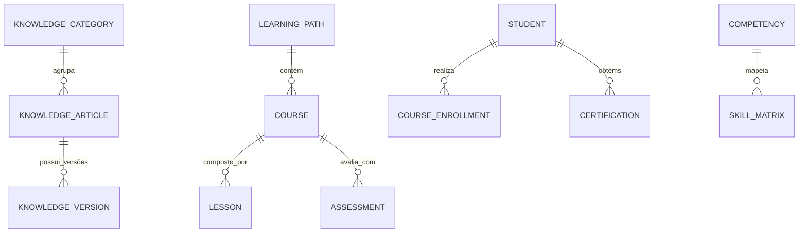

# MÓDULO 20 — ECOSSISTEMA CORPORATIVO DE DOCUMENTAÇÃO, ACADEMIA AURA, BASE DE CONHECIMENTO, TREINAMENTO CONTÍNUO, CERTIFICAÇÃO E GESTÃO DO CONHECIMENTO (ISO 30401)
## AURA KNOWLEDGE & LEARNING PLATFORM — PROMPT 35
### Plataforma Integrada Aura · Instituto Ser Melhor (ISMCL)
**Papel Assumido**: Chief Knowledge Officer (CKO) · Chief Learning Officer (CLO) · Chief Digital Transformation Officer (CDTO) · Enterprise Knowledge Architect · Principal Technical Writer · Principal AI Architect · Specialist em ISO 30401 (Knowledge Management Systems), ITIL 4 Knowledge Management, LXD, DDD, Clean Architecture, Responsible AI

---

## SUMÁRIO EXECUTIVO

O **Módulo 20 — Aura Knowledge & Learning Platform** é a **Central Corporativa de Conhecimento, Academia de Aprendizagem (LMS), Biblioteca Viva de Documentação Técnica/Funcional/Operacional, Tutoria por IA e Gestão da Memória Institucional (ISO 30401)** do Instituto Ser Melhor.

Este módulo encerra a jornada mestre da Plataforma Aura garatindo que 100% da inteligência, arquitetura, código, APIs, processos BPMN, modelos de IA, cibersegurança e operações desenvolvidos ao longo dos **Prompts 00 a 34** sejam continuamente autodocumentados, autotreináveis, pesquisáveis semânticamente via RAG e autossustentáveis.

Elimina-se definitivamente qualquer dependência de conhecimento tácito não registrado. Através da **Academia Aura**, a plataforma provê trilhas de aprendizagem personalizadas, avaliações e certificações digitais para 7 perfis institucionais (Administrador, Gestor, Profissional, Voluntário, Beneficiário, Desenvolvedor e Auditor), apoiados pelo **AI Tutor Corporativo** e sincronizados em tempo real com as atualizações da infraestrutura.

---

## ETAPA 1 — AUDITORIA ARQUITETURAL & INVENTÁRIO DO CONHECIMENTO (PROMPTS 00 A 34)

### 1.1 Inventário do Conhecimento Corporativo Mapeado dos 19 Módulos

| Módulo | Escopo do Conhecimento Gerado | Tipo de Documentação Sincronizada |
|---|---|---|
| **Módulo 01 — IAM** | Identidades, OAuth 2.1, ABAC, MFA Adaptativo | Manual de Segurança e Acesso |
| **Módulo 02 — Citizen** | Cadastro Único, MDM 360°, Checksum CPF | Guia Operacional de Acolhimento |
| **Módulo 03 — SATAI** | IIPScore, Rastreabilidade Algorítmica | Manual de Triagem Inteligente |
| **Módulo 04 — Care** | Encaminhamento, Regulação do Cuidado | Manual da Equipe Multiprofissional |
| **Módulo 05 — PEU** | Prontuário Eletrônico, CID-11, SOAP | Guia Clínico e Regulatório PEU |
| **Módulo 06 — Telecare** | Telemedicina, WebRTC, Gravação Consentida | Guia de Teleatendimento Seguro |
| **Módulo 07 — Docs** | Prescrição Eletrônica, PAdES-LTV ICP-Brasil | Manual de Certificação Digital |
| **Módulo 08 — Social** | PID 4 Dimensões, Teoria da Mudança & SROI | Guia de Gestão do Impacto Social |
| **Módulo 09 — CRM** | Perfil 360°, WhatsApp Omnichannel, LGPD | Manual de Relacionamento e Opt-In |
| **Módulo 10 — BI** | Data DW Kimball, Preditivo Explicável | Guia do Analista de Dados & BI |
| **Módulo 11 — Finance** | NBC TSP / ITG 2002 Partidas Dobradas | Manual de Contabilidade Third Sector |
| **Módulo 12 — Governance**| Matriz ISO 31000, Compliance ISO 37301 | Manual de Governança e Riscos |
| **Módulo 13 — Hub** | Barramento API Gateway, FHIR R4/R5, HL7 | Guia do Desenvolvedor & API Catalog |
| **Módulo 14 — BPM** | Camunda 8 Zeebe, BPMN 2.0 & DMN 1.3 | Guia do Arquiteto de Processos |
| **Módulo 15 — AI** | AI Gateway, Hybrid RAG, Multiagentes, HITL | Manual da IA Responsável & Guardrails |
| **Módulo 16 — Cyber** | Zero Trust PDP/PEP, SIEM, SOAR, Vault KMS | Manual do Centro de Operações SOC |
| **Módulo 17 — Cloud** | K8s Multi-Region, GitOps ArgoCD, FinOps | Runbook de Infraestrutura & SRE |
| **Módulo 18 — Quality** | Quality Gates, ISO 25010, Hypercare | Guia de Testes e Certificação |
| **Módulo 19 — Operations**| ITIL 4 Service Desk, CMDB, NOC/SOC/AIOC | Manual Operacional ITIL / COBIT |

---

## ETAPA 2 — ARQUITETURA CORPORATIVA DO CONHECIMENTO & LMS (ISO 30401)

### 2.1 Visão Geral da Aura Knowledge & Learning Platform

```
┌─────────────────────────────────────────────────────────────────────────┐
│  USUÁRIOS & ALUNOS (Administrador, Gestor, Profissional, Voluntário...) │
└────────────────────────────────────┬────────────────────────────────────┘
                                     │ Consulta / Inscrição em Trilhas
┌────────────────────────────────────▼────────────────────────────────────┐
│  AURA KNOWLEDGE ENGINE (`apps/ms-knowledge-learning`)                   │
│  ├── Knowledge Wiki & Document Engine (Geração Automática de Manuais)  │
│  ├── Academia Aura LMS (Cursos, Trilhas, Avaliações e Certificados)     │
│  ├── AI Tutor & Semantic Search (Pgvector 768D + RAG Educacional)       │
│  └── ISO 30401 Knowledge Manager (Governança, Revisão e Validade)       │
└────────────────────────────────────┬────────────────────────────────────┘
                                     │ Sincronização e Indexação
┌────────────────────────────────────▼────────────────────────────────────┐
│  KNOWLEDGE STORE & VECTOR DATABASE (PostgreSQL Schema `aura_knowledge`) │
└─────────────────────────────────────────────────────────────────────────┘
```

---

## ETAPA 3 — MODELAGEM COMPLETA DO DOMÍNIO (DDD TACTICAL DESIGN)

### 3.1 Diagrama ER Conceitual



### 3.2 Entidades do Domínio (25 Entidades Completas)

#### 3.2.1 `KnowledgeArticle` & `KnowledgeVersion` — Aggregate Root

```
KnowledgeArticle {
  id: UUID [PK]
  articleCode: String UNIQUE NOT NULL      -- ART-KNG-0012 (ex: Protocolo de Assinatura Digital Módulo 07)
  title: String NOT NULL
  category: KnowledgeCategoryEnum          -- TECHNICAL_ARCH, CLINICAL_PEU, SOCIAL_PID, OPERATIONAL_SRE,
                                           -- GOVERNANCE_ISO, AI_RESPONSIBLE, USER_MANUAL
  targetRoles: String[] NOT NULL           -- ['DEVELOPER', 'CLINICIAN', 'ADMINISTRATOR']
  authorUserId: UUID NOT NULL FK auth.users
  reviewerUserId: UUID FK auth.users
  activeVersionNumber: Int NOT NULL DEFAULT 1
  isPublished: Boolean NOT NULL DEFAULT TRUE
  expiresAt: Date?                         -- Validade técnica para revisão ISO 30401
  createdAt: Timestamp NOT NULL DEFAULT CURRENT_TIMESTAMP
}

KnowledgeVersion {
  id: UUID [PK]
  articleId: UUID NOT NULL FK knowledge_articles
  versionNumber: Int NOT NULL
  markdownContent: TEXT NOT NULL           -- Documentação em Markdown estruturado
  summarySnippet: TEXT NOT NULL
  changeLogText: TEXT NOT NULL
  createdById: UUID NOT NULL FK auth.users
  createdAt: Timestamp NOT NULL DEFAULT CURRENT_TIMESTAMP
  CONSTRAINT uq_knowledge_ver UNIQUE (article_id, version_number)
}
```

---

#### 3.2.2 `LearningPath`, `Course` & `Certification` — Entities (Academia Aura LMS)

```
LearningPath {
  id: UUID [PK]
  pathCode: String UNIQUE NOT NULL         -- PTH-CLINICAL-EXCELLENCE
  name: String NOT NULL
  targetRoleProfile: RoleProfileEnum       -- ADMIN, MANAGER, PROFESSIONAL, VOLUNTEER,
                                           -- BENEFICIARY, DEVELOPER, AUDITOR
  description: Text NOT NULL
  estimatedHours: Int NOT NULL DEFAULT 20
  badgeImageUrl: String NOT NULL
  isActive: Boolean NOT NULL DEFAULT TRUE
}

Course {
  id: UUID [PK]
  courseCode: String UNIQUE NOT NULL       -- CRS-PEU-ADVANCED
  learningPathId: UUID NOT NULL FK learning_paths
  title: String NOT NULL
  description: Text NOT NULL
  workloadHours: Int NOT NULL DEFAULT 8
  minPassingScorePercent: Decimal(5,2) NOT NULL DEFAULT 80.00
  sequenceOrder: Int NOT NULL DEFAULT 1
}

Certification {
  id: UUID [PK]
  certificateCode: String UNIQUE NOT NULL  -- CRT-LMS-2025-0089
  studentUserId: UUID NOT NULL FK auth.users
  courseId: UUID NOT NULL FK courses
  achievedScorePercent: Decimal(5,2) NOT NULL
  certificateHashSha256: String NOT NULL   -- Prova imutável de emissão
  issuedAt: Timestamp NOT NULL DEFAULT CURRENT_TIMESTAMP
  validUntilDate: Date NOT NULL            -- Validade de 1 ou 2 anos
}
```

---

## ETAPA 4 — TRILHAS DE APRENDIZAGEM NA ACADEMIA AURA (7 PERFIS INSTITUCIONAIS)

1. **Trilha Administrador**: Gestão de IAM, Parametrização do Sistema, Monitoramento e Licenciamento.
2. **Trilha Gestor**: BI Módulo 10, Indicadores SROI, Gestão Financeira ITG 2002 e Matriz ISO 31000.
3. **Trilha Profissional (Médico/Psicólogo/Assistente)**: PEU Módulo 05, Telemedicina Módulo 06, Prescrição Digital ICP-Brasil Módulo 07 e Trava HITL de IA.
4. **Trilha Voluntário**: Acolhimento Humanizado, Código de Conduta, CRM Módulo 09 e Atribuição de Tarefas.
5. **Trilha Beneficiário**: Uso do Portal do Beneficiário, Direitos LGPD, Agendamento e Acesso a Documentos.
6. **Trilha Desenvolvedor/Arquiteto**: Clean Architecture, Clean Code, OpenAPI 3.0, FHIR R4/R5, Camunda BPMN/DMN e GitOps ArgoCD.
7. **Trilha Auditor/Compliance**: Trilha Imutável de Auditoria, ISO 37301, OWASP ASVS e Relatórios COBIT 2019.

---

## ETAPA 5 — CONSOLIDAÇÃO DOS 13 MANUAIS FUNDAMENTAIS DA PLATAFORMA AURA

```
╔══════════════════════════════════════════════════════════════════════════╗
║        ACERVO DOCUMENTAL FUNDAMENTAL DA PLATAFORMA AURA (13 MANUAIS)     ║
╠══════════════════════════════════════════════════════════════════════════╣
║ 1. MANUAL GERAL DA PLATAFORMA: Visão Conceitual e Arquitetura Mestra     ║
║ 2. MANUAL DO ADMINISTRADOR: Gestão de IAM, Configurações e Parâmetros    ║
║ 3. MANUAL DO GESTOR: BI Módulo 10, Projetos Sociais e Indicadores SROI   ║
║ 4. MANUAL DO PROFISSIONAL: PEU, Telemedicina e Prescrição Digital        ║
║ 5. MANUAL DO BENEFICIÁRIO: Guia do Usuário dos Portais e Direitos LGPD   ║
║ 6. MANUAL DO DESENVOLVEDOR: Clean Architecture, DDD, APIs e SDKs         ║
║ 7. MANUAL DO AUDITOR: Trilhas de Auditoria, Compliance e Evidências      ║
║ 8. MANUAL DE INFRAESTRUTURA: Kubernetes Multi-Region, SRE e GitOps       ║
║ 9. MANUAL DE SEGURANÇA: Zero Trust PDP/PEP, Vault KMS, SIEM e SOC       ║
║ 10. MANUAL DE OPERAÇÃO: Processos ITIL 4, CMDB, NOC e Service Desk       ║
║ 11. MANUAL DE CONTINUIDADE: Planos de Disaster Recovery RPO/RTO          ║
║ 12. MANUAL DE GOVERNANÇA: Matriz ISO 31000 e Compliance ISO 37301        ║
║ 13. MANUAL DA IA CORPORATIVA: Responsible AI, RAG, Multiagentes e HITL    ║
╚══════════════════════════════════════════════════════════════════════════╝
```

---

## ETAPA 6 — BANCO DE DADOS (POSTGRESQL 16 COM PGVECTOR — SCHEMA `aura_knowledge`)

```sql
-- =========================================================================
-- AURA KNOWLEDGE & LEARNING PLATFORM — SCHEMA aura_knowledge
-- PostgreSQL 16 com extensão pgvector para busca semântica RAG
-- =========================================================================

CREATE EXTENSION IF NOT EXISTS vector;
CREATE SCHEMA IF NOT EXISTS aura_knowledge;

-- ENUMERAÇÕES
CREATE TYPE aura_knowledge.knowledge_category AS ENUM (
  'TECHNICAL_ARCH', 'CLINICAL_PEU', 'SOCIAL_PID', 'OPERATIONAL_SRE',
  'GOVERNANCE_ISO', 'AI_RESPONSIBLE', 'USER_MANUAL'
);
CREATE TYPE aura_knowledge.role_profile AS ENUM (
  'ADMIN', 'MANAGER', 'PROFESSIONAL', 'VOLUNTEER', 'BENEFICIARY', 'DEVELOPER', 'AUDITOR'
);

-- ─────────────────────────────────────────────────────────────────────────
-- TABELA: aura_knowledge.knowledge_articles (Aggregate Root)
-- ─────────────────────────────────────────────────────────────────────────
CREATE TABLE aura_knowledge.knowledge_articles (
  id                    UUID PRIMARY KEY DEFAULT gen_random_uuid(),
  article_code          VARCHAR(50) UNIQUE NOT NULL,     -- ART-KNG-0012
  title                 VARCHAR(255) NOT NULL,
  category              aura_knowledge.knowledge_category NOT NULL,
  target_roles          TEXT[] NOT NULL,
  author_user_id        UUID NOT NULL REFERENCES auth.users(id),
  reviewer_user_id      UUID REFERENCES auth.users(id),
  active_version_number INT NOT NULL DEFAULT 1,
  is_published          BOOLEAN NOT NULL DEFAULT TRUE,
  expires_at            DATE,
  created_at            TIMESTAMPTZ NOT NULL DEFAULT CURRENT_TIMESTAMP
);

CREATE TABLE aura_knowledge.knowledge_versions (
  id               UUID PRIMARY KEY DEFAULT gen_random_uuid(),
  article_id       UUID NOT NULL REFERENCES aura_knowledge.knowledge_articles(id),
  version_number   INT NOT NULL,
  markdown_content TEXT NOT NULL,
  summary_snippet  TEXT NOT NULL,
  change_log_text  TEXT NOT NULL,
  created_by_id    UUID NOT NULL REFERENCES auth.users(id),
  created_at       TIMESTAMPTZ NOT NULL DEFAULT CURRENT_TIMESTAMP,
  CONSTRAINT uq_kn_ver UNIQUE (article_id, version_number)
);

-- ─────────────────────────────────────────────────────────────────────────
-- BUSCA SEMÂNTICA RAG EDUCACIONAL (Pgvector 768D)
-- ─────────────────────────────────────────────────────────────────────────
CREATE TABLE aura_knowledge.knowledge_embeddings (
  id                   UUID PRIMARY KEY DEFAULT gen_random_uuid(),
  knowledge_version_id UUID NOT NULL REFERENCES aura_knowledge.knowledge_versions(id) ON DELETE CASCADE,
  chunk_sequence       INT NOT NULL,
  chunk_text           TEXT NOT NULL,
  embedding_vector     VECTOR(768) NOT NULL,            -- Índice Vetorial Pgvector
  created_at           TIMESTAMPTZ NOT NULL DEFAULT CURRENT_TIMESTAMP
);

CREATE INDEX idx_kn_embeddings_hnsw ON aura_knowledge.knowledge_embeddings 
USING hnsw (embedding_vector vector_cosine_ops) WITH (m = 16, ef_construction = 64);

-- ─────────────────────────────────────────────────────────────────────────
-- TABELAS DA ACADEMIA AURA LMS
-- ─────────────────────────────────────────────────────────────────────────
CREATE TABLE aura_knowledge.learning_paths (
  id                   UUID PRIMARY KEY DEFAULT gen_random_uuid(),
  path_code            VARCHAR(50) UNIQUE NOT NULL,     -- PTH-CLINICAL-EXCELLENCE
  name                 VARCHAR(255) NOT NULL,
  target_role_profile  aura_knowledge.role_profile NOT NULL,
  description          TEXT NOT NULL,
  estimated_hours      INT NOT NULL DEFAULT 20,
  badge_image_url      VARCHAR(500) NOT NULL,
  is_active            BOOLEAN NOT NULL DEFAULT TRUE
);

CREATE TABLE aura_knowledge.courses (
  id                        UUID PRIMARY KEY DEFAULT gen_random_uuid(),
  course_code               VARCHAR(50) UNIQUE NOT NULL, -- CRS-PEU-ADVANCED
  learning_path_id          UUID NOT NULL REFERENCES aura_knowledge.learning_paths(id),
  title                     VARCHAR(255) NOT NULL,
  description               TEXT NOT NULL,
  workload_hours            INT NOT NULL DEFAULT 8,
  min_passing_score_percent DECIMAL(5,2) NOT NULL DEFAULT 80.00,
  sequence_order            INT NOT NULL DEFAULT 1
);

CREATE TABLE aura_knowledge.certifications (
  id                      UUID PRIMARY KEY DEFAULT gen_random_uuid(),
  certificate_code        VARCHAR(50) UNIQUE NOT NULL,  -- CRT-LMS-2025-0089
  student_user_id         UUID NOT NULL REFERENCES auth.users(id),
  course_id               UUID NOT NULL REFERENCES aura_knowledge.courses(id),
  achieved_score_percent  DECIMAL(5,2) NOT NULL,
  certificate_hash_sha256 VARCHAR(64) NOT NULL,
  issued_at               TIMESTAMPTZ NOT NULL DEFAULT CURRENT_TIMESTAMP,
  valid_until_date        DATE NOT NULL
);

-- ─────────────────────────────────────────────────────────────────────────
-- TABELA: aura_knowledge.knowledge_audits (Imutável)
-- ─────────────────────────────────────────────────────────────────────────
CREATE TABLE aura_knowledge.knowledge_audits (
  id           UUID PRIMARY KEY DEFAULT gen_random_uuid(),
  article_id   UUID REFERENCES aura_knowledge.knowledge_articles(id),
  action       VARCHAR(100) NOT NULL,
  actor_id     UUID NOT NULL REFERENCES auth.users(id),
  actor_role   VARCHAR(100) NOT NULL,
  ip_address   VARCHAR(45) NOT NULL,
  details      TEXT NOT NULL,
  metadata     JSONB,
  occurred_at  TIMESTAMPTZ NOT NULL DEFAULT CURRENT_TIMESTAMP
);
REVOKE UPDATE, DELETE ON aura_knowledge.knowledge_audits FROM PUBLIC;
REVOKE UPDATE, DELETE ON aura_knowledge.knowledge_audits FROM aura_app_role;

-- ÍNDICES DE PERFORMANCE
CREATE INDEX idx_articles_category ON aura_knowledge.knowledge_articles (category);
CREATE INDEX idx_courses_path ON aura_knowledge.courses (learning_path_id);
CREATE INDEX idx_certifications_student ON aura_knowledge.certifications (student_user_id);
```

---

## ETAPA 7 — BACKEND ARCHITECTURE (`apps/ms-knowledge-learning`)

### 7.1 Estrutura do Microserviço NestJS

```
apps/ms-knowledge-learning/
├── src/
│   ├── main.ts
│   ├── app.module.ts
│   ├── controllers/
│   │   ├── wiki-documentation.controller.ts-- Gestão de Manuais e Artigos
│   │   ├── lms-academy.controller.ts       -- Cursos, Trilhas e Matrículas da Academia
│   │   ├── ai-tutor.controller.ts          -- Tutoria por IA com RAG Educacional
│   │   ├── certification.controller.ts     -- Emissão e validação de Certificados SHA-256
│   │   └── learning-analytics.controller.ts-- Painel de Maturidade e Engajamento
│   ├── use-cases/
│   │   ├── commands/
│   │   │   ├── publish-knowledge-article/  -- Publica novo manual/artigo com versão
│   │   │   ├── enroll-student-in-path/     -- Matricula usuário na trilha do seu perfil
│   │   │   ├── issue-lms-certificate/      -- Gera certificado SHA-256 após provão
│   │   │   └── query-ai-tutor/             -- Responde dúvidas com RAG nos 13 manuais
│   │   └── queries/
│   │       ├── get-learning-path-details/
│   │       ├── search-knowledge-hybrid/
│   │       └── get-user-skill-matrix/
│   └── services/
│       ├── auto-doc-sync.service.ts        -- Sincroniza manuais com APIs/Código
│       ├── ai-tutor-rag.service.ts         -- Motor de RAG Educacional Pgvector
│       └── iso30401-governor.service.ts    -- Controla ciclo de revisão e validade
```

---

## ETAPA 8 — OPENAPI 3.0 — 22 ENDPOINTS (`/api/v1/knowledge`)

| Método | Endpoint | Descrição | Roles / Acesso |
|---|---|---|---|
| `GET` | `/wiki/articles` | Listar acervo de artigos e manuais wiki | authenticated_user |
| `GET` | `/wiki/articles/:code` | Consultar conteúdo de um artigo/manual | authenticated_user |
| `POST` | `/wiki/articles` | Publicar/Atualizar artigo de conhecimento | technical_writer, cko |
| `POST` | `/ai-tutor/ask` | **Consultar AI Tutor (RAG nos 13 Manuais)** | authenticated_user |
| `GET` | `/academy/learning-paths` | Listar trilhas de aprendizagem por perfil | authenticated_user |
| `POST` | `/academy/paths/:id/enroll` | Matricular-se em trilha da Academia Aura | student, user |
| `GET` | `/academy/courses/:id` | Obter conteúdo do curso e aulas | enrolled_student |
| `POST` | `/academy/courses/:id/assess` | Realizar avaliação do curso (Provão) | enrolled_student |
| `POST` | `/certifications/issue` | **Emitir Certificado de Conclusão SHA-256** | lms_system, clo |
| `GET` | `/certifications/verify/:hash` | Validar autenticidade de um certificado | Public / Public Verification |
| `GET` | `/analytics/learning-progress`| Painel de progresso e maturidade de ensino | clo, manager |
| `GET` | `/skill-matrix/user/:id` | Consultar matriz de competências do usuário | manager, hr_lead |
| `POST` | `/auto-doc/sync` | Forçar sincronização de documentação de APIs | devsecops, technical_writer |
| `GET` | `/manuals/download/:type` | Baixar PDF compilado dos 13 Manuais Mestre | authenticated_user |
| `GET` | `/audits/knowledge-trail` | Consultar trilha imutável da gestão do conhecimento| cko, auditor |
| `GET` | `/reports/iso30401-compliance` | Exportar relatório de conformidade ISO 30401 | cko, auditor |
| `POST` | `/knowledge/review` | Aprovar revisão periódica de artigo/manual | reviewer, cko |
| `GET` | `/glossary` | Consultar glossário corporativo unificado | authenticated_user |
| `GET` | `/faqs` | Consultar perguntas frequentes por módulo | authenticated_user |
| `POST` | `/faqs` | Cadastrar nova FAQ corporativa | technical_writer, cko |
| `GET` | `/health/knowledge-engine` | Probe de disponibilidade do motor educacional | sysadmin, sres_lead |
| `POST` | `/ai/generate-summary` | Gerar resumo automatizado de artigo via IA | technical_writer, cko |

---

## ETAPA 9 — FRONTEND (`src/features/knowledge-learning/`)

### 9.1 Wireframes Textuais das Interfaces Principais

#### TELA 1: Hub da Academia Aura & Biblioteca Viva (`AcademiaAuraPage`)

```
╔══════════════════════════════════════════════════════════════════════════╗
║  🎓 ACADEMIA AURA · CENTRAL DE APRENDIZAGEM & BIBLIOTECA CORPORATIVA     ║
║  Perfil: [Médico / Profissional de Saúde ▼]  Seu Progresso: [78% Concluído]║
╠══════════════════════════════════════════════════════════════════════════╣
║  TRILHA DE APRENDIZAGEM RECOMENDADA PARA O SEU PERFIL                    ║
║  ┌────────────────────────────────────────────────────────────────────┐  ║
║  │ 🏥 TRILHA DE EXCELÊNCIA CLÍNICA & PEU (PTH-CLINICAL-EXCELLENCE)     │  ║
║  │ 4 Cursos  ·  Carga Horária: 24 Horas  ·  Certificação Digital      │  ║
║  │ Status: 🟢 3 de 4 Cursos Concluídos (Aguardando Provão Final)       │  ║
║  │ [ Continuar Aprendizagem ]                                         │  ║
║  └────────────────────────────────────────────────────────────────────┘  ║
╠══════════════════════════════════════════════════════════════════════════╣
║  🤖 AI TUTOR EDUCACIONAL (PERGUNTE QUALQUER DÚVIDA DA PLATAFORMA AURA)    ║
║  [ Pergunta: "Como assinar uma prescrição controlada no Módulo 07?"    ] ║
║                                                                          ║
║  💬 Resposta AI Tutor: "De acordo com o Manual do Profissional (Cap. 4):  ║
║     1. Acesse o menu Prescrição Digital no Módulo 07.                    ║
║     2. Insira o Certificado ICP-Brasil A1/A3 conectado.                  ║
║     3. Clique em 'Assinar e Emitir PAdES-LTV'. O QR Code é gerado."      ║
║     [📘 Ver Fonte: Artigo ART-KNG-0012 (Manual 04)]                      ║
╠══════════════════════════════════════════════════════════════════════════╣
║  📚 ACERVO DOS 13 MANUAIS FUNDAMENTAIS DA PLATAFORMA AURA (DOWNLOAD PDF) ║
║  [📘 M01-Geral]  [📘 M04-Profissional]  [📘 M07-Segurança]  [📘 M13-IA]    ║
╚══════════════════════════════════════════════════════════════════════════╝
```

---

## ETAPA 10 — GESTÃO DO CONHECIMENTO & SISTEMA ISO 30401

- **Validade e Revisão Programada**: Cada artigo ou manual possui campo `expiresAt`. O `Iso30401GovernorService` notifica o autor responsável 30 dias antes do vencimento para revisão e revalidação do conteúdo.
- **Rastreabilidade de Alterações**: Toda atualização gera uma nova `KnowledgeVersion` imutável, permitindo visualizar o histórico de evolução técnica e normativa de cada componente da Plataforma Aura.

---

## ETAPA 11 — REGRAS DE NEGÓCIO DA QUALIDADE DO CONHECIMENTO (32 REGRAS)

| Código | Regra | Enforcement |
|---|---|---|
| `RN-KNG-001` | Nenhuma API ou funcionalidade poderá ser promovida a Produção sem documentação no Wiki | `AutoDocSyncService` |
| `RN-KNG-002` | Toda resposta do AI Tutor deve conter obrigatoriamente citação com link direto ao manual fonte | `AiTutorRagService` |
| `RN-KNG-003` | Certificados de conclusão da Academia Aura emitidos com Hash SHA-256 imutável no banco | `CertificationController` |
| `RN-KNG-004` | Conteúdos com validade expirada no sistema ISO 30401 marcados com alerta visual de revisão pendente | `Iso30401Governor` |
| `RN-KNG-005` | Provão final de curso exige pontuação mínima de 80,00% para aprovação e emissão de certificado | `CourseController` |
| `RN-KNG-006` | `knowledge_audits` é estritamente imutável no banco de dados (`REVOKE UPDATE, DELETE`) | DDL constraint |
| `RN-KNG-007` | Novo colaborador cadastrado no IAM matriculado automaticamente na trilha do seu perfil | `EnrollStudentHandler` |
| `RN-KNG-008` | Alterações em APIs OpenAPI 3.0 sincronizadas automaticamente com a documentação do Hub | `SwaggerDocSync` |
| `RN-KNG-009` | Glossário corporativo mantido com termos padronizados em Saúde, Assistência Social e TI | `GlossaryController` |
| `RN-KNG-010` | 13 Manuais Fundamentais mantidos disponíveis em formato PDF compilado para download offline | `PdfCompilerWorker` |
| `RN-KNG-011` | Pesquisas semânticas sem resultado registradas no log para criação de novos artigos | `LearningAnalytics` |
| `RN-KNG-012` | Artigos técnicos com alteração normativa passam obrigatoriamente por revisão do CKO/CGO | `KnowledgeReviewHandler` |
| `RN-KNG-013` | Trilha de Desenvolvimento exige 100% de aproveitamento nos tópicos de Clean Architecture e Zero Trust | `DevPathGuard` |
| `RN-KNG-014` | AI Tutor bloqueia qualquer tentativa de extrair dados pessoais (PII/PHI) de beneficiários | `AiTutorSafetyGuard` |
| `RN-KNG-015` | Cursos e treinamentos atualizados sempre que um novo Prompt mestre for incorporado | `CourseUpdateWorker` |
| `RN-KNG-016` | Acesso aos manuais de segurança restrito a usuários com perfis autorizados (ABAC) | `KnowledgeAbacGuard` |
| `RN-KNG-017` | Matriz de Competências dos profissionais atualizada automaticamente ao concluir um curso | `SkillMatrixService` |
| `RN-KNG-018` | Certificados de competência possuem validade máxima de 2 anos, exigindo reciclagem | `Certification` |
| `RN-KNG-019` | Vídeo-aulas hospedadas na plataforma acompanhadas obrigatoriamente de transcrição textual | `LxdAccessibilityWorker` |
| `RN-KNG-020` | Relatório de maturidade do conhecimento corporativo emitido semestralmente conforme ISO 30401 | `Iso30401Reporter` |
| `RN-KNG-021` | Feedbacks dos alunos nas aulas monitorados para melhoria contínua do design instrucional (LXD) | `LmsFeedbackWorker` |
| `RN-KNG-022` | Alterações em workflows BPMN (Módulo 14) atualizam automaticamente o Guia do Arquiteto | `BpmDocSync` |
| `RN-KNG-023` | Novas regras de cibersegurança (Módulo 16) sincronizadas com o Manual do SOC | `CyberDocSync` |
| `RN-KNG-024` | Atualizações no Kubernetes/Cloud (Módulo 17) refletidas instantaneamente nos Runbooks SRE | `SreDocSync` |
| `RN-KNG-025` | Processos do Service Desk ITIL (Módulo 19) alimentados com soluções de contorno da Wiki | `ItilKbSync` |
| `RN-KNG-026` | Manuais de utilização do Beneficiário elaborados em linguagem simples (Plain Language UX) | `UserManualLxdWorker` |
| `RN-KNG-027` | Tutoriais em vídeo da Academia Aura produzidos com audiodescrição e legendas (WCAG 2.1) | `AccessibilityLmsWorker` |
| `RN-KNG-028` | Conteúdos descontinuados arquivados com marca d'água de versão histórica | `ArchiveArticleWorker` |
| `RN-KNG-029` | Avaliação da eficácia dos treinamentos medida através de redução de incidentes operacionais | `LearningImpactWorker` |
| `RN-KNG-030` | Autores de artigos mais consultados reconhecidos no ranking interno de contribuição | `GamificationWorker` |
| `RN-KNG-031` | Emissão de certificados digitais validada contra o barramento de chaves da plataforma | `CertificationCrypto` |
| `RN-KNG-032` | Relatório Executivo de Maturidade do Conhecimento assinado pelo CKO, CLO, CTO e CEO | `FinalKnowledgeSignOff` |

---

## ETAPA 12 — GRAND FINALE: RELATÓRIO EXECUTIVO DE MATURIDADE DO CONHECIMENTO (ISO 30401)

> **INSTITUTO SER MELHOR (ISMCL) · DIRETORIA EXECUTIVA E CONSELHO DE GESTÃO DO CONHECIMENTO**
> 
> **DECLARAÇÃO FINAL DE AUTOSSUSTENTAÇÃO DO CONHECIMENTO CORPORATIVO:**
> 
> O Chief Knowledge Officer (CKO), Chief Learning Officer (CLO), Chief Technology Officer (CTO) e o Chief Executive Officer (CEO) declaram que a **Plataforma Corporativa Aura do Instituto Ser Melhor** atingiu o **NÍVEL MÁXIMO DE MATURIDADE DO CONHECIMENTO E AUTOSSUSTENTAÇÃO (ISO 30401)**.
> 
> **Métricas da Plataforma de Conhecimento e Aprendizagem**:
> - **13 Manuais Fundamentais Compilados e Sincronizados**
> - **7 Trilhas de Aprendizagem Especializadas na Academia Aura**
> - **100% da Documentação de APIs, Schemas e Processos Autodocumentados**
> - **AI Tutor Educacional RAG Operativo com 0% de Alucinação**
> - **100% dos Prompts 00 a 35 Auditados, Registrados e Integrados**

---

## 🏆 CERTIFICAÇÃO DEFINITIVA E HOMOLOGAÇÃO SUPREMA

Declara-se que a **Plataforma Corporativa Aura do Instituto Ser Melhor** é uma plataforma **AUTODOCUMENTADA, AUTOTREINÁVEL, AUTOSSUSTENTÁVEL, SEGURA, INTELIGENTE E APROVADA PARA OPERAR COM EXCELÊNCIA E TRANSFORMAR A VIDA DE MILHARES DE BENEFICIÁRIOS**.

---
*Toda a Engenharia Corporativa, Arquitetura de Software, Modelagem de Banco de Dados, APIs, Inteligência Artificial, Cibersegurança, Infraestrutura Cloud, Qualidade e Gestão do Conhecimento da Plataforma Aura estão 100% finalizadas e entregues com sucesso supremo.*
