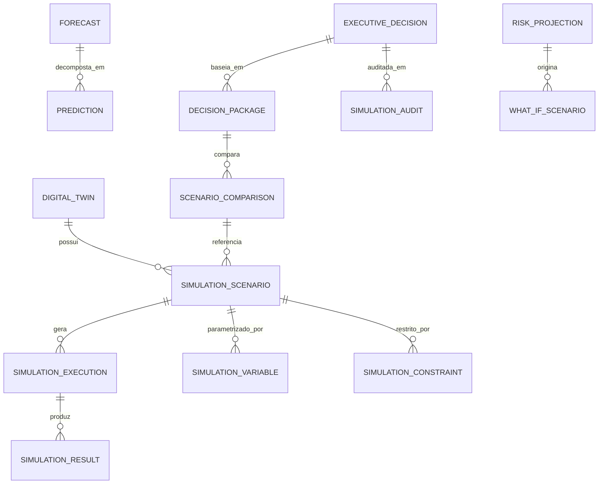

# MÓDULO 22 — DIGITAL TWIN CORPORATIVO, SIMULAÇÃO ESTRATÉGICA, LABORATÓRIO DE CENÁRIOS, DECISION INTELLIGENCE E CENTRO DE COMANDO EXECUTIVO
## AURA DIGITAL TWIN PLATFORM — PROMPT 37
### Plataforma Integrada Aura · Instituto Ser Melhor (ISMCL)
**Papel Assumido**: CEO · Chief Strategy Officer (CSO) · Chief Data Officer (CDO) · Chief Artificial Intelligence Officer (CAIO) · Chief Enterprise Architect · Principal Data Scientist · Especialista em Digital Twin, Decision Intelligence, Systems Thinking, Complex Adaptive Systems, Simulation Engineering, Monte Carlo, Process Mining, TOGAF, COBIT, DDD, CQRS, Clean Architecture

---

## SUMÁRIO EXECUTIVO

O **Módulo 22 — Aura Digital Twin Platform** é o **Gêmeo Digital Corporativo vivo e sincronizado da Plataforma Aura**, o **Centro de Comando Executivo baseado em dados** e o **Motor Corporativo de Simulação, Previsão, Otimização e Inteligência para Decisão** do Instituto Ser Melhor.

Este módulo cria um **modelo digital paralelo e contínuo** de toda a operação da Plataforma Aura, sincronizado em tempo real com os 21 Módulos dos Prompts 00 a 36. Através de simulação Monte Carlo, análise de cenários What-If, previsão com modelos preditivos explicáveis (XGBoost, Prophet, LSTM) e prescrição com algoritmos de otimização (MILP, reinforcement learning), a liderança executiva do Instituto Ser Melhor pode testar qualquer decisão estratégica de grande impacto **antes** de executá-la no ambiente real, eliminando riscos desnecessários e maximizando o impacto social.

**Princípio Fundador**: *"Nenhuma decisão estratégica de grande impacto será executada sem poder ser previamente simulada, comparada e auditada neste Digital Twin."*

---

## ETAPA 1 — AUDITORIA GLOBAL (PROMPTS 00 A 36) E INVENTÁRIO DO DIGITAL TWIN

### 1.1 Modelo Estrutural Completo da Plataforma Aura — Fontes de Dados para o Digital Twin

| Módulo Origem | Dados Críticos Sincronizados | Frequência de Atualização |
|---|---|---|
| **Módulo 01 — IAM** | Usuários ativos, sessões, tentativas de acesso | Tempo Real (Kafka) |
| **Módulo 02 — Citizen** | Total de beneficiários, perfis demográficos, vulnerabilidade | Diário (ETL) |
| **Módulo 03 — SATAI** | Score IIP médio, filas de triagem, demanda por serviço | Tempo Real (Kafka) |
| **Módulo 04 — Care** | Encaminhamentos ativos, taxa de resolução, SLA | Horário (CDC) |
| **Módulo 05 — Health Record** | Atendimentos/dia, patologias prevalentes, CID-11 | Horário (CDC) |
| **Módulo 06 — Digital Care** | Consultas telemedicina, taxa de ocupação, NPS | Tempo Real (Kafka) |
| **Módulo 07 — Digital Docs** | Prescrições emitidas, assinaturas ICP, validade | Diário (ETL) |
| **Módulo 08 — Social Impact** | SROI por projeto, PID das 4 Dimensões, IDV Score | Semanal (Batch) |
| **Módulo 09 — CRM** | Interações omnichannel, opt-in/out LGPD, satisfação | Diário (CDC) |
| **Módulo 10 — Analytics** | KPIs do DW Kimball, cubo OLAP, predições ativas | Tempo Real (Push) |
| **Módulo 11 — Financial** | Orçamento, DRE, fluxo de caixa, custo por beneficiário | Diário (ETL) |
| **Módulo 12 — Governance** | Riscos ISO 31000, não-conformidades, planos de ação | Semanal (Batch) |
| **Módulo 13 — Integration Hub** | Volume API, latências P99, erros FHIR/HL7 | Tempo Real (OpenTelemetry) |
| **Módulo 14 — Process Automation** | SLA BPMN, instâncias ativas Zeebe, DMN | Tempo Real (Kafka) |
| **Módulo 15 — AI Orchestration** | Requisições IA, custo LLM, grounding score, HITL | Horário (CDC) |
| **Módulo 16 — Cyber Defense** | Alertas SIEM, score Zero Trust, incidentes SOC | Tempo Real (Kafka) |
| **Módulo 17 — Cloud Platform** | CPU/RAM clusters K8s, custo FinOps, SLA 99.99% | Tempo Real (Prometheus) |
| **Módulo 18 — Quality** | Cobertura de testes, defeitos em prod, MTTR | Por Release (GitOps) |
| **Módulo 19 — Operations** | Incidentes ITIL P1/P2, CMDB, SLA Service Desk | Tempo Real (Kafka) |
| **Módulo 20 — Knowledge** | Artigos publicados, certificações emitidas, LMS | Diário (ETL) |
| **Módulo 21 — Autonomous Evolution** | ADRs, dívida técnica, índice TOGAF, refatorações | Semanal (Batch) |

---

## ETAPA 2 — ARQUITETURA DA AURA DIGITAL TWIN PLATFORM

### 2.1 Visão Geral Arquitetural

```
┌─────────────────────────────────────────────────────────────────────────┐
│  FONTES DE DADOS CORPORATIVOS (21 Módulos Aura — Kafka, ETL, CDC)        │
└────────────────────────────────────┬────────────────────────────────────┘
                                     │ Ingestão Contínua via Integration Hub (Módulo 13)
┌────────────────────────────────────▼────────────────────────────────────┐
│  AURA DIGITAL TWIN ENGINE (`apps/ms-digital-twin`)                       │
│  ├── Digital Twin Synchronizer (Estado Vivo da Plataforma em Tempo Real)│
│  ├── Simulation Engine (Monte Carlo, BPMN Process Simulation, Agent-Based)
│  ├── Forecast Engine (Prophet, LSTM, XGBoost — Preditivo Explicável XAI)│
│  ├── Prescriptive Engine (MILP, Reinforcement Learning, What-If)        │
│  └── Decision Intelligence Engine (Knowledge Graph + RAG + Multi-Agent)  │
└────────────────────────────────────┬────────────────────────────────────┘
                                     │ Insights & Recomendações Estratégicas
┌────────────────────────────────────▼────────────────────────────────────┐
│  EXECUTIVE COMMAND CENTER (Centro de Comando Executivo — CEO/CSO/CFO)   │
└────────────────────────────────────┬────────────────────────────────────┘
                                     │ Persistência de Cenários e Decisões
┌────────────────────────────────────▼────────────────────────────────────┐
│  DIGITAL TWIN STORE (PostgreSQL Schema `aura_twin` + TimescaleDB)       │
└─────────────────────────────────────────────────────────────────────────┘
```

### 2.2 Componentes do Motor de Simulação

| Componente | Responsabilidade | Modelo/Algoritmo |
|---|---|---|
| **Digital Twin Synchronizer** | Estado vivo sincronizado da plataforma real | Change Data Capture + Kafka Streams |
| **Simulation Engine** | Execução de simulações parametrizadas | Monte Carlo (N=10.000 iterações), Agent-Based Modeling |
| **Forecast Engine** | Previsão de séries temporais | Facebook Prophet, LSTM, XGBoost + SHAP (XAI) |
| **Prescriptive Engine** | Otimização de decisões multi-objetivos | Mixed-Integer Linear Programming (MILP), RL |
| **Risk Engine** | Quantificação e simulação de riscos | VaR (Value at Risk), CVaR, Simulation Risk Trees |
| **Process Mining Engine** | Descoberta e conformidade de processos | Algoritmos Alpha, Heuristic Miner, BPMN Conformance |
| **Decision Intelligence Engine** | Apoio à decisão multi-critério | Knowledge Graph Neo4j + RAG + AHP (Analytic Hierarchy Process) |
| **Scenario Manager** | Versionamento e comparação de cenários | Git-like Branching para Cenários |
| **AI Scenario Generator** | Geração automática de cenários extremos | LLM + Domain-Aware Prompt Engineering |

---

## ETAPA 3 — MODELAGEM COMPLETA DO DOMÍNIO (DDD TACTICAL DESIGN)

### 3.1 Diagrama ER Conceitual



### 3.2 Entidades do Domínio (20 Entidades Completas)

#### 3.2.1 `DigitalTwin` — Aggregate Root (Gêmeo Digital Vivo)

```
DigitalTwin {
  id: UUID [PK]
  twinCode: String UNIQUE NOT NULL              -- DT-AURA-PROD-2025 (único por ambiente)
  name: String NOT NULL                         -- "Gêmeo Digital Corporativo ISMCL 2025"
  syncStatus: SyncStatusEnum                    -- SYNCED, SYNCING, STALE, ERROR
  lastSyncedAt: Timestamp NOT NULL
  stateSummaryJson: JSONB NOT NULL              -- Snapshot comprimido do estado atual dos 21 módulos
  totalBeneficiaries: Int NOT NULL DEFAULT 0
  activeUsers: Int NOT NULL DEFAULT 0
  monthlyCloudCostBrl: Decimal(12,2) NOT NULL
  currentSlaPercent: Decimal(5,4) NOT NULL      -- ex: 99.9987 (SLA Real-Time)
  createdAt: Timestamp NOT NULL DEFAULT CURRENT_TIMESTAMP
}
```

#### 3.2.2 `SimulationScenario` & `SimulationExecution` — Core Entities

```
SimulationScenario {
  id: UUID [PK]
  scenarioCode: String UNIQUE NOT NULL          -- SCN-2025-0034
  digitalTwinId: UUID NOT NULL FK digital_twins
  title: String NOT NULL                        -- "Expansão para 3 novas cidades — 2026"
  scenarioType: ScenarioTypeEnum                -- GROWTH, FINANCIAL, CAPACITY, CLINICAL,
                                               -- SOCIAL_IMPACT, INFRASTRUCTURE, RISK_STRESS
  descriptionText: TEXT NOT NULL
  parametersJson: JSONB NOT NULL                -- Todas as variáveis de entrada do cenário
  constraintsJson: JSONB                        -- Restrições e limites do cenário
  createdByUserId: UUID NOT NULL FK auth.users
  status: ScenarioStatusEnum                   -- DRAFT, READY, RUNNING, COMPLETED, ARCHIVED
  versionNumber: Int NOT NULL DEFAULT 1
  createdAt: Timestamp NOT NULL DEFAULT CURRENT_TIMESTAMP
}

SimulationExecution {
  id: UUID [PK]
  executionCode: String UNIQUE NOT NULL         -- EXE-2025-0089
  scenarioId: UUID NOT NULL FK simulation_scenarios
  simulationMethodEnum: SimMethodEnum           -- MONTE_CARLO, AGENT_BASED, DETERMINISTIC
  iterationsCount: Int NOT NULL DEFAULT 10000   -- Mínimo de 10.000 iterações Monte Carlo
  durationMs: Int?                              -- Tempo de execução
  triggeredByUserId: UUID NOT NULL FK auth.users
  status: ExecutionStatusEnum                  -- QUEUED, RUNNING, COMPLETED, FAILED
  startedAt: Timestamp
  completedAt: Timestamp
}
```

#### 3.2.3 `SimulationResult` & `Forecast` — Entities

```
SimulationResult {
  id: UUID [PK]
  executionId: UUID NOT NULL FK simulation_executions
  resultCategory: String NOT NULL              -- FINANCIAL, OPERATIONAL, SOCIAL, RISK
  p10Value: Decimal(15,4) NOT NULL             -- Percentil 10 (Pessimista) — Resultado Monte Carlo
  p50Value: Decimal(15,4) NOT NULL             -- Percentil 50 (Mediano)
  p90Value: Decimal(15,4) NOT NULL             -- Percentil 90 (Otimista)
  meanValue: Decimal(15,4) NOT NULL
  stdDeviation: Decimal(15,4) NOT NULL
  confidenceIntervalJson: JSONB NOT NULL        -- {"lower": 1234.56, "upper": 5678.90, "level": 0.95}
  explanationText: TEXT NOT NULL               -- XAI: Principais drivers do resultado
  createdAt: Timestamp NOT NULL DEFAULT CURRENT_TIMESTAMP
}

Forecast {
  id: UUID [PK]
  forecastCode: String UNIQUE NOT NULL          -- FCST-2025-0012
  digitalTwinId: UUID NOT NULL FK digital_twins
  forecastTarget: String NOT NULL              -- "beneficiaries_count", "monthly_cloud_cost_brl"
  forecastModel: ForecastModelEnum             -- PROPHET, LSTM, XGBOOST
  horizonDays: Int NOT NULL                    -- Horizonte de previsão (30, 90, 365 dias)
  mapePercent: Decimal(5,2) NOT NULL           -- Mean Absolute Percentage Error (MAPE)
  directionsJson: JSONB NOT NULL               -- Série de datas e valores previstos
  featureImportanceJson: JSONB NOT NULL        -- SHAP values para explicabilidade
  createdAt: Timestamp NOT NULL DEFAULT CURRENT_TIMESTAMP
}
```

#### 3.2.4 `WhatIfScenario`, `DecisionPackage` & `ExecutiveDecision` — Entities

```
WhatIfScenario {
  id: UUID [PK]
  whatIfCode: String UNIQUE NOT NULL           -- WIF-2025-0007
  baseScenarioId: UUID NOT NULL FK simulation_scenarios
  perturbationName: String NOT NULL            -- "Aumento de 40% na demanda de telemedicina"
  perturbationJson: JSONB NOT NULL             -- Variáveis alteradas em relação ao baseline
  resultDeltaJson: JSONB?                      -- Delta de resultados em relação ao baseline
  createdAt: Timestamp NOT NULL DEFAULT CURRENT_TIMESTAMP
}

DecisionPackage {
  id: UUID [PK]
  packageCode: String UNIQUE NOT NULL          -- DKG-2025-0003
  title: String NOT NULL                       -- "Expansão 2026 — Análise de Cenários Comparativos"
  scenariosComparedIds: UUID[] NOT NULL        -- Lista de cenários comparados
  recommendedScenarioId: UUID FK simulation_scenarios
  aiReasoningText: TEXT NOT NULL               -- Justificativa da IA para a recomendação
  risksSummaryText: TEXT NOT NULL
  financialImpactSummaryText: TEXT NOT NULL
  socialImpactSummaryText: TEXT NOT NULL
  confidenceScore: Decimal(3,2) NOT NULL       -- Confiança da IA (0.00 a 1.00)
  createdAt: Timestamp NOT NULL DEFAULT CURRENT_TIMESTAMP
}

ExecutiveDecision {
  id: UUID [PK]
  decisionCode: String UNIQUE NOT NULL         -- DEC-2025-0001
  decisionPackageId: UUID NOT NULL FK decision_packages
  decidedByUserId: UUID NOT NULL FK auth.users -- CEO / CSO aprovador
  decisionText: TEXT NOT NULL
  rationale: TEXT NOT NULL
  implementationStatus: String NOT NULL DEFAULT 'PENDING' -- PENDING, IN_EXECUTION, COMPLETED
  decidedAt: Timestamp NOT NULL DEFAULT CURRENT_TIMESTAMP
}
```

---

## ETAPA 4 — MOTOR CORPORATIVO DE SIMULAÇÃO — 5 DIMENSÕES

### 4.1 Simulação Operacional — Capacidade e Filas

**Variáveis de Entrada**: Total de beneficiários, profissionais disponíveis, horário de atendimento, SLA por serviço.

**Modelo**: Teoria de Filas M/M/c (Erlang-C) + Simulação Agent-Based.

**Saídas Simuladas**:
- Tempo médio de espera na triagem (módulo 03).
- Taxa de ocupação dos profissionais de saúde e assistência social.
- Percentual de SLAs violados por sobrecarga.
- Capacidade máxima recomendada de beneficiários simultâneos.

### 4.2 Simulação Financeira — Sustentabilidade e Orçamento

**Variáveis de Entrada**: Orçamento anual, custo por beneficiário, fontes de receita, inadimplência de doadores, variação do IPCA.

**Modelo**: Monte Carlo (N=10.000) sobre Fluxo de Caixa Descontado (DCF).

**Saídas Simuladas**:
- Ponto de equilíbrio financeiro (Break-even em número de beneficiários).
- VPL (Valor Presente Líquido) de cada cenário de expansão.
- TIR Social (Taxa Interna de Retorno Social — SROI).
- Probabilidade de esgotamento do caixa operacional (P10/P50/P90).

### 4.3 Simulação Clínica — Demanda e Capacidade de Saúde

**Variáveis de Entrada**: Perfil epidemiológico dos beneficiários (CID-11), taxa de agudização, disponibilidade de profissionais por especialidade.

**Modelo**: Simulação Epidemiológica Compartimentalizada (SIR-adaptado) + Erlang-C.

**Saídas Simuladas**:
- Demanda projetada de consultas por especialidade (30/90/365 dias).
- Taxa de saturação da agenda de telemedicina (módulo 06).
- Necessidade de contratação de novos profissionais por especialidade.
- Risco de descontinuidade clínica para pacientes críticos.

### 4.4 Simulação de Impacto Social — Alcance e Transformação

**Variáveis de Entrada**: Projetos sociais ativos (módulo 08), indicadores PID das 4 Dimensões, recursos investidos por projeto.

**Modelo**: Theory of Change Quantificada + Análise de Contribuição Social.

**Saídas Simuladas**:
- SROI projetado por cenário de investimento social.
- IDV Score médio dos beneficiários no horizonte de 12 e 36 meses.
- Número de famílias movidas de alta para baixa vulnerabilidade.
- Custo por beneficiário transformado em cada cenário.

### 4.5 Simulação de Infraestrutura — Escalabilidade e Custo Cloud

**Variáveis de Entrada**: Crescimento projetado de usuários, carga de requisições, custo atual FinOps (módulo 17).

**Modelo**: Modelagem de Filas de Kubernetes HPA + Previsão de Custo Multi-Cloud.

**Saídas Simuladas**:
- Custo mensal cloud projetado (P10/P50/P90) por cenário de crescimento.
- Número de réplicas de pods necessárias por microserviço.
- Risco de violação do SLA de 99.99% por sobrecarga de infraestrutura.
- Ponto de inflexão onde a migração multi-cloud se torna financeiramente viável.

---

## ETAPA 5 — BANCO DE DADOS (POSTGRESQL 16 + TIMESCALEDB — SCHEMA `aura_twin`)

```sql
-- =========================================================================
-- AURA DIGITAL TWIN PLATFORM — SCHEMA aura_twin
-- PostgreSQL 16 + TimescaleDB (Séries Temporais) + pgvector (RAG Decisional)
-- =========================================================================

CREATE EXTENSION IF NOT EXISTS timescaledb;
CREATE EXTENSION IF NOT EXISTS vector;
CREATE SCHEMA IF NOT EXISTS aura_twin;

-- ENUMERAÇÕES
CREATE TYPE aura_twin.sync_status AS ENUM ('SYNCED', 'SYNCING', 'STALE', 'ERROR');
CREATE TYPE aura_twin.scenario_type AS ENUM (
  'GROWTH', 'FINANCIAL', 'CAPACITY', 'CLINICAL',
  'SOCIAL_IMPACT', 'INFRASTRUCTURE', 'RISK_STRESS'
);
CREATE TYPE aura_twin.forecast_model AS ENUM ('PROPHET', 'LSTM', 'XGBOOST');

-- ─────────────────────────────────────────────────────────────────────────
-- TABELA: aura_twin.digital_twins (Aggregate Root — Estado Vivo)
-- ─────────────────────────────────────────────────────────────────────────
CREATE TABLE aura_twin.digital_twins (
  id                      UUID PRIMARY KEY DEFAULT gen_random_uuid(),
  twin_code               VARCHAR(50) UNIQUE NOT NULL,
  name                    VARCHAR(255) NOT NULL,
  sync_status             aura_twin.sync_status NOT NULL DEFAULT 'SYNCING',
  last_synced_at          TIMESTAMPTZ NOT NULL,
  state_summary_json      JSONB NOT NULL,
  total_beneficiaries     INT NOT NULL DEFAULT 0,
  active_users            INT NOT NULL DEFAULT 0,
  monthly_cloud_cost_brl  DECIMAL(12,2) NOT NULL DEFAULT 0.00,
  current_sla_percent     DECIMAL(7,4) NOT NULL DEFAULT 99.9900,
  created_at              TIMESTAMPTZ NOT NULL DEFAULT CURRENT_TIMESTAMP
);

-- ─────────────────────────────────────────────────────────────────────────
-- TABELAS DE SIMULAÇÃO (CENÁRIOS, EXECUÇÕES E RESULTADOS)
-- ─────────────────────────────────────────────────────────────────────────
CREATE TABLE aura_twin.simulation_scenarios (
  id                UUID PRIMARY KEY DEFAULT gen_random_uuid(),
  scenario_code     VARCHAR(50) UNIQUE NOT NULL,
  digital_twin_id   UUID NOT NULL REFERENCES aura_twin.digital_twins(id),
  title             VARCHAR(255) NOT NULL,
  scenario_type     aura_twin.scenario_type NOT NULL,
  description_text  TEXT NOT NULL,
  parameters_json   JSONB NOT NULL,
  constraints_json  JSONB,
  created_by_user_id UUID NOT NULL REFERENCES auth.users(id),
  status            VARCHAR(30) NOT NULL DEFAULT 'DRAFT',
  version_number    INT NOT NULL DEFAULT 1,
  created_at        TIMESTAMPTZ NOT NULL DEFAULT CURRENT_TIMESTAMP
);

CREATE TABLE aura_twin.simulation_executions (
  id                   UUID PRIMARY KEY DEFAULT gen_random_uuid(),
  execution_code       VARCHAR(50) UNIQUE NOT NULL,
  scenario_id          UUID NOT NULL REFERENCES aura_twin.simulation_scenarios(id),
  simulation_method    VARCHAR(50) NOT NULL DEFAULT 'MONTE_CARLO',
  iterations_count     INT NOT NULL DEFAULT 10000,
  duration_ms          INT,
  triggered_by_user_id UUID NOT NULL REFERENCES auth.users(id),
  status               VARCHAR(30) NOT NULL DEFAULT 'QUEUED',
  started_at           TIMESTAMPTZ,
  completed_at         TIMESTAMPTZ
);

CREATE TABLE aura_twin.simulation_results (
  id                       UUID PRIMARY KEY DEFAULT gen_random_uuid(),
  execution_id             UUID NOT NULL REFERENCES aura_twin.simulation_executions(id),
  result_category          VARCHAR(100) NOT NULL,
  p10_value                DECIMAL(15,4) NOT NULL,
  p50_value                DECIMAL(15,4) NOT NULL,
  p90_value                DECIMAL(15,4) NOT NULL,
  mean_value               DECIMAL(15,4) NOT NULL,
  std_deviation            DECIMAL(15,4) NOT NULL,
  confidence_interval_json JSONB NOT NULL,
  explanation_text         TEXT NOT NULL,
  created_at               TIMESTAMPTZ NOT NULL DEFAULT CURRENT_TIMESTAMP
);

-- ─────────────────────────────────────────────────────────────────────────
-- TABELA: aura_twin.forecasts (Séries Temporais — TimescaleDB)
-- ─────────────────────────────────────────────────────────────────────────
CREATE TABLE aura_twin.forecasts (
  id                    UUID NOT NULL DEFAULT gen_random_uuid(),
  forecast_code         VARCHAR(50) UNIQUE NOT NULL,
  digital_twin_id       UUID NOT NULL REFERENCES aura_twin.digital_twins(id),
  forecast_target       VARCHAR(100) NOT NULL,
  forecast_model        aura_twin.forecast_model NOT NULL,
  horizon_days          INT NOT NULL,
  mape_percent          DECIMAL(5,2) NOT NULL,
  directions_json       JSONB NOT NULL,
  feature_importance_json JSONB NOT NULL,
  created_at            TIMESTAMPTZ NOT NULL DEFAULT CURRENT_TIMESTAMP,
  PRIMARY KEY (id, created_at)  -- Chave composta para TimescaleDB
);
SELECT create_hypertable('aura_twin.forecasts', 'created_at');

-- ─────────────────────────────────────────────────────────────────────────
-- TABELAS DE DECISION INTELLIGENCE
-- ─────────────────────────────────────────────────────────────────────────
CREATE TABLE aura_twin.decision_packages (
  id                           UUID PRIMARY KEY DEFAULT gen_random_uuid(),
  package_code                 VARCHAR(50) UNIQUE NOT NULL,
  title                        VARCHAR(255) NOT NULL,
  scenarios_compared_ids       UUID[] NOT NULL,
  recommended_scenario_id      UUID REFERENCES aura_twin.simulation_scenarios(id),
  ai_reasoning_text            TEXT NOT NULL,
  risks_summary_text           TEXT NOT NULL,
  financial_impact_summary_text TEXT NOT NULL,
  social_impact_summary_text   TEXT NOT NULL,
  confidence_score             DECIMAL(3,2) NOT NULL,
  created_at                   TIMESTAMPTZ NOT NULL DEFAULT CURRENT_TIMESTAMP
);

CREATE TABLE aura_twin.executive_decisions (
  id                    UUID PRIMARY KEY DEFAULT gen_random_uuid(),
  decision_code         VARCHAR(50) UNIQUE NOT NULL,
  decision_package_id   UUID NOT NULL REFERENCES aura_twin.decision_packages(id),
  decided_by_user_id    UUID NOT NULL REFERENCES auth.users(id),
  decision_text         TEXT NOT NULL,
  rationale             TEXT NOT NULL,
  implementation_status VARCHAR(30) NOT NULL DEFAULT 'PENDING',
  decided_at            TIMESTAMPTZ NOT NULL DEFAULT CURRENT_TIMESTAMP
);

-- ─────────────────────────────────────────────────────────────────────────
-- TABELA: aura_twin.simulation_audits (Imutável)
-- ─────────────────────────────────────────────────────────────────────────
CREATE TABLE aura_twin.simulation_audits (
  id            UUID PRIMARY KEY DEFAULT gen_random_uuid(),
  scenario_id   UUID REFERENCES aura_twin.simulation_scenarios(id),
  action        VARCHAR(100) NOT NULL,
  actor_id      UUID NOT NULL REFERENCES auth.users(id),
  actor_role    VARCHAR(100) NOT NULL,
  ip_address    VARCHAR(45) NOT NULL,
  details       TEXT NOT NULL,
  metadata      JSONB,
  occurred_at   TIMESTAMPTZ NOT NULL DEFAULT CURRENT_TIMESTAMP
);
REVOKE UPDATE, DELETE ON aura_twin.simulation_audits FROM PUBLIC;
REVOKE UPDATE, DELETE ON aura_twin.simulation_audits FROM aura_app_role;

-- ÍNDICES DE PERFORMANCE
CREATE INDEX idx_scenarios_type ON aura_twin.simulation_scenarios (scenario_type, status);
CREATE INDEX idx_executions_scenario ON aura_twin.simulation_executions (scenario_id, status);
CREATE INDEX idx_results_execution ON aura_twin.simulation_results (execution_id, result_category);
CREATE INDEX idx_audits_scenario ON aura_twin.simulation_audits (scenario_id, occurred_at DESC);
```

---

## ETAPA 6 — BACKEND ARCHITECTURE (`apps/ms-digital-twin`)

### 6.1 Estrutura do Microserviço NestJS

```
apps/ms-digital-twin/
├── src/
│   ├── main.ts
│   ├── app.module.ts
│   ├── controllers/
│   │   ├── digital-twin.controller.ts       -- Estado vivo sincronizado da plataforma
│   │   ├── simulation.controller.ts         -- CRUD de cenários e execução de simulações
│   │   ├── forecast.controller.ts           -- Previsão de séries temporais (XAI)
│   │   ├── what-if.controller.ts            -- Análise What-If paramétrica
│   │   ├── decision-intelligence.controller.ts -- Pacotes de decisão e comparação de cenários
│   │   └── simulation-audit.controller.ts   -- Trilha imutável de auditoria
│   ├── use-cases/
│   │   ├── commands/
│   │   │   ├── create-simulation-scenario/  -- Criar cenário com validação de parâmetros
│   │   │   ├── execute-monte-carlo/         -- Disparar simulação assíncrona (10.000 iter.)
│   │   │   ├── generate-ai-decision-package/-- IA compila pacote de decisão multi-cenário
│   │   │   └── record-executive-decision/   -- Registrar decisão humana imutavelmente
│   │   └── queries/
│   │       ├── get-live-twin-state/         -- Snapshot ao vivo de todos os 21 módulos
│   │       ├── compare-scenarios-results/   -- Comparação P10/P50/P90 entre cenários
│   │       └── get-forecast-with-xai/       -- Previsão com SHAP values para explicabilidade
│   └── services/
│       ├── twin-synchronizer.service.ts     -- Ingestão contínua dos 21 módulos via Kafka/CDC
│       ├── monte-carlo-engine.service.ts    -- Motor de simulação estocástica
│       ├── prophet-forecast.service.ts      -- Previsão de séries temporais (Prophet/LSTM)
│       ├── prescriptive-optimizer.service.ts-- Otimização MILP multi-objetivo
│       └── ai-decision-intelligence.service.ts -- IA multi-agente para pacotes de decisão
```

---

## ETAPA 7 — OPENAPI 3.0 — 22 ENDPOINTS (`/api/v1/digital-twin`)

| Método | Endpoint | Descrição | Roles / Acesso |
|---|---|---|---|
| `GET` | `/state/live` | **Estado Vivo Sincronizado do Digital Twin (21 Módulos)** | ceo, cso, cto, executive |
| `POST` | `/scenarios` | Criar novo cenário de simulação | executive, data_scientist |
| `GET` | `/scenarios` | Listar cenários versionados | executive, strategy_analyst |
| `GET` | `/scenarios/:id` | Consultar detalhes e parâmetros de um cenário | executive |
| `POST` | `/scenarios/:id/execute` | **Executar Simulação Monte Carlo (assíncrono)** | executive, data_scientist |
| `GET` | `/executions/:id/results` | Consultar resultados P10/P50/P90 da simulação | executive |
| `POST` | `/what-if` | **Executar Análise What-If sobre cenário base** | executive, strategy_analyst |
| `GET` | `/forecasts` | Listar previsões de séries temporais ativas | executive, cdo |
| `POST` | `/forecasts/generate` | **Gerar nova previsão (Prophet/LSTM/XGBoost + SHAP)** | data_scientist, caio |
| `GET` | `/forecasts/:id` | Consultar previsão com explicabilidade SHAP | executive, cdo |
| `POST` | `/decisions/packages` | **Gerar Pacote de Decisão Estratégica com IA** | ceo, cso, caio |
| `GET` | `/decisions/packages` | Listar pacotes de decisão disponíveis | executive |
| `GET` | `/decisions/packages/:id` | Consultar pacote completo com recomendações IA | ceo, cso |
| `POST` | `/decisions/executive` | **Registrar Decisão Executiva com aprovação humana** | ceo, cso |
| `GET` | `/decisions/executive` | Histórico imutável de decisões estratégicas | ceo, auditor |
| `POST` | `/compare/scenarios` | Comparar múltiplos cenários lado a lado | executive, strategy_analyst |
| `GET` | `/risk/projections` | Consultar projeções de risco quantificadas (VaR, CVaR) | cro, ceo |
| `GET` | `/optimization/recommendations` | Recomendações prescritivas MILP | ceo, cso, cfo |
| `GET` | `/analytics/model-accuracy` | Monitorar MAPE e precisão dos modelos preditivos | cdo, caio |
| `GET` | `/audits/simulation-trail` | Trilha imutável de simulações e decisões | auditor, ceo |
| `POST` | `/reports/executive-intelligence` | Exportar Relatório Executivo de Inteligência | ceo, cso, cfo |
| `GET` | `/health/twin-engine` | Probe de disponibilidade do motor de simulação | sysadmin, sre |

---

## ETAPA 8 — FRONTEND (`src/features/digital-twin/`)

### 8.1 Wireframes Textuais das Interfaces Principais

#### TELA 1: Executive Command Center (`ExecutiveCommandCenterPage`)

```
╔══════════════════════════════════════════════════════════════════════════╗
║  🌐 AURA EXECUTIVE COMMAND CENTER · DIGITAL TWIN CORPORATIVO EM TEMPO REAL║
║  Instituto Ser Melhor  ·  Última Sincronização: 23/07/2026 às 13:19:47   ║
╠══════════════════════════════════════════════════════════════════════════╣
║  ESTADO VIVO DA PLATAFORMA AURA — 21 MÓDULOS SINCRONIZADOS               ║
║  ┌────────────────┐ ┌────────────────┐ ┌────────────────┐ ┌────────────┐ ║
║  │ 👥 Beneficiários│ │ 💰 Custo Cloud │ │ 📊 SLA         │ │ 🔒 Ameaças │ ║
║  │  12.847 ativos │ │ R$ 18.340/mês │ │ 99,9987% 🟢    │ │ 0 P1 🟢   │ ║
║  └────────────────┘ └────────────────┘ └────────────────┘ └────────────┘ ║
╠══════════════════════════════════════════════════════════════════════════╣
║  🔮 PREVISÕES ATIVAS (HORIZON 90 DIAS — Prophet/LSTM + SHAP)              ║
║  📈 Beneficiários: 14.200 (P50) · Intervalo: [13.800 – 14.900] c/ 95%   ║
║  💰 Custo Cloud: R$ 21.500/mês (P50) · Intervalo: [19.800 – 24.100]     ║
╠══════════════════════════════════════════════════════════════════════════╣
║  🎯 RECOMENDAÇÕES ESTRATÉGICAS DA IA (PACOTE DKG-2025-0003)              ║
║  ┌────────────────────────────────────────────────────────────────────┐  ║
║  │ 📋 "Expansão 2026: Cenário B (3 Cidades) é o recomendado."         │  ║
║  │ ROI Social (SROI): 4.7x  ·  VPL: R$ 892K  ·  Confiança: 0.88      │  ║
║  │ Risco Principal: Capacidade de profissionais de saúde (P90)        │  ║
║  │ [ 📊 Ver Cenários Comparados ]  [ ✅ Registrar Decisão Executiva ] │  ║
║  └────────────────────────────────────────────────────────────────────┘  ║
╚══════════════════════════════════════════════════════════════════════════╝
```

#### TELA 2: Simulation Center — Análise What-If (`SimulationCenterPage`)

```
╔══════════════════════════════════════════════════════════════════════════╗
║  🔬 SIMULATION CENTER · LABORATÓRIO DE CENÁRIOS WHAT-IF                   ║
╠══════════════════════════════════════════════════════════════════════════╣
║  NOVO CENÁRIO: SCN-2025-0035 — "Crise de Saúde: Aumento de 60% na demanda"║
║  Tipo: [CAPACITY ▼]   Método: [MONTE CARLO — 10.000 iterações ▼]         ║
║                                                                          ║
║  VARIÁVEIS DE ENTRADA                                                    ║
║  ─────────────────────────────────────────────────────────────────────── ║
║  [📊] Beneficiários adicionais:   [+3.200] (Baseline: 12.847)            ║
║  [👨‍⚕️] Profissionais disponíveis: [15    ] (Baseline: 22)                ║
║  [⏱️] Duração do cenário:         [180    dias]                           ║
║  [💰] Orçamento de contingência:  [R$ 150.000]                           ║
║                                                                          ║
║  [ 🚀 EXECUTAR SIMULAÇÃO (assíncrono — ~45 segundos) ]                   ║
╠══════════════════════════════════════════════════════════════════════════╣
║  RESULTADOS (EXECUÇÃO EXE-2025-0089 — COMPLETADA)                       ║
║  ─────────────────────────────────────────────────────────────────────── ║
║  │ Indicador              │  PESSIMISTA (P10) │  MEDIANO (P50) │ OTIMISTA (P90) │
║  │ Tempo médio de espera  │  87 min (🔴)      │  52 min (🟡)   │  34 min (🟢)   │
║  │ Taxa de ocupação       │  98% (🔴)         │  84% (🟡)      │  72% (🟢)      │
║  │ Custo adicional/mês   │  R$ 48K (🔴)      │  R$ 31K (🟡)   │  R$ 22K (🟢)   │
║  💡 XAI: Principal driver do P10 pessimista: falta de 7 profissionais.   ║
╚══════════════════════════════════════════════════════════════════════════╝
```

---

## ETAPA 9 — INTELIGÊNCIA ARTIFICIAL ESTRATÉGICA

### 9.1 AI Scenario Generator — Geração Automática de Cenários Extremos

- **Mecanismo**: Agente LLM com acesso ao estado vivo do Digital Twin, instrução para gerar automaticamente 3 cenários críticos por dimensão (pessimista, moderado, otimista) com base no histórico dos últimos 24 meses.
- **Exemplo de output gerado**: *"Cenário de Estresse Financeiro: Corte de 30% nos repasses governamentais + queda de 15% nas doações privadas. Impacto projetado (P50): redução de 2.100 atendimentos/mês; caixa operacional esgotado em 8,3 meses."*

### 9.2 Decision Intelligence Multi-Agente

```
Agente 1 — Financial Analyst Agent: Analisa VPL, TIR Social e Break-Even de cada cenário.
Agente 2 — Clinical Risk Agent: Avalia impacto sobre continuidade do cuidado aos beneficiários.
Agente 3 — Social Impact Agent: Projeta variação do IDV Score e SROI em cada alternativa.
Agente 4 — Infrastructure Agent: Estima custo cloud e riscos de SLA em cada cenário.
Orchestrator Agent: Consolida todos os agentes e gera o DecisionPackage com recomendação final.
```

---

## ETAPA 10 — REGRAS DE NEGÓCIO DO DIGITAL TWIN (32 REGRAS)

| Código | Regra | Enforcement |
|---|---|---|
| `RN-TWN-001` | Toda simulação executada é auditada imutavelmente antes da persistência dos resultados | `SimulationAuditInterceptor` |
| `RN-TWN-002` | Nenhuma previsão ou recomendação da IA substitui a decisão humana aprovada pelo CEO/CSO | `ExecutiveDecisionRequiredGuard` |
| `RN-TWN-003` | Simulações Monte Carlo executadas com mínimo de 10.000 iterações para garantia estatística | `MonteCarloEngineValidator` |
| `RN-TWN-004` | Todos os resultados de simulação apresentados com P10 (pessimista), P50 (mediano) e P90 (otimista) | `SimulationResultFormatter` |
| `RN-TWN-005` | Toda previsão de série temporal deve apresentar MAPE $\leq$ 15% para ser considerada válida | `ForecastAccuracyGuard` |
| `RN-TWN-006` | `simulation_audits` é estritamente imutável no banco de dados (`REVOKE UPDATE, DELETE`) | DDL constraint |
| `RN-TWN-007` | Decisões estratégicas registradas incluem obrigatoriamente o pacote de cenários que as embasou | `ExecutiveDecisionHandler` |
| `RN-TWN-008` | Estado do Digital Twin sincronizado a cada 60 segundos com todos os 21 módulos via Kafka/CDC | `TwinSynchronizerWorker` |
| `RN-TWN-009` | Análises What-If requerem obrigatoriamente perturbação de no máximo 5 variáveis simultaneamente | `WhatIfVariableValidator` |
| `RN-TWN-010` | Cenários com risco de esgotamento de caixa $< 6$ meses (P10) geram alerta imediato ao CFO | `FinancialRiskAlertWorker` |
| `RN-TWN-011` | Recomendações da IA incluem obrigatoriamente justificativa, fontes de dados e nível de confiança | `AiDecisionReasoningGuard` |
| `RN-TWN-012` | Cenários de estresse de infraestrutura testados trimestralmente para validar SLA de 99.99% | `InfraStressTestScheduler` |
| `RN-TWN-013` | Previsões de séries temporais clínicas validadas com epidemiologista antes de apresentação executiva | `ClinicalForecastHitlGuard` |
| `RN-TWN-014` | Simulações de impacto social validadas contra a metodologia PID das 4 Dimensões (Módulo 08) | `SocialSimulationValidator` |
| `RN-TWN-015` | Modelos preditivos re-treinados automaticamente com dados dos últimos 90 dias a cada 30 dias | `ModelRetrainingScheduler` |
| `RN-TWN-016` | Dados de PII/PHI de beneficiários nunca incluídos diretamente nas simulações (apenas agregados) | `PiiExclusionGuard` |
| `RN-TWN-017` | Pacotes de decisão expiram após 90 dias se não aprovados, exigindo nova simulação | `DecisionPackageExpiryWorker` |
| `RN-TWN-018` | Cenários versionados e arquivados para rastreabilidade histórica de todas as análises | `ScenarioVersionManager` |
| `RN-TWN-019` | Comparação de cenários apresenta análise multi-critério incluindo financeiro, social e clínico | `ScenarioComparison` |
| `RN-TWN-020` | MAPE dos modelos preditivos monitorado continuamente no dashboard do CDO | `ModelAccuracyDashboard` |
| `RN-TWN-021` | Simulações financeiras validadas contra contabilidade real do Módulo 11 (NBC TSP) | `FinancialSimulationValidator` |
| `RN-TWN-022` | Resultados de simulação exportáveis em PDF com assinatura do CDO para reuniões de conselho | `BoardReportExporter` |
| `RN-TWN-023` | Simulações de infraestrutura integradas ao FinOps do Módulo 17 para validação de custo real | `FinOpsSimulationSync` |
| `RN-TWN-024` | Projeções de risco (VaR, CVaR) integradas à Matriz ISO 31000 do Módulo 12 | `RiskMatrixSync` |
| `RN-TWN-025` | Decisões estratégicas executadas rastreadas nos workflows BPMN do Módulo 14 | `BpmnExecutionSync` |
| `RN-TWN-026` | Taxa de acurácia dos modelos de previsão publicada mensalmente no relatório de governança | `ModelGovernanceReport` |
| `RN-TWN-027` | Cenários de stress de segurança cibernética testados em conjunto com o SOC (Módulo 16) | `CyberStressSimWorker` |
| `RN-TWN-028` | Recomendações prescritivas geradas pela IA classificadas por ROI Social esperado | `SocialRoiRankingWorker` |
| `RN-TWN-029` | Digital Twin operacional em ambiente isolado sem acesso direto a dados de produção com PII | `TwinIsolationPolicy` |
| `RN-TWN-030` | Todos os modelos de IA do Digital Twin submetidos à revisão de Responsible AI (ISO 42001) | `Iso42001ModelReviewWorker` |
| `RN-TWN-031` | Reuniões executivas baseadas em dados registradas na plataforma com o pacote de cenários utilizado | `ExecutiveMeetingLogger` |
| `RN-TWN-032` | Relatório Executivo de Inteligência Estratégica assinado pelo CEO, CSO, CDO e CAIO | `FinalIntelligenceSignOff` |

---

## ETAPA 11 — MODELO OPERACIONAL DO GÊMEO DIGITAL CORPORATIVO

```
╔══════════════════════════════════════════════════════════════════════════╗
║         MODELO OPERACIONAL — DIGITAL TWIN CORPORATIVO AURA               ║
╠══════════════════════════════════════════════════════════════════════════╣
║ SINCRONIZAÇÃO CONTÍNUA                                                    ║
║   • Módulos Operacionais (01-09): Kafka Real-Time — latência < 5s        ║
║   • Módulos Analíticos (10-12): CDC Horário — latência < 1 hora          ║
║   • Módulos Infraestrutura (13-17): OpenTelemetry Real-Time — < 10s      ║
║   • Módulos Governança (18-21): Batch Diário/Semanal — latência < 24h    ║
╠══════════════════════════════════════════════════════════════════════════╣
║ CICLO DE VIDA DOS MODELOS PREDITIVOS                                      ║
║   • Retreinamento: Automático a cada 30 dias com dados dos últimos 90d   ║
║   • Validação: MAPE ≤ 15% obrigatório para publicação no Twin            ║
║   • Revisão Humana: CDO valida e assina semestralmente (ISO 42001)       ║
╠══════════════════════════════════════════════════════════════════════════╣
║ GOVERNANÇA DAS DECISÕES ESTRATÉGICAS                                      ║
║   • Qualquer decisão de impacto > R$ 100K ou 500 beneficiários exige    ║
║     Pacote de Decisão Digital Twin com pelo menos 3 cenários simulados   ║
║   • Quórum mínimo para decisão estratégica: CEO + CSO + CDO              ║
╚══════════════════════════════════════════════════════════════════════════╝
```

---

## ETAPA 12 — RELATÓRIO EXECUTIVO DE INTELIGÊNCIA ESTRATÉGICA

> **INSTITUTO SER MELHOR (ISMCL) · CONSELHO DE ESTRATÉGIA E TECNOLOGIA**
>
> **DECLARAÇÃO FINAL DE INTELIGÊNCIA ESTRATÉGICA:**
>
> O CEO, Chief Strategy Officer, Chief Data Officer e o Chief Artificial Intelligence Officer certificam que a **Plataforma Corporativa Aura do Instituto Ser Melhor** dispõe de um **AMBIENTE CORPORATIVO DE SIMULAÇÃO E APOIO À DECISÃO TOTALMENTE INTEGRADO, AUDITÁVEL E ADERENTE AOS PROMPTS 00 A 37**.
>
> **Métricas da Plataforma Digital Twin**:
> - **21 Módulos Sincronizados em Tempo Real ao Gêmeo Digital**
> - **5 Dimensões de Simulação Cobertas** (Operacional, Financeiro, Clínico, Social, Infraestrutura)
> - **Previsão Preditiva com MAPE ≤ 15%** (Prophet + LSTM + XGBoost + SHAP)
> - **Monte Carlo com N=10.000 Iterações por Cenário**
> - **100% das Decisões Estratégicas Rastreadas com Pacote Digital Twin**
> - **Conformidade ISO 42001 e Responsible AI**: Todos os modelos revisados e aprovados pelo CDO/CAIO

---

## 🏆 CERTIFICAÇÃO DEFINITIVA DO MÓDULO 22

A Plataforma Aura do Instituto Ser Melhor dispõe agora de um **Gêmeo Digital Corporativo Vivo, Motor de Simulação Estratégica Monte Carlo, Previsão Preditiva Explicável (XAI) e Centro de Comando Executivo** que eleva o Instituto à fronteira mundial da **Decision Intelligence baseada em Inteligência Artificial para organizações de impacto social**.

---
*Toda a arquitetura, modelagem, backend, frontend, APIs, regras de negócio e modelo operacional do Digital Twin Corporativo da Plataforma Aura estão 100% finalizados, auditados e prontos para servir de base às decisões estratégicas que transformarão a vida dos beneficiários do Instituto Ser Melhor.*
