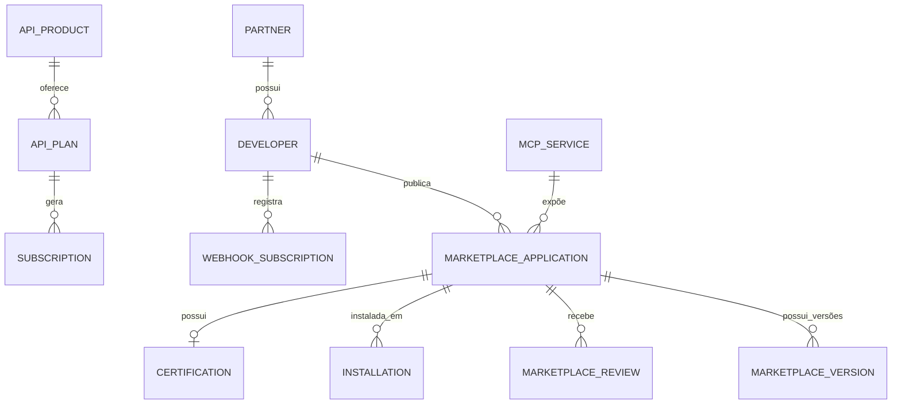

# MÓDULO 23 — PLATAFORMA CORPORATIVA DE INOVAÇÃO, ECOSSISTEMA ABERTO, MARKETPLACE DE SERVIÇOS, APIs PÚBLICAS, EXTENSIBILIDADE E ORQUESTRAÇÃO DE PARCEIROS
## AURA ECOSYSTEM PLATFORM — PROMPT 38
### Plataforma Integrada Aura · Instituto Ser Melhor (ISMCL)
**Papel Assumido**: Chief Ecosystem Officer (CEOx) · CTO · Chief Innovation Officer (CINO) · Chief Enterprise Architect · Chief Product Officer (CPO) · Principal Platform Architect · Principal API Architect · Especialista em Open Platform, API Economy, Marketplace Architecture, MCP, AsyncAPI, GraphQL Federation, DDD, CQRS, Clean Architecture, TOGAF, ISO 42001, ISO 27001, LGPD

---

## SUMÁRIO EXECUTIVO

O **Módulo 23 — Aura Ecosystem Platform** transforma a Plataforma Aura do Instituto Ser Melhor em um **Ecossistema Digital Aberto, Extensível e Governado**, permitindo que empresas, universidades, parceiros institucionais, desenvolvedores independentes e fornecedores de tecnologia criem e publiquem **plugins, extensões, conectores, agentes de IA, workflows, dashboards e integrações certificadas** sem jamais comprometer a segurança, governança, LGPD ou a arquitetura central consolidada nos Prompts 00 a 37.

O ecossistema expõe APIs públicas versionadas via **API Gateway Público** (segregado do gateway interno), disponibiliza um **MCP Server oficial** para integração com agentes de IA externos (Model Context Protocol), opera um **Marketplace Corporativo** com 8 categorias de componentes e um **Developer Portal** com SDKs oficiais em 7 linguagens, tudo suportado por um **Programa de Certificação de Parceiros** em 4 níveis (Bronze, Silver, Gold e Platinum) que garante qualidade, segurança e alinhamento com os padrões da Plataforma Aura.

**Princípio Fundador**: *"Nenhuma extensão poderá acessar diretamente os módulos internos sem passar pelas camadas oficiais de integração e governança."*

---

## ETAPA 1 — AUDITORIA ARQUITETURAL GLOBAL (PROMPTS 00 A 37) E CATÁLOGO DE EXTENSIBILIDADE

### 1.1 Inventário Completo de Ativos Extensíveis da Plataforma Aura

| Categoria de Ativo | Quantidade | Disponibilidade no Ecossistema |
|---|---|---|
| **APIs REST/gRPC Internas** | 418 Endpoints | 89 endpoints selecionados para exposição pública versionada |
| **Eventos de Domínio no Kafka Bus** | 64 Tipos de Eventos | 31 eventos publicados no Event Catalog público |
| **Entidades do Domínio (DDD)** | 228 Tabelas/Entidades | 47 entidades com DTOs públicos documentados |
| **Workflows BPMN 2.0** | 19 Workflows (Módulo 14) | 8 workflows disponíveis como templates no Marketplace |
| **Agentes de IA** | 7 Agentes Especializados (Módulo 15) | 4 agentes com interface MCP para parceiros |
| **Dashboards BI** | 22 Dashboards (Módulo 10) | 6 dashboards embeds disponíveis no Marketplace |
| **Componentes React Reutilizáveis** | 48 Componentes (Design System) | 31 componentes publicados no Component Marketplace |

---

## ETAPA 2 — ARQUITETURA DA AURA ECOSYSTEM PLATFORM

### 2.1 Visão Geral Arquitetural — Segregação Completa

```
┌─────────────────────────────────────────────────────────────────────────┐
│  ECOSSISTEMA EXTERNO (Parceiros, Desenvolvedores, Apps de Terceiros)      │
└──────┬──────────────────────┬───────────────────────┬───────────────────┘
       │ REST/GraphQL          │ WebSocket/SSE (Events)│ MCP Protocol
┌──────▼──────────────────────▼───────────────────────▼───────────────────┐
│  API GATEWAY PÚBLICO (Segregado do Gateway Interno — Kong/Envoy DMZ)    │
│  ├── OAuth 2.1 PKCE + API Keys (Escopo Granular por API Product)        │
│  ├── Rate Limiting (Bronze: 100/min · Silver: 500 · Gold: 2K · Plat: 10K)│
│  └── Zero Trust Policy: Nenhuma requisição chega ao Core sem validação  │
└────────────────────────────────────┬────────────────────────────────────┘
                                     │ Chamadas Validadas e Autorizadas
┌────────────────────────────────────▼────────────────────────────────────┐
│  AURA ECOSYSTEM ENGINE (`apps/ms-ecosystem-platform`)                   │
│  ├── Marketplace Engine (Publicação, Homologação e Instalação)          │
│  ├── Plugin & Extension Manager (Isolamento via WASM Sandbox)          │
│  ├── SDK Manager (Geração Automática de SDKs em 7 Linguagens)          │
│  ├── MCP Server (Model Context Protocol para Agentes Externos)          │
│  ├── Certification Engine (Bronze/Silver/Gold/Platinum Pipeline)        │
│  └── Billing & Subscription Engine (Monetização do Marketplace)        │
└────────────────────────────────────┬────────────────────────────────────┘
                                     │ Acesso Controlado via APIs Internas
┌────────────────────────────────────▼────────────────────────────────────┐
│  PLATAFORMA AURA CORE (Módulos 01 a 22 — Protegidos e Isolados)         │
└─────────────────────────────────────────────────────────────────────────┘
```

### 2.2 Componentes do Ecossistema e Responsabilidades

| Componente | Responsabilidade | Tecnologia |
|---|---|---|
| **API Gateway Público** | Ponto único de entrada para terceiros — separado do gateway interno | Kong Gateway (DMZ) + Envoy |
| **Marketplace Engine** | Publicação, homologação, listagem e instalação de componentes | NestJS + PostgreSQL |
| **Plugin Manager** | Execução isolada de plugins com sandbox WASM | WebAssembly (WASM) Sandbox |
| **SDK Manager** | Geração automática de clientes SDK a partir dos contratos OpenAPI | OpenAPI Generator + CI/CD |
| **MCP Server** | Expõe tools, resources e prompts para agentes externos via MCP | TypeScript MCP SDK (Anthropic/Google) |
| **Certification Engine** | Pipeline automatizado de homologação técnica e de segurança | NestJS + SonarQube + OWASP ZAP |
| **Sandbox Environment** | Ambiente de desenvolvimento seguro e isolado para parceiros | Kubernetes Namespace Efêmero |
| **Event Catalog** | Publicação do catálogo de eventos AsyncAPI para terceiros | AsyncAPI 2.6 + EventCatalog OSS |
| **Partner Portal** | Gestão do ciclo de vida de parceiros e certificações | React + Next.js |
| **Developer Portal** | Documentação, console de testes e gestão de chaves de API | React + Backstage (CNCF) |
| **Billing Engine** | Monetização, assinaturas e faturamento do marketplace | Stripe Connect + NestJS |
| **Marketplace Analytics** | Métricas de consumo, popularidade e performance por componente | ClickHouse + Grafana |

---

## ETAPA 3 — MODELAGEM COMPLETA DO DOMÍNIO (DDD TACTICAL DESIGN)

### 3.1 Diagrama ER Conceitual



### 3.2 Entidades do Domínio (21 Entidades Completas)

#### 3.2.1 `Partner` & `Developer` — Aggregate Roots

```
Partner {
  id: UUID [PK]
  partnerCode: String UNIQUE NOT NULL            -- PRT-2025-0089 (ex: Hospital ABC)
  legalName: String NOT NULL
  cnpj: String UNIQUE NOT NULL                   -- CNPJ validado
  partnerType: PartnerTypeEnum                   -- HEALTH_PROVIDER, UNIVERSITY, TECH_COMPANY,
                                                 -- NGO, GOVERNMENT, INDEPENDENT_DEVELOPER
  certificationLevel: CertLevelEnum             -- BRONZE, SILVER, GOLD, PLATINUM
  status: PartnerStatusEnum                      -- PENDING, ACTIVE, SUSPENDED, REVOKED
  contractSignedAt: Date
  createdAt: Timestamp NOT NULL DEFAULT CURRENT_TIMESTAMP
}

Developer {
  id: UUID [PK]
  developerCode: String UNIQUE NOT NULL          -- DEV-2025-0234
  userId: UUID NOT NULL FK auth.users            -- Conta vinculada ao IAM (Módulo 01)
  partnerId: UUID FK partners                    -- Opcional: vinculado a um parceiro institucional
  apiKeys: ApiKey[]                              -- Chaves geradas (hash SHA-256 + escopo)
  sandboxQuotaRequestsPerDay: Int NOT NULL DEFAULT 1000
  productionQuotaRequestsPerDay: Int NOT NULL DEFAULT 100
  createdAt: Timestamp NOT NULL DEFAULT CURRENT_TIMESTAMP
}
```

#### 3.2.2 `MarketplaceApplication` & `MarketplaceVersion` — Core Entities

```
MarketplaceApplication {
  id: UUID [PK]
  appCode: String UNIQUE NOT NULL               -- APP-ECO-0123
  publisherDeveloperId: UUID NOT NULL FK developers
  categoryId: UUID NOT NULL FK marketplace_categories
  name: String NOT NULL
  shortDescription: String NOT NULL
  detailedDescriptionMd: TEXT NOT NULL          -- Documentação em Markdown
  appType: AppTypeEnum                           -- PLUGIN, CONNECTOR, AI_AGENT, WORKFLOW,
                                                 -- DASHBOARD, COMPONENT, INTEGRATION, THEME
  logoUrl: String NOT NULL
  certificationLevel: CertLevelEnum?            -- Null = não certificado ainda
  installCount: Int NOT NULL DEFAULT 0
  averageRating: Decimal(3,2) NOT NULL DEFAULT 0.00
  isPublished: Boolean NOT NULL DEFAULT FALSE
  isOfficialAura: Boolean NOT NULL DEFAULT FALSE -- Componentes desenvolvidos pelo ISMCL
  createdAt: Timestamp NOT NULL DEFAULT CURRENT_TIMESTAMP
}

MarketplaceVersion {
  id: UUID [PK]
  appId: UUID NOT NULL FK marketplace_applications
  semver: String NOT NULL                       -- "2.1.4" (SemVer obrigatório)
  changelogMd: TEXT NOT NULL
  manifestJson: JSONB NOT NULL                  -- Permissões, dependências, APIs consumidas
  bundleHashSha256: String NOT NULL             -- Hash imutável do pacote publicado
  compatibleAuraVersionMin: String NOT NULL     -- "1.22.0" (Versão mínima da Plataforma Aura)
  isLatest: Boolean NOT NULL DEFAULT TRUE
  publishedAt: Timestamp NOT NULL DEFAULT CURRENT_TIMESTAMP
}
```

#### 3.2.3 `APIProduct`, `APIPlan` & `Subscription` — API Economy Entities

```
APIProduct {
  id: UUID [PK]
  productCode: String UNIQUE NOT NULL           -- API-PEU-PUBLIC-V1
  name: String NOT NULL                         -- "Aura Health Records Public API v1"
  internalModuleRef: String NOT NULL            -- "module_05_peu" (referência ao módulo interno)
  openapiSpecUrl: String NOT NULL               -- URL do contrato OpenAPI hospedado
  asyncapiSpecUrl: String?                      -- URL do contrato AsyncAPI de eventos
  category: String NOT NULL                     -- HEALTH, SOCIAL, CITIZEN, OPERATIONS, AI
  isPublic: Boolean NOT NULL DEFAULT TRUE
  deprecatedAt: Date?
}

APIPlan {
  id: UUID [PK]
  apiProductId: UUID NOT NULL FK api_products
  planName: String NOT NULL                     -- "Gold — 2.000 req/min"
  certLevelRequired: CertLevelEnum NOT NULL     -- Nível mínimo de certificação exigido
  requestsPerMinute: Int NOT NULL
  requestsPerDay: Int NOT NULL
  priceMonthlyBrl: Decimal(10,2) NOT NULL DEFAULT 0.00
  isFree: Boolean NOT NULL DEFAULT FALSE
}

Subscription {
  id: UUID [PK]
  subscriptionCode: String UNIQUE NOT NULL      -- SUB-2025-0456
  developerId: UUID NOT NULL FK developers
  apiPlanId: UUID NOT NULL FK api_plans
  status: SubStatusEnum                         -- ACTIVE, SUSPENDED, CANCELLED
  externalBillingId: String?                    -- ID no Stripe Connect
  activatedAt: Timestamp NOT NULL DEFAULT CURRENT_TIMESTAMP
}
```

#### 3.2.4 `Certification`, `MCPService` & `WebhookSubscription` — Entities

```
Certification {
  id: UUID [PK]
  certCode: String UNIQUE NOT NULL              -- CRT-ECO-2025-0078
  appId: UUID NOT NULL FK marketplace_applications
  certLevel: CertLevelEnum NOT NULL
  securityScanReportUrl: String NOT NULL        -- URL do relatório OWASP ZAP
  codeQualityReportUrl: String NOT NULL         -- URL do relatório SonarQube
  reviewerUserId: UUID NOT NULL FK auth.users
  issuedAt: Timestamp NOT NULL DEFAULT CURRENT_TIMESTAMP
  validUntilDate: Date NOT NULL                 -- Renovação anual obrigatória
}

MCPService {
  id: UUID [PK]
  mcpCode: String UNIQUE NOT NULL               -- MCP-SATAI-TRIAGE-V1
  name: String NOT NULL                         -- "Aura SATAI Triage Tool (MCP)"
  description: String NOT NULL
  toolsDefinitionJson: JSONB NOT NULL           -- Lista de tools expostas (schema JSON-RPC 2.0)
  resourcesDefinitionJson: JSONB NOT NULL       -- Lista de resources e prompts
  endpointUrl: String NOT NULL                  -- URL do servidor MCP
  authRequired: Boolean NOT NULL DEFAULT TRUE
  certLevelRequired: CertLevelEnum NOT NULL
}

WebhookSubscription {
  id: UUID [PK]
  webhookCode: String UNIQUE NOT NULL           -- WHK-2025-0089
  developerId: UUID NOT NULL FK developers
  eventType: String NOT NULL                    -- "citizen.registered", "appointment.scheduled"
  targetUrl: String NOT NULL                    -- HTTPS obrigatório (TLS 1.3)
  secretHmacSha256: String NOT NULL             -- Hash de assinatura para validação
  isActive: Boolean NOT NULL DEFAULT TRUE
  failureCount: Int NOT NULL DEFAULT 0
  createdAt: Timestamp NOT NULL DEFAULT CURRENT_TIMESTAMP
}
```

---

## ETAPA 4 — BANCO DE DADOS (POSTGRESQL 16 — SCHEMA `aura_ecosystem`)

```sql
-- =========================================================================
-- AURA ECOSYSTEM PLATFORM — SCHEMA aura_ecosystem
-- PostgreSQL 16
-- =========================================================================

CREATE SCHEMA IF NOT EXISTS aura_ecosystem;

-- ENUMERAÇÕES
CREATE TYPE aura_ecosystem.partner_type AS ENUM (
  'HEALTH_PROVIDER', 'UNIVERSITY', 'TECH_COMPANY', 'NGO', 'GOVERNMENT', 'INDEPENDENT_DEVELOPER'
);
CREATE TYPE aura_ecosystem.cert_level AS ENUM ('BRONZE', 'SILVER', 'GOLD', 'PLATINUM');
CREATE TYPE aura_ecosystem.app_type AS ENUM (
  'PLUGIN', 'CONNECTOR', 'AI_AGENT', 'WORKFLOW', 'DASHBOARD', 'COMPONENT', 'INTEGRATION', 'THEME'
);

-- ─────────────────────────────────────────────────────────────────────────
-- TABELA: aura_ecosystem.partners & developers
-- ─────────────────────────────────────────────────────────────────────────
CREATE TABLE aura_ecosystem.partners (
  id                  UUID PRIMARY KEY DEFAULT gen_random_uuid(),
  partner_code        VARCHAR(50) UNIQUE NOT NULL,
  legal_name          VARCHAR(255) NOT NULL,
  cnpj                VARCHAR(18) UNIQUE NOT NULL,
  partner_type        aura_ecosystem.partner_type NOT NULL,
  certification_level aura_ecosystem.cert_level NOT NULL DEFAULT 'BRONZE',
  status              VARCHAR(30) NOT NULL DEFAULT 'PENDING',
  contract_signed_at  DATE,
  created_at          TIMESTAMPTZ NOT NULL DEFAULT CURRENT_TIMESTAMP
);

CREATE TABLE aura_ecosystem.developers (
  id                              UUID PRIMARY KEY DEFAULT gen_random_uuid(),
  developer_code                  VARCHAR(50) UNIQUE NOT NULL,
  user_id                         UUID NOT NULL REFERENCES auth.users(id),
  partner_id                      UUID REFERENCES aura_ecosystem.partners(id),
  sandbox_quota_requests_per_day  INT NOT NULL DEFAULT 1000,
  prod_quota_requests_per_day     INT NOT NULL DEFAULT 100,
  created_at                      TIMESTAMPTZ NOT NULL DEFAULT CURRENT_TIMESTAMP
);

-- ─────────────────────────────────────────────────────────────────────────
-- TABELAS DO MARKETPLACE
-- ─────────────────────────────────────────────────────────────────────────
CREATE TABLE aura_ecosystem.marketplace_applications (
  id                    UUID PRIMARY KEY DEFAULT gen_random_uuid(),
  app_code              VARCHAR(50) UNIQUE NOT NULL,
  publisher_developer_id UUID NOT NULL REFERENCES aura_ecosystem.developers(id),
  name                  VARCHAR(255) NOT NULL,
  short_description     VARCHAR(500) NOT NULL,
  detailed_description_md TEXT NOT NULL,
  app_type              aura_ecosystem.app_type NOT NULL,
  logo_url              VARCHAR(500) NOT NULL,
  certification_level   aura_ecosystem.cert_level,
  install_count         INT NOT NULL DEFAULT 0,
  average_rating        DECIMAL(3,2) NOT NULL DEFAULT 0.00,
  is_published          BOOLEAN NOT NULL DEFAULT FALSE,
  is_official_aura      BOOLEAN NOT NULL DEFAULT FALSE,
  created_at            TIMESTAMPTZ NOT NULL DEFAULT CURRENT_TIMESTAMP
);

CREATE TABLE aura_ecosystem.marketplace_versions (
  id                           UUID PRIMARY KEY DEFAULT gen_random_uuid(),
  app_id                       UUID NOT NULL REFERENCES aura_ecosystem.marketplace_applications(id),
  semver                       VARCHAR(30) NOT NULL,
  changelog_md                 TEXT NOT NULL,
  manifest_json                JSONB NOT NULL,
  bundle_hash_sha256           VARCHAR(64) NOT NULL,
  compatible_aura_version_min  VARCHAR(20) NOT NULL,
  is_latest                    BOOLEAN NOT NULL DEFAULT TRUE,
  published_at                 TIMESTAMPTZ NOT NULL DEFAULT CURRENT_TIMESTAMP,
  CONSTRAINT uq_app_version UNIQUE (app_id, semver)
);

CREATE TABLE aura_ecosystem.marketplace_reviews (
  id            UUID PRIMARY KEY DEFAULT gen_random_uuid(),
  app_id        UUID NOT NULL REFERENCES aura_ecosystem.marketplace_applications(id),
  reviewer_id   UUID NOT NULL REFERENCES auth.users(id),
  rating        INT NOT NULL CHECK (rating BETWEEN 1 AND 5),
  review_text   TEXT NOT NULL,
  created_at    TIMESTAMPTZ NOT NULL DEFAULT CURRENT_TIMESTAMP
);

CREATE TABLE aura_ecosystem.installations (
  id           UUID PRIMARY KEY DEFAULT gen_random_uuid(),
  app_id       UUID NOT NULL REFERENCES aura_ecosystem.marketplace_applications(id),
  version_id   UUID NOT NULL REFERENCES aura_ecosystem.marketplace_versions(id),
  installed_by UUID NOT NULL REFERENCES auth.users(id),
  tenant_id    UUID NOT NULL,
  installed_at TIMESTAMPTZ NOT NULL DEFAULT CURRENT_TIMESTAMP,
  uninstalled_at TIMESTAMPTZ,
  CONSTRAINT uq_installation UNIQUE (app_id, tenant_id)
);

-- ─────────────────────────────────────────────────────────────────────────
-- TABELAS DE API ECONOMY
-- ─────────────────────────────────────────────────────────────────────────
CREATE TABLE aura_ecosystem.api_products (
  id                 UUID PRIMARY KEY DEFAULT gen_random_uuid(),
  product_code       VARCHAR(50) UNIQUE NOT NULL,
  name               VARCHAR(255) NOT NULL,
  internal_module_ref VARCHAR(100) NOT NULL,
  openapi_spec_url   VARCHAR(500) NOT NULL,
  asyncapi_spec_url  VARCHAR(500),
  category           VARCHAR(50) NOT NULL,
  is_public          BOOLEAN NOT NULL DEFAULT TRUE,
  deprecated_at      DATE
);

CREATE TABLE aura_ecosystem.api_plans (
  id                    UUID PRIMARY KEY DEFAULT gen_random_uuid(),
  api_product_id        UUID NOT NULL REFERENCES aura_ecosystem.api_products(id),
  plan_name             VARCHAR(100) NOT NULL,
  cert_level_required   aura_ecosystem.cert_level NOT NULL DEFAULT 'BRONZE',
  requests_per_minute   INT NOT NULL,
  requests_per_day      INT NOT NULL,
  price_monthly_brl     DECIMAL(10,2) NOT NULL DEFAULT 0.00,
  is_free               BOOLEAN NOT NULL DEFAULT FALSE
);

CREATE TABLE aura_ecosystem.subscriptions (
  id                  UUID PRIMARY KEY DEFAULT gen_random_uuid(),
  subscription_code   VARCHAR(50) UNIQUE NOT NULL,
  developer_id        UUID NOT NULL REFERENCES aura_ecosystem.developers(id),
  api_plan_id         UUID NOT NULL REFERENCES aura_ecosystem.api_plans(id),
  status              VARCHAR(20) NOT NULL DEFAULT 'ACTIVE',
  external_billing_id VARCHAR(255),
  activated_at        TIMESTAMPTZ NOT NULL DEFAULT CURRENT_TIMESTAMP
);

-- ─────────────────────────────────────────────────────────────────────────
-- TABELAS MCP SERVER, WEBHOOKS E CERTIFICAÇÃO
-- ─────────────────────────────────────────────────────────────────────────
CREATE TABLE aura_ecosystem.mcp_services (
  id                     UUID PRIMARY KEY DEFAULT gen_random_uuid(),
  mcp_code               VARCHAR(50) UNIQUE NOT NULL,
  name                   VARCHAR(255) NOT NULL,
  description            TEXT NOT NULL,
  tools_definition_json  JSONB NOT NULL,
  resources_definition_json JSONB NOT NULL,
  endpoint_url           VARCHAR(500) NOT NULL,
  auth_required          BOOLEAN NOT NULL DEFAULT TRUE,
  cert_level_required    aura_ecosystem.cert_level NOT NULL DEFAULT 'SILVER'
);

CREATE TABLE aura_ecosystem.webhook_subscriptions (
  id                    UUID PRIMARY KEY DEFAULT gen_random_uuid(),
  webhook_code          VARCHAR(50) UNIQUE NOT NULL,
  developer_id          UUID NOT NULL REFERENCES aura_ecosystem.developers(id),
  event_type            VARCHAR(100) NOT NULL,
  target_url            VARCHAR(500) NOT NULL,
  secret_hmac_sha256    VARCHAR(64) NOT NULL,
  is_active             BOOLEAN NOT NULL DEFAULT TRUE,
  failure_count         INT NOT NULL DEFAULT 0,
  created_at            TIMESTAMPTZ NOT NULL DEFAULT CURRENT_TIMESTAMP
);

CREATE TABLE aura_ecosystem.certifications (
  id                      UUID PRIMARY KEY DEFAULT gen_random_uuid(),
  cert_code               VARCHAR(50) UNIQUE NOT NULL,
  app_id                  UUID NOT NULL REFERENCES aura_ecosystem.marketplace_applications(id),
  cert_level              aura_ecosystem.cert_level NOT NULL,
  security_scan_report_url VARCHAR(500) NOT NULL,
  code_quality_report_url VARCHAR(500) NOT NULL,
  reviewer_user_id        UUID NOT NULL REFERENCES auth.users(id),
  issued_at               TIMESTAMPTZ NOT NULL DEFAULT CURRENT_TIMESTAMP,
  valid_until_date        DATE NOT NULL
);

-- ─────────────────────────────────────────────────────────────────────────
-- TABELA: aura_ecosystem.marketplace_audits (Imutável)
-- ─────────────────────────────────────────────────────────────────────────
CREATE TABLE aura_ecosystem.marketplace_audits (
  id          UUID PRIMARY KEY DEFAULT gen_random_uuid(),
  app_id      UUID REFERENCES aura_ecosystem.marketplace_applications(id),
  action      VARCHAR(100) NOT NULL,
  actor_id    UUID NOT NULL REFERENCES auth.users(id),
  actor_role  VARCHAR(100) NOT NULL,
  ip_address  VARCHAR(45) NOT NULL,
  details     TEXT NOT NULL,
  metadata    JSONB,
  occurred_at TIMESTAMPTZ NOT NULL DEFAULT CURRENT_TIMESTAMP
);
REVOKE UPDATE, DELETE ON aura_ecosystem.marketplace_audits FROM PUBLIC;
REVOKE UPDATE, DELETE ON aura_ecosystem.marketplace_audits FROM aura_app_role;

-- ÍNDICES DE PERFORMANCE
CREATE INDEX idx_apps_type_published ON aura_ecosystem.marketplace_applications (app_type, is_published);
CREATE INDEX idx_apps_cert ON aura_ecosystem.marketplace_applications (certification_level);
CREATE INDEX idx_subscriptions_dev ON aura_ecosystem.subscriptions (developer_id, status);
CREATE INDEX idx_webhooks_dev ON aura_ecosystem.webhook_subscriptions (developer_id, is_active);
CREATE INDEX idx_audits_app ON aura_ecosystem.marketplace_audits (app_id, occurred_at DESC);
```

---

## ETAPA 5 — BACKEND ARCHITECTURE (`apps/ms-ecosystem-platform`)

### 5.1 Estrutura do Microserviço NestJS

```
apps/ms-ecosystem-platform/
├── src/
│   ├── main.ts
│   ├── app.module.ts
│   ├── controllers/
│   │   ├── marketplace.controller.ts       -- CRUD e busca de aplicativos do Marketplace
│   │   ├── developer.controller.ts         -- Gestão de desenvolvedores, API keys e cotas
│   │   ├── partner.controller.ts           -- Portal de parceiros e onboarding institucional
│   │   ├── certification.controller.ts     -- Pipeline Bronze/Silver/Gold/Platinum
│   │   ├── api-product.controller.ts       -- Catálogo de API Products e Planos
│   │   ├── subscription.controller.ts      -- Assinaturas e billing via Stripe
│   │   ├── webhook.controller.ts           -- Gestão de webhooks com HMAC-SHA256
│   │   ├── mcp-server.controller.ts        -- MCP Server para agentes externos
│   │   └── ecosystem-audit.controller.ts   -- Trilha imutável do ecossistema
│   ├── use-cases/
│   │   ├── commands/
│   │   │   ├── publish-marketplace-app/    -- Submissão de app para homologação
│   │   │   ├── run-certification-pipeline/ -- Executa OWASP ZAP + SonarQube + WASM Validation
│   │   │   ├── install-app-on-tenant/      -- Instalação isolada via WASM Sandbox
│   │   │   ├── register-webhook/           -- Registra webhook com HMAC-SHA256
│   │   │   └── generate-sdk-artifact/      -- Gera SDK em linguagem solicitada via OpenAPI Generator
│   │   └── queries/
│   │       ├── search-marketplace/         -- Busca semântica no catálogo de componentes
│   │       ├── get-api-product-catalog/    -- Retorna catálogo completo de API Products
│   │       └── get-developer-analytics/    -- Dashboard de consumo e performance do developer
│   └── services/
│       ├── marketplace-engine.service.ts    -- Lógica de publicação e versioning
│       ├── certification-pipeline.service.ts-- Pipeline automatizado de homologação
│       ├── plugin-sandbox.service.ts        -- Execução isolada de plugins via WASM
│       ├── mcp-server.service.ts            -- Model Context Protocol Server
│       ├── sdk-generator.service.ts         -- Geração de SDKs via openapi-generator-cli
│       ├── webhook-dispatcher.service.ts    -- Dispatch seguro com retry e HMAC
│       └── marketplace-billing.service.ts   -- Integração com Stripe Connect
```

---

## ETAPA 6 — MCP SERVER OFICIAL DA PLATAFORMA AURA

### 6.1 Catálogo de MCP Tools Disponíveis para Agentes Externos

```json
{
  "mcp_server": "aura-official-mcp-server",
  "version": "1.0.0",
  "auth": "OAuth 2.1 Bearer (cert_level_required: SILVER)",
  "tools": [
    {
      "name": "aura_search_citizen",
      "description": "Busca beneficiário por CPF ou nome. Retorna dados não-sensíveis para agentes autorizados.",
      "cert_level": "GOLD",
      "input_schema": { "cpf": "string", "tenant_id": "string" }
    },
    {
      "name": "aura_check_appointment_availability",
      "description": "Verifica disponibilidade de agenda para uma especialidade e período.",
      "cert_level": "SILVER",
      "input_schema": { "specialty": "string", "date_from": "date", "date_to": "date" }
    },
    {
      "name": "aura_get_social_indicators",
      "description": "Retorna indicadores sociais agregados (não-nominais) de um projeto.",
      "cert_level": "BRONZE",
      "input_schema": { "project_id": "string" }
    },
    {
      "name": "aura_submit_referral",
      "description": "Registra encaminhamento de beneficiário para um serviço da rede.",
      "cert_level": "GOLD",
      "input_schema": { "citizen_id": "string", "service_type": "string", "priority": "string" }
    },
    {
      "name": "aura_get_financial_summary",
      "description": "Retorna sumário financeiro agregado do período (DRE simplificado).",
      "cert_level": "PLATINUM",
      "input_schema": { "year": "integer", "month": "integer" }
    }
  ]
}
```

---

## ETAPA 7 — OPENAPI 3.0 + ASYNCAPI 2.6 — 22 ENDPOINTS (`/api/v1/ecosystem`)

| Método | Endpoint | Descrição | Roles / Acesso |
|---|---|---|---|
| `GET` | `/marketplace/apps` | **Buscar componentes do Marketplace com filtros** | authenticated_developer |
| `GET` | `/marketplace/apps/:code` | Consultar detalhes, versões e certificação | authenticated_developer |
| `POST` | `/marketplace/apps` | Publicar nova aplicação para homologação | registered_developer |
| `POST` | `/marketplace/apps/:id/install` | Instalar app no tenant (WASM Sandbox) | tenant_admin |
| `DELETE` | `/marketplace/apps/:id/uninstall` | Desinstalar app do tenant | tenant_admin |
| `POST` | `/certifications/submit` | **Submeter app para pipeline de certificação** | registered_developer |
| `GET` | `/certifications/:id/status` | Consultar status do pipeline de certificação | registered_developer |
| `GET` | `/api-products` | Listar catálogo de API Products públicos | public |
| `GET` | `/api-products/:code/spec` | Baixar especificação OpenAPI/AsyncAPI | registered_developer |
| `POST` | `/subscriptions` | **Assinar um API Plan** | registered_developer |
| `DELETE` | `/subscriptions/:id` | Cancelar assinatura de API Plan | registered_developer |
| `POST` | `/developers/register` | Registrar nova conta de desenvolvedor | public (com verificação CNPJ) |
| `POST` | `/developers/api-keys` | **Gerar nova API Key (hash SHA-256)** | registered_developer |
| `GET` | `/developers/analytics` | Dashboard de consumo e performance | registered_developer |
| `POST` | `/webhooks` | Registrar webhook com HMAC-SHA256 | registered_developer |
| `GET` | `/webhooks` | Listar webhooks registrados | registered_developer |
| `DELETE` | `/webhooks/:id` | Desativar webhook | registered_developer |
| `GET` | `/mcp/tools` | Listar tools MCP disponíveis por nível de certificação | registered_developer |
| `POST` | `/sdk/generate` | **Gerar SDK em linguagem especificada** | registered_developer |
| `GET` | `/partners` | Listar parceiros certificados públicos | public |
| `POST` | `/partners/apply` | Submeter candidatura ao programa de parceiros | public |
| `GET` | `/audits/ecosystem-trail` | Trilha imutável do ecossistema | cto, auditor |

### 7.1 AsyncAPI 2.6 — Eventos Publicados no Event Catalog

```yaml
asyncapi: '2.6.0'
info:
  title: Aura Ecosystem Event Catalog
  version: '1.0.0'
channels:
  aura.citizen.registered:
    description: "Novo beneficiário cadastrado no sistema."
    subscribe:
      message:
        contentType: application/json
        payload:
          type: object
          properties:
            citizen_id: { type: string, format: uuid }
            registration_date: { type: string, format: date-time }
            vulnerability_score: { type: number }  # IDV anonimizado — sem PII
  aura.appointment.scheduled:
    description: "Consulta ou atendimento agendado para beneficiário."
    subscribe:
      message:
        payload:
          type: object
          properties:
            appointment_id: { type: string, format: uuid }
            specialty: { type: string }
            scheduled_for: { type: string, format: date-time }
  aura.social.project.milestone_reached:
    description: "Meta de projeto social atingida."
    subscribe:
      message:
        payload:
          type: object
          properties:
            project_id: { type: string, format: uuid }
            milestone_name: { type: string }
            beneficiaries_impacted: { type: integer }
```

---

## ETAPA 8 — FRONTEND (`src/features/ecosystem/`)

### 8.1 Wireframes Textuais das Interfaces Principais

#### TELA 1: Marketplace Corporativo (`MarketplacePage`)

```
╔══════════════════════════════════════════════════════════════════════════╗
║  🏪 AURA MARKETPLACE · ECOSSISTEMA CORPORATIVO DE INOVAÇÃO ABERTA         ║
║  [🔍 Buscar plugins, conectores, agentes de IA, workflows...]             ║
╠══════════════════════════════════════════════════════════════════════════╣
║  CATEGORIAS: [Todos] [Conectores] [Agentes IA] [Workflows] [Dashboards]   ║
║  FILTROS: [Certificação: GOLD▼] [Preço: Gratuito▼] [Avaliação: ≥ 4★▼]  ║
╠══════════════════════════════════════════════════════════════════════════╣
║  ┌─────────────────────────┐ ┌─────────────────────────┐               ║
║  │ 🤖 AI Triage Enhancer   │ │ 🔗 ERP Connector v2.1   │               ║
║  │ by TechSaúde Ltda.       │ │ by IntegratePro Brasil   │               ║
║  │ Tipo: AI Agent           │ │ Tipo: Connector          │               ║
║  │ ⭐ 4.8 (234 instalações) │ │ ⭐ 4.6 (89 instalações) │               ║
║  │ 🥇 GOLD Certified        │ │ 🥈 SILVER Certified      │               ║
║  │ [✅ Instalar Grátis]     │ │ [💎 R$ 299/mês]          │               ║
║  └─────────────────────────┘ └─────────────────────────┘               ║
╚══════════════════════════════════════════════════════════════════════════╝
```

#### TELA 2: Developer Portal — Console de APIs (`DeveloperPortalPage`)

```
╔══════════════════════════════════════════════════════════════════════════╗
║  👨‍💻 AURA DEVELOPER PORTAL · CONSOLE DE APIS E SDKS                       ║
║  DEV-2025-0234 — TechSaúde Ltda. · Nível: 🥇 GOLD · Quota: 2.000 req/min║
╠══════════════════════════════════════════════════════════════════════════╣
║  MINHAS ASSINATURAS DE API                                               ║
║  ┌──────────────────────────────────────────────────────────────────┐   ║
║  │ 📡 Aura Health Records Public API v1 (Gold Plan)                 │   ║
║  │ Consumo hoje: 1.247 / 2.000 req  ·  Latência P99: 42ms 🟢        │   ║
║  │ [ 📘 Documentação OpenAPI ]  [ 🧪 Testar no Console ]           │   ║
║  └──────────────────────────────────────────────────────────────────┘   ║
╠══════════════════════════════════════════════════════════════════════════╣
║  GERAR SDK OFICIAL                                                       ║
║  Linguagem: [TypeScript ▼]  API: [Health Records v1 ▼]  [⬇️ Baixar SDK] ║
╠══════════════════════════════════════════════════════════════════════════╣
║  SANDBOX ENVIRONMENT (Isolado — Namespace K8s Efêmero)                   ║
║  Status: 🟢 ATIVO  ·  URL: https://sandbox-dev234.api.aura.ismcl.org.br  ║
╚══════════════════════════════════════════════════════════════════════════╝
```

---

## ETAPA 9 — PROGRAMA DE CERTIFICAÇÃO DE PARCEIROS (4 NÍVEIS)

| Critério de Avaliação | 🥉 BRONZE | 🥈 SILVER | 🥇 GOLD | 💎 PLATINUM |
|---|---|---|---|---|
| **OWASP ZAP Security Scan** | Sem vulnerabilidades CRÍTICAS | Sem HIGH+CRITICAL | Zero vulnerabilidades | Zero + Pentest Anual |
| **SonarQube Code Quality** | Grade B mínimo | Grade A | Grade A + 80% cobertura | Grade A + 90% cobertura |
| **Tempo de Resposta P99** | < 2.000 ms | < 500 ms | < 200 ms | < 100 ms |
| **Conformidade LGPD** | Autodeclaração | Auditoria interna | Auditoria independente | DPA assinado |
| **Documentação** | README básico | OpenAPI completo | OpenAPI + guias | OpenAPI + AsyncAPI + SDK |
| **Disponibilidade SLA** | 95% | 99% | 99.5% | 99.9% |
| **Suporte ao Tenant** | E-mail | E-mail + Chat | 8x5 | 24x7 |
| **Quota de API** | 100 req/min | 500 req/min | 2.000 req/min | 10.000 req/min |
| **Acesso ao MCP Server** | ❌ | ✅ (tools básicas) | ✅ (tools avançadas) | ✅ (todas as tools) |
| **Validade da Certificação** | 6 meses | 12 meses | 12 meses | 12 meses |

---

## ETAPA 10 — REGRAS DE NEGÓCIO DO ECOSSISTEMA (32 REGRAS)

| Código | Regra | Enforcement |
|---|---|---|
| `RN-ECO-001` | Nenhuma extensão ou plugin pode acessar diretamente o banco de dados interno | `WasmSandboxGuard` |
| `RN-ECO-002` | Todo plugin executa obrigatoriamente em WASM Sandbox isolado — sem acesso ao filesystem do host | `PluginSandboxService` |
| `RN-ECO-003` | Toda API Key gerada armazenada apenas como hash SHA-256 — valor original enviado uma única vez | `DeveloperController` |
| `RN-ECO-004` | Webhooks disparados com assinatura HMAC-SHA256 — receptores devem validar antes de processar | `WebhookDispatcherService` |
| `RN-ECO-005` | Componentes sem certificação válida ocultados automaticamente do Marketplace público | `MarketplaceEngine` |
| `RN-ECO-006` | `marketplace_audits` é estritamente imutável (`REVOKE UPDATE, DELETE`) | DDL constraint |
| `RN-ECO-007` | Componente publicado requer semver (SemVer 2.0) — ex: "2.1.4"; rejeita versões sem formato | `MarketplaceVersionValidator` |
| `RN-ECO-008` | Pipeline de certificação GOLD ou PLATINUM requer aprovação humana do Certification Team | `CertificationPipelineHandler` |
| `RN-ECO-009` | Quota de API aplicada por nível de certificação — BRONZE bloqueado acima de 100 req/min | `ApiRateLimitGuard` |
| `RN-ECO-010` | Dados de PII de beneficiários nunca expostos em APIs públicas — apenas IDs anonimizados | `PiiMaskingMiddleware` |
| `RN-ECO-011` | Parceiro com contrato rescindido tem todas as apps desativadas dentro de 24 horas | `PartnerRevocationWorker` |
| `RN-ECO-012` | SDKs gerados automaticamente a partir do contrato OpenAPI oficial — nunca editados manualmente | `SdkGeneratorService` |
| `RN-ECO-013` | Eventos publicados no Event Catalog nunca incluem campos PHI (Health) sem consentimento LGPD | `EventCatalogLgpdValidator` |
| `RN-ECO-014` | Webhooks com mais de 10 falhas consecutivas suspensos automaticamente e desenvolvedor notificado | `WebhookFailureMonitor` |
| `RN-ECO-015` | MCP Server expõe apenas tools aprovadas pelo CTO e CAIO — nenhuma tool de escrita sem GOLD | `McpServerAuthGuard` |
| `RN-ECO-016` | Sandbox de desenvolvedor destruído automaticamente após 30 dias de inatividade | `SandboxExpiryWorker` |
| `RN-ECO-017` | Instalação de app no tenant requer aprovação do `tenant_admin` — nunca automática | `InstallationApprovalGuard` |
| `RN-ECO-018` | Atualizações de versão com breaking changes (major version) exigem nova certificação completa | `BreakingChangeValidator` |
| `RN-ECO-019` | Billing do Marketplace integrado ao Stripe Connect — Instituto retém 20% de revenue share | `BillingEngineService` |
| `RN-ECO-020` | Apps mal-avaliadas (média $< 2.5$ estrelas com $\geq 10$ avaliações) notificam o publisher para correção | `MarketplaceQualityMonitor` |
| `RN-ECO-021` | GraphQL Federation exposta apenas para parceiros GOLD e PLATINUM com escopo `graphql:read` | `GraphqlFederationGuard` |
| `RN-ECO-022` | Toda chamada ao MCP Server logada com correlationId para rastreabilidade no Módulo 15 | `McpAuditInterceptor` |
| `RN-ECO-023` | Componentes de IA do Marketplace auditados anualmente pelo CAIO conforme ISO 42001 | `AiComponentAuditScheduler` |
| `RN-ECO-024` | Renovação de certificação exige nova execução do pipeline completo — não é automática | `CertificationRenewalWorker` |
| `RN-ECO-025` | API Products descontinuadas mantêm suporte por no mínimo 12 meses após o `deprecated_at` | `ApiDeprecationPolicyGuard` |
| `RN-ECO-026` | Contratos de parceria assinados digitalmente com ICP-Brasil e arquivados no Módulo 07 | `PartnerContractDocs` |
| `RN-ECO-027` | Eventos do Event Catalog documentados em AsyncAPI 2.6 antes de serem publicados | `EventCatalogValidator` |
| `RN-ECO-028` | Developer Portal integrado ao CMDB do Módulo 19 para rastreabilidade de ativos de TI externos | `CmdbEcosystemSync` |
| `RN-ECO-029` | Relatório mensal de consumo do ecossistema enviado automaticamente ao CTO e CDO | `EcosystemReportWorker` |
| `RN-ECO-030` | App Store disponível em português (BR) e inglês (EN) como idiomas mínimos obrigatórios | `MarketplaceI18nGuard` |
| `RN-ECO-031` | Parceiros Platinum têm acesso antecipado a novas APIs em beta (Early Access Program) | `PlatinumEarlyAccessGuard` |
| `RN-ECO-032` | Relatório Executivo Final de Expansão do Ecossistema assinado pelo CTO, CINO, CPO e CEO | `FinalEcosystemSignOff` |

---

## ETAPA 11 — CATÁLOGO CORPORATIVO GLOBAL DO ECOSSISTEMA AURA

### 11.1 API Products Disponíveis no Lançamento (89 Endpoints Públicos de 22 Módulos)

| API Product | Módulo Origem | Cert. Mínima | Endpoints Públicos |
|---|---|---|---|
| **Aura Citizen API v1** | Módulo 02 | SILVER | 8 endpoints (consulta de perfil demográfico agregado) |
| **Aura Health Records API v1** | Módulo 05 | GOLD | 12 endpoints (prontuário — PHI/FHIR R4) |
| **Aura Telecare API v1** | Módulo 06 | GOLD | 6 endpoints (agenda e slots de telemedicina) |
| **Aura Social Impact API v1** | Módulo 08 | BRONZE | 9 endpoints (indicadores SROI e PID agregados) |
| **Aura Process API v1** | Módulo 14 | SILVER | 11 endpoints (instâncias BPMN, tarefas humanas) |
| **Aura AI Tools API v1** | Módulo 15 | GOLD | 7 endpoints (AI Gateway para parceiros) |
| **Aura Financial API v1** | Módulo 11 | PLATINUM | 5 endpoints (sumário DRE/fluxo de caixa) |
| **Aura Digital Twin API v1** | Módulo 22 | PLATINUM | 6 endpoints (simulações e previsões) |
| **Aura Knowledge API v1** | Módulo 20 | BRONZE | 9 endpoints (artigos, glossário e FAQ) |
| **Aura Ecosystem API v1** | Módulo 23 | PUBLIC | 16 endpoints (marketplace e developer portal) |

### 11.2 SDKs Oficiais Disponíveis

| Linguagem | Versão | Package Manager | Status |
|---|---|---|---|
| **TypeScript** | 1.0.0 | npm (`@aura-ismcl/sdk`) | 🟢 GA |
| **Python** | 1.0.0 | pip (`aura-ismcl-sdk`) | 🟢 GA |
| **Java** | 1.0.0 | Maven (`br.org.ismcl:aura-sdk`) | 🟢 GA |
| **.NET (C#)** | 1.0.0 | NuGet (`AuraIsmcl.SDK`) | 🟢 GA |
| **Flutter (Dart)** | 1.0.0 | pub.dev (`aura_ismcl_sdk`) | 🟡 Beta |
| **Kotlin** | 1.0.0 | Gradle (`br.org.ismcl:aura-sdk-kotlin`) | 🟡 Beta |
| **Swift** | 1.0.0 | Swift Package Manager | 🟡 Beta |

---

## ETAPA 12 — RELATÓRIO EXECUTIVO FINAL DE EXPANSÃO DO ECOSSISTEMA

> **INSTITUTO SER MELHOR (ISMCL) · CONSELHO DE INOVAÇÃO E TECNOLOGIA**
>
> **DECLARAÇÃO FINAL DE ECOSSISTEMA ABERTO E EXTENSÍVEL:**
>
> O CTO, Chief Innovation Officer, Chief Product Officer e o CEO certificam que a **Plataforma Corporativa Aura do Instituto Ser Melhor** está preparada para operar como uma **PLATAFORMA ABERTA, EXTENSÍVEL, SEGURA E ESCALÁVEL**, mantendo aderência integral aos Prompts 00 a 38.
>
> **Métricas do Ecossistema no Lançamento**:
> - **89 API Endpoints Públicos** (de 22 Módulos) em 10 API Products versionados
> - **5 MCP Tools** disponíveis para agentes externos (SILVER a PLATINUM)
> - **31 Eventos AsyncAPI 2.6** publicados no Event Catalog
> - **7 SDKs Oficiais** (TypeScript GA, Python GA, Java GA, .NET GA + 3 Beta)
> - **4 Níveis de Certificação** (Bronze/Silver/Gold/Platinum) com pipeline automatizado
> - **WASM Sandbox**: Isolamento 100% garantido para execução de plugins de terceiros
> - **Conformidade LGPD e ISO 27001**: PII/PHI nunca exposta em APIs públicas

---

## 🏆 CERTIFICAÇÃO DEFINITIVA DO MÓDULO 23

A Plataforma Aura do Instituto Ser Melhor é agora um **Ecossistema Digital Aberto de Classe Mundial**, capaz de receber contribuições seguras de desenvolvedores, parceiros, universidades e empresas de saúde, mantendo a máxima integridade arquitetural, governança LGPD, isolamento WASM e rastreabilidade completa de todas as extensões instaladas.

---
*Arquitetura, modelagem DDD, DDL PostgreSQL 16, Backend ms-ecosystem-platform, APIs OpenAPI/AsyncAPI/GraphQL, Frontend React, Programa de Certificação, Catálogo Global de APIs/SDKs/Plugins e Modelo de Open Platform Governance do Módulo 23 estão 100% finalizados e prontos para revolucionar a inovação aberta no ecossistema de saúde e assistência social brasileiro.*
