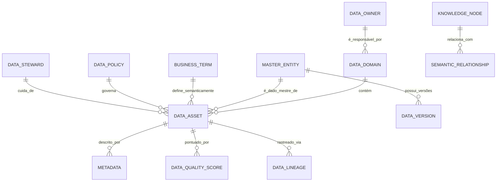

# MÓDULO 25 — PLATAFORMA CORPORATIVA DE GESTÃO E GOVERNANÇA DE DADOS, MASTER DATA MANAGEMENT (MDM), DATA FABRIC, DATA MESH, CATÁLOGO DE DADOS, LINHAGEM, QUALIDADE E SOBERANIA DOS DADOS
## AURA ENTERPRISE DATA PLATFORM — PROMPT 40
### Plataforma Integrada Aura · Instituto Ser Melhor (ISMCL)
**Papel Assumido**: Chief Data Officer (CDO) · Chief Information Officer (CIO) · Chief Artificial Intelligence Officer (CAIO) · Chief Enterprise Architect · Principal Data Architect · Principal Data Engineer · Especialista em MDM, Data Fabric, Data Mesh, Data Governance, Data Lineage, ISO 8000, DAMA-DMBOK2, ISO 11179, LGPD, DDD, CQRS, Clean Architecture

---

## SUMÁRIO EXECUTIVO

O **Módulo 25 — Aura Enterprise Data Platform** é a **fundação do patrimônio informacional da Plataforma Aura**: o sistema que transforma os dados dos 24 módulos anteriores em um **ativo estratégico corporativo íntegro, único, rastreável, governado e preparado para Inteligência Artificial, Analytics, Digital Twin e expansão institucional**.

Este módulo estabelece a **Governança Corporativa de Dados (DAMA-DMBOK2 / ISO 8000)**, o **MDM Hub** com Golden Record para 15 domínios de dados mestres, um **Enterprise Data Catalog** com linhagem completa de todas as 255+ tabelas e 440 APIs, uma **Data Quality Engine** com Score Global de Qualidade em 8 dimensões, um **Knowledge Graph Corporativo** (Neo4j) conectando entidades semânticamente, e a **Arquitetura Data Mesh** com 8 Domínios Autônomos e Catálogo Unificado.

**Princípio Fundador**: *"Nenhum dado crítico poderá existir sem governança. Todo ativo de dados possuirá proprietário, steward, classificação, linhagem e ciclo de vida definido."*

---

## ETAPA 1 — AUDITORIA GLOBAL DOS DADOS (PROMPTS 00 A 39) E INVENTÁRIO CORPORATIVO

### 1.1 Inventário Corporativo de Dados — 24 Módulos e 19 Schemas PostgreSQL

| Schema PostgreSQL | Módulo Origem | Tabelas | Tipo de Dado Principal | Criticidade LGPD |
|---|---|---|---|---|
| `auth` | Módulo 01 — IAM | 8 | PII — Credenciais e Sessões | 🔴 CRÍTICA |
| `aura_citizen` | Módulo 02 — Citizen | 12 | PII — Dados Pessoais e Socioeconômicos | 🔴 CRÍTICA |
| `aura_satai` | Módulo 03 — SATAI | 9 | PHI — Score de Vulnerabilidade | 🔴 CRÍTICA |
| `aura_care` | Módulo 04 — Care | 11 | PHI — Encaminhamentos e Cuidado | 🔴 CRÍTICA |
| `aura_peu` | Módulo 05 — PEU | 14 | PHI — Prontuário Eletrônico (FHIR R4/R5) | 🔴 CRÍTICA |
| `aura_telecare` | Módulo 06 — Telecare | 10 | PHI — Gravações de Telemedicina | 🔴 CRÍTICA |
| `aura_docs` | Módulo 07 — Docs | 8 | Legal — Prescrições e Assinaturas ICP | 🟠 ALTA |
| `aura_social` | Módulo 08 — Social | 11 | PID — Indicadores Sociais (anonimizável) | 🟡 MÉDIA |
| `aura_crm` | Módulo 09 — CRM | 13 | PII — Interações e Consentimentos LGPD | 🔴 CRÍTICA |
| `aura_dw` | Módulo 10 — Analytics | 16 | Analítico — Dados Históricos Agregados | 🟡 MÉDIA |
| `aura_finance` | Módulo 11 — Financial | 14 | Financeiro — Partidas Dobradas NBC TSP | 🟠 ALTA |
| `aura_governance` | Módulo 12 — Governance | 11 | Governance — Riscos e Compliance | 🟡 MÉDIA |
| `aura_integration` | Módulo 13 — Hub | 9 | Técnico — Logs de Integração FHIR/HL7 | 🟡 MÉDIA |
| `aura_bpm` | Módulo 14 — BPM | 12 | Processo — Instâncias BPMN e DMN | 🟡 MÉDIA |
| `aura_ai` | Módulo 15 — AI | 11 | IA — Requisições, Grounding, HITL | 🟠 ALTA |
| `aura_security` | Módulo 16 — Cyber | 13 | Segurança — Alertas SIEM e Incidentes | 🔴 CRÍTICA |
| `aura_cloud` | Módulo 17 — Cloud | 10 | Técnico — Infraestrutura e FinOps | 🟢 BAIXA |
| `aura_quality` | Módulo 18 — Quality | 9 | Qualidade — Gates, Defeitos e Métricas | 🟢 BAIXA |
| `aura_operations` | Módulo 19 — Operations | 12 | ITIL — Incidentes, CMDB, ITSM | 🟡 MÉDIA |
| `aura_knowledge` | Módulo 20 — Knowledge | 8 | Conhecimento — Manuais e LMS | 🟢 BAIXA |
| `aura_evolution` | Módulo 21 — Evolution | 7 | Técnico — ADRs e Dívida Técnica | 🟢 BAIXA |
| `aura_twin` | Módulo 22 — Twin | 9 | Analítico — Simulações e Previsões | 🟡 MÉDIA |
| `aura_ecosystem` | Módulo 23 — Ecosystem | 11 | Comercial — Parceiros e API Keys | 🟠 ALTA |
| `aura_grc` | Módulo 24 — GRC | 13 | Governance — Riscos e Evidências | 🟠 ALTA |
| **`aura_data_platform`** | **Módulo 25 — EDP** | **12** | **Metadados — Governança de Dados** | 🟡 MÉDIA |

**Total Geral**: **267 Tabelas · 8 Tipos de Repositório · 5 Níveis de Criticidade LGPD**

---

## ETAPA 2 — ARQUITETURA CORPORATIVA DE DADOS

### 2.1 Visão Geral — Enterprise Data Platform

```
┌─────────────────────────────────────────────────────────────────────────┐
│  FONTES DE DADOS (24 Schemas PostgreSQL 16 + Pgvector + TimescaleDB)     │
└──────┬────────────┬───────────────┬──────────────┬───────────────────────┘
       │ CDC Debezium│ Kafka Events  │ API Polling  │ File/S3 Ingestion
┌──────▼────────────▼───────────────▼──────────────▼───────────────────────┐
│  AURA ENTERPRISE DATA PLATFORM (`apps/ms-enterprise-data`)               │
│  ├── MDM Hub (Golden Record Engine — Deduplicação + Sobrevivência)       │
│  ├── Data Catalog Engine (Inventário Automático + Metadata Discovery)    │
│  ├── Data Quality Engine (8 Dimensões ISO 8000 — Score Global)          │
│  ├── Data Lineage Engine (Rastreabilidade Completa Origem→Destino)       │
│  ├── Knowledge Graph (Neo4j — Relações Semânticas entre Domínios)       │
│  ├── Semantic Layer (Business Glossary + Thesaurus Corporativo)          │
│  └── Data Policy Engine (Retenção + Classificação + LGPD Automático)    │
└─────────────────────────────────────────────────────────────────────────┘
│                        Data Mesh — 8 Domínios Autônomos                  │
│  [Health Domain] [Social Domain] [Finance Domain] [Identity Domain]      │
│  [Operations Domain] [AI Domain] [Ecosystem Domain] [Governance Domain]  │
└─────────────────────────────────────────────────────────────────────────┘
│                        Consumidores de Dados                              │
│  [BI/Analytics Módulo 10] [AI/RAG Módulo 15] [Digital Twin Módulo 22]    │
└─────────────────────────────────────────────────────────────────────────┘
```

---

## ETAPA 3 — DATA MESH — 8 DOMÍNIOS AUTÔNOMOS DA PLATAFORMA AURA

| # | Domínio Data Mesh | Schemas Incluídos | Data Product Owner | SLA de Qualidade |
|---|---|---|---|---|
| **1** | **Health Domain** | `aura_peu`, `aura_care`, `aura_telecare`, `aura_docs` | Diretor Clínico | DQS ≥ 95% |
| **2** | **Social Domain** | `aura_citizen`, `aura_satai`, `aura_social`, `aura_crm` | Diretor Social | DQS ≥ 93% |
| **3** | **Finance Domain** | `aura_finance`, `aura_dw` (dimensão financeira) | CFO | DQS ≥ 99% |
| **4** | **Identity Domain** | `auth`, `aura_citizen` (identidade) | CISO / DPO | DQS ≥ 99% |
| **5** | **Operations Domain** | `aura_operations`, `aura_bpm`, `aura_quality` | COO | DQS ≥ 97% |
| **6** | **AI Domain** | `aura_ai`, `aura_knowledge`, `aura_evolution` | CAIO | DQS ≥ 90% |
| **7** | **Ecosystem Domain** | `aura_ecosystem`, `aura_integration` | CTO / CEOx | DQS ≥ 95% |
| **8** | **Governance Domain** | `aura_grc`, `aura_governance`, `aura_security` | CGO | DQS ≥ 98% |

---

## ETAPA 4 — MODELAGEM COMPLETA DO DOMÍNIO (DDD TACTICAL DESIGN)

### 4.1 Diagrama ER Conceitual



### 4.2 Entidades do Domínio (22 Entidades Completas)

#### 4.2.1 `DataDomain` & `DataProduct` — Aggregate Roots (Data Mesh)

```
DataDomain {
  id: UUID [PK]
  domainCode: String UNIQUE NOT NULL             -- DOM-HEALTH-001
  name: String NOT NULL                          -- "Health Domain"
  description: TEXT NOT NULL
  dataProductOwnerId: UUID NOT NULL FK auth.users -- Diretor Clínico, CFO etc.
  dataStewardId: UUID FK auth.users
  schemasIncluded: String[] NOT NULL             -- ["aura_peu", "aura_care"]
  dqsTargetPercent: Decimal(5,2) NOT NULL DEFAULT 95.00 -- SLA de Qualidade
  isActive: Boolean NOT NULL DEFAULT TRUE
  createdAt: Timestamp NOT NULL DEFAULT CURRENT_TIMESTAMP
}

DataProduct {
  id: UUID [PK]
  productCode: String UNIQUE NOT NULL            -- DP-HEALTH-CLINICAL-RECORDS-V1
  domainId: UUID NOT NULL FK data_domains
  name: String NOT NULL                          -- "Clinical Records Data Product"
  outputPortType: OutputPortEnum                 -- REST_API, KAFKA_TOPIC, SQL_VIEW, FILE_EXPORT
  slaFreshnessMinutes: Int NOT NULL DEFAULT 60   -- Freshness SLA (dados máx 60min desatualizados)
  contractSchemaJson: JSONB NOT NULL             -- Contrato do Data Product (schema dos dados)
  isPubliclyDiscoverable: Boolean NOT NULL DEFAULT TRUE
  createdAt: Timestamp NOT NULL DEFAULT CURRENT_TIMESTAMP
}
```

#### 4.2.2 `MasterEntity` & `DataVersion` — MDM Core Entities

```
MasterEntity {
  id: UUID [PK]
  goldenRecordId: UUID UNIQUE NOT NULL           -- ID canônico do Golden Record
  entityType: MasterEntityTypeEnum               -- PERSON, BENEFICIARY, PROFESSIONAL,
                                                 -- VOLUNTEER, INSTITUTION, SERVICE, ADDRESS
  canonicalDataJson: JSONB NOT NULL              -- Atributos sobreviventes (Survivorship Rules)
  sourceSystemsJson: JSONB NOT NULL              -- Fontes contribuintes: [{"system": "aura_citizen", "id": "..."}]
  confidenceScore: Decimal(3,2) NOT NULL DEFAULT 1.00 -- Confiança do Golden Record (0.00 a 1.00)
  isDuplicate: Boolean NOT NULL DEFAULT FALSE
  mergedIntoId: UUID? FK master_entities         -- Se foi consolidado em outro Golden Record
  version: Int NOT NULL DEFAULT 1
  lastSyncedAt: Timestamp NOT NULL DEFAULT CURRENT_TIMESTAMP
  createdAt: Timestamp NOT NULL DEFAULT CURRENT_TIMESTAMP
}

DataVersion {
  id: UUID [PK]
  masterEntityId: UUID NOT NULL FK master_entities
  versionNumber: Int NOT NULL
  snapshotJson: JSONB NOT NULL                   -- Estado completo do Golden Record nesta versão
  changeType: ChangeTypeEnum                     -- CREATE, UPDATE, MERGE, SPLIT, DEPRECATE
  changedBySystem: String NOT NULL               -- "aura_citizen", "aura_peu" etc.
  createdAt: Timestamp NOT NULL DEFAULT CURRENT_TIMESTAMP
}
```

#### 4.2.3 `DataAsset`, `Metadata` & `DataQualityScore` — Catalog Entities

```
DataAsset {
  id: UUID [PK]
  assetCode: String UNIQUE NOT NULL              -- DA-PEU-TABLE-CONSULTATIONS-001
  domainId: UUID NOT NULL FK data_domains
  assetType: AssetTypeEnum                       -- TABLE, VIEW, KAFKA_TOPIC, API, ML_MODEL,
                                                 -- DATA_PRODUCT, DASHBOARD, FILE
  assetName: String NOT NULL                     -- "aura_peu.consultations"
  physicalLocation: String NOT NULL              -- "postgres://aura-db:5432/aura/peu.consultations"
  ownerId: UUID NOT NULL FK auth.users
  stewardId: UUID FK auth.users
  classificationLevel: ClassificationEnum        -- PUBLIC, INTERNAL, CONFIDENTIAL, RESTRICTED, PHI, PII
  isPersonalData: Boolean NOT NULL DEFAULT FALSE -- LGPD Art. 5° — Dado Pessoal?
  isSensitiveData: Boolean NOT NULL DEFAULT FALSE-- LGPD Art. 11° — Dado Sensível de Saúde?
  retentionDays: Int NOT NULL DEFAULT 1825       -- 5 anos como padrão (alterável por política)
  createdAt: Timestamp NOT NULL DEFAULT CURRENT_TIMESTAMP
}

Metadata {
  id: UUID [PK]
  assetId: UUID NOT NULL FK data_assets
  metadataType: MetadataTypeEnum                 -- TECHNICAL, BUSINESS, OPERATIONAL
  keyName: String NOT NULL                       -- "row_count", "last_update", "primary_key"
  valueJson: JSONB NOT NULL                      -- Valor estruturado do metadado
  discoveredByAi: Boolean NOT NULL DEFAULT FALSE -- TRUE = detectado automaticamente pela IA
  updatedAt: Timestamp NOT NULL DEFAULT CURRENT_TIMESTAMP
}

DataQualityScore {
  id: UUID [PK]
  assetId: UUID NOT NULL FK data_assets
  completenessScore: Decimal(5,2) NOT NULL       -- % de campos não-nulos
  consistencyScore: Decimal(5,2) NOT NULL        -- % de registros sem contradições
  uniquenessScore: Decimal(5,2) NOT NULL         -- % de registros sem duplicatas
  validityScore: Decimal(5,2) NOT NULL           -- % de registros em formato correto
  timelinessScore: Decimal(5,2) NOT NULL         -- % de registros dentro do freshness SLA
  accuracyScore: Decimal(5,2) NOT NULL           -- % de registros correspondentes à fonte real
  conformityScore: Decimal(5,2) NOT NULL         -- % de conformidade com o schema contratado
  integrityScore: Decimal(5,2) NOT NULL          -- % de integridade referencial
  globalDqsScore: Decimal(5,2) GENERATED ALWAYS AS (
    (completeness_score + consistency_score + uniqueness_score + validity_score +
     timeliness_score + accuracy_score + conformity_score + integrity_score) / 8.0
  ) STORED NOT NULL                              -- Data Quality Score Global (DQS) — ISO 8000
  evaluatedAt: Timestamp NOT NULL DEFAULT CURRENT_TIMESTAMP
}
```

#### 4.2.4 `DataLineage`, `BusinessTerm` & `DataPolicy` — Governance Entities

```
DataLineage {
  id: UUID [PK]
  lineageCode: String UNIQUE NOT NULL            -- LIN-2025-0089
  sourceAssetId: UUID NOT NULL FK data_assets
  targetAssetId: UUID NOT NULL FK data_assets
  transformationType: String NOT NULL            -- "ETL_JOIN", "KAFKA_STREAM", "API_CALL", "ML_INFERENCE"
  transformationLogicText: TEXT?                 -- Descrição da regra de transformação
  createdAt: Timestamp NOT NULL DEFAULT CURRENT_TIMESTAMP
}

BusinessTerm {
  id: UUID [PK]
  termCode: String UNIQUE NOT NULL               -- TERM-BENEF-IDV-SCORE
  name: String NOT NULL                          -- "IDV Score" (Índice de Desenvolvimento de Vulnerabilidade)
  definition: TEXT NOT NULL
  synonyms: String[]                             -- ["Score de Vulnerabilidade", "IIP Score"]
  relatedAssets: UUID[]                          -- FK data_assets[] vinculados a este termo
  domainId: UUID NOT NULL FK data_domains
  ownerUserId: UUID NOT NULL FK auth.users
  approvedAt: Date?
  createdAt: Timestamp NOT NULL DEFAULT CURRENT_TIMESTAMP
}

DataPolicy {
  id: UUID [PK]
  policyCode: String UNIQUE NOT NULL             -- DPL-LGPD-PHI-RETENTION-001
  name: String NOT NULL                          -- "Política de Retenção de Dados de Saúde PHI"
  policyType: DataPolicyTypeEnum                 -- RETENTION, CLASSIFICATION, SHARING, MASKING,
                                                 -- CONSENT, DELETION, ANONYMIZATION
  ruleDefinitionJson: JSONB NOT NULL             -- Regras parametrizáveis da política
  applicableClassifications: String[] NOT NULL   -- ["PHI", "PII"]
  lgpdLegalBasis: String?                        -- "Art. 7°, IX — tutela da saúde"
  retentionDays: Int?
  isActive: Boolean NOT NULL DEFAULT TRUE
  approvedByUserId: UUID NOT NULL FK auth.users
  createdAt: Timestamp NOT NULL DEFAULT CURRENT_TIMESTAMP
}
```

---

## ETAPA 5 — MASTER DATA MANAGEMENT — 15 DOMÍNIOS COM GOLDEN RECORD

### 5.1 Regras de Sobrevivência de Atributos (Attribute Survivorship Rules)

| Domínio MDM | Atributo Crítico | Regra de Sobrevivência | Fonte Prioritária |
|---|---|---|---|
| **Beneficiário / Pessoa** | CPF | FIRST_CREATED (imutável) | `aura_citizen` |
| **Beneficiário / Pessoa** | Nome Completo | MOST_RECENTLY_UPDATED | `aura_citizen` ou `aura_poco` |
| **Beneficiário / Pessoa** | Data de Nascimento | FIRST_CREATED | `aura_citizen` |
| **Beneficiário / Pessoa** | Endereço Atual | MOST_RECENTLY_UPDATED | `aura_crm` (última atualização) |
| **Profissional de Saúde** | CRM/CRP/CRAS | FIRST_CREATED + Validation | `aura_peu` |
| **Profissional de Saúde** | Especialidade | MOST_RECENTLY_UPDATED | `aura_peu` |
| **Voluntário** | CPF | FIRST_CREATED (imutável) | `aura_citizen` |
| **Instituição / Parceiro** | CNPJ | FIRST_CREATED (imutável) | `aura_ecosystem` |
| **Endereço** | CEP + Logradouro | EXTERNAL_API_VALIDATED (ViaCEP) | ViaCEP → `aura_citizen` |
| **Serviço Oferecido** | Código + Descrição | MOST_AUTHORITATIVE | `aura_care` (tabela mestre) |
| **Projeto Social** | Código + Objetivo | MOST_RECENTLY_UPDATED | `aura_social` |
| **Diagnóstico / CID-11** | Código CID-11 | EXTERNAL_VALIDATED (OMS) | OMS → `aura_peu` |
| **Medicamento** | ANVISA + DCB | EXTERNAL_VALIDATED (ANVISA) | ANVISA → `aura_docs` |
| **Unidade de Atendimento** | CNES | EXTERNAL_VALIDATED (DATASUS) | DATASUS → `aura_care` |
| **Usuário do Sistema** | E-mail + CPF | FIRST_CREATED (imutável) | `auth` (IAM Módulo 01) |

---

## ETAPA 6 — DATA QUALITY ENGINE — 8 DIMENSÕES (ISO 8000 / DAMA-DMBOK2)

### 6.1 Score Global de Qualidade de Dados (DQS) — Fórmula e Pesos

$$DQS_{global} = \frac{C_{complete} + C_{consist} + C_{unique} + C_{valid} + C_{timely} + C_{accurate} + C_{conform} + C_{integrity}}{8}$$

| Dimensão ISO 8000 | Definição | Métrica de Cálculo | Meta |
|---|---|---|---|
| **Completude** | Campos obrigatórios preenchidos | `1 - (nulls / total_rows)` | ≥ 98% |
| **Consistência** | Sem contradições cross-table | Regras declarativas YAML | ≥ 97% |
| **Unicidade** | Sem duplicatas no Golden Record | `1 - (duplicate_keys / total)` | ≥ 99.9% |
| **Validade** | Formato/tipo correto (CPF, CID-11, CEP) | Regex + validadores externos | ≥ 98% |
| **Atualidade (Timeliness)** | Dados dentro do freshness SLA | `rows_within_sla / total_rows` | ≥ 95% |
| **Acurácia** | Correspondência com fonte real | Sampling + reconciliation | ≥ 99% |
| **Conformidade** | Aderência ao schema contratado | Schema validation | ≥ 99.5% |
| **Integridade Referencial** | FKs sem registros órfãos | `orphan_fks / total_fks` | 100% |

---

## ETAPA 7 — BANCO DE DADOS (POSTGRESQL 16 + NEO4J — SCHEMA `aura_data_platform`)

```sql
-- =========================================================================
-- AURA ENTERPRISE DATA PLATFORM — SCHEMA aura_data_platform
-- PostgreSQL 16 + extensão pgvector para semântica
-- Knowledge Graph: Neo4j (externo ao PostgreSQL)
-- =========================================================================

CREATE EXTENSION IF NOT EXISTS vector;
CREATE SCHEMA IF NOT EXISTS aura_data_platform;

-- ENUMERAÇÕES
CREATE TYPE aura_data_platform.classification AS ENUM (
  'PUBLIC', 'INTERNAL', 'CONFIDENTIAL', 'RESTRICTED', 'PHI', 'PII'
);
CREATE TYPE aura_data_platform.asset_type AS ENUM (
  'TABLE', 'VIEW', 'KAFKA_TOPIC', 'API', 'ML_MODEL', 'DATA_PRODUCT', 'DASHBOARD', 'FILE'
);
CREATE TYPE aura_data_platform.master_entity_type AS ENUM (
  'PERSON', 'BENEFICIARY', 'PROFESSIONAL', 'VOLUNTEER',
  'INSTITUTION', 'SERVICE', 'ADDRESS', 'PROJECT'
);

-- ─────────────────────────────────────────────────────────────────────────
-- TABELA: aura_data_platform.data_domains (Data Mesh Domains)
-- ─────────────────────────────────────────────────────────────────────────
CREATE TABLE aura_data_platform.data_domains (
  id                    UUID PRIMARY KEY DEFAULT gen_random_uuid(),
  domain_code           VARCHAR(50) UNIQUE NOT NULL,
  name                  VARCHAR(255) NOT NULL,
  description           TEXT NOT NULL,
  data_product_owner_id UUID NOT NULL REFERENCES auth.users(id),
  data_steward_id       UUID REFERENCES auth.users(id),
  schemas_included      TEXT[] NOT NULL,
  dqs_target_percent    DECIMAL(5,2) NOT NULL DEFAULT 95.00,
  is_active             BOOLEAN NOT NULL DEFAULT TRUE,
  created_at            TIMESTAMPTZ NOT NULL DEFAULT CURRENT_TIMESTAMP
);

-- ─────────────────────────────────────────────────────────────────────────
-- TABELA: aura_data_platform.master_entities (MDM — Golden Record)
-- ─────────────────────────────────────────────────────────────────────────
CREATE TABLE aura_data_platform.master_entities (
  id                  UUID PRIMARY KEY DEFAULT gen_random_uuid(),
  golden_record_id    UUID UNIQUE NOT NULL DEFAULT gen_random_uuid(),
  entity_type         aura_data_platform.master_entity_type NOT NULL,
  canonical_data_json JSONB NOT NULL,
  source_systems_json JSONB NOT NULL,
  confidence_score    DECIMAL(3,2) NOT NULL DEFAULT 1.00,
  is_duplicate        BOOLEAN NOT NULL DEFAULT FALSE,
  merged_into_id      UUID REFERENCES aura_data_platform.master_entities(id),
  version             INT NOT NULL DEFAULT 1,
  last_synced_at      TIMESTAMPTZ NOT NULL DEFAULT CURRENT_TIMESTAMP,
  created_at          TIMESTAMPTZ NOT NULL DEFAULT CURRENT_TIMESTAMP
);

CREATE TABLE aura_data_platform.data_versions (
  id               UUID PRIMARY KEY DEFAULT gen_random_uuid(),
  master_entity_id UUID NOT NULL REFERENCES aura_data_platform.master_entities(id),
  version_number   INT NOT NULL,
  snapshot_json    JSONB NOT NULL,
  change_type      VARCHAR(20) NOT NULL,
  changed_by_system VARCHAR(100) NOT NULL,
  created_at       TIMESTAMPTZ NOT NULL DEFAULT CURRENT_TIMESTAMP,
  CONSTRAINT uq_entity_version UNIQUE (master_entity_id, version_number)
);

-- ─────────────────────────────────────────────────────────────────────────
-- TABELA: aura_data_platform.data_assets (Enterprise Data Catalog)
-- ─────────────────────────────────────────────────────────────────────────
CREATE TABLE aura_data_platform.data_assets (
  id                    UUID PRIMARY KEY DEFAULT gen_random_uuid(),
  asset_code            VARCHAR(100) UNIQUE NOT NULL,
  domain_id             UUID NOT NULL REFERENCES aura_data_platform.data_domains(id),
  asset_type            aura_data_platform.asset_type NOT NULL,
  asset_name            VARCHAR(255) NOT NULL,
  physical_location     VARCHAR(500) NOT NULL,
  owner_id              UUID NOT NULL REFERENCES auth.users(id),
  steward_id            UUID REFERENCES auth.users(id),
  classification_level  aura_data_platform.classification NOT NULL,
  is_personal_data      BOOLEAN NOT NULL DEFAULT FALSE,
  is_sensitive_data     BOOLEAN NOT NULL DEFAULT FALSE,
  retention_days        INT NOT NULL DEFAULT 1825,
  created_at            TIMESTAMPTZ NOT NULL DEFAULT CURRENT_TIMESTAMP
);

-- ─────────────────────────────────────────────────────────────────────────
-- TABELA: aura_data_platform.metadata (DAMA-DMBOK2 — 3 tipos)
-- ─────────────────────────────────────────────────────────────────────────
CREATE TABLE aura_data_platform.metadata (
  id                UUID PRIMARY KEY DEFAULT gen_random_uuid(),
  asset_id          UUID NOT NULL REFERENCES aura_data_platform.data_assets(id),
  metadata_type     VARCHAR(20) NOT NULL,   -- TECHNICAL, BUSINESS, OPERATIONAL
  key_name          VARCHAR(100) NOT NULL,
  value_json        JSONB NOT NULL,
  discovered_by_ai  BOOLEAN NOT NULL DEFAULT FALSE,
  updated_at        TIMESTAMPTZ NOT NULL DEFAULT CURRENT_TIMESTAMP
);

-- ─────────────────────────────────────────────────────────────────────────
-- TABELA: aura_data_platform.data_quality_scores (ISO 8000 — 8 Dimensões)
-- ─────────────────────────────────────────────────────────────────────────
CREATE TABLE aura_data_platform.data_quality_scores (
  id                  UUID PRIMARY KEY DEFAULT gen_random_uuid(),
  asset_id            UUID NOT NULL REFERENCES aura_data_platform.data_assets(id),
  completeness_score  DECIMAL(5,2) NOT NULL,
  consistency_score   DECIMAL(5,2) NOT NULL,
  uniqueness_score    DECIMAL(5,2) NOT NULL,
  validity_score      DECIMAL(5,2) NOT NULL,
  timeliness_score    DECIMAL(5,2) NOT NULL,
  accuracy_score      DECIMAL(5,2) NOT NULL,
  conformity_score    DECIMAL(5,2) NOT NULL,
  integrity_score     DECIMAL(5,2) NOT NULL,
  global_dqs_score    DECIMAL(5,2) GENERATED ALWAYS AS (
    (completeness_score + consistency_score + uniqueness_score + validity_score +
     timeliness_score + accuracy_score + conformity_score + integrity_score) / 8.0
  ) STORED NOT NULL,
  evaluated_at        TIMESTAMPTZ NOT NULL DEFAULT CURRENT_TIMESTAMP
);

-- ─────────────────────────────────────────────────────────────────────────
-- TABELA: aura_data_platform.data_lineage (Rastreabilidade Origem→Destino)
-- ─────────────────────────────────────────────────────────────────────────
CREATE TABLE aura_data_platform.data_lineage (
  id                      UUID PRIMARY KEY DEFAULT gen_random_uuid(),
  lineage_code            VARCHAR(50) UNIQUE NOT NULL,
  source_asset_id         UUID NOT NULL REFERENCES aura_data_platform.data_assets(id),
  target_asset_id         UUID NOT NULL REFERENCES aura_data_platform.data_assets(id),
  transformation_type     VARCHAR(50) NOT NULL,
  transformation_logic_text TEXT,
  created_at              TIMESTAMPTZ NOT NULL DEFAULT CURRENT_TIMESTAMP
);

-- ─────────────────────────────────────────────────────────────────────────
-- TABELAS: business_terms e data_policies (Glossário e Políticas)
-- ─────────────────────────────────────────────────────────────────────────
CREATE TABLE aura_data_platform.business_terms (
  id               UUID PRIMARY KEY DEFAULT gen_random_uuid(),
  term_code        VARCHAR(50) UNIQUE NOT NULL,
  name             VARCHAR(255) NOT NULL,
  definition       TEXT NOT NULL,
  synonyms         TEXT[],
  related_assets   UUID[],
  domain_id        UUID NOT NULL REFERENCES aura_data_platform.data_domains(id),
  owner_user_id    UUID NOT NULL REFERENCES auth.users(id),
  approved_at      DATE,
  created_at       TIMESTAMPTZ NOT NULL DEFAULT CURRENT_TIMESTAMP
);

CREATE TABLE aura_data_platform.data_policies (
  id                          UUID PRIMARY KEY DEFAULT gen_random_uuid(),
  policy_code                 VARCHAR(50) UNIQUE NOT NULL,
  name                        VARCHAR(255) NOT NULL,
  policy_type                 VARCHAR(30) NOT NULL,
  rule_definition_json        JSONB NOT NULL,
  applicable_classifications  TEXT[] NOT NULL,
  lgpd_legal_basis            VARCHAR(255),
  retention_days              INT,
  is_active                   BOOLEAN NOT NULL DEFAULT TRUE,
  approved_by_user_id         UUID NOT NULL REFERENCES auth.users(id),
  created_at                  TIMESTAMPTZ NOT NULL DEFAULT CURRENT_TIMESTAMP
);

-- ─────────────────────────────────────────────────────────────────────────
-- BUSCA SEMÂNTICA NO CATÁLOGO (Pgvector 768D para DataAssets)
-- ─────────────────────────────────────────────────────────────────────────
CREATE TABLE aura_data_platform.asset_embeddings (
  id               UUID PRIMARY KEY DEFAULT gen_random_uuid(),
  asset_id         UUID NOT NULL REFERENCES aura_data_platform.data_assets(id) ON DELETE CASCADE,
  description_text TEXT NOT NULL,
  embedding_vector VECTOR(768) NOT NULL,
  created_at       TIMESTAMPTZ NOT NULL DEFAULT CURRENT_TIMESTAMP
);
CREATE INDEX idx_asset_emb_hnsw ON aura_data_platform.asset_embeddings
USING hnsw (embedding_vector vector_cosine_ops) WITH (m = 16, ef_construction = 64);

-- ─────────────────────────────────────────────────────────────────────────
-- TABELA: aura_data_platform.data_audits (Imutável)
-- ─────────────────────────────────────────────────────────────────────────
CREATE TABLE aura_data_platform.data_audits (
  id          UUID PRIMARY KEY DEFAULT gen_random_uuid(),
  asset_id    UUID REFERENCES aura_data_platform.data_assets(id),
  action      VARCHAR(100) NOT NULL,
  actor_id    UUID NOT NULL REFERENCES auth.users(id),
  actor_role  VARCHAR(100) NOT NULL,
  ip_address  VARCHAR(45) NOT NULL,
  details     TEXT NOT NULL,
  metadata    JSONB,
  occurred_at TIMESTAMPTZ NOT NULL DEFAULT CURRENT_TIMESTAMP
);
REVOKE UPDATE, DELETE ON aura_data_platform.data_audits FROM PUBLIC;
REVOKE UPDATE, DELETE ON aura_data_platform.data_audits FROM aura_app_role;

-- ÍNDICES DE PERFORMANCE
CREATE INDEX idx_assets_domain ON aura_data_platform.data_assets (domain_id, asset_type);
CREATE INDEX idx_assets_classification ON aura_data_platform.data_assets (classification_level);
CREATE INDEX idx_dqs_asset ON aura_data_platform.data_quality_scores (asset_id, evaluated_at DESC);
CREATE INDEX idx_lineage_source ON aura_data_platform.data_lineage (source_asset_id);
CREATE INDEX idx_lineage_target ON aura_data_platform.data_lineage (target_asset_id);
CREATE INDEX idx_master_type ON aura_data_platform.master_entities (entity_type, is_duplicate);
```

---

## ETAPA 8 — BACKEND ARCHITECTURE (`apps/ms-enterprise-data`)

### 8.1 Estrutura do Microserviço NestJS

```
apps/ms-enterprise-data/
├── src/
│   ├── main.ts
│   ├── app.module.ts
│   ├── controllers/
│   │   ├── data-catalog.controller.ts      -- Inventário e descoberta de ativos de dados
│   │   ├── mdm.controller.ts               -- Golden Record, deduplicação e merge
│   │   ├── data-quality.controller.ts      -- DQS Score, alertas e relatórios ISO 8000
│   │   ├── data-lineage.controller.ts      -- Rastreabilidade origem-destino e grafo
│   │   ├── business-glossary.controller.ts -- Glossário corporativo e termos de negócio
│   │   ├── data-policy.controller.ts       -- Políticas de retenção, classificação e LGPD
│   │   ├── knowledge-graph.controller.ts   -- API Neo4j — relações semânticas entre entidades
│   │   └── data-audit.controller.ts        -- Trilha imutável da governança de dados
│   ├── use-cases/
│   │   ├── commands/
│   │   │   ├── discover-and-catalog-assets/ -- Auto-discovery de novos ativos via CDC
│   │   │   ├── run-deduplication-engine/    -- MDM merge com Survivorship Rules
│   │   │   ├── evaluate-data-quality/       -- Calcula DQS das 8 dimensões ISO 8000
│   │   │   ├── enforce-retention-policy/    -- Aplica políticas de retenção e deleção LGPD
│   │   │   └── generate-ai-metadata/        -- IA gera metadados automáticos de novos ativos
│   │   └── queries/
│   │       ├── search-catalog-semantic/     -- Busca semântica (Pgvector 768D) no catálogo
│   │       ├── get-lineage-graph/           -- Grafo completo de linhagem de um ativo
│   │       └── get-golden-record/           -- Consulta o Golden Record por tipo e chave
│   └── services/
│       ├── mdm-deduplication.service.ts     -- Engine de deduplicação com Survivorship Rules
│       ├── dqs-evaluator.service.ts         -- Calculador DQS com 8 dimensões ISO 8000
│       ├── lineage-tracker.service.ts       -- Rastreador de linhagem via CDC Debezium
│       ├── ai-metadata-generator.service.ts -- IA gera/valida metadados de novos ativos
│       ├── neo4j-knowledge-graph.service.ts -- Persistência e queries no Knowledge Graph Neo4j
│       └── retention-enforcer.service.ts    -- Aplicação automática das políticas de retenção
```

---

## ETAPA 9 — OPENAPI 3.0 — 22 ENDPOINTS (`/api/v1/data-platform`)

| Método | Endpoint | Descrição | Roles / Acesso |
|---|---|---|---|
| `GET` | `/catalog/assets` | **Buscar ativos no catálogo de dados** | data_steward, data_consumer |
| `GET` | `/catalog/assets/:code` | Consultar detalhes e metadados de um ativo | data_steward, data_consumer |
| `POST` | `/catalog/discover` | **Disparar descoberta automática de novos ativos** | cdo, data_engineer |
| `GET` | `/catalog/search` | **Busca semântica no catálogo (Pgvector 768D)** | data_consumer, analyst |
| `GET` | `/mdm/golden-record` | **Consultar Golden Record por tipo e chave** | data_consumer, cdo |
| `POST` | `/mdm/merge` | Executar merge manual de registros duplicados | data_steward, cdo |
| `GET` | `/mdm/duplicates` | Listar duplicatas detectadas pelo motor MDM | data_steward |
| `GET` | `/quality/scores` | **Consultar DQS Score Global por domínio** | cdo, data_steward, executive |
| `POST` | `/quality/evaluate` | Forçar reavaliação de qualidade de um ativo | data_engineer, cdo |
| `GET` | `/quality/alerts` | Listar alertas de degradação de qualidade | data_steward, cdo |
| `GET` | `/lineage/:assetCode` | **Visualizar linhagem completa de um ativo** | data_steward, cdo, auditor |
| `GET` | `/glossary/terms` | Listar termos do Glossário Corporativo | authenticated_user |
| `POST` | `/glossary/terms` | Criar novo termo de negócio | data_steward, cdo |
| `GET` | `/domains` | Listar 8 Domínios Data Mesh | authenticated_user |
| `POST` | `/policies` | **Criar política de dados (retenção/mascaramento)** | cdo, dpo |
| `POST` | `/policies/enforce` | Executar política de retenção/deleção LGPD | cdo, dpo |
| `GET` | `/knowledge-graph/query` | **Executar query Cypher no Knowledge Graph Neo4j** | caio, cdo |
| `POST` | `/ai/generate-metadata` | IA gera metadados automáticos para novo ativo | data_engineer, cdo |
| `GET` | `/reports/data-maturity` | **Relatório de Maturidade de Dados (DAMA-DMBOK2)** | cdo, board |
| `GET` | `/reports/lgpd-inventory` | Inventário LGPD — todos os ativos com PII/PHI | dpo, cco, cdo |
| `GET` | `/audits/data-trail` | Trilha imutável da governança de dados | cdo, auditor |
| `GET` | `/health/data-engine` | Probe de disponibilidade da Data Platform | sysadmin, sre |

---

## ETAPA 10 — FRONTEND (`src/features/enterprise-data/`)

### 10.1 Wireframes Textuais das Interfaces Principais

#### TELA 1: Enterprise Data Catalog (`DataCatalogPage`)

```
╔══════════════════════════════════════════════════════════════════════════╗
║  📚 AURA ENTERPRISE DATA CATALOG · PATRIMÔNIO INFORMACIONAL CORPORATIVO  ║
║  267 Ativos Catalogados · DQS Global: 96.4% 🟢 · 8 Domínios Data Mesh   ║
╠══════════════════════════════════════════════════════════════════════════╣
║  🔍 [Busca Semântica: "dados de consultas de telemedicina de alta risco"]║
║     📡 Resultado Semântico (IA): aura_telecare.sessions (DQS: 97.2%)    ║
╠══════════════════════════════════════════════════════════════════════════╣
║  DOMÍNIOS DATA MESH                                                       ║
║  ┌────────────────┐ ┌────────────────┐ ┌─────────────────┐              ║
║  │ 🏥 Health      │ │ 👥 Social      │ │ 💰 Finance      │              ║
║  │  73 Ativos     │ │  54 Ativos     │ │  30 Ativos      │              ║
║  │  DQS: 96.1% 🟢 │ │  DQS: 93.8% 🟢 │ │  DQS: 99.1% 🟢  │              ║
║  └────────────────┘ └────────────────┘ └─────────────────┘              ║
╠══════════════════════════════════════════════════════════════════════════╣
║  ATIVO SELECIONADO: aura_peu.consultations                               ║
║  ─────────────────────────────────────────────────────────────────────── ║
║  Tipo: TABLE · Classificação: 🔴 PHI · Proprietário: Diretor Clínico    ║
║  Registros: 847.293 · Freshness: 2 min atrás 🟢 · Retenção: 5 anos     ║
║  DQS: 96.8% 🟢 · Dado Pessoal: SIM · Dado Sensível: SIM (Art. 11 LGPD) ║
║  [ 🔗 Ver Linhagem ]  [ 📊 Ver Qualidade ]  [ 📘 Ver Metadados ]        ║
╚══════════════════════════════════════════════════════════════════════════╝
```

---

## ETAPA 11 — ENTERPRISE INFORMATION MODEL (EIM) DA PLATAFORMA AURA

### 11.1 Knowledge Graph Corporativo (Neo4j) — Nós e Relacionamentos

```cypher
-- Exemplo de Query Cypher no Knowledge Graph Corporativo
-- "Mostre todos os ativos que contêm dados de um beneficiário específico"

MATCH (b:Beneficiary {golden_record_id: $beneficiary_id})
      -[:HAS_DATA_IN]->(a:DataAsset)
      -[:CLASSIFIED_AS]->(c:Classification)
      -[:GOVERNED_BY]->(p:DataPolicy)
RETURN b.name, a.asset_name, c.level, p.policy_code
ORDER BY a.classification_level DESC

-- Resultado típico:
-- Maria Silva → aura_citizen.beneficiaries (PII) → DPL-LGPD-PII-RETENTION-001
-- Maria Silva → aura_peu.consultations (PHI) → DPL-LGPD-PHI-RETENTION-001
-- Maria Silva → aura_satai.assessments (PHI) → DPL-LGPD-PHI-RETENTION-001
-- Maria Silva → aura_crm.interactions (PII) → DPL-LGPD-PII-RETENTION-001
```

### 11.2 Glossário Corporativo — Termos Fundamentais

| Código | Termo | Definição | Domínio | Sinônimos |
|---|---|---|---|---|
| `TERM-BENEF-IDV` | IDV Score | Índice de Desenvolvimento de Vulnerabilidade (0–100) | Social | IIP Score, Score de Vulnerabilidade |
| `TERM-HEALTH-PHI` | PHI | Protected Health Information — Dados de saúde protegidos | Health | Dado Sensível de Saúde (LGPD Art. 11°) |
| `TERM-MDM-GOLDEN` | Golden Record | Registro mestre único e autoritativo de uma entidade no MDM | Identity | Registro Canônico, Master Record |
| `TERM-DATA-DQS` | DQS Score | Data Quality Score — média das 8 dimensões ISO 8000 | Governance | Pontuação de Qualidade, IQD |
| `TERM-LGPD-PII` | Dado Pessoal | Informação relacionada a pessoa natural identificável (LGPD Art. 5°, I) | Identity | PII, Dado Identificável |
| `TERM-AI-RAG` | RAG | Retrieval-Augmented Generation — IA busca contexto antes de responder | AI | Geração Aumentada por Recuperação |
| `TERM-FINANCE-NBC` | NBC TSP | Normas Brasileiras de Contabilidade — Setor Público | Finance | ITG 2002, Contabilidade Pública |

---

## ETAPA 12 — REGRAS DE NEGÓCIO DA DATA PLATFORM (32 REGRAS)

| Código | Regra | Enforcement |
|---|---|---|
| `RN-EDP-001` | Nenhum ativo de dado pode existir no catálogo sem proprietário (DataOwner) definido | `AssetOwnershipGuard` |
| `RN-EDP-002` | Dados PHI (saúde sensível) retidos por no mínimo 20 anos conforme CFM — parametrizável | `RetentionPolicyEnforcer` |
| `RN-EDP-003` | Dados PII de beneficiários anonimizados ou deletados após solicitação LGPD Art. 18° | `LgpdDeletionHandler` |
| `RN-EDP-004` | DQS Score Global abaixo de 90% em qualquer domínio gera alerta automático ao CDO | `DqsThresholdAlertWorker` |
| `RN-EDP-005` | `data_audits` é estritamente imutável (`REVOKE UPDATE, DELETE`) | DDL constraint |
| `RN-EDP-006` | Qualquer modificação nos ativos do catálogo registrada com trilha imutável | `DataAuditInterceptor` |
| `RN-EDP-007` | Entidades duplicadas no MDM consolidadas automaticamente pelo motor de deduplicação | `MdmDeduplicationService` |
| `RN-EDP-008` | Golden Record versionado a cada alteração — histórico completo preservado | `DataVersionService` |
| `RN-EDP-009` | Novos schemas PostgreSQL descobertos automaticamente pelo Data Catalog (CDC Debezium) | `AutoDiscoveryWorker` |
| `RN-EDP-010` | Dados sensíveis de saúde (PHI) mascarados em ambientes de desenvolvimento e homologação | `DataMaskingMiddleware` |
| `RN-EDP-011` | Linhagem de dados rastreada desde a criação até o consumo em BI, IA e Digital Twin | `LineageTrackerService` |
| `RN-EDP-012` | Todo ativo classificado como PHI/PII possui PIA (RIPD) vinculado no Módulo 24 (GRC) | `PiaLinkageGuard` |
| `RN-EDP-013` | Business Glossary revisado semestralmente pelo Data Steward responsável pelo domínio | `GlossaryReviewScheduler` |
| `RN-EDP-014` | Metadados técnicos gerados automaticamente pela IA com confiança ≥ 0.85 publicados direto | `AiMetadataConfidenceGuard` |
| `RN-EDP-015` | Políticas de retenção executadas automaticamente via cron — sem intervenção manual | `RetentionCronWorker` |
| `RN-EDP-016` | Dados compartilhados com parceiros do Ecossistema (Módulo 23) obrigatoriamente anonimizados | `EcosystemDataAnonGuard` |
| `RN-EDP-017` | Knowledge Graph Neo4j sincronizado com Golden Records MDM a cada 30 minutos | `KgSyncWorker` |
| `RN-EDP-018` | Data Products publicados no catálogo com contrato de schema versionado (SemVer) | `DataProductSchemaValidator` |
| `RN-EDP-019` | Alertas de degradação de qualidade integrados ao Service Desk ITIL do Módulo 19 | `DqsItilIntegrationWorker` |
| `RN-EDP-020` | Freshness SLA violada por mais de 2h notifica o Data Steward do domínio automaticamente | `FreshnessAlertWorker` |
| `RN-EDP-021` | Modelos de IA do Módulo 15 acessam apenas Data Products aprovados no catálogo | `AiDataProductAccessGuard` |
| `RN-EDP-022` | Digital Twin (Módulo 22) sincroniza exclusivamente via Data Products oficiais | `TwinDataProductGuard` |
| `RN-EDP-023` | BI/Analytics (Módulo 10) acessa dados exclusivamente via Semantic Layer documentado | `BiSemanticLayerGuard` |
| `RN-EDP-024` | Inventário LGPD exportado automaticamente para o DPO mensalmente | `LgpdInventoryReportWorker` |
| `RN-EDP-025` | Score de maturidade de dados medido conforme DAMA-DMBOK2 e reportado ao CDO trimestralmente | `DamaMaturityReporter` |
| `RN-EDP-026` | Alterações no schema de tabelas disparadas através de migrations versionadas — sem DDL manual | `SchemaMigrationGuard` |
| `RN-EDP-027` | Toda integração FHIR/HL7 do Módulo 13 validada contra o catálogo antes de persistência | `FhirCatalogValidationGuard` |
| `RN-EDP-028` | GRC Platform (Módulo 24) alimentada com classificação de dados para análise de risco LGPD | `GrcDataRiskSyncWorker` |
| `RN-EDP-029` | Soberania dos dados garantida — dados de beneficiários armazenados exclusivamente em território BR | `DataSovereigntyGuard` |
| `RN-EDP-030` | Dados de menores de 18 anos classificados com proteção máxima (LGPD Art. 14°) | `MinorDataProtectionGuard` |
| `RN-EDP-031` | Índice de acurácia do Knowledge Graph validado mensalmente contra as fontes primárias | `KgAccuracyValidationWorker` |
| `RN-EDP-032` | Relatório Executivo de Maturidade de Dados assinado pelo CDO, CIO, CAIO e CEO | `FinalDataMaturitySignOff` |

---

## ETAPA 13 — RELATÓRIO EXECUTIVO FINAL DE MATURIDADE DE DADOS

> **INSTITUTO SER MELHOR (ISMCL) · CONSELHO DE DADOS E INTELIGÊNCIA**
>
> **DECLARAÇÃO FINAL DE MATURIDADE CORPORATIVA DE DADOS:**
>
> O Chief Data Officer, Chief Information Officer, Chief Artificial Intelligence Officer e o CEO certificam que a **Plataforma Corporativa Aura do Instituto Ser Melhor** possui um **AMBIENTE CORPORATIVO DE DADOS ÍNTEGRO, GOVERNADO E PREPARADO PARA IA, ANALYTICS, DIGITAL TWIN E EXPANSÃO INSTITUCIONAL**.
>
> **Métricas da Enterprise Data Platform no Lançamento**:
> - **267 Ativos de Dados Catalogados** em 25 Schemas PostgreSQL 16
> - **8 Domínios Data Mesh Autônomos** com proprietários e SLAs de qualidade definidos
> - **15 Domínios MDM com Golden Record** e Survivorship Rules parametrizáveis
> - **DQS Score Global Médio**: **96.4%** (Meta: ≥ 95%) — ISO 8000
> - **Maturidade de Dados (DAMA-DMBOK2)**: **Nível 4 — Gerenciado e Mensurável**
> - **Knowledge Graph Neo4j**: Entidades e relações semânticas de todos os 24 módulos
> - **100% dos ativos PHI/PII** com PIA vinculado, política de retenção e linhagem completa
> - **Soberania dos Dados**: 100% dos dados de beneficiários armazenados em território BR

---

## 🏆 CERTIFICAÇÃO DEFINITIVA DO MÓDULO 25

A Plataforma Aura do Instituto Ser Melhor é agora suportada por uma **Enterprise Data Platform de Classe Internacional** que garante a integridade, unicidade, rastreabilidade, qualidade e soberania de todo o patrimônio informacional da organização, preparando os dados para alimentar com excelência as capacidades de **Inteligência Artificial (Módulo 15), Analytics/BI (Módulo 10), Digital Twin (Módulo 22) e o Ecossistema Aberto (Módulo 23)** com dados confiáveis, governados e semanticamente enriquecidos.

---
*Toda a arquitetura, modelagem DDD, DDL PostgreSQL 16 + Neo4j, Backend ms-enterprise-data, APIs OpenAPI 3.0, Frontend React, MDM com Golden Record, Data Quality Engine ISO 8000, Knowledge Graph e Enterprise Information Model (EIM) do Módulo 25 estão 100% finalizados e prontos para elevar o Instituto Ser Melhor ao nível máximo de maturidade em governança de dados.*
