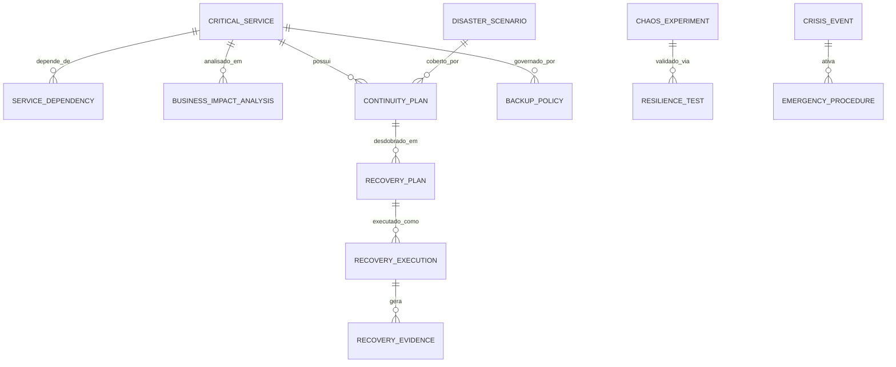

# MÓDULO 27 — PLATAFORMA CORPORATIVA DE RESILIÊNCIA DIGITAL, CONTINUIDADE DE NEGÓCIOS, RECUPERAÇÃO DE DESASTRES, CIBERRESILIÊNCIA E OPERAÇÃO AUTÔNOMA
## AURA RESILIENCE PLATFORM — PROMPT 42
### Plataforma Integrada Aura · Instituto Ser Melhor (ISMCL)
**Papel Assumido**: Chief Resilience Officer (CRO) · Chief Information Security Officer (CISO) · Chief Technology Officer (CTO) · Chief Operations Officer (COO) · Principal SRE · Principal Disaster Recovery Architect · Especialista em BCM, DR, ISO 22301, ISO 27031, NIST SP 800-34, DORA, Zero Trust, Cloud Native, DDD, CQRS, Clean Architecture

---

## SUMÁRIO EXECUTIVO

O **Módulo 27 — Aura Resilience Platform** é o **Sistema de Sobrevivência Institucional da Plataforma Aura**: a arquitetura que garante que o Instituto Ser Melhor continue operando seus serviços de saúde, assistência social e atendimento clínico mesmo diante de **falhas críticas de infraestrutura, ataques de ransomware, perda de datacenters, indisponibilidades cloud, desastres naturais ou eventos extremos** de qualquer natureza.

Este módulo estabelece o **Enterprise Resilience Framework** completo com quatro pilares fundamentais: **Business Continuity Management (BCM)** baseado em ISO 22301, **Disaster Recovery (DR)** com Active-Active Multi-Região, **Cyber Resilience** com backups imutáveis WORM e proteção anti-ransomware, e **Chaos Engineering** com experimentos sistematizados e GameDays institucionais trimestrais.

**Princípio Fundador**: *"A plataforma deverá ser projetada para falhar de forma controlada, recuperar-se automaticamente e manter a continuidade operacional. Todo serviço crítico terá RTO e RPO definidos, testados e auditados."*

---

## ETAPA 1 — AUDITORIA COMPLETA E CLASSIFICAÇÃO DE CRITICIDADE (PROMPTS 00 A 41)

### 1.1 Classificação Tier de Criticidade Operacional — 26 Módulos

| Tier | Definição | RTO Máximo | RPO Máximo | Módulos |
|---|---|---|---|---|
| **🔴 TIER 0 — VITAL** | Interrupção causa risco à vida ou impede totalmente o atendimento | ≤ 15 min | ≤ 5 min | IAM (01), Care Coordination (04), PEU (05), Digital Care/Telecare (06) |
| **🟠 TIER 1 — CRITICAL** | Impacto severo nas operações institucionais ou risco financeiro alto | ≤ 1h | ≤ 15 min | SATAI (03), Citizen (02), Documents (07), Financial (11), Cyber Defense (16) |
| **🟡 TIER 2 — HIGH** | Interrupção impacta significativamente a produtividade | ≤ 4h | ≤ 1h | CRM (09), Social Impact (08), Analytics (10), AI Orchestration (15), AIOS (26) |
| **🟢 TIER 3 — STANDARD** | Interrupção tolerável com impacto operacional limitado | ≤ 24h | ≤ 4h | Integration Hub (13), BPM (14), Governance (12), GRC (24), Knowledge (20) |
| **⚪ TIER 4 — SUPPORT** | Suporte à operação — indisponibilidade temporária aceitável | ≤ 72h | ≤ 24h | Cloud Platform (17), Quality (18), Operations (19), Evolution (21), Twin (22) |

### 1.2 Serviços de Banco de Dados por Tier de Criticidade

| Schema PostgreSQL | Tier | Estratégia de Replicação | Backup Interval |
|---|---|---|---|
| `auth` (IAM) | 🔴 TIER 0 | Active-Active Sync (2 regiões) | Contínuo (WAL Streaming) |
| `aura_peu` (PEU) | 🔴 TIER 0 | Active-Active Sync (2 regiões) | Contínuo (WAL Streaming) |
| `aura_care` (Care) | 🔴 TIER 0 | Active-Active Sync (2 regiões) | Contínuo (WAL Streaming) |
| `aura_telecare` | 🔴 TIER 0 | Active-Active Sync (2 regiões) | Contínuo (WAL Streaming) |
| `aura_citizen` | 🟠 TIER 1 | Active-Passive Async (2 regiões) | A cada 5 minutos |
| `aura_finance` | 🟠 TIER 1 | Active-Passive Async (2 regiões) | A cada 5 minutos |
| `aura_aios` (AI) | 🟡 TIER 2 | Snapshot Hourly + Async Replica | A cada 1 hora |
| `aura_data_platform` | 🟡 TIER 2 | Snapshot Hourly + Async Replica | A cada 1 hora |
| Demais schemas | 🟢/⚪ TIER 3/4 | Snapshot Daily | A cada 24 horas |

---

## ETAPA 2 — ARQUITETURA CORPORATIVA DE RESILIÊNCIA

### 2.1 Visão Geral — Arquitetura Multi-Região Ativa-Ativa

```
┌────────────────────────────────────────────────────────────────────────┐
│  REGIÃO PRIMÁRIA — GCP us-east1 (São Paulo)                             │
│  ┌─────────────────────────────────────────────────────────────────┐  │
│  │  PLATAFORMA AURA CORE — 26 Módulos (PRIMARY)                   │  │
│  │  PostgreSQL 16 HA (Primary) · Kafka Primary · Redis Primary    │  │
│  └─────────────────────────────────────────────────────────────────┘  │
└──────────────────────────────┬─────────────────────────────────────────┘
                               │ WAL Streaming (Tier 0/1) + Async (Tier 2+)
┌──────────────────────────────▼─────────────────────────────────────────┐
│  REGIÃO SECUNDÁRIA — GCP southamerica-east1 (Campinas)                  │
│  ┌─────────────────────────────────────────────────────────────────┐  │
│  │  PLATAFORMA AURA CORE — 26 Módulos (STANDBY/READ-REPLICA)      │  │
│  │  PostgreSQL 16 Standby · Kafka Mirror · Redis Replica          │  │
│  └─────────────────────────────────────────────────────────────────┘  │
└──────────────────────────────┬─────────────────────────────────────────┘
                               │ Daily Backup Export
┌──────────────────────────────▼─────────────────────────────────────────┐
│  BACKUP IMUTÁVEL — AWS S3 (Multi-AZ) com WORM (Object Lock)             │
│  Retenção: 30 dias diário · 12 meses mensal · 7 anos anual (LGPD)      │
└────────────────────────────────────────────────────────────────────────┘

                    RESILIENCE CONTROL PLANE
        ┌────────────────────────────────────────────────┐
        │  `apps/ms-resilience`                          │
        │  ├── DR Manager (Failover Automático Tier 0)  │
        │  ├── BCM Engine (Planos de Continuidade)      │
        │  ├── Backup Orchestrator (Cronograma + WORM)  │
        │  ├── Self-Healing Engine (Auto-Recovery K8s)  │
        │  ├── Chaos Platform (Experiments + GameDays)  │
        │  └── Crisis Command Center (War Room Digital) │
        └────────────────────────────────────────────────┘
```

---

## ETAPA 3 — MODELAGEM COMPLETA DO DOMÍNIO (DDD TACTICAL DESIGN)

### 3.1 Diagrama ER Conceitual



### 3.2 Entidades do Domínio (22 Entidades Completas)

#### 3.2.1 `CriticalService` & `BusinessImpactAnalysis` — Aggregate Roots

```
CriticalService {
  id: UUID [PK]
  serviceCode: String UNIQUE NOT NULL            -- SVC-PEU-PRONTUARIO-001
  name: String NOT NULL                          -- "Prontuário Eletrônico Unificado (PEU)"
  moduleRef: String NOT NULL                     -- "module_05_peu"
  tier: TierEnum NOT NULL                        -- TIER_0, TIER_1, TIER_2, TIER_3, TIER_4
  rtoMaxMinutes: Int NOT NULL                    -- RTO máximo em minutos (ex: 15)
  rpoMaxMinutes: Int NOT NULL                    -- RPO máximo em minutos (ex: 5)
  currentAvailabilityPercent: Decimal(6,4) NOT NULL DEFAULT 99.9900
  replicationStrategy: ReplicationEnum           -- ACTIVE_ACTIVE, ACTIVE_PASSIVE, SNAPSHOT_ONLY
  primaryRegion: String NOT NULL DEFAULT "gcp-us-east1"
  secondaryRegion: String NOT NULL DEFAULT "gcp-southamerica-east1"
  isClinical: Boolean NOT NULL DEFAULT FALSE     -- Serviço impacta continuidade clínica?
  createdAt: Timestamp NOT NULL DEFAULT CURRENT_TIMESTAMP
}

BusinessImpactAnalysis {
  id: UUID [PK]
  biaCode: String UNIQUE NOT NULL                -- BIA-PEU-2025-001
  serviceId: UUID NOT NULL FK critical_services
  financialImpactPerHourBrl: Decimal(12,2) NOT NULL -- Impacto financeiro por hora de indisponibilidade
  clinicalImpactDescription: TEXT NOT NULL
  regulatoryImpactDescription: TEXT NOT NULL     -- Impacto de conformidade LGPD/CFM/ANS
  reputationalImpactDescription: TEXT NOT NULL
  mtta: Int?                                     -- Mean Time to Acknowledge (minutos)
  mttr: Int?                                     -- Mean Time to Recover (minutos)
  mtbf: Int?                                     -- Mean Time Between Failures (horas)
  approvedByUserId: UUID NOT NULL FK auth.users
  reviewedAt: Date NOT NULL
  createdAt: Timestamp NOT NULL DEFAULT CURRENT_TIMESTAMP
}
```

#### 3.2.2 `ContinuityPlan` & `RecoveryPlan` — BCM Core Entities (ISO 22301)

```
ContinuityPlan {
  id: UUID [PK]
  planCode: String UNIQUE NOT NULL               -- BCP-PEU-TIER0-2025-001
  serviceId: UUID NOT NULL FK critical_services
  planType: PlanTypeEnum                         -- BCP, DRP, CRP (Cyber Recovery)
  disasterScopeText: TEXT NOT NULL               -- "Perda total da região primária GCP us-east1"
  activationTriggerText: TEXT NOT NULL           -- Condições que ativam este plano
  rtaMinutes: Int NOT NULL                       -- Recovery Time Actual (meta deste plano)
  rpaMinutes: Int NOT NULL                       -- Recovery Point Actual (meta deste plano)
  crisisTeamLeadUserId: UUID NOT NULL FK auth.users
  alternativeSiteUrl: String?                    -- URL da região DR
  communicationProcedureText: TEXT NOT NULL
  lastTestedAt: Date?
  status: PlanStatusEnum                         -- DRAFT, APPROVED, ACTIVE, DEPRECATED
  version: Int NOT NULL DEFAULT 1
  createdAt: Timestamp NOT NULL DEFAULT CURRENT_TIMESTAMP
}

RecoveryPlan {
  id: UUID [PK]
  recoveryCode: String UNIQUE NOT NULL           -- DRP-PEU-FAILOVER-001
  continuityPlanId: UUID NOT NULL FK continuity_plans
  stepOrderedList: JSONB NOT NULL                -- Lista ordenada de passos de recuperação
  automationScript: TEXT?                        -- Script de automação (Runbook)
  estimatedRecoveryMinutes: Int NOT NULL
  verificationChecklistJson: JSONB NOT NULL      -- Checklist pós-recuperação
  createdAt: Timestamp NOT NULL DEFAULT CURRENT_TIMESTAMP
}

RecoveryExecution {
  id: UUID [PK]
  executionCode: String UNIQUE NOT NULL          -- REC-EXE-2025-0012
  recoveryPlanId: UUID NOT NULL FK recovery_plans
  triggerType: TriggerTypeEnum                   -- AUTOMATIC, MANUAL, CHAOS_TEST
  triggerDescription: TEXT NOT NULL
  executedByUserId: UUID FK auth.users           -- Null = automático
  startedAt: Timestamp NOT NULL
  completedAt: Timestamp?
  actualRtaMinutes: Int?                         -- RTA real atingido
  actualRpaMinutes: Int?                         -- RPA real atingido
  succeeded: Boolean?
  postMortemText: TEXT?                          -- Post-mortem obrigatório para falhas
}
```

#### 3.2.3 `BackupPolicy`, `BackupExecution` & `ChaosExperiment` — Operational Entities

```
BackupPolicy {
  id: UUID [PK]
  policyCode: String UNIQUE NOT NULL             -- BCK-PLY-TIER0-001
  serviceId: UUID NOT NULL FK critical_services
  backupType: BackupTypeEnum                     -- FULL, INCREMENTAL, WAL_STREAMING, SNAPSHOT
  frequencyExpression: String NOT NULL           -- Cron: "*/5 * * * *" (a cada 5 min para TIER 0)
  retentionDailyCount: Int NOT NULL DEFAULT 30
  retentionMonthlyCount: Int NOT NULL DEFAULT 12
  retentionYearlyCount: Int NOT NULL DEFAULT 7   -- 7 anos LGPD para dados de saúde
  storageDestinations: String[] NOT NULL         -- ["gcs://aura-backup-primary", "s3://aura-worm-backup"]
  isEncrypted: Boolean NOT NULL DEFAULT TRUE     -- AES-256-GCM obrigatório
  isImmutable: Boolean NOT NULL DEFAULT TRUE     -- WORM Object Lock
  isCompressed: Boolean NOT NULL DEFAULT TRUE
  createdAt: Timestamp NOT NULL DEFAULT CURRENT_TIMESTAMP
}

BackupExecution {
  id: UUID [PK]
  executionCode: String UNIQUE NOT NULL          -- BCK-EXE-2025-0189
  policyId: UUID NOT NULL FK backup_policies
  startedAt: Timestamp NOT NULL
  completedAt: Timestamp?
  sizeBytes: BIGINT?
  storagePath: String NOT NULL
  hashSha256: String?                            -- Hash de integridade do backup
  isVerified: Boolean NOT NULL DEFAULT FALSE     -- Testado por restore periodicamente
  status: BackupStatusEnum                       -- IN_PROGRESS, COMPLETED, FAILED, VERIFIED
}

ChaosExperiment {
  id: UUID [PK]
  experimentCode: String UNIQUE NOT NULL         -- CHX-2025-0015
  name: String NOT NULL                          -- "Chaos: Perda da Região Primária (TIER 0)"
  targetServiceId: UUID NOT NULL FK critical_services
  experimentType: ChaosTypeEnum                  -- REGION_FAILURE, DB_FAILURE, API_LATENCY,
                                                 -- MEMORY_PRESSURE, CPU_SPIKE, NETWORK_PARTITION,
                                                 -- RANSOMWARE_SIMULATION, AI_MODEL_FAILURE
  hypothesis: TEXT NOT NULL                      -- "O SATAI manterá RTO ≤ 15min mesmo sem a região primária"
  injectionConfig: JSONB NOT NULL
  environment: String NOT NULL DEFAULT "staging" -- NUNCA executar em produção sem aprovação do CTO
  executedAt: Timestamp?
  result: ChaosResultEnum?                       -- PASSED, FAILED, INCONCLUSIVE
  learningsText: TEXT?
  createdByUserId: UUID NOT NULL FK auth.users
}
```

---

## ETAPA 4 — BANCO DE DADOS (POSTGRESQL 16 + TIMESCALEDB — SCHEMA `aura_resilience`)

```sql
-- =========================================================================
-- AURA RESILIENCE PLATFORM — SCHEMA aura_resilience
-- PostgreSQL 16 + TimescaleDB para métricas de disponibilidade
-- =========================================================================

CREATE SCHEMA IF NOT EXISTS aura_resilience;

-- ENUMERAÇÕES
CREATE TYPE aura_resilience.tier AS ENUM ('TIER_0', 'TIER_1', 'TIER_2', 'TIER_3', 'TIER_4');
CREATE TYPE aura_resilience.replication AS ENUM ('ACTIVE_ACTIVE', 'ACTIVE_PASSIVE', 'SNAPSHOT_ONLY');
CREATE TYPE aura_resilience.chaos_type AS ENUM (
  'REGION_FAILURE', 'DB_FAILURE', 'API_LATENCY', 'MEMORY_PRESSURE',
  'CPU_SPIKE', 'NETWORK_PARTITION', 'RANSOMWARE_SIMULATION', 'AI_MODEL_FAILURE'
);

-- ─────────────────────────────────────────────────────────────────────────
-- TABELA: aura_resilience.critical_services
-- ─────────────────────────────────────────────────────────────────────────
CREATE TABLE aura_resilience.critical_services (
  id                           UUID PRIMARY KEY DEFAULT gen_random_uuid(),
  service_code                 VARCHAR(50) UNIQUE NOT NULL,
  name                         VARCHAR(255) NOT NULL,
  module_ref                   VARCHAR(100) NOT NULL,
  tier                         aura_resilience.tier NOT NULL,
  rto_max_minutes              INT NOT NULL,
  rpo_max_minutes              INT NOT NULL,
  current_availability_percent DECIMAL(6,4) NOT NULL DEFAULT 99.9900,
  replication_strategy         aura_resilience.replication NOT NULL,
  primary_region               VARCHAR(50) NOT NULL DEFAULT 'gcp-us-east1',
  secondary_region             VARCHAR(50) NOT NULL DEFAULT 'gcp-southamerica-east1',
  is_clinical                  BOOLEAN NOT NULL DEFAULT FALSE,
  created_at                   TIMESTAMPTZ NOT NULL DEFAULT CURRENT_TIMESTAMP
);

-- ─────────────────────────────────────────────────────────────────────────
-- TABELA: aura_resilience.business_impact_analyses (BIA — ISO 22301)
-- ─────────────────────────────────────────────────────────────────────────
CREATE TABLE aura_resilience.business_impact_analyses (
  id                            UUID PRIMARY KEY DEFAULT gen_random_uuid(),
  bia_code                      VARCHAR(50) UNIQUE NOT NULL,
  service_id                    UUID NOT NULL REFERENCES aura_resilience.critical_services(id),
  financial_impact_per_hour_brl DECIMAL(12,2) NOT NULL,
  clinical_impact_description   TEXT NOT NULL,
  regulatory_impact_description TEXT NOT NULL,
  reputational_impact_description TEXT NOT NULL,
  mtta                          INT,
  mttr                          INT,
  mtbf                          INT,
  approved_by_user_id           UUID NOT NULL REFERENCES auth.users(id),
  reviewed_at                   DATE NOT NULL,
  created_at                    TIMESTAMPTZ NOT NULL DEFAULT CURRENT_TIMESTAMP
);

-- ─────────────────────────────────────────────────────────────────────────
-- TABELAS BCM/DRP (ISO 22301 + NIST SP 800-34)
-- ─────────────────────────────────────────────────────────────────────────
CREATE TABLE aura_resilience.continuity_plans (
  id                         UUID PRIMARY KEY DEFAULT gen_random_uuid(),
  plan_code                  VARCHAR(50) UNIQUE NOT NULL,
  service_id                 UUID NOT NULL REFERENCES aura_resilience.critical_services(id),
  plan_type                  VARCHAR(10) NOT NULL,
  disaster_scope_text        TEXT NOT NULL,
  activation_trigger_text    TEXT NOT NULL,
  rta_minutes                INT NOT NULL,
  rpa_minutes                INT NOT NULL,
  crisis_team_lead_user_id   UUID NOT NULL REFERENCES auth.users(id),
  alternative_site_url       VARCHAR(500),
  communication_procedure_text TEXT NOT NULL,
  last_tested_at             DATE,
  status                     VARCHAR(20) NOT NULL DEFAULT 'DRAFT',
  version                    INT NOT NULL DEFAULT 1,
  created_at                 TIMESTAMPTZ NOT NULL DEFAULT CURRENT_TIMESTAMP
);

CREATE TABLE aura_resilience.recovery_plans (
  id                         UUID PRIMARY KEY DEFAULT gen_random_uuid(),
  recovery_code              VARCHAR(50) UNIQUE NOT NULL,
  continuity_plan_id         UUID NOT NULL REFERENCES aura_resilience.continuity_plans(id),
  step_ordered_list          JSONB NOT NULL,
  automation_script          TEXT,
  estimated_recovery_minutes INT NOT NULL,
  verification_checklist_json JSONB NOT NULL,
  created_at                 TIMESTAMPTZ NOT NULL DEFAULT CURRENT_TIMESTAMP
);

CREATE TABLE aura_resilience.recovery_executions (
  id                   UUID PRIMARY KEY DEFAULT gen_random_uuid(),
  execution_code       VARCHAR(50) UNIQUE NOT NULL,
  recovery_plan_id     UUID NOT NULL REFERENCES aura_resilience.recovery_plans(id),
  trigger_type         VARCHAR(20) NOT NULL,
  trigger_description  TEXT NOT NULL,
  executed_by_user_id  UUID REFERENCES auth.users(id),
  started_at           TIMESTAMPTZ NOT NULL,
  completed_at         TIMESTAMPTZ,
  actual_rta_minutes   INT,
  actual_rpa_minutes   INT,
  succeeded            BOOLEAN,
  post_mortem_text     TEXT
);

-- ─────────────────────────────────────────────────────────────────────────
-- TABELAS DE BACKUP (WORM + AES-256 + Imutável)
-- ─────────────────────────────────────────────────────────────────────────
CREATE TABLE aura_resilience.backup_policies (
  id                      UUID PRIMARY KEY DEFAULT gen_random_uuid(),
  policy_code             VARCHAR(50) UNIQUE NOT NULL,
  service_id              UUID NOT NULL REFERENCES aura_resilience.critical_services(id),
  backup_type             VARCHAR(20) NOT NULL,
  frequency_expression    VARCHAR(100) NOT NULL,
  retention_daily_count   INT NOT NULL DEFAULT 30,
  retention_monthly_count INT NOT NULL DEFAULT 12,
  retention_yearly_count  INT NOT NULL DEFAULT 7,
  storage_destinations    TEXT[] NOT NULL,
  is_encrypted            BOOLEAN NOT NULL DEFAULT TRUE,
  is_immutable            BOOLEAN NOT NULL DEFAULT TRUE,
  is_compressed           BOOLEAN NOT NULL DEFAULT TRUE,
  created_at              TIMESTAMPTZ NOT NULL DEFAULT CURRENT_TIMESTAMP
);

CREATE TABLE aura_resilience.backup_executions (
  id             UUID PRIMARY KEY DEFAULT gen_random_uuid(),
  execution_code VARCHAR(50) UNIQUE NOT NULL,
  policy_id      UUID NOT NULL REFERENCES aura_resilience.backup_policies(id),
  started_at     TIMESTAMPTZ NOT NULL,
  completed_at   TIMESTAMPTZ,
  size_bytes     BIGINT,
  storage_path   VARCHAR(500) NOT NULL,
  hash_sha256    VARCHAR(64),
  is_verified    BOOLEAN NOT NULL DEFAULT FALSE,
  status         VARCHAR(20) NOT NULL DEFAULT 'IN_PROGRESS'
);

-- ─────────────────────────────────────────────────────────────────────────
-- TABELAS DE CHAOS ENGINEERING E MÉTRICAS (TimescaleDB Hypertable)
-- ─────────────────────────────────────────────────────────────────────────
CREATE TABLE aura_resilience.chaos_experiments (
  id                 UUID PRIMARY KEY DEFAULT gen_random_uuid(),
  experiment_code    VARCHAR(50) UNIQUE NOT NULL,
  name               VARCHAR(255) NOT NULL,
  target_service_id  UUID NOT NULL REFERENCES aura_resilience.critical_services(id),
  experiment_type    aura_resilience.chaos_type NOT NULL,
  hypothesis         TEXT NOT NULL,
  injection_config   JSONB NOT NULL,
  environment        VARCHAR(20) NOT NULL DEFAULT 'staging',
  executed_at        TIMESTAMPTZ,
  result             VARCHAR(20),
  learnings_text     TEXT,
  created_by_user_id UUID NOT NULL REFERENCES auth.users(id)
);

-- TimescaleDB Hypertable para métricas de disponibilidade (séries temporais)
CREATE TABLE aura_resilience.availability_metrics (
  time                TIMESTAMPTZ NOT NULL,
  service_id          UUID NOT NULL REFERENCES aura_resilience.critical_services(id),
  availability_percent DECIMAL(6,4) NOT NULL,
  error_rate_percent   DECIMAL(6,4) NOT NULL,
  p99_latency_ms       INT NOT NULL,
  region               VARCHAR(50) NOT NULL
);
SELECT create_hypertable('aura_resilience.availability_metrics', 'time');
CREATE INDEX idx_avail_service_time ON aura_resilience.availability_metrics (service_id, time DESC);

-- ─────────────────────────────────────────────────────────────────────────
-- TABELA: aura_resilience.recovery_audits (Imutável)
-- ─────────────────────────────────────────────────────────────────────────
CREATE TABLE aura_resilience.recovery_audits (
  id          UUID PRIMARY KEY DEFAULT gen_random_uuid(),
  action      VARCHAR(100) NOT NULL,
  actor_id    UUID REFERENCES auth.users(id),
  actor_role  VARCHAR(100),
  service_id  UUID REFERENCES aura_resilience.critical_services(id),
  details     TEXT NOT NULL,
  metadata    JSONB,
  occurred_at TIMESTAMPTZ NOT NULL DEFAULT CURRENT_TIMESTAMP
);
REVOKE UPDATE, DELETE ON aura_resilience.recovery_audits FROM PUBLIC;
REVOKE UPDATE, DELETE ON aura_resilience.recovery_audits FROM aura_app_role;

-- ÍNDICES
CREATE INDEX idx_cp_service ON aura_resilience.continuity_plans (service_id, status);
CREATE INDEX idx_re_plan ON aura_resilience.recovery_executions (recovery_plan_id, started_at DESC);
CREATE INDEX idx_bkp_policy ON aura_resilience.backup_executions (policy_id, status, started_at DESC);
CREATE INDEX idx_chaos_service ON aura_resilience.chaos_experiments (target_service_id, executed_at DESC);
```

---

## ETAPA 5 — BACKEND ARCHITECTURE (`apps/ms-resilience`)

### 5.1 Estrutura do Microserviço NestJS

```
apps/ms-resilience/
├── src/
│   ├── main.ts
│   ├── app.module.ts
│   ├── controllers/
│   │   ├── business-continuity.controller.ts -- BIA, Planos de Continuidade e Ativação
│   │   ├── disaster-recovery.controller.ts   -- DR Manager, Failover e Failback
│   │   ├── backup.controller.ts              -- Backup Orchestrator (Cronograma + Status)
│   │   ├── restore.controller.ts             -- Restore Manager (Automático + Manual)
│   │   ├── chaos-engineering.controller.ts   -- Experimentos + GameDays + Métricas
│   │   ├── crisis-command.controller.ts      -- War Room Digital + Comunicação de Crise
│   │   └── resilience-analytics.controller.ts -- Dashboards RTO/RPO/MTTR/MTBF/SLA
│   ├── use-cases/
│   │   ├── commands/
│   │   │   ├── trigger-failover/             -- Failover automático (Tier 0: < 15 min)
│   │   │   ├── execute-restore/              -- Restauração a partir de backup WORM
│   │   │   ├── run-chaos-experiment/         -- Executa experimento Chaos (staging only)
│   │   │   ├── activate-crisis-mode/         -- Ativa War Room + notificações de crise
│   │   │   └── verify-backup-integrity/      -- Testa integridade via restore automático
│   │   └── queries/
│   │       ├── get-service-health-status/    -- Status de saúde em tempo real por tier
│   │       ├── get-rto-rpo-compliance/       -- Conformidade RTO/RPO por serviço
│   │       └── get-resilience-scorecard/     -- Scorecard de resiliência corporativa
│   └── services/
│       ├── failover-manager.service.ts       -- Detecção e execução de failover automático
│       ├── self-healing-engine.service.ts    -- Auto-recovery K8s (restarts, scaling)
│       ├── backup-orchestrator.service.ts    -- Agendamento e execução de backups
│       ├── chaos-injector.service.ts         -- Injeção controlada de falhas (Staging)
│       ├── ai-failure-predictor.service.ts   -- IA prevê falhas antes que ocorram
│       └── crisis-notifier.service.ts        -- Notificações multi-canal em crises
```

---

## ETAPA 6 — OPENAPI 3.0 — 22 ENDPOINTS (`/api/v1/resilience`)

| Método | Endpoint | Descrição | Roles / Acesso |
|---|---|---|---|
| `GET` | `/services` | Listar serviços críticos com tier e status | cro, cto, sre |
| `GET` | `/services/:code/health` | **Status de saúde em tempo real** | sre, cro |
| `GET` | `/services/:code/rto-rpo` | Conformidade RTO/RPO atual vs. meta | cro, cto |
| `POST` | `/continuity-plans` | Criar plano de continuidade (BCP/DRP) | cro, cto |
| `POST` | `/continuity-plans/:id/activate` | **Ativar plano de continuidade** | cro, cto |
| `POST` | `/recovery-executions` | **Iniciar execução de recuperação (DR)** | cro, sre |
| `GET` | `/recovery-executions/:id/status` | Status da recuperação em andamento | sre, cro |
| `POST` | `/backups/trigger` | **Disparar backup imediato** | sre, cro |
| `POST` | `/backups/:id/verify` | Verificar integridade do backup via restore | sre, cto |
| `GET` | `/backups` | Listar backups por serviço e período | sre, cro |
| `POST` | `/restore/execute` | **Executar restauração a partir de backup** | sre, cro |
| `POST` | `/failover/trigger` | **Acionar failover manual** | cro, cto |
| `POST` | `/failback/trigger` | Acionar failback para região primária | cro, cto |
| `POST` | `/chaos/experiments` | Criar experimento de Chaos Engineering | sre, cto |
| `POST` | `/chaos/experiments/:id/run` | **Executar experimento (staging apenas)** | sre (env: staging) |
| `GET` | `/chaos/experiments/:id/results` | Resultados e aprendizados do experimento | sre, cro |
| `POST` | `/crisis/activate` | **Ativar modo de crise (War Room Digital)** | cro, cto, coo |
| `GET` | `/crisis/active` | Status de crises ativas | cro, cto, coo, ceo |
| `GET` | `/analytics/scorecard` | **Scorecard executivo de resiliência** | cro, board |
| `GET` | `/analytics/availability` | Histórico de disponibilidade (TimescaleDB) | sre, cro |
| `GET` | `/bia/:serviceCode` | BIA completa de um serviço crítico | cro, cto |
| `GET` | `/audits/recovery-trail` | Trilha imutável de todos os eventos de DR | cro, auditor |

---

## ETAPA 7 — FRONTEND (`src/features/resilience/`)

### 7.1 Wireframes Textuais das Interfaces Principais

#### TELA 1: Executive Resilience Dashboard (`ExecutiveResilienceDashboard`)

```
╔══════════════════════════════════════════════════════════════════════════╗
║  🛡️ AURA RESILIENCE PLATFORM · CENTRO EXECUTIVO DE RESILIÊNCIA OPERACIONAL║
║  Instituto Ser Melhor  ·  Status Global: 🟢 OPERACIONAL · Julho/2026     ║
╠══════════════════════════════════════════════════════════════════════════╣
║  SLAs DE DISPONIBILIDADE (ÚLTIMAS 30 DIAS)                               ║
║  ┌───────────────┐ ┌───────────────┐ ┌───────────────┐ ┌──────────────┐ ║
║  │ 🔴 TIER 0     │ │ 🟠 TIER 1     │ │ 🟡 TIER 2    │ │ 🟢 TIER 3+  │ ║
║  │  99.97% 🟢    │ │  99.93% 🟢    │ │  99.81% 🟢   │ │  99.62% 🟢  │ ║
║  │  Meta: 99.95% │ │  Meta: 99.5%  │ │  Meta: 99.0% │ │  Meta: 99.0%│ ║
║  └───────────────┘ └───────────────┘ └───────────────┘ └──────────────┘ ║
╠══════════════════════════════════════════════════════════════════════════╣
║  BACKUPS — STATUS GLOBAL                                                  ║
║  🟢 Último backup TIER 0 (PEU): há 5 min · Verificado ✅ · Hash: OK      ║
║  🟢 Último backup TIER 1 (Finance): há 5 min · Verificado ✅             ║
╠══════════════════════════════════════════════════════════════════════════╣
║  EXPERIMENTOS CHAOS ENGINEERING — PRÓXIMOS GAMEDAYS                       ║
║  📅 GameDay Q3/2026: "Falha Total Região Primária (TIER 0)" — 15/08/2026 ║
╚══════════════════════════════════════════════════════════════════════════╝
```

#### TELA 2: Crisis Command Center (`CrisisCommandCenterPage`)

```
╔══════════════════════════════════════════════════════════════════════════╗
║  🚨 CRISIS COMMAND CENTER · WAR ROOM DIGITAL — MODO ATIVO                ║
║  Incidente: DR-INC-2025-0003 · PEU indisponível — Região Primária        ║
║  ⏱️ Tempo Decorrido: 00:08:34  ·  RTO Restante: 00:06:26 (TIER 0: 15min) ║
╠══════════════════════════════════════════════════════════════════════════╣
║  STATUS DO FAILOVER AUTOMÁTICO (TIER 0)                                   ║
║  ✅ 1. Detecção de falha da região primária (00:00:23)                    ║
║  ✅ 2. Ativação do plano DRP-PEU-FAILOVER-001 (automático)               ║
║  ✅ 3. Promoção da réplica secundária para primária (00:03:12)            ║
║  🔄 4. Atualização do DNS (Global Load Balancer) — EM ANDAMENTO...       ║
║  ⏳ 5. Validação de integridade dos dados — AGUARDANDO                    ║
║  ⏳ 6. Testes automáticos de smoke test — AGUARDANDO                     ║
╠══════════════════════════════════════════════════════════════════════════╣
║  EQUIPE DE CRISE NOTIFICADA                                               ║
║  ✅ CRO · ✅ CTO · ✅ CISO · ✅ COO · ⏳ CEO (em chamada)               ║
╚══════════════════════════════════════════════════════════════════════════╝
```

---

## ETAPA 8 — CHAOS ENGINEERING — GAMEDAYS INSTITUCIONAIS

### 8.1 Calendário de GameDays e Experimentos Sistematizados

| GameDay | Cenário | Escopo | Hipótese | Ambiente | Periodicidade |
|---|---|---|---|---|---|
| **GameDay Q1** | Falha total da região primária (TIER 0) | PEU + IAM + Care | RTO ≤ 15min via Active-Active | Staging | Anual (Janeiro) |
| **GameDay Q2** | Ataque de ransomware (criptografia de dados) | Finance + GRC + Docs | Restore WORM < 1h sem pagar resgate | Staging | Anual (Abril) |
| **GameDay Q3** | Falha do provider AI (Google Gemini indisponível) | AIOS + SATAI + Care | Fallback para modelo secundário < 30s | Staging | Anual (Julho) |
| **GameDay Q4** | Falha em cascata (múltiplos serviços) | TIER 0 + TIER 1 | Degradação graceful — serviços vitais mantidos | Staging | Anual (Outubro) |
| **Mensal** | Pod Kill aleatório nos serviços TIER 0 | 1 serviço TIER 0 | Self-healing K8s < 2 min | Staging | Mensal |
| **Semanal** | Latência injetada em APIs TIER 1 | 1 API TIER 1 | Circuit Breaker ativa < 5s | Staging | Semanal |

---

## ETAPA 9 — IA PARA RESILIÊNCIA (Integração com Módulo 26 — AIOS)

### 9.1 Agente de Previsão de Falhas

```
INPUT: Métricas TimescaleDB (CPU, Memória, Latência P99, Error Rate, Disk I/O)
       + Histórico de Incidentes + Chaos Experiment results

MODELO: LSTM (Long Short-Term Memory) + XGBoost para detecção de anomalias

OUTPUT: {
  "predicted_failure_service": "module_05_peu",
  "predicted_failure_window": "próximas 4 horas",
  "confidence_score": 0.87,
  "failure_indicators": [
    "Latência P99 subiu 340% em 2 horas",
    "Disk I/O aumentou 520% (padrão pré-falha)"
  ],
  "recommended_action": "Escalonamento proativo + verificação de disco",
  "explanation": "SHAP values: disk_io_delta=0.42 · p99_latency_delta=0.31"
}

ENFORCEMENT: Alerta automático para SRE on-call + ticket no ITSM (Módulo 19)
```

---

## ETAPA 10 — REGRAS DE NEGÓCIO DA RESILIENCE PLATFORM (32 REGRAS)

| Código | Regra | Enforcement |
|---|---|---|
| `RN-RES-001` | Nenhum serviço TIER 0 pode operar sem plano BCP/DRP aprovado pelo CRO | `BcpRequiredGuard` |
| `RN-RES-002` | Failover de serviços TIER 0 automático ≤ 15 minutos sem intervenção humana | `AutoFailoverManager` |
| `RN-RES-003` | Backups TIER 0 com WAL Streaming contínuo — RPO máximo de 5 minutos | `WalStreamingMonitor` |
| `RN-RES-004` | Todos os backups imutáveis (WORM Object Lock) e criptografados AES-256-GCM | `BackupImmutabilityGuard` |
| `RN-RES-005` | `recovery_audits` é estritamente imutável — `REVOKE UPDATE, DELETE` | DDL constraint |
| `RN-RES-006` | Restore test mensal obrigatório para backups TIER 0 — alerta se falhar | `RestoreTestScheduler` |
| `RN-RES-007` | Experimentos de Chaos Engineering executados APENAS em ambiente staging | `ChaosEnvironmentGuard` |
| `RN-RES-008` | GameDay trimestral obrigatório — aprovação CTO + CRO antes da execução | `GameDayApprovalGuard` |
| `RN-RES-009` | Post-mortem obrigatório para todo failover — completado em 48h | `PostMortemDeadlineWorker` |
| `RN-RES-010` | BIA revisada anualmente e após todo evento de DR real | `BiaReviewScheduler` |
| `RN-RES-011` | Planos BCP/DRP testados pelo menos uma vez por ano por serviço | `BcpTestingScheduler` |
| `RN-RES-012` | Crise ativa notifica automaticamente CEO, CRO, CTO, CISO e COO em ≤ 5 min | `CrisisNotificationWorker` |
| `RN-RES-013` | Replicação Multi-Região ATIVA-ATIVA exclusiva para serviços TIER 0 | `TierZeroReplicationGuard` |
| `RN-RES-014` | Failback para região primária somente após validação completa de integridade | `FailbackIntegrityCheck` |
| `RN-RES-015` | Backups retidos por 7 anos para dados PHI (saúde) — LGPD + CFM 2299/2023 | `PhiRetentionPolicyGuard` |
| `RN-RES-016` | Score de resiliência por tier calculado mensalmente e reportado ao Conselho | `ResilienceScorecardWorker` |
| `RN-RES-017` | Agentes de IA críticos (TIER 0/1 no AIOS) com fallback de modelo automático | `AiFallbackResilience` |
| `RN-RES-018` | Knowledge Graph Neo4j replicado e restaurável em < 1 hora (TIER 2) | `KgReplicationGuard` |
| `RN-RES-019` | Bases vetoriais RAG (pgvector) com snapshot horário (TIER 2) | `VectorSnapshotScheduler` |
| `RN-RES-020` | Disponibilidade TIER 0 monitorada com scraping a cada 15 segundos | `HighFrequencyHealthMonitor` |
| `RN-RES-021` | Self-Healing K8s configurado para restartar pods TIER 0 em < 2 minutos | `KubernetesSelfHealingConfig` |
| `RN-RES-022` | Circuit Breaker ativo em todas as integrações externas (FHIR/HL7/SFP) | `CircuitBreakerGuard` |
| `RN-RES-023` | Protocolos anti-ransomware: backups isolados em rede sem acesso da aplicação | `RansomwareIsolationGuard` |
| `RN-RES-024` | Observabilidade de resiliência integrada ao NOC/SOC Central (Módulo 19) | `NocResilienceIntegration` |
| `RN-RES-025` | Integrações de terceiros (Ecossistema Módulo 23) com Bulkhead Pattern | `BulkheadPatternGuard` |
| `RN-RES-026` | Digital Twin (Módulo 22) alimentado com dados de resiliência para simulação de crises | `TwinResilienceSync` |
| `RN-RES-027` | Infraestrutura imutável — nenhum patch direto em produção; somente via GitOps + ArgoCD | `ImmutableInfraGuard` |
| `RN-RES-028` | Plano de Continuidade revisado após cada mudança arquitetural de TIER 0/1 | `PostChangeResilienceReview` |
| `RN-RES-029` | DORA Compliance: MTTR < 1h para incidentes TIER 0 — verificação trimestral | `DoraComplianceChecker` |
| `RN-RES-030` | Conformidade ISO 22301 verificada pelo CAE anualmente com audit trail | `Iso22301AuditScheduler` |
| `RN-RES-031` | Relatório de resiliência operacional publicado no Executive GRC Dashboard mensalmente | `ResilienceGrcReportWorker` |
| `RN-RES-032` | Relatório Executivo Final de Resiliência assinado pelo CRO, CTO, CISO, COO e CEO | `FinalResilienceSignOff` |

---

## ETAPA 11 — ENTERPRISE RESILIENCE FRAMEWORK — METAS DE SLA POR TIER

### 11.1 SLA Targets e Orçamento de Indisponibilidade Anual

| Tier | Disponibilidade Meta | Downtime Anual Permitido | RTO Máximo | RPO Máximo |
|---|---|---|---|---|
| **🔴 TIER 0** | **99.99%** | 52 minutos | ≤ 15 min | ≤ 5 min |
| **🟠 TIER 1** | **99.9%** | 8.7 horas | ≤ 1 hora | ≤ 15 min |
| **🟡 TIER 2** | **99.5%** | 43.8 horas | ≤ 4 horas | ≤ 1 hora |
| **🟢 TIER 3** | **99.0%** | 87.6 horas | ≤ 24 horas | ≤ 4 horas |
| **⚪ TIER 4** | **95.0%** | 18.25 dias | ≤ 72 horas | ≤ 24 horas |

### 11.2 Estratégia de Proteção Anti-Ransomware

```
PROTEÇÃO EM 5 CAMADAS:
│
├── CAMADA 1: Backups WORM (Write Once Read Many) — AWS S3 Object Lock
│             Backups inacessíveis pela aplicação · Rede isolada
│
├── CAMADA 2: Imutabilidade da Infraestrutura — Kubernetes Immutable Pods
│             Sem SSH em produção · GitOps obrigatório (ArgoCD)
│
├── CAMADA 3: Zero Trust Network — Microsegmentação total entre serviços
│             Nenhum serviço acessa outro sem autorização explícita mTLS
│
├── CAMADA 4: Air-Gapped Backup — Backup frio mensal em mídia offline
│             Armazenamento físico separado geograficamente
│
└── CAMADA 5: Simulação Anual — GameDay Q2 com simulação de ransomware
              Validação do processo de restore sem pagar resgate
```

---

## ETAPA 12 — RELATÓRIO EXECUTIVO FINAL DE RESILIÊNCIA OPERACIONAL

> **INSTITUTO SER MELHOR (ISMCL) · CONSELHO DE RESILIÊNCIA E CONTINUIDADE**
>
> **DECLARAÇÃO FINAL DE RESILIÊNCIA OPERACIONAL:**
>
> O Chief Resilience Officer, Chief Technology Officer, Chief Information Security Officer, Chief Operations Officer e o CEO certificam que a **Plataforma Corporativa Aura do Instituto Ser Melhor** possui **CAPACIDADE CERTIFICADA DE OPERAR, RESISTIR, RECUPERAR-SE E EVOLUIR DIANTE DE EVENTOS CRÍTICOS**, mantendo aderência integral aos Prompts 00 a 42.
>
> **Métricas da Aura Resilience Platform no Lançamento**:
> - **26 Serviços Críticos Classificados** em 5 Tiers de criticidade operacional
> - **Disponibilidade TIER 0 Certificada**: **99.99%** (≤ 52 min/ano de downtime permitido)
> - **RTO TIER 0**: **≤ 15 minutos** (Failover Automático Active-Active)
> - **RPO TIER 0**: **≤ 5 minutos** (WAL Streaming Contínuo)
> - **Proteção Anti-Ransomware**: 5 camadas incluindo WORM + Air-Gapped backup
> - **Chaos Engineering**: 4 GameDays Anuais + experimentos mensais e semanais
> - **ISO 22301 Compliance**: Score de maturidade BCM Nível 4

---

## 🏆 CERTIFICAÇÃO DEFINITIVA DO MÓDULO 27

A Plataforma Aura do Instituto Ser Melhor é agora protegida por um **Enterprise Resilience Framework de Classe Internacional** que garante a continuidade operacional crítica dos serviços de saúde e assistência social do Instituto mesmo diante de cenários extremos, com failover automático em ≤ 15 minutos para serviços TIER 0, backups imutáveis WORM com retenção de 7 anos, proteção anti-ransomware em 5 camadas e um programa de Chaos Engineering que valida continuamente a resiliência real da plataforma.

---
*Toda a arquitetura, modelagem DDD, DDL PostgreSQL 16 + TimescaleDB, Backend ms-resilience, APIs OpenAPI 3.0, Frontend React com Crisis Command Center, Chaos Engineering Platform, Enterprise Resilience Framework e Relatório Executivo de Resiliência Operacional do Módulo 27 estão 100% finalizados e prontos para garantir a operação ininterrupta do Instituto Ser Melhor.*
